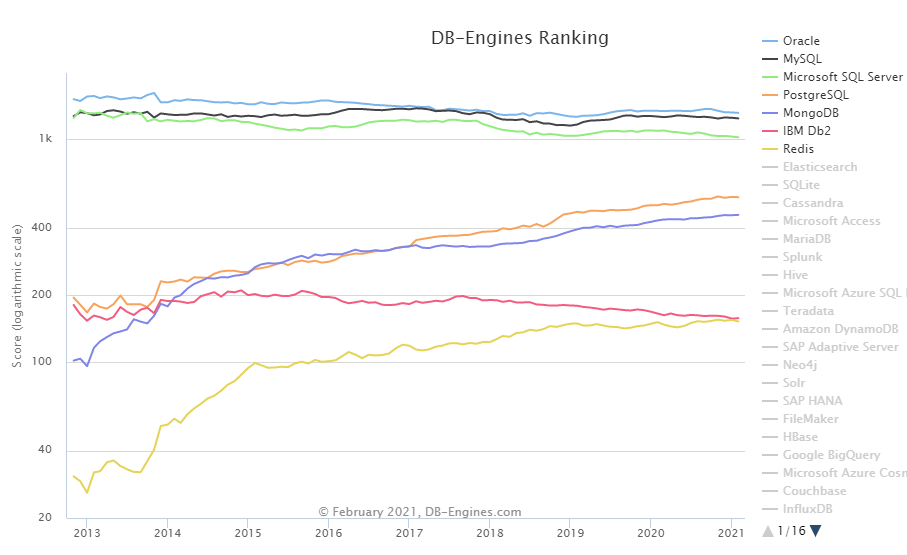
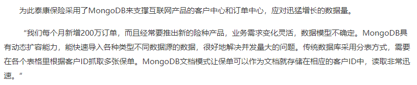
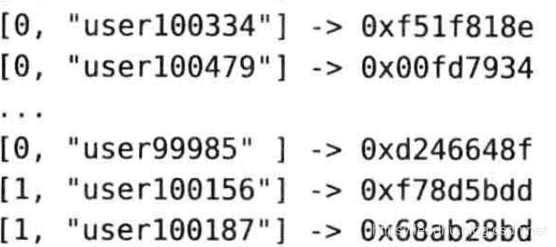
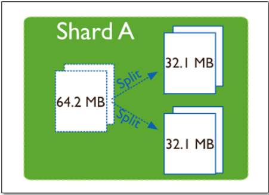
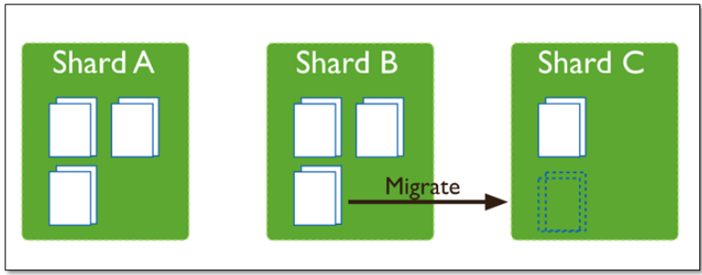
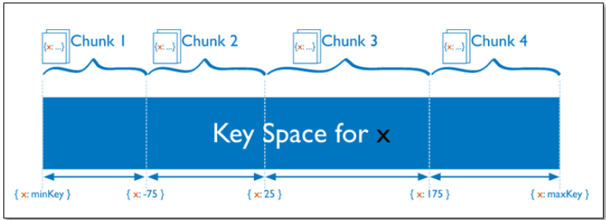
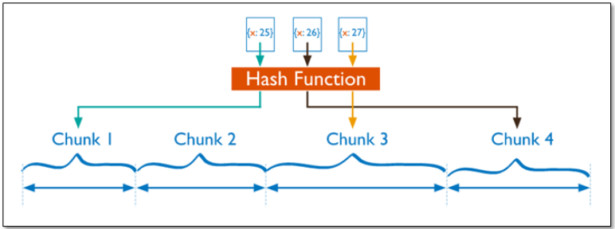

# MongoDB


## 概述

### mongodb是什么

MongoDB是一个基于分布式文件存储 [1] 的数据库。由[C++](https://baike.baidu.com/item/C%2B%2B)语言编写。旨在为WEB应用提供可扩展的高性能数据存储解决方案。

MongoDB是一个介于[关系数据库](https://baike.baidu.com/item/关系数据库)和非关系数据库之间的产品，是非关系数据库当中功能最丰富，最像关系数据库的。它支持的数据结构非常松散，是类似[json](https://baike.baidu.com/item/json)的[bson](https://baike.baidu.com/item/bson)格式，因此可以存储比较复杂的数据类型。Mongo最大的特点是它支持的查询语言非常强大，其语法有点类似于面向对象的查询语言，几乎可以实现类似关系数据库单表查询的绝大部分功能，而且还支持对数据建立[索引](https://baike.baidu.com/item/索引)。

**一句话概括：mongodb是noSQL类型的文档数据库**



### mongodb的优缺点

优点：

1.基于 JSON 的数据模型最接近开发者的面向对象的设计思维；

2.灵活动态的模型意味着在需求多变的时候极大简化数据库设计流程；

3.不需分库分表地实现自动分片、多节点自动同步和跨中心能力支持各种现代化复杂部署需求。

4.在大数据量级，高并发场景下有优势。

5.原生支持地理空间数据的存储，查询


从4.0开始支持事务，从4.2版本开始支持分布式事务，

当前最新版本为4.4版本，发布于2020.9

4.0版本发布于2018.8，4.2版本发布于2019.10。网上关于分布式事务的相关资料几乎没有，基本只能参考官方文档。


### 使用场景

- 网站数据：Mongo 非常适合实时的插入，更新与查询，并具备网站实时数据存储所需的复制及高度伸缩性。

- 缓存：由于性能很高，Mongo 也适合作为信息基础设施的缓存层。在系统重启之后，由Mongo 搭建的持久化缓存层可以避免下层的数据源过载。

- 大尺寸、低价值的数据：使用传统的关系型数据库存储一些数据时可能会比较昂贵，在此之前，很多时候程序员往往会选择传统的文件进行存储。

- 高伸缩性的场景：Mongo 非常适合由数十或数百台服务器组成的数据库，Mongo 的路线图中已经包含对MapReduce 引擎的内置支持。

- 用于对象及JSON 数据的存储：Mongo 的BSON 数据格式非常适合文档化格式的存储及查询。


### 案例分析

国内客户：

- 亚信科技：数据中台产品，实时的数据分析
- 咪咕视频：嵌套文档的便利性

- 东方航空： 在线售票项目，为用户提供个性化的航班搜索服务，支持多目的地搜索、基于预算范围的搜索、城市主题的搜索、灵感语义的搜索、实时的低价日历搜索等。同时，灵活组合中转路径，提高OD航线覆盖率。（2016年的数据）


- 泰康保险：支撑互联网产品的客户中心和订单中心

  

- 招商银行

  

百度百科上列举的数据：

- Craiglist上使用MongoDB的存档数十亿条记录。
- FourSquare，基于位置的社交网站，在Amazon EC2的服务器上使用MongoDB分享数据。
- Shutterfly，以互联网为基础的社会和个人出版服务，使用MongoDB的各种持久性数据存储的要求。
- bit.ly, 一个基于Web的网址缩短服务，使用MongoDB的存储自己的数据。
- spike.com，一个MTV网络的联营公司， spike.com使用MongoDB的。
- Intuit公司，一个为小企业和个人的软件和服务提供商，为小型企业使用MongoDB的跟踪用户的数据。
- sourceforge.net，资源网站查找，创建和发布开源软件免费，使用MongoDB的后端存储。
- etsy.com ，一个购买和出售手工制作物品网站，使用MongoDB。
- 纽约时报，领先的在线新闻门户网站之一，使用MongoDB。
- CERN，著名的粒子物理研究所，欧洲核子研究中心大型强子对撞机的数据使用MongoDB。


## mongodb基础

### 基本概念

与mysql对比理解

| mysql        | mongodb            |
| ------------ | ------------------ |
| database     | database           |
| table（表）  | collection（集合） |
| row（行）    | document（文档）   |
| column（列） | field（字段）      |

### MongoDB的基本使用

#### 安装

下载windowns的二进制包解压即可

配置数据的存储目录（配置文件使用yml格式）

```yaml
storage:
  dbPath: D:\developer\env\mongodb-4.2.11\data\db
```

启动服务指定配置文件

```shell
bin/mongod.exe -f conf/mongo.conf
```

连接客户端

```shell
bin/mongo.exe
// 指定远程地址
bin/mongo.exe  192.168.0.5:9999/foo
```


mongdb新版配置文件说明

https://www.cnblogs.com/lxf1117/p/14267004.html


#### 数据库管理

使用 `show dbs`可以查看数据库

```
show dbs
```

使用use切换数据库，如果数据库不存在，会直接创建。如果在使用时不指定数据库，mongodb默认使用test数据库

```
use database_name
```

mongodb会默认带[三个库](https://blog.csdn.net/qq_42979842/article/details/107105017)：

```
admin   0.000GB
config  0.000GB
local   0.000GB
```

admin库用于存储用户、角色等信息

local库主要存储副本集的元数据信息

config库主要存储分片集群基础信息


删除数据库

```
db.dropDatabase()
```

删除数据库的时候，先使用use切换到指定的库，在执行`db.dropDatabase()`


#### 创建集合

mongodb数据库是无模式的，如果没有特殊要求，不需要提前常见集合。mongodb会根据需要自动创建。

```
db.createCollection(name, options)
```

options中都是可选参数，具体如下：

| 字段   | 类型 | 描述                                                         |
| ------ | ---- | ------------------------------------------------------------ |
| capped | bool | 如果为 true，则创建固定集合。固定集合是指有着固定大小的集合，当达到最大值时，它会自动覆盖最早的文档。<br/>**当该值为 true 时，必须指定 size 参数。** |
| size   | 数值 | 为固定集合指定一个最大值，即字节数。<br/>**如果 capped 为 true，也需要指定该字段。** |
| max    | 数值 | 指定固定集合中包含文档的最大数量。                           |


##### 固定集合

固定集合指的是事先创建，并且大小固定的集合。

固定集合特性：固定集合很像环形队列，如果空间不足，最早的文档就会被删除，为新的文档腾出空间。一般来说，固定集合适用于任何想要自动淘汰过期属性的场景。

创建固定集合

```
db.createCollection(name, {capped:true,size:1000,max:100})
```

- 当集合的大小超过size时，会删除较早的数据。
- 当集合的条数超过max时，会删除较早的数据。


#### 查看集合

```
show collections
```


#### 删除集合

```
db.collection.drop()
```


### BSON

bson是以json格式为基础进行改造，使用二进制形式进行存储，增强了数据遍历速度（保存了元素的长度），增加了数据类型。

这里完全可以把bson看成是支持多数据类型的json

#### json的数据类型：

字符串、数字、对象、数组、布尔、Null


#### bson的数据类型

| 类型 Type                    | 对应数字 Number | 别名 Alias            | 备注 Notes      |
| :--------------------------- | :-------------- | :-------------------- | :-------------- |
| 双精度浮点型Double           | 1               | “double”              |                 |
| 字符串String                 | 2               | “string”              |                 |
| 对象Object                   | 3               | “object”              |                 |
| 数组Array                    | 4               | “array”               |                 |
| 二进制数据Binary data        | 5               | “binData”             |                 |
| 未定义Undefined              | 6               | “undefined”           | 不推荐使用。    |
| 对象编号ObjectId             | 7               | “objectId”            |                 |
| 布尔型Boolean                | 8               | “bool”                |                 |
| 日期Date                     | 9               | “date”                |                 |
| 空值Null                     | 10              | “null”                |                 |
| 正则表达式Regular Expression | 11              | “regex”               |                 |
| DBPointer                    | 12              | “dbPointer”           | 不推荐使用。    |
| JavaScript                   | 13              | “javascript”          |                 |
| Symbol                       | 14              | “symbol”              | 不推荐使用。    |
| JavaScript (带范围)          | 15              | “javascriptWithScope” |                 |
| 32位整数 32-bit integer      | 16              | “int”                 |                 |
| 时间戳 Timestamp             | 17              | “timestamp”           |                 |
| 64位整数 64-bit integer      | 18              | “long”                |                 |
| 小数128 Decimal128           | 19              | “decimal”             | 3.4版的新功能。 |
| 最小键 Min key               | -1              | “minKey”              |                 |
| 最大键 Max key               | 127             | “maxKey”              |                 |


## 基本操作（CRUD）

### Create

插入文档时，如果指定集合不存在，则创建集合

插入文档时，如果没有设置`_id`字段，mongo会自动生成一个`ObjectId`


mongodb提供的插入文档的api

| 函数                       | 说明                               |
| -------------------------- | ---------------------------------- |
| db.collection.insertOne()  | 将单个文档插入到集合中。           |
| db.collection.insertMany() | 将多个文件插入集合中。             |
| db.collection.insert()     | 将单个文档或多个文档插入到集合中。 |

使用示例：

```
db.users.insert({name:"user1",age:10})

db.users.insert([
	{name:"user2",age:20},
	{name:"user3",age:30}
])

db.users.insertOne({"name":"user4",age:40})

db.users.insertMany([
	{name:"user5",age:50},
	{name:"user6",age:60}
])
```


验证：

```
db.users.find({"name":"user1"})

db.users.find({"name":{"$in":["user2","user3"]}})

db.users.find({"name":"user4"})

db.users.find({"name":{"$in":["user5","user6"]}})
```


### Delete


| 方法                       | 说明                                                         |
| -------------------------- | ------------------------------------------------------------ |
| db.collection.deleteOne()  | 即使多个文档可能与指定过滤器匹配，也最多删除一个与指定过滤器匹配的文档。 |
| db.collection.deleteMany() | 删除所有与指定过滤器匹配的文档。                             |
| db.collection.remove()     | 删除单个文档或与指定过滤器匹配的所有文档。                   |

使用示例

```
db.users.remove({"name":"user1"})

db.users.remove({"name":{"$in":["user2","user3"]}})

db.users.deleteOne({"name":{"$in":["user5","user6"]}})

db.users.deleteMany({"name":{"$in":["user5","user6"]}})
```


### Update


#### 方法列表

| 方法                       | 说明                                                         |
| :------------------------- | :----------------------------------------------------------- |
| db.collection.updateOne()  | 即使多个文档可能与指定的过滤器匹配，最多更新与指定的过滤器匹配的单个文档。 |
| db.collection.updateMany() | 更新所有与指定过滤器匹配的文档。                             |
| db.collection.replaceOne() | 即使多个文档可能与指定过滤器匹配，也最多替换一个与指定过滤器匹配的文档。 |
| db.collection.update()     | 更新或替换与指定过滤器匹配的单个文档，或更新与指定过滤器匹配的所有文档。 默认情况下，db.collection.update()方法更新单个文档。 要更新多个文档，请使用**multi**选项。 |


#### 语法说明

update()

```
db.collection.update(
   <query>,
   <update>,
   {
     upsert: <boolean>,
     multi: <boolean>,
     writeConcern: <document>,
     collation: <document>,
     arrayFilters: [ <filterdocument1>, ... ],
     hint:  <document|string>        // Available starting in MongoDB 4.2
   }
)
```

updateOne()

```
db.collection.updateOne(
   <filter>,
   <update>,
   {
     upsert: <boolean>,
     writeConcern: <document>,
     collation: <document>,
     arrayFilters: [ <filterdocument1>, ... ],
     hint:  <document|string>        // Available starting in MongoDB 4.2.1
   }
)
```

updateMany()

```
db.collection.updateMany(
   <filter>,
   <update>,
   {
     upsert: <boolean>,
     writeConcern: <document>,
     collation: <document>,
     arrayFilters: [ <filterdocument1>, ... ],
     hint:  <document|string>        // Available starting in MongoDB 4.2.1
   }
)
```


***options*****参数说明**

options中的参数都是可选的，下面列出参数的功能：

| option           | 说明                                                         |
| ---------------- | ------------------------------------------------------------ |
| upsert <boolean> | 默认为**false**<br />当upsert为**true**时，如果filter没有匹配到文档，则将<update>中的参数保存起来。如果<filter>中参数中指定了id，在保存时使用指定的id，没指定就自动生成一个id。<br />当upsert为**false**时，filter匹配上就更新文档，没匹配上不做任何操作 |
| multi <boolean>  | 默认为false<br />当multi为true时，update操作会更新集合中所有匹配到的文档，<br />当multi为false时，update操作默认只更新集合中匹配到的第一个文档 |
| writeConcern     |                                                              |
| collation        |                                                              |
| arrayFilters     |                                                              |
| hint             | 指定查询时使用的索引                                         |


#### 更新运算符

##### 字段更新运算符

| operator     | 说明                                                         |
| ------------ | ------------------------------------------------------------ |
| $currentDate | 将字段的值设置为当前日期，即日期或时间戳。                   |
| $inc         | 将字段的值增加指定的数量。                                   |
| $min         | 仅当指定值小于现有字段值时才更新该字段。                     |
| $max         | 仅当指定值大于现有字段值时才更新该字段。                     |
| $mul         | 将字段的值乘以指定的数量。                                   |
| $rename      | 重命名字段。                                                 |
| $set         | 设置文档中字段的值。                                         |
| $setOnInsert | 如果更新导致插入文档，则设置字段的值。对修改现有文档的更新操作没有影响。 |
| $unset       | 从文档中删除指定的字段。                                     |

示例：

```javascript
// 不使用操作符，只会简单的替换整个文档
db.users.update({"name":"user4"}, {"username":"test","addr":"beijing"})

db.users.update(
    {"username":"user1"},
    {
    	"$currentDate":{"pron":true,"test.date":{"$type":17}},
        "$set":{"test.desc":"test desc"}
	}
)
db.users.update(
    {"name":"user1"},
	[
        {$set:{"pron":"$$NOW","test.date":"$$CLUSTER_TIME"}}
    ]
)

db.users.update({"name":"user1"},{"$inc":{age:1}})

db.users.update({"name":"user1"},{"$min":{"age":1}})

db.users.update({"name":"user1"},{"$max":{"age":30}})

db.users.update({"username":"user1"},{"$mul":{"age":2}})

db.users.update({"username":"user1"},{"$rename":{"age":"agee"}})

db.users.update({"username":"user1"},{"$set":{"age":10}})

db.users.update({"username":"user111"},{"$set":{"age":11},"$setOnInsert":{"pron":new Date()}})
db.users.update({"name":"user111"},{"$set":{"age":11},"$setOnInsert":{"pron":new Date()}},{"upsert":true})

db.users.update({"username":"user1"},{"$unset":{"agee":""}})
```


##### 数组更新运算符

| operator        | 说明                                                         |
| --------------- | ------------------------------------------------------------ |
| $               | 充当占位符，以更新与查询条件匹配的第一个元素。               |
| $[]             | 充当占位符，以更新匹配查询条件的文档的数组中的所有元素。     |
| $[<identifier>] | 充当占位符，以更新`arrayFilters`与查询条件匹配的文档中所有与条件匹配的元素。 |
| $addToSet       | 仅当元素不存在于集合中时才将它们添加到数组中。               |
| $pop            | 删除数组的第一项或最后一项。                                 |
| $pull           | 删除与指定查询匹配的所有数组元素。                           |
| $push           | 将项目添加到数组。                                           |
| $pullAll        | 从数组中删除所有匹配的值。                                   |


更新修饰符

| 名称      | 说明                                                       |
| --------- | ---------------------------------------------------------- |
| $each     | 修改`$push`和`$addToSet`运算符以附加多个项以进行数组更新。 |
| $position | 修改`$push`运算符以指定要添加元素的数组中的位置。          |
| $slice    | 修改`$push`运算符以限制更新数组的大小。                    |
| $sort     | 修改`$push`运算符以对存储在数组中的文档重新排序。          |


**语法**

```javascript
$
// 针对数组中是元素的情况
db.collection.update(
   { <array>: value ... },
   { <update operator>: { "<array>.$" : value } }
)
// 针对数组中是文档的情况
db.collection.update(
   { <query selector> },
   { <update operator>: { "array.$.field" : value } }
)

$[]
db.collection.updateMany(
   { <query conditions> },
   { <update operator>: { "<array>.$[]" : value } }
)
db.collection.update(
   { <query selector> },
   { <update operator>: { "array.$[].field" : value } }
)

$addToSet

```

示例：

```javascript
// 创建数据
db.users.update(
	{"name":"user1"},
	{"$set":{
        item:[1,2,3,4,5,6],
        book:[
        	{bid:1,name:"aaa",page:300,date:2018},
            {bid:2,name:"bbb",page:400,date:2019},
            {bid:3,name:"ccc",page:500,date:2020},
        ]}
    }
)

// 匹配单一元素（filter匹配多个时，只会更新第一个）
db.users.update({"name":"user1",item:4},{$set:{"item.$":40}})
db.users.update({"name":"user1","book.bid":2},{"$set":{"book.$.page":480}})
db.users.update({"name":"user1","book":{$elemMatch:{page:{$gte: 100}}}},{$set:{"book.$.std": 6}})

// $[] 默认匹配全部元素，可使用arrayFilters进行过滤
db.users.update({"name":"user1"},{$inc:{"item.$[]":1}})
db.users.update({"name":"user1"},{$inc:{"book.$[].page":1}})
db.users.update({"name":"user1"},{$inc:{"book.$[bok].page":1}},
                {arrayFilters:[{"bok.date":{$lte:2019}}]})

// $addToSet(添加多元素时，要用$each修饰一下)
db.users.update({"name":"user1"},{$addToSet:{item:5}})
db.users.update({"name":"user1"},{$addToSet:{item:{$each:[10, 11, 12]}}})

// $pop 从数组头或尾删除一个元素
db.users.update({"name":"user1"},{$pop:{"item":-1}})

//$pull 把所有匹配的都删除
db.users.update({"name":"user1"},{$pull:{item:11}})
db.users.update({"name":"user1"},{$pull:{item:{$in:[12,10]}}})

db.users.update({"name":"user1"},{$pullAll:{item:[20,28,40]}})

// $push
db.users.update({"name":"user1"},{$push:{item:{
    $each:[1,4,100,20,19,28,40,20,16],
    $sort:-1,
    $slice:10
}}})
```


##### 按位更新运算符

| 名称 | 说明                                     |
| ---- | ---------------------------------------- |
| $bit | 执行按位`AND`，`OR`和`XOR`整数值的更新。 |

语法

```
{ $bit: { <field>: { <and|or|xor>: <int> } } }
```

示例：

```
{ _id: 1, expdata: NumberInt(13) }
===============================================
db.switches.update(
   { _id: 1 },
   { $bit: { expdata: { and: NumberInt(10) } } }
)
================================================
1101
1010
----
1000
```


### Retrieve

#### 方法列表

```
db.users.find()               
db.users.findOne()            
db.users.findOneAndReplace()
db.users.findAndModify()     
db.users.findOneAndDelete() 
db.users.findOneAndUpdate()
```


#### 语法说明

```
db.collections.find(
	<query>,
	<projection>
) 
```

参数说明：

| 参数         | 类型     | 描述                                                         |
| :----------- | :------- | :----------------------------------------------------------- |
| `query`      | document | 可选的。使用query operators指定选择过滤器。要 return 集合中的所有文档，请省略此参数或传递空文档(`{}`)。 |
| `projection` | document | 可选的。指定_retch 查询过滤器的文档中的 return 字段。要_retret 匹配文档中的所有字段，请省略此参数。有关详细信息，请参阅投影。 |

#### 运算符

##### 比较运算符

| 名称 | 结果                       |
| ---- | -------------------------- |
| $eq  | 匹配等于指定值的值。       |
| $ne  | 匹配所有不等于指定值的值。 |
| $gt  | 匹配大于指定值的值         |
| $gte | 匹配大于或等于指定值的值。 |
| $lt  | 匹配小于指定值的值。       |
| $lte | 匹配小于或等于指定值的值。 |
| $in  | 匹配数组中指定的任何值。   |
| $nin | 不匹配数组中指定的任何值。 |

示例：

```
db.users.find({"name":{"$eq":"user1"}})

db.users.find({"age":{"$lt":50,"$gte":20}})

....
```

##### 逻辑运算符

| 名称 | 描述                                                         |
| ---- | ------------------------------------------------------------ |
| $and | 使用逻辑`AND`连接查询子句，返回与这两个子句条件匹配的所有文档。 |
| $not | 反转查询表达式的效果，并返回与查询表达式*不*匹配的文档。     |
| $nor | 用逻辑`NOR`连接查询子句，返回所有不能匹配这两个子句的文档。  |
| $or  | 用逻辑`OR`连接查询子句，返回与任一子句条件匹配的所有文档。   |

示例：

```
db.users.find({"$and":[{"name":{"$ne":"user1"}},{"age":{"$lte":60}}]})

// not的参数只能使用正则或者document
db.users.find({"name":{"$not":{$eq:"user1"}}})
```

##### 元素

| 名称    | 描述                             |
| ------- | -------------------------------- |
| $exists | 匹配具有指定字段的文档。         |
| $type   | 如果字段是指定类型，则选择文档。 |

##### 数组

| 名称       | 描述                                                         |
| ---------- | ------------------------------------------------------------ |
| $all       | 匹配包含查询中指定的所有元素的数组。                         |
| $elemMatch | 如果array字段中的元素符合所有指定`$elemMatch`条件，则选择文档。 |
| $size      | 如果数组字段为指定大小，则选择文档。                         |

##### 按位

| 名称          | 描述                                                         |
| ------------- | ------------------------------------------------------------ |
| $bitsAllClear | 匹配数字或二进制值，其中一组位的*所有*值均为`0`。            |
| $bitsAllSet   | 匹配数字或二进制值，其中一组位的*所有*值均为`1`。            |
| $bigsAnyClear | 匹配数值或二进制值，在这些数值或二进制值中，一组位的位置中*任何*位的值为`0`。 |
| $bigsAnySet   | 匹配数值或二进制值，在这些数值或二进制值中，一组位的位置中*任何*位的值为`1`。 |

##### 映射运算符

| 名称       | 描述                                              |
| ---------- | ------------------------------------------------- |
| $          | 数组中匹配查询条件的第一个元素。                  |
| $elemMatch | 符合指定$elemMatch条件的数组中的第一个元素。      |
| $meta      | 项目在$text操作期间分配的文档分数。               |
| $slice     | 限制从数组中投影的元素数量。支持`limit`和`skip`。 |


#### 基本查询

```
// 通过条件过滤
db.inventory.find({qty:25})

// 指定多个条件
db.inventory.find({qty:25, item: "journal"})

// 多条件查询
db.inventory.find( { status: "A", qty: { $lt: 30 } } )

// 使用逻辑运算符：$in
db.inventory.find({item: {$in : ["canvas","mat"] }})

// 使用逻辑运算符：$or
db.inventory.find({$or :[{qty: 25}, {item: "mat"}]})

// 复合条件查询，支持正则
db.inventory.find( {
     status: "A",
     $or: [ { qty: { $lt: 30 } }, { item: /^p/ } ]
} )
```


#### 限制返回的字段

可以通过第二个参数来限制返回的字段

- 1：标识包含，0：标识排除
- _id字段默认包含，要排除需要显示指定
- 可以使用包含方式，或者排除方式


测试数据：

```
db.inventory.insertMany( [ 
    { item: "journal", status: "A", size: { h: 14, w: 21, uom: "cm" }, instock: [ { warehouse: "A", qty: 5 } ] },
    { item: "notebook", status: "A",  size: { h: 8.5, w: 11, uom: "in" }, instock: [ { warehouse: "C", qty: 5 } ] },
    { item: "paper", status: "D", size: { h: 8.5, w: 11, uom: "in" }, instock: [ { warehouse: "A", qty: 60 } ] },
    { item: "planner", status: "D", size: { h: 22.85, w: 30, uom: "cm" }, instock: [ { warehouse: "A", qty: 40 } ] },
    { item: "postcard", status: "A", size: { h: 10, w: 15.25, uom: "cm" }, instock: [ { warehouse: "B", qty: 15 }, { warehouse: "C", qty: 35 } ] }
]);
```


```
// 通过第二个参数来限制返回的字段，1：返回，0：不返回，_id字段时默认返回的，若要禁止需要显示设置
db.inventory.find({"instock.qty":25}, {item:1,"instock.qty":1})
// 禁止_id字段
db.inventory.find({qty:25}, {item:1,qty:1,_id:0})

// 指定嵌套的字段
db.inventory.find( { status: "A" }, { item: 1, status: 1, "size.uom": 1 })

// 返回除了被排除的字段之外的所有字段
db.inventory.find( { status: "A" }, { status: 0, instock: 0 } )

// 禁止嵌入文档中的特定字段
db.inventory.find( { status: "A" },{ "size.uom": 0 })

// 数组中嵌入式文档的
db.inventory.find( { status: "A" }, { item: 1, status: 1, "instock.qty": 1 } )

/**
 * 数组切片
 * $slice: 1  正序返回一个，负数表示倒序返回
 * $slice: [20, 10]  从第20个开始，返回10个元素
 */
db.inventory.find( { status: "A" }, { item: 1, status: 1, instock: { $slice: -1 } } )

```


#### 查询空字段

测试数据

```
db.inventory.insertMany([
   { _id: 1, item: null },
   { _id: 2 }
])
```

示例：

```
// {item：null}查询匹配包含值是null的item字段或不包含item字段的文档。
db.inventory.find( { item: null } )

// {item：{$ type：10}}查询只匹配包含item字段值为null的文档； 即item字段的值为BSON Type为Null（类型编号10）
db.inventory.find( { item : { $type: 10 } } )

// {item：{$ exists：false}}查询与不包含item字段的文档匹配：
db.inventory.find( { item : { $exists: false } } )
```


#### 查询数组（数组元素是值的情况）

测试数据：

```
db.inventory.insertMany([
    { item: "journal", qty: 25, tags: ["blank", "red"], dim_cm: [ 14, 21 ] }, 
    { item: "notebook", qty: 50, tags: ["red", "blank"], dim_cm: [ 14, 21 ] },
    { item: "paper", qty: 100, tags: ["red", "blank", "plain"], dim_cm: [ 14, 21 ] },
    { item: "planner", qty: 75, tags: ["blank", "red"], dim_cm: [ 22.85, 30 ] },  
    { item: "postcard", qty: 45, tags: ["blue"], dim_cm: [ 10, 15.25 ] }
]);
```

示例：

```
// 顺序必须完全一致
db.inventory.find( { tags: ["red", "blank"] } )
// 找到一个同时包含元素“ red”和“ blank”的数组
db.inventory.find( { tags: { $all: ["red", "blank"] } } )
// tag是一个包含字符串“ red”作为其元素之一的数组
db.inventory.find( { tags: "red" } )
// 查询数组dim_cm包含至少一个值大于25的元素的所有文档。
db.inventory.find( { dim_cm: { $gt: 25 } } )

// 只要存在元素大于15，小于20即可，不一定是同一个
db.inventory.find( { dim_cm: { $gt: 15, $lt: 20 } } )
//查询在dim_cm数组中包含至少一个同时大于($gt)22和小于 ($lt) 30的元素的文档
db.inventory.find( { dim_cm: { $elemMatch: { $gt: 22, $lt: 30 } } } )
// 指定数组的索引
db.inventory.find( { "dim_cm.1": { $gt: 25 } } )
// 选择数组tags具有3个元素的文档
db.inventory.find( { "tags": { $size: 3 } } )
```


#### 查询数组（数组元素是文档的情况）

创建测试数据

```
db.inventory.insertMany( [
    { item: "journal", instock: [ { warehouse: "A", qty: 5 }, { warehouse: "C", qty: 15 } ] },  
    { item: "notebook", instock: [ { warehouse: "C", qty: 5 } ] },
    { item: "paper", instock: [ { warehouse: "A", qty: 60 }, { warehouse: "B", qty: 15 } ] },
    { item: "planner", instock: [ { warehouse: "A", qty: 40 }, { warehouse: "B", qty: 5 } ] }, 
    { item: "postcard", instock: [ { warehouse: "B", qty: 15 }, { warehouse: "C", qty: 35 } ] }
]);
```

示例：

```
// 查询数组中的元素与指定文档匹配的所有文档（要求完全匹配，包括顺序）
db.inventory.find( { "instock": { warehouse: "A", qty: 5 } } )
// 错误示例， 顺序不对时查询不到的
db.inventory.find( { "instock": { qty: 5, warehouse: "A" } } )

// 指定查询条件(数组内只有由一条数据符合就可以)
db.inventory.find( {'instock.qty': { $lte: 20 }}, {instock:1} )

// 可以指定数组索引
db.inventory.find( {'instock.0.qty': { $lte: 20 }}, {instock:1})

// $elemMatch  指定多条件
db.inventory.find( { "instock": { $elemMatch: { qty: 5, warehouse: "A" } } } )
db.inventory.find( { "instock": { $elemMatch: { qty: { $gt: 10, $lte: 20 } } } } )

//元素组合满足标准
db.inventory.find( { "instock.qty": { $gt: 10,  $lte: 20 } } )
db.inventory.find( { "instock.qty": 5, "instock.warehouse": "A" } )

```


#### 查询嵌套文档

测试数据：

```
db.inventory.insertMany( [
    { item: "journal", qty: 25, size: { h: 14, w: 21, uom: "cm" }, status: "A" },
    { item: "notebook", qty: 50, size: { h: 8.5, w: 11, uom: "in" }, status: "A" },
    { item: "paper", qty: 100, size: { h: 8.5, w: 11, uom: "in" }, status: "D" },
    { item: "planner", qty: 75, size: { h: 22.85, w: 30, uom: "cm" }, status: "D" },
    { item: "postcard", qty: 45, size: { h: 10, w: 15.25, uom: "cm" }, status: "A" }
]);
```


示例：

```
// 查询字段size等于文档{h：14，w：21，uom：“ cm”}的所有文档,包括字段顺序
db.inventory.find( { size: { h: 14, w: 21, uom: "cm" } } )

db.inventory.find( { "size.uom": "in" } )

db.inventory.find( { "size.h": { $lt: 15 } } )

db.inventory.find( { "size.h": { $lt: 15 }, "size.uom": "in", status: "D" } )
```


## MongoDB 聚合

聚合操作处理数据记录和 return 计算结果。聚合操作将来自多个文档的值组合在一起，并且可以对分组数据执行各种操作以返回单个结果。 MongoDB 提供了三种执行聚合的方法：聚合管道，map-reduce function和单一目的聚合方法

### 聚合管道

聚合管道是用于数据聚合的框架，其模型基于数据处理管道的概念。文档进入多阶段管道，将文档转换为聚合结果。

下面给出一个简单的例子

```
db.users.aggregate([
	{$match:{"gender":0}},
	{$group:{_id:"$age",count:{$sum:1}}}
])
```

可以将聚合管道类比为Java中的流计算

### 管道操作符

#### $match

$match主要用于对集合中文档的筛选

#### $project

$project可以提取字段，重命名字段，包含或排除字段，还可以组合和嵌套操作符，是一个很强大的操作符。

**管道表达式**

简单的包含和排除字段

```
db.users.aggregate({
	$project:{"userId":"$_id", "_id":0, "name":1}
})
```

**数学表达式**

- $add:[expr1,[expr2...exprN]]

接收多个参数，求和

- $subtract:[expr1,expr2]

接收两个参数，expr1-expr2

- $multiply:[expr1,[expr2...exprN]]

接收多个参数，相乘

- $divide:[expr1,expr2]

接收两个参数，求商

- $mod:[expr1,expr2]

接收两个参数，取余


**日期表达式**

表达式可以从日期类型的字段中提取日期

$year

$month

$week

$dayOfMonth

$dayOfWeek

$dayOfYear

$hour

$minute

$second

```
db.users.aggregate({
	$project:{"day":{$month:new Date("2021-04-01")}}
})
```

**字符串表达式**

- $substr: [expr, startOffset, numToReturn]

expr必须是字符串，从startOffset字节开始，numToReturn个字节返回。

- $concat: [expr1, [expr2, ..., exprN]]

连接字符串

- $toLower: expr

转小写

- $toUpper: epxr

转大写


**逻辑表达式**

$cmp: [expr1, expr2]

比较expr1与expr2，expr1=expr2 返回0，expr1<expr2 返回负数，expr1>expr2 返回正数，

$strcasecmp: [string1, string2]

$eq/$ne/$gt/$gte/$lt/$lte/ : [expr1, expr2]

比较expr1与expr2，返回true或false

$and: [expr1, [expr2, ..., exprN]]   与

$or: [expr1, [expr2, ..., exprN]]   或

$not: epxr   取反

$cond: [booleanExpr, trueExpr, falseExpr]  类似三目运算

$ifNull: [expr, replacementExpr]  如果expr为空，返回replacementExpr，否则返回expr


示例：

```
// 测试数据
{
  "_id" : 1,
  title: "abc123",
  isbn: "0001122223334",
  author: { last: "zzz", first: "aaa" },
  copies: 5,
  lastModified: "2016-07-28"
}
{
  "_id" : 2,
  title: "Baked Goods",
  isbn: "9999999999999",
  author: { last: "xyz", first: "abc", middle: "" },
  copies: 2,
  lastModified: "2017-07-21"
}
{
  "_id" : 3,
  title: "Ice Cream Cakes",
  isbn: "8888888888888",
  author: { last: "xyz", first: "abc", middle: "mmm" },
  copies: 5,
  lastModified: "2017-07-22"
}

// 示例
db.books.aggregate( [
   {
      $project: {
         title: 1,
         "author.first": 1,
         "author.last" : 1,
         "author.middle": {
            $cond: {
               if: { $eq: [ "", "$author.middle" ] },
               then: "$$REMOVE",
               else: "$author.middle"
            }
         }
      }
   }
] )

// 示例
db.books.aggregate(
   [
      {
         $project: {
            title: 1,
            isbn: {
               prefix: { $substr: [ "$isbn", 0, 3 ] },
               group: { $substr: [ "$isbn", 3, 2 ] },
               publisher: { $substr: [ "$isbn", 5, 4 ] },
               title: { $substr: [ "$isbn", 9, 3 ] },
               checkDigit: { $substr: [ "$isbn", 12, 1] }
            },
            lastName: "$author.last",
            copiesSold: "$copies"
         }
      }
   ]
)
```


#### $group

分组函数

$group阶段限制的内存大小为100MB，如果数据超过100MB就会报错，可以通过修改allowdiskuse选项来允许处理大型数据集


语法

```
{
  $group:
    {
      _id: <expression>, // Group By Expression
      <field1>: { <accumulator1> : <expression1> },
      ...
    }
 }
```

_id  字段可以是字段或文档

参数列表：

| Name                                                         | Description                                                  |
| :----------------------------------------------------------- | :----------------------------------------------------------- |
| [`$accumulator`](https://docs.mongodb.com/manual/reference/operator/aggregation/accumulator/#grp._S_accumulator) | 返回用户定义的累加器函数的结果（类似UDAF函数）               |
| [`$addToSet`](https://docs.mongodb.com/manual/reference/operator/aggregation/addToSet/#grp._S_addToSet) | Returns an array of *unique* expression values for each group. Order of the array elements is undefined. |
| [`$avg`](https://docs.mongodb.com/manual/reference/operator/aggregation/avg/#grp._S_avg) | 计算平均值，忽略非数值元素                                   |
| [`$first`](https://docs.mongodb.com/manual/reference/operator/aggregation/first/#grp._S_first) | 返回数组中的第一个值，通常情况下先排序。                     |
| [`$last`](https://docs.mongodb.com/manual/reference/operator/aggregation/last/#grp._S_last) | 返回数组中的最后一个值，通常情况下先排序                     |
| [`$max`](https://docs.mongodb.com/manual/reference/operator/aggregation/max/#grp._S_max) | 返回group中的最大值                                          |
| [`$mergeObjects`](https://docs.mongodb.com/manual/reference/operator/aggregation/mergeObjects/#exp._S_mergeObjects) | Returns a document created by combining the input documents for each group. |
| [`$min`](https://docs.mongodb.com/manual/reference/operator/aggregation/min/#grp._S_min) | 返回group中的最小值                                          |
| [`$push`](https://docs.mongodb.com/manual/reference/operator/aggregation/push/#grp._S_push) | Returns an array of expression values for each group.        |
| [`$stdDevPop`](https://docs.mongodb.com/manual/reference/operator/aggregation/stdDevPop/#grp._S_stdDevPop) | Returns the population standard deviation of the input values. |
| [`$stdDevSamp`](https://docs.mongodb.com/manual/reference/operator/aggregation/stdDevSamp/#grp._S_stdDevSamp) | Returns the sample standard deviation of the input values.   |
| [`$sum`](https://docs.mongodb.com/manual/reference/operator/aggregation/sum/#grp._S_sum) | 对group中的所有元素求和，忽略非数值元素                      |


$group示例

```
// 测试数据
db.sales.insertMany([
  { "_id" : 1, "item" : "abc", "price" : NumberDecimal("10"), "quantity" : NumberInt("2"), "date" : ISODate("2014-03-01T08:00:00Z") },
  { "_id" : 2, "item" : "jkl", "price" : NumberDecimal("20"), "quantity" : NumberInt("1"), "date" : ISODate("2014-03-01T09:00:00Z") },
  { "_id" : 3, "item" : "xyz", "price" : NumberDecimal("5"), "quantity" : NumberInt( "10"), "date" : ISODate("2014-03-15T09:00:00Z") },
  { "_id" : 4, "item" : "xyz", "price" : NumberDecimal("5"), "quantity" :  NumberInt("20") , "date" : ISODate("2014-04-04T11:21:39.736Z") },
  { "_id" : 5, "item" : "abc", "price" : NumberDecimal("10"), "quantity" : NumberInt("10") , "date" : ISODate("2014-04-04T21:23:13.331Z") },
  { "_id" : 6, "item" : "def", "price" : NumberDecimal("7.5"), "quantity": NumberInt("5" ) , "date" : ISODate("2015-06-04T05:08:13Z") },
  { "_id" : 7, "item" : "def", "price" : NumberDecimal("7.5"), "quantity": NumberInt("10") , "date" : ISODate("2015-09-10T08:43:00Z") },
  { "_id" : 8, "item" : "abc", "price" : NumberDecimal("10"), "quantity" : NumberInt("5" ) , "date" : ISODate("2016-02-06T20:20:13Z") },
])

// 计算文档总数
db.sales.aggregate( [
  {
    $group: {
       _id: null,
       count: { $sum: 1 }
    }
  }
] )
// 计算销售个总量大于100的item
db.sales.aggregate(
  [
    // First Stage
    {
      $group :
        {
          _id : "$item",
          totalSaleAmount: { $sum: { $multiply: [ "$price", "$quantity" ] } }
        }
     },
     // Second Stage
     {
       $match: { "totalSaleAmount": { $gte: 100 } }
     }
   ]
 )

// 按日期分组
db.sales.aggregate([
  // First Stage
  {
    $match : { "date": { $gte: new ISODate("2014-01-01"), $lt: new ISODate("2015-01-01") } }
  },
  // Second Stage
  {
    $group : {
       _id : { $dateToString: { format: "%Y-%m-%d", date: "$date" } },
       totalSaleAmount: { $sum: { $multiply: [ "$price", "$quantity" ] } },
       averageQuantity: { $avg: "$quantity" },
       count: { $sum: 1 }
    }
  },
  // Third Stage
  {
    $sort : { totalSaleAmount: -1 }
  }
 ])

// 结果
{ "_id" : "2014-04-04", "totalSaleAmount" : NumberDecimal("200"), "averageQuantity" : 15, "count" : 2 }
{ "_id" : "2014-03-15", "totalSaleAmount" : NumberDecimal("50"), "averageQuantity" : 10, "count" : 1 }
{ "_id" : "2014-03-01", "totalSaleAmount" : NumberDecimal("40"), "averageQuantity" : 1.5, "count" : 2 }

```


#### $unwind

将数组中的每一个值拆分为独立的文档。

语法

```
{
  $unwind:
    {
      path: <field path>,
      includeArrayIndex: <string>,  // 添加数组索引
      preserveNullAndEmptyArrays: <boolean> // 保留不包含path，或path为null的值
    }
}
```

示例：

```
// 插入数据
db.inventory.insertOne({ "_id" : 1, "item" : "ABC1", sizes: [ "S", "M", "L"] })
// 拆分
db.inventory.aggregate( [ { $unwind : "$sizes" } ] )
db.inventory2.aggregate( [ { $unwind: { path: "$sizes" } } ] )

// 结果
{ "_id" : 1, "item" : "ABC1", "sizes" : "S" }
{ "_id" : 1, "item" : "ABC1", "sizes" : "M" }
{ "_id" : 1, "item" : "ABC1", "sizes" : "L" }


db.inventory2.insertMany([
  { "_id" : 1, "item" : "ABC", price: NumberDecimal("80"), "sizes": [ "S", "M", "L"] },
  { "_id" : 2, "item" : "EFG", price: NumberDecimal("120"), "sizes" : [ ] },
  { "_id" : 3, "item" : "IJK", price: NumberDecimal("160"), "sizes": "M" },
  { "_id" : 4, "item" : "LMN" , price: NumberDecimal("10") },
  { "_id" : 5, "item" : "XYZ", price: NumberDecimal("5.75"), "sizes" : null }
])

// 添加数组索引
db.inventory2.aggregate( [
  {
    $unwind:
      {
        path: "$sizes",
        includeArrayIndex: "arrayIndex"
      }
   }
])

{ "_id" : 1, "item" : "ABC", "price" : NumberDecimal("80"), "sizes" : "S", "arrayIndex" : NumberLong(0) }
{ "_id" : 1, "item" : "ABC", "price" : NumberDecimal("80"), "sizes" : "M", "arrayIndex" : NumberLong(1) }
{ "_id" : 1, "item" : "ABC", "price" : NumberDecimal("80"), "sizes" : "L", "arrayIndex" : NumberLong(2) }
{ "_id" : 3, "item" : "IJK", "price" : NumberDecimal("160"), "sizes" : "M", "arrayIndex" : null }


// 保留空值
db.inventory2.aggregate( [
   { $unwind: { path: "$sizes", preserveNullAndEmptyArrays: true } }
] )

{ "_id" : 1, "item" : "ABC", "price" : NumberDecimal("80"), "sizes" : "S" }
{ "_id" : 1, "item" : "ABC", "price" : NumberDecimal("80"), "sizes" : "M" }
{ "_id" : 1, "item" : "ABC", "price" : NumberDecimal("80"), "sizes" : "L" }
{ "_id" : 2, "item" : "EFG", "price" : NumberDecimal("120") }
{ "_id" : 3, "item" : "IJK", "price" : NumberDecimal("160"), "sizes" : "M" }
{ "_id" : 4, "item" : "LMN", "price" : NumberDecimal("10") }
{ "_id" : 5, "item" : "XYZ", "price" : NumberDecimal("5.75"), "sizes" : null }

```


#### $sort

根据字段排序

语法

```
{ $sort: { <field1>: <sort order>, <field2>: <sort order> ... } }
```

示例

```
db.restaurants.insertMany( [
   { "_id" : 1, "name" : "Central Park Cafe", "borough" : "Manhattan"},
   { "_id" : 2, "name" : "Rock A Feller Bar and Grill", "borough" : "Queens"},
   { "_id" : 3, "name" : "Empire State Pub", "borough" : "Brooklyn"},
   { "_id" : 4, "name" : "Stan's Pizzaria", "borough" : "Manhattan"},
   { "_id" : 5, "name" : "Jane's Deli", "borough" : "Brooklyn"},
] );

db.restaurants.aggregate(
   [
     { $sort : { borough : 1 } }
   ]
)
// 注意， 当两条数据具有相同值时，排序可能不同
{ "_id" : 3, "name" : "Empire State Pub", "borough" : "Brooklyn" }
{ "_id" : 5, "name" : "Jane's Deli", "borough" : "Brooklyn" }
{ "_id" : 1, "name" : "Central Park Cafe", "borough" : "Manhattan" }
{ "_id" : 4, "name" : "Stan's Pizzaria", "borough" : "Manhattan" }
{ "_id" : 2, "name" : "Rock A Feller Bar and Grill", "borough" : "Queens" }

```


#### $limit

返回结果集中的前n个文档

语法

```
{ $limit: <positive integer> }
```


```
db.restaurants.aggregate([
   { $limit : 2 }
]);
```


#### $skip

跳过结果集中的前n个文档

语法

```
{ $skip: <positive integer> }
```

示例：

```
db.restaurants.aggregate([
   { $skip : 2 }
]);
```


## MongoDB Map-Reduce

基本语法

```
db.collection.mapReduce(
   function() {emit(key,value);},  //map 函数
   function(key,values) {return reduceFunction},   //reduce 函数
   {
      out: collection,
      query: document,
      sort: document,
      limit: number
   }
)
```

使用 MapReduce 要实现两个函数 Map 函数和 Reduce 函数,Map 函数调用 emit(key, value), 遍历 collection 中所有的记录, 将 key 与 value 传递给 Reduce 函数进行处理。

Map 函数必须调用 emit(key, value) 返回键值对。

参数说明

- **map** ：映射函数 (生成键值对序列,作为 reduce 函数参数)。
- **reduce** 统计函数，reduce函数的任务就是将key-values变成key-value，也就是把values数组变成一个单一的值value。。
- **out** 统计结果存放集合 (不指定则使用临时集合,在客户端断开后自动删除)。
- **query** 一个筛选条件，只有满足条件的文档才会调用map函数。（query。limit，sort可以随意组合）
- **sort** 和limit结合的sort排序参数（也是在发往map函数前给文档排序），可以优化分组机制
- **limit** 发往map函数的文档数量的上限（要是没有limit，单独使用sort的用处不大）


示例：


## MongoDB GridFS

GridFS会将文件切分为一个个的小块(chunk)，并单独的保存到集合中。块儿的大小默认为255K


GridFS使用两个集合存储文件

- chunks：存储二进制块
- files：存储文件的元数据信息


### chunks

chunks中存储的schema

```
{
  "_id" : <ObjectId>,
  "files_id" : <ObjectId>,
  "n" : <num>,
  "data" : <binary>
}
```

- chunks._id

The unique ObjectId of the chunk.

- chunks.files_id

The _id of the “parent” document, as specified in the files collection.

- chunks.n

The sequence number of the chunk. GridFS numbers all chunks, starting with 0.

- chunks.data

The chunk’s payload as a BSON Binary type.


### files

```
{
  "_id" : <ObjectId>,
  "length" : <num>,
  "chunkSize" : <num>,
  "uploadDate" : <timestamp>,
  "md5" : <hash>,
  "filename" : <string>,
  "contentType" : <string>,
  "aliases" : <string array>,
  "metadata" : <any>,
}
```


## MongoDB 安全


## MongoDB 索引

建立测试数据

```javascript
for (i=0;i<100000;i++){
	db.users.insert(
    	{
            "i":i,
            "username":"user"+i,
            "gender":Math.floor(Math.random()*2),
            "age":Math.floor(Math.random()*120),
            "created":new Date()
        }
    );
}
```

如果没有索引，mongodb在查询时需要执行集合扫描，当数据量过大时会带来性能问题。建立有效的索引，会提升查询性能。


### 基础


#### 默认索引

mongodb默认在_id字段上创建索引，并且不能删除。

#### 索引管理

**创建索引**

创建索引时可以指定排序规则：1：升序排序，-1：降序排序

```
db.collection.createIndex({"username":1,"age":-1})
```

**索引名称**

索引名称默认使用key+valye形式，多字段索引使用`_`链接

上面创建的索引默认为：`username1_age-1`

可以通过参数的形式指定索引名称

```
db.collection.createIndex({"username":1,"age":-1}, {"name":"special"})
```

**删除索引**

_id字段上的索引不能删除

不加参数时删除集合上的全部索引

```
db.collection.dropIndexes()
```

参数可以时索引文档或索引名称或字符数组，例如：

```
db.collection.dropIndexes({"username":1,"age":-1})
db.collection.dropIndexes("username1_age-1")
// 删除索引时使用数组指定
db.collection.dropIndexes(["username1_age-1"])
```


**获取索引**

获取文档的全部索引

```
db.collection.getIndexes()
```


**重建索引**

```
db.collection.reIndex()
```


#### 索引类型

##### 单值索引

在创建索引时，指定单个字段，例如

```
db.collection.createIndex({"username":1})
```

在单个字段上进行索引。对单个索引的排序顺序并不重要，因为Mongodb可以从任何方向上进行遍历索引

##### 复合索引

在创建索引时，指定多个字段，例如：

```
db.collection.createIndex({"username":1,"age":-1})
```

复合索引的数据结构如下：



所以，在创建复合索引时，索引字段的顺序，以及字段的排序顺序都是需要考虑的。不过mongoDB在遍历索引时可以正序遍历，也可以倒叙遍历，所以{"username":1,"age":-1}和{"username":-1,"age":1}的顺序可以看作时相同的索引。

**索引前缀**

索引前缀时复合索引的开始子集，例如由如下索引：

```
db.collection.createIndex({"username":1,"age":-1,"created":1})
```

包含以下索引前缀：

- {"username":1}
- {"username":1,"age":-1}
- {"username":1,"age":-1,"created":1}

在查询username字段、username and age 字段以及 username and age and created 字段时，可以使用这个索引。

在查询username and created 字段时，也可以使用这个索引，但是性能没有前面的查询高。

在查询age、created、age and created 字段时无法使用这个索引。


##### 多键索引


##### 地理空间索引

##### 文本索引

##### Hashed索引


#### 索引交集

mongodb可以使用索引的交集来完成查询。例如users集合有以下索引：

```
{"username":1}
{"age":"1"}
```

mongodb可以用来支持一下的查询：

```
db.users.find({"username":"user1",age:{"$gt":20}})
```


> 索引前缀交集
>
> 索引交集和复合索引


**索引交集和排序**

当索引和查询谓词完全分开时，索引交集不适用


### 单值索引

建立索引

```
db.users.createIndex({"username":1})
```

查询语句

```
db.users.find({"username":"user101"}).explain("executionStats")
```

查询分析

```
{
    "queryPlanner" : {
        "plannerVersion" : 1,
        "namespace" : "test.users",
        "indexFilterSet" : false,
        "parsedQuery" : {
            "username" : {
                "$eq" : "user101"
            }
        },
        "winningPlan" : {
            "stage" : "FETCH",
            // 子阶段
            "inputStage" : {
                // 索引扫描
                "stage" : "IXSCAN",
                // 该执行计划扫描的索引
                "keyPattern" : {
                    "username" : 1
                },
                // 索引名称
                "indexName" : "username_1",
                // 是否为Multikey，如果索引建立在array字段上，返回true
                "isMultiKey" : false,
                "multiKeyPaths" : {
                    "username" : [ ]
                },
                "isUnique" : false,
                "isSparse" : false,
                "isPartial" : false,
                "indexVersion" : 2,
                "direction" : "forward",
                // 扫描的索引范围
                "indexBounds" : {
                    "username" : [
                        "[\"user101\", \"user101\"]"
                    ]
                }
            }
        },
        "rejectedPlans" : [ ]
    },
    "executionStats" : {
        "executionSuccess" : true,
        "nReturned" : 1,
        "executionTimeMillis" : 0,
        "totalKeysExamined" : 1,
        "totalDocsExamined" : 1,
        "executionStages" : {
            "stage" : "FETCH",
            "nReturned" : 1,
            "executionTimeMillisEstimate" : 0,
            "works" : 2,
            "advanced" : 1,
            "needTime" : 0,
            "needYield" : 0,
            "saveState" : 0,
            "restoreState" : 0,
            "isEOF" : 1,
            "docsExamined" : 1,
            "alreadyHasObj" : 0,
            "inputStage" : {
                "stage" : "IXSCAN",
                "nReturned" : 1,
                "executionTimeMillisEstimate" : 0,
                "works" : 2,
                "advanced" : 1,
                "needTime" : 0,
                "needYield" : 0,
                "saveState" : 0,
                "restoreState" : 0,
                "isEOF" : 1,
                "keyPattern" : {
                    "username" : 1
                },
                "indexName" : "username_1",
                "isMultiKey" : false,
                "multiKeyPaths" : {
                    "username" : [ ]
                },
                "isUnique" : false,
                "isSparse" : false,
                "isPartial" : false,
                "indexVersion" : 2,
                "direction" : "forward",
                "indexBounds" : {
                    "username" : [
                        "[\"user101\", \"user101\"]"
                    ]
                },
                "keysExamined" : 1,
                "seeks" : 1,
                "dupsTested" : 0,
                "dupsDropped" : 0
            }
        }
    },
    "serverInfo" : {
        "host" : "xuliang",
        "port" : 27017,
        "version" : "4.2.11",
        "gitVersion" : "ea38428f0c6742c7c2c7f677e73d79e17a2aab96"
    },
    "ok" : 1
}
```


### 复合索引

在建立两个单值索引执行查询

```
db.users.createIndex({"username":1})
db.users.createIndex({"age":1})
```

查询语句

```
db.users.find().sort({"age":1, "username":1}).explain("executionStats")
```

过程分析

```json
{
    "queryPlanner" : {
        "plannerVersion" : 1,
        "namespace" : "test.users",
        "indexFilterSet" : false,
        "parsedQuery" : {

        },
        "winningPlan" : {
            "stage" : "SORT",
            "sortPattern" : {
                "age" : 1,
                "username" : 1
            },
            "inputStage" : {
                "stage" : "SORT_KEY_GENERATOR",
                "inputStage" : {
                    "stage" : "COLLSCAN",
                    "direction" : "forward"
                }
            }
        },
        "rejectedPlans" : [ ]
    },
    "executionStats" : {
        "executionSuccess" : true,
        "nReturned" : 100000,
        "executionTimeMillis" : 437,
        // 没有使用索引
        "totalKeysExamined" : 0,
        "totalDocsExamined" : 100000,
        "executionStages" : {
            "stage" : "SORT",
            "nReturned" : 100000,
            "executionTimeMillisEstimate" : 197,
            "works" : 200004,
            "advanced" : 100000,
            "needTime" : 100003,
            "needYield" : 0,
            "saveState" : 1563,
            "restoreState" : 1563,
            "isEOF" : 1,
            "sortPattern" : {
                "age" : 1,
                "username" : 1
            },
            "memUsage" : 9488890,
            "memLimit" : 33554432,
            "inputStage" : {
                "stage" : "SORT_KEY_GENERATOR",
                "nReturned" : 100000,
                "executionTimeMillisEstimate" : 0,
                "works" : 100003,
                "advanced" : 100000,
                "needTime" : 2,
                "needYield" : 0,
                "saveState" : 1563,
                "restoreState" : 1563,
                "isEOF" : 1,
                "inputStage" : {
                    "stage" : "COLLSCAN",
                    "nReturned" : 100000,
                    "executionTimeMillisEstimate" : 0,
                    "works" : 100002,
                    "advanced" : 100000,
                    "needTime" : 1,
                    "needYield" : 0,
                    "saveState" : 1563,
                    "restoreState" : 1563,
                    "isEOF" : 1,
                    "direction" : "forward",
                    "docsExamined" : 100000
                }
            }
        }
    },
    "serverInfo" : {
        "host" : "xuliang",
        "port" : 27017,
        "version" : "4.2.11",
        "gitVersion" : "ea38428f0c6742c7c2c7f677e73d79e17a2aab96"
    },
    "ok" : 1
}
```


建立复合索引

```
db.users.createIndex({"username":1,"sort":1})
```

查询语句

```
db.users.find({},{"username":1,"age":1}).sort({"username":1,"age":1}).limit(100)
```

过程分析

```

```


## 性能分析


### 函数

#### explain()函数

explain()函数可以就收不同的参数：

- queryPlanner：queryPlanner是默认参数；
- executionStats：会返回执行计划的一些统计信息
- allPlansExecution：用来获取所有的执行计划，结果参数基本相同

在查询的函数后直接追加explain()函数

```
// queryPlanner是默认参数
db.users.find({"username":"user1000"}).explain()
```

查询结果

```json
// 没有建立索引的查询分析
{
    // queryPlanner:查询计划
    "queryPlanner" : {
        // 查询计划版本
        "plannerVersion" : 1,
        // 要查询的集合
        "namespace" : "test.users",
        // 针对该query是否有indexfilter
        "indexFilterSet" : false,
        // 查询条件
        "parsedQuery" : {
            "username" : {
                "$eq" : "user101"
            }
        },
        "queryHash" : "379E82C5",
        "planCacheKey" : "379E82C5",
        // 最佳执行计划
        "winningPlan" : {
            // 查询方式：COLLSCAN：全表扫描，IXSCAN：索引扫描，
            "stage" : "COLLSCAN",
            // 过滤条件
            "filter" : {
                "username" : {
                    "$eq" : "user101"
                }
            },
            // 标识query的查询顺序
            "direction" : "forward"
        },
        // 拒绝的执行计划
        "rejectedPlans" : [ ]
    },
    // 展示服务的基本信息
    "serverInfo" : {
        "host" : "xuliang",
        "port" : 27017,
        "version" : "4.2.11",
        "gitVersion" : "ea38428f0c6742c7c2c7f677e73d79e17a2aab96"
    },
    "ok" : 1
}
```


stage类型列举

- COLLSCAN：全表扫描

- IXSCAN：索引扫描

- FETCH：根据索引检索指定document

- SHARD_MERGE：将各个分片返回数据进行merge

- SORT：表明在内存中进行了排序

- LIMIT：使用limit限制返回数

- SKIP：使用skip进行跳过

- IDKACH：针对_id进行查询

- SHARDING_FILTER：通过mongos对分片数据进行查询

- COUNT：利用db.coll.explain().count()之类进行count运算

- COUNTSCAN：count不使用Index进行count时的stage返回

- COUNT_SCAN：count使用了Index进行count时的stage返回

- SUBPLA：未使用到索引的$or查询的stage返回

- TEXT：使用全文索引进行查询时候的stage返回

- PROJECTION：限定返回字段时候stage的返回


使用executionStats参数

```
db.users.find({"username":"user1000"}).explain("executionStats")
```


返回参数：

```json
{
    "queryPlanner" : {
        "plannerVersion" : 1,
        "namespace" : "test.users",
        "indexFilterSet" : false,
        "parsedQuery" : {
            "username" : {
                "$eq" : "user101"
            }
        },
        "winningPlan" : {
            "stage" : "COLLSCAN",
            "filter" : {
                "username" : {
                    "$eq" : "user101"
                }
            },
            "direction" : "forward"
        },
        "rejectedPlans" : [ ]
    },
    // 统计信息
    "executionStats" : {
        // 是否执行成功
        "executionSuccess" : true,
        // query返回的结果数
        "nReturned" : 1,
        // query执行耗时
        "executionTimeMillis" : 67,
        // 索引扫描次数
        "totalKeysExamined" : 0,
        // 总的文档扫描条目
        "totalDocsExamined" : 100000,
        // 执行计划
        "executionStages" : {
            // 扫描方式：全表扫描
            "stage" : "COLLSCAN",
            "filter" : {
                "username" : {
                    "$eq" : "user101"
                }
            },
            "nReturned" : 1,
            // 根据索引查询数据所用的时间（当前没有索引）
            "executionTimeMillisEstimate" : 0,
            // 工作单元数
            "works" : 100002,
            // 优先返回的结果数目
            "advanced" : 1,
            "needTime" : 100000,
            "needYield" : 0,
            "saveState" : 781,
            "restoreState" : 781,
            "isEOF" : 1,
            // 执行方向
            "direction" : "forward",
            "docsExamined" : 100000
        }
    },
    "serverInfo" : {
        "host" : "xuliang",
        "port" : 27017,
        "version" : "4.2.11",
        "gitVersion" : "ea38428f0c6742c7c2c7f677e73d79e17a2aab96"
    },
    "ok" : 1
}
```


创建索引后


```json
// 使用exectionStats参数

```


## MongoDB 事务

### 单文档事物

**在MongoDB中所有对单文档的操作都是原子性的。**，在实际的使用中，可以通过合理的设计嵌入式文档来利用这一特性。

### 多文档事物

从4.0版本开始支持副本集上的多文档事务

从4.2版本开始支持分布式事务（支持分片集群上的多文档事务，并集成了副本集的多文档事务）


版本时间线：

4.4版本：2020.9

4.2版本：2019.10

4.0版本：2018.8

https://docs.mongodb.com/master/release-notes/4.4/


WiredTiger事务实现解析

https://blog.csdn.net/daaikuaichuan/article/details/97893552


#### 使用中的注意点

这里只列出了部分

- 在现有集合上指定读/写(CRUD)操作。集合可以在不同的数据库中。
- 不能写capped集合（固定集合）
- 无法在`config`，`admin`或`local`数据库中读取/写入集合
- 无法写入`system.*`集合。（system.*集合主要存在与config、admin、local集合中）
- 在事务中可以创建集合和索引（在4.4版本中开始支持，之前版本不可用）
- 在事务中创建的游标，无法在事务之外使用
- 在事务之外创建的游标，无法在事务中使用


#### 官网给出的一个例子

```java
final MongoClient client = MongoClients.create(uri);

client.getDatabase("mydb1").getCollection("foo")
        .withWriteConcern(WriteConcern.MAJORITY).insertOne(new Document("abc", 0));
client.getDatabase("mydb2").getCollection("bar")
        .withWriteConcern(WriteConcern.MAJORITY).insertOne(new Document("xyz", 0));

/* Step 1: Start a client session. */

final ClientSession clientSession = client.startSession();

/* Step 2: Optional. Define options to use for the transaction. */

TransactionOptions txnOptions = TransactionOptions.builder()
        .readPreference(ReadPreference.primary())
        .readConcern(ReadConcern.LOCAL)
        .writeConcern(WriteConcern.MAJORITY)
        .build();

/* Step 3: Define the sequence of operations to perform inside the transactions. */

TransactionBody txnBody = new TransactionBody<String>() {
    public String execute() {
        MongoCollection<Document> coll1 = client.getDatabase("mydb1").getCollection("foo");
        MongoCollection<Document> coll2 = client.getDatabase("mydb2").getCollection("bar");

        /*
           Important:: You must pass the session to the operations.
         */
        coll1.insertOne(clientSession, new Document("abc", 1));
        coll2.insertOne(clientSession, new Document("xyz", 999));
        return "Inserted into collections in different databases";
    }
};
try {
    /*
       Step 4: Use .withTransaction() to start a transaction,
       execute the callback, and commit (or abort on error).
    */

    clientSession.withTransaction(txnBody, txnOptions);
} catch (RuntimeException e) {
    // some error handling
} finally {
    clientSession.close();
}
```


#### 读偏好（Read Preference）

默认情况下，client时从副本集中的Primary来读取数据

可以通过设置读偏好（Read Preference）主要用来控制client从Primary读取数据，还是从Secondary读取数据


| 模式               | 描述                                                         |
| ------------------ | ------------------------------------------------------------ |
| primary            | 默认模式，所有的读取操作都从副本集中的primary读取<br />在多文档事务中的读操作，都偏好必须设置为primary，在一个事务中，所有的操作必须路由到一个成员上 |
| primaryPreferred   | 默认在primary上读取，如果primary不可用，则从secondary读取    |
| secondary          | 从secondary上读取数据                                        |
| secondaryPreferred | 默认在secondary上读取数据，如果secondary不可用，从primary上读取数据 |
| nearest            | 从距离最近的节点读取数据（多个复合，随机选取）               |


#### 读关注（Read Concern）

读关注是用来控制从副本集和分片中读取数据的一致性和隔离性

在事务中使用事务级别的读关注，会忽略在集合或数据库级别设置的读关注


在事务中支持如下的读取关注：

| level    | 描述                                                         |
| -------- | ------------------------------------------------------------ |
| local    | 从local节点获取最新的数据返回，但是数据可能会回滚            |
| majority | 会返回被集群中多数节点承认的数据（数据不会回滚），前提是事务提交时使用写关注majority |
| snapshot | 从大多数已提交数据的快照中返回数据，前提是事务提交时使用写关注majority |


#### 写关注（Write Concern）

写关注是用来控制对副本集或分片写操作的确认级别

在事务中支持的value：

| value         | 说明                                |
| ------------- | ----------------------------------- |
| w: 1          | 提交在primary节点执行完成后立即返回 |
| w: "majority" | 提交在集群中的多数节点保存后返回    |


## MongoDB Replication（复制）

### 简单介绍

MongoDB副本集有Primary、Secondary、Arbiter三种角色

- Primary是主节点，接受所有的写操作

- Secondary是从节点，通过复制主节点的操作来维护一个相同的数据集

- Arbiter是仲裁节点，仲裁节点参与选举但不持有数据。

MongoDB副本集架构如下所示：


### 简单配置

启动三个服务(这里使用指定配置文件的方式)

```
mongod.exe -f conf/mongo.conf
```

mongo.conf

```yaml
net:
  port: 27017
storage:
  dbPath: D:\developer\env\mongodb-4.2.11\data\db
replication:
  # 指定复制集的名称（同一个副本集，必须有相同的名称）
  replSetName: rs0
```


```
mongod.exe -f conf/slave01.conf
```

slave01.conf

```
net:
  port: 27018
storage:
  dbPath: D:\developer\env\mongodb-4.2.11\data\slave01
replication:
  replSetName: rs0
```


```
mongod.exe -f conf/slave02.conf
```

slave02.conf

```
net:
  port: 27019
storage:
  dbPath: D:\developer\env\mongodb-4.2.11\data\slave02
replication:
  replSetName: rs0
```


初始化副本集

```
// 初始化完成之后，当前节点就会变成主节点，可以通过 db.isMaster() 查看节点状态
rs.initiate()
```

添加从节点

```
rs.add("localhost:27018")
rs.add("localhost:27019")
```


### MongoDB Oplog

MongoDB Oplog是MongoDB Primary和Secondary在复制建立期间和建立完成之后的复制介质，就是Primary中所有的写入操作都会记录到MongoDB Oplog中，然后从库会来主库一直拉取Oplog并应用到自己的数据库中。这里的Oplog是MongoDB local数据库的一个集合，它是Capped collection，通俗意思就是它是固定大小，循环使用的。如下图：


MongoDB Oplog中的内容及字段介绍：

```json
{
"ts" : Timestamp(1446011584, 2),
"h" : NumberLong("1687359108795812092"),
"v" : 2,
"op" : "i",
"ns" : "test.nosql",
"o" : { "_id" : ObjectId("563062c0b085733f34ab4129"), "name" : "mongodb", "score" : "100" }
}

ts： 操作时间，当前timestamp + 计数器，计数器每秒都被重置
h：操作的全局唯一标识
v：oplog版本信息
op：操作类型
    i：插入操作
    u：更新操作
    d：删除操作
    c：执行命令（如createDatabase，dropDatabase）
n：空操作，特殊用途
ns：操作针对的集合
o：操作内容，如果是更新操作
o2：操作查询条件，仅update操作包含该字段
```


### 副本集的高可用

当副本集中的主节点出现一些突发情况时，会执行主从切换逻辑，来保证集群的高可用。

#### 触发场景

1、 新初始化一套副本集

2、 从库不能连接到主库（默认超过10s，可通过heartbeatTimeoutSecs参数控制），从库发起选举

3、 主库主动放弃primary 角色

4、 移除从库的时候


#### 切换逻辑

1、从库无法连接到主库，或者主库放弃Primary角色。

2、从库会根据心跳消息获取当前该节点的角色并与之前进行对比

3、如果角色发生改变就开始执行msgCheckNewState方法

4、在msgCheckNewState 方法中最终调用electSelf 方法（会有一些判断来决定是否最终调用electSelf方法）

5、electSelf 方法最终向副本集其他节点发送replSetElect命令来请求投票。

6、其他副本集收到replSetElect会对比cfgver信息，会确认发送该命令的节点是否在副本集中，确认该节点的优先级是否是该副本集所有节点中优先级最大的。最后满足条件才会给该节点发送投票信息。

7、发起投票的节点最后会统计所得票数大于副本集可参与投票数量的一半，则抢占成功，成为新的Primary。

8、其他从库如果发现自己的同步源角色发生变化，则会触发重新选取同步源。


## MongoDB Sharding（分片）

mongdb副本集虽然解决了数据的单点问题，并提供了读写分离，但还是存在数据容量的瓶颈（所有数都存在一台机器上）。所以出现了分片功能

分片功能和mysql的分区功能类比来理解，不过mysql分区后期的维护需要手动完成，但mongodb的分片几乎是自动完成所有事情。

### 分片的目的

高数据量和吞吐量的数据库应用会对单机的性能造成较大压力,大的查询量会将单机的CPU耗尽,大的数据量对单机的存储压力较大,最终会耗尽系统的内存而将压力转移到磁盘IO上。

为了解决这些问题,有两个基本的方法: 垂直扩展和水平扩展。

- 垂直扩展：增加更多的CPU和存储资源来扩展容量。

- 水平扩展：将数据集分布在多个服务器上。水平扩展即分片。


### 分片集群组件

- 分片：每个shard（分片）包含被分片的数据集中的一个子集。每个分片可以被部署为副本集架构。

- mongos：`mongos`充当查询路由器，在客户端应用程序和分片集群之间提供接口。
- config server：config servers存储了分片集群的元数据和配置信息。


如图：


集群的整体结构：


### 数据在集群中的分布

#### Chunk

chunk是shard server内部保存数据的最小单位，默认64M，当chunk的大小超过64M后，mongo会自动切分，避免形成过大的chunk。

在mongo中还会有一个balancer进程，主要负责chunk在shard server间的迁移，从而均衡shard server的负载。

> （1）使用chunk来存储数据
>
> （2）集群搭建完成之后，默认开启一个chunk，大小是64M，
>
> （3）存储需求超过64M，chunk会进行分裂，如果单位时间存储需求很大，设置更大的chunk
>
> （4）chunk会被自动均衡迁移。

#### ChunkSize的选择

chunksize过小：数据分布更均匀，分裂更频繁，迁移速度更快。分裂和迁移过程中会消耗IO资源

chunksize过大：数据分裂少，消耗IO资源比较集中


#### chunk分裂迁移

随着数据的增长，其中的数据大小超过了配置的chunk size，默认是64M，则这个chunk就会分裂成两个。数据的增长会让chunk分裂得越来越多。



这时候，各个shard 上的chunk数量就会不平衡。这时候，mongos中的一个组件balancer 就会执行自动平衡。把chunk从chunk数量最多的shard节点挪动到数量最少的节点。




#### chunkSize对分裂和迁移的影响

MongoDB 默认的 chunkSize 为64MB，如无特殊需求，建议保持默认值；chunkSize 会直接影响到 chunk 分裂、迁移的行为。

chunkSize 越小，chunk 分裂及迁移越多，数据分布越均衡；反之，chunkSize 越大，chunk 分裂及迁移会更少，但可能导致数据分布不均。可能造成热点数据问题

chunkSize 太小，容易出现 jumbo chunk（即shardKey 的某个取值出现频率很高，这些文档只能放到一个 chunk 里，无法再分裂）而无法迁移；chunkSize 越大，则可能出现 chunk 内文档数太多（chunk 内文档数不能超过 250000 ）而无法迁移。

chunk 自动分裂只会在数据写入时触发，所以如果将 chunkSize 改小，系统需要一定的时间来将 chunk 分裂到指定的大小。

chunk 只会分裂，不会合并，所以即使将 chunkSize 改大，现有的 chunk 数量不会减少，但 chunk 大小会随着写入不断增长，直到达到目标大小。


### 数据分区

#### 分片键shard key

MongoDB中数据的分片是以集合为基本单位的，集合中的数据通过片键（Shard key）被分成多部分。其实片键就是在集合中选一个键，用该键的值作为数据拆分的依据。

所以一个好的片键对分片至关重要。**片键必须是一个索引**，通过sh.shardCollection加会自动创建索引（前提是此集合不存在的情况下）。一个自增的片键对写入和数据均匀分布就不是很好，因为自增的片键总会在一个分片上写入，后续达到某个阀值可能会写到别的分片。但是按照片键查询会非常高效。

随机片键对数据的均匀分布效果很好。注意尽量避免在多个分片上进行查询。在所有分片上查询，mongos会对结果进行归并排序。

对集合进行分片时，你需要选择一个片键，**片键是每条记录都必须包含的**，且建立了索引的单个字段或复合字段，MongoDB按照片键将数据划分到不同的数据块中，并将数据块均衡地分布到所有分片中。

为了按照片键划分数据块，MongoDB使用基于**范围的分片**方式或者 基于**哈希的分片**方式。


> 分片键是不可变。
>
> 分片键必须有索引。
>
> 分片键大小限制512bytes。
>
> 分片键用于路由查询。
>
> MongoDB不接受已进行collection级分片的collection上插入无分片键的文档（也不支持空值插入）


#### 基于范围的分片

Sharded Cluster支持将单个集合的数据分散存储在多shard上，用户可以指定根据集合内文档的某个字段即shard key来进行范围分片（range sharding） 



对于基于范围的分片，MongoDB按照片键的范围把数据分成不同部分。

假设有一个数字的片键:想象一个从负无穷到正无穷的直线，每一个片键的值都在直线上画了一个点。MongoDB把这条直线划分为更短的不重叠的片段，并称之为数据块，每个数据块包含了片键在一定范围内的数据。在使用片键做范围划分的系统中，拥有”相近”片键的文档很可能存储在同一个数据块中，因此也会存储在同一个分片中。

#### 基于哈希的分片

分片过程中利用哈希索引作为分片的单个键，且哈希分片的片键只能使用一个字段，而基于哈希片键最大的好处就是保证数据在各个节点分布基本均匀。



对于基于哈希的分片，MongoDB计算一个字段的哈希值，并用这个哈希值来创建数据块。在使用基于哈希分片的系统中，拥有”相近”片键的文档很可能不会存储在同一个数据块中，因此数据的分离性更好一些。

Hash分片与范围分片互补，能将文档随机的分散到各个chunk，充分的扩展写能力，弥补了范围分片的不足，但不能高效的服务范围查询，所有的范围查询要分发到后端所有的Shard才能找出满足条件的文档。

#### 分片键选择建议

选择合适的片键，影响片键效率的主要因素：

- 取值基数（cardinality）
- 取值分布
- 分散写，集中读
- 被尽可能多的业务场景用到
- 避免单调递增或递减的片键

##### 1、递增的sharding key

数据文件挪动小。（优势）

因为数据文件递增，所以会把insert的写IO永久放在最后一片上，造成最后一片的写热点。同时，随着最后一片的数据量增大，将不断的发生迁移至之前的片上。

##### 2、随机的sharding key

数据分布均匀，insert的写IO均匀分布在多个片上。（优势）

大量的随机IO，磁盘不堪重荷。

##### 3、混合型key

大方向随机递增，小范围随机分布。

为了防止出现大量的chunk均衡迁移，可能造成的IO压力。我们需要设置合理分片使用策略（片键的选择、分片算法（range、hash））


## MongoDB 存储


### WiredTiger Storage Engine

从Mongodb3.2版本以后，WiredTiger 将作为默认的存储引擎。


#### 文档级并发

WiredTiger使用document-level 并发来控制写操作，因此，允许多client同时修改统一集合中的不同文档。


#### Snapshots、Checkpoints、Journal

snapshot：mongodb使用多版本并发控制，snapshot则是一个基于内存的时间点快照。operation就是在这个快照上完成的。

checkpoint： 每个60秒创建一个checkpoint，新的checkpoint创建期间，旧的checkpoint仍然可用，知道mongo将引用更新(原子更新)到新的checkpoint上。

Journal：是Mongodb的一个写日志的功能，其实就是预写日志功能（Write-ahead logging， 缩写WAL）mongodb宕机后的数据恢复就是通过checkpoint和Journal来实现的。

#### 内存使用

mongo利用缓存大小的计算方式是一下两种方式的最大者

50% of (RAM – 1 GB)  or  256 MB.

#### 数据压缩

支持对collections和index的压缩，默认使用snappy库进行压缩

对于collections，还提供一下压缩算法

- zlib
- zstd（从mongodb4.2版本开始）