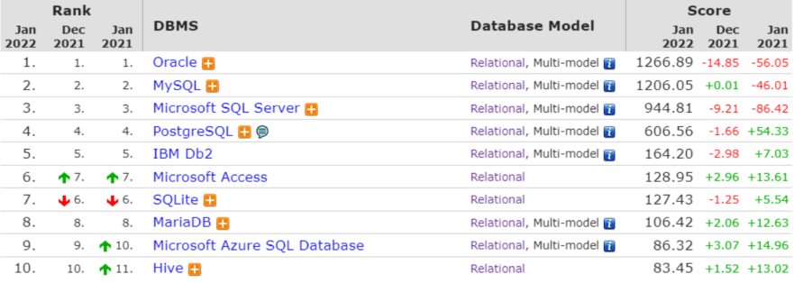
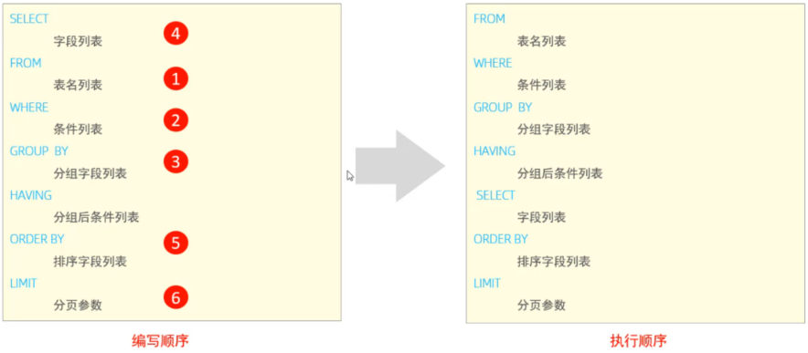
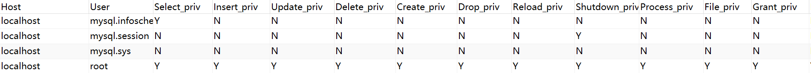
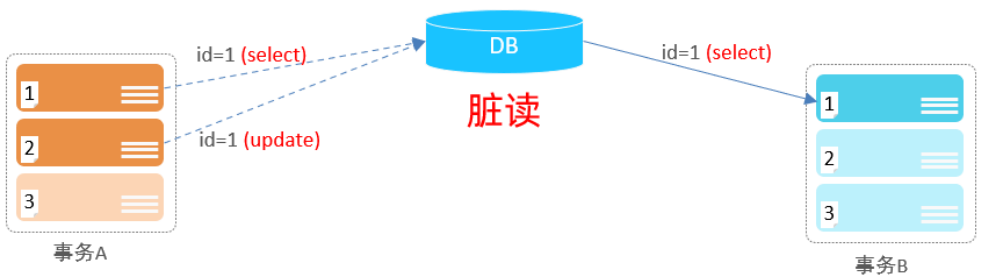
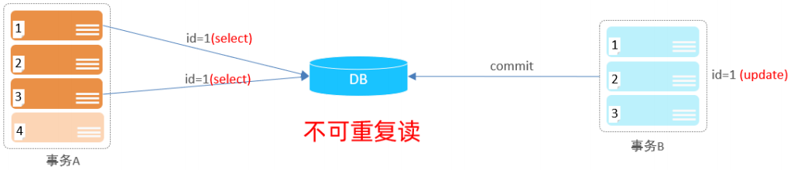
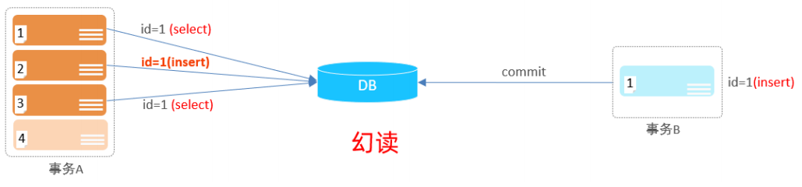

# MySQL 基础篇

## 一：MySQL概述

在这一章节，我们主要介绍两个部分，数据库相关概念及MySQL数据库的介绍、下载、安装、启动及连接。

### 1.1 数据库相关概念

在这一部分，我们先来讲解三个概念：数据库、数据库管理系统、SQL。

| 名称           | 全称                                       | 简称                       |
| -------------- | ------------------------------------------ | -------------------------- |
| 数据库         | 存储数据的仓库。数据是有组织的进行存储     | Database                   |
| 数据库管理系统 | 操纵和管理数据库的大型软件                 | Database Management System |
| SQL            | 操作关系型数据库的编程语言，定义了一套操作 | Structured Query           |

而目前主流的关系型数据库管理系统的市场占有率排名如下：



- Oracle：大型的收费数据库，Oracle公司产品，价格昂贵。

- MySQL：开源免费的中小型数据库，后来Sun公司收购了MySQL，而Oracle又收购了Sun公司。目前Oracle推出了收费版本的MySQL，也提供了免费的社区版本。
- SQL Server：Microsoft 公司推出的收费的中型数据库，C#、.net等语言常用。

- PostgreSQL：开源免费的中小型数据库。

- DB2：IBM公司的大型收费数据库产品。

- SQLLite：嵌入式的微型数据库。Android内置的数据库采用的就是该数据库。

- MariaDB：开源免费的中小型数据库。是MySQL数据库的另外一个分支、另外一个衍生产品，与MySQL数据库有很好的兼容性。

而不论我们使用的是上面的哪一个关系型数据库，最终在操作时，都是使用SQL语言来进行统一操作，因为我们前面讲到SQL语言，是操作关系型数据库的 **统一标准** 。所以即使我们现在学习的是MySQL，假如我们以后到了公司，使用的是别的关系型数据库，如：Oracle、DB2、SQLServer，也完全不用担心，因为操作的方式都是一致的。

### 1.2 MySQL数据库

## 二：SQL

全称 Structured Query Language，结构化查询语言。操作关系型数据库的编程语言，定义了一套操作关系型数据库统一**标准** 。

### 2.1 SQL通用语法

在学习具体的SQL语句之前，先来了解一下SQL语言的同于语法。

1. SQL语句可以单行或多行书写，以分号结尾。

2. SQL语句可以使用空格/缩进来增强语句的可读性。

3. MySQL数据库的SQL语句不区分大小写，关键字建议使用大写。

4. 注释：

   - 单行注释：-- 注释内容 或 # 注释内容

   - 多行注释：/* 注释内容 */

### 2.2 SQL分类

SQL语句，根据其功能，主要分为四类：DDL、DML、DQL、DCL。 

| 分类 | 全称                       | 说明                                                   |
| ---- | -------------------------- | ------------------------------------------------------ |
| DDL  | Data Definition Language   | 数据定义语言，用来定义数据库对象(数据库，表，字段)     |
| DML  | Data Manipulation Language | 数据操作语言，用来对数据库表中的数据进行增删改         |
| DQL  | Data Query Language        | 数据查询语言，用来查询数据库中表的记录                 |
| DCL  | Data Control Language      | 数据控制语言，用来创建数据库用户、控制数据库的访问权限 |

### 2.3 DDL

Data Definition Language，数据定义语言，用来定义数据库对象(数据库，表，字段) 。

#### 2.3.1 数据库操作

##### 1） **查询所有数据库：**

```sql
show databases ;
```

案例展示：

```sql
mysql> show databases;
+--------------------+
| Database           |
+--------------------+
| information_schema |
| learn              |
| mysql              |
| performance_schema |
| sakila             |
| sys                |
| world              |
+--------------------+
7 rows in set (0.01 sec)
```


##### 2） 查询当前数据库

```sql
select database() ;
```

案例展示：

```sql
mysql> use learn;
Database changed
mysql> select database();
+------------+
| database() |
+------------+
| learn      |
+------------+
1 row in set (0.00 sec)
```

##### 3） 创建数据库

```sql
create database [ if not exists ] 数据库名 [ default charset 字符集 ] [ collate 排序 规则 ] ;
```

案例展示：

创建一个数据库

```sql
mysql> create database test;
Query OK, 1 row affected (0.00 sec)

mysql> show databases;
+--------------------+
| Database           |
+--------------------+
| information_schema |
| mysql              |
| performance_schema |
| sys                |
| test               |
+--------------------+
8 rows in set (0.00 sec)
```

在同一个数据库服务器中，不能存在两个重名的数据库，当我们再创建一个test数据库时，就会报错

```sql
mysql> create database test;
ERROR 1007 (HY000): Can't create database 'test'; database exists
```

这时，我们可以通过 if not exists 参数进行判断，如果存在就不进行建库了

```sql
mysql> create database if not exists test ;
Query OK, 1 row affected, 1 warning (0.00 sec)
```

在创建数据库是也可以指定一个默认的字符集

```sql
create database test default charset utf8mb4;
```

##### 4） 删除数据库

```sql
drop database [ if exists ] 数据库名 ;
```

案例展示：

```sql
mysql> drop database if exists test;
Query OK, 0 rows affected (0.01 sec)
```

在删除一个不存在的数据库时会报错，这时可以加上if exists参数

##### 5). 切换数据库

```sql
use 数据库名;
```

我们要操作某一个数据库下的表时，就需要通过该指令，切换到对应的数据库下，否则是不能操作的。比如，切换到learn数据，执行如下SQL： 

```sql
mysql> use learn;
Database changed
```


#### 2.3.2 表操作 - 查询创建

在执行下面的操作之前先创建一个表：

```sql
DROP TABLE IF EXISTS `tb_user`;
CREATE TABLE `tb_user`  (
  `id` int NOT NULL AUTO_INCREMENT COMMENT '??',
  `name` varchar(50) CHARACTER SET utf8mb4 COLLATE utf8mb4_0900_ai_ci NOT NULL COMMENT '???',
  `phone` varchar(11) CHARACTER SET utf8mb4 COLLATE utf8mb4_0900_ai_ci NOT NULL COMMENT '???',
  `email` varchar(100) CHARACTER SET utf8mb4 COLLATE utf8mb4_0900_ai_ci NULL DEFAULT NULL COMMENT '??',
  `profession` varchar(11) CHARACTER SET utf8mb4 COLLATE utf8mb4_0900_ai_ci NULL DEFAULT NULL COMMENT '??',
  `age` tinyint UNSIGNED NULL DEFAULT NULL COMMENT '??',
  `gender` char(1) CHARACTER SET utf8mb4 COLLATE utf8mb4_0900_ai_ci NULL DEFAULT NULL COMMENT '?? , 1: ?, 2: ?',
  `status` char(1) CHARACTER SET utf8mb4 COLLATE utf8mb4_0900_ai_ci NULL DEFAULT NULL COMMENT '??',
  `createtime` datetime NULL DEFAULT NULL COMMENT '????',
  PRIMARY KEY (`id`) USING BTREE
) ENGINE = InnoDB AUTO_INCREMENT = 25 CHARACTER SET = utf8mb4 COLLATE = utf8mb4_0900_ai_ci COMMENT = '?????' ROW_FORMAT = Dynamic;
```


##### 1) 查询当前数据库所有表

```sql
show tables;
```

比如,我们可以切换到sys这个系统数据库,并查看系统数据库中的所有表结构。

```sql
use sys; 
show tables;
```

显示结果：

```shell
mysql> use sys;
Database changed
mysql> show tables;
+-----------------------------------------------+
| Tables_in_sys                                 |
+-----------------------------------------------+
| host_summary                                  |
| host_summary_by_file_io                       |
| host_summary_by_file_io_type                  |
| host_summary_by_stages                        |
......
| x$waits_by_user_by_latency                    |
| x$waits_global_by_latency                     |
+-----------------------------------------------+
101 rows in set (0.01 sec)
```

##### 2) 查看指定表结构

```sql
desc 表名 ;
```

通过这条指令，我们可以查看到指定表的字段，字段的类型、是否可以为NULL，是否存在默认值等信息。

```shell
mysql> desc tb_user;
+------------+------------------+------+-----+---------+----------------+
| Field      | Type             | Null | Key | Default | Extra          |
+------------+------------------+------+-----+---------+----------------+
| id         | int              | NO   | PRI | NULL    | auto_increment |
| name       | varchar(50)      | NO   |     | NULL    |                |
| phone      | varchar(11)      | NO   |     | NULL    |                |
| email      | varchar(100)     | YES  |     | NULL    |                |
| profession | varchar(11)      | YES  |     | NULL    |                |
| age        | tinyint unsigned | YES  |     | NULL    |                |
| gender     | char(1)          | YES  |     | NULL    |                |
| status     | char(1)          | YES  |     | NULL    |                |
| createtime | datetime         | YES  |     | NULL    |                |
+------------+------------------+------+-----+---------+----------------+
9 rows in set (0.00 sec)
```

##### 3) 查询指定表的建表语句

```sql
show create table 表名 ;
```

通过这条指令，主要是用来查看建表语句的，而有部分参数我们在创建表的时候，并未指定也会查询到，因为这部分是数据库的默认值，如：存储引擎、字符集等。

```shell
mysql> show create table tb_user;
+---------+----------+
| Table   | Create Table  |
+---------+----------+
| tb_user | CREATE TABLE `tb_user` (
  `id` int NOT NULL AUTO_INCREMENT COMMENT '主键',
  `name` varchar(50) NOT NULL COMMENT '用户名',
  `phone` varchar(11) NOT NULL COMMENT '手机号',
  `email` varchar(100) DEFAULT NULL COMMENT '邮箱',
  `profession` varchar(11) DEFAULT NULL COMMENT '专业',
  `age` tinyint unsigned DEFAULT NULL COMMENT '年龄',
  `gender` char(1) DEFAULT NULL COMMENT '性别 , 1: 男, 2: 女',
  `status` char(1) DEFAULT NULL COMMENT '状态',
  `createtime` datetime DEFAULT NULL COMMENT '创建时间',
  PRIMARY KEY (`id`)
) ENGINE=InnoDB AUTO_INCREMENT=26 DEFAULT CHARSET=utf8mb4 COLLATE=utf8mb4_0900_ai_ci COMMENT='系统用户表' |
+---------+----------+
1 row in set (0.00 sec)
```

##### 4) 创建表结构

```sql
CREATE TABLE 表名( 
	字段1 字段1类型 [COMMENT 字段1注释 ], 
    字段2 字段2类型 [COMMENT 字段2注释 ], 
    字段3 字段3类型 [COMMENT 字段3注释 ], 
    ...... 
    字段n 字段n类型 [COMMENT 字段n注释 ] 
) [ COMMENT 表注释 ] ;
```

比如，我们创建一张表 tb_user ，对应的结构如下：

| id   | name     | age  | gender |
| ---- | -------- | ---- | ------ |
| 1    | 令狐冲   | 28   | 男     |
| 2    | 东方不败 | 32   | 男     |

那么建表语句为：

```sql
create table tb_user( 
	id int comment '编号', 
    name varchar(50) comment '姓名', 
    age int comment '年龄', 
    gender varchar(1) comment '性别' 
) comment '用户表';
```


#### 2.3.3 表操作 - 数据类型

在上述的建表语句中，我们在指定字段的数据类型时，用到了int ，varchar，那么在MySQL中除了以上的数据类型，还有哪些常见的数据类型呢？ 接下来,我们就来详细介绍一下MySQL的数据类型。

MySQL中的数据类型有很多，主要分为三类：数值类型、字符串类型、日期时间类型。

##### 1) 数值类型

数值类型主要分为两大类：

- 严格数值类型：INTEGER,SMALLINT,DECIMAL,NUMERIC
- 近似数值类型：FLOAT,REAL,DOUBLE,PERCISION

在此基础上，增加了TINYINT,MEDIUMINT,BIGINT.

| 类型         | 大小   | 有符号（SIGNED）范围             | 无符号（UNSIGNED）范围               | 描述                |
| ------------ | ------ | -------------------------------- | ------------------------------------ | ------------------- |
| TINYINT      | 1byte  | (-128，127)                      | (0，255)                             | 小整数值            |
| SMALLINT     | 2bytes | (-32768，32767)                  | (0，65535)                           | 大整数值            |
| MEDIUMINT    | 3bytes | (-8388608，8388607)              | (0，16777215)                        | 大整数值            |
| INT/INTEGER  | 4bytes | (-2147483648， 2147483647)       | (0，4294967295)                      | 大整数值            |
| BIGINT       | 8bytes | (-2^63，2^63-1)                  | (0，2^64-1)                          | 极大整数值          |
| FLOAT        | 4bytes | (-3.4028 E+38， 3.4028 E+38)     | 0 和 (1.17549 E- 38，3.40282 E+38)   | 单精度浮点数值      |
| DOUBLE       | 8bytes | (-1.79769 E+308， 1.79769 E+308) | 0 和 (2.22507 E-308， 1.79769 E+308) | 双精度浮点数值      |
| DECIMAL(M,D) | M+2    | 依赖于M(精度)和D(标度) 的值      | 依赖于M(精度)和D(标度)的 值          | 小数值(精 确定点数) |
| BIT(M)       | 1~8    |                                  |                                      |                     |

**整数类型：**

在定义整数类型时，可以通过小括号的方式显示指定宽度，例如，int(5)表示当数值宽度小于5时，在数字前面填满宽度。**需要注意的是这里指定的宽度只是用来配合填充的，并不会影响字段的精度。**

zerofill： 指定列的数值如果小于指定的宽度，前面填充0。如果一列指定为zerofill，则mysql自动为改了添加UNSIGNED

```shell
mysql> create table t1 (t1 int, t2 int(5) zerofill);
Query OK, 0 rows affected, 2 warnings (0.02 sec)

mysql> insert into t1 values(1,1);
Query OK, 1 row affected (0.00 sec)

mysql> select * from t1;
+------+-------+
| t1   | t2    |
+------+-------+
|    1 | 00001 |
+------+-------+
1 row in set (0.00 sec)
-- 这里可看到，222222222明显超出了宽度，但是依然正确存储了，只是没有填充0
mysql> insert into t1 values(111111111, 222222222);
Query OK, 1 row affected (0.00 sec)

mysql> select * from t1;
+-----------+-----------+
| t1        | t2        |
+-----------+-----------+
|         1 |     00001 |
| 111111111 | 222222222 |
+-----------+-----------+
2 rows in set (0.00 sec)
```

UNSIGNED：无符号整数

AUTO_INCREMENT：自增，一个表最多只能有一个自增列。通常为注解，使用NOT NULL 和PRIMARY KEY 或UNIQUE限定。

**小数类型**

小数类型分为两种：浮点数和定点数，浮点数包括float和double。定点数只有decimal。定点数在mysql内部以字符串形式存放。decimal可以用(M,D)的方式来指定精度，M用来显示指定的位数，D用来指定位于小数点后边的位数


##### 2) 字符串类型

| 类型       | 大小                  | 描述                         |
| ---------- | --------------------- | ---------------------------- |
| CHAR       | 0-255 bytes           | 定长字符串(需要指定长度)     |
| VARCHAR    | 0-65535 bytes         | 变长字符串(需要指定长度)     |
| TINYBLOB   | 0-255 bytes           | 不超过255个字符的二进制数据  |
| TINYTEXT   | 0-255 bytes           | 短文本字符串                 |
| BLOB       | 0-65 535 bytes        | 二进制形式的长文本数据       |
| TEXT       | 0-65 535 bytes        | 长文本数据                   |
| MEDIUMBLOB | 0-16 777 215 bytes    | 二进制形式的中等长度文本数据 |
| MEDIUMTEXT | 0-16 777 215 bytes    | 中等长度文本数据             |
| LONGBLOB   | 0-4 294 967 295 bytes | 二进制形式的极大文本数据     |
| LONGTEXT   | 0-4 294 967 295 bytes | 极大文本数据                 |

char 与 varchar 都可以描述字符串，char是定长字符串，指定长度多长，就占用多少个字符，和字段值的长度无关 。而varchar是变长字符串，指定的长度为最大占用长度 。相对来说，char的性能会更高些。

##### 3) 日期时间类型


| 类型      | 大小 | 范围                                       | 格式                | 描述                     |
| --------- | ---- | ------------------------------------------ | ------------------- | ------------------------ |
| DATE      | 4    | 1000-01-01 至 9999-12-31                   | YYYY-MM-DD          | 日期值                   |
| TIME      | 3    | -838:59:59 至 838:59:59                    | HH:MM:SS            | 时间值或持续时间         |
| YEAR      | 1    | 1901 至 2155                               | YYYY                | 年份值                   |
| DATETIME  | 8    | 1000-01-01 00:00:00 至 9999-12-31 23:59:59 | YYYY-MM-DD HH:MM:SS | 混合日期和时间值         |
| TIMESTAMP | 4    | 1970-01-01 00:00:01 至 2038-01-19 03:14:07 | YYYY-MM-DD HH:MM:SS | 混合日期和时间值，时间戳 |


**TIMESTAMP**

这里主要介绍一下TIMESTAMP类型的基本特性：

首先来看一下参数explicit_defaults_for_timestamp 这个参数(5.6版本后引入)

当这个参数为off时，当创建表的时候，mysql只会给表中的第一个timestamp类型的字段是指默认值为系统日期

当这个参数为on时，则mysql不会做任何配置，所有的设置都需要手动设置。

```shell
mysql> show variables like '%explicit_defaults_for_timestamp%';
+---------------------------------+-------+
| Variable_name                   | Value |
+---------------------------------+-------+
| explicit_defaults_for_timestamp | OFF   |
+---------------------------------+-------+
1 row in set, 1 warning (0.00 sec)

mysql> create table t(ts timestamp);
Query OK, 0 rows affected (0.01 sec)

mysql> desc t;
+-------+-----------+------+-----+-------------------+-----------------------------------------------+
| Field | Type      | Null | Key | Default           | Extra                                         |
+-------+-----------+------+-----+-------------------+-----------------------------------------------+
| ts    | timestamp | NO   |     | CURRENT_TIMESTAMP | DEFAULT_GENERATED on update CURRENT_TIMESTAMP |
+-------+-----------+------+-----+-------------------+-----------------------------------------------+
1 row in set (0.00 sec)

mysql> create table t2(t1 timestamp,t2 timestamp);
Query OK, 0 rows affected (0.01 sec)

mysql> desc t2;
+-------+-----------+------+-----+---------------------+-----------------------------------------------+
| Field | Type      | Null | Key | Default             | Extra                                         |
+-------+-----------+------+-----+---------------------+-----------------------------------------------+
| t1    | timestamp | NO   |     | CURRENT_TIMESTAMP   | DEFAULT_GENERATED on update CURRENT_TIMESTAMP |
| t2    | timestamp | NO   |     | 0000-00-00 00:00:00 |                                               |
+-------+-----------+------+-----+---------------------+-----------------------------------------------+
2 rows in set (0.01 sec)
```


timestamp还有一个重要的特性，就是和时区相关。当插入日期时，会先转换为本地时区存放，在查询时，也是现将日期转换为本地时区后在显示，这就导致了两个不同时区的用户看到同一个日期可能是不一样的。


#### 2.3.4 表操作 - 修改

##### 1) 添加字段

```sql
ALTER TABLE 表名 ADD 字段名 类型 (长度) [ COMMENT 注释 ] [ 约束 ]; 
```

案例展示：

```shell
mysql> alter table t_user add email varchar(100) comment '邮箱地址';
Query OK, 0 rows affected (0.01 sec)
Records: 0  Duplicates: 0  Warnings: 0
```

##### 2) 修改数据类型

```sql
ALTER TABLE 表名 MODIFY 字段名 新数据类型 (长度);
```


##### 3) 修改字段名和字段类型

```sql
ALTER TABLE 表名 CHANGE 旧字段名 新字段名 类型 (长度) [ COMMENT 注释 ] [ 约束 ];
```

案例展示：

将name改为username

```shell
mysql> alter table t_user change name username varchar(30) comment '用户名称';
Query OK, 0 rows affected (0.03 sec)
Records: 0  Duplicates: 0  Warnings: 0
```

##### 4) 删除字段

```sql
ALTER TABLE 表名 DROP 字段名;
```

案例展示：

将t_user表的email字段删除

```sql
mysql> alter table t_user drop email;
Query OK, 0 rows affected (0.02 sec)
Records: 0  Duplicates: 0  Warnings: 0
```


##### 5) 修改表名

```sql
ALTER TABLE 表名 RENAME TO 新表名;
```

案例展示：

将t_user改为tt_user

```sql
mysql> alter table t_user rename to tt_user;
Query OK, 0 rows affected (0.01 sec)
```

#### 2.3.5 表操作 - 删除

##### 1) 删除表

```sql
DROP TABLE [ IF EXISTS ] 表名;
```

可选项 IF EXISTS 代表，只有表名存在时才会删除该表，表名不存在，则不执行删除操作(如果不加该参数项，删除一张不存在的表，执行将会报错)。

案例展示：

如果tt_user表存在，则删除tt_user表

```sql
mysql> drop table if exists tt_user;
Query OK, 0 rows affected (0.01 sec)
```

##### 2) 删除指定表

```sql
TRUNCATE TABLE 表名;
```


### 2.4 DML

DML英文全称是Data Manipulation Language(数据操作语言)，用来对数据库中表的数据记录进行增、删、改操作。

- 添加数据（INSERT）

- 修改数据（UPDATE）

- 删除数据（DELETE） 

#### 2.4.1 添加数据

##### 1). 给指定字段添加数据

```sql
INSERT INTO 表名 (字段名1, 字段名2, ...) VALUES (值1, 值2, ...);
```

案例：

给tb_user表插入数据

```sql
mysql> insert into tb_user (id, `name`, phone, email, profession, age, gender, `status`) VALUES(25, 'xuliang', 18888888888, '88888888@qq.com', 'aa', 18, 1, 0 );
Query OK, 1 row affected (0.00 sec)
```

查询数据：

```sql
mysql> select * from tb_user where id=25;
+----+---------+-------------+-----------------+------------+------+--------+--------+------------+
| id | name    | phone       | email           | profession | age  | gender | status | createtime |
+----+---------+-------------+-----------------+------------+------+--------+--------+------------+
| 25 | xuliang | 18888888888 | 88888888@qq.com | aa         |   18 | 1      | 0      | NULL       |
+----+---------+-------------+-----------------+------------+------+--------+--------+------------+
1 row in set (0.00 sec)
```


##### 2). 给全部字段添加数据

```sql
INSERT INTO 表名 VALUES (值1, 值2, ...);
```

如果不指定字段，就需要在value中指定全部值，且顺序一致。


##### 3). 批量添加数据

```sql
INSERT INTO 表名 (字段名1, 字段名2, ...) VALUES (值1, 值2, ...), (值1, 值2, ...), (值 1, 值2, ...) ;
```


> 注意事项:
>
> - 插入数据时，指定的字段顺序需要与值的顺序是一一对应的。
>
> - 字符串和日期型数据应该包含在引号中。
>
> - 插入的数据大小，应该在字段的规定范围内。


#### 2.4.2 修改数据

修改数据的具体语法为:

```sql
UPDATE 表名 SET 字段名1 = 值1 , 字段名2 = 值2 , .... [ WHERE 条件 ] ;
```

案例:

A. 修改id为1的数据，将name修改为xul

```sql
update tb_user set name = 'xul' where id = 1;
```

B. 修改id为1的数据, 将name修改为小昭, gender修改为 女

```sql
update tb_user set name = '小昭' , gender = 1 where id = 1;
```

C. 将所有用户的创建日期修改为 2008-01-01

```sql
update tb_user set entrydate = '2008-01-01'; 
```

> 注意事项:
>
> 修改语句的条件可以有，也可以没有，如果没有条件，则会修改整张表的所有数据。


#### 2.5.3 删除数据

删除数据的具体语法为：

```sql
DELETE FROM 表名 [ WHERE 条件 ] ;
```


案例:

A. 删除gender为女的用户

```sql
delete from tb_user where gender = 1;
```

B. 删除所有用户

```sql
delete from tb_user;
```


> 注意事项:
>
> - DELETE 语句的条件可以有，也可以没有，如果没有条件，则会删除整张表的所有数据。
>
> - DELETE 语句不能删除某一个字段的值(可以使用UPDATE，将该字段值置为NULL即 可)。
>
> - 当进行删除全部数据操作时，datagrip会提示我们，询问是否确认删除，我们直接点击Execute即可。


### 2.5 DQL

DQL英文全称是Data Query Language(数据查询语言)，数据查询语言，用来查询数据库中表的记录。

查询关键字: SELECT

在一个正常的业务系统中，查询操作的频次是要远高于增删改的，当我们去访问企业官网、电商网站，在这些网站中我们所看到的数据，实际都是需要从数据库中查询并展示的。而且在查询的过程中，可能还会涉及到条件、排序、分页等操作。

那么，本小节我们主要学习的就是如何进行数据的查询操作。 我们先来完成如下数据准备工作: 

```sql
drop table if exists employee; 
create table emp( 
    id int comment '编号', 
    workno varchar(10) comment '工号', 
    name varchar(10) comment '姓名', 
    gender char(1) comment '性别', 
    age tinyint unsigned comment '年龄', 
    idcard char(18) comment '身份证号', 
    workaddress varchar(50) comment '工作地址', 
    entrydate date comment '入职时间' 
)comment '员工表'; 
INSERT INTO emp (id, workno, name, gender, age, idcard, workaddress, entrydate) VALUES (1, '00001', '柳岩666', '女', 20, '123456789012345678', '北京', '2000-01- 01'); 
INSERT INTO emp (id, workno, name, gender, age, idcard, workaddress, entrydate) VALUES (2, '00002', '张无忌', '男', 18, '123456789012345670', '北京', '2005-09- 01');
INSERT INTO emp (id, workno, name, gender, age, idcard, workaddress, entrydate) VALUES (3, '00003', '韦一笑', '男', 38, '123456789712345670', '上海', '2005-08- 01'); 
INSERT INTO emp (id, workno, name, gender, age, idcard, workaddress, entrydate) VALUES (4, '00004', '赵敏', '女', 18, '123456757123845670', '北京', '2009-12-01'); 
INSERT INTO emp (id, workno, name, gender, age, idcard, workaddress, entrydate) VALUES (5, '00005', '小昭', '女', 16, '123456769012345678', '上海', '2007-07-01'); 
INSERT INTO emp (id, workno, name, gender, age, idcard, workaddress, entrydate) VALUES (6, '00006', '杨逍', '男', 28, '12345678931234567X', '北京', '2006-01-01'); 
INSERT INTO emp (id, workno, name, gender, age, idcard, workaddress, entrydate) VALUES (7, '00007', '范瑶', '男', 40, '123456789212345670', '北京', '2005-05-01'); 
INSERT INTO emp (id, workno, name, gender, age, idcard, workaddress, entrydate) VALUES (8, '00008', '黛绮丝', '女', 38, '123456157123645670', '天津', '2015-05- 01'); 
INSERT INTO emp (id, workno, name, gender, age, idcard, workaddress, entrydate) VALUES (9, '00009', '范凉凉', '女', 45, '123156789012345678', '北京', '2010-04- 01'); 
INSERT INTO emp (id, workno, name, gender, age, idcard, workaddress, entrydate) VALUES (10, '00010', '陈友谅', '男', 53, '123456789012345670', '上海', '2011-01- 01'); 
INSERT INTO emp (id, workno, name, gender, age, idcard, workaddress, entrydate) VALUES (11, '00011', '张士诚', '男', 55, '123567897123465670', '江苏', '2015-05- 01'); 
INSERT INTO emp (id, workno, name, gender, age, idcard, workaddress, entrydate) VALUES (12, '00012', '常遇春', '男', 32, '123446757152345670', '北京', '2004-02- 01'); 
INSERT INTO emp (id, workno, name, gender, age, idcard, workaddress, entrydate) VALUES (13, '00013', '张三丰', '男', 88, '123656789012345678', '江苏', '2020-11- 01'); 
INSERT INTO emp (id, workno, name, gender, age, idcard, workaddress, entrydate) VALUES (14, '00014', '灭绝', '女', 65, '123456719012345670', '西安', '2019-05- 01'); 
INSERT INTO emp (id, workno, name, gender, age, idcard, workaddress, entrydate) VALUES (15, '00015', '胡青牛', '男', 70, '12345674971234567X', '西安', '2018-04- 01'); 
INSERT INTO emp (id, workno, name, gender, age, idcard, workaddress, entrydate) VALUES (16, '00016', '周芷若', '女', 18, null, '北京', '2012-06-01');
```

准备完毕后，我们就可以看到emp表中准备的16条数据。接下来，我们再来完成DQL语法的学习。

#### 2.5.1 基本语法

DQL 查询语句，语法结构如下：

```sql
SELECT
	字段列表 
FROM
	表名列表 
WHERE
	条件列表 
GROUP BY 
	分组字段列表 
HAVING
	分组后条件列表 
ORDER BY 
	排序字段列表 
LIMIT
	分页参数
```

我们在讲解这部分内容的时候，会将上面的完整语法进行拆分，分为以下几个部分：

- 基本查询（不带任何条件）

- 条件查询（WHERE）

- 聚合函数（count、max、min、avg、sum）

- 分组查询（group by）

- 排序查询（order by）

- 分页查询（limit） 

#### 2.5.2 基础查询

在基本查询的DQL语句中，不带任何的查询条件，查询的语法如下：

##### 1). 查询多个字段

```SQL
SELECT 字段1, 字段2, 字段3 ... FROM 表名 ; 
SELECT * FROM 表名 ;
```

> 注意 : * 号代表查询所有字段，在实际开发中尽量少用（不直观、影响效率）。

##### 2). 字段设置别名

```SQL
SELECT 字段1 [ AS 别名1 ] , 字段2 [ AS 别名2 ] ... FROM 表名; 
SELECT 字段1 [ 别名1 ] , 字段2 [ 别名2 ] ... FROM 表名;
```


##### 3). 去除重复记录

```sql
SELECT DISTINCT 字段列表 FROM 表名;
```


案例：

A. 查询指定字段 name, workno, age并返回

```sql
select name,workno,age from emp;
```

B. 查询返回所有字段

```sql
select id ,workno,name,gender,age,idcard,workaddress,entrydate from emp; 
select * from emp;
```

C. 查询所有员工的工作地址,起别名

```sql
select workaddress as '工作地址' from emp; 
-- as可以省略 
select workaddress '工作地址' from emp;
```

D. 查询公司员工的上班地址有哪些(不要重复) 

```sql
select distinct workaddress '工作地址' from emp;
```

#### 2.5.3 条件查询

##### 1) 语法

```sql
SELECT 字段列表 FROM 表名 WHERE 条件列表 ;
```

##### 2) 条件

常用的比较运算符如下:

| 比较运算符          | 功能                                     |
| ------------------- | ---------------------------------------- |
| >                   | 大于                                     |
| >=                  | 大于等于                                 |
| <                   | 小于                                     |
| <=                  | 小于等于                                 |
| =                   | 等于                                     |
| <> 或 !=            | 不等于                                   |
| BETWEEN ... AND ... | 在某个范围之内(含最小、最大值)           |
| IN(...)             | 在in之后的列表中的值，多选一             |
| LIKE 占位符         | 模糊匹配(_匹配单个字符, %匹配任意个字符) |
| IS NULL             | 是NULL                                   |

常用的逻辑运算符如下:

| 逻辑运算符 | 功能                        |
| ---------- | --------------------------- |
| AND 或 &&  | 并且 (多个条件同时成立)     |
| OR 或 \|\| | 或者 (多个条件任意一个成立) |
| NOT 或 !   | 非 , 不是                   |

##### 3) 案例举例

A. 查询年龄等于 88 的员工

```
select * from emp where age = 88;
```

B. 查询年龄小于 20 的员工信息

```
select * from emp where age < 20;
```

C. 查询年龄小于等于 20 的员工信息

```
select * from emp where age <= 20;
```

D. 查询没有身份证号的员工信息

```
select * from emp where idcard is null;
```

E. 查询有身份证号的员工信息

```
select * from emp where idcard is not null;
```

F. 查询年龄不等于 88 的员工信息

```
select * from emp where age != 88; 
select * from emp where age <> 88;
```

G. 查询年龄在15岁(包含) 到 20岁(包含)之间的员工信息

```
select * from emp where age >= 15 && age <= 20; 
select * from emp where age >= 15 and age <= 20; 
select * from emp where age between 15 and 20;
```

H. 查询性别为 女 且年龄小于 25岁的员工信息

```
select * from emp where gender = '女' and age < 25;
```

I. 查询年龄等于18 或 20 或 40 的员工信息

```
select * from emp where age = 18 or age = 20 or age =40; 
select * from emp where age in(18,20,40);
```

J. 查询姓名为两个字的员工信息 _ %

```
select * from emp where name like '__'; 
```

K. 查询身份证号最后一位是X的员工信息

```
select * from emp where idcard like '%X'; 
select * from emp where idcard like '_________________X';
```


#### 2.5.4 聚合函数

##### 1) 介绍

将一列数据作为一个整体，进行纵向计算 。

##### 2) 常见的聚合函数

| 函数  | 功能     |
| ----- | -------- |
| count | 统计数量 |
| max   | 最大值   |
| min   | 最小值   |
| avg   | 平均值   |
| sum   | 求和     |

##### 3). 语法

```sql
SELECT 聚合函数(字段列表) FROM 表名 ;
```


> 注意 : NULL值是不参与所有聚合函数运算的。


##### 4） 案例

A. 统计该企业员工数量

```sql
select count(*) from emp; -- 统计的是总记录数 
select count(idcard) from emp; -- 统计的是idcard字段不为null的记录数
```

对于count聚合函数，统计符合条件的总记录数，还可以通过 count(数字/字符串)的形式进行统计查询，比如：

```sql
select count(1) from emp;
```

> 对于count(*) 、count(字段)、 count(1) 的具体原理，我们在进阶篇中SQL优化部分会详细讲解，此处大家只需要知道如何使用即可。

B. 统计该企业员工的平均年龄

```sql
select avg(age) from emp;
```

C. 统计该企业员工的最大年龄

```sql
select max(age) from emp;
```

D. 统计该企业员工的最小年龄

```sql
select min(age) from emp;
```

E. 统计西安地区员工的年龄之和

```sql
select sum(age) from emp where workaddress = '西安';
```


#### 2.5.5 分组查询

##### 1). 语法

```sql
SELECT 字段列表 FROM 表名 [ WHERE 条件 ] GROUP BY 分组字段名 [ HAVING 分组 后过滤条件 ];
```

##### 2). where与having区别

- 执行时机不同：where是分组之前进行过滤，不满足where条件，不参与分组；而having是分组之后对结果进行过滤。

- 判断条件不同：where不能对聚合函数进行判断，而having可以。

> 注意事项:
>
> - 分组之后，查询的字段一般为聚合函数和分组字段，查询其他字段无任何意义。
> - 执行顺序: where > 聚合函数 > having 。
> - 支持多字段分组, 具体语法为 : group by columnA,columnB

##### 3) 案例

A. 根据性别分组 , 统计男性员工 和 女性员工的数量

```sql
select gender, count(*) from emp group by gender ; 
```

B. 根据性别分组 , 统计男性员工 和 女性员工的平均年龄

```sql
select gender, avg(age) from emp group by gender ; 
```

C. 查询年龄小于45的员工 , 并根据工作地址分组 , 获取员工数量大于等于3的工作地址

```sql
select workaddress, count(*) address_count from emp where age < 45 group by workaddress having address_count >= 3;
```

D. 统计各个工作地址上班的男性及女性员工的数量

```sql
select workaddress, gender, count(*) '数量' from emp group by gender , workaddress ;
```

#### 2.5.6 排序查询

排序在日常开发中是非常常见的一个操作，有升序排序，也有降序排序。

##### 1). 语法

```sql
SELECT 字段列表 FROM 表名 ORDER BY 字段1 排序方式1 , 字段2 排序方式2 ;
```

##### 2). 排序方式

- ASC : 升序(默认值)

- DESC: 降序

> 注意事项：
>
> - 如果是升序, 可以不指定排序方式ASC ;
>
> - 如果是多字段排序，当第一个字段值相同时，才会根据第二个字段进行排序 ;

##### 3) 案例

A. 根据年龄对公司的员工进行升序排序

```sql
select * from emp order by age asc; 
select * from emp order by age;
```

B. 根据入职时间, 对员工进行降序排序

```sql
select * from emp order by entrydate desc;
```

C. 根据年龄对公司的员工进行升序排序 , 年龄相同 , 再按照入职时间进行降序排序

```sql
select * from emp order by age asc , entrydate desc;
```


#### 2.5.7 分页查询

分页操作在业务系统开发时，也是非常常见的一个功能，我们在网站中看到的各种各样的分页条，后台都需要借助于数据库的分页操作。

##### 1). 语法

```sql
SELECT 字段列表 FROM 表名 LIMIT 起始索引, 查询记录数 ; 
```

> 注意事项:
>
> - 起始索引从0开始，起始索引 = （查询页码 - 1）* 每页显示记录数。
>
> - 分页查询是数据库的方言，不同的数据库有不同的实现，MySQL中是LIMIT。
>
> - 如果查询的是第一页数据，起始索引可以省略，直接简写为 limit 10。


##### 2) 案例:

A. 查询第1页员工数据, 每页展示10条记录

```sql
select * from emp limit 0,10; 
select * from emp limit 10;
```

B. 查询第2页员工数据, 每页展示10条记录 --------> (页码-1)*页展示记录数

```sql
select * from emp limit 10,10;
```


#### 2.5.8 执行顺序

（面试重点）

在讲解DQL语句的具体语法之前，我们已经讲解了DQL语句的完整语法，及编写顺序，接下来，我们要来说明的是DQL语句在执行时的执行顺序，也就是先执行那一部分，后执行那一部分。



验证：

查询年龄大于15的员工姓名、年龄，并根据年龄进行升序排序。

```
select name , age from emp where age > 15 order by age asc;
```

在查询时，我们给emp表起一个别名 e，然后在select 及 where中使用该别名。

```
select e.name , e.age from emp e where e.age > 15 order by age asc;
```

执行上述SQL语句后，我们看到依然可以正常的查询到结果，此时就说明： from 先执行, 然后where 和 select 执行。那 where 和 select 到底哪个先执行呢?

此时，此时我们可以给select后面的字段起别名，然后在 where 中使用这个别名，然后看看是否可以执行成功

```sql
select e.name ename , e.age eage from emp e where eage > 15 order by age asc;
```

执行上述SQL报错了:

```sql
mysql> select e.name ename , e.age eage from emp e where eage > 15 order by age asc;
ERROR 1054 (42S22): Unknown column 'eage' in 'where clause'
```

由此我们可以得出结论: from 先执行，然后执行 where ， 再执行select 。

接下来，我们再执行如下SQL语句，查看执行效果：

```sql
select e.name ename , e.age eage from emp e where e.age > 15 order by eage asc;
```

结果执行成功。 那么也就验证了: order by 是在select 语句之后执行的。

综上所述，我们可以看到DQL语句的执行顺序为： from ... where ... group by ...having ... select ... order by ... limit ...


> 拓展：
>
> where 和 join 执行谁先谁后？


### 2.6 DCL

DCL英文全称是**Data Control Language**(数据控制语言)，用来管理数据库用户、控制数据库的访问权限。


#### 2.6.1 管理用户

##### 1). 查询用户

```
select * from mysql.user;
```

查询结果



其中 Host代表当前用户访问的主机, 如果为localhost, 仅代表只能够在当前本机访问，是不可以远程访问的。 User代表的是访问该数据库的用户名。在MySQL中需要通过Host和User来唯一标识一个用户

##### 2). 创建用户

```
CREATE USER '用户名'@'主机名' IDENTIFIED BY '密码';
```

##### 3). 修改用户密码

```
ALTER USER '用户名'@'主机名' IDENTIFIED WITH mysql_native_password BY '新密码' ; 1
```

##### 4). 删除用户

```
DROP USER '用户名'@'主机名' ;
```


> 注意事项:
>
> - 在MySQL中需要通过用户名@主机名的方式，来唯一标识一个用户。
>
> - 主机名可以使用 % 通配。
>
> - 这类SQL开发人员操作的比较少，主要是DBA（ Database Administrator 数据库管理员）使用。


#### 2.6.2 权限控制

MySQL中定义了很多种权限，但是常用的就以下几种：

| 权限                | 说明               |
| ------------------- | ------------------ |
| ALL, ALL PRIVILEGES | 所有权限           |
| SELECT              | 查询数据           |
| INSERT              | 插入数据           |
| UPDATE              | 修改数据           |
| DELETE              | 删除数据           |
| ALTER               | 修改表             |
| DROP                | 删除数据库/表/视图 |
| CREATE              | 创建数据库/表      |

上述只是简单罗列了常见的几种权限描述，其他权限描述及含义，可以直接参考官方文档。

##### 1). 查询权限

```sql
SHOW GRANTS FOR '用户名'@'主机名' ;
```

##### 2). 授予权限

```sql
GRANT 权限列表 ON 数据库名.表名 TO '用户名'@'主机名';
```

##### 3). 撤销权限

```sql
REVOKE 权限列表 ON 数据库名.表名 FROM '用户名'@'主机名';
```

> 注意事项：
>
> - 多个权限之间，使用逗号分隔
>
> - 授权时， 数据库名和表名可以使用 * 进行通配，代表所有。


案例:

A. 查询 'heima'@'%' 用户的权限

```sql
show grants for 'heima'@'%';
```

B. 授予 'heima'@'%' 用户itcast数据库所有表的所有操作权限

```sql
grant all on itcast.* to 'heima'@'%'; 
```

C. 撤销 'heima'@'%' 用户的itcast数据库的所有权限

```sql
revoke all on itcast.* from 'heima'@'%';
```


## 三：函数

函数 是指一段可以直接被另一段程序调用的程序或代码。 也就意味着，这一段程序或代码在MySQL中已经给我们提供了，我们要做的就是在合适的业务场景调用对应的函数完成对应的业务需求即可。

MySQL中的函数主要分为以下四类： 字符串函数、数值函数、日期函数、流程函数。

### 3.1 字符串函数

MySQL中内置了很多字符串函数，常用的几个如下：

| 函数                     | 功能                                                      |
| ------------------------ | --------------------------------------------------------- |
| CONCAT(S1,S2,...Sn)      | 字符串拼接，将S1，S2，... Sn拼接成一个字符串              |
| INXDFG(str,x,y,instr)    | 将字符串str从第x位置，y个字符串长的字串替换为字符串instr  |
| LOWER(str)               | 将字符串str全部转为小写                                   |
| UPPER(str)               | 将字符串str全部转为大写                                   |
| LEFT(str,x)              | 返回字符串str最左边的x个字符                              |
| RIGHT(str,x)             | 返回字符串str最右边的x个字符                              |
| LPAD(str,n,pad)          | 左填充，用字符串pad对str的左边进行填充，达到n个字符串长度 |
| RPAD(str,n,pad)          | 右填充，用字符串pad对str的右边进行填充，达到n个字符串长度 |
| TRIM(str)                | 去掉字符串头部和尾部的空格                                |
| LTRIM(str)               | 去掉字符串str左侧的空格                                   |
| RTRIM(str)               | 去掉字符串str行尾的空格                                   |
| SUBSTRING(str,start,len) | 返回从字符串str从start位置起的len个长度的字符串           |
| REPEAT(str,x)            | 返回str重复x次的结果                                      |
| REPLACE(str，a，b)       | 用字符串b替换字符串str中所有出现的字符串a                 |


**CONCAT**

任何字符串于null进行链接的结果都将是NULL

```shell
mysql> select concat('aaa','bbb','ccc'),concat('aaa',null);
+---------------------------+--------------------+
| concat('aaa','bbb','ccc') | concat('aaa',null) |
+---------------------------+--------------------+
| aaabbbccc                 | NULL               |
+---------------------------+--------------------+
1 row in set (0.01 sec)
```

**INSERT**

```shell
mysql> select INSERT('beijing2008you',12,3,'me');
+------------------------------------+
| INSERT('beijing2008you',12,3,'me') |
+------------------------------------+
| beijing2008me                      |
+------------------------------------+
1 row in set (0.00 sec)
```


**LOWER 和 UPPER**

```shell
mysql> select LOWER('BEIJING2008'), UPPER('beijing2008');
+----------------------+----------------------+
| LOWER('BEIJING2008') | UPPER('beijing2008') |
+----------------------+----------------------+
| beijing2008          | BEIJING2008          |
+----------------------+----------------------+
1 row in set (0.00 sec)
```

**LEFT 和 RIGHT**

如果第二个参数是NULL，，那么不返回任何字符串。

```shell
mysql> select LEFT('beijing2008',7),LEFT('beijing',null),RIGHT('beijing2008',4);
+-----------------------+----------------------+------------------------+
| LEFT('beijing2008',7) | LEFT('beijing',null) | RIGHT('beijing2008',4) |
+-----------------------+----------------------+------------------------+
| beijing               | NULL                 | 2008                   |
+-----------------------+----------------------+------------------------+
1 row in set (0.00 sec)
```

**LPAD 和 RPAD**

```
mysql> select lpad('2008',20,'beijing'),rpad('beijing',20,'2008');
+---------------------------+---------------------------+
| lpad('2008',20,'beijing') | rpad('beijing',20,'2008') |
+---------------------------+---------------------------+
| beijingbeijingbe2008      | beijing2008200820082      |
+---------------------------+---------------------------+
1 row in set (0.01 sec)
```

**LTRIM 和 RTRIM**

```shell
mysql> select ltrim('  |beijing'),rtrim('beijing|   ');
+---------------------+----------------------+
| ltrim('  |beijing') | rtrim('beijing|   ') |
+---------------------+----------------------+
| |beijing            | beijing|             |
+---------------------+----------------------+
1 row in set (0.01 sec)
```

**REPEAT**

```shell
mysql> select repeat('mysql ',3);
+--------------------+
| repeat('mysql ',3) |
+--------------------+
| mysql mysql mysql  |
+--------------------+
1 row in set (0.00 sec)
```

**REPLACE**

```shell
mysql> select replace('beijing_2010','_2010','2008');
+----------------------------------------+
| replace('beijing_2010','_2010','2008') |
+----------------------------------------+
| beijing2008                            |
+----------------------------------------+
1 row in set (0.00 sec)
```


### 3.2 数值函数

常见的数值函数如下：

| 函数          | 功能                               |
| ------------- | ---------------------------------- |
| ABS(x)        | 返回x的绝对值                      |
| CEIL(x)       | 向上取整                           |
| FLOOR(x)      | 向下取整                           |
| MOD(x,y)      | 返回x/y的模                        |
| RAND()        | 返回0~1内的随机数                  |
| ROUND(x,y)    | 求参数x的四舍五入的值，保留y位小数 |
| TRUNCATE(x,y) | 返回数字x阶段为y位小数的结果       |


### 3.3 日期函数

常见的日期函数如下：

| 函数                              | 功能                                              |
| --------------------------------- | ------------------------------------------------- |
| CURDATE()                         | 返回当前日期                                      |
| CURTIME()                         | 返回当前时间                                      |
| NOW()                             | 返回当前日期和时间                                |
| YEAR(date)                        | 获取指定date的年份                                |
| MONTH(date)                       | 获取指定date的月份                                |
| DAY(date)                         | 获取指定date的日期                                |
| DATE_ADD(date, INTERVAL exprtype) | 返回一个日期/时间值加上一个时间间隔expr后的时间值 |
| DATEDIFF(date1,date2)             | 返回起始时间date1 和 结束时间date2之间的天数      |

### 3.4 流程函数

流程函数也是很常用的一类函数，可以在SQL语句中实现条件筛选，从而提高语句的效率。

| 函数                                                         | 功能                                                      |
| ------------------------------------------------------------ | --------------------------------------------------------- |
| IF(value , t , f)                                            | 如果value为true，则返回t，否则返回f                       |
| IFNULL(value1 , value2)                                      | 如果value1不为空，返回value1，否则返回value2              |
| CASE WHEN [ val1 ] THEN [res1] ...<br/>ELSE [ default ] END  | 如果val1为true，返回res1，... 否则返回default默认值       |
| CASE [ expr ] WHEN [ val1 ] THEN<br/>[res1] ... ELSE [ default ] END | 如果expr的值等于val1，返回res1，... 否则返回default默认值 |


## 四：约束

### 4.1 概述

概念：约束是作用于表中字段上的规则，用于限制存储在表中的数据。

目的：保证数据库中数据的正确、有效性和完整性。

分类

| 约束                     | 描述                                                     | 关键字      |
| ------------------------ | -------------------------------------------------------- | ----------- |
| 非空约束                 | 限制该字段的数据不能为null                               | NOT NULL    |
| 唯一约束                 | 保证该字段的所有数据都是唯一、不重复的                   | UNIQUE      |
| 主键约束                 | 主键是一行数据的唯一标识，要求非空且唯一                 | PRIMARY KEY |
| 默认约束                 | 保存数据时，如果未指定该字段的值，则采用默认值           | DEFAULT     |
| 检查约束(8.0.16版本之后) | 保证字段值满足某一个条件                                 | CHECK       |
| 外键约束                 | 用来让两张表的数据之间建立连接，保证数据的一致性和完整性 | FOREIGN     |


> 注意：约束是作用于表中字段上的，可以在创建表/修改表的时候添加约束。


### 4.2 约束演示

上面我们介绍了数据库中常见的约束，以及约束涉及到的关键字，那这些约束我们到底如何在创建表、修改表的时候来指定呢，接下来我们就通过一个案例，来演示一下。

案例需求： 根据需求，完成表结构的创建。需求如下：

| 字段名 | 字段含义   | 字段类型    | 约束条件                  | 约束关键字                  |
| ------ | ---------- | ----------- | ------------------------- | --------------------------- |
| id     | ID唯一标识 | int         | 主键，并且自动增长        | PRIMARY KEY, AUTO_INCREMENT |
| name   | 姓名       | varchar(10) | 不为空，并且唯一          | NOT NULL , UNIQUE           |
| age    | 年龄       | int         | 大于0，并且小于等于120    | CHECK                       |
| status | 状态       | char(1)     | 如果没有指定该值，默认为1 | DEFAULT                     |
| gender | 性别       | char(1)     | 无                        |                             |

对应的建表语句为：

```sql
CREATE TABLE tb_user( 
    id int AUTO_INCREMENT PRIMARY KEY COMMENT 'ID唯一标识', 
    name varchar(10) NOT NULL UNIQUE COMMENT '姓名' , 
    age int check (age > 0 && age <= 120) COMMENT '年龄' , 
    status char(1) default '1' COMMENT '状态', 
    gender char(1) COMMENT '性别' 
);
```

在为字段添加约束时，我们只需要在字段之后加上约束的关键字即可，需要关注其语法。我们执行上面的SQL把表结构创建完成，然后接下来，就可以通过一组数据进行测试，从而验证一下，约束是否可以生效。

```sql
insert into tb_user(name,age,status,gender) values ('Tom1',19,'1','男'), ('Tom2',25,'0','男'); 
insert into tb_user(name,age,status,gender) values ('Tom3',19,'1','男'); 
insert into tb_user(name,age,status,gender) values (null,19,'1','男'); 
insert into tb_user(name,age,status,gender) values ('Tom3',19,'1','男'); 
insert into tb_user(name,age,status,gender) values ('Tom4',80,'1','男'); 
insert into tb_user(name,age,status,gender) values ('Tom5',-1,'1','男'); 
insert into tb_user(name,age,status,gender) values ('Tom5',121,'1','男'); 
insert into tb_user(name,age,gender) values ('Tom5',120,'男');
```

上面，我们是通过编写SQL语句的形式来完成约束的指定，那加入我们是通过图形化界面来创建表结构时，又该如何来指定约束呢？ 只需要在创建表的时候，根据我们的需要选择对应的约束即可。

### 4.3 外键约束

略


## 五：多表查询

## 六：事物

### 6.1 事务简介

事务 是一组操作的集合，它是一个不可分割的工作单位，事务会把所有的操作作为一个整体一起向系统提交或撤销操作请求，即这些操作要么同时成功，要么同时失败。

就比如: 张三给李四转账1000块钱，张三银行账户的钱减少1000，而李四银行账户的钱要增加1000。 这一组操作就必须在一个事务的范围内，要么都成功，要么都失败。


正常情况: 转账这个操作, 需要分为以下这么三步来完成 , 三步完成之后, 张三减少1000, 而李四增加1000, 转账成功 :


异常情况: 转账这个操作, 也是分为以下这么三步来完成 , 在执行第三步是报错了, 这样就导致张三减少1000块钱, 而李四的金额没变, 这样就造成了数据的不一致, 就出现问题了。


为了解决上述的问题，就需要通过数据的事务来完成，我们只需要在业务逻辑执行之前开启事务，执行完毕后提交事务。如果执行过程中报错，则回滚事务，把数据恢复到事务开始之前的状态。


> 注意： 默认MySQL的事务是自动提交的，也就是说，当执行完一条DML语句时，MySQL会立即隐式的提交事务。


### 6.2 事务操作

数据准备：

```sql
drop table if exists account; 
create table account( 
    id int primary key AUTO_INCREMENT comment 'ID', 
    name varchar(10) comment '姓名', 
    money double(10,2) comment '余额' 
) comment '账户表'; 
insert into account(name, money) VALUES ('张三',2000), ('李四',2000);
```

#### 6.2.1 未控制事务

##### 1). 测试正常情况

```sql
-- 1. 查询张三余额 
select * from account where name = '张三'; 
-- 2. 张三的余额减少1000 
update account set money = money - 1000 where name = '张三'; 
-- 3. 李四的余额增加1000 
update account set money = money + 1000 where name = '李四';
```

测试完毕之后检查数据的状态, 可以看到数据操作前后是一致的。


#### 6.2.2 控制事务一

##### 1). 查看/设置事务提交方式

```sql
SELECT @@autocommit ; 
SET @@autocommit = 0 ;
```

##### 2). 提交事务

```sql
COMMIT;
```

##### 3). 回滚事务

```sql
ROLLBACK;
```

> 注意：上述的这种方式，我们是修改了事务的自动提交行为, 把默认的自动提交修改为了手动提交, 此时我们执行的DML语句都不会提交, 需要手动的执行commit进行提交。


#### 6.2.3 控制事务二

##### 1). 开启事务

```sql
START TRANSACTION 或 BEGIN ;
```

##### 2). 提交事务

```sql
COMMIT;
```

##### 3). 回滚事务

```sql
ROLLBACK;
```


##### 4) 案例

```sql
-- 开启事务 
start transaction 
-- 1. 查询张三余额 
select * from account where name = '张三'; 
-- 2. 张三的余额减少1000 
update account set money = money - 1000 where name = '张三'; 
-- 3. 李四的余额增加1000 
update account set money = money + 1000 where name = '李四'; 
-- 如果正常执行完毕, 则提交事务 
commit; 
-- 如果执行过程中报错, 则回滚事务 
--rollback;
```

### 6.3 事务四大特性

- **原子性（Atomicity）**：事务是不可分割的最小操作单元，要么全部成功，要么全部失败。

- **一致性（Consistency）**：事务完成时，必须使所有的数据都保持一致状态。

- **隔离性（Isolation）**：数据库系统提供的隔离机制，保证事务在不受外部并发操作影响的独立环境下运行。

- **持久性（Durability）**：事务一旦提交或回滚，它对数据库中的数据的改变就是永久的。

上述就是事务的四大特性，简称ACID。 


### 6.4 并发事务问题

#### 1). 赃读

一个事务读到另外一个事务还没有提交的数据。



比如B读取到了A未提交的数据。

#### 2). 不可重复读

一个事务先后读取同一条记录，但两次读取的数据不同，称之为不可重复读。



事务A两次读取同一条记录，但是读取到的数据却是不一样的。

#### 3). 幻读：

一个事务按照条件查询数据时，没有对应的数据行，但是在插入数据时，又发现这行数据已经存在，好像出现了 "幻影"。 



### 6.5 事务隔离级别

为了解决并发事务所引发的问题，在数据库中引入了事务隔离级别。主要有以下几种：

| 隔离级别              | 脏读 | 不可重复读 | 幻读 |
| --------------------- | ---- | ---------- | ---- |
| Read uncommitted      | √    | √          | √    |
| Read committed        | ×    | √          | √    |
| Repeatable Read(默认) | ×    | ×          | √    |
| Serializable          | ×    | ×          | ×    |

#### 1). 查看事务隔离级别

```sql
SELECT @@TRANSACTION_ISOLATION;
```

#### 2). 设置事务隔离级别

```sql
SET [ SESSION | GLOBAL ] TRANSACTION ISOLATION LEVEL { READ UNCOMMITTED | READ COMMITTED | REPEATABLE READ | SERIALIZABLE }
```

> 注意：事务隔离级别越高，数据越安全，但是性能越低。


-----