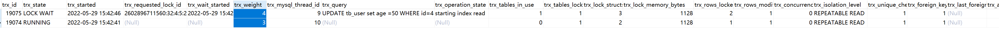

# MySQL 运维篇


## mysql  死锁及解决办法


### 查询死锁

#### 首先构建一个死锁

开启两个事物A、B。在事物A中更新id为3的行，在事物B中更新id为4的行。然后在事物A中更新id为4的行，在事物B中更新id为3的行。至此，锁成。


#### 查看正在进行中的事物

执行如下SQL：

```
SELECT * FROM information_schema.INNODB_TRX
```

查询结果：



字段说明：


#### 查看正在锁的事物

执行如下SQL：

```sql
# MYSQL 8.0 以前版本
SELECT * FROM INFORMATION_SCHEMA.INNODB_LOCKS;

# MYSQL 8.0 及以后版本
SELECT * FROM `performance_schema`.data_locks;
```

####  查看等待锁的事务

```sql
# MYSQL 8.0 以前版本
SELECT * FROM INFORMATION_SCHEMA.INNODB_LOCK_WAITS;

# MYSQL 8.0 及以后版本
SELECT * FROM `performance_schema`.data_lock_waits;
```

#### 查询是否锁表

```sql
SHOW OPEN TABLES where In_use > 0;
```

