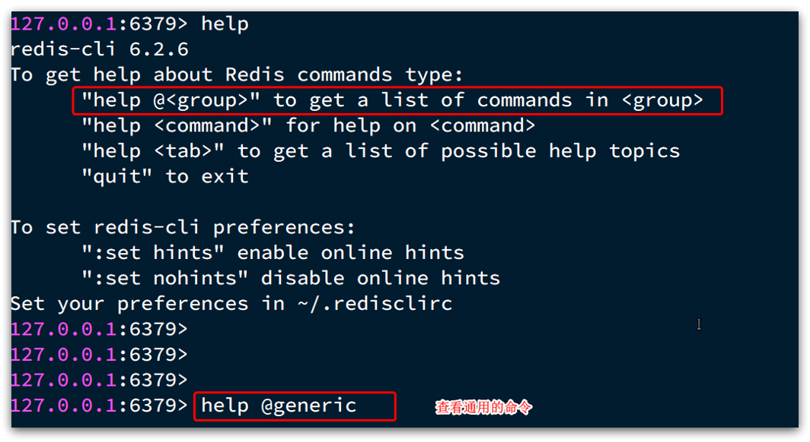
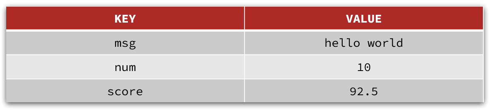
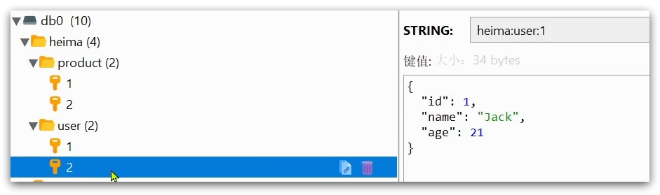
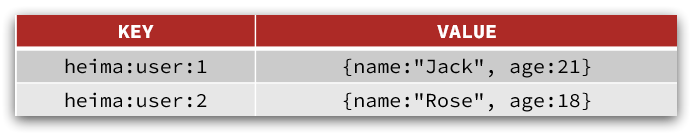
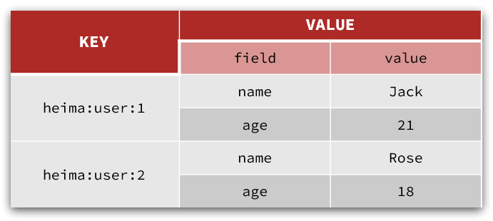
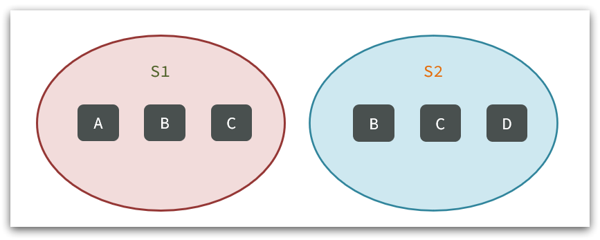
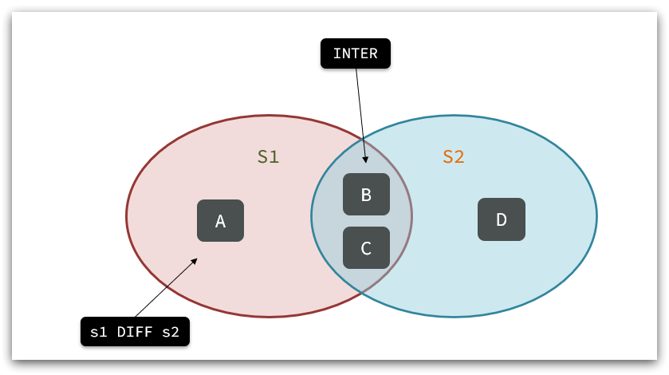

# Redis 基础

## 一、初识Redis

### 1.1 认识Redis

Redis诞生于2009年全称是**Re**mote  **D**ictionary **S**erver 远程词典服务器，是一个基于内存的键值型NoSQL数据库。

**特征**：

- 键值（key-value）型，value支持多种不同数据结构，功能丰富
- 单线程，每个命令具备原子性
- 低延迟，速度快（基于内存、IO多路复用、良好的编码）。
- 支持数据持久化
- 支持主从集群、分片集群
- 支持多语言客户端

**作者**：Antirez

### 1.2 Redis 安装

#### 下载源码

```
 wget https://download.redis.io/redis-stable.tar.gz
```

#### 编译Redis

```
// 解压
tar zxvf redis-stable.tar.gz

// 编译之前需要安装make和gcc
sudo apt install make
sudo apt-get install gcc
sudo apt install pkg-config

// 编译
make
```

编译过程中报了个错误

```
cd src && make all
make[1]: Entering directory '/home/xuliang/developer/env/redis-stable/src'
/bin/sh: 1: pkg-config: not found
    CC adlist.o
In file included from adlist.c:34:
zmalloc.h:50:10: fatal error: jemalloc/jemalloc.h: No such file or directory
   50 | #include <jemalloc/jemalloc.h>
      |          ^~~~~~~~~~~~~~~~~~~~~
compilation terminated.
make[1]: *** [Makefile:374: adlist.o] Error 1
make[1]: Leaving directory '/home/xuliang/developer/env/redis-stable/src'
```

可以尝试在编译的时候添加一个参数

```
make MALLOC=libc
```

#### 启动服务

编译完成之后在src目录下会生成一下文件

| 文件名          | 描述                            | 备注                 |
| --------------- | ------------------------------- | -------------------- |
| redis-server    | Redis服务端                     |                      |
| redis-sentinel  | Redis Sentinel                  | redis-server的软连接 |
| redis-cli       | Redis命令行工具                 |                      |
| redis-check-rdb | Redis RDB检查工具               |                      |
| redis-check-aof | Redis Append Only File 检查工具 |                      |
| redis-benchmark | Redis 基准/性能测试工具         |                      |


#### 常用的配置文件

如果要让Redis以`后台`方式启动，则必须修改Redis配置文件，就在我们之前解压的redis安装包下（`/usr/local/src/redis-6.2.6`），名字叫redis.conf：

然后修改redis.conf文件中的一些配置：

```properties
# 允许访问的地址，默认是127.0.0.1，会导致只能在本地访问。修改为0.0.0.0则可以在任意IP访问，生产环境不要设置为0.0.0.0
bind 0.0.0.0
# 守护进程，修改为yes后即可后台运行
daemonize yes 
# 密码，设置后访问Redis必须输入密码
requirepass 123321
```

Redis的其它常见配置：

```properties
# 监听的端口
port 6379
# 工作目录，默认是当前目录，也就是运行redis-server时的命令，日志、持久化等文件会保存在这个目录
dir .
# 数据库数量，设置为1，代表只使用1个库，默认有16个库，编号0~15
databases 1
# 设置redis能够使用的最大内存
maxmemory 512mb
# 日志文件，默认为空，不记录日志，可以指定日志文件名
logfile "redis.log"
```


## 二、Redis常见命令

Redis是典型的key-value数据库，key一般是字符串，而value包含很多不同的数据类型：


不同类型的命令称为一个group，我们也可以通过help命令来查看各种不同group的命令：




### 2.1 Redis通用命令

通用指令是部分数据类型的，都可以使用的指令，常见的有：

- KEYS：查看符合模板的所有key
- DEL：删除一个指定的key
- EXISTS：判断key是否存在
- EXPIRE：给一个key设置有效期，有效期到期时该key会被自动删除
- TTL：查看一个KEY的剩余有效期

通过help [command] 可以查看一个命令的具体用法，例如：

```shell
# 查看keys命令的帮助信息：
127.0.0.1:6379> help keys

KEYS pattern
summary: Find all keys matching the given pattern
since: 1.0.0
group: generic
```

### 2.2.String类型

String类型，也就是字符串类型，是Redis中最简单的存储类型。

其value是字符串，不过根据字符串的格式不同，又可以分为3类：

- string：普通字符串
- int：整数类型，可以做自增、自减操作
- float：浮点类型，可以做自增、自减操作

不管是哪种格式，底层都是字节数组形式存储，只不过是编码方式不同。字符串类型的最大空间不能超过512m.




#### 2.2.1.String的常见命令

String的常见命令有：

- SET：添加或者修改已经存在的一个String类型的键值对
- GET：根据key获取String类型的value
- MSET：批量添加多个String类型的键值对
- MGET：根据多个key获取多个String类型的value
- INCR：让一个整型的key自增1
- INCRBY:让一个整型的key自增并指定步长，例如：incrby num 2 让num值自增2
- INCRBYFLOAT：让一个浮点类型的数字自增并指定步长
- SETNX：添加一个String类型的键值对，前提是这个key不存在，否则不执行
- SETEX：添加一个String类型的键值对，并且指定有效期


#### 2.2.2.Key结构

Redis没有类似MySQL中的Table的概念，我们该如何区分不同类型的key呢？

例如，需要存储用户、商品信息到redis，有一个用户id是1，有一个商品id恰好也是1，此时如果使用id作为key，那就会冲突了，该怎么办？

我们可以通过给key添加前缀加以区分，不过这个前缀不是随便加的，有一定的规范：

Redis的key允许有多个单词形成层级结构，多个单词之间用':'隔开，格式如下：

```
	项目名:业务名:类型:id
```

这个格式并非固定，也可以根据自己的需求来删除或添加词条。这样以来，我们就可以把不同类型的数据区分开了。从而避免了key的冲突问题。

例如我们的项目名称叫 heima，有user和product两种不同类型的数据，我们可以这样定义key：

- user相关的key：**heima:user:1**

- product相关的key：**heima:product:1**


如果Value是一个Java对象，例如一个User对象，则可以将对象序列化为JSON字符串后存储：

| **KEY**         | **VALUE**                                  |
| --------------- | ------------------------------------------ |
| heima:user:1    | {"id":1,  "name": "Jack", "age": 21}       |
| heima:product:1 | {"id":1,  "name": "小米11", "price": 4999} |

并且，在Redis的桌面客户端中，还会以相同前缀作为层级结构，让数据看起来层次分明，关系清晰：




### 2.3.Hash类型

Hash类型，也叫散列，其value是一个无序字典，类似于Java中的HashMap结构。

String结构是将对象序列化为JSON字符串后存储，当需要修改对象某个字段时很不方便：




Hash结构可以将对象中的每个字段独立存储，可以针对单个字段做CRUD：



Hash的常见命令有：

- HSET key field value：添加或者修改hash类型key的field的值

- HGET key field：获取一个hash类型key的field的值

- HMSET：批量添加多个hash类型key的field的值

- HMGET：批量获取多个hash类型key的field的值

- HGETALL：获取一个hash类型的key中的所有的field和value
- HKEYS：获取一个hash类型的key中的所有的field
- HINCRBY:让一个hash类型key的字段值自增并指定步长
- HSETNX：添加一个hash类型的key的field值，前提是这个field不存在，否则不执行


### 2.4.List类型

Redis中的List类型与Java中的LinkedList类似，可以看做是一个双向链表结构。既可以支持正向检索和也可以支持反向检索。

特征也与LinkedList类似：

- 有序
- 元素可以重复
- 插入和删除快
- 查询速度一般

常用来存储一个有序数据，例如：朋友圈点赞列表，评论列表等。


List的常见命令有：

- LPUSH key element ... ：向列表左侧插入一个或多个元素
- LPOP key：移除并返回列表左侧的第一个元素，没有则返回nil
- RPUSH key element ... ：向列表右侧插入一个或多个元素
- RPOP key：移除并返回列表右侧的第一个元素
- LRANGE key star end：返回一段角标范围内的所有元素
- BLPOP和BRPOP：与LPOP和RPOP类似，只不过在没有元素时等待指定时间，而不是直接返回nil


### 2.5.Set类型

Redis的Set结构与Java中的HashSet类似，可以看做是一个value为null的HashMap。因为也是一个hash表，因此具备与HashSet类似的特征：

- 无序

- 元素不可重复

- 查找快

- 支持交集、并集、差集等功能


Set的常见命令有：

- SADD key member ... ：向set中添加一个或多个元素
- SREM key member ... : 移除set中的指定元素
- SCARD key： 返回set中元素的个数
- SISMEMBER key member：判断一个元素是否存在于set中
- SMEMBERS：获取set中的所有元素
- SINTER key1 key2 ... ：求key1与key2的交集


例如两个集合：s1和s2:



求交集：SINTER s1 s2

求s1与s2的不同：SDIFF s1 s2



练习：

1. 将下列数据用Redis的Set集合来存储：

- 张三的好友有：李四、王五、赵六
- 李四的好友有：王五、麻子、二狗

2. 利用Set的命令实现下列功能：

- 计算张三的好友有几人
- 计算张三和李四有哪些共同好友
- 查询哪些人是张三的好友却不是李四的好友
- 查询张三和李四的好友总共有哪些人
- 判断李四是否是张三的好友
- 判断张三是否是李四的好友
- 将李四从张三的好友列表中移除


### 2.6.SortedSet类型

Redis的SortedSet是一个可排序的set集合，与Java中的TreeSet有些类似，但底层数据结构却差别很大。SortedSet中的每一个元素都带有一个score属性，可以基于score属性对元素排序，底层的实现是一个跳表（SkipList）加 hash表。

SortedSet具备下列特性：

- 可排序
- 元素不重复
- 查询速度快

因为SortedSet的可排序特性，经常被用来实现排行榜这样的功能。


SortedSet的常见命令有：

- ZADD key score member：添加一个或多个元素到sorted set ，如果已经存在则更新其score值
- ZREM key member：删除sorted set中的一个指定元素
- ZSCORE key member : 获取sorted set中的指定元素的score值
- ZRANK key member：获取sorted set 中的指定元素的排名
- ZCARD key：获取sorted set中的元素个数
- ZCOUNT key min max：统计score值在给定范围内的所有元素的个数
- ZINCRBY key increment member：让sorted set中的指定元素自增，步长为指定的increment值
- ZRANGE key min max：按照score排序后，获取指定排名范围内的元素
- ZRANGEBYSCORE key min max：按照score排序后，获取指定score范围内的元素
- ZDIFF、ZINTER、ZUNION：求差集、交集、并集

注意：所有的排名默认都是升序，如果要降序则在命令的Z后面添加REV即可，例如：

- **升序**获取sorted set 中的指定元素的排名：ZRANK key member

- **降序**获取sorted set 中的指定元素的排名：ZREVRANK key memeber


练习题：

将班级的下列学生得分存入Redis的SortedSet中：

Jack 85, Lucy 89, Rose 82, Tom 95, Jerry 78, Amy 92, Miles 76

并实现下列功能：

- 删除Tom同学
- 获取Amy同学的分数
- 获取Rose同学的排名
- 查询80分以下有几个学生
- 给Amy同学加2分
- 查出成绩前3名的同学
- 查出成绩80分以下的所有同学


## 三、Java客户端


| 名称     | 介绍                                                         |
| -------- | ------------------------------------------------------------ |
| Jedis    | 以Redis命令作为方法名称，学习成本低，简单实用<br/>但是Jedis实例是线程不安全的，多线程环境下需要基<br/>于连接池来使用 |
| Lettuce  | Lettuce:是基于Netty实现的，支持同步、异步和响<br/>应式编程方式，并且是线程安全的。支持Redis的哨兵<br/>模式、集群模式和管道模式。 |
| Redisson | Redisson,是一个基于Redis?实现的分布式、可伸缩的<br/>Java数据结构集合。包含了诸如Map、Queue、Lock、<br/>Semaphore、AtomicLong等强大功能 |

### 3.1 Jedis客户端

【1】引入依赖：

```xml
<!--jedis-->
<dependency>
    <groupId>redis.clients</groupId>
    <artifactId>jedis</artifactId>
    <version>3.7.0</version>
</dependency>
<!--单元测试-->
<dependency>
    <groupId>org.junit.jupiter</groupId>
    <artifactId>junit-jupiter</artifactId>
    <version>5.7.0</version>
    <scope>test</scope>
</dependency>
```

【2】建立连接

```java
private Jedis jedis;

@BeforeEach
void setUp() {
    // 1.建立连接
    jedis = new Jedis("localhost", 6379);
    // 2.设置密码
    jedis.auth("123321");
    // 3.选择库
    jedis.select(0);
}
@Test
void testString() {
    // 存入数据
    String result = jedis.set("name", "虎哥");
    System.out.println("result = " + result);
    // 获取数据
    String name = jedis.get("name");
    System.out.println("name = " + name);
}

@Test
void testHash() {
    // 插入hash数据
    jedis.hset("user:1", "name", "Jack");
    jedis.hset("user:1", "age", "21");

    // 获取
    Map<String, String> map = jedis.hgetAll("user:1");
    System.out.println(map);
}
@AfterEach
void tearDown() {
    if (jedis != null) {
        jedis.close();
    }
}
```


**使用Jedis连接池**

Jedis本身是线程不安全的，并且频繁的创建和销毁连接会有性能损耗，因此我们推荐大家使用Jedis连接池代替Jedis的直连方式。

```java
public class JedisConnectionFactory {

    private static JedisPool jedisPool;

    static {
        // 配置连接池
        JedisPoolConfig poolConfig = new JedisPoolConfig();
        poolConfig.setMaxTotal(8);
        poolConfig.setMaxIdle(8);
        poolConfig.setMinIdle(0);
        poolConfig.setMaxWaitMillis(1000);
        // 创建连接池对象，参数：连接池配置、服务端ip、服务端端口、超时时间、密码
        jedisPool = new JedisPool(poolConfig, "localhost", 6379, 1000, "123321");
    }

    public static Jedis getJedis(){
        return jedisPool.getResource();
    }
}
// 获取jedis连接
// jedis = JedisConnectionFactory.getJedis();
```


### 3.2 Spring Data Redis


----