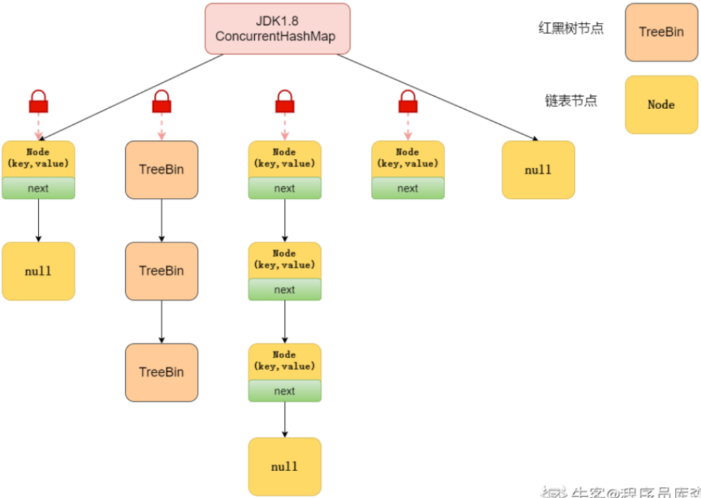

# Java 并发容器


#### ConcurrentHashMap实现总结

##### JDK1.8中的实现

和 jdk1.8 的 HashMap 的实现一样，采用了 Node数组+链表+红黑树的实现方式，抛弃了 jdk1.7中的 Segment 分段锁机制，采用 Synchronized 和 CAS 实现更加细粒度的锁。

将锁的级别控制在了更细粒度的哈希桶数组元素级别，只要锁住这个桶的头结点，就不会影响其他哈希桶数组元素的读写，相对于 1.7 大大提高了并发度。



**源码分析**


首先来看一下Node节点数据

```java
static class Node<K,V> implements Map.Entry<K,V> {
    final int hash;
    final K key;
    volatile V val;
    volatile Node<K,V> next;

    Node(int hash, K key, V val, Node<K,V> next) {
        this.hash = hash;
        this.key = key;
        this.val = val;
        this.next = next;
    }

    public final K getKey()       { return key; }
    public final V getValue()     { return val; }
    public final int hashCode()   { return key.hashCode() ^ val.hashCode(); }
    public final String toString(){ return key + "=" + val; }
    public final V setValue(V value) {
        throw new UnsupportedOperationException();
    }

    public final boolean equals(Object o) {
        Object k, v, u; Map.Entry<?,?> e;
        return ((o instanceof Map.Entry) &&
                (k = (e = (Map.Entry<?,?>)o).getKey()) != null &&
                (v = e.getValue()) != null &&
                (k == key || k.equals(key)) &&
                (v == (u = val) || v.equals(u)));
    }

    /**
         * Virtualized support for map.get(); overridden in subclasses.
         */
    Node<K,V> find(int h, Object k) {
        Node<K,V> e = this;
        if (k != null) {
            do {
                K ek;
                if (e.hash == h &&
                    ((ek = e.key) == k || (ek != null && k.equals(ek))))
                    return e;
            } while ((e = e.next) != null);
        }
        return null;
    }
}

```

这个结构和HashMap的结构很类似，除了保存hash, k,v之外，还保存了一个next节点，来构成一个链表。并且还提供了一个find方法来查询链表元素。


常量值

```java
private static final int MAXIMUM_CAPACITY = 1 << 30;	// 最大容量
private static final int DEFAULT_CAPACITY = 16;		// 默认容量
static final int MAX_ARRAY_SIZE = Integer.MAX_VALUE - 8;	// 最大数组长度
private static final int DEFAULT_CONCURRENCY_LEVEL = 16;	// 默认并行级别
private static final float LOAD_FACTOR = 0.75f;				// 负载系数
static final int TREEIFY_THRESHOLD = 8;						// 树化阈值
static final int UNTREEIFY_THRESHOLD = 6;					// 取消树化阈值
static final int MIN_TREEIFY_CAPACITY = 64;					// 最小树化数组容量，转换为红黑树的最小数组长度
private static final int MIN_TRANSFER_STRIDE = 16;			
private static int RESIZE_STAMP_BITS = 16;
private static final int MAX_RESIZERS = (1 << (32 - RESIZE_STAMP_BITS)) - 1;		// 扩容的最大的线程的数量
private static final int RESIZE_STAMP_SHIFT = 32 - RESIZE_STAMP_BITS;
static final int MOVED     = -1; // hash for forwarding nodes
static final int TREEBIN   = -2; // hash for roots of trees
static final int RESERVED  = -3; // hash for transient reservations
static final int HASH_BITS = 0x7fffffff; // usable bits of normal node hash			// hash 位数,int 最大值
static final int NCPU = Runtime.getRuntime().availableProcessors();			// 获取CPU核数
private static final ObjectStreamField[] serialPersistentFields = {			// 序列化兼容性
    new ObjectStreamField("segments", Segment[].class),
    new ObjectStreamField("segmentMask", Integer.TYPE),
    new ObjectStreamField("segmentShift", Integer.TYPE)
};
```

initTable()

```java
private final Node<K,V>[] initTable() {
    Node<K,V>[] tab; int sc;
    while ((tab = table) == null || tab.length == 0) {
		//如果一个线程发现sizeCtl<0，意味着另外的线程执行CAS操作成功，当前线程只需要让出cpu时间片
        if ((sc = sizeCtl) < 0) 
            // 使当前线程由执行状态变为就绪状态，让出cpu
            Thread.yield(); // lost initialization race; just spin
        // compareAndSwapInt参数(要修改的值的对象,要修改的数据的值在内存中的偏移量(找到要修改的值),期望内存中的值，要修改内存的值)
        else if (U.compareAndSwapInt(this, SIZECTL, sc, -1)) {
            try {
                if ((tab = table) == null || tab.length == 0) {
                    int n = (sc > 0) ? sc : DEFAULT_CAPACITY;
                    @SuppressWarnings("unchecked")
                    Node<K,V>[] nt = (Node<K,V>[])new Node<?,?>[n];
                    table = tab = nt;
                    sc = n - (n >>> 2);  //0.75*capacity
                }
            } finally {
                sizeCtl = sc;
            }
            break;
        }
    }
    return tab;
}
```

putValue()

```java
final V putVal(K key, V value, boolean onlyIfAbsent) {
    if (key == null || value == null) throw new NullPointerException();
    // 将 key的hash值再 hash，双重 hash，降低冲突概率
    int hash = spread(key.hashCode());
    int binCount = 0;
    for (Node<K,V>[] tab = table;;) {
        Node<K,V> f; int n, i, fh;
        // 判断是否为空
        if (tab == null || (n = tab.length) == 0)
            // 初始化table
            tab = initTable();
        // 当前 bucket 为空，使用 cas 机制将put的值放到此bucket,put操作完成
        else if ((f = tabAt(tab, i = (n - 1) & hash)) == null) {
            if (casTabAt(tab, i, null, new Node<K,V>(hash, key, value, null)))
                break;                   // no lock when adding to empty bin
        }
        // 如果bucket不为空,并且hash = -1,说明当前map正在扩容,其他线程先协助扩容,加快速度(多线程扩容)
        else if ((fh = f.hash) == MOVED)
            tab = helpTransfer(tab, f);
        // 如果 hash 冲突了,且 hash 值不为 -1
        else {
            V oldVal = null;
            // 同步 f 节点，防止增加链表的时候导致链表成环状
            synchronized (f) {
                // 如果对应的下标位置的节点没有改变
                if (tabAt(tab, i) == f) {
                    // 如果 f 节点的hash >= 0
                    if (fh >= 0) {
                        // 链表初始长度
                        binCount = 1;
                        // 死循环,直至将节点添加到链表尾部,binCount用来计算链表长度
                        for (Node<K,V> e = f;; ++binCount) {
                            K ek;
                            // 如果 e 的 key 与要插入的节点key值相同 或者 e 的hash 与 要插入的节点的 hash 相同
                            if (e.hash == hash &&
                                ((ek = e.key) == key ||
                                 (ek != null && key.equals(ek)))) {
                                oldVal = e.val;
                                if (!onlyIfAbsent)
                                    // 完成节点赋值，put操作成功
                                    e.val = value;
                                break;
                            }
                            Node<K,V> pred = e;
                            // 判断 e 是否有后继节点,如否,将后继节点赋给 e,循环
                            if ((e = e.next) == null) {
                                pred.next = new Node<K,V>(hash, key,
                                                          value, null);
                                break;
                            }
                        }
                    }
                    // 如果 f 节点的 hash < 0 并且 f 是树
                    else if (f instanceof TreeBin) {
                        Node<K,V> p;
                        binCount = 2;
                        // 向树中添加节点
                        if ((p = ((TreeBin<K,V>)f).putTreeVal(hash, key,
                                                              value)) != null) {
                            oldVal = p.val;
                            if (!onlyIfAbsent)
                                p.val = value;
                        }
                    }
                }
            }
            // 链表长度 >= 8 时，将链表转换为红黑树
            if (binCount != 0) {
                if (binCount >= TREEIFY_THRESHOLD)
                    treeifyBin(tab, i);
                if (oldVal != null)
                    return oldVal;
                break;
            }
        }
    }
    // 更新容器容量,并判断是否需要扩容
    addCount(1L, binCount);
    return null;
}
```

helpTransfer()

```java
 final Node<K,V>[] helpTransfer(Node<K,V>[] tab, Node<K,V> f) {
     Node<K,V>[] nextTab; int sc;
     // 数据校验,如果 tab不为null 并且node节点是转移类型 并且 node 节点的 nextTable 不为null，符合以上条件尝试协助扩容操作
     if (tab != null && (f instanceof ForwardingNode) &&=--
         (nextTab = ((ForwardingNode<K,V>)f).nextTable) != null) {
         // 根据length得到一个标识符号
         int rs = resizeStamp(tab.length);
         // 如果 nextTab 和 tab 都没有被并发修改 并且 sizeCtl < 0(说明还在扩容)
         while (nextTab == nextTable && table == tab &&
                (sc = sizeCtl) < 0) {
             // sc 右移16位 != 标识 (sc 前16位不等于标识符,代表标识符变化了)
             // sc == rs + 1 (代表扩容结束了,默认第一个协助扩容的线程设置 sc = rs左移16位+2,当第一个线程结束扩容了,会将 sc -1,所以 sc = rs+1代表扩容结束了)
             // sc == rs + MAX_RESIZERS (sc = rs+65535,如果达到了最大协助线程的数量)
             // transferIndex <= 0 (转移下标正在调整,代表扩容结束)
             // 满足以上任一条件,结束协助扩容
             if ((sc >>> RESIZE_STAMP_SHIFT) != rs || sc == rs + 1 ||
                 sc == rs + MAX_RESIZERS || transferIndex <= 0)
                 break;
             // 如果以上都不是,将 sizeCTL + 1 ,标识增加了一个线程协助扩容
             if (U.compareAndSwapInt(this, SIZECTL, sc, sc + 1)) {
                 // 将节点转移到新table
                 transfer(tab, nextTab);
                 break;
             }
         }
         return nextTab;
     }
     return table;
 }
```

addCount()

```java
// 更新容器容量方法
private final void addCount(long x, int check) {
    CounterCell[] as; long b, s;
    // 如果counterCells不为null 或者 更新容器容量不成功时
    if ((as = counterCells) != null ||
        !U.compareAndSwapLong(this, BASECOUNT, b = baseCount, s = b + x)) {
        CounterCell a; long v; int m;
        boolean uncontended = true;
        if (as == null || (m = as.length - 1) < 0 ||
            (a = as[ThreadLocalRandom.getProbe() & m]) == null ||
            !(uncontended =
              U.compareAndSwapLong(a, CELLVALUE, v = a.value, v + x))) {
            // 多线程 cas 失败时执行, 会向 CounterCell中存储因为高并发导致cas更新baseCounter失败时的值
            fullAddCount(x, uncontended);
            return;
        }
        if (check <= 1)
            return;
        // 计算容器容量
        s = sumCount();
    }
    if (check >= 0) {
        Node<K,V>[] tab, nt; int n, sc;
        // 当条件满足开始扩容
        while (s >= (long)(sc = sizeCtl) && (tab = table) != null &&
               (n = tab.length) < MAXIMUM_CAPACITY) {
            int rs = resizeStamp(n);
            // 说明此时已经有线程正在扩容
            if (sc < 0) {
                if ((sc >>> RESIZE_STAMP_SHIFT) != rs || sc == rs + 1 ||
                    sc == rs + MAX_RESIZERS || (nt = nextTable) == null ||
                    transferIndex <= 0)
                    // 有线程在扩容时,直接break
                    break;
                // 此时其他线程如果扩容完毕,修改 sc 的值,继续扩容
                if (U.compareAndSwapInt(this, SIZECTL, sc, sc + 1))
                    transfer(tab, nt);
            }
            else if (U.compareAndSwapInt(this, SIZECTL, sc,
                                         (rs << RESIZE_STAMP_SHIFT) + 2))
                transfer(tab, null);
            // 计算容器容量
            s = sumCount();
        }
    }
}
```

get()

```java
public V get(Object key) {
    Node<K,V>[] tab; Node<K,V> e, p; int n, eh; K ek;
    // 双重 hash
    int h = spread(key.hashCode());
    // 如果 table 不为空 并且查找的 key 的节点不为 null
    if ((tab = table) != null && (n = tab.length) > 0 &&
        (e = tabAt(tab, (n - 1) & h)) != null) {
        // 如果节点 e 的hash 是要查找的key的hash
        if ((eh = e.hash) == h) {
            // 如果节点 e 的 key 与要查找的key相等
            if ((ek = e.key) == key || (ek != null && key.equals(ek)))
                // 返回 value
                return e.val;
        }
        // 判断是否是红黑树
        else if (eh < 0)
            // 遍历红黑树查找元素
            return (p = e.find(h, key)) != null ? p.val : null;
        // 遍历链表查找key值所在的节点e
        while ((e = e.next) != null) {
            if (e.hash == h &&
                ((ek = e.key) == key || (ek != null && key.equals(ek))))
                return e.val;
        }
    }
    return null;
}

```

size()

```java
public int size() {
    long n = sumCount();
    return ((n < 0L) ? 0 :
            (n > (long)Integer.MAX_VALUE) ? Integer.MAX_VALUE :
            (int)n);
}

// baseCount 指的是容器容量
private transient volatile long baseCount;

final long sumCount() {
    // CounterCell 就是用来记录容器容量的内部类
    CounterCell[] as = counterCells; CounterCell a;
    long sum = baseCount;
    if (as != null) {
        // 累加容器数量,因为CounterCell记录的是因为高并发导致更新baseCount失败时的值,所以,需要遍历CounterCell进行累加
        for (int i = 0; i < as.length; ++i) {
            if ((a = as[i]) != null)
                sum += a.value;
        }
    }
    return sum;
}
```

