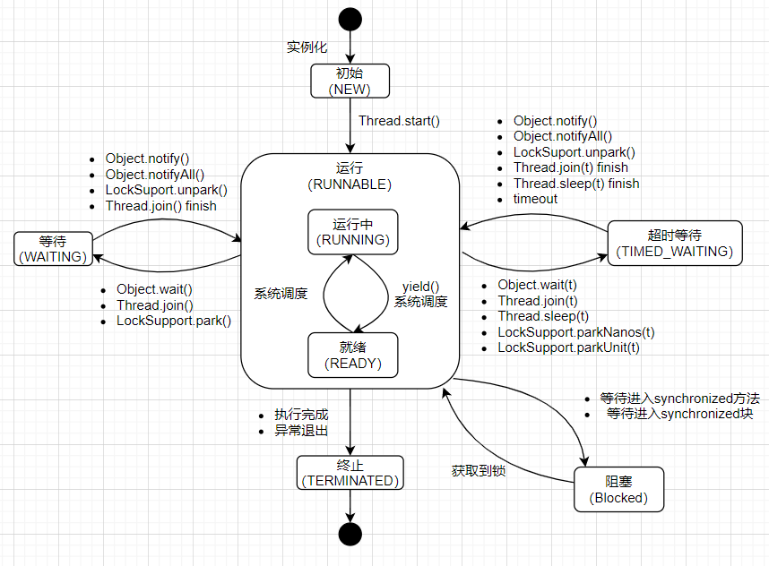

# Java并发编程基础


## 内存模型


## 线程

### 线程简介

操作系统在执行一个程序是会创建一个进程，在进程内可以创建多个线程，线程也是操作系统能够调度的最小单元。在JVM虚拟机内，线程拥有自己的程序计数器，虚拟机栈和局部变量等属性，也能够访问共享变量。CPU在这些线程上高速切换，让使用者感觉这些线程是在同时执行的。

Java程序天生就是多线程的。

使用多线程主要原因有一些几点：

- 更多的处理器核心：多线程可以释放多核处理器的性能
- 更快的响应时间：利用多线程处理复杂业务。
- 更好的编程模型：Java为分开发人员提供了良好的编程模型。

#### 线程的优先级

Java把线程优先级分为1~10，默认的优先级是5，可以通过setPriority(int)来设置。

> Java设置的优先级是否生效还跟操作系统有关。

#### 线程的状态


线程在运行周期中存在6种不同的状态

| 状态名称     | 说明                                                         |
| ------------ | ------------------------------------------------------------ |
| NEW          | 初试状态，线程被构建，但是还没有调用start方法                |
| RUNNABLE     | 运行状态，Java线程将操作系统中的就绪和运行状态状态统称“运行中” |
| BLOCKED      | 阻塞状态，表示线程阻塞与锁                                   |
| WAITING      | 等待状态，表示线程进入等待状态，进入该状态表示当前线程需要等待其他线程作出一些特定动作（通知或中断） |
| TIME_WAITING | 超时等待，改状态不同有WAITING，他可以在指定时间内自行返回    |
| TERMINATED   | 终止状态，表示当前线程已经执行完毕                           |


线程的状态变迁




#### Daemon线程

Daemon线程是一种支持性线程。当Java虚拟机中不存在非Daemon线程时，Java虚拟机将会退出。

> Daemon线程需要在线程启动之前进行设置，在启动之后就不能在设置了。
>
> 可以通过Thread.setDeamon(true)来进行设置。


### 启动和终止线程


#### 构造和启动线程

```java
public class MyThread{

    class Thread0 implements Runnable{
        @Override
        public void run() {
            System.out.println("process thread ...");
        }
    }

    public void start(){
        Thread thread = new Thread(new Thread0());
        thread.start();
    }
}
```


#### 理解中断

略


#### 终止线程

