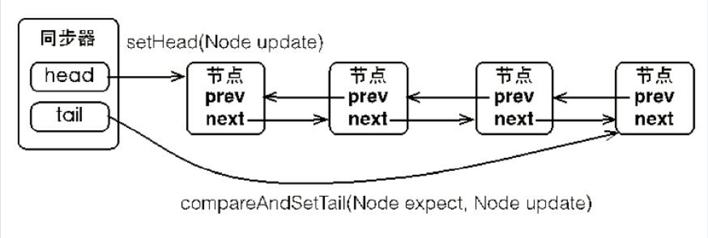
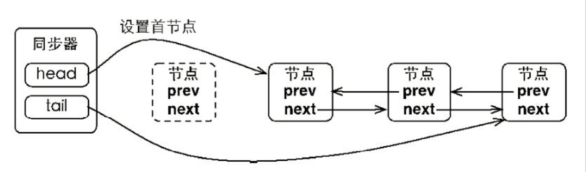
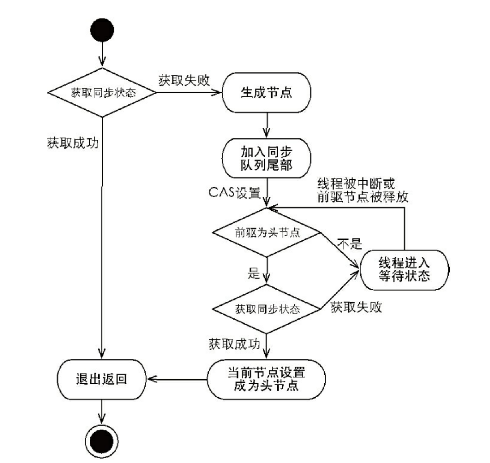
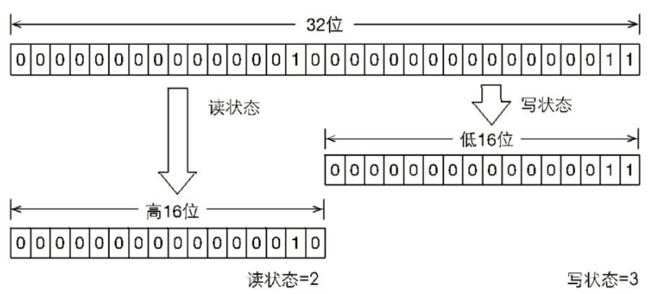
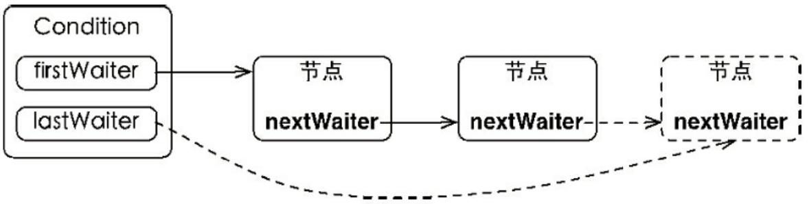

# Java中的锁


## Lock接口

Lock是在JDK1.5中添加的，于synchronized相比，Lock接口最大的有点就是对锁获取于释放的可操作性性。


Lock接口提供的synchronized不具备的功能。

| 特性               | 描述                                                         |
| ------------------ | ------------------------------------------------------------ |
| 尝试非阻塞的获取锁 | 当前线程尝试获取锁，如果这一时刻锁没有被其他线程获取到，则成功获取并持有锁。 |
| 能被中断的获取锁   | 于synchronized不同，获取到锁的线程能够响应中断，当获取到锁的线程被中断时，中断异常将会被抛出，同事所会被释放。 |
| 超时获取锁         | 在指定的截止时间之前获取锁，如果截止时间到了仍旧无法获取锁，则返回。 |


Lock锁的典型使用方式：

```java
Lock lock = new ReentrantLock();
lock.lock();
try{
}finally{
    lock.unlock();
}
```

在finally中编写释放锁的代码，来保证锁的正常释放。

不要再try块内进行锁的获取，当获取锁异常时，也会导致锁无故释放。


下面先简单介绍一下Lock提供的接口：

| 方法名                                    | 描述                                                         |
| ----------------------------------------- | ------------------------------------------------------------ |
| void lock()                               | 获取锁。调用该方法当前线程将会获取锁，当锁获得后，从该方法返回。 |
| void lockInterruptibly()                  | 可中断地获取锁，和lock方法的不同之处在于该方法会响应中断，即在<br/>锁的获取中可以中断当前线程 |
| boolean tryLock()                         | 尝试非阻塞的获取锁，调用该方法后立刻返回，如果能够获取则返回<br/>true,否则返回false |
| boolean tryLock(long time, TimeUnit unit) | 超时的获取锁，当前线程在以下3种情况下会返回：<br/>①当前线程在超时时间内获得了锁<br/>②当前线程在超时时间内被中断<br/>③超时时间结束，返回false |
| void unlock()                             | 释放锁                                                       |
| Condition newCondition()                  | 获取等待通知组件，该组件和当前的锁绑定，当前线程只有获得了锁，<br/>才能调用该组件的waitO方法，而调用后，当前线程将释放锁 |


## 队列同步器

AbstractQueuedSynchronizer(AQS)，即抽象队列同步器，提供了一套可用于实现锁同步机制的框架，不夸张地说，AQS是JUC同步框架的基石。AQS通过一个FIFO队列维护线程同步状态，实现类只需要继承该类，并重写指定方法即可实现一套线程同步机制。

AQS根据资源互斥级别提供了**独占和共享**两种资源访问模式；同时其定义Condition结构提供了wait/signal等待唤醒机制。在JUC中，诸如ReentrantLock、CountDownLatch等都基于AQS实现。


### AQS 框架原理

AQS的原理并不复杂，AQS维护了一个volatile int state变量和一个CLH(三个人名缩写)双向队列，队列中的节点持有线程引用，每个节点均可通过getState()，setState()，compareAndSetState()对state进行修改和访问。


当线程获取锁时，即试图对`state`变量做修改，如修改成功则获取锁；如修改失败则包装为节点挂载到队列中，等待持有锁的线程释放锁并唤醒队列中的节点。

**AQS模板方法**

`AQS`内部封装了队列维护逻辑，采用模版方法的模式提供实现了以下方法：

```java
tryAcquire(int);        // 尝试获取独占锁，可获取返回true，否则false
tryRelease(int);        // 尝试释放独占锁，可释放返回true，否则false
tryAcquireShared(int);  // 尝试以共享方式获取锁，失败返回负数，只能获取一次返回0，否则返回个数
tryReleaseShared(int);  // 尝试释放共享锁，可获取返回true，否则false
isHeldExclusively();    // 判断线程是否独占资源
```

如实现类只需实现独占锁/共享锁功能，可只实现`tryAcquire/tryRelease`或`tryAcquireShared/tryReleaseShared`。虽然实现`tryAcquire/tryRelease`可自行设定逻辑，但建议使用`state`方法对`state`变量进行操作以实现同步类。


### AQS实现分析

#### 同步队列

同步器依赖内部的同步队列（一个FIFO双向队列）来完成同步状态管理。当前线程获取同步状态是失败时，同步器会将当前线程以及等待状态等信息构建为一个节点（Node）并将其加入到同步队列中。同时会阻塞当前线程。当同步状态释放时，会吧首节点的线程唤醒，使其再次尝试获取同步状态。

同步队列中的节点（Node）用来保存获取同步状态失败的的线程引用，等待状态以及前驱后集结点，节点属性如下：

| 属性类型与名称  | 描述                                                         |
| --------------- | ------------------------------------------------------------ |
| int waitStatus  | 等待状态<br />包含如下状态<br />1. CANCELLED： 值为1，由于在同步队列中等待的线程等待超时或者被中断，需要<br/>从同步队列中取消等待，节点进入等待状态不会变化<br />2. SIGNAL ：值为-1，后继节点的线程处于等待状态，而当前节点的线程如果释放了<br>同步状态或者被取消，将会通知后继节点，是后继节点的线程得以运行<br />3. CONDITION：值为-2，节点在等待队列中，节点的线程等待在Condition上，当其<br/>他线程Condition调用了signal()方法后，该节点将会从等待队列中转移到同步队列中<br>去。加入到同步队列状态的获取中<br />4. PROPAGATE：值为-3，表示下一次共享时同步状态获取将会无条件的传播下去<br />5. INITIAL：值为0，初始化状态<br /> |
| Node prev       | 前驱节点，当节点加入同步队列时被设置                         |
| Node next       | 后继节点                                                     |
| Node nextWaiter | 等待队列中的后继节点，如果当前节点是共享的，name这个字段是一个SHARED常量，<br/>也就是说节点类型(独占和共享)和等待队列中的后继节点共用同一个字段 |
| Thread thread   | 获取同步状态的线程                                           |


**waitStatus状态详述：**

**CANCELLED**：由于超时或中断，此节点被取消。节点一旦被取消了就不会再改变状态。特别是，取消节点的线程不会再阻塞。

**SIGNAL**：此节点后面的节点已（或即将）被阻止（通过park），因此当前节点在释放或取消时必须断开后面的节点为了避免竞争，acquire方法时前面的节点必须是SIGNAL状态，然后重试原子acquire，然后在失败时阻塞。

**CONDITION：**此节点当前在条件队列中。标记为CONDITION的节点会被移动到一个特殊的条件等待队列（此时状态将设置为0），直到条件时才会被重新移动到同步等待队列 。（此处使用此值与字段的其他用途无关，但简化了机制。）

**PROPAGATE：**传播：应将releaseShared传播到其他节点。这是在doReleaseShared中设置的（仅适用于头部节点），以确保传播继续，即使此后有其他操作介入。

0:以上数值均未按数字排列以简化使用。非负值表示节点不需要发出信号。所以，大多数代码不需要检查特定的值，只需要检查符号。对于正常同步节点，该字段初始化为0；对于条件节点，该字段初始化为条件。它是使用CAS修改的（或者在可能的情况下，使用无条件的volatile写入）。


[AQS : waitStatus = Propagate 的作用解析 以及读锁无法全获取问题 - 执生 - 博客园 (cnblogs.com)](https://www.cnblogs.com/lqlqlq/p/12991275.html?ivk_sa=1024320u)

看图说话，队列同步器的基本数据结构如下：



同步队列包含两个节点类型的引用，一个指向头结点，一个指向尾节点。追加节点的过程通过`compareAndSetTail(Node expect, Node update)`方法来实现，从而保证了追加节点过程的线程安全。

同步队列遵循FIFO原则，首节点是获取同步状态成功的节点，首节点的同步线程在释放同步状态时，或唤醒后继节点，而后继节点在获取同步状态成功时，会将自己设置为首节点。这里需要注意，设置首节点的过程，不需要同步操作，因为每一时刻，只有一个线程能够获取到同步状态。




#### 独占锁分析

通过调用同步器的acquire(int arg)方法可以获取同步状态，该方法对中断不敏感。

```java
public final void acquire(int arg) {
    // tryAcquire需实现类处理，如获取资源成功，直接返回
    if (!tryAcquire(arg) && 
        // 如获取资源失败，将线程包装为Node添加到队列中阻塞等待
        acquireQueued(addWaiter(Node.EXCLUSIVE), arg))
        // 如果在程序执行期间，程序被中断，这里要做中断补偿。
        selfInterrupt();
}

static void selfInterrupt() {
    Thread.currentThread().interrupt();
}
```

该方法主要完成同步状态获取，节点构造，加入同步队列以及在同步队列中自旋等操作。

首先通过tryAcquire()方法线程安全的获取同步状态，如果获取同步状态失败，则构造同步节点，通过addWaiter(Node node)方法加入到同步队列的尾部。Node.EXCLUSIVE表示线程以独占的方式等待锁。最后调用acquireQueued(Node node, int arg)方法来循环获取同步状态。

> 注：这里的tryAcquire是一个抽象方法，需要子类实现。

下面看一下节点的创建及添加过程：

```java
// 构造节点的过程
private Node addWaiter(Node mode) {
    // 创建一个节点
    Node node = new Node(Thread.currentThread(), mode);
    // Try the fast path of enq; backup to full enq on failure
    Node pred = tail;
    if (pred != null) {
        node.prev = pred;
        // 以cas的方式修改tail
        if (compareAndSetTail(pred, node)) {
            // 设置链表额指针
            pred.next = node;
            return node;
        }
    }
    // 如果tail为null，需要初始化
    enq(node);
    return node;
}
/**
 * 第一次向链表添加节点时，tail和head都是null，
 * 这里通过死循环加CAS来保证任务一定完成并且多线程安全，好好体会一下无锁并发。
 */
private Node enq(final Node node) {
    // 死循环的方式初始化链表
    for (;;) {
        Node t = tail;
        if (t == null) { // Must initialize
            // 链表的开头是个空节点
            if (compareAndSetHead(new Node()))
                // 这里初始化完后，会再次进入循环
                tail = head;
        } else {
            // 将node加入链表
            node.prev = t;
            if (compareAndSetTail(t, node)) {
                t.next = node;
                return t;
            }
        }
    }
}
```

首先通过compareAndSetTail(Node expect, Node update)方法来保证线程的安全添加。enq方法则保证线程的初始化列表。

当节点进入同步队列之后，就进入了一个自旋的过程。查看acquireQueued方法：

```java
final boolean acquireQueued(final Node node, int arg) {
    boolean failed = true;
    try {
        // interrupted是中断标记
        boolean interrupted = false;
        // 自旋
        for (;;) {
            final Node p = node.predecessor();
            // 检查node的前置节点是否为头结点 && 尝试获取锁
            if (p == head && tryAcquire(arg)) {
                setHead(node);
                p.next = null; // help GC
                failed = false;
                return interrupted;
            }
            if (shouldParkAfterFailedAcquire(p, node) && parkAndCheckInterrupt())
                interrupted = true;
        }
    } finally {
        if (failed)
            cancelAcquire(node);
    }
}
// 设置为头结点
private void setHead(Node node) {
    // 这里是直接把node设置为头结点，而不是修改头结点的指针。
    head = node;
    node.thread = null;
    node.prev = null;
}
```

这里通过死循环的方式尝试获取同步锁，只有前驱节点是头结点的节点才能获取通过状态。这种方式可以很好的维护一个FIFO队列。

在获取到锁之后，会吧当前节点设置为头结点。

如果没有获取到锁，会执行shouldParkAfterFailedAcquire方法和parkAndCheckInterrupt方法，下面就来看看这两个方法做了什么事情。

```java
// 这里判断在获取同步状态失败后是否需要被park住
private static boolean shouldParkAfterFailedAcquire(Node pred, Node node) {
    int ws = pred.waitStatus;
    if (ws == Node.SIGNAL)
        return true;
    if (ws > 0) {
        // 头结点取消执行了，跳过头结点，重新尝试
        do {
            node.prev = pred = pred.prev;
        } while (pred.waitStatus > 0);
        pred.next = node;
    } else {
        // 将waitStatus改为Node.SIGNAL
        compareAndSetWaitStatus(pred, ws, Node.SIGNAL);
    }
    return false;
}

private final boolean parkAndCheckInterrupt() {
    // park住当前线程
    LockSupport.park(this);
    // 被唤醒时返回中断状态，这里会清除中断状态
    return Thread.interrupted();
}
```


独占式通过状态获取流程：



下面看一下释放锁的逻辑：

```java
public final boolean release(int arg) {
    if (tryRelease(arg)) {
        // 如果释放资源成功，尝试唤醒下一个节点
        Node h = head;
        if (h != null && h.waitStatus != 0)
            unparkSuccessor(h);
        return true;
    }
    return false;
}
private void unparkSuccessor(Node node) {
    int ws = node.waitStatus;
    if (ws < 0)
        compareAndSetWaitStatus(node, ws, 0);

    Node s = node.next;
    if (s == null || s.waitStatus > 0) {
        s = null;
        // 从尾部节点开始遍历，找到最靠前的一个需要执行的节点
        for (Node t = tail; t != null && t != node; t = t.prev)
            if (t.waitStatus <= 0)
                s = t;
    }
    if (s != null)
        // 通过unpark唤醒线程
        LockSupport.unpark(s.thread);
}
```

同样，tryRelease是一个抽象方法。释放资源后，会判断waitStatus状态，唤醒后继节点。

#### 共享锁分析

共享锁与独占锁额区别在于在同一时刻是否有多个线程同时获取到同步状态。

下面直接上代码：

```java
// 已共享方式获取锁
public final void acquireShared(int arg) {
    if (tryAcquireShared(arg) < 0)
        doAcquireShared(arg);
}
// 构造节点放入队列
private void doAcquireShared(int arg) {
    final Node node = addWaiter(Node.SHARED);
    boolean failed = true;
    try {
        boolean interrupted = false;
        for (;;) {
            final Node p = node.predecessor();
            if (p == head) {
                // 如何共享获取的逻辑在tryAcquireShared方法中
                int r = tryAcquireShared(arg);
                if (r >= 0) {
                    // 设置Head节点
                    setHeadAndPropagate(node, r);
                    p.next = null; // help GC
                    if (interrupted)
                        selfInterrupt();
                    failed = false;
                    return;
                }
            }
            if (shouldParkAfterFailedAcquire(p, node) && parkAndCheckInterrupt())
                interrupted = true;
        }
    } finally {
        if (failed)
            cancelAcquire(node);
    }
}
/**
 * propagate 传播
 * 
 */
private void setHeadAndPropagate(Node node, int propagate) {
    Node h = head; // Record old head for check below
    setHead(node);
	// setHead方法会设置一个新的head，h指向的是旧的head
    // if判断会同时判断old head 和new head，（h重新赋值后会指向新的head）
    if (propagate > 0 || h == null || h.waitStatus < 0 || (h = head) == null || h.waitStatus < 0) {
        Node s = node.next;
        if (s == null || s.isShared())
            // 这里直接进入锁释放的逻辑，让后面的节点争抢锁。
            doReleaseShared();
    }
}
```

重点来看tryAcquireShared方法，这是一个抽象方法，实现由子类完成。这里主要说明一下返回值：

- 如果获取共享锁失败，返回负数
- 如果获取共享锁成功，但是后续节点无法获取共享锁，返回0
- 如果获取共享锁成功，而且后续节点也可以获取共享锁，返回正数。

下面看共享锁释放的逻辑：

```java
public final boolean releaseShared(int arg) {
    if (tryReleaseShared(arg)) {
        doReleaseShared();
        return true;
    }
    return false;
}
private void doReleaseShared() {
    for (;;) {
        Node h = head;
        if (h != null && h != tail) {
            int ws = h.waitStatus;
            if (ws == Node.SIGNAL) {
                if (!compareAndSetWaitStatus(h, Node.SIGNAL, 0))
                    continue;            // loop to recheck cases
                unparkSuccessor(h);
            }
            else if (ws == 0 && !compareAndSetWaitStatus(h, 0, Node.PROPAGATE))
                continue;                // loop on failed CAS
        }
        if (h == head)                   // loop if head changed
            break;
    }
}
private void unparkSuccessor(Node node) {
    int ws = node.waitStatus;
    if (ws < 0)
        compareAndSetWaitStatus(node, ws, 0);

    Node s = node.next;
    if (s == null || s.waitStatus > 0) {
        s = null;
        for (Node t = tail; t != null && t != node; t = t.prev)
            if (t.waitStatus <= 0)
                s = t;
    }
    if (s != null)
        LockSupport.unpark(s.thread);
}
```


## ReentrantLock

ReentrantLock，见名知意，就是支出可冲入的锁。它表示该锁能够支持一个线程对 资源的重复加锁。除此之外，该锁还支持获取锁时的公平和非公平性选择。

关于公平锁和非公平锁，在绝对时间上来说，先获取锁的线程先被满足，则为公平锁，否则是非公平锁。ReentrantLock提供了一个构造函数，能够控制锁是公平锁还是非公平锁。

理论上来讲，非公平锁的效率更高，但是公平锁能够减少饥饿发生的概率。


### 如何实现锁的重入

锁的冲重入要解决一下两个问题：

- **线程再次获取锁**：锁需要去识别获取锁的线程是否为当前占据锁的线程，如果是，则再次成功获取。 

- **锁的最终释放**：线程重复n次获取了锁，随后在第n次释放该锁后，其他线程能够获取到 该锁。锁的最终释放要求锁对于获取进行计数自增，计数表示当前锁被重复获取的次数，而锁 被释放时，计数自减，当计数等于0时表示锁已经成功释放。


### ReentrantLock的实现

在ReentrantLock中存在一个Sync的内部类，有关于ReentrantLock所有功能的具体实现，都是在Sync及其子类中完成的，ReentrantLock只是对Sync的一个封装。

下面先来看看ReentrantLock的代码：

```java
public class ReentrantLock implements Lock, java.io.Serializable {
    private static final long serialVersionUID = 7373984872572414699L;
    /** 提供所有实现逻辑的 实现类 内部类 */
    private final Sync sync;

    /** 无参构造，默认使用的是非公平锁  */
    public ReentrantLock() {
        sync = new NonfairSync();
    }

    /** 有参数构造，用来控制公平锁或 */
    public ReentrantLock(boolean fair) {
        sync = fair ? new FairSync() : new NonfairSync();
    }

    /** 加锁 */
    public void lock() {
        sync.lock();
    }

    /** 可中断加锁 */
    public void lockInterruptibly() throws InterruptedException {
        sync.acquireInterruptibly(1);
    }

    /** 尝试加锁，该方法不会阻塞，立即返回 */
    public boolean tryLock() {
        return sync.nonfairTryAcquire(1);
    }

    /** 尝试加锁，等待指定时间 */
    public boolean tryLock(long timeout, TimeUnit unit)
            throws InterruptedException {
        return sync.tryAcquireNanos(1, unit.toNanos(timeout));
    }

    /**  释放锁 */
    public void unlock() {
        sync.release(1);
    }

    /** 是否为公平锁 */
    public final boolean isFair() {
        return sync instanceof FairSync;
    }
}
```

ReentrantLock直接实现Lock接口，并没有继承AQS，由此也可以看出，起面向的是使用者。

在分析源码之前，先说一下state变量，这个变量在AbstractQueuedSynchronizer里定义，表示当前获取锁的线程持有的资源数量。最开始的时候，state默认为0，在争抢锁的过程中，实际就是修改state的过程，修改成功的线程就表示成功争抢到了锁。再然后就是锁重入，在加锁的时候会判断持有锁的线程和当前线程是否相同，如果相同的话，会对state进行累加操作。释放锁的线程就是对state的减减操作，直到state减到0时，唤醒队列中后续等待的线程。

下面来看看Sync的实现(这里只有核心源码)：

```java
/**
 * Sync类直接继承自AbstractQueuedSynchronizer
 */
abstract static class Sync extends AbstractQueuedSynchronizer {
    /** 定义的一个抽象类，有子类实现。公平锁和非公平的差异也是在这个方法的实现中体现的*/
    abstract void lock();
	/** 非公平的获取锁 */
    final boolean nonfairTryAcquire(int acquires) {
        final Thread current = Thread.currentThread();
       	/** 先获取state的状态，如果state==0，说明没有被加锁，这里会直接进行锁的争抢，
       	注意这里也是公平锁和非公平锁不一样的地方*/
        int c = getState();
        if (c == 0) {
            // 以CAS的方式修改锁，入股修改成功，说明争抢到了锁。
            if (compareAndSetState(0, acquires)) {
                setExclusiveOwnerThread(current);
                return true;
            }
        }
        // 如果state不为0，则判断是不是重入锁。
        else if (current == getExclusiveOwnerThread()) {
            // 在争抢到锁后，需要的state加上需要的acquires资源。
            int nextc = c + acquires;
            if (nextc < 0) // overflow
                throw new Error("Maximum lock count exceeded");
            setState(nextc);
            return true;
        }
        // 到这里，说明抢锁失败了，嘿嘿。
        return false;
    }
	/** 锁释放的流程 */
    protected final boolean tryRelease(int releases) {
        int c = getState() - releases;
        // 判断线程是否为当前线程
        if (Thread.currentThread() != getExclusiveOwnerThread())
            throw new IllegalMonitorStateException();
        boolean free = false;
        if (c == 0) {
            free = true;
            setExclusiveOwnerThread(null);
        }
        // 同一个线程不存在并发的问题，所以这里不需要加锁
        setState(c);
        return free;
    }
}
```

在Sync里面有两个重要的方法实现，tryRelease实现了锁的释放逻辑。并且这里考虑到了重入锁的情况。另一个就是nonfairTryAcquire方法，这里主要实现了悲观锁的加锁流程。

还有一个就是抽象方法lock()，这个方法就是加锁的具体流程，但因为公平锁和非公平锁的差异，需要在具体的子类中进行实现。下面就来看看公平锁和非公平锁的实现类：

```java
/**非公平锁的实现
 */
static final class NonfairSync extends Sync {
	// 加锁方法， 这个方法会阻塞
    final void lock() {
        if (compareAndSetState(0, 1))
            setExclusiveOwnerThread(Thread.currentThread());
        else
            acquire(1);
    }
	// 加锁方法，这个不会阻塞
    protected final boolean tryAcquire(int acquires) {
        return nonfairTryAcquire(acquires);
    }
}

/**公平锁的加锁实现类 */
static final class FairSync extends Sync {
    // 加锁 阻塞
    final void lock() {
        acquire(1);
    }

    /* 加锁，非阻塞*/
    protected final boolean tryAcquire(int acquires) {
        final Thread current = Thread.currentThread();
        int c = getState();
        if (c == 0) {
            // 判断队列中是否有等待的线程 && 更改state变量
            if (!hasQueuedPredecessors() && compareAndSetState(0, acquires)) {
                setExclusiveOwnerThread(current);
                return true;
            }
        }
        // 判断是否为重入线程
        else if (current == getExclusiveOwnerThread()) {
            int nextc = c + acquires;
            if (nextc < 0)
                throw new Error("Maximum lock count exceeded");
            setState(nextc);
            return true;
        }
        return false;
    }
}
```


注意公平锁和非公平锁的加锁流程，区别就在于非公平锁一上来就对state进行修改（插队），而公平锁则乖乖的去排队。


重入锁的介绍就到此为止了。


## ReentrantReadWriteLock

读写锁，在同一时刻允许多个读线程进行访问，但是在写线程进行访问时，所有的读线程和其他的写线程均被阻塞。读写锁维护了一对锁，一个读锁和一个写锁，通过分离读锁和写锁，使得并发性相比于一般的写锁有了很大的提升。

读写锁的一些特性：

| 特性       | 说明                                                         |
| ---------- | ------------------------------------------------------------ |
| 公平性选择 | 支持非公平（默认）和公平的锁获取方式，吞吐量还是非公平优于公平。 |
| 可重入     | 读锁和写锁都可以重进入                                       |
| 锁降级     | 遵循获取写锁、获取读锁在释放写锁的次序，写锁能够降级为读锁。 |

### 如何实现读写锁

#### 读写状态的设计

读写锁同样依赖自定义同步器来实现同步功能，而读写状态就是其同步器的同步状态。不同于ReentrantLock，读写锁的自定义同步器需要在同步状态（一个整型变量）上维护多个读线程和一个写线程的状 态，使得该状态的设计成为读写锁实现的关键。读写锁将一个int型的变量切分成了两个部分，高16位表示读，低16位表示写，划分方式如图所示。 



当前同步状态表示一个线程已经获取了写锁，且重进入了两次，同时也连续获取了两次读锁。读写锁是如何迅速确定读和写各自的状态呢？答案是通过位运算。假设当前同步状态 值为S，写状态等于S&0x0000FFFF（将高16位全部抹去），读状态等于S>>>16（无符号补0右移 16位）。当写状态增加1时，等于S+1，当读状态增加1时，等于S+(1<<16)，也就是 S+0x00010000。 

根据状态的划分能得出一个推论：S不等于0时，当写状态（S&0x0000FFFF）等于0时，则读状态（S>>>16）大于0，即读锁已被获取。


#### 写锁的获取与释放

写锁是一个支持重进入的排它锁。如果当前线程已经获取了写锁，则增加写状态。如果当前线程在获取写锁时，读锁已经被获取（读状态不为0）或者该线程不是已经获取写锁的线程，则当前线程进入等待状态，获取写锁的代码实现如下：

```java
protected final boolean tryAcquire(int acquires) {
    Thread current = Thread.currentThread();
    int c = getState();
    // 计算写状态
    int w = exclusiveCount(c);
    if (c != 0) {
        // 如果c!= 0 并且 写状态为0，说明有线程持有读锁，返回false(读锁和写锁互斥)
        // 如果c!= 0 并且 写状态不为0， 但是持有锁的线程不是当前线程，返回fasle(写锁和写锁互斥)
        if (w == 0 || current != getExclusiveOwnerThread())
            return false;
        // 判断加锁次数是否超过上限
        if (w + exclusiveCount(acquires) > MAX_COUNT)
            throw new Error("Maximum lock count exceeded");
        // 设置state
        setState(c + acquires);
        return true;
    }
    
    if (writerShouldBlock() || !compareAndSetState(c, c + acquires))
        return false;
    setExclusiveOwnerThread(current);
    return true;
}
```

该方法除了重入条件（当前线程为获取了写锁的线程）之外，增加了一个读锁是否存在的判断。如果存在读锁，则写锁不能被获取，原因在于：读写锁要确保写锁的操作对读锁可见，如果允许读锁在已被获取的情况下对写锁的获取，那么正在运行的其他读线程就无法感知到当前写线程的操作。因此，只有等待其他读线程都释放了读锁，写锁才能被当前线程获取，而写锁一旦被获取，则其他读写线程的后续访问均被阻塞。 

写锁的释放与ReentrantLock的释放过程基本类似，每次释放均减少写状态，当写状态为0时表示写锁已被释放，从而等待的读写线程能够继续访问读写锁，同时前次写线程的修改对后续读写线程可见。 


#### 读锁的获取与释放

读锁是一个支持重进入的共享锁，它能够被多个线程同时获取，在没有其他写线程访问（或者写状态为0）时，读锁总会被成功地获取，而所做的也只是（线程安全的）增加读状态。如果当前线程已经获取了读锁，则增加读状态。如果当前线程在获取读锁时，写锁已被其他线程获取，则进入等待状态。

```java
/**
 * 这里在回顾一下返回值：
 * 负数： 共享锁获取失败
 */
protected final int tryAcquireShared(int unused) {
    Thread current = Thread.currentThread();
    int c = getState();
    // 写状态不为0 && 持有写状态的线程不是当前线程(读锁和写锁互斥)
    if (exclusiveCount(c) != 0 && getExclusiveOwnerThread() != current)
        // 获取读锁失败
        return -1;
    // 获取读状态
    int r = sharedCount(c);
    if (!readerShouldBlock() && r < MAX_COUNT && compareAndSetState(c, c + SHARED_UNIT)) {
        if (r == 0) {
            firstReader = current;
            firstReaderHoldCount = 1;
        } else if (firstReader == current) {
            firstReaderHoldCount++;
        } else {
            HoldCounter rh = cachedHoldCounter;
            if (rh == null || rh.tid != getThreadId(current))
                cachedHoldCounter = rh = readHolds.get();
            else if (rh.count == 0)
                readHolds.set(rh);
            rh.count++;
        }
        return 1;
    }
    return fullTryAcquireShared(current);
}

final int fullTryAcquireShared(Thread current) {
    /*
             * This code is in part redundant with that in
             * tryAcquireShared but is simpler overall by not
             * complicating tryAcquireShared with interactions between
             * retries and lazily reading hold counts.
             */
    HoldCounter rh = null;
    for (;;) {
        int c = getState();
        if (exclusiveCount(c) != 0) {
            if (getExclusiveOwnerThread() != current)
                return -1;
            // else we hold the exclusive lock; blocking here
            // would cause deadlock.
        } else if (readerShouldBlock()) {
            // Make sure we're not acquiring read lock reentrantly
            if (firstReader == current) {
                // assert firstReaderHoldCount > 0;
            } else {
                if (rh == null) {
                    rh = cachedHoldCounter;
                    if (rh == null || rh.tid != getThreadId(current)) {
                        rh = readHolds.get();
                        if (rh.count == 0)
                            readHolds.remove();
                    }
                }
                if (rh.count == 0)
                    return -1;
            }
        }
        if (sharedCount(c) == MAX_COUNT)
            throw new Error("Maximum lock count exceeded");
        if (compareAndSetState(c, c + SHARED_UNIT)) {
            if (sharedCount(c) == 0) {
                firstReader = current;
                firstReaderHoldCount = 1;
            } else if (firstReader == current) {
                firstReaderHoldCount++;
            } else {
                if (rh == null)
                    rh = cachedHoldCounter;
                if (rh == null || rh.tid != getThreadId(current))
                    rh = readHolds.get();
                else if (rh.count == 0)
                    readHolds.set(rh);
                rh.count++;
                cachedHoldCounter = rh; // cache for release
            }
            return 1;
        }
    }
}
```


#### 锁降级

锁降级指的是写锁降级成为读锁。锁降级是指把持住（当前拥有的）写锁，再获取到读锁，随后释放（先前拥有的）写锁的过程。 


### 完整的实现源码

同ReentrantLock的实现类似，ReentrantReadWriteLock中所有获取锁及释放锁的逻辑都是由类内部Sync及其子类实现的，该类只是对功能做了一个封装。下面咱们直接看Sync的实现

```java
abstract static class Sync extends AbstractQueuedSynchronizer {
    
    static final int SHARED_SHIFT   = 16;
    static final int SHARED_UNIT    = (1 << SHARED_SHIFT);
    static final int MAX_COUNT      = (1 << SHARED_SHIFT) - 1;
    static final int EXCLUSIVE_MASK = (1 << SHARED_SHIFT) - 1;

    /** Returns the number of shared holds represented in count  */
    static int sharedCount(int c)    { return c >>> SHARED_SHIFT; }
    /** Returns the number of exclusive holds represented in count  */
    static int exclusiveCount(int c) { return c & EXCLUSIVE_MASK; }

    /**
         * A counter for per-thread read hold counts.
         * Maintained as a ThreadLocal; cached in cachedHoldCounter
         */
    static final class HoldCounter {
        int count = 0;
        // Use id, not reference, to avoid garbage retention
        final long tid = getThreadId(Thread.currentThread());
    }

    /**
         * ThreadLocal subclass. Easiest to explicitly define for sake
         * of deserialization mechanics.
         */
    static final class ThreadLocalHoldCounter
        extends ThreadLocal<HoldCounter> {
        public HoldCounter initialValue() {
            return new HoldCounter();
        }
    }

    /**
         * The number of reentrant read locks held by current thread.
         * Initialized only in constructor and readObject.
         * Removed whenever a thread's read hold count drops to 0.
         */
    private transient ThreadLocalHoldCounter readHolds;

    /**
         * The hold count of the last thread to successfully acquire
         * readLock. This saves ThreadLocal lookup in the common case
         * where the next thread to release is the last one to
         * acquire. This is non-volatile since it is just used
         * as a heuristic, and would be great for threads to cache.
         *
         * <p>Can outlive the Thread for which it is caching the read
         * hold count, but avoids garbage retention by not retaining a
         * reference to the Thread.
         *
         * <p>Accessed via a benign data race; relies on the memory
         * model's final field and out-of-thin-air guarantees.
         */
    private transient HoldCounter cachedHoldCounter;

    /**
         * firstReader is the first thread to have acquired the read lock.
         * firstReaderHoldCount is firstReader's hold count.
         *
         * <p>More precisely, firstReader is the unique thread that last
         * changed the shared count from 0 to 1, and has not released the
         * read lock since then; null if there is no such thread.
         *
         * <p>Cannot cause garbage retention unless the thread terminated
         * without relinquishing its read locks, since tryReleaseShared
         * sets it to null.
         *
         * <p>Accessed via a benign data race; relies on the memory
         * model's out-of-thin-air guarantees for references.
         *
         * <p>This allows tracking of read holds for uncontended read
         * locks to be very cheap.
         */
    private transient Thread firstReader = null;
    private transient int firstReaderHoldCount;

    Sync() {
        readHolds = new ThreadLocalHoldCounter();
        setState(getState()); // ensures visibility of readHolds
    }

    /*
         * Acquires and releases use the same code for fair and
         * nonfair locks, but differ in whether/how they allow barging
         * when queues are non-empty.
         */

    /**
         * Returns true if the current thread, when trying to acquire
         * the read lock, and otherwise eligible to do so, should block
         * because of policy for overtaking other waiting threads.
         */
    abstract boolean readerShouldBlock();

    /**
         * Returns true if the current thread, when trying to acquire
         * the write lock, and otherwise eligible to do so, should block
         * because of policy for overtaking other waiting threads.
         */
    abstract boolean writerShouldBlock();

    /*
         * Note that tryRelease and tryAcquire can be called by
         * Conditions. So it is possible that their arguments contain
         * both read and write holds that are all released during a
         * condition wait and re-established in tryAcquire.
         */

    protected final boolean tryRelease(int releases) {
        if (!isHeldExclusively())
            throw new IllegalMonitorStateException();
        int nextc = getState() - releases;
        boolean free = exclusiveCount(nextc) == 0;
        if (free)
            setExclusiveOwnerThread(null);
        setState(nextc);
        return free;
    }

    protected final boolean tryAcquire(int acquires) {
        /*
             * Walkthrough:
             * 1. If read count nonzero or write count nonzero
             *    and owner is a different thread, fail.
             * 2. If count would saturate, fail. (This can only
             *    happen if count is already nonzero.)
             * 3. Otherwise, this thread is eligible for lock if
             *    it is either a reentrant acquire or
             *    queue policy allows it. If so, update state
             *    and set owner.
             */
        Thread current = Thread.currentThread();
        int c = getState();
        int w = exclusiveCount(c);
        if (c != 0) {
            // (Note: if c != 0 and w == 0 then shared count != 0)
            if (w == 0 || current != getExclusiveOwnerThread())
                return false;
            if (w + exclusiveCount(acquires) > MAX_COUNT)
                throw new Error("Maximum lock count exceeded");
            // Reentrant acquire
            setState(c + acquires);
            return true;
        }
        if (writerShouldBlock() ||
            !compareAndSetState(c, c + acquires))
            return false;
        setExclusiveOwnerThread(current);
        return true;
    }

    protected final boolean tryReleaseShared(int unused) {
        Thread current = Thread.currentThread();
        if (firstReader == current) {
            // assert firstReaderHoldCount > 0;
            if (firstReaderHoldCount == 1)
                firstReader = null;
            else
                firstReaderHoldCount--;
        } else {
            HoldCounter rh = cachedHoldCounter;
            if (rh == null || rh.tid != getThreadId(current))
                rh = readHolds.get();
            int count = rh.count;
            if (count <= 1) {
                readHolds.remove();
                if (count <= 0)
                    throw unmatchedUnlockException();
            }
            --rh.count;
        }
        for (;;) {
            int c = getState();
            int nextc = c - SHARED_UNIT;
            if (compareAndSetState(c, nextc))
                // Releasing the read lock has no effect on readers,
                // but it may allow waiting writers to proceed if
                // both read and write locks are now free.
                return nextc == 0;
        }
    }

    private IllegalMonitorStateException unmatchedUnlockException() {
        return new IllegalMonitorStateException(
            "attempt to unlock read lock, not locked by current thread");
    }

    protected final int tryAcquireShared(int unused) {
        /*
             * Walkthrough:
             * 1. If write lock held by another thread, fail.
             * 2. Otherwise, this thread is eligible for
             *    lock wrt state, so ask if it should block
             *    because of queue policy. If not, try
             *    to grant by CASing state and updating count.
             *    Note that step does not check for reentrant
             *    acquires, which is postponed to full version
             *    to avoid having to check hold count in
             *    the more typical non-reentrant case.
             * 3. If step 2 fails either because thread
             *    apparently not eligible or CAS fails or count
             *    saturated, chain to version with full retry loop.
             */
        Thread current = Thread.currentThread();
        int c = getState();
        if (exclusiveCount(c) != 0 &&
            getExclusiveOwnerThread() != current)
            return -1;
        int r = sharedCount(c);
        if (!readerShouldBlock() &&
            r < MAX_COUNT &&
            compareAndSetState(c, c + SHARED_UNIT)) {
            if (r == 0) {
                firstReader = current;
                firstReaderHoldCount = 1;
            } else if (firstReader == current) {
                firstReaderHoldCount++;
            } else {
                HoldCounter rh = cachedHoldCounter;
                if (rh == null || rh.tid != getThreadId(current))
                    cachedHoldCounter = rh = readHolds.get();
                else if (rh.count == 0)
                    readHolds.set(rh);
                rh.count++;
            }
            return 1;
        }
        return fullTryAcquireShared(current);
    }

    /**
         * Full version of acquire for reads, that handles CAS misses
         * and reentrant reads not dealt with in tryAcquireShared.
         */
    final int fullTryAcquireShared(Thread current) {
        /*
             * This code is in part redundant with that in
             * tryAcquireShared but is simpler overall by not
             * complicating tryAcquireShared with interactions between
             * retries and lazily reading hold counts.
             */
        HoldCounter rh = null;
        for (;;) {
            int c = getState();
            if (exclusiveCount(c) != 0) {
                if (getExclusiveOwnerThread() != current)
                    return -1;
                // else we hold the exclusive lock; blocking here
                // would cause deadlock.
            } else if (readerShouldBlock()) {
                // Make sure we're not acquiring read lock reentrantly
                if (firstReader == current) {
                    // assert firstReaderHoldCount > 0;
                } else {
                    if (rh == null) {
                        rh = cachedHoldCounter;
                        if (rh == null || rh.tid != getThreadId(current)) {
                            rh = readHolds.get();
                            if (rh.count == 0)
                                readHolds.remove();
                        }
                    }
                    if (rh.count == 0)
                        return -1;
                }
            }
            if (sharedCount(c) == MAX_COUNT)
                throw new Error("Maximum lock count exceeded");
            if (compareAndSetState(c, c + SHARED_UNIT)) {
                if (sharedCount(c) == 0) {
                    firstReader = current;
                    firstReaderHoldCount = 1;
                } else if (firstReader == current) {
                    firstReaderHoldCount++;
                } else {
                    if (rh == null)
                        rh = cachedHoldCounter;
                    if (rh == null || rh.tid != getThreadId(current))
                        rh = readHolds.get();
                    else if (rh.count == 0)
                        readHolds.set(rh);
                    rh.count++;
                    cachedHoldCounter = rh; // cache for release
                }
                return 1;
            }
        }
    }

    /**
         * Performs tryLock for write, enabling barging in both modes.
         * This is identical in effect to tryAcquire except for lack
         * of calls to writerShouldBlock.
         */
    final boolean tryWriteLock() {
        Thread current = Thread.currentThread();
        int c = getState();
        if (c != 0) {
            int w = exclusiveCount(c);
            if (w == 0 || current != getExclusiveOwnerThread())
                return false;
            if (w == MAX_COUNT)
                throw new Error("Maximum lock count exceeded");
        }
        if (!compareAndSetState(c, c + 1))
            return false;
        setExclusiveOwnerThread(current);
        return true;
    }

    /**
         * Performs tryLock for read, enabling barging in both modes.
         * This is identical in effect to tryAcquireShared except for
         * lack of calls to readerShouldBlock.
         */
    final boolean tryReadLock() {
        Thread current = Thread.currentThread();
        for (;;) {
            int c = getState();
            if (exclusiveCount(c) != 0 &&
                getExclusiveOwnerThread() != current)
                return false;
            int r = sharedCount(c);
            if (r == MAX_COUNT)
                throw new Error("Maximum lock count exceeded");
            if (compareAndSetState(c, c + SHARED_UNIT)) {
                if (r == 0) {
                    firstReader = current;
                    firstReaderHoldCount = 1;
                } else if (firstReader == current) {
                    firstReaderHoldCount++;
                } else {
                    HoldCounter rh = cachedHoldCounter;
                    if (rh == null || rh.tid != getThreadId(current))
                        cachedHoldCounter = rh = readHolds.get();
                    else if (rh.count == 0)
                        readHolds.set(rh);
                    rh.count++;
                }
                return true;
            }
        }
    }

    protected final boolean isHeldExclusively() {
        // While we must in general read state before owner,
        // we don't need to do so to check if current thread is owner
        return getExclusiveOwnerThread() == Thread.currentThread();
    }

    // Methods relayed to outer class

    final ConditionObject newCondition() {
        return new ConditionObject();
    }

    final Thread getOwner() {
        // Must read state before owner to ensure memory consistency
        return ((exclusiveCount(getState()) == 0) ?
                null :
                getExclusiveOwnerThread());
    }

    final int getReadLockCount() {
        return sharedCount(getState());
    }

    final boolean isWriteLocked() {
        return exclusiveCount(getState()) != 0;
    }

    final int getWriteHoldCount() {
        return isHeldExclusively() ? exclusiveCount(getState()) : 0;
    }

    final int getReadHoldCount() {
        if (getReadLockCount() == 0)
            return 0;

        Thread current = Thread.currentThread();
        if (firstReader == current)
            return firstReaderHoldCount;

        HoldCounter rh = cachedHoldCounter;
        if (rh != null && rh.tid == getThreadId(current))
            return rh.count;

        int count = readHolds.get().count;
        if (count == 0) readHolds.remove();
        return count;
    }

    /**
         * Reconstitutes the instance from a stream (that is, deserializes it).
         */
    private void readObject(java.io.ObjectInputStream s)
        throws java.io.IOException, ClassNotFoundException {
        s.defaultReadObject();
        readHolds = new ThreadLocalHoldCounter();
        setState(0); // reset to unlocked state
    }

    final int getCount() { return getState(); }
}
```


## LockSupport工具

略


## Condition接口

对于任意一个Java对象，都拥有一组监视器方法，主要包括wait()、wait(long timeout)、notify()以及notifyAll()方法，这些方法与synchronized同步关键字配合，可以实现等待/通知模式。Condition接口也提供了类似的监视器方法，与Lock配合可以实现等待/通知模式，但是这两者在使用方式以及功能特性上还是有差别的。 

| 对比项                       | Objects Monitor Methods | Condition                                                    |
| ---------------------------- | ----------------------- | ------------------------------------------------------------ |
| 前置条件                     | 获取对象的锁            | 调用Lock.lock()获取对象的锁<br/>调用Lock.newCondition()获取condition对象 |
| 调用方式                     | 直接调用object.wait()   | 直接调用，如condition.await()                                |
| 等待队列个数                 | 一个                    | 多个                                                         |
| 当前线程释放锁并进入等待状态 | 支持                    | 支持                                                         |
|                              |                         |                                                              |
|                              |                         |                                                              |
|                              |                         |                                                              |
| 唤醒队列中的一个线程         | 支持                    | 支持                                                         |
| 唤醒队列中的全部线程         | 支持                    | 支持                                                         |


### Condition 示例


```java
public class BoundedQueue<T> { 
    private Object[] items; 
    // 添加的下标，删除的下标和数组当前数量 
    private int addIndex, removeIndex, count; 
    private Lock lock = new ReentrantLock(); 
    private Condition notEmpty = lock.newCondition(); 
    private Condition notFull = lock.newCondition(); 
    public BoundedQueue(int size) { items = new Object[size]; }
    // 添加一个元素，如果数组满，则添加线程进入等待状态，直到有"空位" 
    public void add(T t) throws InterruptedException { 
        lock.lock();  
		try { 
    		while (count == items.length) 
                notFull.await(); 
            items[addIndex] = t; 
            if (++addIndex == items.length) 
                addIndex = 0; 
            ++count; 
            notEmpty.signal();
        } finally { 
            lock.unlock(); 
        } 
    }
    // 由头部删除一个元素，如果数组空，则删除线程进入等待状态，直到有新添加元素 
    @SuppressWarnings("unchecked") 
    public T remove() throws InterruptedException { 
        lock.lock(); 
        try { 
            while (count == 0) 
                notEmpty.await(); 
            Object x = items[removeIndex]; 
            if (++removeIndex == items.length) 
                removeIndex = 0; 
            --count; 
            notFull.signal(); 
            return (T) x; 
        } finally { 
            lock.unlock(); 
        } 
    } 
}
```


### Condition的实现分析

ConditionObject是同步器AbstractQueuedSynchronizer的内部类，每个Condition对象都包含着一个队列，该队列是Condition实现等待/通知功能的关键。

下面主要分析Condition的以下几个实现：等待队列、等待、通知。


#### 等待队列

等待队列是一个FIFO队列，队列中的每个节点都包含一个线程的引用，该线程就是在Condition对象上等待的线程。队列中的节点定义服用了同步器的节点定义，即AbstractQueuedSynchronizer.Node。

一个Condition包含一个等待队列，队列的首节点引用(firstWaiter)和尾结点引用(lastWaiter)。当前线程调用Condition.await()方法时，将会以当前线程构造节点，并加入等待队列中。



这里更新节点的过程并没有使用CAS保证，原因在于调用await()方法的线程必定是获取了锁的线程，也就是说该过程是由锁来保证线程安全的。

#### 等待

调用Condition的await()方法，会使当前线程计入等待队列并释放锁，同时线程变为等待状态。从队列的角度看，当调用await()方法时，相当于同步队列的首节点移动到了Condition中的等待队列中。

```java
public final void await() throws InterruptedException {
    if (Thread.interrupted())
        throw new InterruptedException();
    // 将当前线程构造成节点，并加入等待队列
    Node node = addConditionWaiter();
    // 释放同步锁（释放全部锁）
    int savedState = fullyRelease(node);
    int interruptMode = 0;
    // 判断当前节点是否在同步队列中()
    while (!isOnSyncQueue(node)) {
        // park 住当前线程
        LockSupport.park(this);
        // 检查在等待期间是否有中断发生
        if ((interruptMode = checkInterruptWhileWaiting(node)) != 0)
            break;
    }
    // 争抢资源 && 检查中断状态
    if (acquireQueued(node, savedState) && interruptMode != THROW_IE)
        interruptMode = REINTERRUPT;
    if (node.nextWaiter != null) // clean up if cancelled
        unlinkCancelledWaiters();
    if (interruptMode != 0)
        reportInterruptAfterWait(interruptMode);
}
/**
 * 将当前线程构造成节点，并加入等待队列
 */
private Node addConditionWaiter() {
    Node t = lastWaiter;
    // 清除队列中不是等待状态的节点。
    if (t != null && t.waitStatus != Node.CONDITION) {
        // 这个方法就是遍历等待队列，删除非等待状态的节点，并维护前后指针。
        unlinkCancelledWaiters();
        t = lastWaiter;
    }
    // 构造节点
    Node node = new Node(Thread.currentThread(), Node.CONDITION);
    // 放到队尾, 这里只存了单向边！
    if (t == null)
        firstWaiter = node;
    else
        t.nextWaiter = node;
    lastWaiter = node;
    return node;
}
/**
 * 释放当前线程的全部的资源
 */
final int fullyRelease(Node node) {
    boolean failed = true;
    try {
        int savedState = getState();
        // 释放资源
        if (release(savedState)) {
            failed = false;
            return savedState;
        } else {
            throw new IllegalMonitorStateException();
        }
    } finally {
        // 注意 ！ ！ ！ 如果释放资源失败，这里会将节点状态改为 Node.CANCELLED
        if (failed)
            node.waitStatus = Node.CANCELLED;
    }
}
/**
 * 判断一个节点是否在同步队列上
 */
final boolean isOnSyncQueue(Node node) {
    if (node.waitStatus == Node.CONDITION || node.prev == null)
        // 这里说明该节点在等待队列上
        return false;
    if (node.next != null) // If has successor, it must be on queue
        return true;
    // 从tail节点开始向前遍历查找，找到返回true
    return findNodeFromTail(node);
}
/**
 * 检查在等待期间的中断状态
 */
private int checkInterruptWhileWaiting(Node node) {
    return Thread.interrupted() ?
        (transferAfterCancelledWait(node) ? THROW_IE : REINTERRUPT) : 0;
}
final boolean transferAfterCancelledWait(Node node) {
    
    if (compareAndSetWaitStatus(node, Node.CONDITION, 0)) {
    	// 将节点加到了同步队列的尾端
        enq(node);
        return true;
    }
    /* 这里一直等待，知道节点出现在同步队列中*/
    while (!isOnSyncQueue(node))
        Thread.yield();
    return false;
}

```


#### 通知


