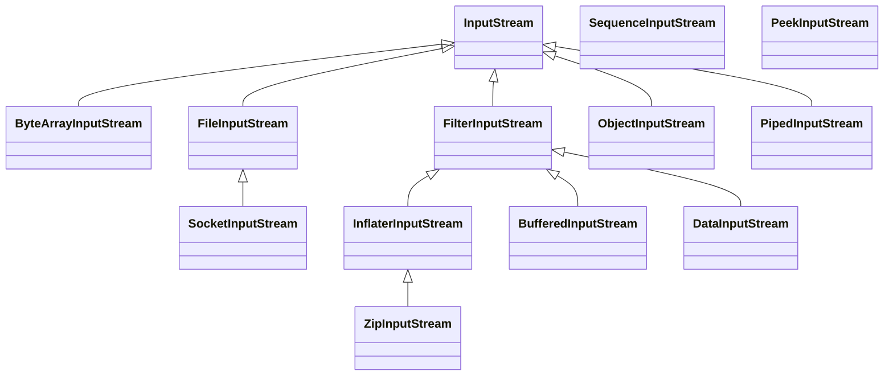
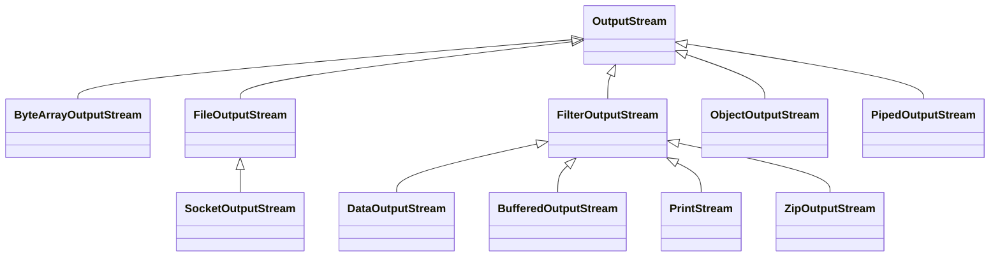
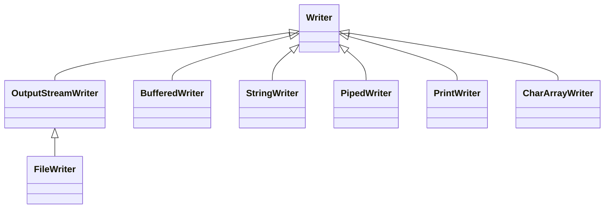
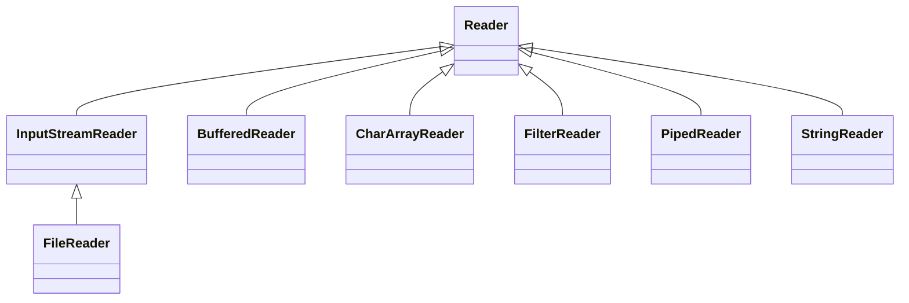
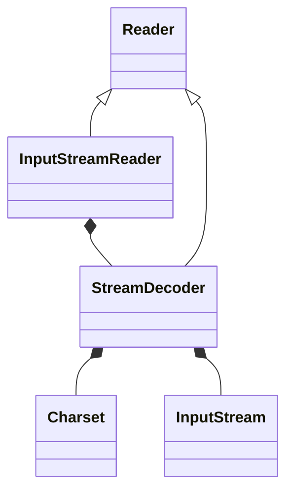
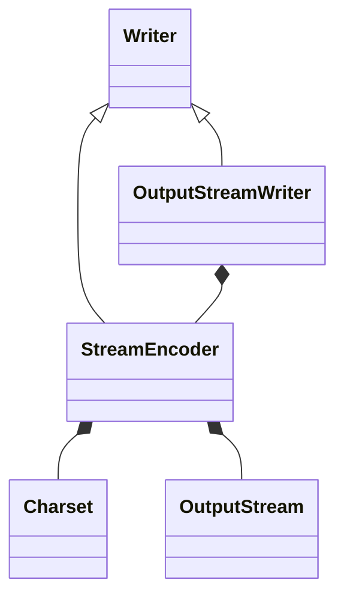

# Java BIO

BIO（blocking IO） 即阻塞 IO。指的主要是传统的 `java.io` 包，它基于流模型实现。

## BIO 简介

`java.io` 包提供了我们最熟知的一些 IO 功能，比如 File 抽象、输入输出流等。交互方式是同步、阻塞的方式，也就是说，在读取输入流或者写入输出流时，在读、写动作完成之前，线程会一直阻塞在那里，它们之间的调用是可靠的线性顺序。

很多时候，人们也把 java.net 下面提供的部分网络 API，比如 `Socket`、`ServerSocket`、`HttpURLConnection` 也归类到同步阻塞 IO 类库，因为网络通信同样是 IO 行为。

BIO 的优点是代码比较简单、直观；缺点则是 IO 效率和扩展性存在局限性，容易成为应用性能的瓶颈。

### BIO 的性能缺陷

**BIO 会阻塞进程，不适合高并发场景**。

采用 BIO 的服务端，通常由一个独立的 Acceptor 线程负责监听客户端连接。服务端一般在`while(true)` 循环中调用 `accept()` 方法等待客户端的连接请求，一旦接收到一个连接请求，就可以建立 Socket，并基于这个 Socket 进行读写操作。此时，不能再接收其他客户端连接请求，只能等待当前连接的操作执行完成。

如果要让 **BIO 通信模型** 能够同时处理多个客户端请求，就必须使用多线程（主要原因是`socket.accept()`、`socket.read()`、`socket.write()` 涉及的三个主要函数都是同步阻塞的），但会造成不必要的线程开销。不过可以通过 **线程池机制** 改善，线程池还可以让线程的创建和回收成本相对较低。

**即使可以用线程池略微优化，但是会消耗宝贵的线程资源，并且在百万级并发场景下也撑不住**。如果并发访问量增加会导致线程数急剧膨胀可能会导致线程堆栈溢出、创建新线程失败等问题，最终导致进程宕机或者僵死，不能对外提供服务。


## 俯视Java BIO

流从概念上来说是一个连续的数据流。当程序需要读数据的时候就需要使用输入流读取数据，当需要往外写数据的时候就需要输出流。

BIO 中操作的流主要有两大类，字节流和字符流两类，根据流的方向都可以分为输入流和输出流。

Java的IO操作类在java.io包下，大概有将近80个类，大概可分为4组：

- 基于字节操作的IO接口，InputStream 和 OutputStream
- 基于字符操作的IO接口，Writer 和 Reader
- 基于磁盘操作的IO接口，File
- 基于网络操作的IO接口，Socket

下面就分别对其进行介绍。


### 字节流

字节流主要操作字节数据或二进制对象。字节流有两个核心抽象类：`InputStream` 和 `OutputStream`。所有的字节流类都继承自这两个抽象类。类图如下：

InputStream的类层次结构：



OutputStream的类层次结构：



#### 文件字节流

`FileOutputStream` 和 `FileInputStream` 提供了读写字节到文件的能力。

```java
public class FileStreamDemo {
    public static void main(String[] args) {
        //read("e:\\java.txt");
        write("e:\\java1.txt");
    }
    private static void read(String path){
        InputStream is = null;
        try {
            is = new FileInputStream(path);
            byte[] buf = new byte[100];//每次读取100字节
            int length = -1;
            while((length = is.read(buf)) != -1){
                System.out.print(new String(buf,0,length));
            }
        } catch (FileNotFoundException | IOException e) {
            e.printStackTrace();
        } finally {
            if(is != null){
                try {
                    is.close();
                } catch (IOException e) {
                    e.printStackTrace();
                }
            }
        }
    }
    
    private static void write(String path){
        OutputStream os = null;
        try {
            //第一个参数是文件路径，第二个参数是否追加
            os = new FileOutputStream(path,true);
            String str = "hello world! wyz";
            os.write(str.getBytes());
            System.out.println("写出数据完成");
        } catch (FileNotFoundException | IOException e) {
            e.printStackTrace();
        } finally {
            if(os != null){
                try {
                    os.close();
                } catch (IOException e) {
                    e.printStackTrace();
                }
            }
        }
    }
}
```

#### 内存字节流

`ByteArrayInputStream` 和 `ByteArrayOutputStream` 是用来完成内存的输入和输出功能。内存操作流一般在生成一些临时信息时才使用。 如果临时信息保存在文件中，还需要在有效期过后删除文件，这样比较麻烦。

```java
//内存操作流一般在生成一些临时信息时才使用。 如果临时信息保存在文件中，还需要在有效期过后删除文件，这样比较麻烦。
public class ByteArrayStreamDemo {
    public static void main(String[] args) throws UnsupportedEncodingException {
        String str = "HELLO WORLD";
        ByteArrayInputStream bais = new ByteArrayInputStream(str.getBytes());
        ByteArrayOutputStream baos = new ByteArrayOutputStream();

        //从ByteArray内存中读取数据
        int temp = -1;
        while((temp = bais.read()) != -1){
            System.out.print((char)temp);//读取字符，并将其变成小写
            baos.write(Character.toLowerCase((char)temp));
        }
        System.out.println();
        String str1 = baos.toString();
        System.out.println(str1);
        try{
            bais.close();
            bais.close();
        }catch(IOException e){
           e.printStackTrace();
        }
        System.out.println("程序结束");
    }
}
```


```java
public class ByteArrayStreamDemo2 {
    public static void main(String[] args) throws IOException {
        String str = "无涯子";
        //UTF-8编码，每个字符占三个字节
        ByteArrayInputStream bais = new ByteArrayInputStream(str.getBytes("UTF-8"));
        int len = bais.available();//获取长度 9
        System.out.println(len);
        byte[] testread = new byte[6];
        bais.read(testread);//读取6个字符
        System.out.println(new String(testread));

    }
}
```


```java
public class ByteArrayStreamDemo3 {
    public static void main(String[] args) throws UnsupportedEncodingException {
        ByteArrayOutputStream baos = new ByteArrayOutputStream();
        String str = "hello";
        ByteArrayInputStream bais = new ByteArrayInputStream(str.getBytes("UTF-16"));
        int len = -1;
        while((len = bais.read()) != -1){
            baos.write(len);
        }
        System.out.println(baos.toString("UTF-16"));
    }
}
```


```java
//ByteArrayStream测试
public class ByteArrayStreamDemo4 {
    public static void main(String[] args) {
        String str = "hello world";
        ByteArrayInputStream bais = new ByteArrayInputStream(str.getBytes());
        ByteArrayOutputStream baos = new ByteArrayOutputStream();
        int temp;
        while((temp = bais.read()) != -1){
            //每次读取一个字节，当读取到完后会返回-1
            System.out.print((char)temp);
            baos.write(temp);
        }
        System.out.println();
        String string = baos.toString();
        System.out.println(string);
    }
}
```


#### 管道流

管道流的主要作用是可以进行两个线程间的通信。

如果要进行管道通信，则必须把 `PipedOutputStream` 连接在 `PipedInputStream` 上。为此，`PipedOutputStream` 中提供了 `connect()` 方法。

```java
//管道流，进行两个线程之间的通信
public class PipedStreamDemo1 {
    public static void main(String[] args) {
        //创建发送和接受线程
        Send send = new Send();
        Receive receive = new Receive();
        //线程两个管程流
        try {
            send.getPos().connect(receive.getPis());
        } catch (IOException e) {
            e.printStackTrace();
        }
        //启动线程
        new Thread(send).start();
        new Thread(receive).start();
    }
    //发送消息线程
    static class Send implements Runnable{
        private PipedOutputStream pos;
        public Send(){
            pos = new PipedOutputStream();
        }
        //得到线程管道输出流
        public PipedOutputStream getPos(){
            return pos;
        }

        @Override
        public void run() {
            String str = "hello wyz!";
            try {
                pos.write(str.getBytes());
            } catch (IOException e) {
                e.printStackTrace();
            }
            //关闭流
            if(pos != null){
                try {
                    pos.close();
                } catch (IOException e) {
                    e.printStackTrace();
                }
            }

        }
    }
    //接受消息线程
    static class Receive implements Runnable{
        private PipedInputStream pis;
        public Receive(){
            pis = new PipedInputStream();
        }
        //得到线程的管程流
        public PipedInputStream getPis(){
            return pis;
        }

        @Override
        public void run() {
            byte[] buf = new byte[1024];//读取数据的容器
            int length =-1;//记录读取的长度
            try {
                length = pis.read(buf);
            } catch (IOException e) {
                e.printStackTrace();
            }
            //关闭流
            if(pis != null){
                try {
                    pis.close();
                } catch (IOException e) {
                    e.printStackTrace();
                }
            }
            System.out.println("接受的内容为:" + new String(buf,0,length));

        }
    }
}
```


#### 数据操作流

数据操作流提供了格式化读入和输出数据的方法，分别为 `DataInputStream` 和 `DataOutputStream`。

`DataInputStream` 和 `DataOutputStream` 格式化读写数据示例

TODO 感觉这个例子不太好

```java
//数据操作流提供了格式化读入和输出数据的方法，分别为 DataInputStream 和 DataOutputStream。
public class DataStreamDemo {
    public static void main(String[] args) {
        //write("e:\\data.txt");
        read("e:\\data.txt");
    }
    private static void write(String path){
        DataOutputStream dos = null;
        try {
            dos = new DataOutputStream(new FileOutputStream(path));
            String[] str = {"手机","电脑","平板"};
            float[] price = {5234.56f,8989.3f,3456.12f};
            int[] nums = {1,2,3};
            for(int i = 0; i < str.length; i++){
                dos.writeChars(str[i]);
                dos.writeChar('\t');
                dos.writeFloat(price[i]);
                dos.writeChar('\t');
                dos.writeInt(nums[i]);
                dos.writeChar('\n');
            }
            //关闭流

            System.out.println("写出完成");
        } catch (IOException e) {
            e.printStackTrace();
        } finally {
            try {
                dos.close();
            } catch (IOException e) {
                e.printStackTrace();
            }
        }
    }
    private static void read(String path){
        DataInputStream dis = null;
        try {
            dis = new DataInputStream(new FileInputStream(path));
            // 3.进行读或写操作
            String name = null; // 接收名称
            float price = 0.0f; // 接收价格
            int num = 0; // 接收数量
            char[] temp = null; // 接收商品名称
            int len = 0; // 保存读取数据的个数
            char c = 0; // '\u0000'
            while (true) {
                temp = new char[200]; // 开辟空间
                len = 0;
                while ((c = dis.readChar()) != '\t') { // 接收内容
                    temp[len] = c;
                    len++; // 读取长度加1
                }
                name = new String(temp, 0, len); // 将字符数组变为String
                price = dis.readFloat(); // 读取价格
                dis.readChar(); // 读取\t
                num = dis.readInt(); // 读取int
                dis.readChar(); // 读取\n
                System.out.printf("名称：%s；价格：%5.2f；数量：%d\n", name, price, num);
            }
        }catch (EOFException e){
            System.out.println("结束");
        } catch (IOException e) {
            e.printStackTrace();
        } finally {
            try {
                dis.close();
            } catch (IOException e) {
                e.printStackTrace();
            }
        }
    }
}
```

#### 合并流

合并流的主要功能是将多个 `InputStream` 合并为一个 `InputStream` 流。合并流的功能由 `SequenceInputStream` 完成。

```java
//合并流SequenceInputStream ，将多个输入流合并
public class SequenceInputStreamDemo {
    public static void main(String[] args) throws IOException {
        FileInputStream fis = new FileInputStream("e:\\2.txt");
        FileInputStream fis1 = new FileInputStream("e:\\3.txt");
        SequenceInputStream sis = new SequenceInputStream(fis,fis1);
        int len = -1;
        FileOutputStream fos = new FileOutputStream("e:\\5.txt");
        while((len = sis.read()) != -1){
            fos.write(len);
        }
        sis.close();
        fis.close();
        fis1.close();
        fos.close();
    }
}
```


### 字符流

字符流主要操作字符，一个字符等于两个字节。

字符流有两个核心类：`Reader` 类和 `Writer` 。所有的字符流类都继承自这两个抽象类。

字符流的类图结构如下：

Writer类的层次结构：




Reader的类层次结构：



#### 文件字符流

文件字符流 `FileReader` 和 `FileWriter` 可以向文件读写文本数据。

```java
//文件字符流
public class FileReaderWriterDemo1 {
    public static void main(String[] args) {
        //write("e:\\6.txt");
        read("e:\\6.txt");
    }
    private static void write(String path){
        Writer writer = null;
        try {
            writer = new FileWriter(path);
            String str = "hello world";
            writer.write(str);
            writer.flush();//刷新缓冲区

        } catch (IOException e) {
            e.printStackTrace();
        } finally {
            if(writer != null){
                try {
                    writer.close();
                } catch (IOException e) {
                    e.printStackTrace();
                }
            }
        }
    }
    private static void read(String path){
        Reader reader = null;
        try {
          reader  = new FileReader(path);
          int len = -1;
          char[] buf = new char[100];
          while((len = reader.read(buf)) != -1){
              System.out.print(new String(buf,0,len));
          }
          System.out.println();
          System.out.println("读取完成");
        } catch (IOException e) {
            e.printStackTrace();
        } finally {
            if(reader != null){
                try {
                    reader.close();
                } catch (IOException e) {
                    e.printStackTrace();
                }
            }
        }
    }
}
```


### 转换流

转换流主要用于在字节和字符之间的转换

类图结构如下：

读的转化过程：



其中StreamDecoder是完成从字节到字符的解码过程


写的转化过程：



其中StreamEncoder完成了总字符到字节的编码过程


#### 字节流转换字符流

我们可以在程序中通过 `InputStream` 和 `Reader` 从数据源中读取数据，然后也可以在程序中将数据通过 `OutputStream` 和 `Writer` 输出到目标媒介中

使用 `InputStreamReader` 可以将输入字节流转化为输入字符流；使用`OutputStreamWriter`可以将输出字节流转化为输出字符流。

```java
//字节流转换成字符流
public class InputStreamReaderDemo1 {
    public static void main(String[] args) throws IOException {
        Reader reader = new InputStreamReader(new FileInputStream("e:\\6.txt"));
        char[] buf = new char[100];
        int len = -1;
        while((len = reader.read(buf)) != -1){
            System.out.print(new String(buf,0,len));
        }
        reader.close();
    }
    @Test
    public void test1(){
        Writer writer = null;
        try {
          writer = new OutputStreamWriter(new FileOutputStream("e:\\6.txt"));
          String str = "中国";
          writer.write(str);
          writer.flush();
        } catch (FileNotFoundException e) {
            e.printStackTrace();
        } catch (IOException e) {
            e.printStackTrace();
        } finally {
            try {
                writer.close();
            } catch (IOException e) {
                e.printStackTrace();
            }
        }
    }
}
```


## BIO中用到的设计模式