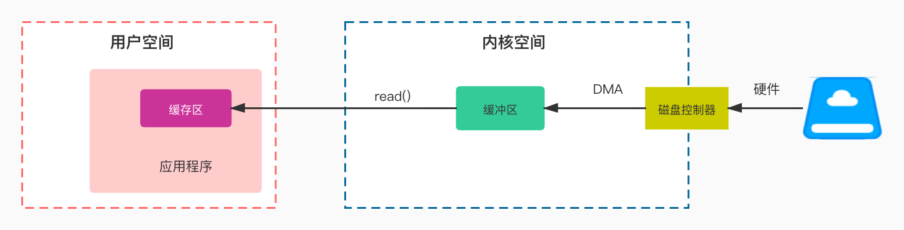
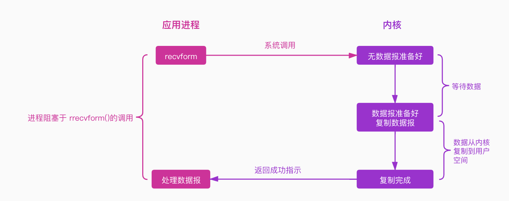
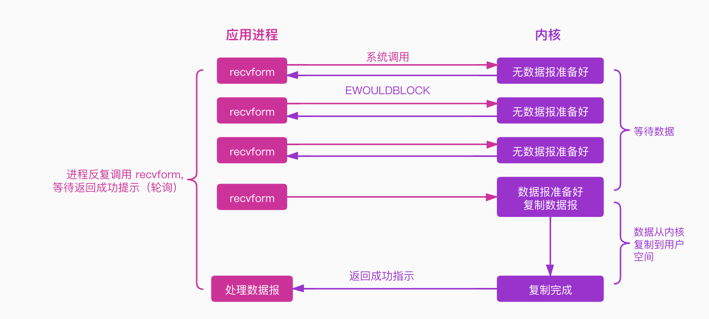
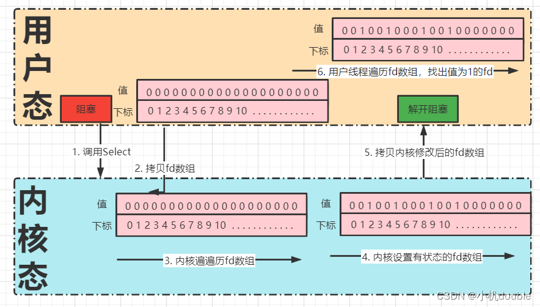
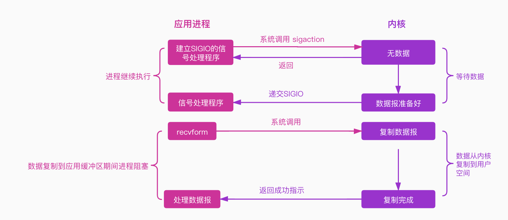
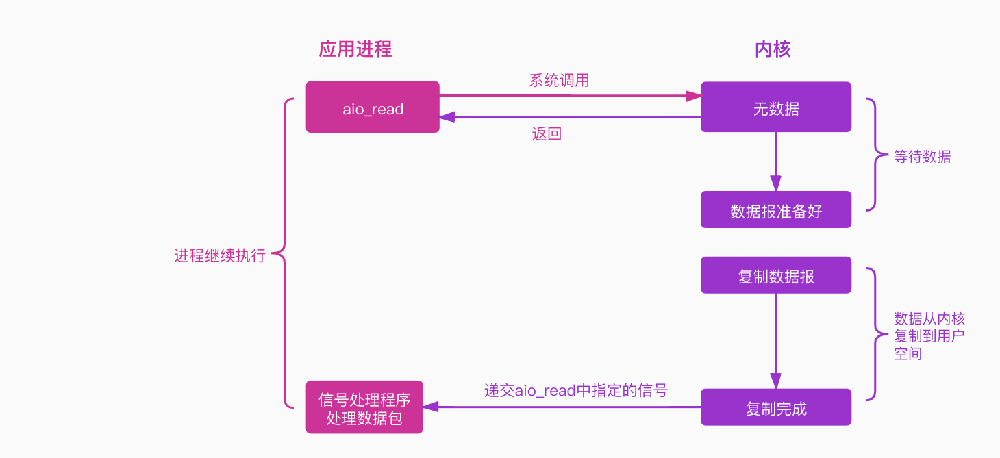

# Java IO 背景介绍

## 一、基本概念

### 1.1 什么是IO

什么是IO？维基百科上面是这样解释的：

> I/O（英语：Input/Output），即输入／输出，通常指数据在存储器（内部和外部）或其他周边设备之间的输入和输出，是信息处理系统（例如计算机）与外部世界（可能是人类或另一信息处理系统）之间的通信。输入是系统接收的信号或数据，输出则是从其发送的信号或数据。

这是IO一个完整的定义，不是特别好理解，要厘清IO这个概念，我们需要从如下两个视角来理解它。


#### 计算机视角理解IO

冯•诺伊曼计算机的基本思想中有提到计算机硬件组成应为五大部分：控制器，运算器，存储器，输入和输出。其中输入是指将数据输入到计算机的设备，输出是指从计算机中获取数据的设备。对于计算机而言，任何涉及到计算机核心（CPU和内存）与其他设备间的数据转移的过程就是IO。

IO 对于计算机而言，有两层意思：

- IO 设备。比如我们最常见的打印机、鼠标、键盘
- 对IO设备的数据读写

#### 程序视角理解IO

程序视角我们关注的则是应用程序本身。我们知道应用程序只有加载到内存中作为一个进程才能运行，它需要时刻与计算机进行数据交换，比如读写磁盘、远程调用、访问内存等等，但是操作系统为了能够正常平稳地运行下去，它是不会运行应用程序随意访问计算机硬件部分，如内存、硬盘、网卡，应用程序必须通过操作系统提供的API来访问，以达到安全的访问控制。所以应用程序如果要访问内核管理的IO，则必须通过有操作系统提供的API来间接访问。所以 IO对应应用程序而言，强调的则是 **通过向内核发起系统调用完成对I/O的间接访问**。


所以，换句话说应用程序发起一次IO访问是分为两个阶段的：

1. **IO 调用阶段**：应用程序向内核发起系统调用。
2. **IO执行阶段**：内核执行IO操作并返回。
   1. 数据准备阶段：内核等待IO设备准备好数据
   2. 数据拷贝阶段：将数据从内核缓冲区拷贝到用户空间缓冲区




### 1.2 同步与异步

什么是同步与异步呢？百度百科是这样定义的：

> 同步指两个或两个以上随时间变化的量在变化过程中保持一定的相对关系。异步与同步相对（这解释让我无言相对）

所以，我们需要明确的是**`同步与异步针对的是两个或者两个以上的事物`**。

对于同步而言，一个任务（调用者）的完成需要依赖另一个人任务（被调用者）的完成，只有等待被依赖的任务完成，依赖的任务才会继续进行，两者步调保持一致。

异步呢？任务与它依赖的任务没有必然的联系，它不需要等待它依赖的任务完成，它只需要向依赖任务发起调用即可，告诉它你可以干活了，至于你啥时候干完跟我没关系。

所以说，`同步和异步的本质区别就在于调用者与被调用者之间结果消息通知机制的不同`。

- 同步：调用者需要一直`主动等待`被调用者的结果。
- 异步：调用者调用被调用者后，调用者不会立刻得到结果，在调用者发起调用后，被调用者通过状态、通知或通过回调函数，让调用者知道结果

所以，同步和异步一个是主动等待结果，一个是被动知道结果。

举一个简单的例子：买奶茶，我们有两种方式拿到我们买的奶茶

- 选择排队等待。这种方式就是同步等待消息通知了，我们需要一直在吧台面前等着我们的奶茶
- 扫码。这种方式，你可以不停地看手机排号是否到你了（状态），也可以在那里玩手机等着服务员喊 88 号，奶茶好了（通知）。

上面提到异步调用可以通过状态、通知或者回调函数来告知调用者。

- 状态：调用者需要每隔一段向被调用者发起一个状态查询请求。这种方式效率较为低下。一般我们在调用支付接口的时候，如果服务方告知支付状态未知，则我们需要每隔一段时间去查询该笔订单的支付状态。虽然效率较为低下，但是靠谱。
- 通知：这种方式，调用者不需要做额外的工作，他只需要等被调用者把结果告诉调用者即可。但是这种方式也有点不是那么靠谱，它到底啥时候调用，如果不调用怎么办呢？这些都是我们需要考虑的问题。
- 回调函数：和通知机制差不多。

### 1.3 阻塞与非阻塞

上面解释了什么是同步与异步，那什么是阻塞与非阻塞呢？

> **所谓阻塞，就是有障碍而不能通行，无法畅通。**

所以，`阻塞就是调用结果返回之前，该线程会被一直挂起，一直等待结果，不能继续，函数只有在得到结果之后才会返回`。

可能有小伙伴会将阻塞与同步等同起来，因为他们都是因为等待执行结果而停滞不前，其实两者还是有区别的：

- 同步，针对的是两个进程，一个进程（调用者）因为等待另一个进程（被调用者）的执行结果而停滞不前。而阻塞则是针对一个，它是因为自己本身因等待当前线程中某个执行结果而停滞不前的。
- 对于同步来说，当前线程还是处于激活状态，只是从逻辑（感官）来说它是停滞不前的，当前线程可能还在处理其他事情。而阻塞则不同，当前线程是被挂起了，直接让出了 CPU。

非阻塞则与阻塞概念相对，`指在不能立即得到执行结果之前，该函数不会阻碍当前线程执行，而是会立即返回`。

还是上面那个买奶茶的例子，不论是排队在那里等奶茶还是扫码在哪里等奶茶，只要在等奶茶的过程中你没有做其他事情都是阻塞。如果你在等的过程跟你女朋友聊天（假如你有女朋友的话）或者在玩手机，那么就是非阻塞，因为没有因等待奶茶这件事一直耗着，而是一边等一边干其他的事情。


### 1.4 同步&异步、阻塞&非阻塞

同步&异步与阻塞&非阻塞两两组合，分别为`同步阻塞`,`同步非阻塞`，`异步阻塞`，`异步非阻塞`。以上面等奶茶的例子为例。

#### 同步阻塞

你在排队等奶茶的过程中，什么事情都不能做，只能干等着。就问你无聊不无聊，尴尬不尴尬。`效率最为低下`。

#### 同步非阻塞

你在排队等奶茶的过程中，可以干其他事情，比如刷抖音，玩一把王者荣耀，但是你需要不断地看奶茶是否已经到你，你势必会分心导致输掉王者荣耀，成为一个坑货。注意排队等奶茶，玩王者荣耀是两件事情，你需要两件事情来回不断地切换，`效率也不见得高到哪里去`。

#### 异步阻塞

你扫码拿号后，你不用在那里排队干等，你只需要等候服务员告诉你奶茶做好了去拿就可以了，但是在这个等的过程中，你啥事都不能干，只能干等着。很显然你已经被阻塞在这个等待服务员告诉你奶茶做好了的事情（`消息通知`）上面了。我们要注意是，并不是说异步就不能阻塞了，`异步也是可以阻塞的，只不过它不是在处理消息时阻塞，而是在等待消息通知时被阻塞了`。

#### 异步非阻塞

你扫码拿号后，直接去边上玩王者荣耀了，中途你专心玩的王者荣耀，不需要分心去关注你的奶茶是否做好了，你只需要在那里等服务员告诉你奶茶做好了（`消息通知`）去拿就可以了。`效率最高`。


### 1.5 用户空间&内核空间

操作系统是利用CPU 指令来计算和控制计算机系统的，有些指令很温和，我们操作它不会对操作系统产生什么危害，而有些指令则非常危险，如果使用不当则会导致系统崩溃，如果操作系统允许所有的应用程序能够直接访问这些很危险的指令，这会让计算机大大增加崩溃的概率。所以操作系统为了更加地保护自己，则将这些危险的指令保护起来，不允许应用程序直接访问。

现代操作系统都是采用虚拟存储器，操作系统为了保护危险指令被应用程序直接访问，则将虚拟空间划分为内核空间和用户空间。

- 内核空间则是操作系统的核心，它提供操作系统的最基本的功能，是操作系统工作的基础，它负责管理系统的进程、内存、设备驱动程序、文件和网络系统，决定着系统的性能和稳定性。
- 用户空间，非内核应用程序则运行在用户空间。用户空间中的代码运行在较低的特权级别上，只能看到允许它们使用的部分系统资源，并且不能使用某些特定的系统功能，也不能直接访问内核空间和硬件设备，以及其他一些具体的使用限制。

进行空间划分后，用户空间通过操作系统提供的API间接访问操作系统的内核，提高了操作系统的稳定性和可用性。

### 1.6 用户态和内核态进程切换

- 内核态: CPU可以访问内存所有数据, 包括外围设备, 例如硬盘,、网卡，CPU也可以将自己从一个程序切换到另一个程序。
- 用户态: 只能受限的访问内存, 且不允许访问外围设备。占用CPU的能力被剥夺, CPU资源可以被其他程序获取。

我们知道CPU为了保护操作系统，将空间划分为内核空间和用户空间，进程既可以在内核空间运行，也可以在用户空间运行。当进程运行在内核空间时，它就处在内核态，当进程运行在用户空间时，他就是用户态。开始所有应用程序都是运行在用户空间的，这个时候它是用户态，但是它想做一些只有内核空间才能做的事情，如读取IO，这个时候进程需要通过系统调用来访问内核空间，进程则需要从用户态转变为内核态。

用户态和内核态之间的切换开销有点儿大，那它开销在哪里呢？有如下几点：

- 保留用户态现场（上下文、寄存器、用户栈等）
- 复制用户态参数，用户栈切到内核栈，进入内核态
- 额外的检查（因为内核代码对用户不信任）
- 执行内核态代码
- 复制内核态代码执行结果，回到用户态
- 恢复用户态现场（上下文、寄存器、用户栈等）

所以，频繁的IO操作会频繁的造成用户态 —> 内核态 —> 用户态的切换，这严重会影响系统性能。后面小编会介绍IO的一些优化，重点就是减少切换。


## 二、Linux 的网络IO模型

### 2.1 网络 IO 的各个发展阶段

在Linux的 I/O 模型中，大致有以下两个维度：

- 区分同步或异步（synchronous/asynchronous）。简单来说，同步是一种可靠的有序运行机制，当我们进行同步操作时，后续的任务是等待当前调用返回，才会进行下一步；而异步则相反，其他任务不需要等待当前调用返回，通常依靠事件、回调等机制来实现任务间次序关系。
- 区分阻塞与非阻塞（blocking/non-blocking）。在进行阻塞操作时，当前线程会处于阻塞状态，无法从事其他任务，只有当条件就绪才能继续，比如 ServerSocket 新连接建立完毕，或数据读取、写入操作完成；而非阻塞则是不管 IO 操作是否结束，直接返回，相应操作在后台继续处理。

网络 IO 的发展过程是随着 linux 的内核演变而变化，因此网络 IO 大致可以分为如下几个阶段：

- 阻塞 IO(BIO)
- 非阻塞 IO(NIO)
- IO 多路复用第一版(select/poll)
- IO 多路复用第二版(epoll)
- 异步 IO(AIO)

而每一个阶段，都是因为当前的网络有一些缺陷，因此又在不断改进该缺陷。这是**网络 IO 一直演变过程中的本质**。下面将对上述几个阶段进行介绍，并对每个阶段的网络 IO 解决了哪些问题、优点、缺点进行剖析。

### 2.2 网络的两个阶段

在网络中，当用户线程发起 I/O 操作后，网络数据读取操作会经历两个步骤：

- 第一阶段：硬件接口到内核态（用户线程等待内核将数据从网卡拷贝到内核空间。）
- 第二阶段：内核态到用户态（内核将数据从内核空间拷贝到用户空间。）

我们通常上网，大部分数据都是通过网线传递的。因此对于两台计算机而言，要进行网络通信，其数据都是先从应用程序传递到传输层(TCP/UDP)到达内核态，然后再到网络层、数据链路层、物理层，接着数据传递到硬件网卡，最后通过网络传输介质传递到对端机器的网卡，然后再一步一步数据从网卡传递到内核态，最后再拷贝到用户态。

###  2.3 阻塞 IO 和非阻塞 IO 的区别

根据 2.2 节的内容，我们可以知道，网络中的数据传输从网络传输介质到达目的机器，需要如上两个阶段。此处我们把从硬件到内核态这一阶段，是否发生阻塞等待，可以将网络分为阻塞 IO和非阻塞 IO。如果用户发起了读写请求，但内核态数据还未准备就绪，该阶段不会阻塞用户操作，内核立马返回，则称为非阻塞 IO。如果该阶段一直阻塞用户操作。直到内核态数据准备就绪，才返回。这种方式称为阻塞 IO。

因此，区分阻塞 IO 和非阻塞 IO 主要看第一阶段是否阻塞用户操作。

### 2.4 同步 IO 和异步 IO 的区别

从前面我们知道了，数据的传递需要两个阶段，在此处只要任何一个阶段会阻塞用户请求，都将其称为同步 IO，两个阶段都不阻塞，则称为异步 IO。

在目前所有的操作系统中，linux 中的 epoll、mac 的 kqueue 都属于同步 IO，因为其在第二阶段(数据从内核态到用户态)都会发生拷贝阻塞。而只有 windows 中的 IOCP 才真正属于异步 IO，即 AIO。

### 2.5 阻塞IO模型

阻塞IO模型是最常见最简单的IO模型，图如下：



阻塞 IO，顾名思义当用户发生了系统调用后，如果数据未从网卡到达内核态，内核态数据未准备好，此时会一直阻塞。直到数据就绪，然后从内核态拷贝到用户态再返回。

- 优点
  - 模型简单，实现难度低
  - 适用于并发量较小的应用开发
- 缺点
  
  在一般使用阻塞 IO 时，都需要配置多线程来使用，最常见的模型是**阻塞 IO+多线程**，每个连接一个单独的线程进行处理。
  
  **我们知道，一般一个程序可以开辟的线程是有限的，而且开辟线程的开销也是比较大的。也正是这种方式，会导致一个应用程序可以处理的客户端请求受限。面对百万连接的情况，是无法处理。**

既然发现了问题，分析了问题，那就得解决问题。既然阻塞 IO 有问题，本质是由于其阻塞导致的，因此自然而然引出了下面即将介绍的主角：**非阻塞 IO**

### 2.6 非阻塞 IO模型

非阻塞IO模型图例如下：



非阻塞 IO：见名知意，就是在第一阶段(网卡-内核态)数据未到达时不等待，然后直接返回。**因此非阻塞 IO 需要不断的用户发起请求，询问内核数据好了没，好了没。**


- 优点
  - 模型简单，实现难度低
  - 与阻塞IO模型对比，它在等待数据报的过程中，进程并没有阻塞，它可以做其他的事情
- 缺点
  - **频繁的系统调用**是比较消耗系统资源的。
  - 与阻塞IO模型一样，它也不适用于并发量大的应用程序

因此，既然存在这样的问题，那么自然而然我们就需要解决该问题：**保留非阻塞 IO 的优点的前提下，减少系统调用**

### 2.7 I/O 多路复用模型

为了解决非阻塞 IO 存在的频繁的系统调用这个问题，随着内核的发展，出现了 IO 多路复用模型。那么我们就需要搞懂几个问题：

1. IO 多路复用到底复用什么？
2. IO 多路复用如何复用？

**IO 多路复用：**多路复用主要复用的是通过有限次的系统调用来实现管理多个网络连接。最简单来说，我目前有 10 个连接，我可以通过一次系统调用将这 10 个连接都丢给内核，让内核告诉我，哪些连接上面数据准备好了，然后我再去读取每个就绪的连接上的数据。因此，IO 多路复用，复用的是系统调用。通过有限次系统调用判断海量连接是否数据准备好了

**IO多路复用解决了非阻塞IO模型下存在的大量系统调用而导致上下文切换开销的问题。**

无论下面的 select、poll、epoll，其都是这种思想实现的，不过在实现上，select/poll 可以看做是第一版，而 epoll 是第二版

IO复用模型图例如下：


用户线程的读取操作分成两步了，线程先发起 select 调用，目的是问内核数据准备好了吗？等内核把数据准备好了，用户线程再发起 read 调用。在等待数据从内核空间拷贝到用户空间这段时间里，线程还是阻塞的。

这一版的IO多路复用器主要有两种实现，即Select和poll:

**Select:**

Select多路复用器的工作方式如下：



1. 调用 select 方法，用户代码的执行流程会阻塞在 select 系统调用上，用户线程从用户态切换到内核态。
2. 用户线程将需要监听的 Socket 对应的文件描述符fd数组通过 select 系统调用传递给内核，这个fd数组的索引表示进程内对应的文件描述符，值表示文件描述符的状态。
3. 用户线程在内核空间开始轮询文件描述符数组。
4. 修改有读写状态的文件描述符，设置为1。
5. 内核将修改后的fd数组拷贝会用户空间，此时用户代码的执行流程从 select 中恢复，阻塞解除。
6. 用户线程在用户空间遍历fd数组，找出值为1的fd进行对应的处理。

这里的fd数组其实是一个Bitmap结构，该结构最多支持1024个位（由内核参数的 FD_SETSIZE 控制），因此 select 只支持最多处理 1024 个 Socket 连接。每一位对应的索引就是一个文件描述符fd。

在 Linux 中 Socket 也是一个文件，在 PCB 控制块（task_struct 结构体）中有一个属性files_struct *file s的结构体属性，它最终指向了一个保存进程中所有打开文件的打开文件表数组，该数组的元素是一个封装了文件信息的 file 结构体，打开文件表数组中的下标也就是常说的文件描述符fd。

注意：由于内核返回的文件描述符数组会修改到原来的状态，因此用户线程在每个处理完之后需要重新设置文件描述符的状态。

性能开销：

- 一次系统调用，两次上下文的切换，这是不可避免的。
- 两次 fd 数组的全量拷贝（但是其实最多只能有 128 个字节大小的bitmap）。
- 两次 fd 数组的全量遍历，一次在内核中遍历是否有事件，用于设置状态，另外一次在用户空间中遍历哪些有事件，用于处理状态。

注意：select系统调用不是线程安全的，因为进程fd数组是共享的。

**Poll:**

poll 的工作原理和 select 没有太大的区别，主要是在文件描述符数组的结构和文件描述符大小的限制上。其将 Bitmap 换成一个没有固定长度的链表，链表中的元素如下：

```
struct pollfd {
    int fd;        // 文件描述符
    short events;    // 需要监听的事件
    short revents;    // 实际发生的事件，由内核修改
}
```

性能开销方面和 select 是一样的。

**Select 和 Poll 两者的问题：**

1. 每次新增、删除要监听的 Socket 时，查看 Socket 连接的事件时，都需要进行全量的拷贝。
2. 遍历的开销会随着文件描述符数量的增大而增大。
3. 性能瓶颈产生的原因：
   内核空间不会保存要监听的 Socket 集合，所以需要全量拷贝。
   内核不会通知具体IO就绪的 Socket，所以需要全量遍历并对IO就绪的 Socket 打上标记。

**缺点：**虽然第一版 IO 多路复用解决了之前提到的频繁的系统调用次数，但同时引入了新的问题：**用户需要每次将海量的 socket fds 集合从用户态传递到内核态，让内核态去检测哪些网络连接数据就绪了。但这个地方会出现频繁的将海量 fd 集合从用户态传递到内核态，再从内核态拷贝到用户态。所以，这个地方开销也挺大。**

既然还有这个问题，那我们继续开始解决这个问题，因此就引出了第二版的 IO 多路复用。

**其实思路也挺简单，既然需要拷贝，那就想办法，不拷贝。既然不拷贝，那就在内核开辟一段区域咯**


### 2.8 信号驱动的I/O多路复用

该版本IO多路复用模型的出现，就是为了解决上一版本中存在的性能瓶颈问题。该版本使用的多路复用器是Epoll。

Epoll 提供了解决 select 和 poll 性能瓶颈的方案，Epoll 会在内核中保存要监听的 Socket 集合和在适当的时候通知具体就绪的IO事件。

Epoll 这个多路复用器主要包括三个系统调用：

- **epoll_create**

内核提供的一个创建 epoll 对象的系统调用，在用户进程调用 epoll_create 时，内核会创建一个eventpoll 的结构体，并且创建相对应的 file 对象与之相关联（也就是说 epoll 对象也是个文件，“一切皆文件”），同时将这个文件放入进程的打开文件表中。eventpoll 的定义如下：

```c++
struct eventpoll {
    // 等待队列，阻塞在epoll上的线程会放在这里
    wait_queue_head_t wq;
    // 就绪队列，IO就绪的Socket连接会放在这里
    struct list_head rdllist;
    // 红黑树，用来监听所有的socket连接
    struct rb_root rbr;
    // 关联的文件对象
    struct file *file;
}
```

1. wait_queue_head_t wq：epoll 中的等待队列，存放阻塞在 epoll 上的用户线程，在IO就绪的时候epoll 通过这个队列，将阻塞中的线程唤醒。
2. list_head rdllist：存放IO就绪的 Socket 连接，阻塞在 epoll 上的线程被唤醒时，可以直接读取这个队列获取有事件发生的Socket，不用再次遍历整个集合（避免全量遍历）。
3. rb_root rbr：epoll内部使用一颗红黑树来管理大量的Socket连接，红黑树在查找、插入、删除等方面的综合性能比较优。
   select 用数组来管理，poll 用链表来管理。

- **epoll_ctl**

当创建出来 epoll 的对象 eventpoll 后，可以利用 epoll_ctl 向 eventpoll 对象中添加要管理的 Socket连接。这个过程如下：

1. 首先会在内核中创建一个表示 Socket 连接的数据结构 epitem，这个 epitem 就是红黑树的一个节点。

   ```c++
   strict epitem {
       // 指向所属的epoll对象
       struct eventpoll *ep;
       // 注册感兴趣的事件，也就是用户空间的epoll_event
       struct epoll_event event;
       // 指向epoll中的就绪队列
       struct list_head rdllink;
       // 指向epoll中的红黑树节点
       struct rb_node rbn;
       // 指向epitem所表示的Socket文件
       struct epoll_filefd ffd;
   }
   ```

2. 内核在创建完 epitem 结构后，需要在 Socket 中的等待队列上创建等待项 wait_queue_t，并且注册 epoll 的回调函数 ep_poll_callback。这个回调函数是 epoll 同步IO事件通知机制的核心所在，也是区别于 select、poll 采用轮询方式性能差异所在。ep_poll_callback 会找到 epitem，将IO就绪的 epitem 放入到 epoll 的就绪队列（eventpoll->rdllit）中。（通过一个 epoll_entry 的结构关联 Socket 等待队列上的 wait_queue_t 和 epitem）

3. 在 Socket 等待队列创建好等待项，注册回调函数并关联好 epitem 后，就可以将 epitem 插入红黑树中了。
   epoll 红黑树优化点之一：插入删除 Socket 连接不需要像 select、poll 那样全量复制。
   epoll_wait
   epoll_wait 用于同步阻塞线程，获取IO就绪的 Socket。

4. 用户程序调用 epoll_wait 后，进入内核首先会找到 epoll 中的就绪队列 eventpoll->rdllit 是否有就绪的 epitem。如果有的话将 epitm 中封装的 socket 信息封装到 epoll_event 返回。

5. 如果就绪队列中没有IO就绪的 epitem，则会创建 Socket 等待队列上的等待项，将用户线程的fd关联到 wait_queue_t->private 上，并注册回调函数 default_wake_function。最后将等待项添加到epoll 中的等待队列（eventpoll->wq）中。用户线程让出CPU，进入阻塞状态。
   当 epoll 中有事件发生时的工作流程：

6. 当数据包通过软中断经过内核协议栈到达 Socket 的接受缓冲区的时候，内核会调用数据就绪回调函数，在 Socket 的等待队列中找到等待项（wait_queue_t），该等待项注册的回调函数为ep_poll_callback。

7. 在回调函数 ep_poll_callback 中找到关联的 epitem 对象（通过 epoll_entity 结构体），并将它放到 epoll 的就绪队列（eventpoll->rdllist）中。

8. 接着查看 eventpoll 中的等待队列（eventpoll->wait_queue_head_t）中是否有等待项，如果有的话唤醒对应的线程，将 Socket 信息封装到 epoll_event 中返回。

9. 用户线程拿到 epoll_event 获取IO就绪的 socket，就可以针对该 socket 发起系统调用读取数据了。

总结epoll的优化点

- 内核中通过红黑树维护海量连接，在调用 epoll_wait 时不需要返回全部监听的 Socket 集合，内核只需要将就绪队列中的 Socket 集合返回即可。
- epoll 通过同步IO事件的机制将IO就绪的 Socket 放入就绪队列中。不用去遍历所有所有 Socket集合。
  

信号驱动IO模型。图例如下：



用户进程发起一个IO操作，会向内核注册一个信号处理程序，然后 **立即返回不阻塞**，当内核将数据报准备好后会发送一个信号给用户进程，这时候用户进程便可以在信号处理程序中调用IO处理数据报。它与IO复用模型的主要区别是等待数据阶段无阻塞。

信号驱动仍然是同步IO，因为在数据拷贝阶段仍然是需要用户线程自己拷贝的。

- 优点
  - 采用回调机制，等待数据阶段无阻塞
  - 适用于高并发应用程序
- 缺点
  - 模型较为复杂，实现起来有点儿困难


### 2.9 异步IO模型

信号驱动IO模型，进一步优化了IO操作流程，经过了三轮优化，它终于不用在数据等待阶段阻塞了，但是在数据复制节点依然是阻塞的，所以如果我们需要进一步优化的话，只需要把第二个阶段也进一步优化为异步，我们就大功告成了，也就变成了真正的异步IO了。




当进程发送一个IO操作，进程会立刻返回（不阻塞），但是也不能返回结果，内核会把整个IO数据报准备好后，再通知进程，进程再处理数据报。

- 优点
  - 整个过程都不阻塞，一步到位
  - 非常使用高并发应用
- 缺点
  - 需要操作系统的底层支持，LINUX 2.5 版本内核首现，2.6 版本产品的内核标准特性
  - 模型复杂，实现、开发难度较大


### 2.10 总结

五种IO模型，层层递进，一个比一个性能高，当然模型的复杂度也一个比一个复杂。最后用一张图来总结下


----


IO面试题 - 基础

> - NIO与IO的区别
> - NIO和IO适用场景
> - BIO,NIO,AIO有什么区别，分别是什么原理？
> - NIO如何通过Buffer来缓冲数据的
> - 什么是Reactor模型？什么是Proactor模型？
> - 什么是选择器？实际工作中怎么使用
> - Java的异步编程、异步网络编程如何实现的？
> - Reactor模型有几种？如何实现


IO面试题 - 高级/资深

> - Tomcat线程模型如何实现，为何不用Netty?
> - Tomcat的NIO和NIO2有何区别？怎么选择？
> - Tomcat的Accept Count、Max Connections、Max Threads是什么？
> - Netty线程模型如何实现？
> - 什么是EventLoop？什么是EventLoopGroup
> - Netty:线程模型在使用中有什么需要注意的？
> - Netty的Channel如何处理的？线程安全吗？
> - Netty:如何实现Java层面的零拷贝的？
> - Linux内核IO操作实现原理了解吗？
> - Linux内核如何实现零拷贝？


