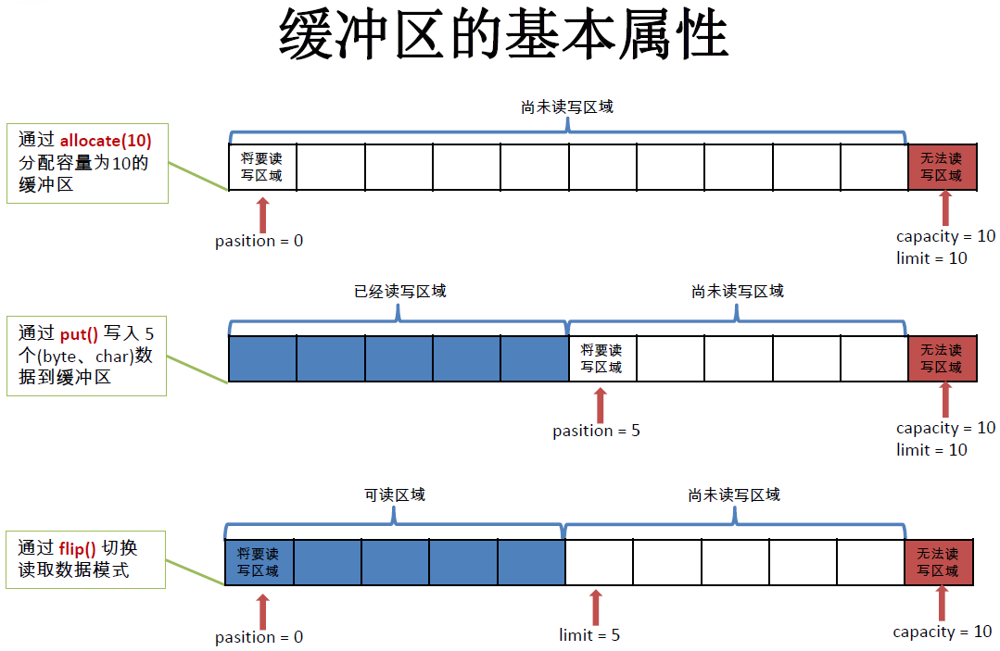
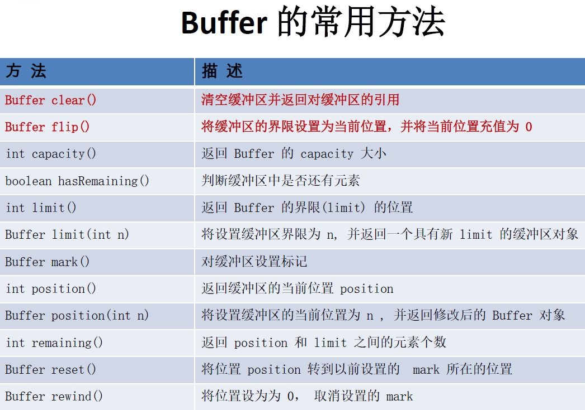
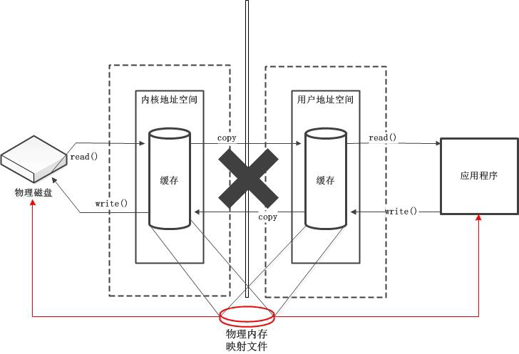

# NIO

#### Java NIO 简介

​	Java NIO（New IO）是从Java 1.4版本开始引入的一个新的IO API，可以替代标准的Java IO API。NIO与原来的IO有同样的作用和目的，但是使用的方式完全不同，NIO支持面向缓冲区的、基于通道的IO操作。NIO将以更加高效的方式进行文件的读写操作。

#### Java NIO 与IO的主要区别

##### 	**IO**

​		面向流(Stream Oriented)

​		阻塞IO(Blocking IO)

##### 	**NIO**

​		面向缓冲区(Buffer Oriented)

​		非阻塞IO(NonBlocking IO)

​		选择器(Selectors)


#### 缓冲区和通道

Java NIO系统的核心在于：通道(Channel)和缓冲区(Buffer)。通道表示打开到IO 设备(例如：文件、套接字)的连接。若需要使用NIO 系统，需要获取用于连接IO 设备的通道以及用于容纳数据的缓冲区。然后操作缓冲区，对数据进行处理。


**一句话概括：Channel 负责传输，Buffer 负责存储**


##### 缓冲区（Buffer）

缓冲区（Buffer）：一个用于特定基本数据类型的容器。由java.nio 包定义的，所有缓冲区都是Buffer 抽象类的子类。
Java NIO中的Buffer 主要用于与NIO 通道进行交互，数据是从通道读入缓冲区，从缓冲区写入通道中的。

Buffer 就像一个数组，可以保存多个相同类型的数据。根据数据类型不同(boolean 除外) ，有以下Buffer 常用子类：

- ByteBuffer
- CharBuffer
- ShortBuffer
- IntBuffer
- LongBuffer
- FloatBuffer
- DoubleBuffer

**缓冲区的基本属性**

- capatity

  表示Buffer 最大数据容量，缓冲区容量不能为负，并且创建后不能更改。

- limit

  第一个不应该读取或写入的数据的索引，即位于limit 后的数据不可读写。缓冲区的限制不能为负，并且不能大于其容量。

- position

  下一个要读取或写入的数据的索引。缓冲区的位置不能为负，并且不能大于其限制

- mark与reset

  标记是一个索引，通过Buffer 中的mark() 方法指定Buffer 中一个特定的position，之后可以通过调用reset() 方法恢复到这个position.


**标记、位置、限制、容量遵守以下不变式：0<=mark<=position<=limit<=capacity**


**缓冲区的基本属性：**




**Buffer的API介绍**




##### 代码示例：

```java
/**
 * 一、缓冲区（Buffer）：在 Java NIO 中负责数据的存取。缓冲区就是数组。用于存储不同数据类型的数据
 *
 * 根据数据类型不同（boolean 除外），提供了相应类型的缓冲区：
 * ByteBuffer
 * CharBuffer
 * ShortBuffer
 * IntBuffer
 * LongBuffer
 * FloatBuffer
 * DoubleBuffer
 *
 * 上述缓冲区的管理方式几乎一致，通过 allocate() 获取缓冲区
 *
 * 二、缓冲区存取数据的两个核心方法：
 * put() : 存入数据到缓冲区中
 * get() : 获取缓冲区中的数据
 *
 * 三、缓冲区中的四个核心属性：
 * capacity : 容量，表示缓冲区中最大存储数据的容量。一旦声明不能改变。
 * limit : 界限，表示缓冲区中可以操作数据的大小。（limit 后数据不能进行读写）
 * position : 位置，表示缓冲区中正在操作数据的位置。
 *
 * mark : 标记，表示记录当前 position 的位置。可以通过 reset() 恢复到 mark 的位置
 *
 * 0 <= mark <= position <= limit <= capacity
 *
 * 四、直接缓冲区与非直接缓冲区：
 * 非直接缓冲区：通过 allocate() 方法分配缓冲区，将缓冲区建立在 JVM 的内存中
 * 直接缓冲区：通过 allocateDirect() 方法分配直接缓冲区，将缓冲区建立在物理内存中。可以提高效率
 */
public class TestBuffer {
    /**
     * 测试直接缓冲区与非直接缓冲区
     */
    @Test
    public void test3(){
        //分配直接缓冲区
        ByteBuffer buf = ByteBuffer.allocateDirect(1024);
        System.out.println(buf.isDirect());
    }

    @Test
    public void test2(){
        String str = "abcde";

        ByteBuffer buf = ByteBuffer.allocate(1024);
        buf.put(str.getBytes());
        buf.flip();

        byte[] dst = new byte[buf.limit()];
        buf.get(dst, 0, 2);
        System.out.println(new String(dst, 0, 2));
        System.out.println(buf.position());

        //mark() : 标记
        buf.mark();
        buf.get(dst, 2, 2);
        System.out.println(new String(dst, 2, 2));
        System.out.println(buf.position());

        //reset() : 恢复到 mark 的位置
        buf.reset();
        System.out.println(buf.position());

        //判断缓冲区中是否还有剩余数据
        if(buf.hasRemaining()){
            //获取缓冲区中可以操作的数量
            System.out.println(buf.remaining());
        }
    }

    /**
     * allocate /ˈæləkeɪt/  分配
     * 不同类型的Buffer都使用allocate方法来创建对象
     * 这个方法主要用来掩饰Buffer中属性的作用
     */
    @Test
    public void test1(){
        String str = "abcde";

        //1. 分配一个指定大小的缓冲区
        ByteBuffer buf = ByteBuffer.allocate(1024);
        System.out.println("-----------------allocate()----------------");
        System.out.println(buf.position());
        System.out.println(buf.limit());
        System.out.println(buf.capacity());

        //2. 利用 put() 存入数据到缓冲区中
        buf.put(str.getBytes());
        System.out.println("-----------------put()----------------");
        System.out.println(buf.position());
        System.out.println(buf.limit());
        System.out.println(buf.capacity());

        //3. 切换读取数据模式
        buf.flip();
        System.out.println("-----------------flip()----------------");
        System.out.println(buf.position());
        System.out.println(buf.limit());
        System.out.println(buf.capacity());

        //4. 利用 get() 读取缓冲区中的数据
        byte[] dst = new byte[buf.limit()];
        buf.get(dst);
        System.out.println(new String(dst, 0, dst.length));
        System.out.println("-----------------get()----------------");
        System.out.println(buf.position());
        System.out.println(buf.limit());
        System.out.println(buf.capacity());

        //5. rewind() : 可重复读
        buf.rewind();
        System.out.println("-----------------rewind()----------------");
        System.out.println(buf.position());
        System.out.println(buf.limit());
        System.out.println(buf.capacity());

        //6. clear() : 清空缓冲区. 但是缓冲区中的数据依然存在，但是处于“被遗忘”状态
        buf.clear();
        System.out.println("-----------------clear()----------------");
        System.out.println(buf.position());
        System.out.println(buf.limit());
        System.out.println(buf.capacity());
        System.out.println((char)buf.get());
    }
}
```


##### 直接缓冲区与非直接缓冲区


- 字节缓冲区要么是直接的，要么是非直接的。如果为直接字节缓冲区，则Java 虚拟机会尽最大努力直接在此缓冲区上执行本机I/O 操作。也就是说，在每次调用基础操作系统的一个本机I/O 操作之前（或之后），虚拟机都会尽量避免将缓冲区的内容复制到中间缓冲区中（或从中间缓冲区中复制内容）。
- 直接字节缓冲区可以通过调用此类的allocateDirect() 工厂方法来创建。此方法返回的缓冲区进行分配和取消分配所需成本通常高于非直接缓冲区。直接缓冲区的内容可以驻留在常规的垃圾回收堆之外，因此，它们对应用程序的内存需求量造成的影响可能并不明显。所以，建议将直接缓冲区主要分配给那些易受基础系统的本机I/O 操作影响的大型、持久的缓冲区。一般情况下，最好仅在直接缓冲区能在程序性能方面带来明显好处时分配它们。
- 直接字节缓冲区还可以通过FileChannel 的map() 方法将文件区域直接映射到内存中来创建。该方法返回MappedByteBuffer。Java 平台的实现有助于通过JNI 从本机代码创建直接字节缓冲区。如果以上这些缓冲区中的某个缓冲区实例指的是不可访问的内存区域，则试图访问该区域不会更改该缓冲区的内容，并且将会在访问期间或稍后的某个时间导致抛出不确定的异常。
- 字节缓冲区是直接缓冲区还是非直接缓冲区可通过调用其isDirect()方法来确定。提供此方法是为了能够在性能关键型代码中执行显式缓冲区管理。

###### 图例

**非直接缓冲区**


直接缓冲区：

​	数据从磁盘到应用程序需要经过内核空间到用户空间的拷贝过程


**非直接缓冲区：**




非直接缓冲区：

	1. 直接在物理内存中创建磁盘额映射文件
	2. 在数据写到物理内存之后，应用程序就无权过问了，余下的过程交由操作系统来处理
	3. 在写完数据之后，应用程序无法自动释放资源，需要等待垃圾回收机制来进行资源回收
	4. 在极端情况下（垃圾回收器一直不进行回收），存在占用资源问题。


##### 通道（Channel）

通道（Channel）：由java.nio.channels 包定义的。Channel 表示IO 源与目标打开的连接。Channel 类似于传统的“流”。只不过Channel 本身不能直接访问数据，Channel 只能与Buffer 进行交互。


**代码示例：**

```java
/**
 * 一、通道（Channel）：用于源节点与目标节点的连接。在 Java NIO 中负责缓冲区中数据的传输。Channel 本身不存储数据，因此需要配合缓冲区进行传输。
 *
 * 二、通道的主要实现类
 * 	java.nio.channels.Channel 接口：
 * 		|--FileChannel
 * 		|--SocketChannel
 * 		|--ServerSocketChannel
 * 		|--DatagramChannel
 *
 * 三、获取通道
 * 1. Java 针对支持通道的类提供了 getChannel() 方法
 * 		本地 IO：
 * 		FileInputStream/FileOutputStream
 * 		RandomAccessFile
 *
 * 		网络IO：
 * 		Socket
 * 		ServerSocket
 * 		DatagramSocket
 *
 * 2. 在 JDK 1.7 中的 NIO.2 针对各个通道提供了静态方法 open()
 * 3. 在 JDK 1.7 中的 NIO.2 的 Files 工具类的 newByteChannel()
 *
 * 四、通道之间的数据传输
 * transferFrom()
 * transferTo()
 *
 * 五、分散(Scatter)与聚集(Gather)
 * 分散读取（Scattering Reads）：将通道中的数据分散到多个缓冲区中
 * 聚集写入（Gathering Writes）：将多个缓冲区中的数据聚集到通道中
 *
 * 六、字符集：Charset
 * 编码：字符串 -> 字节数组
 * 解码：字节数组  -> 字符串
 *
 */
public class TestChannel {
    /**
     * ===============================================================================
     *  字符集
     */
    @Test
    public void test6() throws IOException {
        Charset cs1 = Charset.forName("GBK");

        //获取编码器
        CharsetEncoder ce = cs1.newEncoder();

        //获取解码器
        CharsetDecoder cd = cs1.newDecoder();

        CharBuffer cBuf = CharBuffer.allocate(1024);
        cBuf.put("尚硅谷威武！");
        cBuf.flip();

        //编码
        ByteBuffer bBuf = ce.encode(cBuf);

        for (int i = 0; i < 12; i++) {
            System.out.println(bBuf.get());
        }

        //解码
        bBuf.flip();
        CharBuffer cBuf2 = cd.decode(bBuf);
        System.out.println(cBuf2.toString());

        System.out.println("------------------------------------------------------");

        Charset cs2 = Charset.forName("GBK");
        bBuf.flip();
        CharBuffer cBuf3 = cs2.decode(bBuf);
        System.out.println(cBuf3.toString());
    }

    /**
     * ===============================================================================
     */
    @Test
    public void test5(){
        Map<String, Charset> map = Charset.availableCharsets();

        Set<Map.Entry<String, Charset>> set = map.entrySet();

        for (Map.Entry<String, Charset> entry : set) {
            System.out.println(entry.getKey() + "=" + entry.getValue());
        }
    }

    /**
     * ===============================================================================
     *  分散和聚集
     */
    @Test
    public void test4() throws IOException{
        RandomAccessFile raf1 = new RandomAccessFile("1.txt", "rw");

        //1. 获取通道
        FileChannel channel1 = raf1.getChannel();

        //2. 分配指定大小的缓冲区
        ByteBuffer buf1 = ByteBuffer.allocate(100);
        ByteBuffer buf2 = ByteBuffer.allocate(1024);

        //3. 分散读取
        ByteBuffer[] bufs = {buf1, buf2};
        channel1.read(bufs);

        for (ByteBuffer byteBuffer : bufs) {
            byteBuffer.flip();
        }

        System.out.println(new String(bufs[0].array(), 0, bufs[0].limit()));
        System.out.println("-----------------");
        System.out.println(new String(bufs[1].array(), 0, bufs[1].limit()));

        //4. 聚集写入
        RandomAccessFile raf2 = new RandomAccessFile("2.txt", "rw");
        FileChannel channel2 = raf2.getChannel();

        channel2.write(bufs);
    }

    /**
     * ===============================================================================
     * 通道之间的数据传输(直接缓冲区)
     */
    @Test
    public void test3() throws IOException{
        FileChannel inChannel = FileChannel.open(Paths.get("d:/1.mkv"), StandardOpenOption.READ);
        FileChannel outChannel = FileChannel.open(Paths.get("d:/2.mkv"), StandardOpenOption.WRITE, StandardOpenOption.READ, StandardOpenOption.CREATE);

		//inChannel.transferTo(0, inChannel.size(), outChannel);
        outChannel.transferFrom(inChannel, 0, inChannel.size());

        inChannel.close();
        outChannel.close();
    }

    /**
     * ===============================================================================
     * 使用直接缓冲区完成文件的复制(内存映射文件)
     */
    @Test
    public void test2() throws IOException{//2127-1902-1777
        long start = System.currentTimeMillis();

        FileChannel inChannel = FileChannel.open(Paths.get("d:/1.mkv"), StandardOpenOption.READ);
        FileChannel outChannel = FileChannel.open(Paths.get("d:/2.mkv"), StandardOpenOption.WRITE, StandardOpenOption.READ, StandardOpenOption.CREATE);

        //内存映射文件
        MappedByteBuffer inMappedBuf = inChannel.map(FileChannel.MapMode.READ_ONLY, 0, inChannel.size());
        MappedByteBuffer outMappedBuf = outChannel.map(FileChannel.MapMode.READ_WRITE, 0, inChannel.size());

        //直接对缓冲区进行数据的读写操作
        byte[] dst = new byte[inMappedBuf.limit()];
        inMappedBuf.get(dst);
        outMappedBuf.put(dst);

        inChannel.close();
        outChannel.close();

        long end = System.currentTimeMillis();
        System.out.println("耗费时间为：" + (end - start));
    }

    /**
     * ===============================================================================
     * 利用通道完成文件的复制（非直接缓冲区）
     */
    @Test
    public void test1(){//10874-10953
        long start = System.currentTimeMillis();

        FileInputStream fis = null;
        FileOutputStream fos = null;
        //①获取通道
        FileChannel inChannel = null;
        FileChannel outChannel = null;
        try {
            fis = new FileInputStream("d:/1.mkv");
            fos = new FileOutputStream("d:/2.mkv");

            inChannel = fis.getChannel();
            outChannel = fos.getChannel();

            //②分配指定大小的缓冲区
            ByteBuffer buf = ByteBuffer.allocate(1024);

            //③将通道中的数据存入缓冲区中
            while(inChannel.read(buf) != -1){
                buf.flip(); //切换读取数据的模式
                //④将缓冲区中的数据写入通道中
                outChannel.write(buf);
                buf.clear(); //清空缓冲区
            }
        } catch (IOException e) {
            e.printStackTrace();
        } finally {
            
        }

        long end = System.currentTimeMillis();
        System.out.println("耗费时间为：" + (end - start));
    }
}
```


#### 文件通道

##### 代码示例

​	代码示例在Channel中有体现

##### 常用API介绍


#### NIO的非阻塞式网络通信


##### 阻塞与非阻塞的区别

- 传统的IO 流都是阻塞式的。也就是说，当一个线程调用read() 或write() 时，该线程被阻塞，直到有一些数据被读取或写入，该线程在此期间不能执行其他任务。因此，在完成网络通信进行IO 操作时，由于线程会阻塞，所以服务器端必须为每个客户端都提供一个独立的线程进行处理，当服务器端需要处理大量客户端时，性能急剧下降。

- Java NIO 是非阻塞模式的。当线程从某通道进行读写数据时，若没有数据可用时，该线程可以进行其他任务。线程通常将非阻塞IO 的空闲时间用于在其他通道上执行IO 操作，所以单独的线程可以管理多个输入和输出通道。因此，NIO 可以让服务器端使用一个或有限几个线程来同时处理连接到服务器端的所有客户端。


##### 选择器（Selector）

选择器（Selector）是SelectableChannle 对象的多路复用器，Selector 可以同时监控多个SelectableChannel 的IO 状况，也就是说，利用Selector 可使一个单独的线程管理多个Channel。Selector 是非阻塞IO 的核心。


##### 阻塞式NIO代码示例1

```java
/**
 * 一、使用 NIO 完成网络通信的三个核心：
 *
 * 1. 通道（Channel）：负责连接
 *
 * 	   java.nio.channels.Channel 接口：
 * 			|--SelectableChannel
 * 				|--SocketChannel
 * 				|--ServerSocketChannel
 * 				|--DatagramChannel
 *
 * 				|--Pipe.SinkChannel
 * 				|--Pipe.SourceChannel
 *
 * 2. 缓冲区（Buffer）：负责数据的存取
 *
 * 3. 选择器（Selector）：是 SelectableChannel 的多路复用器。用于监控 SelectableChannel 的 IO 状况
 *
 */
public class TestBlockingNIO {

    //客户端
    @Test
    public void client() throws IOException {
        //1. 获取通道
        SocketChannel sChannel = SocketChannel.open(new InetSocketAddress("127.0.0.1", 9898));

        FileChannel inChannel = FileChannel.open(Paths.get("1.jpg"), StandardOpenOption.READ);

        //2. 分配指定大小的缓冲区
        ByteBuffer buf = ByteBuffer.allocate(1024);

        //3. 读取本地文件，并发送到服务端
        while(inChannel.read(buf) != -1){
            buf.flip();
            sChannel.write(buf);
            buf.clear();
        }

        //4. 关闭通道
        inChannel.close();
        sChannel.close();
    }

    //服务端
    @Test
    public void server() throws IOException{
        //1. 获取通道
        ServerSocketChannel ssChannel = ServerSocketChannel.open();

        FileChannel outChannel = FileChannel.open(Paths.get("2.jpg"), StandardOpenOption.WRITE, StandardOpenOption.CREATE);

        //2. 绑定连接
        ssChannel.bind(new InetSocketAddress(9898));

        //3. 获取客户端连接的通道
        SocketChannel sChannel = ssChannel.accept();

        //4. 分配指定大小的缓冲区
        ByteBuffer buf = ByteBuffer.allocate(1024);

        //5. 接收客户端的数据，并保存到本地
        while(sChannel.read(buf) != -1){
            buf.flip();
            outChannel.write(buf);
            buf.clear();
        }

        //6. 关闭通道
        sChannel.close();
        outChannel.close();
        ssChannel.close();

    }
}

```


##### 阻塞式NIO代码示例2

相对于示例1，增加了响应消息

```java
public class TestBlockingNIO2 {

    //客户端
    @Test
    public void client() throws IOException{
        SocketChannel sChannel = SocketChannel.open(new InetSocketAddress("127.0.0.1", 9898));

        FileChannel inChannel = FileChannel.open(Paths.get("1.jpg"), StandardOpenOption.READ);

        ByteBuffer buf = ByteBuffer.allocate(1024);

        while(inChannel.read(buf) != -1){
            buf.flip();
            sChannel.write(buf);
            buf.clear();
        }

        sChannel.shutdownOutput();

        //接收服务端的反馈
        int len = 0;
        while((len = sChannel.read(buf)) != -1){
            buf.flip();
            System.out.println(new String(buf.array(), 0, len));
            buf.clear();
        }

        inChannel.close();
        sChannel.close();
    }

    //服务端
    @Test
    public void server() throws IOException{
        ServerSocketChannel ssChannel = ServerSocketChannel.open();

        FileChannel outChannel = FileChannel.open(Paths.get("2.jpg"), StandardOpenOption.WRITE, StandardOpenOption.CREATE);

        ssChannel.bind(new InetSocketAddress(9898));

        SocketChannel sChannel = ssChannel.accept();

        ByteBuffer buf = ByteBuffer.allocate(1024);

        while(sChannel.read(buf) != -1){
            buf.flip();
            outChannel.write(buf);
            buf.clear();
        }

        //发送反馈给客户端
        buf.put("服务端接收数据成功".getBytes());
        buf.flip();
        sChannel.write(buf);

        sChannel.close();
        outChannel.close();
        ssChannel.close();
    }

}

```


##### 非阻塞式NIO(TCP协议)

```java
/**
 * 一、使用 NIO 完成网络通信的三个核心：
 *
 * 1. 通道（Channel）：负责连接
 *
 * 	   java.nio.channels.Channel 接口：
 * 			|--SelectableChannel
 * 				|--SocketChannel
 * 				|--ServerSocketChannel
 * 				|--DatagramChannel
 *
 * 				|--Pipe.SinkChannel
 * 				|--Pipe.SourceChannel
 *
 * 2. 缓冲区（Buffer）：负责数据的存取
 *
 * 3. 选择器（Selector）：是 SelectableChannel 的多路复用器。用于监控 SelectableChannel 的 IO 状况
 *
 */
public class TestNonBlockingNIO1 {
    //客户端
    @Test
    public void client() throws IOException{
        //1. 获取通道
        SocketChannel sChannel = SocketChannel.open(new InetSocketAddress("127.0.0.1", 9898));

        //2. 切换非阻塞模式
        sChannel.configureBlocking(false);

        //3. 分配指定大小的缓冲区
        ByteBuffer buf = ByteBuffer.allocate(1024);

        //4. 发送数据给服务端
        Scanner scan = new Scanner(System.in);

        while(scan.hasNext()){
            String str = scan.next();
            buf.put((new Date().toString() + "\n" + str).getBytes());
            buf.flip();
            sChannel.write(buf);
            buf.clear();
        }

        //5. 关闭通道
        sChannel.close();
    }

    //服务端
    @Test
    public void server() throws IOException{
        //1. 获取通道
        ServerSocketChannel ssChannel = ServerSocketChannel.open();

        //2. 切换非阻塞模式
        ssChannel.configureBlocking(false);

        //3. 绑定连接
        ssChannel.bind(new InetSocketAddress(9898));

        //4. 获取选择器
        Selector selector = Selector.open();

        //5. 将通道注册到选择器上, 并且指定“监听接收事件”
        ssChannel.register(selector, SelectionKey.OP_ACCEPT);

        //6. 轮询式的获取选择器上已经“准备就绪”的事件
        while(selector.select() > 0){

            //7. 获取当前选择器中所有注册的“选择键(已就绪的监听事件)”
            Iterator<SelectionKey> it = selector.selectedKeys().iterator();

            while(it.hasNext()){
                //8. 获取准备“就绪”的是事件
                SelectionKey sk = it.next();

                //9. 判断具体是什么事件准备就绪
                if(sk.isAcceptable()){
                    //10. 若“接收就绪”，获取客户端连接
                    SocketChannel sChannel = ssChannel.accept();

                    //11. 切换非阻塞模式
                    sChannel.configureBlocking(false);

                    //12. 将该通道注册到选择器上
                    sChannel.register(selector, SelectionKey.OP_READ);
                }else if(sk.isReadable()){
                    //13. 获取当前选择器上“读就绪”状态的通道
                    SocketChannel sChannel = (SocketChannel) sk.channel();

                    //14. 读取数据
                    ByteBuffer buf = ByteBuffer.allocate(1024);

                    int len = 0;
                    while((len = sChannel.read(buf)) > 0 ){
                        buf.flip();
                        System.out.println(new String(buf.array(), 0, len));
                        buf.clear();
                    }
                }

                //15. 取消选择键 SelectionKey
                it.remove();
            }
        }
    }
}
```


##### 非阻塞式NIO(UDP协议)


```java
/**
 * UDP
 */
public class TestNonBlockingNIO2 {

    @Test
    public void send() throws IOException{
        DatagramChannel dc = DatagramChannel.open();

        dc.configureBlocking(false);

        ByteBuffer buf = ByteBuffer.allocate(1024);

        Scanner scan = new Scanner(System.in);

        while(scan.hasNext()){
            String str = scan.next();
            buf.put((new Date().toString() + ":\n" + str).getBytes());
            buf.flip();
            dc.send(buf, new InetSocketAddress("127.0.0.1", 9898));
            buf.clear();
        }

        dc.close();
    }

    @Test
    public void receive() throws IOException{
        DatagramChannel dc = DatagramChannel.open();

        dc.configureBlocking(false);

        dc.bind(new InetSocketAddress(9898));

        Selector selector = Selector.open();

        dc.register(selector, SelectionKey.OP_READ);

        while(selector.select() > 0){
            Iterator<SelectionKey> it = selector.selectedKeys().iterator();

            while(it.hasNext()){
                SelectionKey sk = it.next();

                if(sk.isReadable()){
                    ByteBuffer buf = ByteBuffer.allocate(1024);

                    dc.receive(buf);
                    buf.flip();
                    System.out.println(new String(buf.array(), 0, buf.limit()));
                    buf.clear();
                }
            }

            it.remove();
        }
    }

}

```


#### 管道

```java
public class TestPipe {

    @Test
    public void test1() throws IOException{
        //1. 获取管道
        Pipe pipe = Pipe.open();

        //2. 将缓冲区中的数据写入管道
        ByteBuffer buf = ByteBuffer.allocate(1024);

        Pipe.SinkChannel sinkChannel = pipe.sink();
        buf.put("通过单向管道发送数据".getBytes());
        buf.flip();
        sinkChannel.write(buf);

        //3. 读取缓冲区中的数据
        Pipe.SourceChannel sourceChannel = pipe.source();
        buf.flip();
        int len = sourceChannel.read(buf);
        System.out.println(new String(buf.array(), 0, len));

        sourceChannel.close();
        sinkChannel.close();
    }
}
```


#### 工具类的简单实用

```java
public class TestPaths {


    //自动资源管理：自动关闭实现 AutoCloseable 接口的资源
    @Test
    public void test8(){
        try(FileChannel inChannel = FileChannel.open(Paths.get("1.jpg"), StandardOpenOption.READ);
            FileChannel outChannel = FileChannel.open(Paths.get("2.jpg"), StandardOpenOption.WRITE, StandardOpenOption.CREATE)){

            ByteBuffer buf = ByteBuffer.allocate(1024);
            inChannel.read(buf);

        }catch(IOException e){

        }
    }

    /**
        Files常用方法：用于操作内容
            SeekableByteChannel newByteChannel(Path path, OpenOption…how) : 获取与指定文件的连接，how 指定打开方式。
            DirectoryStream newDirectoryStream(Path path) : 打开 path 指定的目录
            InputStream newInputStream(Path path, OpenOption…how):获取 InputStream 对象
            OutputStream newOutputStream(Path path, OpenOption…how) : 获取 OutputStream 对象
     */
    @Test
    public void test7() throws IOException{
        SeekableByteChannel newByteChannel = Files.newByteChannel(Paths.get("1.jpg"), StandardOpenOption.READ);

        DirectoryStream<Path> newDirectoryStream = Files.newDirectoryStream(Paths.get("e:/"));

        for (Path path : newDirectoryStream) {
            System.out.println(path);
        }
    }

    /**
        Files常用方法：用于判断
            boolean exists(Path path, LinkOption … opts) : 判断文件是否存在
            boolean isDirectory(Path path, LinkOption … opts) : 判断是否是目录
            boolean isExecutable(Path path) : 判断是否是可执行文件
            boolean isHidden(Path path) : 判断是否是隐藏文件
            boolean isReadable(Path path) : 判断文件是否可读
            boolean isWritable(Path path) : 判断文件是否可写
            boolean notExists(Path path, LinkOption … opts) : 判断文件是否不存在
            public static <A extends BasicFileAttributes> A readAttributes(Path path,Class<A> type,LinkOption... options) : 获取与 path 指定的文件相关联的属性。
     */
    @Test
    public void test6() throws IOException{
        Path path = Paths.get("e:/nio/hello7.txt");
//		System.out.println(Files.exists(path, LinkOption.NOFOLLOW_LINKS));

        BasicFileAttributes readAttributes = Files.readAttributes(path, BasicFileAttributes.class, LinkOption.NOFOLLOW_LINKS);
        System.out.println(readAttributes.creationTime());
        System.out.println(readAttributes.lastModifiedTime());

        DosFileAttributeView fileAttributeView = Files.getFileAttributeView(path, DosFileAttributeView.class, LinkOption.NOFOLLOW_LINKS);

        fileAttributeView.setHidden(false);
    }

    /**
        Files常用方法：
            Path copy(Path src, Path dest, CopyOption … how) : 文件的复制
            Path createDirectory(Path path, FileAttribute<?> … attr) : 创建一个目录
            Path createFile(Path path, FileAttribute<?> … arr) : 创建一个文件
            void delete(Path path) : 删除一个文件
            Path move(Path src, Path dest, CopyOption…how) : 将 src 移动到 dest 位置
            long size(Path path) : 返回 path 指定文件的大小
     */
    @Test
    public void test5() throws IOException{
        Path path1 = Paths.get("e:/nio/hello2.txt");
        Path path2 = Paths.get("e:/nio/hello7.txt");

        System.out.println(Files.size(path2));

//		Files.move(path1, path2, StandardCopyOption.ATOMIC_MOVE);
    }

    @Test
    public void test4() throws IOException{
        Path dir = Paths.get("e:/nio/nio2");
//		Files.createDirectory(dir);

        Path file = Paths.get("e:/nio/nio2/hello3.txt");
//		Files.createFile(file);

        Files.deleteIfExists(file);
    }

    @Test
    public void test3() throws IOException{
        Path path1 = Paths.get("e:/nio/hello.txt");
        Path path2 = Paths.get("e:/nio/hello2.txt");

        Files.copy(path1, path2, StandardCopyOption.REPLACE_EXISTING);
    }

    /**
        Paths 提供的 get() 方法用来获取 Path 对象：
            Path get(String first, String … more) : 用于将多个字符串串连成路径。
        Path 常用方法：
            boolean endsWith(String path) : 判断是否以 path 路径结束
            boolean startsWith(String path) : 判断是否以 path 路径开始
            boolean isAbsolute() : 判断是否是绝对路径
            Path getFileName() : 返回与调用 Path 对象关联的文件名
            Path getName(int idx) : 返回的指定索引位置 idx 的路径名称
            int getNameCount() : 返回Path 根目录后面元素的数量
            Path getParent() ：返回Path对象包含整个路径，不包含 Path 对象指定的文件路径
            Path getRoot() ：返回调用 Path 对象的根路径
            Path resolve(Path p) :将相对路径解析为绝对路径
            Path toAbsolutePath() : 作为绝对路径返回调用 Path 对象
            String toString() ： 返回调用 Path 对象的字符串表示形式
     */
    @Test
    public void test2(){
        Path path = Paths.get("e:/nio/hello.txt");

        System.out.println(path.getParent());
        System.out.println(path.getRoot());

//		Path newPath = path.resolve("e:/hello.txt");
//		System.out.println(newPath);

        Path path2 = Paths.get("1.jpg");
        Path newPath = path2.toAbsolutePath();
        System.out.println(newPath);

        System.out.println(path.toString());
    }

    @Test
    public void test1(){
        Path path = Paths.get("e:/", "nio/hello.txt");

        System.out.println(path.endsWith("hello.txt"));
        System.out.println(path.startsWith("e:/"));

        System.out.println(path.isAbsolute());
        System.out.println(path.getFileName());

        for (int i = 0; i < path.getNameCount(); i++) {
            System.out.println(path.getName(i));
        }
    }
}

```

