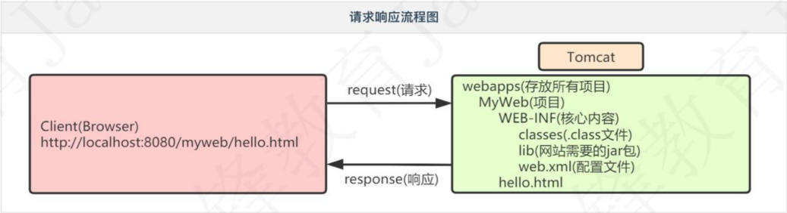
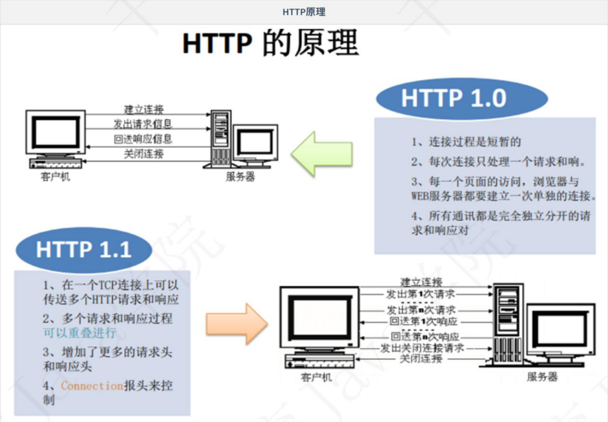
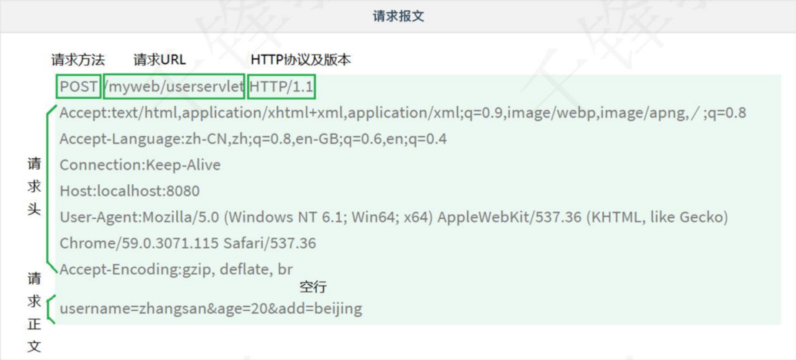

# Java Servlet

## 一、引言

### 1.1 C/S架构和B/S架构

> C/S和B/S是软件发展过程中出现的两种软件架构方式。

### 1.2 c/s架构 (Client/Server)

> - 特点：必须在客户端安装特定软件
> - 优点：图形效果显示较好（如：3D游戏》
> - 缺点：服务器的软件和功能进行升级，客户端也必须升级、不利于维护
> - 常见的C/S程序：QQ、微信等


### 1.3B/S架构(Browser/Server)

> 特点：无需安装客户端，任何浏览器都可直接访问
>
> 优点：涉及到功能的升级，只需要升级服务器端。
>
> 缺点：图形显示效果不如C/S架构
>
> 需要通过HTTP协议访问

## 二、服务器

### 2.1概念

#### 2.1.1什么是web

Web(World Wide Web)称为万维网，简单理解就是网站，它用来表示Internet主机上供外界访问的资源。

Internet上供外界访问的资源分为两大类

- 静态资源：指Wb页面中供人们浏览的数据始终是不变的。(HTML、CSS)

- 动态资源：指wb页面中供人们浏览的数据是由程序产生的，不同时间点，甚至不同设备访问wb页面看到的内容各不相同。(JSP/Servlet)

- 在Java中，动态Web资源开发技术我们统称为Java Web。

#### 2.1.2什么是web服务器

Web服务器是运行及发布Wb应用的容器，只有将开发的Web项目放置到该容器中，才能使网络中的所有用户通过浏览器进行访问。

### 2.2常见服务器

- 开源：OpenSource（1、开放源代码 2、免费）
  - Tomcat(主流Web服务器之一，适合初学者)
  - jetty(淘宝，运行效率比Tomcati高)
  - resin(新浪，所有开源服务器软件中，运行效率最高的)
  - 。三者的用法从代码角度完全相同，只有在开启、关闭服务器软件时对应的命令稍有区别。掌握一个即掌握所有
- 收费
  - WebLogic (Oracle)
  - WebSphere (IBM)
  - 提供相应的服务与支持，软件大，耗资源


### 2.3 Tomcat服务器

Tomcat是Apache软件基金会(Apache Software Foundation)的Jakarta项目中的一个核心项目，免费开源、并支持Servlet和JSP规范。目前Tomcati最新版本为9.0。

Tomcat技术先进、性能稳定，深受Jva爱好者喜爱并得到了部分软件开发商的认可，成为目前比较流行的Web应用服务器。

### 2.4 Tomcat:安装

#### 2.4.1下载

官网下载(http:/tomcat..apache.org/)Tomcata8.5解压缩版本

#### 2.4.2解压安装

将Tomcat解压到一个没有特殊符号的目录中（一般纯英文即可）

注意

- 不建议将服务器软件放在磁盘层次很多的文件夹
- 不建议放在中文路径下

#### 2.4.3 Tomcat目录结构


| 文件夹  | 说明                                                         | 备注                                                         |
| ------- | ------------------------------------------------------------ | ------------------------------------------------------------ |
| bin     | 该目录下存放的是二进制可执行文件                             | startup.bat启动Tomcat、shutdown.bat停止Tomcat                |
| conf    | 这是一个非常重要的目录<br>这个目录下有两个最为重要的文件server.xml和web.xml | server.xml: 配置整个服务器信息。例如修改端口号，编码格式等。<br>web.xml:项目部署描述符文件，这个文件中注册了很多MIME类型，即文档类型。 |
| lib     | Tomcat的类库，里面存放Tomcat运行所需要的jar文件。            |                                                              |
| logs    | 存放日志文件，记录了Tomcat)启动和关闭的信息，<br>如果启动Tomcat时有错误，异常也会记录在日志文件中。 |                                                              |
| temp    | Tomcat的临时文件，这个目录下的东西在停止Tomcat后删除。       |                                                              |
| webapps | 存放web项目的目录，其中每个文件夹都是一个项目；<br>其中root是一个特殊的项目，在地址栏中没有给出项目目录时，对应的就是ROOT项目。 |                                                              |
| work    | 运行时生成的文件，最终运行的文件都在这里。                   | 当客户端用户访问一个JSP文件时，Tomcat会通过JSP生成Java文件，<br>然后再编译Java文件生成class文件，生成的java和class文件都会存放到这个目录下。 |


### 2.5 Tomcat,启动和停止

#### 2.5.1启动

进入tomcat安装目录bin下，双击startup.bat启动程序即可

#### 2.5.2验证

打开浏览器，输入http://localhost:8080，如果出现访问界面证明Tomcat启动成功。

#### 2.5.3停止

双击shutdown.bat即可关闭Tomcat)启动窗口。

#### 2.5.4修改端口号

Tomcat默认端口号为8080，可以通过conf/server.xml文件修改

```xml
<Connector port="8080"protocol="HTTP/1.1"
		   connectionTimeout="20000"
		   redirectPort="8443"/>
```

- 注意：修改端口号需要重新启动Tomcat:才能生效

### 2.6 项目部署及访问静态资源

Tomcat是Web服务器，我们的项目应用是部署在webapps下，然后通过特定的URL访问。

#### 2.6.1 创建项目

- 在webapps中建立文件夹（项目应用），比如：myweb

  - 创建WEB-NF文件夹，用于存放项目的核心内容
    - 创建classes,用于存放.class文件
    - 创建ib,用于存放jar文件
    - 创建web.xml,项目配置文件（到ROOT项目下的WEB-NF复制即可）

  - 把网页hello.html复制到myweb文件夹中，与WEB-INF在同级目录


#### 2.6.2 URL访问资源

浏览器地址中输入URL:http://localhost:8080/myweb/hello.html

- 经验：URL主要有4部分组成：协议、主机、端口、资源路径


#### 2.6.3 Tomcat响应流程图




### 2.7常见错误

#### 2.7.1 Tomcat控制台闪退

闪退问题是由于JAVA_HOME配置导致的，检查JAVA_HOME配置是否正确

#### 2.7.2 404

访问资源不存在，出现404错误


## 三、Servlet

### 3.1 概念

- Servlet:Server Applet的简称，是服务器端的程序（代码、功能实现），可交互式的处理客户端发送到服务端的请求，并完成操作响应。

- 动态网页技术

- JavaWeb程序开发的基础，JavaEE规范（一套接口）的一个组成部分。

#### 3.1.1 Servletf作用
- 接收客户端请求，完成操作。
- 动态生成网页（页面数据可变）
- 将包含操作结果的动态网页响应给客户端。
  
### 3.2 Servlet开发步骤

#### 3.2.1 搭建开发环境
  将Servleti相关jar包(lib\servlet-.api.jar)配置到classpath中

#### 3.2.2 编写Servlet
- 实现javax.servlet.Servlet
- 重写5个主要方法
- 在核心的service()方法中编写输出语句，打印访问结果

```java
import javax.servlet.Servlet;
import javax.servlet.ServletConfig;
import javax.servlet.ServletRequest;
import javax.servlet.ServletResponse;
import javax.servlet.ServletException;
import java.io.IOException;

public class MyServlet implements Servlet{
    public void init(ServletConfig config)throws ServletException{
        
    }
    
	public void service(ServletRequest request,ServletResponse response)throws ServletException,IOException{
		System.out.println("My First Servlet!");
    }
    
	public void destroy(){
        
	}

    public ServletConfig getServletConfig(){
		return null;
    }
    
	public String getServletInfo(){
		return null;
    }
}
```

#### 3.2.3 部署Servlet

编译MyServlet后，将生成的.class文件放在WEB-INF/classes.文件中。

#### 3.2.4 配置Servlet

编写WEB-INF下项目配置文件web.xml

```xml
<?xml version="1.0"encoding="UTF-8"?>
<web-app xmlns xsi="http://www.w3.org/2001/XMLSchema-instance"xmlns="http://xmlns.jcp.org/xml/ns/javaee"
xsi:schemaLocation="http://xmlns.jcp.org/xml/ns/javaee http://xmlns.jcp.org/xml/ns/javaee/web-app_3_1.xsd"
version="3.1">
    
	<!--1、添加serv1et节点-->
	<servlet>
        <servlet-name>MyServlet</servlet-name>
        <servlet-class>com.qf.servlet.MyServlet</servlet-class>
	</servlet>
	
    <!--2 添加servlet-mapping节点 -->
    <servlet-mapping>
        <servlet-name>MyServlet</servlet-name>
        <url-pattern>/myservlet</url-pattern>
    </servlet-mapping>
    
</web-app>
```

- 注意：url-pattern配置的内容就是浏览器地址栏输入的URL中项目名称后资源的内容

### 3.3 运行测试

启动Tomcat,在浏览器地址栏中输入http://localhost:8080/myweb/myservlet访问，在Tomcat中打印时间表示成功。

### 3.4 常见错误

#### 3.4.1 500错误

服务端出现异常


## 四、HTTP协议

### 5.1 什么是HTTP

超文本传输协议(HTTP,HyperText Transfer Protocol))是互联网上应用最为广泛的一种网络协议，是一个基于请求与响应模式的、无状态的、应用层的协议，运行于TCP协议基础之上。

### 5.2 HTTP协议特点

- 支持客户端（浏览器）/服务器模式。
- 简单快速：客户端只向服务器发送请求方法和路径，服务器即可响应数据，因而通信速度很快。请求方法常用的有GT、POST等。
- 灵活：HTTP允许传输任意类型的数据，传输的数据类型由Content-Type标识。
- 无连接：无连接指的是每次TCP连接只处理一个或多个请求，服务器处理完客户的请求后，即断开连接。采用这种方式可以节省传输时间。
  - HTTP1.0 版本是一个请求响应之后，直接就断开了。称为短连接。
  - HTTP1.1 版本不是响应后直接就断开了，而是等几秒钟，这几秒钟之内有新的请求，那么还是通过之前的连接通道来收发消息，如果过了这几秒钟用户没有发送新的请求，就会断开连接。称为长连接。
- 无状态：HTTP协议是无状态协议。
  - 无状态是指协议对于事务处理没有记忆能力。

### 5.3 HTTP协议通信流程

- 客户与服务器建立连接（三次握手）
- 客户向服务器发送请求。
- 服务器接受请求，并根据请求返回相应的文件作为应答。
- 客户与服务器关闭连接（四次挥手）。




### 5.4 请求报文和响应报文

#### 5.4.1 HTTP请求报文

当浏览器向Wb服务器发出请求时，它向服务器传递了一个数据块，也就是请求信息（请求报文），HTTP请求信息由4部分组成：

1. 请求行请求方法/地址URI协议/版本
2. 请求头(Request Header)
3. 空行
4. 请求正文



#### 5.4.2HTTP响应报文

HTTP响应报文与HTTP请求报文相似，HTTP响应也由4个部分组成：

1. 状态行
2. 响应头(Response Header)
3. 空行
4. 响应正文


#### 5.4.3常见状态码

| 状态代码 | 状态描述              | 说明                                                         |
| -------- | --------------------- | ------------------------------------------------------------ |
| 200      | OK                    | 客户端请求成功                                               |
| 302      | Found                 | 临时重定向                                                   |
| 403      | Forbidden             | 服务器收到请求，但是拒绝提供服务。服务器通常会在响应正文中给出不提供服务的原因 |
| 404      | Not Found             | 请求的资源不存在，例如，输入了错误的URL。                    |
| 500      | Internal Server Error | 服务器发生不可预期的错误，导致无法完成客户端的请求。         |


## 六、Servleti详解【重点】

### 6.1 Servleti核心接口和类

在Servlet体系结构中，除了实现Servlet接口，还可以通过继承GenericServlet或HttpServlet类，完成编写。

#### 6.1.1 Servlet接口

在Servlet APIE中最重要的是Servlet:接口，所有Servlet都会直接或间接的与该接口发生联系，或是直接实现该接口，或间接继承自实现了该接口的类。该接口包括以下五个方法：

- init(ServletConfig config)
- ServletConfig getServletConfig()
- service(ServletRequest req,ServletResponse res)
- String getServletInfo()
- destroy()

#### 6.l.2 GenericServlet抽象类

GenericServlet使编写Servlet变得更容易。它提供生命周期方法init和destroy的简单实现，要编写一般的Servlet.,只需重写抽象service方法即可。

#### 6.1.3 HttpServlet类

HttpServlet是继承GenericServlet的基础上进一步的扩展。提供将要被子类化以创建适用于Web站点的HTTP servlet的抽象类。

HttpServlet的子类至少必须重写一个方法，该方法通常是以下这些方法之一：

1. doGet，如果servlet支持HTTP GET请求
2. doPost，用于HTTP POST请求
3. doPut，用于HTTP PUT请求
4. doDelete，用于HTTP DELETE请求

### 6.2 Servlet两种创建方式

#### 6.2.1实现接口Servlet

```java
/**
 * Servlet创建的第一种方式：实现接口Servlet
 * */
public class HelloServlet2 implements Servlet{
    
    @Override
    public void destroy(){
        
    }

        @Override
public ServletConfig getServletConfig(){
return null;
}
@Override
public String getServletInfo(){
return null;
}
@Override
public void init(ServletConfig arg0)throws ServletException
}
@Override
public void service(ServletRequest request,ServletResponse response)throws ServletException,IOException{
System.out.println("OK");
response.getWriter().println("welcome use servlet");
```

该方式比较麻烦，需要实现接口中所有方法。