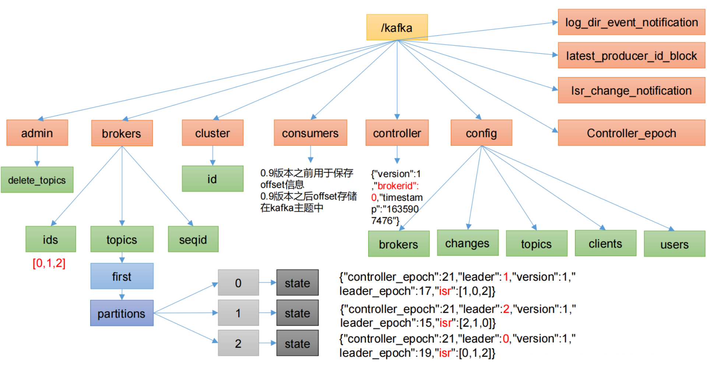
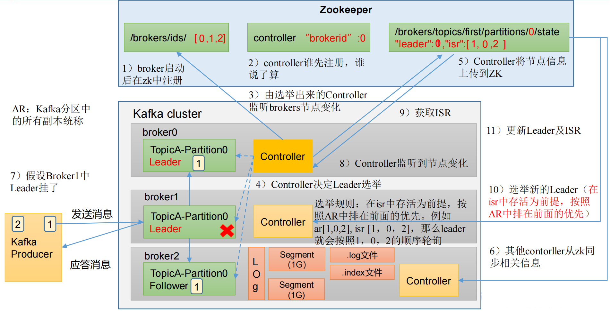

# Kafka Broker

## 一：Kafka Broker 工作流程

### 1.1 Zookeeper存储的Kafka信息结构图



kafka在zookeeper中存储的信息很多，重点了解以下几点：

1. /kafka/brokers/ids   [0,1,2]   记录当前集群中那些服务节点还存活。

2. /kafka/brokers/topics/first/partitions/0/state  

   `{"leader":1, "isr":[0,1,2]}`   记录谁是leader, 有哪些服务器

3. /kafka/controller  {"brokerid": 0} 辅助选举Leader


### 1.2 内容详解

#### 1.2.1 topic 注册信息

> /brokers/topics/[topic]

存储某个topic的partitions所有分配信息

```json
# Schema
{
    "version": "版本编号目前固定为数字1",
    "partitions": {
        "partitionId编号": [
            同步副本组brokerId列表
        ],
        "partitionId编号": [
            同步副本组brokerId列表
        ],
        .......
    }
}
# Example:
{
	"version": 1,
	"partitions": {
		"2": [1, 2, 3],
		"1": [0, 1, 2],
		"0": [3, 0, 1],
	}
}
```


#### 1.2.2 partition状态信息

> /brokers/topics/[topic]/partitions/[0...N]  其中[0..N]表示partition索引号
> 		/brokers/topics/[topic]/partitions/[partitionId]/state


```json
# Schema:
{
	"controller_epoch": 表示kafka集群中的中央控制器选举次数,
	"leader": 表示该partition选举leader的brokerId,
	"version": 版本编号默认为1,
	"leader_epoch": 该partition leader选举次数,
	"isr": [同步副本组brokerId列表]
}
# Example:
{
	"controller_epoch": 1,
	"leader": 3,
	"version": 1,
	"leader_epoch": 0,
	"isr": [3, 0, 1]
}
```

#### 1.2.3 Broker注册信息

> /brokers/ids/[0...N]  

每个broker的配置文件中都需要指定一个数字类型的id(全局不可重复),此节点为临时znode(EPHEMERAL)

```
# Schema:
{
    "jmx_port": jmx端口号,
    "timestamp": kafka broker初始启动时的时间戳,
    "host": 主机名或ip地址,
    "version": 版本编号默认为1,
    "port": kafka broker的服务端端口号,由server.properties中参数port确定
}
 
# Example:
{
    "jmx_port": -1,
    "timestamp":"1525741823119"
    "version": 1,
    "host": "hadoop1",
    "port": 9092
}
```

#### 1.2.4 Controller epoch

> /controller_epoch --> int (epoch)  

此值为一个数字,kafka集群中第一个broker第一次启动时为1，以后只要集群中center controller中央控制器所在broker变更或挂掉，就会重新选举新的center controller，每次center controller变更controller_epoch值就会 + 1; 

#### 1.2.5 Controller注册信息

> /controller -> int (broker id of the controller)

 存储center controller中央控制器所在kafka broker的信息

```
# Schema:
{
    "version": 版本编号默认为1,
    "brokerid": kafka集群中broker唯一编号,
    "timestamp": kafka broker中央控制器变更时的时间戳
}
 
# Example:
{
    "version": 1,
    "brokerid": 0,
    "timestamp": "1525741822769"
}
```

#### 1.2.6 Consumer均衡算法

当一个group中,有consumer加入或者离开时,会触发partitions均衡.均衡的最终目的,是提升topic的并发消费能力.
1) 假如topic1,具有如下partitions: P0,P1,P2,P3
2) 加入group中,有如下consumer: C0,C1
3) 首先根据partition索引号对partitions排序: P0,P1,P2,P3
4) 根据(consumer.id + '-'+ thread序号)排序: C0,C1
5) 计算倍数: M = [P0,P1,P2,P3].size / [C0,C1].size,本例值M=2(向上取整)
6) 然后依次分配partitions: C0 = [P0,P1],C1=[P2,P3],即Ci = [P(i * M),P((i + 1) * M -1)]

#### 1.2.7 Consumer注册信息

> /consumers/[groupId]/ids/[consumerIdString]

每个consumer都有一个唯一的ID(consumerId可以通过配置文件指定,也可以由系统生成),此id用来标记消费者信息.

是一个临时的znode,此节点的值为请看consumerIdString产生规则,即表示此consumer目前所消费的topic + partitions列表.

consumerId产生规则：

```java
String consumerUuid = null;
if(config.consumerId!=null && config.consumerId)
  consumerUuid = consumerId;
else {
  String uuid = UUID.randomUUID()
  consumerUuid = "%s-%d-%s".format(
    InetAddress.getLocalHost.getHostName, System.currentTimeMillis,
    uuid.getMostSignificantBits().toHexString.substring(0,8));

 }
 String consumerIdString = config.groupId + "_" + consumerUuid;
```


```json
Schema:
{
    "version": 版本编号默认为1,
    "subscription": { //订阅topic列表
    	"topic名称": consumer中topic消费者线程数
    },
    "pattern": "static",
    "timestamp": "consumer启动时的时间戳"
}
 
Example:
{
    "version": 1,
    "subscription": {
    	"topic2": 1
    },
    "pattern": "white_list",
    "timestamp": "1525747915336"
}
```

#### 1.2.8 Consumer owner

> /consumers/[groupId]/owners/[topic]/[partitionId] -> consumerIdString + threadId索引编号

a) 首先进行"Consumer Id注册";

b) 然后在"Consumer id 注册"节点下注册一个watch用来监听当前group中其他consumer的"退出"和"加入";只要此znode path下节点列表变更,都会触发此group下consumer的负载均衡.(比如一个consumer失效,那么其他consumer接管partitions).

c) 在"Broker id 注册"节点下,注册一个watch用来监听broker的存活情况;如果broker列表变更,将会触发所有的groups下的consumer重新balance.


#### 1.2.9 Consumer offset

> /consumers/[groupId]/offsets/[topic]/[partitionId] -> long (offset)

用来跟踪每个consumer目前所消费的partition中最大的offset

此znode为持久节点,可以看出offset跟group_id有关,以表明当消费者组(consumer group)中一个消费者失效,

重新触发balance,其他consumer可以继续消费.


### 1.3 Kafka Broker 总体工作流程




### 1.4 Broker重要参数

| 参数名称                                | 描述                                                         |
| --------------------------------------- | ------------------------------------------------------------ |
| replica.lag.time.max.ms                 | ISR 中，如果 Follower 长时间未向 Leader 发送通信请求或同步数据，则该 Follower 将被踢出 ISR。该时间阈值，默认 30s。 |
| auto.leader.rebalance.enable            | 默认是 true。 自动 Leader Partition 平衡。                   |
| leader.imbalance.per.broker.percentage  | 默认是 10%。每个 broker 允许的不平衡的 leader的比率。如果每个 broker 超过了这个值，控制器会触发 leader 的平衡。 |
| leader.imbalance.check.interval.seconds | 默认值 300 秒。检查 leader 负载是否平衡的间隔时间。          |
| log.segment.bytes                       | Kafka 中 log 日志是分成一块块存储的，此配置是指 log 日志划分成块的大小，默认值 1G。 |
| log.index.interval.bytes                | 默认 4kb，kafka 里面每当写入了 4kb 大小的日志（.log），然后就往 index 文件里面记录一个索引。 |
| log.retention.hours                     | Kafka 中数据保存的时间，默认 7 天。                          |
| log.retention.minutes                   | Kafka 中数据保存的时间，分钟级别，默认关闭。                 |
| log.retention.ms                        | Kafka 中数据保存的时间，毫秒级别，默认关闭。                 |
| log.retention.check.interval.ms         | 检查数据是否保存超时的间隔，默认是 5 分钟。                  |
| log.retention.bytes                     | 默认等于-1，表示无穷大。超过设置的所有日志总大小，删除最早的 segment。 |
| log.cleanup.policy                      | 默认是 delete，表示所有数据启用删除策略；如果设置值为 compact，表示所有数据启用压缩策略。 |
| num.io.threads                          | 默认是 8。负责写磁盘的线程数。整个参数值要占总核数的 50%。   |
| num.replica.fetchers                    | 副本拉取线程数，这个参数占总核数的 50%的 1/3                 |
| num.network.threads                     | 默认是 3。数据传输线程数，这个参数占总核数的50%的 2/3 。     |
| log.flush.interval.messages             | 强制页缓存刷写到磁盘的条数，默认是 long 的最大值，9223372036854775807。一般不建议修改，交给系统自己管理。 |
| log.flush.interval.ms                   | 每隔多久，刷数据到磁盘，默认是 null。一般不建议修改，交给系统自己管理。 |

