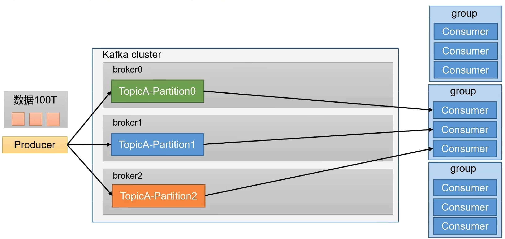
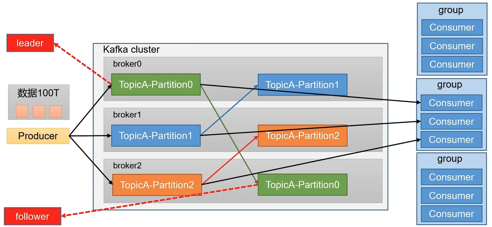
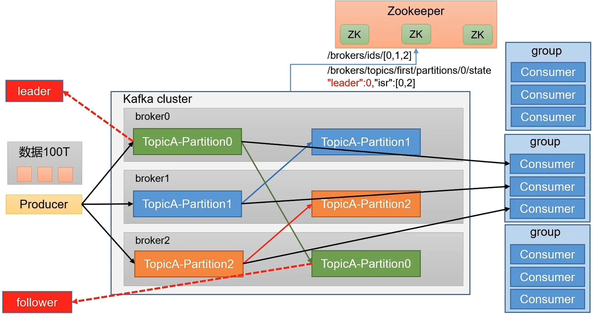
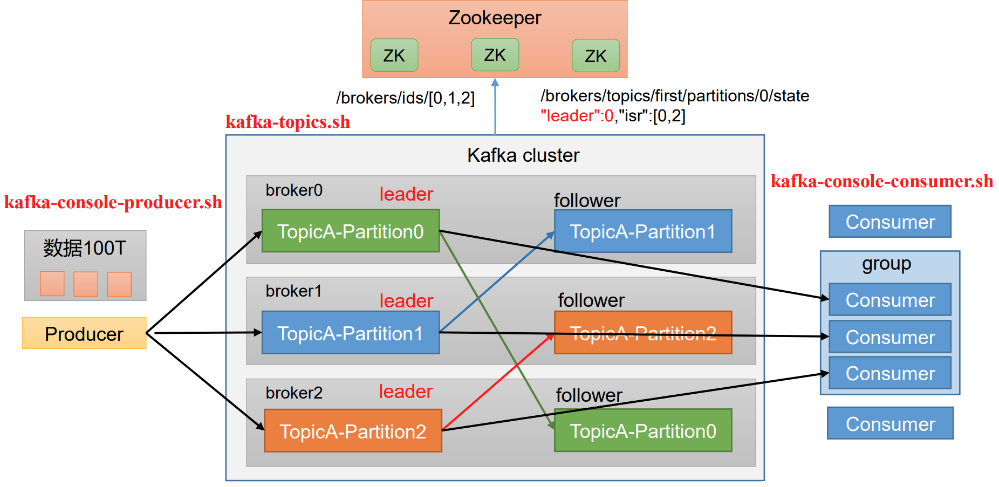

# Kafka 概述

## 一、Kafka的简单介绍

### 1.1 Kakfa定义

**Kafka传统定义：** Kafka是一个分布式的基于发布/订阅模式的消息队列（MessageQueue），主要应用于大数据实时处理领域。

**发布订阅：** 消息的发布者不会将消息直接发送给特定的订阅者，而是将发布的消息分为不同的类别，订阅者只接收感兴趣的消息。

**Kafka最新定义 ：**  Kafka是 一个开源的 分 布式事件流平台 （Event StreamingPlatform），被数千家公司用于高性能数据管道、流分析、数据集成和关键任务应用。


如上图所示的一个流程，首先通过网站首页浏览数据，页面会做一个买点，进行日志的记录，后台会通过flume来将日志发送到kafka集群，hadoop从kafka中获取数据进行消费。由于hadoop的数据处理能力有限，kafka集群在这里起到一个削峰的作用。

### 1.2 消息队列

目前企业中比较见的消息队列产品主要有 Kafka、ActiveMQ 、RabbitMQ 、RocketMQ 等。在大数据场景主要采用 Kafka 作为消息队列。在 JavaEE 开发中主要采用 ActiveMQ、RabbitMQ、RocketMQ。

#### 1.2.1 传统消息队列的应用场景

传统的消息队列的主要应用场景包括：缓存/消峰、解耦和异步通信。

**缓冲/消峰：**

有助于控制和优化数据流经过系统的速度，解决生产消息和消费消息的处理速度不一致的情况。


**解耦：**

允许你独立的扩展或修改两边的处理过程，只要确保它们遵守同样的接口约束。


**异步通信：**

允许用户把一个消息放入队列，但并不立即处理它，然后在需要的时候再去处理它们。


#### 1.2.2 消息队列的两种模式

**点对点模式：**

- 消费者主动拉去数据，消息收到后清除消息


**发布\订阅模式:**

- 可以有多个topic主题（浏览、点赞、收藏、评论等）

- 消费者消费数据之后，不删除数据

- 每个消费者相互独立，都可以消费到数据


### 1.3 Kafka 的基础架构

**Kafka中的基础组件介绍：**

1. **Producer：** 消息生产者，就是向 Kafka broker 发消息的客户端。 
2. **Consumer：** 消息消费者，向 Kafka broker 取消息的客户端。 
3. **Consumer Group（CG）：** 消费者组，由多个 consumer 组成。消费者组内每个消 费者负责消费不同分区的数据，一个分区只能由一个组内消费者消费；消费者组之间互不 影响。所有的消费者都属于某个消费者组，即消费者组是逻辑上的一个订阅者。 
4. **Broker：** 一台 Kafka 服务器就是一个 broker。一个集群由多个 broker 组成。一个 broker 可以容纳多个 topic。 
5. **Topic：** 可以理解为一个队列，生产者和消费者面向的都是一个 topic。 
6. **Partition：** 为了实现扩展性，一个非常大的 topic 可以分布到多个 broker（即服 务器）上，一个 topic 可以分为多个 partition，每个 partition 是一个有序的队列。 
7. **Replica：** 副本。一个 topic 的每个分区都有若干个副本，一个 Leader 和若干个 Follower。 
8. **Leader：** 每个分区多个副本的“主”，生产者发送数据的对象，以及消费者消费数 据的对象都是 Leader。 
9. **Follower：** 每个分区多个副本中的“从”，实时从 Leader 中同步数据，保持和 Leader 数据的同步。Leader 发生故障时，某个 Follower 会成为新的 Leader。


**Kafka集群进化论**

从一开始最简单的单机节点开始，一个生产者和多个消费者。但是数据量打了之后，单机节点存储不足，就需要开始扩展了。


为了方便扩展，并提高吞吐量，一个topic分为多个partition。这样就可以把存储分散到多态机器上，并且增加了生产数据的性能。配合分区的设计，提出了消费者组的概念，组内每个消费者并行消费。topic中的每个partation只能由组内的一个消费者进行消费，不能使两个消费者同时消费同一个partation的数据。



在这里，每个partation都只有一个副本，如果节点down了，数据岂不是就丢失了。为了提高可用性，为partition增加了若干副本。这里需要注意的一点，kafka的副本有主从之分，数据的生产和消费只针对副本中的leader生效。当leader挂掉之后，follower就会接替leader的位置。



Kafka中有一部分数据是存储在Zookeeper中的，例如kafka集群中存活的节点，partition中那个副本是leader，那个是flower节点。这里要注意的一点，kafka2.8版本后，可以不在配置ZK了。




## 二、Kafka快速入门


### 2.1 安装部署

#### 2.1.1 集群规划

| node01 | node02 | node03 |
| ------ | ------ | ------ |
| ZK     | ZK     | ZK     |
| kafka  | kafka  | kafka  |

#### 2.1.2 集群部署

【1】官方下载地址：http://kafka.apache.org/downloads.html

【2】解压安装包 

```
[xuliang@node01 software]$ tar -zxvf kafka_2.12-3.0.0.tgz -C  /opt/module/ 
```

【3】修改解压后的文件名称

```
[xuliang@node01 module]$ mv kafka_2.12-3.0.0/ kafka 
```

【4】进入到/opt/module/kafka 目录，修改配置文件

```
 [xuliang@node01 kafka]$ cd config/ 
 [xuliang@node01 config]$ vim server.properties 
```

输入以下内容：

```properties
# broker 的全局唯一编号，不能重复，只能是数字。
broker.id=0
# 处理网络请求的线程数量
num.network.threads=3
# 用来处理磁盘 IO 的线程数量
num.io.threads=8
# 发送套接字的缓冲区大小
socket.send.buffer.bytes=102400
# 接收套接字的缓冲区大小
socket.receive.buffer.bytes=102400
# 请求套接字的缓冲区大小
socket.request.max.bytes=104857600
# kafka 运行日志(数据)存放的路径，路径不需要提前创建，kafka 自动帮你创建，可以配置多个磁盘路径，路径与路径之间可以用"，"分隔
log.dirs=/opt/module/kafka/datas
# topic 在当前 broker 上的分区个数
num.partitions=1
# 用来恢复和清理 data 下数据的线程数量
num.recovery.threads.per.data.dir=1
# 每个 topic 创建时的副本数，默认时 1 个副本
offsets.topic.replication.factor=1
# segment 文件保留的最长时间，超时将被删除
log.retention.hours=168
# 每个 segment 文件的大小，默认最大 1G
log.segment.bytes=1073741824
# 检查过期数据的时间，默认 5 分钟检查一次是否数据过期
log.retention.check.interval.ms=300000
# 配置连接 Zookeeper 集群地址（在 zk 根目录下创建/kafka，方便管理）
zookeeper.connect=node01:2181,node02:2181,node03:2181/kafka
```

【5】分发安装包

```
[xuliang@node01 module]$ xsync kafka/
```

【6】分别在 node02 和 node03 上修改配置文件/opt/module/kafka/config/server.properties 中的 broker.id=1、broker.id=2

注：broker.id 不得重复，整个集群中唯一。

```properties
# [xuliang@node02 module]$ vim kafka/config/server.properties
# 修改:
# The id of the broker. This must be set to a unique integer for each broker.
broker.id=1
# [xuliang@node03 module]$ vim kafka/config/server.properties
# 修改:
# The id of the broker. This must be set to a unique integer for each broker.
broker.id=2
```

【7】配置环境变量

（1）在/etc/profile.d/my_env.sh 文件中增加 kafka 环境变量配置

```
 [xuliang@node01 module]$ sudo vim /etc/profile.d/my_env.sh 
```

增加如下内容： 

```
#KAFKA_HOME 
export KAFKA_HOME=/opt/module/kafka 
export PATH=$PATH:$KAFKA_HOME/bin 
```

（2）刷新一下环境变量。

```
 [xuliang@node01 module]$ source /etc/profile
```

 （3）分发环境变量文件到其他节点，并 source。 

```
[xuliang@node01 module]$ sudo /home/atguigu/bin/xsync  /etc/profile.d/my_env.sh 
[xuliang@node02 module]$ source /etc/profile 
[xuliang@node03 module]$ source /etc/profile
```


【8】启动集群

（1）先启动 Zookeeper 集群，然后启动 Kafka。

```
 [xuliang@node01 kafka]$ zk.sh start 
```

 （2）依次在 node01、node02、node03 节点上启动 Kafka。

```
 [xuliang@node01 kafka]$ bin/kafka-server-start.sh -daemon config/server.properties 
 [xuliang@node02 kafka]$ bin/kafka-server-start.sh -daemon config/server.properties 
 [xuliang@node03 kafka]$ bin/kafka-server-start.sh -daemon config/server.propertie
```

注意：配置文件的路径要能够到 server.properties。

【9】关闭集群

```
[xuliang@node01 kafka]$ bin/kafka-server-stop.sh 
[xuliang@node02 kafka]$ bin/kafka-server-stop.sh 
[xuliang@node03 kafka]$ bin/kafka-server-stop.sh
```

#### 2.1.3 集群启停脚本

【1】在/home/atguigu/bin 目录下创建文件 kf.sh 脚本文件

```
[xuliang@node01 bin]$ vim kf.sh
```

脚本如下：

```shell
#! /bin/bash
case $1 in
"start"){
    for i in node01 node02 node03
    do
        echo " --------启动 $i Kafka-------"
        ssh $i "/opt/module/kafka/bin/kafka-server-start.sh -daemon /opt/module/kafka/config/server.properties"
    done
};;
"stop"){
    for i in node01 node02 node03
    do
        echo " --------停止 $i Kafka-------"
        ssh $i "/opt/module/kafka/bin/kafka-server-stop.sh "
    done
};;
esac
```

【2】添加执行权限

```
 [xuliang@node01 bin]$ chmod +x kf.sh 
```

【3】启动集群命令

```
 [xuliang@node01 ~]$ kf.sh start 
```

【4】停止集群命令

```
 [xuliang@node01 ~]$ kf.sh stop
```

注意：停止 Kafka 集群时，一定要等 Kafka 所有节点进程全部停止后再停止 Zookeeper 集群。因为 Zookeeper 集群当中记录着 Kafka 集群相关信息，Zookeeper 集群一旦先停止， Kafka 集群就没有办法再获取停止进程的信息，只能手动杀死 Kafka 进程了。


#### 2.1.4 docker compose部署集群

通过docker的方式快速启动一个开发环境。

这里需要注意，KAFKA_CFG_ADVERTISED_LISTENERS配置需要替换为虚机的实际IP地址。

```yaml
version: '3.1'

networks:
  zk-net:  # 网络名
    name: zk-net
    driver: bridge

services:
  # zookeeper集群
  zoo1:
    image: zookeeper:3.8.0
    container_name: zoo1   # 容器名称
    restart: always       # 开机自启
    hostname: zoo1        # 主机名
    ports:
      - 2181:2181         # 端口号
    environment:
      ZOO_MY_ID: 1
      ZOO_SERVERS: server.1=zoo1:2888:3888;2181 server.2=zoo2:2888:3888;2181 server.3=zoo3:2888:3888;2181
    networks:
      - zk-net
  zoo2:
    image: zookeeper:3.8.0
    container_name: zoo2
    restart: always
    hostname: zoo2
    ports:
      - 2182:2181
    environment:
      ZOO_MY_ID: 2
      ZOO_SERVERS: server.1=zoo1:2888:3888;2181 server.2=zoo2:2888:3888;2181 server.3=zoo3:2888:3888;2181
    networks:
      - zk-net
  zoo3:
    image: zookeeper:3.8.0
    container_name: zoo3
    restart: always
    hostname: zoo3
    ports:
      - 2183:2181
    environment:
      ZOO_MY_ID: 3
      ZOO_SERVERS: server.1=zoo1:2888:3888;2181 server.2=zoo2:2888:3888;2181 server.3=zoo3:2888:3888;2181
    networks:
      - zk-net
  # kafka集群
  kafka1:
    image: 'bitnami/kafka:3.0.0'
    container_name: kafka1
    hostname: kafka1
    networks:
      - zk-net
    ports:
      - '9092:9092'
    environment:
      - KAFKA_CFG_ZOOKEEPER_CONNECT=zoo1:2181,zoo2:2182,zoo3:2183/kafka
      - KAFKA_BROKER_ID=1   
      - KAFKA_CFG_LISTENERS=PLAINTEXT://:9092
      - KAFKA_CFG_ADVERTISED_LISTENERS=PLAINTEXT://192.168.10.105:9092
      - ALLOW_PLAINTEXT_LISTENER=yes
    depends_on:
      - zoo1
      - zoo2
      - zoo3
  kafka2:
    image: 'bitnami/kafka:3.0.0'
    container_name: kafka2
    hostname: kafka2
    networks:
      - zk-net
    ports:
      - '9093:9093'
    environment:
      - KAFKA_CFG_ZOOKEEPER_CONNECT=zoo1:2181,zoo2:2182,zoo3:2183/kafka
      - KAFKA_BROKER_ID=2
      - KAFKA_CFG_LISTENERS=PLAINTEXT://:9093
      - KAFKA_CFG_ADVERTISED_LISTENERS=PLAINTEXT://192.168.10.105:9093
      - ALLOW_PLAINTEXT_LISTENER=yes
    depends_on:
      - zoo1
      - zoo2
      - zoo3
  kafka3:
    image: 'bitnami/kafka:3.0.0'
    container_name: kafka3
    hostname: kafka3
    networks:
      - zk-net
    ports:
      - '9094:9094'
    environment:
      - KAFKA_CFG_ZOOKEEPER_CONNECT=zoo1:2181,zoo2:2182,zoo3:2183/kafka
      - KAFKA_BROKER_ID=3  
      - KAFKA_CFG_LISTENERS=PLAINTEXT://:9094
      - KAFKA_CFG_ADVERTISED_LISTENERS=PLAINTEXT://192.168.10.105:9094
      - ALLOW_PLAINTEXT_LISTENER=yes
    depends_on:
      - zoo1
      - zoo2
      - zoo3

```


启动命令：

```
docker-compose up -d
```


主线：使用docker-compose部署zookeeper集群以及kafka集群

博客：

1、安装docker可见：https://changlu.blog.csdn.net/article/details/124394266

2、安装docker-compose：https://blog.csdn.net/cl939974883/article/details/126463806?spm=1001.2014.3001.5501

3、使用docker-compose快速搭建zookeeper+kafka集群：https://changlu.blog.csdn.net/article/details/126511784?spm=1001.2014.3001.5502

```shell
# 检验zookeeper集群中是否有kafka信息
./zkCli.sh -server 127.0.0.1:2181

ls /kafka/brokers/ids
```

**容器内收发消息**：

```shell
# 进入kafka1服务
docker exec -it kafka1 /bin/bash

# 创建topic【first】
kafka-topics.sh --bootstrap-server localhost:9092 --create --partitions 3 --replication-factor 3 --topic first

# 生产者发送消息到topic
kafka-console-producer.sh --bootstrap-server localhost:9092 --topic first

# -------------------------------------

# 进入kafka2服务
docker exec -it kafka2 /bin/bash

# 查看主题列表
kafka-topics.sh --bootstrap-server localhost:9093 --list

# 消费者
kafka-console-consumer.sh --bootstrap-server localhost:9093 --topic first
```

**Java程序去发送消息**：

kafka1服务也进入到指定topic为first的消费者模式：

```shell
# kafka1服务中
kafka-console-consumer.sh --bootstrap-server localhost:9092 --topic first
```

Java连接代码：

```java
import org.apache.kafka.clients.producer.*;
import org.apache.kafka.common.serialization.StringSerializer;

import java.util.Properties;

/**
 * @Description: 自定义生产者
 * @Author: changlu
 * @Date: 10:27 AM
 */
public class CustomProducer {

    public static void main(String[] args) {
        //1、创建kafka的生产者配置对象
        Properties properties = new Properties();

        //2、添加对象配置参数：bootstrap.servers、key与value序列化器
        properties.put(ProducerConfig.BOOTSTRAP_SERVERS_CONFIG, "192.168.10.119:9094");
        //key,value序列化器
        properties.put(ProducerConfig.KEY_SERIALIZER_CLASS_CONFIG, StringSerializer.class.getName());
        properties.put(ProducerConfig.VALUE_SERIALIZER_CLASS_CONFIG, StringSerializer.class.getName());

        //3、创建kafka生产者对象
        KafkaProducer<String, String> kafkaProducer = new KafkaProducer<String, String>(properties);

        //4、send方法进行发送
        for (int i = 0; i < 5; i++) {
            kafkaProducer.send(new ProducerRecord<String, String>("first", "changlu" + i));
        }

        //5、关闭资源
        kafkaProducer.close();
    }

}
```


### 2.2 Kafka 命令行操作



#### 2.2.1 主题命令行操作

【1】查看操作主题命令参数 

```
[xuliang@node01 kafka]$ bin/kafka-topics.sh
```

| 参数                                              | 描述                                   |
| ------------------------------------------------- | -------------------------------------- |
| --bootstrap-server <String: server toconnect to>  | 连接的 Kafka Broker 主机名称和端口号。 |
| --topic <String: topic>                           | 操作的 topic 名称。                    |
| --create                                          | 创建主题。                             |
| --delete                                          | 删除主题。                             |
| --alter                                           | 修改主题。                             |
| --list                                            | 查看所有主题。                         |
| --describe                                        | 查看主题详细描述。                     |
| --partitions <Integer: # of partitions>           | 设置分区数。                           |
| --replication-factor<Integer: replication factor> | 设置分区副本。                         |
| --config <String: name=value>                     | 更新系统默认的配置。                   |

【2】查看当前服务器中的所有 topic

```
[xuliang@node01 kafka]$ bin/kafka-topics.sh --bootstrap-server node01:9092 --list
```

【3】创建 first topic

```
[xuliang@node01 kafka]$ bin/kafka-topics.sh --bootstrap-server node01:9092 --create --partitions 1 --replication-factor 3 --topic first
```

选项说明：

- --topic 定义 topic 名 
- --replication-factor 定义副本数 
- --partitions 定义分区数

【4】查看 first 主题的详情

```
[xuliang@node01 kafka]$ bin/kafka-topics.sh --bootstrap-server node01:9092 --describe --topic first
```

【5】修改分区数（注意：分区数只能增加，不能减少） 

```
[xuliang@node01 kafka]$ bin/kafka-topics.sh --bootstrap-server  node01:9092 --alter --topic first --partitions 3
```

 【6】再次查看 first 主题的详情 

```
[xuliang@node01 kafka]$ bin/kafka-topics.sh --bootstrap-server  node01:9092 --describe --topic first
```

 【7】删除 topic（学生自己演示） 

```
[xuliang@node01 kafka]$ bin/kafka-topics.sh --bootstrap-server  node01:9092 --delete --topic first
```

#### **2.1.1** 生产者命令行操作

【1】查看操作生产者命令参数

```
[xuliang@node01 kafka]$ bin/kafka-console-producer.sh	
```

| 参数                                             | 描述                                   |
| ------------------------------------------------ | -------------------------------------- |
| --bootstrap-server <String: server toconnect to> | 连接的 Kafka Broker 主机名称和端口号。 |
| --topic <String: topic>                          | 操作的 topic 名称。                    |

【2】发送消息

```
[xuliang@node01 kafka]$ bin/kafka-console-producer.sh --bootstrap-server node01:9092 --topic first
>hello world
>atguigu atguigu
```


#### **2.1.2**  消费者命令行操作 

【1】查看操作消费者命令参数 

```
[xuliang@node01 kafka]$ bin/kafka-console-consumer.sh	
```

 

| 参数                                             | 描述                                   |
| ------------------------------------------------ | -------------------------------------- |
| --bootstrap-server <String: server toconnect to> | 连接的 Kafka Broker 主机名称和端口号。 |
| --topic <String: topic>                          | 操作的 topic 名称。                    |
| --from-beginning                                 | 从头开始消费。                         |
| --group <String: consumer group id>              | 指定消费者组名称。                     |

【2】消费消息

消费 first 主题中的数据。

```
[xuliang@node01 kafka]$ bin/kafka-console-consumer.sh -- bootstrap-server node01:9092 --topic first 
```

把主题中所有的数据都读取出来（包括历史数据）。

```
[xuliang@node01 kafka]$ bin/kafka-console-consumer.sh -- bootstrap-server node01:9092 --from-beginning --topic first
```

