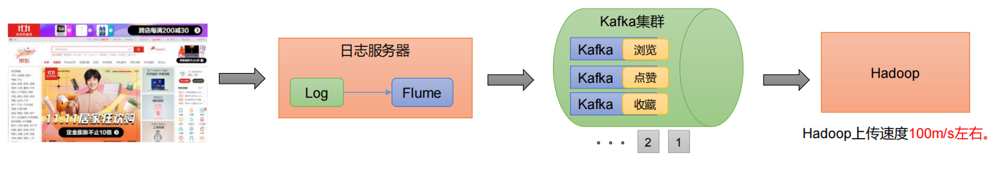
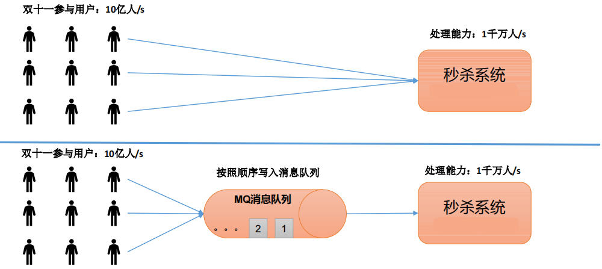
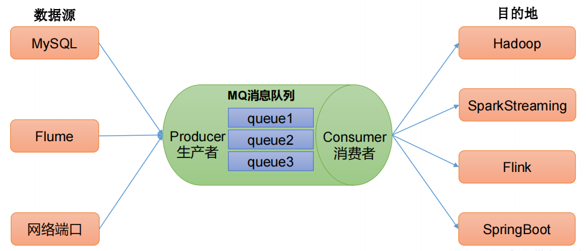
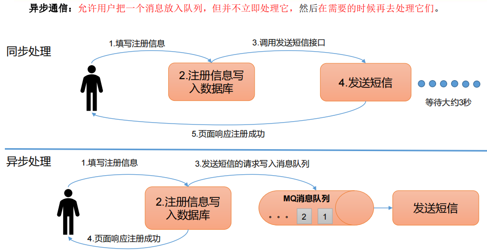
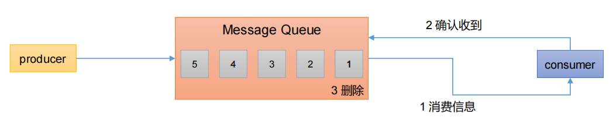
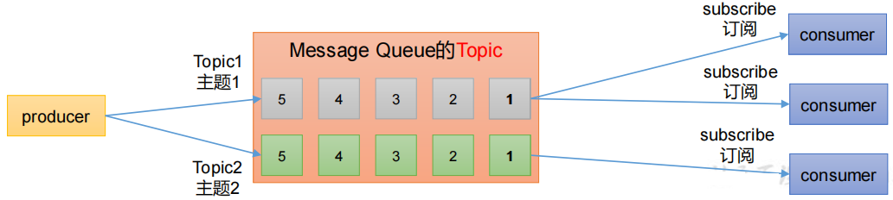
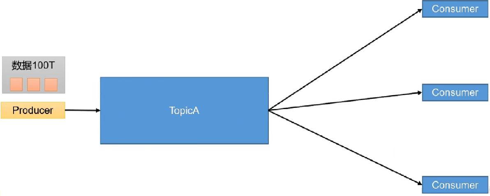

# Kafka 概述

## 一、Kafka的简单介绍

### 1.1 Kakfa定义

**Kafka传统定义：** Kafka是一个分布式的基于发布/订阅模式的消息队列（MessageQueue），主要应用于大数据实时处理领域。

**发布订阅：** 消息的发布者不会将消息直接发送给特定的订阅者，而是将发布的消息分为不同的类别，订阅者只接收感兴趣的消息。

**Kafka最新定义 ：**  Kafka是 一个开源的 分 布式事件流平台 （Event StreamingPlatform），被数千家公司用于高性能数据管道、流分析、数据集成和关键任务应用。

如上图所示的一个流程，首先通过网站首页浏览数据，页面会做一个买点，进行日志的记录，后台会通过flume来将日志发送到kafka集群，hadoop从kafka中获取数据进行消费。由于hadoop的数据处理能力有限，kafka集群在这里起到一个削峰的作用。

### 1.2 消息队列

目前企业中比较见的消息队列产品主要有 Kafka、ActiveMQ 、RabbitMQ 、RocketMQ 等。在大数据场景主要采用 Kafka 作为消息队列。在 JavaEE 开发中主要采用 ActiveMQ、RabbitMQ、RocketMQ。

#### 1.2.1 传统消息队列的应用场景

传统的消息队列的主要应用场景包括：缓存/消峰、解耦和异步通信。

**缓冲/消峰：**

有助于控制和优化数据流经过系统的速度，解决生产消息和消费消息的处理速度不一致的情况。

**解耦：**

允许你独立的扩展或修改两边的处理过程，只要确保它们遵守同样的接口约束。

**异步通信：**

允许用户把一个消息放入队列，但并不立即处理它，然后在需要的时候再去处理它们。

#### 1.2.2 消息队列的两种模式

**点对点模式：**

- 消费者主动拉去数据，消息收到后清除消息

**发布\订阅模式:**

- 可以有多个topic主题（浏览、点赞、收藏、评论等）

- 消费者消费数据之后，不删除数据

- 每个消费者相互独立，都可以消费到数据

1.3 Kafka 的基础架构

