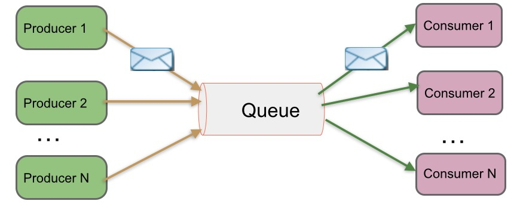
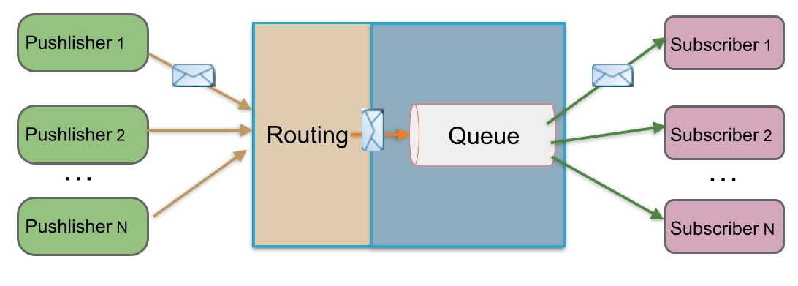
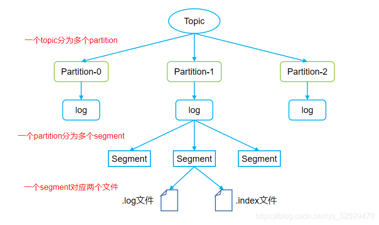

# Kafka Overview

### Kafka 入门介绍

一个流处理平台，应该具备三个关键能力：

- 发布和订阅消息（流）， 在这方面，他类似一个消息队列
- 以容错（故障转移）的方式处理存储消息（流）
- 在消息发生是处理他们


kafka作为一个流处理平台，主要应用于两大类场景：

- 构建实时的数据流管道，可靠的获取系统和应用程序之间的数据
- 构建实时流的应用程序，对数据流进行转换或反应

#### 几个概念

1. kafka作为一个集群运行在一个或多个服务器上
2. kafka集群存储的消息时以topic为类别记录
3. 每个消息时有一个key，一个value和时间戳构成。

#### kafka的四个核心API

- 应用程序使用Producer API发布一个消息到1个或对个topic中

- 应用程序使用Consumer API来订阅一个或多个topic，并处理产生的消息

- 应用程序使用 Streams API 充当一个流处理器，从1个或多个topic消费输入流，并生产一个输出流到1个或多个输出topic，有效地将输入流转换到输出流。

- Connector API可构建或运行可重用的生产者或消费者，将topic连接到现有的应用程序或数据系统。例如，连接到关系数据库的连接器可以捕获表的每个变更。

  

Client和Server之间的通讯，是通过一条简单、高性能并且和开发语言无关的[TCP协议](/fwd?link=https://kafka.apache.org/protocol.html)。并且该协议保持与老版本的兼容。Kafka提供了Java Client（客户端）。除了Java客户端外，还有非常多的[其它编程语言的客户端](/fwd?link=https://cwiki.apache.org/confluence/display/KAFKA/Clients)。

#### kafka的基本术语

##### Topic

Kafka将消息分门别类，每一类的消息称之为一个主题（Topic）。

##### Producer

发布消息的对象称之为主题生产者（Kafka topic producer）

##### Consumer

订阅消息并处理发布的消息的对象称之为主题消费者（consumers）

##### Broker

已发布的消息保存在一组服务器中，称之为Kafka集群。集群中的每一个服务器都是一个代理（Broker）。 消费者可以订阅一个或多个主题（topic），并从Broker拉数据，从而消费这些已发布的消息。

#### 日志和主题

让我们更深入的了解Kafka中的Topic。

Topic是发布的消息的类别名，一个topic可以有零个，一个或多个消费者订阅该主题的消息。

对于每个topic，Kafka集群都会维护一个分区log，就像下图中所示：


每一个分区都是一个顺序的、不可变的消息队列， 并且可以持续的添加。分区中的消息都被分了一个序列号，称之为偏移量(offset)，在每个分区中此偏移量都是唯一的。

Kafka集群保持所有的消息，直到它们过期（无论消息是否被消费）。实际上消费者所持有的仅有的元数据就是这个offset（偏移量），也就是说offset由消费者来控制：正常情况当消费者消费消息的时候，偏移量也线性的的增加。但是实际偏移量由消费者控制，消费者可以将偏移量重置为更早的位置，重新读取消息。可以看到这种设计对消费者来说操作自如，一个消费者的操作不会影响其它消费者对此log的处理。


再说说分区。Kafka中采用分区的设计有几个目的。一是可以处理更多的消息，不受单台服务器的限制。Topic拥有多个分区意味着它可以不受限的处理更多的数据。第二，分区可以作为并行处理的单元，稍后会谈到这一点。

#### 分布式(Distribution)

Log的分区被分布到集群中的多个服务器上。每个服务器处理它分到的分区。 根据配置每个分区还可以复制到其它服务器作为备份容错。 每个分区有一个leader，零或多个follower。Leader处理此分区的所有的读写请求，而follower被动的复制数据。如果leader宕机，其它的一个follower会被推举为新的leader。 一台服务器可能同时是一个分区的leader，另一个分区的follower。 这样可以平衡负载，避免所有的请求都只让一台或者某几台服务器处理。

#### Geo-Replication(异地数据同步技术)

Kafka MirrorMaker为群集提供`geo-replication`支持。借助`MirrorMaker`，消息可以跨多个数据中心或云区域进行复制。 您可以在active/passive场景中用于备份和恢复; 或者在active/passive方案中将数据置于更接近用户的位置，或数据本地化。

#### 生产者(Producers)

生产者往某个Topic上发布消息。生产者也负责选择发布到Topic上的哪一个分区。最简单的方式从分区列表中轮流选择。也可以根据某种算法依照权重选择分区。开发者负责如何选择分区的算法。

#### 消费者(Consumers)

通常来讲，消息模型可以分为两种， 队列和发布-订阅式。 队列的处理方式是 一组消费者从服务器读取消息，一条消息只有其中的一个消费者来处理。在发布-订阅模型中，消息被广播给所有的消费者，接收到消息的消费者都可以处理此消息。Kafka为这两种模型提供了单一的消费者抽象模型： 消费者组 （consumer group）。 消费者用一个消费者组名标记自己。 一个发布在Topic上消息被分发给此消费者组中的一个消费者。 假如所有的消费者都在一个组中，那么这就变成了queue模型。 假如所有的消费者都在不同的组中，那么就完全变成了发布-订阅模型。 更通用的， 我们可以创建一些消费者组作为逻辑上的订阅者。每个组包含数目不等的消费者， 一个组内多个消费者可以用来扩展性能和容错。正如下图所示：


2个kafka集群托管4个分区（P0-P3），2个消费者组，消费组A有2个消费者实例，消费组B有4个。

正像传统的消息系统一样，Kafka保证消息的顺序不变。 再详细扯几句。传统的队列模型保持消息，并且保证它们的先后顺序不变。但是， 尽管服务器保证了消息的顺序，消息还是异步的发送给各个消费者，消费者收到消息的先后顺序不能保证了。这也意味着并行消费将不能保证消息的先后顺序。用过传统的消息系统的同学肯定清楚，消息的顺序处理很让人头痛。如果只让一个消费者处理消息，又违背了并行处理的初衷。 在这一点上Kafka做的更好，尽管并没有完全解决上述问题。 Kafka采用了一种分而治之的策略：分区。 因为Topic分区中消息只能由消费者组中的唯一一个消费者处理，所以消息肯定是按照先后顺序进行处理的。但是它也仅仅是保证Topic的一个分区顺序处理，不能保证跨分区的消息先后处理顺序。 所以，如果你想要顺序的处理Topic的所有消息，那就只提供一个分区。

#### Kafka的保证(Guarantees)

- 生产者发送到一个特定的Topic的分区上，消息将会按照它们发送的顺序依次加入，也就是说，如果一个消息M1和M2使用相同的producer发送，M1先发送，那么M1将比M2的offset低，并且优先的出现在日志中。
- 消费者收到的消息也是此顺序。
- 如果一个Topic配置了复制因子（replication factor）为N， 那么可以允许N-1服务器宕机而不丢失任何已经提交（committed）的消息。

#### kafka作为一个消息系统

##### Kafka的流与传统企业消息系统相比的概念如何？

传统的消息有两种模式：`队列`和`发布订阅`。 在队列模式中，消费者池从服务器读取消息（每个消息只被其中一个读取）; 发布订阅模式：消息广播给所有的消费者。这两种模式都有优缺点，队列的优点是允许多个消费者瓜分处理数据，这样可以扩展处理。但是，队列不像多个订阅者，一旦消息者进程读取后故障了，那么消息就丢了。而`发布和订阅`允许你广播数据到多个消费者，由于每个订阅者都订阅了消息，所以没办法缩放处理。

kafka中消费者组有两个概念：`队列`：消费者组（consumer group）允许同名的消费者组成员瓜分处理。`发布订阅`：允许你广播消息给多个消费者组（不同名）。

kafka的每个topic都具有这两种模式。

##### kafka有比传统的消息系统更强的顺序保证。

传统的消息系统按顺序保存数据，如果多个消费者从队列消费，则服务器按存储的顺序发送消息，但是，尽管服务器按顺序发送，消息异步传递到消费者，因此消息可能乱序到达消费者。这意味着消息存在并行消费的情况，顺序就无法保证。消息系统常常通过仅设1个消费者来解决这个问题，但是这意味着没用到并行处理。

kafka做的更好。通过并行topic的parition —— kafka提供了顺序保证和负载均衡。每个partition仅由同一个消费者组中的一个消费者消费到。并确保消费者是该partition的唯一消费者，并按顺序消费数据。每个topic有多个分区，则需要对多个消费者做负载均衡，但请注意，`相同的消费者组中不能有比分区更多的消费者，否则多出的消费者一直处于空等待，不会收到消息`。

#### kafka作为一个存储系统

所有发布消息到`消息队列`和消费分离的系统，实际上都充当了一个存储系统（发布的消息先存储起来）。Kafka比别的系统的优势是它是一个非常高性能的`存储系统`。

写入到kafka的数据将写到磁盘并复制到集群中保证容错性。并允许生产者等待消息应答，直到消息完全写入。

kafka的磁盘结构 - 无论你服务器上有50KB或50TB，执行是相同的。

client来控制读取数据的位置。你还可以认为kafka是一种专用于高性能，低延迟，提交日志存储，复制，和传播特殊用途的`分布式文件系统`。

#### kafka的流处理

仅仅读，写和存储是不够的，kafka的目标是实时的流处理。

在kafka中，流处理持续获取`输入topic`的数据，进行处理加工，然后写入`输出topic`。例如，一个零售APP，接收销售和出货的`输入流`，统计数量或调整价格后输出。

可以直接使用producer和consumer API进行简单的处理。对于复杂的转换，Kafka提供了更强大的Streams API。可构建`聚合计算`或`连接流到一起`的复杂应用程序。

助于解决此类应用面临的硬性问题：处理无序的数据，代码更改的再处理，执行状态计算等。

Streams API在Kafka中的核心：使用producer和consumer API作为输入，利用Kafka做状态存储，使用相同的组机制在stream处理器实例之间进行容错保障。

#### 拼在一起

消息传递，存储和流处理的组合看似反常，但对于Kafka作为流式处理平台的作用至关重要。

像HDFS这样的分布式文件系统允许存储静态文件来进行批处理。这样系统可以有效地存储和处理来自过去的历史数据。

传统企业的消息系统允许在你订阅之后处理未来的消息：在未来数据到达时处理它。

Kafka结合了这两种能力，这种组合对于kafka作为流处理应用和流数据管道平台是至关重要的。

批处理以及消息驱动应用程序的流处理的概念：通过组合存储和低延迟订阅，流处理应用可以用相同的方式对待过去和未来的数据。它是一个单一的应用程序，它可以处理历史的存储数据，当它处理到最后一个消息时，它进入等待未来的数据到达，而不是结束。

同样，对于流数据管道（pipeline），订阅实时事件的组合使得可以将Kafka用于非常低延迟的管道；但是，可靠地存储数据的能力使得它可以将其用于必须保证传递的关键数据，或与仅定期加载数据或长时间维护的离线系统集成在一起。流处理可以在数据到达时转换它。


### Kafka的消息模型

#### JMS协议(ActiveMQ)

Java消息服务（Java Message Service，JMS）应用程序接口是一个Java平台中关于面向消息中间件的API，用于在两个应用程序之间，或分布式系统中发送消息，进行异步通信。

点对点与发布订阅最初是由JMS定义的。这两种模式主要区别或解决的问题就是发送到队列的消息能否重复消费(多订阅)。

JMS规范目前支持两种消息模型：点对点（point to point， queue）和发布/订阅（publish/subscribe，topic）。

##### 点对点

消息生产者生产消息发送到queue中，然后消息消费者从queue中取出并且消费消息。这里要注意：

1. 消息被消费以后，queue中不再有存储，所以消息消费者不可能消费到已经被消费的消息。
2. Queue支持存在多个消费者，但是对一个消息而言，只会有一个消费者可以消费。



生产者发送一条消息到queue，只有一个消费者能收到。

##### 发布订阅

消息生产者（发布）将消息发布到topic中，同时有多个消息消费者（订阅）消费该消息。和点对点方式不同，发布到topic的消息会被所有订阅者消费。


发布者发送到topic的消息，订阅了topic的所有订阅者都会收到消息。


#### AQMP协议(RabbitMQ)

RabbitMQ实现了AQMP协议，AQMP协议定义了消息路由规则和方式。生产端通过路由规则发送消息到不同queue，消费端根据queue名称消费消息。此外RabbitMQ是向消费端推送消息，订阅关系和消费状态保存在服务端。

##### 点对点



生产端发送一条消息通过路由投递到Queue，只有一个消费者能消费到。

##### 发布/订阅


当RabbitMQ需要支持多订阅时，发布者发送的消息通过路由同时写到多个Queue，不同订阅组消费此消息。

RabbitMQ既支持内存队列也支持持久化队列，消费端为推模型，消费状态和订阅关系由服务端负责维护，消息消费完后立即删除，不保留历史消息。所以支持多订阅时，消息会多个拷贝。

#### kafka实现

kafka没有实现JMS协议，但其消费组可以像点对点模型一样让消息被一组进程处理，同时也可以像发布/订阅模式一样，让你发送广播消息到多个消费组。

##### 点对点

当多个消费者同属一个消费组时，对应消息会被同消费组的当个消费组消费使用，类似点对点的消息模型。


即消息Message1只会被消费组GroupA中的Consumer_1、Consumer_2、Consumer_3消费

##### 发布/订阅

当每个消费者都属于不同的消费组时，对应的消息会被每个消费者消费使用，类似订阅/发布的消息模型。


### Kafka副本同步机制

Kafka中主题的每个Partition有一个预写式日志文件，每个Partition都由一系列有序的、不可变的消息组成，这些消息被连续的追加到Partition中，Partition中的每个消息都有一个连续的序列号叫做offset， 确定它在分区日志中唯一的位置。

两个名词 ： HW（High Watermark） 高水位 ， LEO（log end offset）日志末端位移


Kafka每个topic的partition有N个副本，其中N是topic的复制因子。Kafka通过多副本机制实现故障自动转移，当Kafka集群中一个Broker失效情况下仍然保证服务可用。在Kafka中发生复制时确保partition的预写式日志有序地写到其他节点上。N个replicas中。其中一个replica为leader，其他都为follower，leader处理partition的所有读写请求，与此同时，follower会被动定期地去复制leader上的数据。

如下图所示，Kafka集群中有4个broker, 某topic有3个partition,且复制因子即副本个数也为3：


Kafka提供了数据复制算法保证，如果leader发生故障或挂掉，一个新leader被选举并被接受客户端的消息成功写入。Kafka确保从同步副本列表中选举一个副本为leader，或者说follower追赶leader数据。leader负责维护和跟踪ISR(In-Sync Replicas的缩写，表示副本同步队列，具体可参考下节)中所有follower滞后的状态。当producer发送一条消息到broker后，leader写入消息并复制到所有follower。消息提交之后才被成功复制到所有的同步副本。消息复制延迟受最慢的follower限制，重要的是快速检测慢副本，如果follower“落后”太多或者失效，leader将会把它从ISR中删除。

#### 副本同步队列(ISR)

所谓同步，必须满足如下两个条件：

- 副本节点必须能与zookeeper保持会话（心跳机制）
- 副本能复制leader上的所有写操作，并且不能落后太多。(卡住或滞后的副本控制是由 replica.lag.time.max.ms 配置)

默认情况下Kafka对应的topic的replica数量为1，即每个partition都有一个唯一的leader，为了确保消息的可靠性，通常应用中将其值(由broker的参数offsets.topic.replication.factor指定)大小设置为大于1，比如3。 所有的副本（replicas）统称为Assigned Replicas，即AR。ISR是AR中的一个子集，由leader维护ISR列表，follower从leader同步数据有一些延迟。任意一个超过阈值都会把follower剔除出ISR, 存入OSR（Outof-Sync Replicas）列表，新加入的follower也会先存放在OSR中。AR=ISR+OSR。

上一节中的HW俗称高水位，是HighWatermark的缩写，取一个partition对应的ISR中最小的LEO作为HW，consumer最多只能消费到HW所在的位置。另外每个replica都有HW,leader和follower各自负责更新自己的HW的状态。对于leader新写入的消息，consumer不能立刻消费，leader会等待该消息被所有ISR中的replicas同步后更新HW，此时消息才能被consumer消费。这样就保证了如果leader所在的broker失效，该消息仍然可以从新选举的leader中获取。对于来自内部broKer的读取请求，没有HW的限制。
下图详细的说明了当producer生产消息至broker后，ISR以及HW和LEO的流转过程：


由此可见，Kafka的复制机制既不是完全的同步复制，也不是单纯的异步复制。事实上，同步复制要求所有能工作的follower都复制完，这条消息才会被commit，这种复制方式极大的影响了吞吐率。而异步复制方式下，follower异步的从leader复制数据，数据只要被leader写入log就被认为已经commit，这种情况下如果follower都还没有复制完，落后于leader时，突然leader宕机，则会丢失数据。而Kafka的这种使用ISR的方式则很好的均衡了确保数据不丢失以及吞吐率。

Kafka的ISR的管理最终都会反馈到Zookeeper节点上。具体位置为：/brokers/topics/[topic]/partitions/[partition]/state。目前有两个地方会对这个Zookeeper的节点进行维护：

- Controller来维护：Kafka集群中的其中一个Broker会被选举为Controller，主要负责Partition管理和副本状态管理，也会执行类似于重分配partition之类的管理任务。在符合某些特定条件下，Controller下的LeaderSelector会选举新的leader，ISR和新的leader_epoch及controller_epoch写入Zookeeper的相关节点中。同时发起LeaderAndIsrRequest通知所有的replicas。
- leader来维护：leader有单独的线程定期检测ISR中follower是否脱离ISR, 如果发现ISR变化，则会将新的ISR的信息返回到Zookeeper的相关节点中。

#### 副本不同步的异常情况

- 慢副本：在一定周期时间内follower不能追赶上leader。最常见的原因之一是I / O瓶颈导致follower追加复制消息速度慢于从leader拉取速度。
- 卡住副本：在一定周期时间内follower停止从leader拉取请求。follower replica卡住了是由于GC暂停或follower失效或死亡。
- 新启动副本：当用户给主题增加副本因子时，新的follower不在同步副本列表中，直到他们完全赶上了leader日志。


### Kafka文件存储机制



#### topic中partition存储分布

假设实验环境中Kafka集群只有一个broker，xxx/message-folder为数据文件存储根目录，在Kafka broker中server.properties文件配置(参数log.dirs=xxx/message-folder)，例如创建topic名称分别为test, partitions数量都为partitions=4，副本为1
存储路径和目录规则为：xxx/logs

```x86asm
test-0
test-1
test-2
test-3
```

在Kafka文件存储中，同一个topic下有多个不同的partition，每个partiton为一个目录，partition的名称规则为：topic名称+有序序号，第一个序号从0开始计，最大的序号为partition数量减1，partition是实际物理上的概念，而topic是逻辑上的概念。

#### partition中文件存储方式

下面示意图形象说明了partition中文件存储方式:


- 每个partion(目录)相当于一个巨型文件被平均分配到多个大小相等segment(段)数据文件中。但每个段segment file消息数量不一定相等，这种特性方便old segment file快速被删除。
- 每个partiton只需要支持顺序读写就行了，segment文件生命周期由服务端配置参数决定。

这样做的好处就是能快速删除无用文件，有效提高磁盘利用率。

#### partition中segment文件存储结构

segment文件由两部分组成，分别为“.index”文件和“.log”文件，分别表示为segment索引文件和数据文件。这两个文件的命令规则为：partition全局的第一个segment从0开始，后续每个segment文件名为上一个segment文件最后一条消息的offset值，数值大小为64位，20位数字字符长度，没有数字用0填充。
下面文件列表是笔者在Kafka broker上做的一个实验，创建一个topicXXX包含1 partition，设置每个segment大小为500MB,并启动producer向Kafka broker写入大量数据,如下图所示segment文件列表形象说明了上述2个规则：


以上述图2一对segment file文件为例，说明segment中index<—->data file对应关系物理结构如下：


上述图3索引文件存储大量元数据，数据文件存储大量消息，索引文件中元数据指向对应数据文件中message的物理偏移地址。
其中以索引文件中元数据3,497为例，依次在数据文件中表示第3个message(在全局partiton表示第368772个message)、以及该消息的物理偏移地址为497。

从上图了解到segment data file由许多message组成，下面详细说明message物理结构如下：


相关字段含义对应如下：


#### 通过offset查找message

例如读取offset=368776的message，需要通过下面2个步骤查找。

- 第一步查找segment file
  上图为例，其中00000000000000000000.index表示最开始的文件，起始偏移量(offset)为0.第二个文件00000000000000368769.index的消息量起始偏移量为368770 = 368769 + 1.同样，第三个文件00000000000000737337.index的起始偏移量为737338=737337 + 1，其他后续文件依次类推，以起始偏移量命名并排序这些文件，只要根据offset二分查找文件列表，就可以快速定位到具体文件。
  当offset=368776时定位到00000000000000368769.index|log
- 第二步通过segment file查找message
  通过第一步定位到segment file，当offset=368776时，依次定位到00000000000000368769.index的元数据物理位置和00000000000000368769.log的物理偏移地址，然后再通过00000000000000368769.log顺序查找直到offset=368776为止。

从上图可知这样做的优点，segment index file采取稀疏索引存储方式，它减少索引文件大小，通过mmap可以直接内存操作，稀疏索引为数据文件的每个对应message设置一个元数据指针,它比稠密索引节省了更多的存储空间，但查找起来需要消耗更多的时间。

Kafka高效文件存储设计特点

- Kafka把topic中一个parition大文件分成多个小文件段，通过多个小文件段，就容易定期清除或删除已经消费完文件，减少磁盘占用。
- 通过索引信息可以快速定位message和确定response的最大大小。
- 通过index元数据全部映射到memory，可以避免segment file的IO磁盘操作。
- 通过索引文件稀疏存储，可以大幅降低index文件元数据占用空间大小。


### kafka数据可靠性和一致性保证

当producer向leader发送数据时，可以通过`request.required.acks`参数来设置数据可靠性的级别：

- 1（默认）：这意味着producer在ISR中的leader已成功收到的数据并得到确认后发送下一条message。如果leader宕机了，则会丢失数据。
- 0：这意味着producer无需等待来自broker的确认而继续发送下一批消息。这种情况下数据传输效率最高，但是数据可靠性确是最低的。
- -1：producer需要等待ISR中的所有follower都确认接收到数据后才算一次发送完成，可靠性最高。但是这样也不能保证数据不丢失，比如当ISR中只有leader时（前面ISR那一节讲到，ISR中的成员由于某些情况会增加也会减少，最少就只剩一个leader），这样就变成了acks=1的情况。

如果要提高数据的可靠性，在设置`request.required.acks=-1`的同时，也要`min.insync.replicas`这个参数(可以在broker或者topic层面进行设置)的配合，这样才能发挥最大的功效。`min.insync.replicas`这个参数设定ISR中的最小副本数是多少，默认值为1，当且仅当`request.required.acks`参数设置为-1时，此参数才生效。如果ISR中的副本数少于`min.insync.replicas`配置的数量时，客户端会返回异常：`org.apache.kafka.common.errors.NotEnoughReplicasExceptoin: Messages are rejected since there are fewer in-sync replicas than required`。

接下来对acks=1和-1的两种情况进行详细分析。

**request.required.acks=1**

producer发送数据到leader，leader写本地日志成功，返回客户端成功；此时ISR中的副本还没有来得及拉取该消息，leader就宕机了，那么此次发送的消息就会丢失。


**request.required.acks=-1**

同步（Kafka默认为同步，即producer.type=sync）的发送模式，replication.factor>=2且min.insync.replicas>=2的情况下，不会丢失数据。

有两种典型情况，一种是follower完全同步，一种是follower部分同步
acks=-1的情况下（如无特殊说明，以下acks都表示为参数request.required.acks），数据发送到leader, ISR的follower全部完成数据同步后，leader此时挂掉，那么会选举出新的leader，数据不会丢失。


acks=-1的情况下，数据发送到leader后 ，部分ISR的副本同步，leader此时挂掉。比如follower1h和follower2都有可能变成新的leader, producer端会得到返回异常，producer端会重新发送数据，数据可能会重复。


当然上图中如果在leader crash的时候，follower2还没有同步到任何数据，而且follower2被选举为新的leader的话，这样消息就不会重复。

**HW深入讨论**
考虑上图（即acks=-1,部分ISR副本同步）中的另一种情况，如果在Leader挂掉的时候，follower1同步了消息4,5，follower2同步了消息4，与此同时follower2被选举为leader，那么此时follower1中的多出的消息5该做如何处理呢？

这里就需要HW的协同配合了。如前所述，一个partition中的ISR列表中，leader的HW是所有ISR列表里副本中最小的那个的LEO。类似于木桶原理，水位取决于最低那块短板。


如上图，某个topic的某partition有三个副本，分别为A、B、C。A作为leader肯定是LEO最高，B紧随其后，C机器由于配置比较低，网络比较差，故而同步最慢。这个时候A机器宕机，这时候如果B成为leader，假如没有HW，在A重新恢复之后会做同步(makeFollower)操作，在宕机时log文件之后直接做追加操作，而假如B的LEO已经达到了A的LEO，会产生数据不一致的情况，所以使用HW来避免这种情况。

A在做同步操作的时候，先将log文件截断到之前自己的HW的位置，即3，之后再从B中拉取消息进行同步。

如果失败的follower恢复过来，它首先将自己的log文件截断到上次checkpointed时刻的HW的位置，之后再从leader中同步消息。leader挂掉会重新选举，新的leader会发送“指令”让其余的follower截断至自身的HW的位置然后再拉取新的消息。

当ISR中的个副本的LEO不一致时，如果此时leader挂掉，选举新的leader时并不是按照LEO的高低进行选举，而是按照ISR中的顺序选举。

### kafka leader选举

一条消息只有被ISR中的所有follower都从leader复制过去才会被认为已提交。这样就避免了部分数据被写进了leader，还没来得及被任何follower复制就宕机了，而造成数据丢失。而对于producer而言，它可以选择是否等待消息commit，这可以通过request.required.acks来设置。这种机制确保了只要ISR中有一个或者以上的follower，一条被commit的消息就不会丢失。

有一个很重要的问题是当leader宕机了，怎样在follower中选举出新的leader，因为follower可能落后很多或者直接crash了，所以必须确保选择“最新”的follower作为新的leader。一个基本的原则就是，如果leader不在了，新的leader必须拥有原来的leader commit的所有消息。这就需要做一个折中，如果leader在表名一个消息被commit前等待更多的follower确认，那么在它挂掉之后就有更多的follower可以成为新的leader，但这也会造成吞吐率的下降。

有一个很重要的问题是当leader宕机了，怎样在follower中选举出新的leader，因为follower可能落后很多或者直接crash了，所以必须确保选择“最新”的follower作为新的leader。一个基本的原则就是，如果leader不在了，新的leader必须拥有原来的leader commit的所有消息。这就需要做一个折中，如果leader在表名一个消息被commit前等待更多的follower确认，那么在它挂掉之后就有更多的follower可以成为新的leader，但这也会造成吞吐率的下降。

一种非常常用的选举leader的方式是“少数服从多数”，Kafka并不是采用这种方式。这种模式下，如果我们有2f+1个副本，那么在commit之前必须保证有f+1个replica复制完消息，同时为了保证能正确选举出新的leader，失败的副本数不能超过f个。这种方式有个很大的优势，系统的延迟取决于最快的几台机器，也就是说比如副本数为3，那么延迟就取决于最快的那个follower而不是最慢的那个。“少数服从多数”的方式也有一些劣势，为了保证leader选举的正常进行，它所能容忍的失败的follower数比较少，如果要容忍1个follower挂掉，那么至少要3个以上的副本，如果要容忍2个follower挂掉，必须要有5个以上的副本。也就是说，在生产环境下为了保证较高的容错率，必须要有大量的副本，而大量的副本又会在大数据量下导致性能的急剧下降。这种算法更多用在Zookeeper这种共享集群配置的系统中而很少在需要大量数据的系统中使用的原因。HDFS的HA功能也是基于“少数服从多数”的方式，但是其数据存储并不是采用这样的方式。

实际上，leader选举的算法非常多，比如Zookeeper的Zab、Raft以及Viewstamped Replication。而Kafka所使用的leader选举算法更像是微软的PacificA算法。

Kafka在Zookeeper中为每一个partition动态的维护了一个ISR，这个ISR里的所有replica都跟上了leader，只有ISR里的成员才能有被选为leader的可能（unclean.leader.election.enable=false）。在这种模式下，对于f+1个副本，一个Kafka topic能在保证不丢失已经commit消息的前提下容忍f个副本的失败，在大多数使用场景下，这种模式是十分有利的。事实上，为了容忍f个副本的失败，“少数服从多数”的方式和ISR在commit前需要等待的副本的数量是一样的，但是ISR需要的总的副本的个数几乎是“少数服从多数”的方式的一半。

上文提到，在ISR中至少有一个follower时，Kafka可以确保已经commit的数据不丢失，但如果某一个partition的所有replica都挂了，就无法保证数据不丢失了。这种情况下有两种可行的方案：

- 等待ISR中任意一个replica“活”过来，并且选它作为leader
- 选择第一个“活”过来的replica（并不一定是在ISR中）作为leader

如果一定要等待ISR中的replica“活”过来，那不可用的时间就可能会相对较长。而且如果ISR中所有的replica都无法“活”过来了，或者数据丢失了，这个partition将永远不可用。选择第一个“活”过来的replica作为leader,而这个replica不是ISR中的replica,那即使它并不保障已经包含了所有已commit的消息，它也会成为leader而作为consumer的数据源。默认情况下，Kafka采用第二种策略，即`unclean.leader.election.enable=true`，也可以将此参数设置为false来启用第一种策略。

unclean.leader.election.enable这个参数对于leader的选举、系统的可用性以及数据的可靠性都有至关重要的影响。下面我们来分析下几种典型的场景。


如果上图所示，假设某个partition中的副本数为3，replica-0, replica-1, replica-2分别存放在broker0, broker1和broker2中。AR=(0,1,2)，ISR=(0,1)。

设置request.required.acks=-1, min.insync.replicas=2，unclean.leader.election.enable=false。这里讲broker0中的副本也称之为broker0起初broker0为leader，broker1为follower。

**1. 当ISR中的replica-0出现crash的情况时，broker1选举为新的leader[ISR=(1)]**
因为受min.insync.replicas=2影响，write不能服务，但是read能继续正常服务。此种情况恢复方案：

- 尝试恢复(重启)replica-0，如果能起来，系统正常；
- 如果replica-0不能恢复，需要将min.insync.replicas设置为1，恢复write功能。

**2. 当ISR中的replica-0出现crash，紧接着replica-1也出现了crash, 此时[ISR=(1),leader=-1]**

不能对外提供服务，此种情况恢复方案：

- 尝试恢复replica-0和replica-1，如果都能起来，则系统恢复正常；
- 如果replica-0起来，而replica-1不能起来，这时候仍然不能选出leader，因为当设置unclean.leader.election.enable=false时，leader只能从ISR中选举，当ISR中所有副本都失效之后，需要ISR中最后失效的那个副本能恢复之后才能选举leader, 即replica-0先失效，replica-1后失效，需要replica-1恢复后才能选举leader。保守的方案建议把unclean.leader.election.enable设置为true,但是这样会有丢失数据的情况发生，这样可以恢复read服务。同样需要将min.insync.replicas设置为1，恢复write功能；
- replica-1恢复，replica-0不能恢复，这个情况上面遇到过，read服务可用，需要将min.insync.replicas设置为1，恢复write功能；
- replica-0和replica-1都不能恢复，这种情况可以参考情形2.

**3. 当ISR中的replica-0, replica-1同时宕机,此时[ISR=(0,1)]**

不能对外提供服务，此种情况恢复方案：尝试恢复replica-0和replica-1，当其中任意一个副本恢复正常时，对外可以提供read服务。直到2个副本恢复正常，write功能才能恢复，或者将将min.insync.replicas设置为1。

### 消息传递语义

#### 消息传递语义

本节讨论Kafka如何确保消息在producer和consumer之间传输。有以下三种可能的传输保障（delivery guarantee）:

- At most once: 消息可能会丢，但绝不会重复传输
- At least once：消息绝不会丢，但可能会重复传输
- Exactly once：每条消息肯定会被传输一次且仅传输一次

这个问题可以分解成两个问题：

- 发送消息的持久性保证
- 消费消息的保证

#### 从生产者的角度来考虑

kafka承诺，当发布一条消息时，主要该条被响应为“committed”，并且写入了此条消息的副本分区的一个broker存活，name这个消息就不会丢失。

在0.11.0.0版本之前，如果一个生产者没有收到消息提交的响应，那么只能重发。这提供了至少一次传递语义。因为如果原始请求实际上成功了，则在重新发送时，会再次将消息写入日志。自0.11.0.0版本起，kafka生产者支持幂等传递选项，保证重新发送不会导致日志中重复。broker为每个生产者分配一个id，并通过生产者发送的序列号为每个消息进行去重。从0.11.0.0开始，生产者支持使用类似事务的语义将消息发送到多个topic分区的能力。即所有消息都被成功写入，或者都没有写入。这个主要用于多个kafka topic之间的 “正好一次”处理。


#### 从消费者的角度来考虑

所有的副本都有相同的日志相同的偏移量。消费者控制offset在日志中的位置。如果消费者永不宕机它可能只是在内存中存储这个位置，但是如果消费者故障，我们希望这个topic分区被另一个进程接管，新进程需要选择一个合适的位置开始处理。我们假设消费者读取了一些消息，几种选项用于处理消息和更新它的位置。

1. 读取消息，然后在日志中保存它的位置，最后处理消息。在这种情况下，有可能消费者保存了位置之后，但是处理消息输出之前崩溃了。在这种情况下，接管处理的进程会在已保存的位置开始，即使该位置之前有几个消息尚未处理。这对应于“最多一次” ，在消费者处理失败消息的情况下，不进行处理。
2. 读取消息，处理消息，最后保存消息的位置。在这种情况下，可能消费进程处理消息之后，但保存它的位置之前崩溃了。在这种情况下，当新的进程接管了它，这将接收已经被处理的前几个消息。这就符合了“至少一次”的语义。在多数情况下消息有一个主键，以便更新幂等（其任意多次执行所产生的影响均与一次执行的影响相同）。

那么什么是“正好一次”语义（也就是你真正想要的东西）? 当从Kafka主题消费并生产到另一个topic时（例如Kafka Stream），我们可以利用之前提到0.11.0.0中的生产者新事务功能。消费者的位置作为消息存储到topic中，因此我们可以与接收处理后的数据的输出topic使用相同的事务写入offset到Kafka。如果事务中断，则消费者的位置将恢复到老的值，根据其”隔离级别“，其他消费者将不会看到输出topic的生成数据，在默认的”读取未提交“隔离级别中，所有消息对消费者都是可见的，即使是被中断的事务的消息。但是在”读取提交“中，消费者将只从已提交的事务中返回消息。

当写入到外部系统时，需要将消费者的位置与实际存储为输出的位置进行协调。实现这一目标的典型方法是在消费者位置的存储和消费者输出的存储之间引入两阶段的”提交“。但是，这可以更简单，通过让消费者将其offset存储在与其输出相同的位置。这样最好，因为大多数的输出系统不支持两阶段”提交“。作为一个例子，考虑一个Kafka Connect连接器，它填充HDFS中的数据以及它读取的数据的offset，以保证数据和offset都被更新，或者都不更新。 对于需要这些更强大语义的许多其他数据系统，我们遵循类似的模式，并且消息不具有允许重复数据删除的主键。

kafka默认是保证“至少一次”传递，并允许用户通过禁止生产者重试和处理一批消息前提交它的偏移量来实现 “最多一次”传递。而“正好一次”传递需要与目标存储系统合作，但kafka提供了偏移量，所以实现这个很简单。


### Kafka集群partitions/replicas默认分配解析

TODO

https://www.cnblogs.com/aidodoo/p/8888710.html


### Kafka的简单安装

#### 使用ZK模式的安装

##### Step 1： 下载代码

```
> tar -xzf kafka_2.13-3.1.0.tgz
> cd kafka_2.13-3.1.0
```

##### Step 2 ： 启动服务

运行kafka需要使用Zookeeper，所以你需要先启动Zookeeper，如果你没有Zookeeper，你可以使用kafka自带打包和配置好的Zookeeper。

```
# 注意：Apache Kafka2.8版本之后可以不需要使用ZooKeeper，内测中，文章末尾有体验的安装方式。
> bin/zookeeper-server-start.sh config/zookeeper.properties
...
```

打开另一个命令终端启动kafka服务：

```
> bin/kafka-server-start.sh config/server.properties &
```


其他步骤参见raft方式

#### 使用raft模式安装

kafka从2.8版本开始支持Raft模式。so，这里需要下载2.8以后的版本。这里采用单机模式安装，主要是为了学习使用

注意： windows下安装有很多坑，这里最好直接用linux安装。

(有坑，重启的时候会报错)

##### Step 1： 下载代码

```
tar -xzf kafka_2.13-3.0.0.tgz
cd kafka_2.13-3.0.0
```

##### Step 2： 生成集群id，并格式化存储目录

生成集群ID

```shell
bin/kafka-storage.sh random-uuid
Cba3BkapTFWyEKbpUkNJ_w #获取返回的集群ID
```

格式化存储目录

```shell
> bin/kafka-storage.sh format -t Cba3BkapTFWyEKbpUkNJ_w -c config/kraft/server.properties
Formatting /tmp/kraft-combined-logs # 输出
```

##### Step 3： 启动服务

注意： 本地需要提前配置好Java 9 +的环境

```
bin/kafka-server-start.sh config/kraft/server.properties
```

##### Step 4 ： 创建一个主题(topic)

创建一个名为“test”的Topic，只有一个分区和一个备份：

```
bin/kafka-topics.sh --create --bootstrap-server localhost:9092 --replication-factor 1 --partitions 1 --topic test
```

创建好之后，可以通过运行以下命令，查看已创建的topic信息：

```shell
> bin/kafka-topics.sh --describe --topic test --bootstrap-server localhost:9092
Topic:test  PartitionCount:1    ReplicationFactor:1 Configs:
Topic: test Partition: 0    Leader: 0   Replicas: 0 Isr: 0
```

或者，除了手工创建topic外，你也可以配置你的broker，当发布一个不存在的topic时自动创建topic，点击这里查看如何配置[自动创建topic时设置默认的分区和副本数](https://www.orchome.com/10428)。

##### Step 5 : 发送消息

Kafka提供了一个命令行的工具，可以从输入文件或者命令行中读取消息并发送给Kafka集群。每一行是一条消息。

运行 `producer（生产者）`,然后在控制台输入几条消息到服务器。

```shell
> bin/kafka-console-producer.sh --broker-list localhost:9092 --topic test
This is a message
This is another message
```

##### Step 6: 消费消息

Kafka也提供了一个消费消息的命令行工具，将存储的信息输出出来，新打开一个命令控制台，输入：

```shell
> bin/kafka-console-consumer.sh --bootstrap-server localhost:9092 --topic test --from-beginning --consumer.config config/consumer.properties
This is a message
This is another message
```


### Kafka配置文件总结

TODO