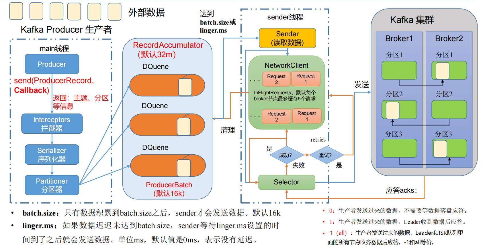
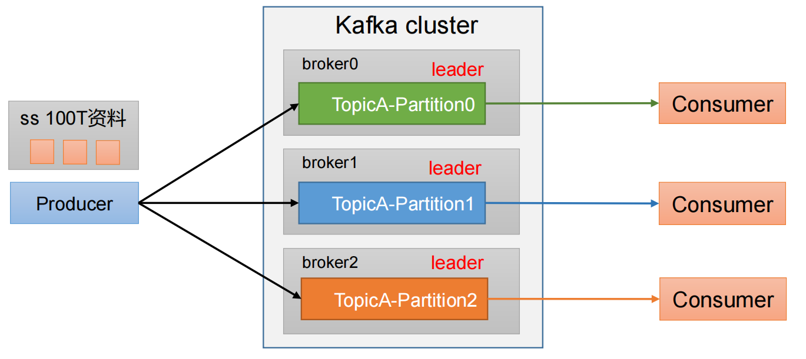

# Kafka Producer

## 一、生产者发送消息的流程

### 1.1 发送原理

在消息发送的过程中，涉及到了**两个线程——main 线程和 Sender 线程**。在 main 线程中创建了**一个双端队列 RecordAccumulator**。main 线程将消息发送给 RecordAccumulator，Sender 线程不断从 RecordAccumulator 中拉取消息发送到 Kafka Broker。


### 1.2 生产者重要参数列表

| 参数名称                              | 描述                                                         |
| ------------------------------------- | ------------------------------------------------------------ |
| bootstrap.servers                     | 生产者连接集群所需的 broker 地址清单。 例如 hadoop102:9092,hadoop103:9092,hadoop104:9092，可以设置 1 个或者多个，中间用逗号隔开。注意这里并非需要所有的 broker 地址，因为生产者从给定的 broker里查找到其他 broker 信息。 |
| key.serializer 和 value.serializer    | 指定发送消息的 key 和 value 的序列化类型。一定要写全类名。   |
| buffer.memory                         | RecordAccumulator 缓冲区总大小，默认 32m。                   |
| batch.size                            | 缓冲区一批数据最大值，默认 16k。适当增加该值，可以提高吞吐量，但是如果该值设置太大，会导致数据传输延迟增加。 |
| linger.ms                             | 如果数据迟迟未达到 batch.size，sender 等待 linger.time之后就会发送数据。单位 ms，默认值是 0ms，表示没有延迟。生产环境建议该值大小为 5-100ms 之间。 |
| acks                                  | 0：生产者发送过来的数据，不需要等数据落盘应答。1：生产者发送过来的数据，Leader 收到数据后应答。-1（all）：生产者发送过来的数据，Leader+和 isr 队列里面的所有节点收齐数据后应答。默认值是-1，-1 和all 是等价的。 |
| max.in.flight.requests.per.connection | 允许最多没有返回 ack 的次数，默认为 5，开启幂等性要保证该值是 1-5 的数字。 |
| retries                               | 当消息发送出现错误的时候，系统会重发消息。retries 表示重试次数。默认是 int 最大值，2147483647。如果设置了重试，还想保证消息的有序性，需要设置MAX_IN_FLIGHT_REQUESTS_PER_CONNECTION=1否则在重试此失败消息的时候，其他的消息可能发送成功了。 |
| retry.backoff.ms                      | 两次重试之间的时间间隔，默认是 100ms。                       |
| enable.idempotence                    | 是否开启幂等性，默认 true，开启幂等性。                      |
| compression.type                      | 生产者发送的所有数据的压缩方式。默认是 none，也就是不压缩。支持压缩类型：none、gzip、snappy、lz4 和 zstd。 |

## 二、异步发送API

### 2.1 普通异步发送

创建 Kafka 生产者，采用异步的方式发送到 Kafka Broker


#### 2.1.1 代码编写

（1）创建工程 kafka

（2）导入依赖

```xml
<dependencies>
     <dependency>
         <groupId>org.apache.kafka</groupId>
         <artifactId>kafka-clients</artifactId>
         <version>3.0.0</version>
     </dependency>
</dependencies>
```

（3）创建包名：com.xul.kafka.producer

（4）编写不带回调函数的 API 代码

```java
import org.apache.kafka.clients.producer.KafkaProducer;
import org.apache.kafka.clients.producer.ProducerConfig;
import org.apache.kafka.clients.producer.ProducerRecord;

import java.util.Properties;

public class Producer {
    public static void main(String[] args) {
        // 1. 创建 kafka 生产者的配置对象
        Properties properties = new Properties();
        // 2. 给 kafka 配置对象添加配置信息：bootstrap.servers
        properties.put(ProducerConfig.BOOTSTRAP_SERVERS_CONFIG,  "localhost:9092");
        // key,value 序列化（必须）：key.serializer，value.serializer
        properties.put(ProducerConfig.KEY_SERIALIZER_CLASS_CONFIG,
                "org.apache.kafka.common.serialization.StringSerializer");
        properties.put(ProducerConfig.VALUE_SERIALIZER_CLASS_CONFIG,
                "org.apache.kafka.common.serialization.StringSerializer");
        // 3. 创建 kafka 生产者对象
        KafkaProducer<String, String> kafkaProducer = new KafkaProducer<>(properties);
        // 4. 调用 send 方法,发送消息
        for (int i = 0; i < 5; i++) {
            kafkaProducer.send(new ProducerRecord<>("first","xul " + i));
        }
        // 5. 关闭资源
        kafkaProducer.close();
    }
}
```

测试：


### 2.2 带回调函数的异步发送

回调函数会在 producer 收到 ack 时调用，为异步调用，该方法有两个参数，分别是元数据信息（RecordMetadata）和异常信息（Exception），如果 Exception 为 null，说明消息发送成功，如果 Exception 不为 null，说明消息发送失败。




注意：消息发送失败会自动重试，不需要我们在回调函数中手动重试。

```java
import org.apache.kafka.clients.producer.*;
import org.apache.kafka.common.serialization.StringSerializer;

import java.util.Properties;

public class ProducerCallback {
    public static void main(String[] args) throws InterruptedException {
        // 1. 创建 kafka 生产者的配置对象
        Properties properties = new Properties();
        // 2. 给 kafka 配置对象添加配置信息
        properties.put(ProducerConfig.BOOTSTRAP_SERVERS_CONFIG, "localhost:9092");
        // key,value 序列化（必须）：key.serializer，value.serializer
        properties.put(ProducerConfig.KEY_SERIALIZER_CLASS_CONFIG,
                StringSerializer.class.getName());

        properties.put(ProducerConfig.VALUE_SERIALIZER_CLASS_CONFIG,
                StringSerializer.class.getName());
        // 3. 创建 kafka 生产者对象
        KafkaProducer<String, String> kafkaProducer = new
                KafkaProducer<String, String>(properties);
        // 4. 调用 send 方法,发送消息
        for (int i = 0; i < 5; i++) {
            // 添加回调
            // 该方法在 Producer 收到 ack 时调用，为异步调用
            kafkaProducer.send(
                    new ProducerRecord<>("first", "xuliang " + i),
                    (metadata, exception) -> {
                        if (exception == null) {
                            // 没有异常,输出信息到控制台
                            System.out.println(" 主题： " +
                                    metadata.topic() + "->" + "分区：" + metadata.partition());
                        } else {
                            // 出现异常打印
                            exception.printStackTrace();
                        }
                    });
            // 延迟一会会看到数据发往不同分区
            Thread.sleep(2);
        }
        // 5. 关闭资源
        kafkaProducer.close();
    }
}
```

测试：


## 三、同步发送 API


只需在异步发送的基础上，再调用一下 get()方法即可。

```java
import org.apache.kafka.clients.producer.KafkaProducer;
import org.apache.kafka.clients.producer.ProducerConfig;
import org.apache.kafka.clients.producer.ProducerRecord;
import org.apache.kafka.common.serialization.StringSerializer;

import java.util.Properties;
import java.util.concurrent.ExecutionException;

public class ProducerSync {
    public static void main(String[] args) throws ExecutionException, InterruptedException {
        // 1. 创建 kafka 生产者的配置对象
        Properties properties = new Properties();
        // 2. 给 kafka 配置对象添加配置信息
        properties.put(ProducerConfig.BOOTSTRAP_SERVERS_CONFIG, "localhost:9092");
        // key,value 序列化（必须）：key.serializer，value.serializer
        properties.put(ProducerConfig.KEY_SERIALIZER_CLASS_CONFIG,
                StringSerializer.class.getName());
        properties.put(ProducerConfig.VALUE_SERIALIZER_CLASS_CONFIG,
                StringSerializer.class.getName());
        // 3. 创建 kafka 生产者对象
        KafkaProducer<String, String> kafkaProducer = new
                KafkaProducer<String, String>(properties);
        // 4. 调用 send 方法,发送消息
        for (int i = 0; i < 10; i++) {
            // 异步发送 默认
            // kafkaProducer.send(new  ProducerRecord<>("first","kafka" + i));
            // 同步发送
            kafkaProducer.send(new ProducerRecord<>("first","kafka" + i)).get();
        }
        // 5. 关闭资源
        kafkaProducer.close();
    }
}
```

## 四、生产者分区

### 4.1 分区好处

1. **便于合理使用存储资源**，每个Partition在一个Broker上存储，可以把海量的数据按照分区切割成一块一块数据存储在多台Broker上。合理控制分区的任务，可以实现负载均衡的效果。

2. **提高并行度**，生产者可以以分区为单位发送数据；消费者可以以分区为单位进行消费数据。



### 4.2 生产者发送消息的分区策略

默认的分区器 DefaultPartitioner。

默认分区策略：

- 如果在记录中使用了分区，则使用它。
- 如果内有指定分区，但是指定了key，则根据key的hash值选择分区。
- 如果都没有指定，则选择粘性分区策略，当batch缓冲区满了之后，在选择下一个分区。

```java
public class DefaultPartitioner implements Partitioner {
    private final StickyPartitionCache stickyPartitionCache = new StickyPartitionCache();
    /**
     * 计算分区
     * @param topic The topic name
     * @param key The key to partition on (or null if no key)
     * @param keyBytes serialized key to partition on (or null if no key)
     * @param value The value to partition on or null
     * @param valueBytes serialized value to partition on or null
     * @param cluster The current cluster metadata
     */
    public int partition(String topic, Object key, byte[] keyBytes, Object value, byte[] valueBytes, Cluster cluster) {
        if (keyBytes == null) {
            return stickyPartitionCache.partition(topic, cluster);
        } 
        List<PartitionInfo> partitions = cluster.partitionsForTopic(topic);
        int numPartitions = partitions.size();
        // hash the keyBytes to choose a partition
        return Utils.toPositive(Utils.murmur2(keyBytes)) % numPartitions;
    }
}
```

下面来看ProducerRecord类的构造方法，总体可以分为三大类：

【1】指明partition的情况下，直接将指明的值作为partition值；例如partition=0，所有数据写入分区0

```java
public ProducerRecord(String topic, Integer partition, Long timestamp, K key, V value, Iterable<Header> headers) {
	......
}

public ProducerRecord(String topic, Integer partition, Long timestamp, K key, V value) {
    this(topic, partition, timestamp, key, value, null);
}

public ProducerRecord(String topic, Integer partition, K key, V value, Iterable<Header> headers) {
    this(topic, partition, null, key, value, headers);
}

public ProducerRecord(String topic, Integer partition, K key, V value) {
    this(topic, partition, null, key, value, null);
}
```

【2】没有指明partition值但有key的情况下，将key的hash值与topic的partition数进行取余得到partition值；例如：keyl的hash值=5，key2的hash值=6，topic的partition数=2，那么key1对应的vaue1写入1号分区，key2对应的value2写入0号分区。

```java
public ProducerRecord(String topic, K key, V value) {
	this(topic, null, null, key, value, null);
}
```

【3】既没有partition值又没有key值的情况下，Kafka采用Sticky Partition(黏性分区器)，会随机选择一个分区，并尽可能一直使用该分区，待该分区的batch已满或者已完成，Kafka再随机一个分区进行使用（和上一次的分区不同）

例如：第一次随机选择0号分区，等0号分区当前批次满了（默认16k)或者linger.ms设置的时间到，Kafka再随机一个分区进行使用（如果还是0会继续随机）
