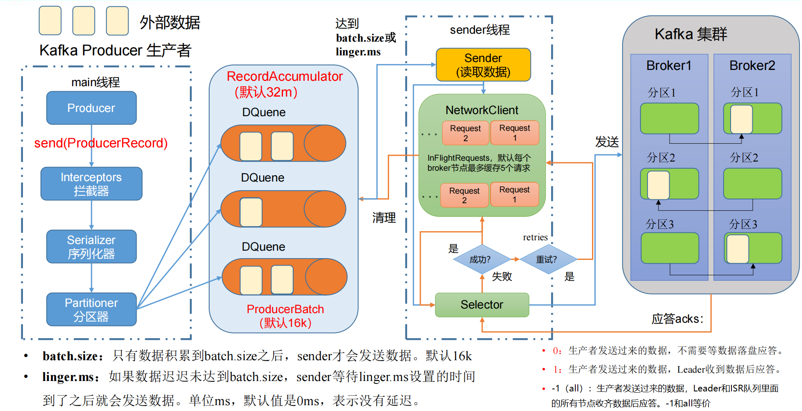

# Kafka Producer

## 生产者发送消息的流程

### 发送原理

在消息发送的过程中，涉及到了**两个线程——main 线程和 Sender 线程**。在 main 线程中创建了**一个双端队列 RecordAccumulator**。main 线程将消息发送给 RecordAccumulator，Sender 线程不断从 RecordAccumulator 中拉取消息发送到 Kafka Broker。

### 生产者重要参数列表

| 参数名称                              | 描述                                                         |
| ------------------------------------- | ------------------------------------------------------------ |
| bootstrap.servers                     | 生产者连接集群所需的 broker 地址清单。 例如 hadoop102:9092,hadoop103:9092,hadoop104:9092，可以设置 1 个或者多个，中间用逗号隔开。注意这里并非需要所有的 broker 地址，因为生产者从给定的 broker里查找到其他 broker 信息。 |
| key.serializer 和 value.serializer    | 指定发送消息的 key 和 value 的序列化类型。一定要写全类名。   |
| buffer.memory                         | RecordAccumulator 缓冲区总大小，默认 32m。                   |
| batch.size                            | 缓冲区一批数据最大值，默认 16k。适当增加该值，可以提高吞吐量，但是如果该值设置太大，会导致数据传输延迟增加。 |
| linger.ms                             | 如果数据迟迟未达到 batch.size，sender 等待 linger.time之后就会发送数据。单位 ms，默认值是 0ms，表示没有延迟。生产环境建议该值大小为 5-100ms 之间。 |
| acks                                  | 0：生产者发送过来的数据，不需要等数据落盘应答。1：生产者发送过来的数据，Leader 收到数据后应答。-1（all）：生产者发送过来的数据，Leader+和 isr 队列里面的所有节点收齐数据后应答。默认值是-1，-1 和all 是等价的。 |
| max.in.flight.requests.per.connection | 允许最多没有返回 ack 的次数，默认为 5，开启幂等性要保证该值是 1-5 的数字。 |
| retries                               | 当消息发送出现错误的时候，系统会重发消息。retries 表示重试次数。默认是 int 最大值，2147483647。如果设置了重试，还想保证消息的有序性，需要设置MAX_IN_FLIGHT_REQUESTS_PER_CONNECTION=1否则在重试此失败消息的时候，其他的消息可能发送成功了。 |
| retry.backoff.ms                      | 两次重试之间的时间间隔，默认是 100ms。                       |
| enable.idempotence                    | 是否开启幂等性，默认 true，开启幂等性。                      |
| compression.type                      | 生产者发送的所有数据的压缩方式。默认是 none，也就是不压缩。支持压缩类型：none、gzip、snappy、lz4 和 zstd。 |

## 异步发送API

普通异步发送