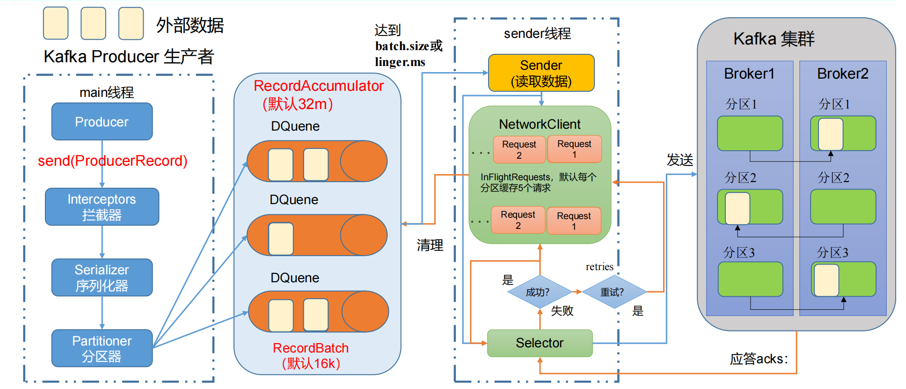
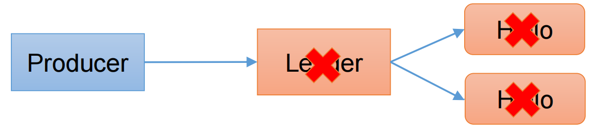
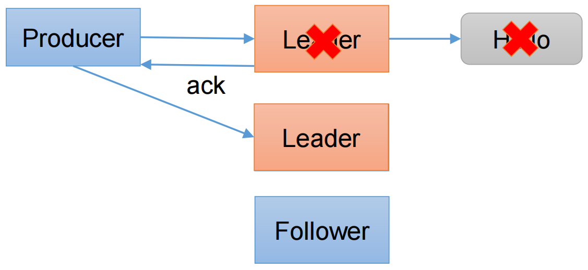
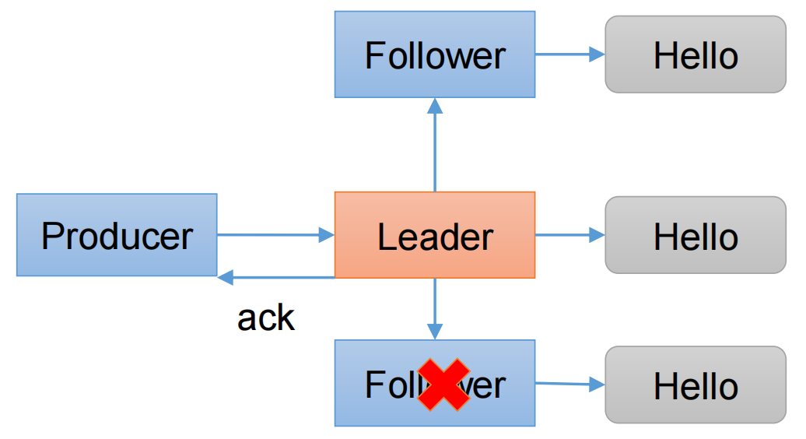
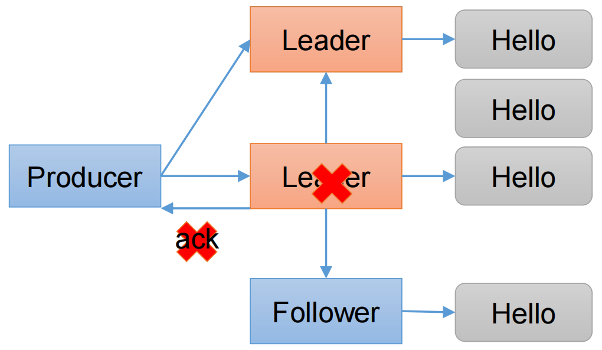
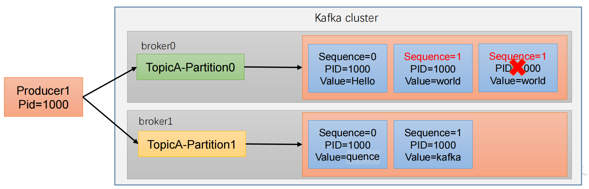
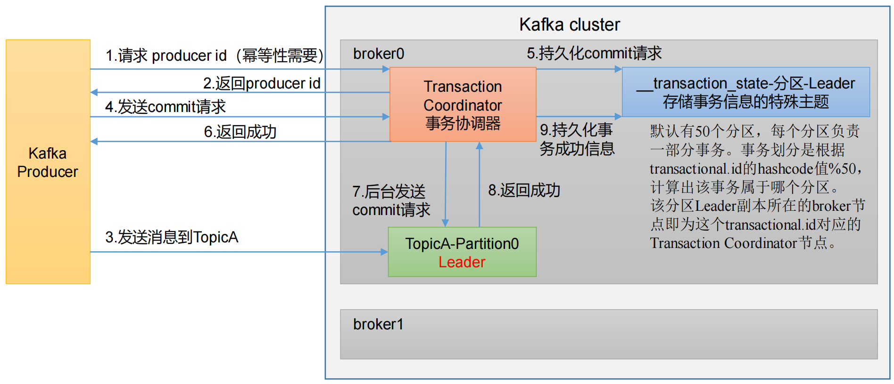
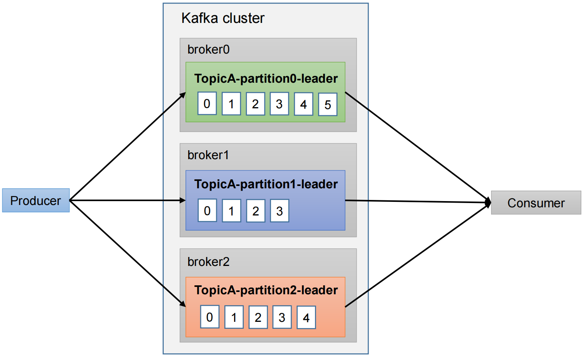
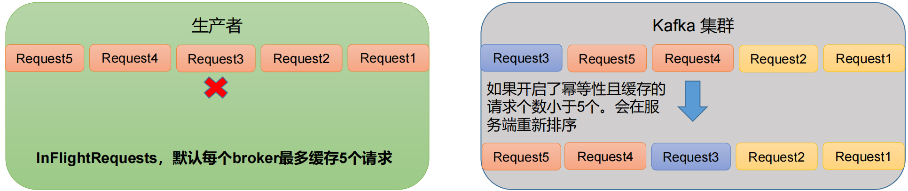

# Kafka Producer

## 一、生产者发送消息的流程

### 1.1 发送原理

在消息发送的过程中，涉及到了**两个线程——main 线程和 Sender 线程**。在 main 线程中创建了**一个双端队列 RecordAccumulator**。main 线程将消息发送给 RecordAccumulator，Sender 线程不断从 RecordAccumulator 中拉取消息发送到 Kafka Broker。


### 1.2 生产者重要参数列表

| 参数名称                              | 描述                                                         |
| ------------------------------------- | ------------------------------------------------------------ |
| bootstrap.servers                     | 生产者连接集群所需的 broker 地址清单。 例如 hadoop102:9092,hadoop103:9092,hadoop104:9092，可以设置 1 个或者多个，中间用逗号隔开。注意这里并非需要所有的 broker 地址，因为生产者从给定的 broker里查找到其他 broker 信息。 |
| key.serializer 和 value.serializer    | 指定发送消息的 key 和 value 的序列化类型。一定要写全类名。   |
| buffer.memory                         | RecordAccumulator 缓冲区总大小，默认 32m。                   |
| batch.size                            | 缓冲区一批数据最大值，默认 16k。适当增加该值，可以提高吞吐量，但是如果该值设置太大，会导致数据传输延迟增加。 |
| linger.ms                             | 如果数据迟迟未达到 batch.size，sender 等待 linger.time之后就会发送数据。单位 ms，默认值是 0ms，表示没有延迟。生产环境建议该值大小为 5-100ms 之间。 |
| acks                                  | 0：生产者发送过来的数据，不需要等数据落盘应答。1：生产者发送过来的数据，Leader 收到数据后应答。-1（all）：生产者发送过来的数据，Leader+和 isr 队列里面的所有节点收齐数据后应答。默认值是-1，-1 和all 是等价的。 |
| max.in.flight.requests.per.connection | 允许最多没有返回 ack 的次数，默认为 5，开启幂等性要保证该值是 1-5 的数字。 |
| retries                               | 当消息发送出现错误的时候，系统会重发消息。retries 表示重试次数。默认是 int 最大值，2147483647。如果设置了重试，还想保证消息的有序性，需要设置MAX_IN_FLIGHT_REQUESTS_PER_CONNECTION=1否则在重试此失败消息的时候，其他的消息可能发送成功了。 |
| retry.backoff.ms                      | 两次重试之间的时间间隔，默认是 100ms。                       |
| enable.idempotence                    | 是否开启幂等性，默认 true，开启幂等性。                      |
| compression.type                      | 生产者发送的所有数据的压缩方式。默认是 none，也就是不压缩。支持压缩类型：none、gzip、snappy、lz4 和 zstd。 |

## 二、异步发送API

### 2.1 普通异步发送

创建 Kafka 生产者，采用异步的方式发送到 Kafka Broker


#### 2.1.1 代码编写

（1）创建工程 kafka

（2）导入依赖

```xml
<dependencies>
     <dependency>
         <groupId>org.apache.kafka</groupId>
         <artifactId>kafka-clients</artifactId>
         <version>3.0.0</version>
     </dependency>
</dependencies>
```

（3）创建包名：com.xul.kafka.producer

（4）编写不带回调函数的 API 代码

```java
import org.apache.kafka.clients.producer.KafkaProducer;
import org.apache.kafka.clients.producer.ProducerConfig;
import org.apache.kafka.clients.producer.ProducerRecord;

import java.util.Properties;

public class Producer {
    public static void main(String[] args) {
        // 1. 创建 kafka 生产者的配置对象
        Properties properties = new Properties();
        // 2. 给 kafka 配置对象添加配置信息：bootstrap.servers
        properties.put(ProducerConfig.BOOTSTRAP_SERVERS_CONFIG,  "localhost:9092");
        // key,value 序列化（必须）：key.serializer，value.serializer
        properties.put(ProducerConfig.KEY_SERIALIZER_CLASS_CONFIG,
                "org.apache.kafka.common.serialization.StringSerializer");
        properties.put(ProducerConfig.VALUE_SERIALIZER_CLASS_CONFIG,
                "org.apache.kafka.common.serialization.StringSerializer");
        // 3. 创建 kafka 生产者对象
        KafkaProducer<String, String> kafkaProducer = new KafkaProducer<>(properties);
        // 4. 调用 send 方法,发送消息
        for (int i = 0; i < 5; i++) {
            kafkaProducer.send(new ProducerRecord<>("first","xul " + i));
        }
        // 5. 关闭资源
        kafkaProducer.close();
    }
}
```

测试：


### 2.2 带回调函数的异步发送

回调函数会在 producer 收到 ack 时调用，为异步调用，该方法有两个参数，分别是元数据信息（RecordMetadata）和异常信息（Exception），如果 Exception 为 null，说明消息发送成功，如果 Exception 不为 null，说明消息发送失败。


注意：消息发送失败会自动重试，不需要我们在回调函数中手动重试。

```java
import org.apache.kafka.clients.producer.*;
import org.apache.kafka.common.serialization.StringSerializer;

import java.util.Properties;

public class ProducerCallback {
    public static void main(String[] args) throws InterruptedException {
        // 1. 创建 kafka 生产者的配置对象
        Properties properties = new Properties();
        // 2. 给 kafka 配置对象添加配置信息
        properties.put(ProducerConfig.BOOTSTRAP_SERVERS_CONFIG, "localhost:9092");
        // key,value 序列化（必须）：key.serializer，value.serializer
        properties.put(ProducerConfig.KEY_SERIALIZER_CLASS_CONFIG,
                StringSerializer.class.getName());

        properties.put(ProducerConfig.VALUE_SERIALIZER_CLASS_CONFIG,
                StringSerializer.class.getName());
        // 3. 创建 kafka 生产者对象
        KafkaProducer<String, String> kafkaProducer = new
                KafkaProducer<String, String>(properties);
        // 4. 调用 send 方法,发送消息
        for (int i = 0; i < 5; i++) {
            // 添加回调
            // 该方法在 Producer 收到 ack 时调用，为异步调用
            kafkaProducer.send(
                    new ProducerRecord<>("first", "xuliang " + i),
                    (metadata, exception) -> {
                        if (exception == null) {
                            // 没有异常,输出信息到控制台
                            System.out.println(" 主题： " +
                                    metadata.topic() + "->" + "分区：" + metadata.partition());
                        } else {
                            // 出现异常打印
                            exception.printStackTrace();
                        }
                    });
            // 延迟一会会看到数据发往不同分区
            Thread.sleep(2);
        }
        // 5. 关闭资源
        kafkaProducer.close();
    }
}
```

测试：


## 三、同步发送 API


只需在异步发送的基础上，再调用一下 get()方法即可。

```java
import org.apache.kafka.clients.producer.KafkaProducer;
import org.apache.kafka.clients.producer.ProducerConfig;
import org.apache.kafka.clients.producer.ProducerRecord;
import org.apache.kafka.common.serialization.StringSerializer;

import java.util.Properties;
import java.util.concurrent.ExecutionException;

public class ProducerSync {
    public static void main(String[] args) throws ExecutionException, InterruptedException {
        // 1. 创建 kafka 生产者的配置对象
        Properties properties = new Properties();
        // 2. 给 kafka 配置对象添加配置信息
        properties.put(ProducerConfig.BOOTSTRAP_SERVERS_CONFIG, "localhost:9092");
        // key,value 序列化（必须）：key.serializer，value.serializer
        properties.put(ProducerConfig.KEY_SERIALIZER_CLASS_CONFIG,
                StringSerializer.class.getName());
        properties.put(ProducerConfig.VALUE_SERIALIZER_CLASS_CONFIG,
                StringSerializer.class.getName());
        // 3. 创建 kafka 生产者对象
        KafkaProducer<String, String> kafkaProducer = new
                KafkaProducer<String, String>(properties);
        // 4. 调用 send 方法,发送消息
        for (int i = 0; i < 10; i++) {
            // 异步发送 默认
            // kafkaProducer.send(new  ProducerRecord<>("first","kafka" + i));
            // 同步发送
            kafkaProducer.send(new ProducerRecord<>("first","kafka" + i)).get();
        }
        // 5. 关闭资源
        kafkaProducer.close();
    }
}
```

## 四、生产者分区

### 4.1 分区好处

1. **便于合理使用存储资源**，每个Partition在一个Broker上存储，可以把海量的数据按照分区切割成一块一块数据存储在多台Broker上。合理控制分区的任务，可以实现负载均衡的效果。

2. **提高并行度**，生产者可以以分区为单位发送数据；消费者可以以分区为单位进行消费数据。


### 4.2 生产者发送消息的分区策略

默认的分区器 DefaultPartitioner。

默认分区策略：

- 如果在记录中使用了分区，则使用它。
- 如果内有指定分区，但是指定了key，则根据key的hash值选择分区。
- 如果都没有指定，则选择粘性分区策略，当batch缓冲区满了之后，在选择下一个分区。

```java
public class DefaultPartitioner implements Partitioner {
    private final StickyPartitionCache stickyPartitionCache = new StickyPartitionCache();
    /**
     * 计算分区
     * @param topic The topic name
     * @param key The key to partition on (or null if no key)
     * @param keyBytes serialized key to partition on (or null if no key)
     * @param value The value to partition on or null
     * @param valueBytes serialized value to partition on or null
     * @param cluster The current cluster metadata
     */
    public int partition(String topic, Object key, byte[] keyBytes, Object value, byte[] valueBytes, Cluster cluster) {
        if (keyBytes == null) {
            return stickyPartitionCache.partition(topic, cluster);
        } 
        List<PartitionInfo> partitions = cluster.partitionsForTopic(topic);
        int numPartitions = partitions.size();
        // hash the keyBytes to choose a partition
        return Utils.toPositive(Utils.murmur2(keyBytes)) % numPartitions;
    }
}
```

下面来看ProducerRecord类的构造方法，总体可以分为三大类：

【1】指明partition的情况下，直接将指明的值作为partition值；例如partition=0，所有数据写入分区0

```java
public ProducerRecord(String topic, Integer partition, Long timestamp, K key, V value, Iterable<Header> headers) {
	......
}

public ProducerRecord(String topic, Integer partition, Long timestamp, K key, V value) {
    this(topic, partition, timestamp, key, value, null);
}

public ProducerRecord(String topic, Integer partition, K key, V value, Iterable<Header> headers) {
    this(topic, partition, null, key, value, headers);
}

public ProducerRecord(String topic, Integer partition, K key, V value) {
    this(topic, partition, null, key, value, null);
}
```

【2】没有指明partition值但有key的情况下，将key的hash值与topic的partition数进行取余得到partition值；例如：keyl的hash值=5，key2的hash值=6，topic的partition数=2，那么key1对应的vaue1写入1号分区，key2对应的value2写入0号分区。

```java
public ProducerRecord(String topic, K key, V value) {
	this(topic, null, null, key, value, null);
}
```

【3】既没有partition值又没有key值的情况下，Kafka采用Sticky Partition(黏性分区器)，会随机选择一个分区，并尽可能一直使用该分区，待该分区的batch已满或者已完成，Kafka再随机一个分区进行使用（和上一次的分区不同）

例如：第一次随机选择0号分区，等0号分区当前批次满了（默认16k)或者linger.ms设置的时间到，Kafka再随机一个分区进行使用（如果还是0会继续随机）


### 4.3 自定义分区器

#### 4.3.1 实现一个分区器

实现一个分区器只需要实现Partitioner接口并重写partition()方法即可

```java
import org.apache.kafka.clients.producer.Partitioner;
import org.apache.kafka.common.Cluster;
import java.util.Map;
/**
 * 1. 实现接口 Partitioner
 * 2. 实现 3 个方法:partition,close,configure
 * 3. 编写 partition 方法,返回分区号
 */
public class MyPartitioner implements Partitioner {
     /**
     * 返回信息对应的分区
     * @param topic 主题
     * @param key 消息的 key
     * @param keyBytes 消息的 key 序列化后的字节数组
     * @param value 消息的 value
     * @param valueBytes 消息的 value 序列化后的字节数组
     * @param cluster 集群元数据可以查看分区信息
     * @return
     */
     @Override
     public int partition(String topic, Object key, byte[] keyBytes, Object value, byte[] valueBytes, Cluster cluster) {
        // 获取消息
        String msgValue = value.toString();
        // 创建 partition
        int partition;
        // 判断消息是否包含 key
        if (msgValue.contains("key")){
         	partition = 0;
        }else {
            partition = 1;
     	}
        // 返回分区号
        return partition;
    }
    
     // 关闭资源
    @Override
    public void close() {
    }
    
     // 配置方法
     @Override
     public void configure(Map<String, ?> configs) {
     }
}
```

#### 4.3.2 使用分区器

在生产者的配置中添加分区器参数。

```java
import org.apache.kafka.clients.producer.*;
import java.util.Properties;

public class CustomProducerCallbackPartitions {
    public static void main(String[] args) throws InterruptedException {
        Properties properties = new Properties();
        properties.put(ProducerConfig.BOOTSTRAP_SERVERS_CONFIG,"localhost:9092");
        properties.put(ProducerConfig.KEY_SERIALIZER_CLASS_CONFIG, StringSerializer.class.getName());
        properties.put(ProducerConfig.VALUE_SERIALIZER_CLASS_CONFIG, StringSerializer.class.getName());
        // 添加自定义分区器
        properties.put(ProducerConfig.PARTITIONER_CLASS_CONFIG,"com.xul.kafka.producer.MyPartitioner");
        KafkaProducer<String, String> kafkaProducer = new KafkaProducer<>(properties);
        for (int i = 0; i < 5; i++) {
            kafkaProducer.send(new ProducerRecord<>("first", "key " + i),
                    new Callback() {
                        @Override
                        public void onCompletion(RecordMetadata metadata, Exception e) {

                            if (e == null){
                                System.out.println(" 主题： " + metadata.topic() + "->" + "分区：" + metadata.partition());
                            }else {
                                e.printStackTrace();
                            }
                        }

                    });
        }
        kafkaProducer.close();    
    }
}    
```


## 五、提高生产者的吞吐量

相关的配置属性：

- batch.size: 批次大小，默认为16K
- linger.ms: 等待时间，修改为5-100ms
- compression.type: 压缩snappy
- RecordAccumulator： 缓冲区大小，修改为64M（当分区多了，这里可以相应的调大）

```java
import org.apache.kafka.clients.producer.*;
import java.util.Properties;

public class Test {
    public static void main(String[] args) {
         // 1. 创建 kafka 生产者的配置对象
        Properties properties = new Properties();
        // 2. 给 kafka 配置对象添加配置信息：bootstrap.servers
        properties.put(ProducerConfig.BOOTSTRAP_SERVERS_CONFIG, "localhost:9092");
        // key,value 序列化（必须）：key.serializer，value.serializer
        properties.put(ProducerConfig.KEY_SERIALIZER_CLASS_CONFIG, 
                       "org.apache.kafka.common.serialization.StringSerializer");
        properties.put(ProducerConfig.VALUE_SERIALIZER_CLASS_CONFIG, 
                       "org.apache.kafka.common.serialization.StringSerializer");
        // batch.size：批次大小，默认 16K
        properties.put(ProducerConfig.BATCH_SIZE_CONFIG, 16384);
        // linger.ms：等待时间，默认 0
        properties.put(ProducerConfig.LINGER_MS_CONFIG, 1);
        // RecordAccumulator：缓冲区大小，默认 32M：buffer.memory
        properties.put(ProducerConfig.BUFFER_MEMORY_CONFIG,33554432);
        // compression.type：压缩，默认 none，可配置值 gzip、snappy、lz4 和 zstd
        properties.put(ProducerConfig.COMPRESSION_TYPE_CONFIG,"snappy");
        // 3. 创建 kafka 生产者对象
        KafkaProducer<String, String> kafkaProducer = new KafkaProducer<>(properties);
        // 4. 调用 send 方法,发送消息
        for (int i = 0; i < 5; i++) {
            kafkaProducer.send(new ProducerRecord<>("first","atguigu " + i));
        }
        // 5. 关闭资源
        kafkaProducer.close();
    }
}
```


## 六、数据的可靠性

在数据发送流程中，当数据发送到kafka集群后，服务端后响应客户端的发送请求。



### 6.1 ACKS的响应机制

【1】**0：生产者发送过来的数据，不需要等数据落盘应答。** 



在该模式下，数据存在丢失风险

【2】**1：生产者发送过来的数据，LeaderL收到数据后应答。**



 Leader应答完成后，还没有开始同步数据，就down了。新的leader不会收到producer发送的hello信息，因为生产者已经收到了数据发送成功的信息，不会再次发送。该条信息将会丢失。

【3】**-1(all)：生产者发送过来的数据，Leader和ISR队列里面的所有节点收齐数据后应答。-1和all等价。** 



【4】**ISR队列**

Leader维护了一个动态的in-sync replica set（ISR），意为和Leader保持同步的Follower+Leader集合（leader：0，isr：0，l，2)。

如果Follower长时间未向Leader发送通信请求或同步数据，则该Follower将被踢出ISR队列。该时间阈值由**replica.lag.time.max.ms**参数设定，默认30s。例如2超时，(leader：0，isr：0,1)。这样就不用等长期联系不上或者已经故障的节点。


**数据可靠性分析：**

如果分区副本设置为1个，或者ISR里应答的最小副本数量（min.insync.replicas默认为1）设置为1，和ack=1的效果是一样的，仍然有丢数的风险（leader：0，isr：0）

> 数据完全可靠条件 = ACK级别设置为-1 + 分区副本大于等于2 + ISR里应答的最小副本数量大于等于2


**可靠性总结：**

- acks=0，生产者发送过来数据就不管了，可靠性差，效率高；

- acks=1，生产者发送过来数据Leader应答，可靠性中等，效率中等；

- acks=-1，生产者发送过来数据Leader和ISR队列里面所有Follwer应答，可靠性高，效率低；

  

在生产环境中，acks=0很少使用；acks=1，一般用于传输普通日志，允许丢个别数据；acks=-1，一般用于传输和钱相关的数据，对可靠性要求比较高的场景。

**数据重复性分析：**



生产者发送过来的数据，Leader和ISR队列里面的所有节点收齐数据后应答。但是，当Leader和ISR都同步完数据后，leader服务down了，producer没有收到ack应答后，会进行重试，这时就会导致数据重复。


代码配置：

```java
import org.apache.kafka.clients.producer.*;
import org.apache.kafka.common.serialization.StringSerializer;

import java.util.Properties;

public class CustomProducerAck {
    public static void main(String[] args) {
        // 1. 创建 kafka 生产者的配置对象
        Properties properties = new Properties();
        // 2. 给 kafka 配置对象添加配置信息：bootstrap.servers
        properties.put(ProducerConfig.BOOTSTRAP_SERVERS_CONFIG, "localhost:9092");
        // key,value 序列化（必须）：key.serializer，value.serializer
        properties.put(ProducerConfig.KEY_SERIALIZER_CLASS_CONFIG, StringSerializer.class.getName());
        properties.put(ProducerConfig.VALUE_SERIALIZER_CLASS_CONFIG, StringSerializer.class.getName());
        // 设置 acks
        properties.put(ProducerConfig.ACKS_CONFIG, "all");
        // 重试次数 retries，默认是 int 最大值，2147483647
        properties.put(ProducerConfig.RETRIES_CONFIG, 3);
        // 3. 创建 kafka 生产者对象
        KafkaProducer<String, String> kafkaProducer = new KafkaProducer<>(properties);
        // 4. 调用 send 方法,发送消息
        for (int i = 0; i < 5; i++) {
            kafkaProducer.send(new ProducerRecord<>("first","atguigu " + i));
        }
        // 5. 关闭资源
        kafkaProducer.close();
    }
}
```


## 七、数据去重

### 7.1 数据传递语义

- 至少一次（At Least Once）= ACK级别设置为-1 + 分区副本大于等于2 + ISR里应答的最小副本数量大于等于2
- 最多一次（At Most Once）= ACK级别设置为0
-  总结：
  - At Least Once 可以保证数据不丢失，但是不能保证数据不重复；
  - At Most Once 可以保证数据不重复，但是不能保证数据不丢失。
- **精确一次（Exactly Once）：** 对于一些非常重要的信息，比如和钱相关的数据，要求数据既不能重复也不丢失。


Kafka 0.11版本以后，引入了一项重大特性：幂等性和事务。


### 7.2 幂等性

#### 7.2.1 幂等性原理

幂等性就是指Producer不论向Broker发送多少次重复数据，Broker端都只会持久化一条，保证了不重复。

精确一次（Exactly Once） =  幂等性 + 至少一次（ ack=-1 + 分区副本数>=2 + ISR最小副本数量>=2） 。

重复数据的判断标准：具有<PID, Partition, SeqNumber>相同主键的消息提交时，Broker只会持久化一条。其中PID是Kafka每次重启都会分配一个新的；Partition 表示分区号；Sequence Number是单调自增的。 

所以**幂等性只能保证的是在单分区单会话内不重复。**



#### 7.2.2 如何开启幂等性？

将参数`enable.idempotence `设为true， 该参数默认为true，即默认开启幂等。


### 7.3 Kafka事务

#### 7.3.1 Kafka事务原理

前提： 开启事物，必须要开启幂等性。



Producer在使用事务功能前，必须先自定义一个唯一的transactional..id。有了transactional..id,即使客户端挂掉了，它重启后也能继续处理未完成的事务


#### 7.3.2 事务API及其使用

kafka事务API：

```java
// 1 初始化事务
void initTransactions();
// 2 开启事务
void beginTransaction() throws ProducerFencedException;
// 3 在事务内提交已经消费的偏移量（主要用于消费者）
void sendOffsetsToTransaction(Map<TopicPartition, OffsetAndMetadata> offsets,
                              String consumerGroupId) throws ProducerFencedException;
// 4 提交事务
void commitTransaction() throws ProducerFencedException;
// 5 放弃事务（类似于回滚事务的操作）
void abortTransaction() throws ProducerFencedException;
```


在Producer中使用事务来保证消息生产的可靠性

```java
import org.apache.kafka.clients.producer.*;
import org.apache.kafka.common.serialization.StringSerializer;
import java.util.Properties;

public class CustomProducerTransactions {
    public static void main(String[] args) {
        // 1. 创建 kafka 生产者的配置对象
        Properties properties = new Properties();
        // 2. 给 kafka 配置对象添加配置信息
        properties.put(ProducerConfig.BOOTSTRAP_SERVERS_CONFIG,"hadoop102:9092");
        // key,value 序列化
        properties.put(ProducerConfig.KEY_SERIALIZER_CLASS_CONFIG, StringSerializer.class.getName());
        properties.put(ProducerConfig.VALUE_SERIALIZER_CLASS_CONFIG, StringSerializer.class.getName());
        // 设置事务 id（必须），事务 id 任意起名
        properties.put(ProducerConfig.TRANSACTIONAL_ID_CONFIG, "transaction_id_0");
        // 3. 创建 kafka 生产者对象
        KafkaProducer<String, String> kafkaProducer = new KafkaProducer<>(properties);
        // 初始化事务
        kafkaProducer.initTransactions();
        // 开启事务
        kafkaProducer.beginTransaction();
        try {
            // 4. 调用 send 方法,发送消息
            for (int i = 0; i < 5; i++) {
                // 发送消息
                kafkaProducer.send(new ProducerRecord<>("first", "atguigu " + i));
            }
            // int i = 1 / 0;
            // 提交事务
            kafkaProducer.commitTransaction();
        } catch (Exception e) {
            // 终止事务
            kafkaProducer.abortTransaction();
        } finally {
            // 5. 关闭资源
            kafkaProducer.close();
        }
    }
}
```


## 八、数据顺序

### 8.1 数据的有序性



- 单分区内，有序；
- 多分区，分区与分区间无序；


### 8.2 数据的无序性

- kafka在1.x版本之前保证数据单分区有序，条件如下：
  - **max.in.flight.requests.per.connection**=1（不需要考虑是否开启幂等性）。

- kafka在1.x及以后版本保证数据单分区有序，条件如下：（

  - 开启幂等性，**max.in.flight.requests.per.connection** 需要设置小于等于5

  - 未开启幂等性，**max.in.flight.requests.per.connection** 需要设置为1

原因说明：因为在kafka1.x以后，启用幂等后，kafka服务端会缓存producer发来的最近5个request的元数据，故无论如何，都可以保证最近5个request的数据都是有序的。




