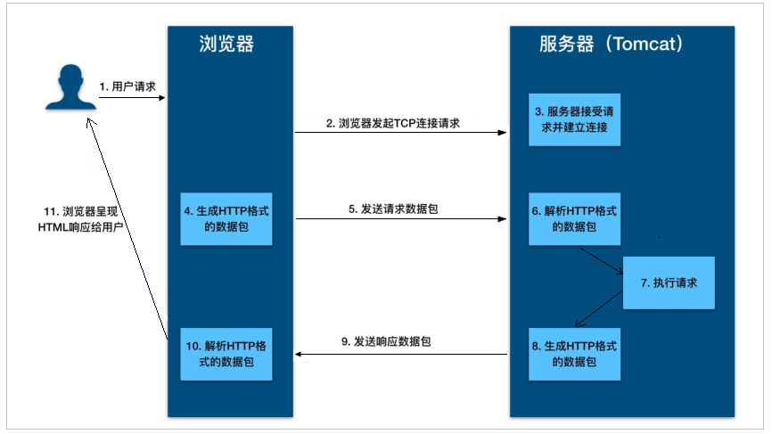
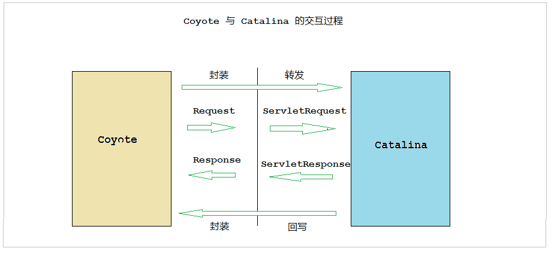
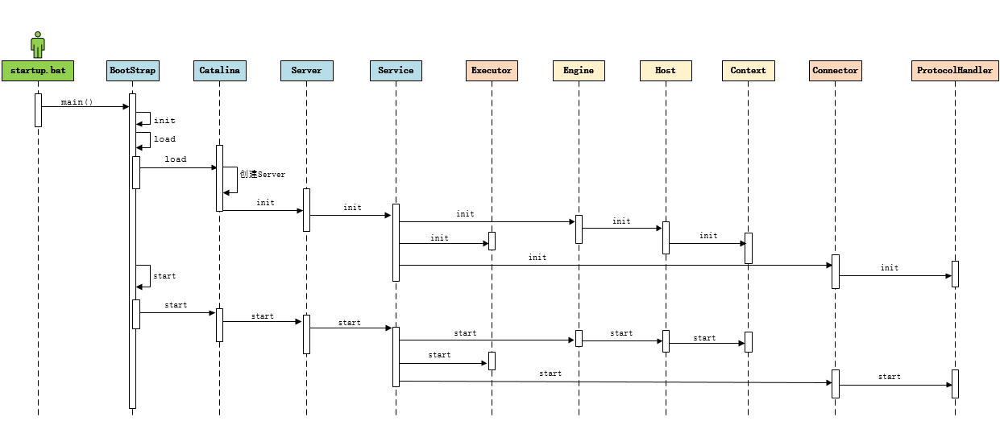
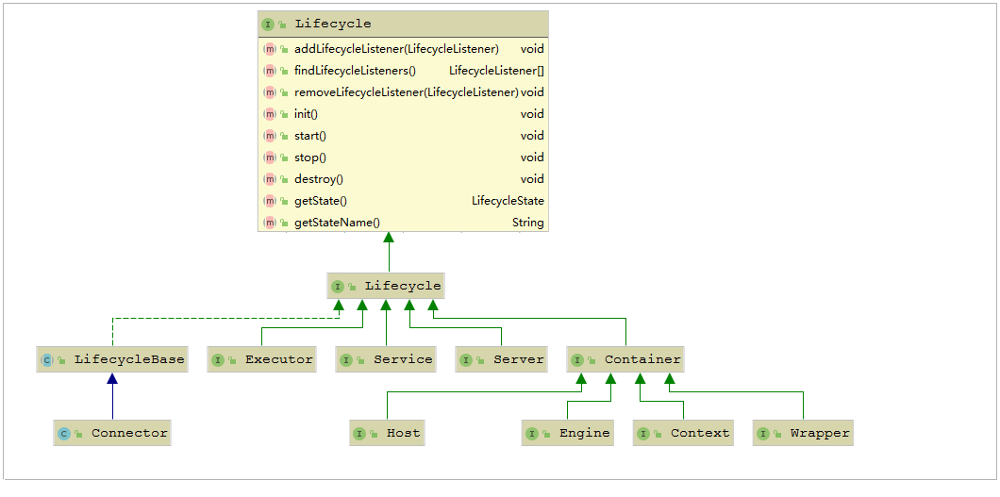
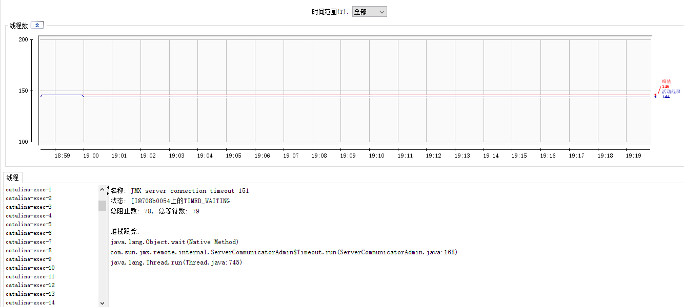

# Tomcat专题

## Tomcat基础

### web概念

- 软件架构 

  - C/S： 客户端/服务器端 ‐‐‐‐‐‐‐‐‐‐‐‐> QQ , 360 .... 

  - B/S： 浏览器/服务器端 ‐‐‐‐‐‐‐‐‐‐‐‐> 京东， 网易 ， 淘宝 ， 传智播客 官网

- 资源分类 

  - 静态资源： 所有用户访问后，得到的结果都是一样的，称为静态资源。静态资 源可以直接被浏览器解析。 
    	* 如： html,css,JavaScript，jpg 

  - 动态资源: 每个用户访问相同资源后，得到的结果可能不一样 , 称为动态资 源。动态资源被访问后，需要先转换为静态资源，再返回给浏览器，通过浏览器进行解析。 
    - 如：servlet/jsp,php,asp.... 

- 网络通信三要素 
  - IP：电子设备(计算机)在网络中的唯一标识。 
  - 端口：应用程序在计算机中的唯一标识。 0~65536 
  - 传输协议：规定了数据传输的规则 
    - 基础协议： 
      - tcp : 安全协议，三次握手。 速度稍慢 
      - udp：不安全协议。 速度快

### 常见的web服务器

webLogic

webSphere

JBoss

Tomcat


### Tomcat历史


### Tomcat安装


### Tomcat目录结构

Tomcat 的主要目录文件如下 ：

| 目录        | 目录下文件                 | 说明                                                         |
| ----------- | -------------------------- | ------------------------------------------------------------ |
| **bin**     | /                          | 存放Tomcat的启动、停止等批处理脚本文件                       |
|             | startup.bat , startup.sh   | 用于在windows和linux下的启动脚本                             |
|             | shutdown.bat , shutdown.sh | 用于在windows和linux下的停止脚本                             |
| **conf**    | /                          | 用于存放Tomcat的相关配置文件                                 |
|             | Catalina                   | 用于存储针对每个虚拟机的Context配置                          |
|             | context.xml                | 用于定义所有web应用均需加载的Context配置，如果web应用指定了自己的context.xml，该文件将被覆盖 |
|             | catalina.properties        | Tomcat 的环境变量配置                                        |
|             | catalina.policy            | Tomcat 运行的安全策略配置                                    |
|             | logging.properties         | Tomcat 的日志配置文件， 可以通过该文件修改Tomcat 的日志级别及日志路径等 |
|             | server.xml                 | Tomcat 服务器的核心配置文件                                  |
|             | tomcat-users.xml           | 定义Tomcat默认的用户及角色映射信息配置                       |
|             | web.xml                    | Tomcat 中所有应用默认的部署描述文件， 主要定义了基础Servlet和MIME映射。 |
| **lib**     | /                          | Tomcat 服务器的依赖包                                        |
| **logs**    | /                          | Tomcat 默认的日志存放目录                                    |
| **webapps** | /                          | Tomcat 默认的Web应用部署目录                                 |
| **work**    | /                          | Web 应用JSP代码生成和编译的临时目录                          |

### Tomcat 启动停止

启动：

```shell
bin/startup.bat
```

停止：

```shell
bin/shutdown.bat
```

访问：

```
http://localhost:8080
```


## Tomcat架构

### HTTP工作原理

HTTP协议是浏览器与服务器之间的数据传送协议。作为应用层协议，HTTP是基于TCP/IP 协议来传递数据的（HTML文件、图片、查询结果等），HTTP协议不涉及数据包 （Packet）传输，主要规定了客户端和服务器之间的通信格式。 



从图上你可以看到，这个过程是：

1. 用户通过浏览器进行了一个操作，比如输入网址并回车，或者是点击链接，接着浏览 器获取了这个事件。 
2. 浏览器向服务端发出TCP连接请求。 
3. 服务程序接受浏览器的连接请求，并经过TCP三次握手建立连接。 
4. 浏览器将请求数据打包成一个HTTP协议格式的数据包。 
5. 浏览器将该数据包推入网络，数据包经过网络传输，最终达到端服务程序。 
6. 服务端程序拿到这个数据包后，同样以HTTP协议格式解包，获取到客户端的意图。 
7. 得知客户端意图后进行处理，比如提供静态文件或者调用服务端程序获得动态结果。 

8. 服务器将响应结果（可能是HTML或者图片等）按照HTTP协议格式打包。 
9. 服务器将响应数据包推入网络，数据包经过网络传输最终达到到浏览器。 

10. 浏览器拿到数据包后，以HTTP协议的格式解包，然后解析数据，假设这里的数据是HTML。 

11. 浏览器将HTML文件展示在页面上。 

那我们想要探究的Tomcat作为一个HTTP服务器，在这个过程中都做了些什么事情呢？主 要是接受连接、解析请求数据、处理请求和发送响应这几个步骤。 

### Tomcat整体架构 

#### Http服务器请求处理

浏览器发给服务端的是一个HTTP格式的请求，HTTP服务器收到这个请求后，需要调用服务端程序来处理，所谓的服务端程序就是你写的Java类，一般来说不同的请求需要由不同 的Java类来处理。


图1 ， 表示HTTP服务器直接调用具体业务类，它们是紧耦合的。

图2，HTTP服务器不直接调用业务类，而是把请求交给容器来处理，容器通过Servlet接口调用业务类。因此Servlet接口和Servlet容器的出现，达到了HTTP服务器与业务类解耦的目的。而Servlet接口和Servlet容器这一整套规范叫作Servlet规范。 

Tomcat按照Servlet规范的要求实现了Servlet容器，同时它们也具有HTTP服务器的功能。作为Java程序员，如果我们要实现新的业务功能，只需要实现一个Servlet，并把它注册到Tomcat（Servlet容器）中，剩下的事情就由Tomcat帮我们处理了。 

#### Servlet容器工作流程 

为了解耦，HTTP服务器不直接调用Servlet，而是把请求交给Servlet容器来处理，那 Servlet容器又是怎么工作的呢？ 

当客户请求某个资源时，HTTP服务器会用一个ServletRequest对象把客户的请求信息封装起来，然后调用Servlet容器的service方法，Servlet容器拿到请求后，根据请求的URL和Servlet的映射关系，找到相应的Servlet，如果Servlet还没有被加载，就用反射机制创建这个Servlet，并调用Servlet的init方法来完成初始化，接着调用Servlet的service方法来处理请求，把ServletResponse对象返回给HTTP服务器，HTTP服务器会把响应发送给 客户端。


#### Tomcat整体架构 

我们知道如果要设计一个系统，首先是要了解需求，我们已经了解了Tomcat要实现两个 核心功能： 

- 处理Socket连接，负责网络字节流与Request和Response对象的转化。 

- 加载和管理Servlet，以及具体处理Request请求。 

因此Tomcat设计了两个核心组件连接器（Connector）和容器（Container）来分别做这两件事情。连接器负责对外交流，容器负责内部处理。


### 连接器 - Coyote

#### 架构介绍 

Coyote 是Tomcat的连接器框架的名称 , 是Tomcat服务器提供的供客户端访问的外部接 口。客户端通过Coyote与服务器建立连接、发送请求并接受响应 。 

Coyote 封装了底层的网络通信（Socket 请求及响应处理），为Catalina 容器提供了统一 的接口，使Catalina 容器与具体的请求协议及IO操作方式完全解耦。Coyote 将Socket 输入转换封装为 Request 对象，交由Catalina 容器进行处理，处理请求完成后, Catalina 通 过Coyote 提供的Response 对象将结果写入输出流 。 

Coyote 作为独立的模块，只负责具体协议和IO的相关操作， 与Servlet 规范实现没有直接关系，因此即便是 Request 和 Response 对象也并未实现Servlet规范对应的接口， 而是在Catalina 中将他们进一步封装为ServletRequest 和 ServletResponse 。 



 

#### IO模型与协议

在Coyote中 ， Tomcat支持的多种I/O模型和应用层协议，具体包含哪些IO模型和应用层协议，请看下表： 

Tomcat 支持的IO模型（自8.5/9.0 版本起，Tomcat 移除了 对 BIO 的支持）：

| **IO**模型 | 描述                                                         |
| ---------- | ------------------------------------------------------------ |
| NIO        | 非阻塞I/O，采用Java NIO类库实现。                            |
| NIO2       | 异步I/O，采用JDK 7最新的NIO2类库实现。                       |
| APR        | 采用Apache可移植运行库实现，是C/C++编写的本地库。如果选择该方案，需要单独安装APR库。 |

Tomcat 支持的应用层协议 ：

| 应用层协议 | 描述                                                         |
| ---------- | ------------------------------------------------------------ |
| HTTP/1.1   | 这是大部分Web应用采用的访问协议。                            |
| AJP        | 用于和Web服务器集成（如Apache），以实现对静态资源的优化以及集群部署，当前支持AJP/1.3。 |
| HTTP/2     | HTTP 2.0大幅度的提升了Web性能。下一代HTTP协议 ， 自8.5以及9.0 版本之后支持。 |

协议分层 ：


在 8.0 之前 ， Tomcat 默认采用的I/O方式为 BIO ， 之后改为 NIO。 无论 NIO、NIO2 还是 APR， 在性能方面均优于以往的BIO。 如果采用APR， 甚至可以达到 Apache HTTP Server 的影响性能。

Tomcat为了实现支持多种I/O模型和应用层协议，一个容器可能对接多个连接器，就好比 一个房间有多个门。但是单独的连接器或者容器都不能对外提供服务，需要把它们组装 起来才能工作，组装后这个整体叫作Service组件。这里请你注意，Service本身没有做什 么重要的事情，只是在连接器和容器外面多包了一层，把它们组装在一起。Tomcat内可 能有多个Service，这样的设计也是出于灵活性的考虑。通过在Tomcat中配置多个 Service，可以实现通过不同的端口号来访问同一台机器上部署的不同应用。 

 

#### 连接器组件 


连接器中的各个组件的作用如下：

**EndPoint** 

1） EndPoint ： Coyote 通信端点，即通信监听的接口，是具体Socket接收和发送处理 器，是对传输层的抽象，因此EndPoint用来实现TCP/IP协议的。 

2） Tomcat 并没有EndPoint 接口，而是提供了一个抽象类AbstractEndpoint ， 里面定 义了两个内部类：Acceptor和SocketProcessor。Acceptor用于监听Socket连接请求。 SocketProcessor用于处理接收到的Socket请求，它实现Runnable接口，在Run方法里调用协议处理组件Processor进行处理。为了提高处理能力，SocketProcessor被提交到线程池来执行。而这个线程池叫作执行器（Executor)，我在后面的专栏会详细介绍Tomcat如何扩展原生的Java线程池。 

**Processor** 

Processor ： Coyote 协议处理接口 ，如果说EndPoint是用来实现TCP/IP协议的，那么 Processor用来实现HTTP协议，Processor接收来自EndPoint的Socket，读取字节流解析成Tomcat Request和Response对象，并通过Adapter将其提交到容器处理，Processor是对应用层协议的抽象。 

**ProtocolHandler**

ProtocolHandler： Coyote 协议接口， 通过Endpoint 和 Processor ， 实现针对具体协议的处理能力。Tomcat 按照协议和I/O 提供了6个实现类 ： AjpNioProtocol ， AjpAprProtocol， AjpNio2Protocol ，Http11NioProtocol ，Http11Nio2Protocol ，Http11AprProtocol。我们在配置tomcat/conf/server.xml 时 ， 至少要指定具体的 ProtocolHandler , 当然也可以指定协议名称 ， 如 ： HTTP/1.1 ，如果安装了APR，那么将使用Http11AprProtocol ， 否则使用 Http11NioProtocol 。 

**Adapter** 

由于协议不同，客户端发过来的请求信息也不尽相同，Tomcat定义了自己的Request类 来“存放”这些请求信息。ProtocolHandler接口负责解析请求并生成Tomcat Request类。但是这个Request对象不是标准的ServletRequest，也就意味着，不能用Tomcat Request作为参数来调用容器。Tomcat设计者的解决方案是引入CoyoteAdapter，这是适配器模式的经典运用，连接器调用CoyoteAdapter的Sevice方法，传入的是TomcatRequest对象，CoyoteAdapter负责将Tomcat Request转成ServletRequest，再调用容器的Service方法。 


### 容器 - Catalina

Tomcat是一个由一系列可配置的组件构成的Web容器，而Catalina是Tomcat的servlet容 器。

Catalina 是Servlet 容器实现，包含了之前讲到的所有的容器组件，以及后续章节涉及到的安全、会话、集群、管理等Servlet 容器架构的各个方面。它通过松耦合的方式集成Coyote，以完成按照请求协议进行数据读写。同时，它还包括我们的启动入口、Shell程 序等。 

#### Catalina 地位 

Tomcat 的模块分层结构图， 如下：


Tomcat 本质上就是一款 Servlet 容器， 因此Catalina 才是 Tomcat 的核心 ， 其他模块都是为Catalina 提供支撑的。 比如 ： 通过Coyote 模块提供链接通信，Jasper 模块提供JSP引擎，Naming 提供JNDI 服务，Juli 提供日志服务。 

#### Catalina 结构 

Catalina 的主要组件结构如下：


如上图所示，Catalina负责管理Server，而Server表示着整个服务器。Server下面有多个服务Service，每个服务都包含着多个连接器组件Connector（Coyote 实现）和一个容器组件Container。在Tomcat 启动的时候， 会初始化一个Catalina的实例。 

Catalina 各个组件的职责：

| 组件      | 职责                                                         |
| --------- | ------------------------------------------------------------ |
| Catalina  | 负责解析Tomcat的配置文件 , 以此来创建服务器Server组件，并根据命令来对其进行管理 |
| Server    | 服务器表示整个Catalina Servlet容器以及其它组件，负责组装并启动Servlet引擎,Tomcat连接器。Server通过实现Lifecycle接口，提供了 一种优雅的启动和关闭整个系统的方式 |
| Service   | 服务是Server内部的组件，一个Server包含多个Service。它将若干个Connector组件绑定到一个Container（Engine）上 |
| Connector | 连接器，处理与客户端的通信，它负责接收客户请求，然后转给相关的容器处理，最后向客户返回响应结果 |
| Container | 容器，负责处理用户的servlet请求，并返回对象给web用户的模块   |


#### Container 结构 

Tomcat设计了4种容器，分别是Engine、Host、Context和Wrapper。这4种容器不是平行关系，而是父子关系。， Tomcat通过一种分层的架构，使得Servlet容器具有很好的灵活性。 


各个组件的含义 ：

| 容器    | 描述                                                         |
| ------- | ------------------------------------------------------------ |
| Engine  | 表示整个Catalina的Servlet引擎，用来管理多个虚拟站点，一个Service 最多只能有一个Engine，但是一个引擎可包含多个Host |
| Host    | 代表一个虚拟主机，或者说一个站点，可以给Tomcat配置多个虚拟主机地址，而一个虚拟主机下可包含多个Context |
| Context | 表示一个Web应用程序， 一个Web应用可包含多个Wrapper           |
| Wrapper | 表示一个Servlet，Wrapper 作为容器中的最底层，不能包含子容器  |

我们也可以再通过Tomcat的server.xml配置文件来加深对Tomcat容器的理解。Tomcat 采用了组件化的设计，它的构成组件都是可配置的，其中最外层的是Server，其他组件按照一定的格式要求配置在这个顶层容器中。


那么，Tomcat是怎么管理这些容器的呢？你会发现这些容器具有父子关系，形成一个树形结构，你可能马上就想到了设计模式中的组合模式。没错，Tomcat就是用组合模式来管理这些容器的。具体实现方法是，所有容器组件都实现了Container接口，因此组合模式可以使得用户对单容器对象和组合容器对象的使用具有一致性。这里单容器对象指的  是最底层的Wrapper，组合容器对象指的是上面的Context、Host或者Engine。


Container 接口中提供了以下方法（截图中知识一部分方法） ：


在上面的接口看到了getParent、setParent、addChild和removeChild等方法。

Container接口扩展了LifeCycle接口，LifeCycle接口用来统一管理各组件的生命周期，后面我也用专门的篇幅去详细介绍。


### Tomcat 启动流程

#### 流程



步骤 : 

1. 启动tomcat ， 需要调用 bin/startup.bat (在linux 目录下 , 需要调用 bin/startup.sh)， 在startup.bat 脚本中, 调用了catalina.bat。 

2. 在catalina.bat 脚本文件中，调用了BootStrap 中的main方法。 

3. 在BootStrap 的main 方法中调用了 init 方法 ， 来创建Catalina 及初始化类加载器。 

4. 在BootStrap 的main 方法中调用了 load 方法 ， 在其中又调用了Catalina的load方法。

5. 在Catalina 的load 方法中 , 需要进行一些初始化的工作, 并需要构造Digester 对象, 用于解析 XML。 

6. 然后在调用后续组件的初始化操作 。。 


加载Tomcat的配置文件，初始化容器组件，监听对应的端口号，准备接受客户端请求 。

#### 源码解析 

##### Lifecycle 

由于所有的组件均存在初始化、启动、停止等生命周期方法，拥有生命周期管理的特性， 所以Tomcat在设计的时候， 基于生命周期管理抽象成了一个接口 Lifecycle ，而组件 Server、Service、Container、Executor、Connector 组件 ， 都实现了一个生命周期的接口，从而具有了以下生命周期中的核心方法：

- init（）：初始化组件 

- start（）：启动组件 

- stop（）：停止组件 

- destroy（）：销毁组件




##### 各组件的默认实现 

上面我们提到的Server、Service、Engine、Host、Context都是接口， 下图中罗列了这些接口的默认实现类。当前对于 Endpoint组件来说，在Tomcat中没有对应的Endpoint 接口， 但是有一个抽象类 AbstractEndpoint ，其下有三个实现类： NioEndpoint、Nio2Endpoint、AprEndpoint ， 这三个实现类，分别对应于前面讲解链接器 Coyote时， 提到的链接器支持的三种IO模型：NIO，NIO2，APR ， Tomcat8.5版本中，默认采用的是 NioEndpoint。


ProtocolHandler ： Coyote协议接口，通过封装Endpoint和Processor ， 实现针对具体协议的处理功能。Tomcat按照协议和IO提供了6个实现类。

AJP协议：

- AjpNioProtocol ：采用NIO的IO模型。

- AjpNio2Protocol：采用NIO2的IO模型。

- AjpAprProtocol ：采用APR的IO模型，需要依赖于APR库。

HTTP协议：

- Http11NioProtocol ：采用NIO的IO模型，默认使用的协议（如果服务器没有安装APR）。

- Http11Nio2Protocol：采用NIO2的IO模型。

- Http11AprProtocol ：采用APR的IO模型，需要依赖于APR库。


##### 源码入口

目录： org.apache.catalina.startup 

MainClass：BootStrap ‐‐‐‐> main(String[] args) 


##### 总结 

从启动流程图中以及源码中，我们可以看出Tomcat的启动过程非常标准化， 统一按照生命周期管理接口Lifecycle的定义进行启动。首先调用init() 方法进行组件的逐级初始化操 作，然后再调用start()方法进行启动。 

每一级的组件除了完成自身的处理外，还要负责调用子组件响应的生命周期管理方法，组件与组件之间是松耦合的，因为我们可以很容易的通过配置文件进行修改和替换。


### Tomcat 请求处理流程

#### 请求流程

设计了这么多层次的容器，Tomcat是怎么确定每一个请求应该由哪个Wrapper容器里的Servlet来处理的呢？答案是，Tomcat是用Mapper组件来完成这个任务的。

Mapper组件的功能就是将用户请求的URL定位到一个Servlet，它的工作原理是： Mapper组件里保存了Web应用的配置信息，其实就是容器组件与访问路径的映射关系， 比如Host容器里配置的域名、Context容器里的Web应用路径，以及Wrapper容器里Servlet映射的路径，你可以想象这些配置信息就是一个多层次的Map。

当一个请求到来时，Mapper组件通过解析请求URL里的域名和路径，再到自己保存的Map里去查找，就能定位到一个Servlet。请你注意，一个请求URL最后只会定位到一个Wrapper容器，也就是一个Servlet。 

下面的示意图中 ， 就描述了当用户请求链接 http://www.itcast.cn/bbs/findAll 之后, 是如何找到最终处理业务逻辑的servlet 。 


那上面这幅图只是描述了根据请求的URL如何查找到需要执行的Servlet ， 那么下面我们 再来解析一下 ， 从Tomcat的设计架构层面来分析Tomcat的请求处理。


步骤如下:

1. Connector组件Endpoint中的Acceptor监听客户端套接字连接并接收Socket。

2. 将连接交给线程池Executor处理，开始执行请求响应任务。

3. Processor组件读取消息报文，解析请求行、请求体、请求头，封装成Request对象。

4. Mapper组件根据请求行的URL值和请求头的Host值匹配由哪个Host容器、Context容器、Wrapper容器处理请求。

5. CoyoteAdaptor组件负责将Connector组件和Engine容器关联起来，把生成的Request对象和响应对象Response传递到Engine容器中，调用 Pipeline。

6. Engine容器的管道开始处理，管道中包含若干个Valve、每个Valve负责部分处理逻  辑。执行完Valve后会执行基础的 Valve--StandardEngineValve，负责调用Host容器的Pipeline。

7. Host容器的管道开始处理，流程类似，最后执行 Context容器的Pipeline。

8. Context容器的管道开始处理，流程类似，最后执行 Wrapper容器的Pipeline。

9. Wrapper容器的管道开始处理，流程类似，最后执行 Wrapper容器对应的Servlet对象的 处理方法。


#### 请求流程源码解析


在前面所讲解的Tomcat的整体架构中，我们发现Tomcat中的各个组件各司其职，组件  之间松耦合，确保了整体架构的可伸缩性和可拓展性，那么在组件内部，如何增强组件 的灵活性和拓展性呢？ 在Tomcat中，每个Container组件采用责任链模式来完成具体的请求处理。

在Tomcat中定义了Pipeline 和 Valve 两个接口，Pipeline 用于构建责任链， 后者代表责任链上的每个处理器。Pipeline 中维护了一个基础的Valve，它始终位于Pipeline的末端

（最后执行），封装了具体的请求处理和输出响应的过程。当然，我们也可以调用addValve()方法， 为Pipeline 添加其他的Valve， 后添加的Valve 位于基础的Valve之前，并按照添加顺序执行。Pipiline通过获得首个Valve来启动整合链条的执行 。

## Jasper

### 简介

对于基于JSP 的web应用来说，我们可以直接在JSP页面中编写 Java代码，添加第三方的标签库，以及使用EL表达式。但是无论经过何种形式的处理，最终输出到客户端的都是标准的HTML页面（包含js ，css...），并不包含任何的java相关的语法。 也就是说， 我们可以把jsp看做是一种运行在服务端的脚本。 那么服务器是如何将 JSP页面转换为HTML页面的呢？ 

Jasper模块是Tomcat的JSP核心引擎，我们知道JSP本质上是一个Servlet。Tomcat使用Jasper对JSP语法进行解析，生成Servlet并生成Class字节码，用户在进行访问jsp时，会访问Servlet，最终将访问的结果直接响应在浏览器端 。另外，在运行的时候，Jasper还会检测JSP文件是否修改，如果修改，则会重新编译JSP文件。


TODO


## Tomcat 服务器配置

Tomcat 服务器的配置主要集中于 tomcat/conf 下的 catalina.policy、catalina.properties、context.xml、server.xml、tomcat-users.xml、web.xml 文件。

### server.xml 

server.xml 是tomcat 服务器的核心配置文件，包含了Tomcat的 Servlet 容器 Catalina）的所有配置。由于配置的属性特别多，我们在这里主要讲解其中的一部分重要配置。 

 

#### Server 

Server是server.xml的根元素，用于创建一个Server实例，默认使用的实现类是 org.apache.catalina.core.StandardServer。

```xml
<Server port="8005" shutdown="SHUTDOWN"> 
    ... 
</Server>
```

- port : Tomcat 监听的关闭服务器的端口。 

- shutdown： 关闭服务器的指令字符串。

Server内嵌的子元素为 Listener、GlobalNamingResources、Service。默认配置的5个Listener 的含义： 

```xml
<!‐‐ 用于以日志形式输出服务器 、操作系统、JVM的版本信息 ‐‐> 
<Listener className="org.apache.catalina.startup.VersionLoggerListener" />

<!‐‐ 用于加载（服务器启动）和 销毁 （服务器停止）APR。 如果找不到APR库，则会输出日志，并不影响Tomcat启动 ‐‐> <Listener className="org.apache.catalina.core.AprLifecycleListener" SSLEngine="on" /> 

<!‐‐ 用于避免JRE内存泄漏问题 ‐‐> 
<Listener className="org.apache.catalina.core.JreMemoryLeakPreventionListener" /> 

<!‐‐ 用户加载（服务器启动） 和 销毁（服务器停止） 全局命名服务 ‐‐> 
<Listener className="org.apache.catalina.mbeans.GlobalResourcesLifecycleListener" />

<!‐‐ 用于在Context停止时重建Executor 池中的线程， 以避免ThreadLocal 相关的内 存泄漏 ‐‐> 
<Listener className="org.apache.catalina.core.ThreadLocalLeakPreventionListener" />
```

GlobalNamingResources 中定义了全局命名服务：

```xml
<!‐‐ Global JNDI resources Documentation at /docs/jndi‐resources‐howto.html ‐‐> 
<GlobalNamingResources> 
	<!‐‐ Editable user database that can also be used by UserDatabaseRealm to authenticate users ‐‐>
    <Resource name="UserDatabase" auth="Container" 
    		type="org.apache.catalina.UserDatabase" 
    		description="User database that can be updated and saved"
            factory="org.apache.catalina.users.MemoryUserDatabaseFactory" 
            pathname="conf/tomcat‐users.xml" /> 
</GlobalNamingResources>
```


#### Service 

该元素用于创建 Service 实例，默认使用 org.apache.catalina.core.StandardService。默认情况下，Tomcat 仅指定了Service 的名称， 值为 "Catalina"。Service 可以内嵌的元素为 ： Listener、Executor、Connector、Engine，其中 ： Listener 用于为Service添加生命周期监听器， Executor 用于配置Service 共享线程池，Connector 用于配置Service 包含的链接器， Engine 用于配置Service中链接器对应的Servlet 容器引擎。

```xml
<Service name="Catalina"> 
    ... 
</Service>
```

一个Server服务器，可以包含多个Service服务。

#### Executor 

默认情况下，Service 并未添加共享线程池配置。 如果我们想添加一个线程池， 可以在`<Service>`下添加如下配置：

```xml
<Executor name="tomcatThreadPool" 
          namePrefix="catalina‐exec‐" 
          maxThreads="200" 
          minSpareThreads="100" 
          maxIdleTime="60000" 
          maxQueueSize="Integer.MAX_VALUE" 
          prestartminSpareThreads="false" 
          threadPriority="5" 
          className="org.apache.catalina.core.StandardThreadExecutor"/>
```


属性说明： 

| 属性                    | 含义                                                         |
| ----------------------- | ------------------------------------------------------------ |
| name                    | 线程池名称，用于 Connector中指定。                           |
| namePrefix              | 所创建的每个线程的名称前缀，一个单独的线程名称为namePrefix+threadNumber。 |
| maxThreads              | 池中最大线程数。                                             |
| minSpareThreads         | 活跃线程数，也就是核心池线程数，这些线程不会被销毁，会一直存在。 |
| maxIdleTime             | 线程空闲时间，超过该时间后，空闲线程会被销毁，默认值为6000（1分钟），单位毫秒。 |
| maxQueueSize            | 在被执行前最大线程排队数目，默认为Int的最大值，也就是广义的无限。除非特殊情况，这个值不需要更改， 否则会有请求不会被处理的情况发生。 |
| prestartminSpareThreads | 启动线程池时是否启动 minSpareThreads部分线程。默认值为false，即不启动。 |
| threadPriority          | 线程池中线程优先级，默认值为5，值从1到10。                   |
| className               | 线程池实现类，未指定情况下，默认实现类为org.apache.catalina.core.StandardThreadExecutor。如果想使用自定义线程池首先需要实现org.apache.catalina.Executor接口。 |



如果不配置共享线程池，那么Catalina 各组件在用到线程池时会独立创建。 


#### Connector 

Connector 用于创建链接器实例。默认情况下，server.xml 配置了两个链接器，一个支持HTTP协议，一个支持AJP协议。因此大多数情况下，我们并不需要新增链接器配置，只是根据需要对已有链接器进行优化。 

```xml
<Connector port="8080" protocol="HTTP/1.1" connectionTimeout="20000" redirectPort="8443" /> 

<Connector port="8009" protocol="AJP/1.3" redirectPort="8443" />
```

属性说明： 

- port： 端口号，Connector 用于创建服务端Socket 并进行监听， 以等待客户端请求 链接。如果该属性设置为0，Tomcat将会随机选择一个可用的端口号给当前Connector 使用。 

- protocol ： 当前Connector 支持的访问协议。 默认为 HTTP/1.1 ， 并采用自动切换机制选择一个基于 JAVA NIO 的链接器或者基于本地APR的链接器（根据本地是否含有Tomcat的本地库判定）。 

  如果不希望采用上述自动切换的机制， 而是明确指定协议， 可以使用以下值。 

  Http协议： 

  ```
  org.apache.coyote.http11.Http11NioProtocol ， 非阻塞式 Java NIO 链接器 
  org.apache.coyote.http11.Http11Nio2Protocol ， 非阻塞式 JAVA NIO2 链接器 
  org.apache.coyote.http11.Http11AprProtocol ， APR 链接器 
  ```

  AJP协议 ： 

  ```
  org.apache.coyote.ajp.AjpNioProtocol ， 非阻塞式 Java NIO 链接器 
  org.apache.coyote.ajp.AjpNio2Protocol ，非阻塞式 JAVA NIO2 链接器 
  org.apache.coyote.ajp.AjpAprProtocol ， APR 链接器 
  ```

- connectionTimeOut : Connector 接收链接后的等待超时时间， 单位为 毫秒。 -1 表 示不超时。 

- redirectPort：当前Connector 不支持SSL请求， 接收到了一个请求， 并且也符合security-constraint 约束， 需要SSL传输，Catalina自动将请求重定向到指定的端口。 

- executor ： 指定共享线程池的名称， 也可以通过maxThreads、minSpareThreads等属性配置内部线程池。 

- URIEncoding : 用于指定编码URI的字符编码， Tomcat8.x版本默认的编码为 UTF-8 , Tomcat7.x版本默认为ISO-8859-1。 

完整的配置如下： 

```xml
<Connector port="8080" 
		   protocol="HTTP/1.1" 
           executor="tomcatThreadPool" 
           maxThreads="1000" 
           minSpareThreads="100" 
           acceptCount="1000" 
           maxConnections="1000" 
           connectionTimeout="20000" 
           compression="on" 
           compressionMinSize="2048" 
           disableUploadTimeout="true" 
           redirectPort="8443" 
           URIEncoding="UTF‐8" />
```

#### Engine

Engine 作为Servlet 引擎的顶级元素，内部可以嵌入： Cluster、Listener、Realm、Valve和Host。

```xml
<Engine name="Catalina" defaultHost="localhost"> 
    ... 
</Engine>
```

属性说明： 

- name： 用于指定Engine 的名称， 默认为Catalina 。该名称会影响一部分Tomcat的存储路径（如临时文件）。 

- defaultHost ： 默认使用的虚拟主机名称， 当客户端请求指向的主机无效时， 将交由默认的虚拟主机处理， 默认为localhost。 


#### Host 

Host 元素用于配置一个虚拟主机， 它支持以下嵌入元素：Alias、Cluster、Listener、Valve、Realm、Context。如果在Engine下配置Realm， 那么此配置将在当前Engine下的所有Host中共享。 同样，如果在Host中配置Realm ， 则在当前Host下的所有Context中共享。Context中的Realm优先级 > Host 的Realm优先级 > Engine中的Realm优先级。

```xml
<Host name="localhost" appBase="webapps" unpackWARs="true" autoDeploy="true"> 
	... 
</Host>
```

属性说明： 

- name: 当前Host通用的网络名称， 必须与DNS服务器上的注册信息一致。 Engine中包含的Host必须存在一个名称与Engine的defaultHost设置一致。 

- appBase： 当前Host的应用基础目录， 当前Host上部署的Web应用均在该目录下（可以是绝对目录，相对路径）。默认为webapps。 

- unpackWARs： 设置为true， Host在启动时会将appBase目录下war包解压为目录。设置为false， Host将直接从war文件启动。 

- autoDeploy： 控制tomcat是否在运行时定期检测并自动部署新增或变更的web应 用。

通过给Host添加别名，我们可以实现同一个Host拥有多个网络名称，配置如下：

```xml
<Host name="www.web1.com" appBase="webapps" unpackWARs="true" autoDeploy="true"> 
    <Alias>www.web2.com</Alias> 
</Host>
```

这个时候，我们就可以通过两个域名访问当前Host下的应用（需要确保DNS或hosts中添加了域名的映射配置）。


#### Context 

Context 用于配置一个Web应用，默认的配置如下： 

```xml
<Context docBase="myApp" path="/myApp"> 
    .... 
</Context>
```

属性描述： 

- docBase：Web应用目录或者War包的部署路径。可以是绝对路径，也可以是相对于 Host appBase的相对路径。 

- path：Web应用的Context 路径。如果我们Host名为localhost， 则该web应用访问的根路径为： http://localhost:8080/myApp。 

它支持的内嵌元素为：CookieProcessor， Loader， Manager，Realm，Resources，WatchedResource，JarScanner，Valve。

```xml
<Host name="www.tomcat.com" appBase="webapps" unpackWARs="true" autoDeploy="true"> 
    <Context docBase="D:\servlet_project03" path="/myApp"></Context> 
    <Valve className="org.apache.catalina.valves.AccessLogValve" 
           directory="logs" 
           prefix="localhost_access_log" 
           suffix=".txt" 
           pattern="%h %l %u %t &quot;%r&quot; %s %b" /> 
</Host>
```


TODO


1