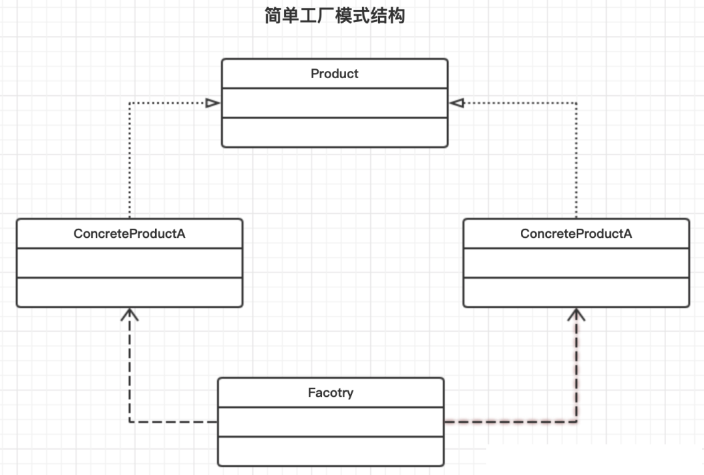
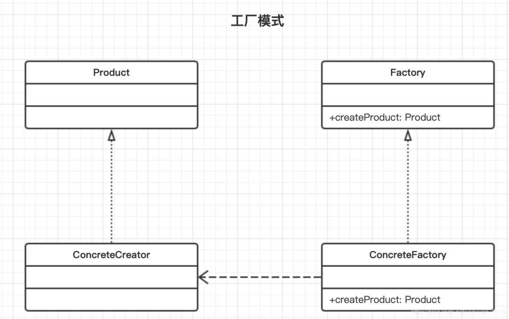

---
# 用来设置该文档是否出现在博客当中, false 不出现
article: true
# 是否置顶，也可以使用number， 来排序
sticky: false
# 是否收藏图片
star: false
# 该文档是否出现在时间线中
timeline: true

category:
  - 设计模式

tag: 
  - 设计模式

date: 2022-12-21
---


# 工厂模式


## 一、简单工厂模式

简单工厂模式又称之为静态工厂方法，属于创建型模式。在简单工厂模式中，可以根据传递的参数不同，返回不同类的实例。简单工厂模式定义了一个类，这个类专门用于创建其他类的实例，这些被创建的类都有一个共同的父类。

### 1.1 模式结构

1. Factory：工厂角色。专门用于创建实例类的工厂，提供一个方法，该方法根据传递的参数不同返回不同类的具体实例。

2. Product：抽象产品角色。为所有产品的父类。

3. ConcreteProduct：具体的产品角色。



### 1.2 代码实现

**1、Product 抽象产品类**

```java
/**
 * @Description Product 抽象产品类
 **/
public interface Phone {

    void make();

    void call();
}
```

**2、Concrete Product 具体产品类**

```java
/**
 * @Description 华为手机
 **/
@Slf4j
public class HuaweiPhone implements Phone {
    @Override
    public void make() {
        log.info("华为手机制作完成");
    }

    @Override
    public void call() {
        log.info("华为手机拨打电话");
    }
}
```


```java
/**
 * @Description 苹果手机工厂
 **/
@Slf4j
public class IPhone implements Phone{
    @Override
    public void make() {
        log.info("制作iPhone手机");
    }

    @Override
    public void call() {
        log.info("iPhone手机拨打电话");
    }
}
```

**3、Factory 工厂角色类**

```java
/**
 * @Description Factory 工厂角色类
 **/
@Slf4j
public class SimpleFactory {

    public Phone createPhone(String brand){
        Phone phone = null;
        switch (brand){
            case "HUAWEI":
                phone = new HuaweiPhone();
                break;
            case "IPHONE":
                phone = new IPhone();
                break;
            default:
                log.error("暂不支持该品牌手机");
                break;
        }
        return phone;
    }
}
```

**4、测试类**

```java
/**
 * @Description 简单工厂模式测试类
 **/
public class Test {

    public static void main(String[] args) {
        SimpleFactory factory = new SimpleFactory();
        Phone huaweiPhone = factory.createPhone("HUAWEI");
        huaweiPhone.make();
        huaweiPhone.call();

        Phone iPhone = factory.createPhone("IPHONE");
        iPhone.make();
        iPhone.call();
    }
}
```


### 1.3 优缺点

**优点**

实现了对责任的分隔，提供了专门工厂类创建对象。

用户无需知道具体产品名。

通过配置文件方式，可以在不修改客户端（消费端）代码情况下变更/增加新产品，在一定程序上提高了系统的灵活性。


**缺点**

由于工厂类集中了所以产品创建逻辑，一旦不能正常工作，整个系统受影响。

使用简单工厂模式将增加系统类的个数，在一定程度上增加了系统的复杂度和理解。

系统扩展困难，一旦添加了新产品就不得不修改工厂逻辑，在产品类型较多时，有可能造成工厂逻辑过于复杂，不利于系统的扩展和维护。


### 1.4 总结

简单工厂模式的要点就在于当你需要什么，只需要知道正确参数，就可以获取你所需要的对象，无需知道其创建细节。

简单工厂模式最大的优点在于实现对象的创建和对象的分离，但是如果产品过多时，会导致工厂代码复杂。


## 二、工厂模式

工厂方法模式定义了一个创建对象的接口，但由子类决定要实例化的类是哪一个。工厂方法模式让实例化推迟到子类。


### 2.1 模式结构

Product ：抽象产品。所有的产品必须实现这个共同的接口，这样一来，使用这些产品的类既可以引用这个接口。

- ConcreteProduct：具体产品。
- Creator：抽象工厂。它实现了所有操纵产品的方法，但不实现工厂方法。Creator所有的子类都必须要实现factoryMethod()方法。
- ConcreteCreator：具体工厂。制造产品的实际工厂。它负责创建一个或者多个具体产品。




### 2.2 模式实现

**Product 抽象产品类**

```java
public interface Phone {
    void call(String receiver);
}
```


**ConcreteProduct 具体产品类**

```java
@Slf4j
public class HuaweiPhone implements Phone {
    @Override
    public void call(String receiver) {
        log.info("华为手机拨打{}电话", receiver);
    }
}
```


```java
@Slf4j
public class IPhone implements Phone {
    @Override
    public void call(String receiver) {
        log.info("iPhone手机拨打{}电话", receiver);
    }
}
```


**Factory 抽象工厂类**

```java
public interface Factory {
    Phone createPhone();
}
```


**ConcreteFactory 具体工厂类**

```java
/**
 * 生产华为手机的工厂
 */
public class HuaweiFactory implements Factory {
    @Override
    public Phone createPhone() {
        return new HuaweiPhone();
    }
}
```


```java
/**
 * 生产IPhone手机的工厂
 */
public class IPhoneFactory implements Factory {
    @Override
    public Phone createPhone() {
        return new IPhone();
    }
}
```


**测试类**

```java
public class Test {

    public static void main(String[] args) {
        Factory huaweiFactory = new HuaweiFactory();
        Phone huaweiPhone = huaweiFactory.createPhone();
        huaweiPhone.call("貂蝉");

        Factory iponeFactory = new IPhoneFactory();
        iponeFactory.createPhone().call("小乔");
    }
}
```


### 2.3 优缺点


**优点**

在工厂方法中，用户只需要知道所要的产品的具体工厂，无须关系具体的创建过程，甚至不需要具体产品类的名称。

在系统增加新产品时，我们只需要增加一个具体的产品类和实现工厂，无需对原工厂进行任何修改，很好的符合了“开闭原则”


**缺点**

每次增加一个产品时，都需要增加一个具体类和对象实现工厂，系统中类的个数会成倍增加，在一定程度上增加了系统的复杂度，同时也增加了系统具体类的依赖


### 2.4 总结

工厂方法模式完全符合“开闭原则”

工厂方法模式使用继承，将对象委托给子类，通过子类实现工厂方法来创建对象

在工厂方法模式中，创建者通常包含依赖于抽象的产品代码，而这些抽象产品是由子类创建的，创建者不需要知道制作哪种具体产品


## 三、抽象工厂模式

抽象工厂模式提供一个接口，用户创建相关或者依赖对象的家族，而不需要明确指定具体类。

抽象工厂允许客户端使用抽象的接口来创建一组相关的产品，而不需要关系实际产出的具体产品是什么，这样一来客户可以从具体的产品关系中解耦。

### 3.1 模式结构

- **AbstractFactory：** 抽象工厂。抽象工厂定义了一个接口，所有的具体工厂都必须实现此接口，这个接口包含了一组方法用来生产产品。

- **ConcreteFactory：** 具体工厂。具体工厂是用于生产不同产品族。要创建一个产品，客户只需要使用其中一个工厂完全不需要实例化任何产品对象。

- **AbstractProduct：** 抽象产品。这是一个产品家族，每一个具体工厂都能够生产一整组产品。

- **Product：** 具体产品。


### 3.2 模式实现

**AbstractProductA 抽象产品类（电脑）**

```java
public interface PC {
    void playGame();
}
```


**ConcreteProductA1 具体产品类（华为电脑）**

```java
@Slf4j
public class HuaweiPC implements PC {
    @Override
    public void playGame() {
      log.info("使用华为电脑玩DOTA");
    }
}
```


**ConcreteProductA2 具体产品类（苹果电脑）**

```java
@Slf4j
public class ApplePC implements PC {
    @Override
    public void playGame() {
      log.info("使用苹果电脑玩国际象棋");
    }
}
```


**AbstractProductB 抽象产品类（手机）**

```java
public interface Phone {
    void call(String receiver);
}
```


**ConcreteProductB1 具体产品类（华为手机）**

```java
@Slf4j
public class HuaweiPhone implements Phone {
    @Override
    public void call(String receiver) {
        log.info("华为手机拨打{}电话", receiver);
    }
}
```


**ConcreteProductB2 具体产品类（苹果手机）**

```java
@Slf4j
public class IPhone implements Phone {
    @Override
    public void call(String receiver) {
        log.info("苹果手机拨打{}电话", receiver);
    }
}
```


**AbstractFactory 抽象工厂类**

```java
public interface AbstractFactory {
    PC makePC();
    Phone makePhone();
}
```


**ConcreteFactory 具体工厂类1(华为工厂)**

```java
public class HuaweiFactory implements AbstractFactory {

    @Override
    public PC makePC() {
        return new HuaweiPC();
    }
    @Override
    public Phone makePhone() {
        return new HuaweiPhone();
    }
}
```


**ConcreteFactory 具体工厂类2 (苹果工厂)**

```java
public class AppleFactory implements AbstractFactory {

    @Override
    public PC makePC() {
        return new ApplePC();
    }

    @Override
    public Phone makePhone() {
        return new IPhone();
    }
}
```


**测试类**

```java
public class Test {

    public static void main(String[] args) {
        AbstractFactory huaweiFactory = new HuaweiFactory();
        PC huaweiPC = huaweiFactory.makePC();
        huaweiPC.playGame();
        Phone huaweiPhone = huaweiFactory.makePhone();
        huaweiPhone.call("西施");

        AbstractFactory appleFactory = new AppleFactory();
        PC applePC = appleFactory.makePC();
        applePC.playGame();
        Phone iphone = appleFactory.makePhone();
        iphone.call("程咬金");
    }
}
```


### 3.3 总结

抽象工厂模式中主要的优点在于具体类的隔离，是的客户端不需要知道什么被创建了。其缺点在于增加新的产品族比较复杂，需要修改接口及其所有子类。

工厂模式和抽象工厂模式主要区别在于产品，产品种类单一，适合工厂模式。抽象工厂模式适合用于创建多个产品种类，多个产品类型。


