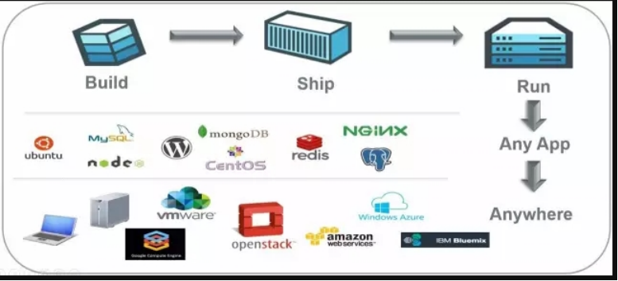
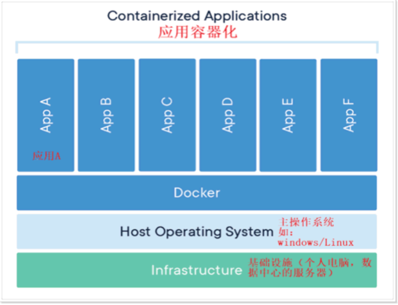
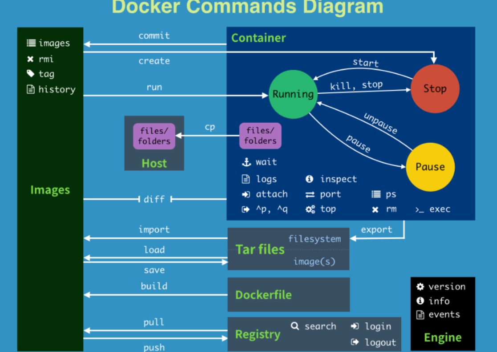
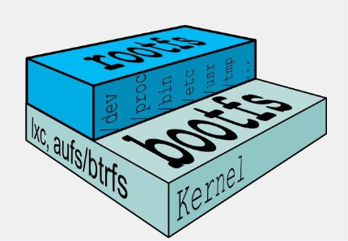
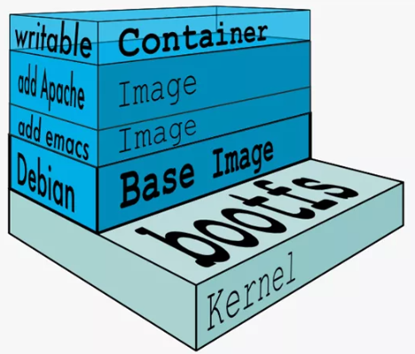

# Docker 详解

## 一、Docker简介

### 1.1 Docker是什么？

Docker是基于Go语言实现的云开源项目。

Docker的主要目标是“Build，Ship and Run Any App,Anywhere”，也就是通过对应用组件的封装、分发、部署、运行等生命周期的管理，使用户的APP（可以是一个WEB应用或数据库应用等等）及其运行环境能够做到“一次镜像，处处运行”。



Linux容器技术的出现就解决了这样一个问题，而 Docker 就是在它的基础上发展过来的。将应用打成镜像，通过镜像成为运行在Docker容器上面的实例，而 Docker容器在任何操作系统上都是一致的，这就实现了跨平台、跨服务器。只需要一次配置好环境，换到别的机子上就可以一键部署好，大大简化了操作。

解决了运行环境和配置问题的软件容器， 方便做持续集成并有助于整体发布的容器虚拟化技术。

### 1.2 容器与虚拟机比较

**【1】传统虚拟机技术**

虚拟机（virtual machine）就是带环境安装的一种解决方案。

它可以在一种操作系统里面运行另一种操作系统，比如在Windows10系统里面运行Linux系统CentOS7。应用程序对此毫无感知，因为虚拟机看上去跟真实系统一模一样，而对于底层系统来说，虚拟机就是一个普通文件，不需要了就删掉，对其他部分毫无影响。这类虚拟机完美的运行了另一套系统，能够使应用程序，操作系统和硬件三者之间的逻辑不变。 

虚拟机的缺点：

- 资源占用多
- 冗余步骤多
- 启动慢

**【2】容器虚拟化技术**

由于前面虚拟机存在某些缺点，Linux发展出了另一种虚拟化技术：Linux容器(Linux Containers，缩写为 LXC)

Linux容器是与系统其他部分隔离开的一系列进程，从另一个镜像运行，并由该镜像提供支持进程所需的全部文件。容器提供的镜像包含了应用的所有依赖项，因而在从开发到测试再到生产的整个过程中，它都具有可移植性和一致性。

Linux 容器不是模拟一个完整的操作系统而是对进程进行隔离。有了容器，就可以将软件运行所需的所有资源打包到一个隔离的容器中。容器与虚拟机不同，不需要捆绑一整套操作系统，只需要软件工作所需的库资源和设置。系统因此而变得高效轻量并保证部署在任何环境中的软件都能始终如一地运行。



Docker容器是在操作系统层面上实现虚拟化，直接复用本地主机的操作系统，而传统虚拟机则是在硬件层面实现虚拟化。与传统的虚拟机相比，Docker优势体现为启动速度快、占用体积小。

## 二、Docker 安装


## 三、Docker 常用命令

### 3.1 帮助启动类命令

- **启动docker**：`systemctl start docker`
- **停止docker**：`systemctl stop docker`
- **重启docker**：`systemctl restart docker`
- **查看docker状态**：`systemctl status docker`
- **开机启动**：`systemctl enable docker`
- **查看docker概要信息**：`docker info`
- **查看docker总体帮助文档**：`docker --help`
- **查看docker命令帮助文档**： `docker 命令 --help`


### 3.2 镜像命令

#### 3.2.1 docker images

**【1】列出本地主机上的镜像列表**

```shell
PS > docker images
REPOSITORY    TAG       IMAGE ID       CREATED         SIZE
hello-world   latest    feb5d9fea6a5   16 months ago   13.3kB
```

各个选项说明:

```
REPOSITORY：表示镜像的仓库源
TAG：镜像的标签版本号
IMAGE ID：镜像ID
CREATED：镜像创建时间
SIZE：镜像大小
```

同一仓库源可以有多个 TAG版本，代表这个仓库源的不同个版本，我们使用 REPOSITORY:TAG 来定义不同的镜像。

如果你不指定一个镜像的版本标签，例如你只使用 ubuntu，docker 将默认使用 ubuntu:latest 镜像

**【2】OPTIONS说明**

-a： 列出本地所有镜像（含历史映像层）

-q： 只显示镜像ID


#### 3.2.2 docker search

搜索镜像的名字，可以在https://hub.docker.com网站上进行查询。

**【1】语法： docker search [options] 镜像名称**

```
PS > docker search hello-world
NAME                                       DESCRIPTION                                     STARS     OFFICIAL   AUTOMATED
hello-world                                Hello World! (an example of minimal Dockeriz…   1971      [OK]
kitematic/hello-world-nginx                A light-weight nginx container that demonstr…   153
tutum/hello-world                          Image to test docker deployments. Has Apache…   90                   [OK]
dockercloud/hello-world                    Hello World!                                    20                   [OK]
crccheck/hello-world                       Hello World web server in under 2.5 MB          15                   [OK]
```

个选项说明：

| 参数        | 说明             |
| ----------- | ---------------- |
| NAME        | 镜像名称         |
| DESCRIPTION | 镜像说明         |
| STARS       | 点赞数量         |
| OFFICIAL    | 是否为官方的     |
| AUTOMATED   | 是否是自动构建的 |

**【2】 OPTIONS说明**

--limit: 只列出N个镜像，默认25个。

```
PS > docker search --limit 5 redis
NAME                     DESCRIPTION                                     STARS     OFFICIAL   AUTOMATED
redis                    Redis is an open source key-value store that…   11787     [OK]
redislabs/redisinsight   RedisInsight - The GUI for Redis                79
redislabs/redisearch     Redis With the RedisSearch module pre-loaded…   56
redislabs/redis          Clustered in-memory database engine compatib…   36
redislabs/rebloom        A probablistic datatypes module for Redis       22                   [OK]
```


#### 3.2.3 docker pull 

下载镜像 `docker pull 镜像名称[:TAG]`

TAG是可选的，如果没有指定，默认为latest

```shell
PS > docker pull ubuntu
Using default tag: latest
latest: Pulling from library/ubuntu
677076032cca: Pull complete
Digest: sha256:9a0bdde4188b896a372804be2384015e90e3f84906b750c1a53539b585fbbe7f
Status: Downloaded newer image for ubuntu:latest
docker.io/library/ubuntu:latest
```


#### 3.2.4 docker system df

查看镜像/容器/数据卷所占的空间

```
PS > docker system df
TYPE            TOTAL     ACTIVE    SIZE      RECLAIMABLE
Images          2         1         77.82MB   77.81MB (99%)
Containers      1         0         0B        0B
Local Volumes   0         0         0B        0B
Build Cache     0         0         0B        0B
```


#### 3.2.5 docker rmi

删除镜像

- 删除单个  ： docker rmi -f 镜像ID 
- 删除多个  ： docker rmi -f 镜像ID1:TAG  镜像ID2:TAG

- 删除全部  ： docker rmi -f $(docker images -qa)


### 3.3 容器命令

#### 3.3.1 新建/启动容器

```shell
docker run [OPTIONS] IMAGE [COMMAND] [ARGS...]
```

**【1】OPTIONS说明**

OPTIONS说明（常用）：有些是一个减号，有些是两个减号

- --name="容器新名字" ：为容器指定一个名称；

- -d: 后台运行容器并返回容器ID，也即启动守护式容器(后台运行)；

- -i：以交互模式运行容器，通常与 -t 同时使用；

- -t：为容器重新分配一个伪输入终端，通常与 -i 同时使用；也即启动交互式容器(前台有伪终端，等待交互)；

- -P: 随机端口映射，大写P

- -p: 指定端口映射，小写p

| 参数                          | 说明                               |
| ----------------------------- | ---------------------------------- |
| -p hostPort:ContainerPort     | 端口映射，-p 8080:80               |
| -p ip:hostPort:containerPort  | 配置监听地址 -p 10.0.0.100:8080:80 |
| -p ip::containerPort          | 随机分配端口 -p 10.0.0.100::80     |
| -p hostPort:containerPort:udp | 指定协议 -p 8080:80:tcp            |
| -p 80:81 -p 82:83             | 指定多个                           |

**【2】 启动交互式容器**

使用镜像ubuntu:latest以交互模式启动一个容器,在容器内执行/bin/bash命令。

```shell
docker run -it ubuntu /bin/bash
```

参数说明：

- -i: 交互式操作。

- -t: 终端。

- ubuntu : ubuntu 镜像。

- /bin/bash：放在镜像名后的是命令，这里我们希望有个交互式 Shell，因此用的是 /bin/bash。

要退出终端，直接输入 exit:

使用示例：

```shell
PS C:\Windows\System32> docker images
REPOSITORY    TAG       IMAGE ID       CREATED         SIZE
ubuntu        latest    58db3edaf2be   10 days ago     77.8MB
hello-world   latest    feb5d9fea6a5   16 months ago   13.3kB
PS C:\Windows\System32> docker ps
CONTAINER ID   IMAGE     COMMAND   CREATED   STATUS    PORTS     NAMES
PS C:\Windows\System32> docker images
REPOSITORY    TAG       IMAGE ID       CREATED         SIZE
ubuntu        latest    58db3edaf2be   11 days ago     77.8MB
hello-world   latest    feb5d9fea6a5   16 months ago   13.3kB
PS C:\Windows\System32> docker run -it ubuntu /bin/bash
root@1eb019dfafde:/#
```


#### 3.3.2 列出正在运行的容器

```
docker ps [OPTIONS]
```

**【1】OPTIONS说明（常用）：**

- -a :列出当前所有正在运行的容器+历史上运行过的

- -l :显示最近创建的容器。

- -n：显示最近n个创建的容器。

- -q :静默模式，只显示容器编号。

  

#### 3.3.3 退出容器

**【1】exit**

在容器中直接按exit退出，容器终止运行

**【2】ctrl+p+q**

使用该方法容器不停止运行


#### 3.3.4 启动已停止的容器

```
docker start 容器ID/容器名称
```


#### 3.3.5 重启容器

```
docker restart 容器ID/容器名称
```


#### 3.3.6 停止容器

```
docker stop 容器ID/容器名称
```


#### 3.3.7 强制停止容器

```
docker kill 容器ID/容器名称
```

#### 3.3.8 删除已停止的容器

```
docker rm 容器ID
```

**【1】 一次性删除多个容器**

```
docker rm -f $(docker ps -a -q)
或
docker ps -a -q | xargs docker rm
```


#### 3.3.9 实战

以redis:6.0.8镜像为例

**【1】 启动守护式容器**

在大部分的场景下，我们希望 docker 的服务是在后台运行的， 我们可以过 -d 指定容器的后台运行模式。我们使用镜像ubuntu以后台模式启动一个容器`docker run -d centos`

然后我们使用`docker ps -a` 来查看一下容器，会发现容器已经退出。很重要的要说明的一点: **Docker容器后台运行,就必须有一个前台进程.**容器运行的命令如果不是那些一直挂起的命令（比如运行top，tail），就是会自动退出的。这个是docker的机制问题，比如你的web容器，我们以nginx为例，正常情况下，我们配置启动服务只需要启动响应的service即可。例如service nginx start但是，这样做，nginx为后台进程模式运行，就导致docker前台没有运行的应用，这样的容器后台启动后，会立即自杀因为他觉得他没事可做了.

所以，最佳的解决方案是，将你要运行的程序以前台进程的形式运行，常见就是命令行模式，表示我还有交互操作，别中断。

**【2】 查看容器日志**

```
docker logs 容器ID
```


**【3】查看容器内运行的进程**

```
docker top 容器ID
```


**【4】查看容器内部细节**

```
docker inspect 容器ID
```


**【5】 进入正在运行的容器**

重新进入容器有两种方式：

```
docker exec -it 容器ID /bin/bash
或
docker attach 容器ID
```

两者的区别：

- attach 直接进入容器启动命令的终端，不会启动新的进程 用exit退出，会导致容器的停止。
- exec 是在容器中打开新的终端，并且可以启动新的进程 用exit退出，不会导致容器的停止。

这里推荐使用exec， 退出容器的终端不会导致容器的终止。


**【6】从容器拷贝文件到主机**


```
docker cp 容器ID:/path/to/file /path/to/copy
```


**【7】导入导出容器**

exoprt 一个容器留作归档文件

import 从tar包中的内容创建一个新的容器

```
docker export 容器ID > container.tar.gz


```


#### 3.1.10 常用命令总结



- **attach：**  Attach to a running container         # 当前 shell 下 attach 连接指定运行镜像

- **build：** Build an image from a Dockerfile        # 通过 Dockerfile 定制镜像

- **commit：** Create a new image from a container changes  # 提交当前容器为新的镜像

- **cp：**  Copy files/folders from the containers filesystem to the host path  #从容器中拷贝指定文件或者目录到宿主机中

- **create：** Create a new container             # 创建一个新的容器，同 run，但不启动容器

diff    Inspect changes on a container's filesystem  # 查看 docker 容器变化

events   Get real time events from the server      # 从 docker 服务获取容器实时事件

exec    Run a command in an existing container     # 在已存在的容器上运行命令

export   Stream the contents of a container as a tar archive  # 导出容器的内容流作为一个 tar 归档文件[对应 import ]

history  Show the history of an image          # 展示一个镜像形成历史

images   List images                  # 列出系统当前镜像

import   Create a new filesystem image from the contents of a tarball # 从tar包中的内容创建一个新的文件系统映像[对应export]

info    Display system-wide information        # 显示系统相关信息

inspect  Return low-level information on a container  # 查看容器详细信息

kill    Kill a running container            # kill 指定 docker 容器

load    Load an image from a tar archive        # 从一个 tar 包中加载一个镜像[对应 save]

login   Register or Login to the docker registry server   # 注册或者登陆一个 docker 源服务器

logout   Log out from a Docker registry server      # 从当前 Docker registry 退出

logs    Fetch the logs of a container         # 输出当前容器日志信息

port    Lookup the public-facing port which is NAT-ed to PRIVATE_PORT   # 查看映射端口对应的容器内部源端口

pause   Pause all processes within a container     # 暂停容器

ps     List containers                # 列出容器列表

pull    Pull an image or a repository from the docker registry server  # 从docker镜像源服务器拉取指定镜像或者库镜像

push    Push an image or a repository to the docker registry server   # 推送指定镜像或者库镜像至docker源服务器

restart  Restart a running container          # 重启运行的容器

rm     Remove one or more containers         # 移除一个或者多个容器

rmi Remove one or more images    # 移除一个或多个镜像[无容器使用该镜像才可删除，否则需删除相关容器才可继续或 -f 强制删除]

run    Run a command in a new container        # 创建一个新的容器并运行一个命令

save    Save an image to a tar archive         # 保存一个镜像为一个 tar 包[对应 load]

search   Search for an image on the Docker Hub     # 在 docker hub 中搜索镜像

start   Start a stopped containers           # 启动容器

stop    Stop a running containers           # 停止容器

tag    Tag an image into a repository         # 给源中镜像打标签

top    Lookup the running processes of a container  # 查看容器中运行的进程信息

unpause  Unpause a paused container           # 取消暂停容器

version  Show the docker version information      # 查看 docker 版本号

wait    Block until a container stops, then print its exit code  # 截取容器停止时的退出状态值


## 四、Docker镜像


### 4.1 Docker镜像是什么

是一种轻量级、可执行的独立软件包，它包含运行某个软件所需的所有内容，我们把应用程序和配置依赖打包好形成一个可交付的运行环境(包括代码、运行时需要的库、环境变量和配置文件等)，这个打包好的运行环境就是image镜像文件。

只有通过这个镜像文件才能生成Docker容器实例(类似Java中new出来一个对象)。


#### 4.1.1 UnionFS

UnionFS（联合文件系统）：Union文件系统（UnionFS）是一种分层、轻量级并且高性能的文件系统，它支持对文件系统的修改作为一次提交来一层层的叠加，同时可以将不同目录挂载到同一个虚拟文件系统下(unite several directories into a single virtual filesystem)。Union 文件系统是 Docker 镜像的基础。镜像可以通过分层来进行继承，基于基础镜像（没有父镜像），可以制作各种具体的应用镜像。

特性：一次同时加载多个文件系统，但从外面看起来，只能看到一个文件系统，联合加载会把各层文件系统叠加起来，这样最终的文件系统会包含所有底层的文件和目录

#### 4.1.2 Docker镜像加载原理

docker的镜像实际上由一层一层的文件系统组成，这种层级的文件系统UnionFS。

bootfs(boot file system)主要包含bootloader和kernel, bootloader主要是引导加载kernel, Linux刚启动时会加载bootfs文件系统，在Docker镜像的最底层是引导文件系统bootfs。这一层与我们典型的Linux/Unix系统是一样的，包含boot加载器和内核。当boot加载完成之后整个内核就都在内存中了，此时内存的使用权已由bootfs转交给内核，此时系统也会卸载bootfs。

rootfs (root file system) ，在bootfs之上。包含的就是典型 Linux 系统中的 /dev, /proc, /bin, /etc 等标准目录和文件。rootfs就是各种不同的操作系统发行版，比如Ubuntu，Centos等等。 



> 平时我们安装进虚拟机的CentOS都是好几个G，为什么docker这里才200M？？
>
> 对于一个精简的OS，rootfs可以很小，只需要包括最基本的命令、工具和程序库就可以了，因为底层直接用Host的kernel，自己只需要提供 rootfs 就行了。由此可见对于不同的linux发行版, bootfs基本是一致的, rootfs会有差别, 因此不同的发行版可以公用bootfs。


#### 4.1.3 为什么要采用分层结构

镜像分层最大的一个好处就是共享资源，方便复制迁移，就是为了复用。

 比如说有多个镜像都从相同的 base 镜像构建而来，那么 Docker Host 只需在磁盘上保存一份 base 镜像；

同时内存中也只需加载一份 base 镜像，就可以为所有容器服务了。而且镜像的每一层都可以被共享。


### 4.2 重点概念

Docker镜像层都是只读的，容器层是可写的 当容器启动时，一个新的可写层被加载到镜像的顶部。 这一层通常被称作“容器层”，“容器层”之下的都叫“镜像层”。

当容器启动时，一个新的可写层被加载到镜像的顶部。这一层通常被称作“容器层”，“容器层”之下的都叫“镜像层”。

所有对容器的改动 - 无论添加、删除、还是修改文件都只会发生在容器层中。只有容器层是可写的，容器层下面的所有镜像层都是只读的。



### 4.3 Docker镜像操作案例

