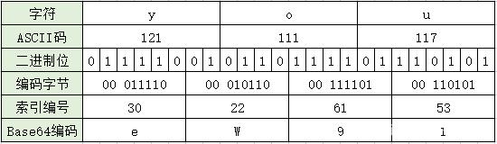
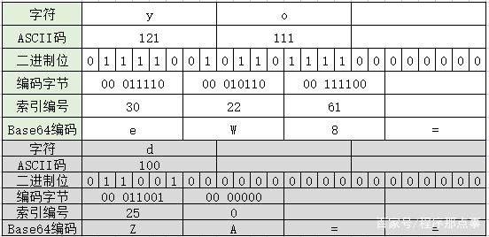

# 编码总结

## 一、Base64编码

### 1.1 初步认识

下面的这段字符串，应该是大家都很常见的。通过这种固定的格式，来表示一张图片，并被浏览器识别，可以完整的展示出图片：

```
data:image/svg+xml;base64,PHN2ZyB4bWxucz0iaHR0c......
```

> 这里展示的是一个svg格式的图片，当然我们还可以加载任何浏览器支持的格式的图片。

这段字符串就是基于Base64编码得来的，其中`base64,`后面那一长串的字符串，就是Base64编码字符串。

### 1.2 Base64是怎么诞生的

互联网发展早起，电子邮件是最有效的应用。而电子邮件的SMTP传输协议在早期，只能用于传送7位的ASCII码，而ASCII码就是基于英语设计的，对于非英语国家的文字等资源就无法发送。为了解决这个问题，后来有了通用互联网邮件扩充MIME，增加了邮件的主体结构，定义了非ASCII码的编码传输规则，这就是Base64

### 1.3 基础定义

Base64是基于64个可打印字符来表示二进制数据的编解码方式。正因为可编解码，所以它主要的作用不在于安全性，而在于让内容能在各个网关间无错的传输。

这64个可打印字符包括大写字母`A-Z`、小写字母`a-z`、数字`0-9`共62个字符，再加上另外2个 `+` 和 `/`。Base64是一种索引编码，每个字符都对应一个索引，具体的关系图，如下：

| 索引 | 对应字符 | 索引 | 对应字符 | 索引 | 对应字符 | 索引 | 对应字符 |
| ---- | -------- | ---- | -------- | ---- | -------- | ---- | -------- |
| 0    | A        | 16   | Q        | 32   | g        | 48   | w        |
| 1    | B        | 17   | R        | 33   | h        | 49   | x        |
| 2    | C        | 18   | S        | 34   | i        | 50   | y        |
| 3    | D        | 19   | T        | 35   | j        | 51   | z        |
| 4    | E        | 20   | U        | 36   | k        | 52   | 0        |
| 5    | F        | 21   | V        | 37   | l        | 53   | 1        |
| 6    | G        | 22   | W        | 38   | m        | 54   | 2        |
| 7    | H        | 23   | X        | 39   | n        | 55   | 3        |
| 8    | I        | 24   | Y        | 40   | o        | 56   | 4        |
| 9    | G        | 25   | Z        | 41   | p        | 57   | 5        |
| 10   | K        | 26   | a        | 42   | q        | 58   | 6        |
| 11   | L        | 27   | b        | 43   | r        | 59   | 7        |
| 12   | M        | 28   | c        | 44   | s        | 60   | 8        |
| 13   | N        | 29   | d        | 45   | t        | 61   | 9        |
| 14   | O        | 30   | e        | 46   | u        | 62   | +        |
| 15   | P        | 31   | f        | 47   | v        | 63   | /        |

这也是名称中64的由来。

### 1.4 编码方式

由于64等于2的6次方，所以一个Base64字符实际上代表着6个二进制位(bit)。然而，二进制数据1个字节(byte)对应的是8比特(bit)，因此，3字节（3 x 8 = 24比特）的字符串/二进制数据正好可以转换成4个Base64字符(4 x 6 = 24比特)。*为什么是3个字节一组呢？ 因为6和8的最小公倍数是24，24比特正好是3个字节。*

具体的编码方式：

1. 将每3个字节作为一组，3个字节一共24个二进制位
2. 将这24个二进制位分为4组，每个组有6个二进制位
3. 在每组的6个二进制位前面补两个00，扩展成32个二进制位，即四个字节
4. 每个字节对应的将是一个小于64的数字，即为字符编号
5. 再根据字符索引关系表，每个字符编号对应一个字符，就得到了Base64编码字符



上图中的字符串 `'you'`，经过转换后，得到的编码为： `'eW91'`。

### 1.5 体积增大

我们可以看到，当3个字符进行Base64转换编码后，最后变成了4个字符。因为每个6比特位，都补了2个0，变成8比特位，对应1字节。这里正好多了三分之一，所以正常情况下，**Base64编码的数据体积通常比原数据的体积大三分之一**。这也是为什么我们在前面讲使用Base64编码优化图片时，需要强调是小图标，如果图片都使用该方式，则静态文件会增大很多，并不合适。

### 1.6 = 等号

3个英文字符，正好能转成4个Base64字符。那如果字符长度不是3的倍数，那应该使用什么样的规则呢？

其实也简单，我们在实际使用Base编码时，常会发现有第65个字符的存在，那就是 `'='` 符号，这个等于号就是针对这种特殊情况的一种处理方式。对于不足3个字节的地方，实际都会在后面补0，直到有24个二进制位为止。但要注意的是，在计算字节数时，会直接使用总长度除以3，如果余数为1则会直接在最后补一个`=`，如果余数为2则补两个`=`。因此，转码后的字符串需要补的后缀等号，要么是1个，要么是2个，具体的可以见下图：



图中第二个，使用的是单独的字符 `'d'`，是为了区分索引字符表里的索引0，这个时候，得到编码中，会存在一个索引0对应的A字符，而`'='`是直接补上2个。

### 1.7 非ASCII码字符

由于 `Base64` 仅可对 `ASCII` 字符进行编码，如果是中文字符等非ASCII码，就需要先将中文字符转换为ASCII字符后，再进行编码才行。


## 二、ASCII编码

1、**ASCII码** 是现今最通用的单字节编码系统，并等同于国际标准ISO/IEC 646 。在这个页面，你可以找到8位的256个字符、ASCII码表和Windows-1252 (code page 1252，它是国际标准ISO 8859-1的一个扩展字符集) 标准保持一致;

2、**ASCII码** 是 **A**merican **S**tandard **C**ode for **I**nformation **I**nterchange 的缩写，而不是ASCⅡ(罗马数字2)，有很多人在这个地方产生误解;

3、**ASCII码** 规范于1967年第一次发布，最后一次更新是在1986年，它包含了33个控制字符（具有某些特殊功能但是无法显示的字符）和95个可显示字符;


## **ASCII 控制字符** (字符编码: 0-31)

在**ASCII码**表中，前32个字符是不能用于打印控制的编码，而是用于控制像打印机一样的外围设备。

| 十进制 DEC | 八进制 OCT | 十六进制 HEX | 二进制 BIN | 符号 Symbol | HTML 实体编码 | 中文解释 Description |
| :--------: | :--------: | :----------: | :--------: | :---------: | :-----------: | :------------------: |
|     0      |    000     |      00      |  00000000  |     NUL     |    \�     |        空字符        |
|     1      |    001     |      01      |  00000001  |     SOH     |    \     |       标题开始       |
|     2      |    002     |      02      |  00000010  |     STX     |    \     |       正文开始       |
|     3      |    003     |      03      |  00000011  |     ETX     |    \     |       正文结束       |
|     4      |    004     |      04      |  00000100  |     EOT     |    \     |       传输结束       |
|     5      |    005     |      05      |  00000101  |     ENQ     |    \     |         询问         |
|     6      |    006     |      06      |  00000110  |     ACK     |    \     |       收到通知       |
|     7      |    007     |      07      |  00000111  |     BEL     |    \     |          铃          |
|     8      |    010     |      08      |  00001000  |     BS      |    \     |         退格         |
|     9      |    011     |      09      |  00001001  |     HT      |    \	     |      水平制表符      |
|     10     |    012     |      0A      |  00001010  |     LF      |    \
     |        换行键        |
|     11     |    013     |      0B      |  00001011  |     VT      |    \     |      垂直制表符      |
|     12     |    014     |      0C      |  00001100  |     FF      |    \     |        换页键        |
|     13     |    015     |      0D      |  00001101  |     CR      |    \
     |        回车键        |
|     14     |    016     |      0E      |  00001110  |     SO      |    \     |         移出         |
|     15     |    017     |      0F      |  00001111  |     SI      |    \     |         移入         |
|     16     |    020     |      10      |  00010000  |     DLE     |    \     |     数据链路转义     |
|     17     |    021     |      11      |  00010001  |     DC1     |    \     |      设备控制 1      |
|     18     |    022     |      12      |  00010010  |     DC2     |    \     |      设备控制 2      |
|     19     |    023     |      13      |  00010011  |     DC3     |    \     |      设备控制 3      |
|     20     |    024     |      14      |  00010100  |     DC4     |    \     |      设备控制 4      |
|     21     |    025     |      15      |  00010101  |     NAK     |    \     |       拒绝接收       |
|     22     |    026     |      16      |  00010110  |     SYN     |    \     |       同步空闲       |
|     23     |    027     |      17      |  00010111  |     ETB     |    \     |      传输块结束      |
|     24     |    030     |      18      |  00011000  |     CAN     |    \     |         取消         |
|     25     |    031     |      19      |  00011001  |     EM      |    \     |       介质中断       |
|     26     |    032     |      1A      |  00011010  |     SUB     |    \     |         替换         |
|     27     |    033     |      1B      |  00011011  |     ESC     |    \     |        换码符        |
|     28     |    034     |      1C      |  00011100  |     FS      |    \     |      文件分隔符      |
|     29     |    035     |      1D      |  00011101  |     GS      |    \     |       组分隔符       |
|     30     |    036     |      1E      |  00011110  |     RS      |    \     |      记录分离符      |
|     31     |    037     |      1F      |  00011111  |     US      |    \     |      单元分隔符      |

## **ASCII 打印字符** (字符编码: 32-127)

32～126(共95个)是字符：32是空格，其中48～57为0到9十个阿拉伯数字，65～90为26个大写英文字母，97～122号为26个小写英文字母，其余为一些标点符号、运算符号等。第127个字符表示的是键盘上的删除命令。

| 十进制 DEC | 八进制 OCT | 十六进制 HEX | 二进制 BIN | 符号 Symbol | HTML 实体编码 | 中文解释 Description |
| :--------: | :--------: | :----------: | :--------: | :---------: | :-----------: | :------------------: |
|     32     |    040     |      20      |  00100000  |             |    \     |         空格         |
|     33     |    041     |      21      |  00100001  |      !      |    !     |        感叹号        |
|     34     |    042     |      22      |  00100010  |      "      |    "     |        双引号        |
|     35     |    043     |      23      |  00100011  |      #      |    #     |         井号         |
|     36     |    044     |      24      |  00100100  |      $      |    $     |        美元符        |
|     37     |    045     |      25      |  00100101  |      %      |    %     |        百分号        |
|     38     |    046     |      26      |  00100110  |      &      |    &     |          与          |
|     39     |    047     |      27      |  00100111  |      '      |    '     |        单引号        |
|     40     |    050     |      28      |  00101000  |      (      |    (     |        左括号        |
|     41     |    051     |      29      |  00101001  |      )      |    )     |        右括号        |
|     42     |    052     |      2A      |  00101010  |      *      |    *     |         星号         |
|     43     |    053     |      2B      |  00101011  |      +      |    +     |         加号         |
|     44     |    054     |      2C      |  00101100  |      ,      |    ,     |         逗号         |
|     45     |    055     |      2D      |  00101101  |      -      |    -     |     连字号或减号     |
|     46     |    056     |      2E      |  00101110  |      .      |    .     |     句点或小数点     |
|     47     |    057     |      2F      |  00101111  |      /      |    /     |         斜杠         |
|     48     |    060     |      30      |  00110000  |      0      |    0     |          0           |
|     49     |    061     |      31      |  00110001  |      1      |    1     |          1           |
|     50     |    062     |      32      |  00110010  |      2      |    2     |          2           |
|     51     |    063     |      33      |  00110011  |      3      |    3     |          3           |
|     52     |    064     |      34      |  00110100  |      4      |    4     |          4           |
|     53     |    065     |      35      |  00110101  |      5      |    5     |          5           |
|     54     |    066     |      36      |  00110110  |      6      |    6     |          6           |
|     55     |    067     |      37      |  00110111  |      7      |    7     |          7           |
|     56     |    070     |      38      |  00111000  |      8      |    8     |          8           |
|     57     |    071     |      39      |  00111001  |      9      |    9     |          9           |
|     58     |    072     |      3A      |  00111010  |      :      |    :     |         冒号         |
|     59     |    073     |      3B      |  00111011  |      ;      |    &#059;     |         分号         |
|     60     |    074     |      3C      |  00111100  |      <      |    &#060;     |         小于         |
|     61     |    075     |      3D      |  00111101  |      =      |    &#061;     |         等号         |
|     62     |    076     |      3E      |  00111110  |      >      |    &#062;     |         大于         |
|     63     |    077     |      3F      |  00111111  |      ?      |    &#063;     |         问号         |
|     64     |    100     |      40      |  01000000  |      @      |    &#064;     |     电子邮件符号     |
|     65     |    101     |      41      |  01000001  |      A      |    &#065;     |      大写字母 A      |
|     66     |    102     |      42      |  01000010  |      B      |    &#066;     |      大写字母 B      |
|     67     |    103     |      43      |  01000011  |      C      |    &#067;     |      大写字母 C      |
|     68     |    104     |      44      |  01000100  |      D      |    &#068;     |      大写字母 D      |
|     69     |    105     |      45      |  01000101  |      E      |    &#069;     |      大写字母 E      |
|     70     |    106     |      46      |  01000110  |      F      |    &#070;     |      大写字母 F      |
|     71     |    107     |      47      |  01000111  |      G      |    &#071;     |      大写字母 G      |
|     72     |    110     |      48      |  01001000  |      H      |    &#072;     |      大写字母 H      |
|     73     |    111     |      49      |  01001001  |      I      |    &#073;     |      大写字母 I      |
|     74     |    112     |      4A      |  01001010  |      J      |    &#074;     |      大写字母 J      |
|     75     |    113     |      4B      |  01001011  |      K      |    &#075;     |      大写字母 K      |
|     76     |    114     |      4C      |  01001100  |      L      |    &#076;     |      大写字母 L      |
|     77     |    115     |      4D      |  01001101  |      M      |    &#077;     |      大写字母 M      |
|     78     |    116     |      4E      |  01001110  |      N      |    &#078;     |      大写字母 N      |
|     79     |    117     |      4F      |  01001111  |      O      |    &#079;     |      大写字母 O      |
|     80     |    120     |      50      |  01010000  |      P      |    &#080;     |      大写字母 P      |
|     81     |    121     |      51      |  01010001  |      Q      |    &#081;     |      大写字母 Q      |
|     82     |    122     |      52      |  01010010  |      R      |    &#082;     |      大写字母 R      |
|     83     |    123     |      53      |  01010011  |      S      |    &#083;     |      大写字母 S      |
|     84     |    124     |      54      |  01010100  |      T      |    &#084;     |      大写字母 T      |
|     85     |    125     |      55      |  01010101  |      U      |    &#085;     |      大写字母 U      |
|     86     |    126     |      56      |  01010110  |      V      |    &#086;     |      大写字母 V      |
|     87     |    127     |      57      |  01010111  |      W      |     &#087     |      大写字母 W      |
|     88     |    130     |      58      |  01011000  |      X      |    &#088;     |      大写字母 X      |
|     89     |    131     |      59      |  01011001  |      Y      |    &#089;     |      大写字母 Y      |
|     90     |    132     |      5A      |  01011010  |      Z      |    &#090;     |      大写字母 Z      |
|     91     |    133     |      5B      |  01011011  |      [      |    &#091;     |       左中括号       |
|     92     |    134     |      5C      |  01011100  |             |    &#092;     |        反斜杠        |
|     93     |    135     |      5D      |  01011101  |      ]      |    &#093;     |       右中括号       |
|     94     |    136     |      5E      |  01011110  |      ^      |    &#094;     |       音调符号       |
|     95     |    137     |      5F      |  01011111  |      _      |    &#095;     |        下划线        |
|     96     |    140     |      60      |  01100000  |      `      |    &#096;     |        重音符        |
|     97     |    141     |      61      |  01100001  |      a      |    &#097;     |      小写字母 a      |
|     98     |    142     |      62      |  01100010  |      b      |    &#098;     |      小写字母 b      |
|     99     |    143     |      63      |  01100011  |      c      |    &#099;     |      小写字母 c      |
|    100     |    144     |      64      |  01100100  |      d      |    &#100;     |      小写字母 d      |
|    101     |    145     |      65      |  01100101  |      e      |    &#101;     |      小写字母 e      |
|    102     |    146     |      66      |  01100110  |      f      |    &#102;     |      小写字母 f      |
|    103     |    147     |      67      |  01100111  |      g      |    &#103;     |      小写字母 g      |
|    104     |    150     |      68      |  01101000  |      h      |    &#104;     |      小写字母 h      |
|    105     |    151     |      69      |  01101001  |      i      |    &#105;     |      小写字母 i      |
|    106     |    152     |      6A      |  01101010  |      j      |    &#106;     |      小写字母 j      |
|    107     |    153     |      6B      |  01101011  |      k      |    &#107;     |      小写字母 k      |
|    108     |    154     |      6C      |  01101100  |      l      |    &#108;     |      小写字母 l      |
|    109     |    155     |      6D      |  01101101  |      m      |    &#109;     |      小写字母 m      |
|    110     |    156     |      6E      |  01101110  |      n      |    &#110;     |      小写字母 n      |
|    111     |    157     |      6F      |  01101111  |      o      |    &#111;     |      小写字母 o      |
|    112     |    160     |      70      |  01110000  |      p      |    &#112;     |      小写字母 p      |
|    113     |    161     |      71      |  01110001  |      q      |    &#113;     |      小写字母 q      |
|    114     |    162     |      72      |  01110010  |      r      |    &#114;     |      小写字母 r      |
|    115     |    163     |      73      |  01110011  |      s      |    &#115;     |      小写字母 s      |
|    116     |    164     |      74      |  01110100  |      t      |    &#116;     |      小写字母 t      |
|    117     |    165     |      75      |  01110101  |      u      |    &#117;     |      小写字母 u      |
|    118     |    166     |      76      |  01110110  |      v      |    &#118;     |      小写字母 v      |
|    119     |    167     |      77      |  01110111  |      w      |    &#119;     |      小写字母 w      |
|    120     |    170     |      78      |  01111000  |      x      |    &#120;     |      小写字母 x      |
|    121     |    171     |      79      |  01111001  |      y      |    &#121;     |      小写字母 y      |
|    122     |    172     |      7A      |  01111010  |      z      |    &#122;     |      小写字母 z      |
|    123     |    173     |      7B      |  01111011  |      {      |    &#123;     |       左大括号       |
|    124     |    174     |      7C      |  01111100  |     \|      |    &#124;     |        垂直线        |
|    125     |    175     |      7D      |  01111101  |      }      |    &#125;     |       右大括号       |
|    126     |    176     |      7E      |  01111110  |      ~      |    &#126;     |        波浪号        |
|    127     |    177     |      7F      |  01111111  |             |    \&#127;    |         删除         |

## **ASCII扩展码** (字符编码: 128-255)

后128个称为扩展**ASCII码**。许多基于x86的系统都支持使用扩展（或“高”）**ASCII**。扩展**ASCII码**允许将每个字符的第8 位用于确定附加的128 个特殊符号字符、外来语字母和图形符号。

| 十进制 DEC | 八进制 OCT | 十六进制 HEX | 二进制 BIN | 符号 Symbol | HTML 实体编码 |        中文解释 Description         |
| :--------: | :--------: | :----------: | :--------: | :---------: | :-----------: | :---------------------------------: |
|    128     |    200     |      80      |  10000000  |      €      |    &#128;     |              欧盟符号               |
|    129     |    201     |      81      |  10000001  |             |               |                                     |
|    130     |    202     |      82      |  10000010  |      ‚      |    &#130;     |             单低 9 引号             |
|    131     |    203     |      83      |  10000011  |      ƒ      |    &#131;     |        带钩的 拉丁小写字母f         |
|    132     |    204     |      84      |  10000100  |      „      |    &#132;     |             双低 9 引号             |
|    133     |    205     |      85      |  10000101  |      …      |    &#133;     |             水平省略号              |
|    134     |    206     |      86      |  10000110  |      †      |    &#134;     |                剑号                 |
|    135     |    207     |      87      |  10000111  |      ‡      |    &#135;     |               双剑号                |
|    136     |    210     |      88      |  10001000  |      ˆ      |    &#136;     |         修正字符 抑扬音符号         |
|    137     |    211     |      89      |  10001001  |      ‰      |    &#137;     |               千分号                |
|    138     |    212     |      8A      |  10001010  |      Š      |    &#138;     |      带弯音号的 拉丁大写字母 S      |
|    139     |    213     |      8B      |  10001011  |      ‹      |    &#139;     |             左单书名号              |
|    140     |    214     |      8C      |  10001100  |      Œ      |    &#140;     |           拉丁大写组合 OE           |
|    141     |    215     |      8D      |  10001101  |             |               |                                     |
|    142     |    216     |      8E      |  10001110  |      Ž      |    &#142;     |      带弯音号的 拉丁大写字母 z      |
|    143     |    217     |      8F      |  10001111  |             |               |                                     |
|    144     |    220     |      90      |  10010000  |             |               |                                     |
|    145     |    221     |      91      |  10010001  |      ‘      |    &#145;     |              左单引号               |
|    146     |    222     |      92      |  10010010  |      ’      |    &#146;     |              右单引号               |
|    147     |    223     |      93      |  10010011  |      “      |    &#147;     |              左双引号               |
|    148     |    224     |      94      |  10010100  |      ”      |    &#148;     |              右双引号               |
|    149     |    225     |      95      |  10010101  |      •      |    &#149;     |                                     |
|    150     |    226     |      96      |  10010110  |      –      |    &#150;     |             半长破折号              |
|    151     |    227     |      97      |  10010111  |      —      |    &#151;     |             全长破折号              |
|    152     |    230     |      98      |  10011000  |      ˜      |    &#152;     |              小波浪线               |
|    153     |    231     |      99      |  10011001  |      ™      |    &#153;     |                                     |
|    154     |    232     |      9A      |  10011010  |      š      |    &#154;     |      带弯音号的 拉丁小写字母 s      |
|    155     |    233     |      9B      |  10011011  |      ›      |    &#155;     |             右单书名号              |
|    156     |    234     |      9C      |  10011100  |      œ      |    &#156;     |           拉丁小写组合 oe           |
|    157     |    235     |      9D      |  10011101  |             |               |                                     |
|    158     |    236     |      9E      |  10011110  |      ž      |    &#158;     |      带弯音号的 拉丁小写字母 z      |
|    159     |    237     |      9F      |  10011111  |      Ÿ      |    &#159;     |      带弯音号的 拉丁大写字母 Y      |
|    160     |    240     |      A0      |  10100000  |             |    \&#160;    |                                     |
|    161     |    241     |      A1      |  10100001  |      ¡      |    &#161;     |             反向感叹号              |
|    162     |    242     |      A2      |  10100010  |      ¢      |    &#162;     |              分币符号               |
|    163     |    243     |      A3      |  10100011  |      £      |    &#163;     |              英磅符号               |
|    164     |    244     |      A4      |  10100100  |      ¤      |    &#164;     |                                     |
|    165     |    245     |      A5      |  10100101  |      ¥      |    &#165;     |             人民币符号              |
|    166     |    246     |      A6      |  10100110  |      ¦      |    &#166;     |                                     |
|    167     |    247     |      A7      |  10100111  |      §      |    &#167;     |              章节符号               |
|    168     |    250     |      A8      |  10101000  |      ¨      |    &#168;     |            通用货币符号             |
|    169     |    251     |      A9      |  10101001  |      ©      |    &#169;     |              版权符号               |
|    170     |    252     |      AA      |  10101010  |      ª      |    &#170;     |          阴性顺序 指示符号          |
|    171     |    253     |      AB      |  10101011  |      «      |    &#171;     |              左角引号               |
|    172     |    254     |      AC      |  10101100  |      ¬      |    &#172;     |                                     |
|    173     |    255     |      AD      |  10101101  |      ­      |    \&#173;    |                                     |
|    174     |    256     |      AE      |  10101110  |      ®      |    &#174;     |                                     |
|    175     |    257     |      AF      |  10101111  |      ¯      |    &#175;     |                                     |
|    176     |    260     |      B0      |  10110000  |      °      |    &#176;     |              温度符号               |
|    177     |    261     |      B1      |  10110001  |      ±      |    &#177;     |               加/减号               |
|    178     |    262     |      B2      |  10110010  |      ²      |    &#178;     |               上标 2                |
|    179     |    263     |      B3      |  10110011  |      ³      |    &#179;     |               上标 3                |
|    180     |    264     |      B4      |  10110100  |      ´      |    &#180;     |                                     |
|    181     |    265     |      B5      |  10110101  |      µ      |    &#181;     |               微符号                |
|    182     |    266     |      B6      |  10110110  |      ¶      |    &#182;     |         段落符号， pilcrow          |
|    183     |    267     |      B7      |  10110111  |      ·      |    &#183;     |                中点                 |
|    184     |    270     |      B8      |  10111000  |      ¸      |    &#184;     |                                     |
|    185     |    271     |      B9      |  10111001  |      ¹      |    &#185;     |               上标 1                |
|    186     |    272     |      BA      |  10111010  |      º      |    &#186;     |           阳性顺序 指示符           |
|    187     |    273     |      BB      |  10111011  |      »      |    &#187;     |              右角引号               |
|    188     |    274     |      BC      |  10111100  |      ¼      |    &#188;     |            分数四分之一             |
|    189     |    275     |      BD      |  10111101  |      ½      |    &#189;     |            分数二分之一             |
|    190     |    276     |      BE      |  10111110  |      ¾      |    &#190;     |                                     |
|    191     |    277     |      BF      |  10111111  |      ¿      |    &#191;     |              反向问号               |
|    192     |    300     |      C0      |  11000000  |      À      |    &#192;     |        带重音符 的大写字母 A        |
|    193     |    301     |      C1      |  11000001  |      Á      |    &#193;     |       带尖锐重音 的大写字母 A       |
|    194     |    302     |      C2      |  11000010  |      Â      |    &#194;     |       带音调符号 的大写字母 A       |
|    195     |    303     |      C3      |  11000011  |      Ã      |    &#195;     |        带代字号 的大写字母 A        |
|    196     |    304     |      C4      |  11000100  |      Ä      |    &#196;     | 带元音变音 (分音符号) 的大写字母 A  |
|    197     |    305     |      C5      |  11000101  |      Å      |    &#197;     |         带铃声 的大写字母 A         |
|    198     |    306     |      C6      |  11000110  |      Æ      |    &#198;     |        大写字母 AE 双重元音         |
|    199     |    307     |      C7      |  11000111  |      Ç      |    &#199;     |       带变音符号 的大写字母 C       |
|    200     |    310     |      C8      |  11001000  |      È      |    &#200;     |        带重音符 的大写字母 E        |
|    201     |    311     |      C9      |  11001001  |      É      |    &#201;     |       带尖锐重音 的大写字母 E       |
|    202     |    312     |      CA      |  11001010  |      Ê      |    &#202;     |       带音调符号 的大写字母 E       |
|    203     |    313     |      CB      |  11001011  |      Ë      |    &#203;     | 带元音变音 (分音符号) 的大写字母 E  |
|    204     |    314     |      CC      |  11001100  |      Ì      |    &#204;     |        带重音符 的大写字母 I        |
|    205     |    315     |      CD      |  11001101  |      Í      |    &#205;     |       带尖锐重音 的大写字母 I       |
|    206     |    316     |      CE      |  11001110  |      Î      |    &#206;     |       带音调符号 的大写字母 I       |
|    207     |    317     |      CF      |  11001111  |      Ï      |    &#207;     | 带元音变音 (分音符号) 的大写字母 I  |
|    208     |    320     |      D0      |  11010000  |      Ð      |    &#208;     |                                     |
|    209     |    321     |      D1      |  11010001  |      Ñ      |    &#209;     |        带代字号 的大写字母 N        |
|    210     |    322     |      D2      |  11010010  |      Ò      |    &#210;     |        带重音符 的大写字母 O        |
|    211     |    323     |      D3      |  11010011  |      Ó      |    &#211;     |       带尖锐重音 的大写字母 O       |
|    212     |    324     |      D4      |  11010100  |      Ô      |    &#212;     |       带音调符号 的大写字母 O       |
|    213     |    325     |      D5      |  11010101  |      Õ      |    &#213;     |        带代字号 的大写字母 O        |
|    214     |    326     |      D6      |  11010110  |      Ö      |    &#214;     | 带元音变音 (分音符号) 的大写字母 O  |
|    215     |    327     |      D7      |  11010111  |      ×      |    &#215;     |          大写字母 OE 连字           |
|    216     |    330     |      D8      |  11011000  |      Ø      |    &#216;     |         带斜杠 的大写字母 O         |
|    217     |    331     |      D9      |  11011001  |      Ù      |    &#217;     |        带重音符 的大写字母 U        |
|    218     |    332     |      DA      |  11011010  |      Ú      |    &#218;     |       带尖锐重音 的大写字母 U       |
|    219     |    333     |      DB      |  11011011  |      Û      |    &#219;     |       带音调符号 的大写字母 U       |
|    220     |    334     |      DC      |  11011100  |      Ü      |    &#220;     | 带元音变音 (分音符号) 的大写字母 U  |
|    221     |    335     |      DD      |  11011101  |      Ý      |    &#221;     | 带元音变音 (分音符号) 的大写字母 Y  |
|    222     |    336     |      DE      |  11011110  |      Þ      |    &#222;     |                                     |
|    223     |    337     |      DF      |  11011111  |      ß      |    &#223;     |         德语高调 小写字母 s         |
|    224     |    340     |      E0      |  11100000  |      à      |    &#224;     |        带重音符 的小写字母 a        |
|    225     |    341     |      E1      |  11100001  |      á      |    &#225;     |       带尖锐重音 的小写字母 a       |
|    226     |    342     |      E2      |  11100010  |      â      |    &#226;     |       带音调符号 的小写字母 a       |
|    227     |    343     |      E3      |  11100011  |      ã      |    &#227;     |        带代字号 的小写字母 a        |
|    228     |    344     |      E4      |  11100100  |      ä      |    &#228;     | 带元音变音 (分音符号) 的小写字母 a  |
|    229     |    345     |      E5      |  11100101  |      å      |    &#229;     |         带铃声的 小写字母 a         |
|    230     |    346     |      E6      |  11100110  |      æ      |    &#230;     |        小写字母 ae 双重元音         |
|    231     |    347     |      E7      |  11100111  |      ç      |    &#231;     |       带变音符号 的小写字母 c       |
|    232     |    350     |      E8      |  11101000  |      è      |    &#232;     |        带重音符 的小写字母 e        |
|    233     |    351     |      E9      |  11101001  |      é      |    &#233;     |       带尖锐重音 的小写字母 e       |
|    234     |    352     |      EA      |  11101010  |      ê      |    &#234;     |       带音调符号 的小写字母 e       |
|    235     |    353     |      EB      |  11101011  |      ë      |    &#235;     | 带元音变音 (分音符号) 的小写字母 e  |
|    236     |    354     |      EC      |  11101100  |      ì      |    &#236;     |        带重音符 的小写字母 i        |
|    237     |    355     |      ED      |  11101101  |      í      |    &#237;     |       带尖锐重音 的小写字母 i       |
|    238     |    356     |      EE      |  11101110  |      î      |    &#238;     |       带音调符号 的小写字母 i       |
|    239     |    357     |      EF      |  11101111  |      ï      |    &#239;     | 带元音变音 (分音符号) 的小写字母 i  |
|    240     |    360     |      F0      |  11110000  |      ð      |    &#240;     |                                     |
|    241     |    361     |      F1      |  11110001  |      ñ      |    &#241;     |        带代字号 的小写字母 n        |
|    242     |    362     |      F2      |  11110010  |      ò      |    &#242;     |        带重音符 的小写字母 o        |
|    243     |    363     |      F3      |  11110011  |      ó      |    &#243;     |       带尖锐重音 的小写字母 o       |
|    244     |    364     |      F4      |  11110100  |      ô      |    &#244;     |       带音调符号 的小写字母 o       |
|    245     |    365     |      F5      |  11110101  |      õ      |    &#245;     |        带代字号 的小写字母 o        |
|    246     |    366     |      F6      |  11110110  |      ö      |    &#246;     | 带元音变音 (分音符号) 的小写字母 o  |
|    247     |    367     |      F7      |  11110111  |      ÷      |    &#247;     |          小写字母 oe 连字           |
|    248     |    370     |      F8      |  11111000  |      ø      |    &#248;     |         带斜杠 的小写字母 o         |
|    249     |    371     |      F9      |  11111001  |      ù      |    &#249;     |        带重音符 的小写字母 u        |
|    250     |    372     |      FA      |  11111010  |      ú      |    &#250;     |       带尖锐重音 的小写字母 u       |
|    251     |    373     |      FB      |  11111011  |      û      |    &#251;     |       带音调符号 的小写字母 u       |
|    252     |    374     |      FC      |  11111100  |      ü      |    &#252;     | 带元音变音 (分音符号) 的小写字母 u  |
|    253     |    375     |      FD      |  11111101  |      ý      |    &#253;     | 带元音变音 (分音符号) 的小写字母 y2 |
|    254     |    376     |      FE      |  11111110  |      þ      |    &#254;     |                                     |
|    255     |    377     |      FF      |  11111111  |      ÿ      |    &#255;     |                                     |