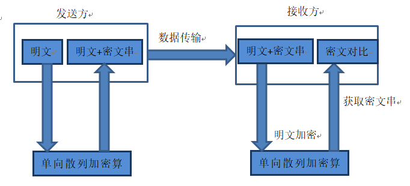
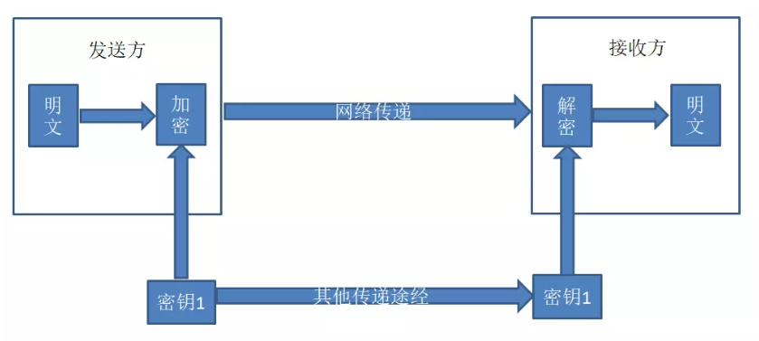

# 加密算法

加密算法，是现在每个软件项目里必须用到的内容。广泛应用在包括了用户登入、数字签名、数据传输等多个场合。那大家都知道那些呢？今天我把常见的加密算法全部整理在这里，供大家学习参考。

首先，大家要知道加密算法能干什么，利用加密算法来对数据通信的过程进行加密传输是一种最常见的安全手段。利用该手段能够达到一下三个目的：

1. 数据保密性，防止用户数据被窃取或泄露；

2. 数据完整性，防止用户传输的数据被篡改；

3. 通信双方身份确认，确保数据来源合法；


**常见的加密算法**


目前常见的加密算法分类如下：

1. 单向散列加密算法

   常见算法包括：MD5、sha1、sha256等

2. 对称加密算法

   常见的算法有：DES、3DES、AES

3. 非对称加密算法 

     常见算法包括：RSA、ECC


**各种加密算法对比如下：**

1. 单向散列加密算法：

| 名称    | 运行速度 | 安全性 |
| :------ | :------- | :----- |
| MD5     | 快       | 中     |
| SHA-1   | 慢       | 高     |
| SHA-256 | 更慢     | 更高   |

2，对称加密算法：

| 名称 | 密钥            | 运行速度 | 安全性 | 资源消耗 |
| :--- | :-------------- | :------- | :----- | :------- |
| DES  | 56位            | 较快     | 低     | 中       |
| 3DES | 112位或168位    | 慢       | 中     | 高       |
| AES  | 128、192、256位 | 快       | 高     | 低       |

3，非对称加密算法：

| 名称 | 成熟度 | 安全性 | 运算速度 | 资源消耗 |
| :--- | :----- | :----- | :------- | :------- |
| RSA  | 高     | 高     | 中       | 中       |
| ECC  | 高     | 高     | 慢       | 高       |


## 一，单向散列加密

单向散列加密算法常用于提取数据，验证数据的完整性。发送者将明文通过单向加密算法加密生成定长的密文串，然后将明文和密文串传递给接收方。接收方在收到报文后，将解明文使用相同的单向加密算法进行加密，得出加密后的密文串。随后与发送者发送过来的密文串进行对比，若发送前和发送后的密文串相一致，则说明传输过程中数据没有损坏；若不一致，说明传输过程中数据丢失了。其次也用于密码加密传递存储。单向加密算法只能用于对数据的加密，无法被解密，其特点为定长输出、雪崩效应。



### 1.1 MD5加密算法

MD5加密算法用的是哈希函数，一般应用于对信息产生信息摘要，防止信息被篡改。最常见的使用是对密码加密、生成数字签名。从严格意义上来说，MD5是摘要算法，并非加密算法。MD5 生成密文时，无论要加密的字符串有多长，它都会输出长度为 128bits 的一个密文串，通常16 进制时为 32 个字符。

```java
public static final byte[] computeMD5(byte[] content) {
    try {
          MessageDigest md5 = MessageDigest.getInstance("MD5");
          return md5.digest(content);
    } catch (NoSuchAlgorithmException e) {
          throw new RuntimeException(e);
    }
}
```

### 1.2，SHA1加密算法

SHA1加密算法，与MD5一样，也是目前较流行的摘要算法。但SHA1 比 MD5 的 安全性更高。对长度小于 2 ^ 64 位的消息，SHA1会产生一个 160 位的 消息摘要。基于 MD5、SHA1 的信息摘要特性以及不可逆，可以被应用在检查文件完整性， 数字签名等场景。

```java
public static byte[] computeSHA1(byte[] content) {
    try {
          MessageDigest sha1 = MessageDigest.getInstance("SHA1");
          return sha1.digest(content);
    } catch (NoSuchAlgorithmException e) {
          throw new RuntimeException(e);
    }
}
```

### 1.3，SHA256加密算法

SHA256是SHA2算法中的一种，如SHA2加密算法中有：SHA244、SHA256、SHA512等。SHA2属于SHA1的升级，SHA1是160位的哈希值，而SHA2是组合值，有不同的位数，其中最受欢迎的是256位（SHA256算法）。

SSL行业选择SHA作为数字签名的散列算法，从2011到2015，一直以SHA-1位主导算法。但随着互联网技术的提升，SHA-1的缺点越来越突显。从去年起，SHA-2成为了新的标准，所以现在签发的SSL证书，必须使用该算法签名。

```java
public static byte[] getSHA256(String str) {
    MessageDigest messageDigest;
    String encodestr = "";
    try {
        messageDigest = MessageDigest.getInstance("SHA-256");
        messageDigest.update(str.getBytes("UTF-8"));
        return messageDigest.digest());
    } catch (NoSuchAlgorithmException e) {
        e.printStackTrace();
    } catch (UnsupportedEncodingException e) {
        e.printStackTrace();
    }
}
```


## 二，对称加密算法

对称加密算法采用单密钥加密，在数据传输过程中，发送方将原始数据分割成固定大小的块，经过密钥和加密算法逐个加密后，发送给接收方；接收方收到加密后的报文后，结合密钥和解密算法解密组合后得出原始数据。由于加解密算法是公开的，因此在这过程中，密钥的安全传递就成为了至关重要的事了。而密钥通常来说是通过双方协商，以物理的方式传递给对方，或者利用第三方平台传递给对方，一旦这过程出现了密钥泄露，不怀好意的人就能结合相应的算法拦截解密出其加密传输的内容。



AES、DES、3DES 都是对称的块加密算法，加解密的过程是可逆的。

### 2.1，DES算法

DES算法为密码体制中的对称密码体制，又被称为美国数据加密标准，是1972年美国IBM公司研制的对称密码体制加密算法。明文按64位进行分组，密钥长64位，密钥事实上是56位参与DES运算（第8、16、24、32、40、48、56、64位是校验位， 使得每个密钥都有奇数个1）分组后的明文组和56位的密钥按位替代或交换的方法形成密文组的加密方法。

DES 加密算法是对密钥进行保密，公开加密和解密算。只有知道发送方相同密钥的人才能解读获取的密文数据。想破译 DES 加密算法，就要搜索密钥的编码。对于56位长度的密钥来说，用穷举法，其运算次数为 2 ^ 56 次。

### 2.2，3DES算法

3DES又称Triple DES，是DES加密算法的一种模式，它使用2条不同的56位的密钥对数据进行三次加密。DES使用56位密钥和密码块的方法，而在密码块的方法中，文本被分成64位大小的文本块然后再进行加密。比起最初的DES，3DES更为安全。

```java
public class Des3 {
    private static final String Algorithm = "DESede"; 
    /**
     * 加密
     * @param keybyte
     * @param src
     * @return
     */
    public static byte[] encryptMode(byte[] keybyte, byte[] src) {
        try {
            // 生成密钥
            SecretKey deskey = new SecretKeySpec(keybyte, Algorithm);
            // 加密
            Cipher c1 = Cipher.getInstance(Algorithm);
            c1.init(Cipher.ENCRYPT_MODE, deskey);
            return c1.doFinal(src);
        } catch (java.security.NoSuchAlgorithmException e1) {
            e1.printStackTrace();
        } catch (javax.crypto.NoSuchPaddingException e2) {
            e2.printStackTrace();
        } catch (java.lang.Exception e3) {
            e3.printStackTrace();
        }
        return null;
    }
    
    /**
     * 解密
     * @param keybyte 为加密密钥，长度为24字节
     * @param src 为加密后的缓冲区
     * @return
     */
    public static byte[] decryptMode(byte[] keybyte, byte[] src) {
        try {
            // 生成密钥
            SecretKey deskey = new SecretKeySpec(keybyte, Algorithm);
            // 解密
            Cipher c1 = Cipher.getInstance(Algorithm);
            c1.init(Cipher.DECRYPT_MODE, deskey);
            return c1.doFinal(src);
        } catch (Exception e) {
            e.printStackTrace();
        }
        return null;
    }
    // 转换成十六进制字符串
    public static String byte2hex(byte[] b) {
        String hs = "";
        String stmp = "";
        for (int n = 0; n < b.length; n++) {
            stmp = (java.lang.Integer.toHexString(b[n] & 0XFF));
            if (stmp.length() == 1) {
                hs = hs + "0" + stmp;
            } else {
                hs = hs + stmp;
            }
            if (n < b.length - 1) {
                hs = hs + ":";
            }
        }
        return hs.toUpperCase();
    }
}
```

### 2.3，AES算法

AES算法是密码学中的高级加密标准，同时也是美国联邦政府采用的区块加密标准。这个标准用来替代原先的DES，已经被多方分析且广为全世界所使用。算法采用对称分组密码体制，密钥长度的最少支持为 128 位、 192 位、256 位，分组长度 128 位，算法应易于各种硬件和软件实现。AES本身就是为了取代DES的，AES具有更好的安全性、效率和灵活性。

```java
public class AESUtils {
    /**
     * 加密
     *
     * @param content
     * @param strKey
     * @return
     * @throws Exception
     */
    public static byte[] encrypt(String content, String strKey) throws Exception {
        SecretKeySpec skeySpec = getKey(strKey);
        Cipher cipher = Cipher.getInstance("AES/CBC/PKCS5Padding");
        IvParameterSpec iv = new IvParameterSpec("0102030405060708".getBytes());
        cipher.init(Cipher.ENCRYPT_MODE, skeySpec, iv);
        return cipher.doFinal(content.getBytes());
    }
    
     /**
     * 解密
     *
     * @param strKey
     * @param content
     * @return
     * @throws Exception
     */
    public static String decrypt(byte[] content, String strKey) throws Exception {
        SecretKeySpec skeySpec = getKey(strKey);
        Cipher cipher = Cipher.getInstance("AES/CBC/PKCS5Padding");
        IvParameterSpec iv = new IvParameterSpec("0102030405060708".getBytes());
        cipher.init(Cipher.DECRYPT_MODE, skeySpec, iv);
        byte[] original = cipher.doFinal(content);
        String originalString = new String(original);
        return originalString;
    }
    
    private static SecretKeySpec getKey(String strKey) throws Exception {
        byte[] arrBTmp = strKey.getBytes();
        byte[] arrB = new byte[16]; 
        for (int i = 0; i < arrBTmp.length && i < arrB.length; i++) {
            arrB[i] = arrBTmp[i];
        }
        SecretKeySpec skeySpec = new SecretKeySpec(arrB, "AES");
        return skeySpec;
    }
}
```

## 三，非对称加密算法

非对称加密算法采用公钥（publickey）和私钥（privatekey）两种不同的密钥来进行加解密。公钥与私钥是一对，如果用公钥对数据进行加密，只有用对应的私钥才能解密，反之亦然。因为加密和解密使用的是两个不同的密钥，所以这种算法叫作非对称加密算法。 

非对称加密算法实现机密信息交换的基本过程是：甲方生成一对密钥并将公钥公开，需要向甲方发送信息的其他角色(乙方)使用该密钥(甲方的公钥)对机密信息进行加密后再发送给甲方；甲方再用自己私钥对加密后的信息进行解密。甲方想要回复乙方时正好相反，使用乙方的公钥对数据进行加密，同理，乙方使用自己的私钥来进行解密。

### 3.1，RSA算法

RSA是目前最有影响力的公钥加密算法，也是被普遍认为是目前最优秀的公钥方案之一。RSA算法是第一个能同时用于加密和数字签名的算法，也易于理解和操作。RSA是被研究得最广泛的公钥算法，从提出到现今的三十多年里，经历了各种攻击的考验，逐渐为人们接受，截止2017年被普遍认为是最优秀的公钥方案之一。也已被ISO推荐为公钥数据加密标准。

```java
public class RSAUtils {
 
    public static final String KEY_ALGORITHM = "RSA";
    private static final String PUBLIC_KEY = "RSAPublicKey";
    private static final String PRIVATE_KEY = "RSAPrivateKey";
 
    /**
     * 私钥解密
     *
     * @param data 已加密数据
     * @param privateKey 私钥(BASE64编码)
     * @return
     * @throws Exception
     */
    public static String decryptByPrivateKey(String data, String privateKey) throws Exception {
        byte[] keyBytes = Base64.decodeBase64(privateKey);
        PKCS8EncodedKeySpec pkcs8KeySpec = new PKCS8EncodedKeySpec(keyBytes);
        KeyFactory keyFactory = KeyFactory.getInstance(KEY_ALGORITHM);
        Key privateK = keyFactory.generatePrivate(pkcs8KeySpec);
        Cipher cipher = Cipher.getInstance(keyFactory.getAlgorithm());
        cipher.init(Cipher.DECRYPT_MODE, privateK);
        byte[] buff = cipher.doFinal(Base64.decodeBase64(data));
        return new String(buff);
    }
    
     /**
     * 公钥解密
     *
     * @param data 已加密数据
     * @param publicKey 公钥(BASE64编码)
     * @return
     * @throws Exception
     */
    public static String decryptByPublicKey(String data, String publicKey) throws Exception {
        byte[] keyBytes = Base64.decodeBase64(publicKey);
        X509EncodedKeySpec x509KeySpec = new X509EncodedKeySpec(keyBytes);
        KeyFactory keyFactory = KeyFactory.getInstance(KEY_ALGORITHM);
        Key publicK = keyFactory.generatePublic(x509KeySpec);
        Cipher cipher = Cipher.getInstance(keyFactory.getAlgorithm());
        cipher.init(Cipher.DECRYPT_MODE, publicK);
        // 执行解密操作
        byte[] buff = cipher.doFinal(Base64.decodeBase64(data));
        return new String(buff);
    }
    
    /**
     * 公钥加密
     *
     * @param data 源数据
     * @param publicKey 公钥(BASE64编码)
     * @return
     * @throws Exception
     */
    public static String encryptByPublicKey(String data, String publicKey) throws Exception {
        byte[] keyBytes = Base64.decodeBase64(publicKey);
        X509EncodedKeySpec x509KeySpec = new X509EncodedKeySpec(keyBytes);
        KeyFactory keyFactory = KeyFactory.getInstance(KEY_ALGORITHM);
        Key publicK = keyFactory.generatePublic(x509KeySpec);
        // 对数据加密
        Cipher cipher = Cipher.getInstance(keyFactory.getAlgorithm());
        cipher.init(Cipher.ENCRYPT_MODE, publicK);
        byte[] buff = cipher.doFinal(data.getBytes());
        return Base64.encodeBase64String(buff);
    }
    
    /**
     * 私钥加密
     *
     * @param data 源数据
     * @param privateKey 私钥(BASE64编码)
     * @return
     * @throws Exception
     */
    public static String encryptByPrivateKey(String data, String privateKey) throws Exception {
        byte[] keyBytes = Base64.decodeBase64(privateKey);
        PKCS8EncodedKeySpec pkcs8KeySpec = new PKCS8EncodedKeySpec(keyBytes);
        KeyFactory keyFactory = KeyFactory.getInstance(KEY_ALGORITHM);
        Key privateK = keyFactory.generatePrivate(pkcs8KeySpec);
        Cipher cipher = Cipher.getInstance(keyFactory.getAlgorithm());
        cipher.init(Cipher.ENCRYPT_MODE, privateK);
        byte[] buff = cipher.doFinal(data.getBytes());
        // 执行加密操作。加密后的结果通常都会用Base64编码进行传输
        return Base64.encodeBase64String(buff);
    }
 
     /**
     * 获取私钥
     *
     * @param keyMap 密钥对
     * @return
     * @throws Exception
     */
    public static String getPrivateKey(Map<String, Object> keyMap) throws Exception {
        Key key = (Key) keyMap.get(PRIVATE_KEY);
        return Base64.encodeBase64String(key.getEncoded());
    }
    
    /**
     * 获取公钥
     *
     * @param keyMap 密钥对
     * @return
     * @throws Exception
     */
    public static String getPublicKey(Map<String, Object> keyMap) throws Exception {
        Key key = (Key) keyMap.get(PUBLIC_KEY);
        return Base64.encodeBase64String(key.getEncoded());
    }
    
    /**
     * 生成密钥对(公钥和私钥)
     *
     * @return
     * @throws Exception
     */
    public static Map<String, Object> initKey() throws Exception {
        KeyPairGenerator keyPairGen = KeyPairGenerator.getInstance(KEY_ALGORITHM);
        keyPairGen.initialize(1024);
        KeyPair keyPair = keyPairGen.generateKeyPair();
        RSAPublicKey publicKey = (RSAPublicKey) keyPair.getPublic();
        RSAPrivateKey privateKey = (RSAPrivateKey) keyPair.getPrivate();
        Map<String, Object> keyMap = new HashMap<String, Object>(2);
        keyMap.put(PUBLIC_KEY, publicKey);
        keyMap.put(PRIVATE_KEY, privateKey);
        return keyMap;
    }
}
```

### 3.2，ECC算法

ECC（椭圆加密算法）是一种公钥加密体制，主要优势是在某些情况下它比其他的方法使用更小的密钥——比如RSA加密算法——提供相当的或更高等级的安全。不过一个缺点是加密和解密操作的实现比其他机制时间长。它相比RSA算法，对 CPU 消耗严重。

```java
public abstract class ECCCoder extends Coder {
    public static final String ALGORITHM = "EC";
    private static final String PUBLIC_KEY = "ECCPublicKey";
    private static final String PRIVATE_KEY = "ECCPrivateKey";
 
    /**
     * 用私钥解密
     * @param data
     * @param key
     * @return
     * @throws Exception
     */
    public static byte[] decrypt(byte[] data, String key) throws Exception {
        // 对密钥解密
        byte[] keyBytes = decryptBASE64(key);
        // 取得私钥
        PKCS8EncodedKeySpec pkcs8KeySpec = new PKCS8EncodedKeySpec(keyBytes);
        KeyFactory keyFactory = ECKeyFactory.INSTANCE;
        ECPrivateKey priKey = (ECPrivateKey) keyFactory.generatePrivate(pkcs8KeySpec);
        ECPrivateKeySpec ecPrivateKeySpec = new ECPrivateKeySpec(priKey.getS(),priKey.getParams());
        // 对数据解密
        Cipher cipher = new NullCipher();
        cipher.init(Cipher.DECRYPT_MODE, priKey, ecPrivateKeySpec.getParams());
        return cipher.doFinal(data);
    }
    /**
     * 用公钥加密
     * @param data
     * @param privateKey
     * @return
     * @throws Exception
     */
    public static byte[] encrypt(byte[] data, String privateKey) throws Exception {
        // 对公钥解密
        byte[] keyBytes = decryptBASE64(privateKey);
        // 取得公钥
        X509EncodedKeySpec x509KeySpec = new X509EncodedKeySpec(keyBytes);
        KeyFactory keyFactory = ECKeyFactory.INSTANCE;
        ECPublicKey pubKey = (ECPublicKey) keyFactory.generatePublic(x509KeySpec);
        ECPublicKeySpec ecPublicKeySpec = new ECPublicKeySpec(pubKey.getW(), pubKey.getParams());
        Cipher cipher = new NullCipher();
        cipher.init(Cipher.ENCRYPT_MODE, pubKey, ecPublicKeySpec.getParams());
        return cipher.doFinal(data);
    }
    
    /**
     * 取得私钥
     * @param keyMap
     * @return
     * @throws Exception
     */
    public static String getPrivateKey(Map<String, Object> keyMap) throws Exception {
        Key key = (Key) keyMap.get(PRIVATE_KEY);
        return encryptBASE64(key.getEncoded());
    }
    /**
     * 取得公钥
     * @param keyMap
     * @return
     * @throws Exception
     */
    public static String getPublicKey(Map<String, Object> keyMap) throws Exception {
        Key key = (Key) keyMap.get(PUBLIC_KEY);
        return encryptBASE64(key.getEncoded());
    }
}
```

