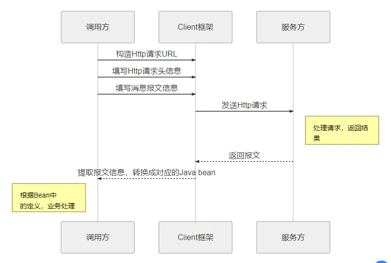
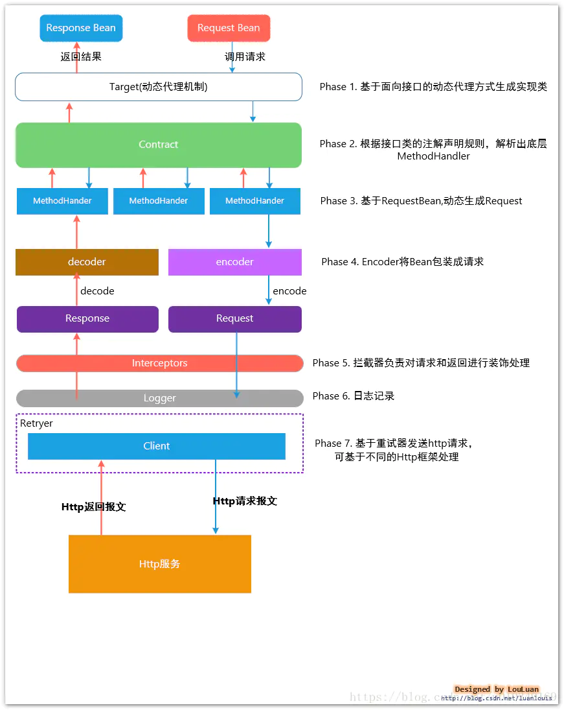

# Spring Cloud OpenFeign 源码解析


## Feign 简介

### Feign是什么？

Feign 的英文表意为“假装，伪装，变形”， 是一个http请求调用的轻量级框架，可以以Java接口注解的方式调用Http请求，而不用像Java中通过封装HTTP请求报文的方式直接调用。Feign通过处理注解，将请求模板化，当实际调用的时候，传入参数，根据参数再应用到请求上，进而转化成真正的请求，这种请求相对而言比较直观。

Feign被广泛应用在Spring Cloud 的解决方案中，是学习基于Spring Cloud 微服务架构不可或缺的重要组件。

开源项目地址：[https://github.com/OpenFeign/feign](https://links.jianshu.com/go?to=https%3A%2F%2Fgithub.com%2FOpenFeign%2Ffeign)

### Feign解决了什么？

封装了Http调用流程，更适合面向接口化的编程习惯在服务调用的场景中，我们经常调用基于Http协议的服务，而我们经常使用到的框架可能有HttpURLConnection、Apache HttpComponnets、OkHttp3 、Netty等等，这些框架在基于自身的专注点提供了自身特性。而从角色划分上来看，他们的职能是一致的提供Http调用服务。

具体流程如下：



### Feign是如何设计的？




## Spring Cloud Openfeign


ribbon 获取服务列表流程

```

```

RibbonClientConfiguration     spring cloud 配置ribbon  149

https://www.jianshu.com/p/f076ab3e4031

[Spring Cloud——Feign设计原理 - 简书 (jianshu.com)](https://www.jianshu.com/p/76debd6c688e)

[Spring Cloud——OpenFeign源码解析 - 简书 (jianshu.com)](https://www.jianshu.com/p/9203f6aa80ba)