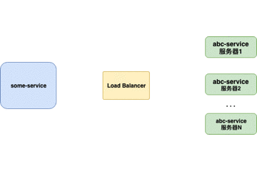
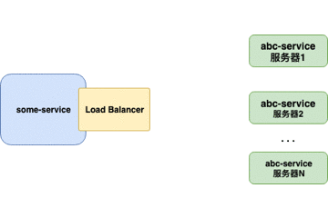
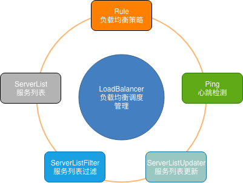
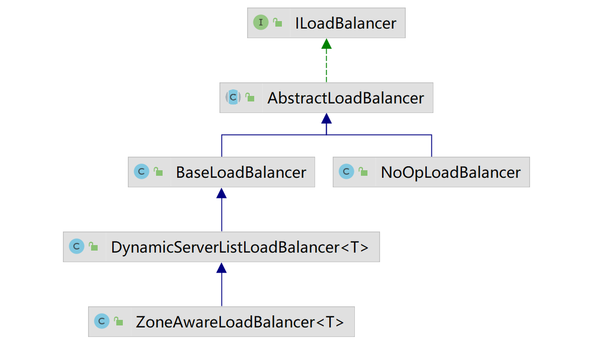
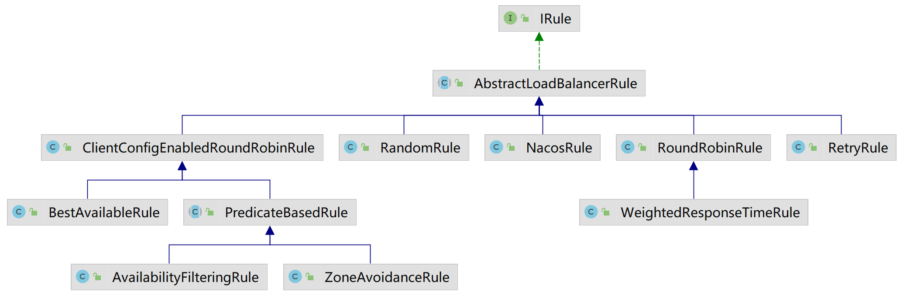
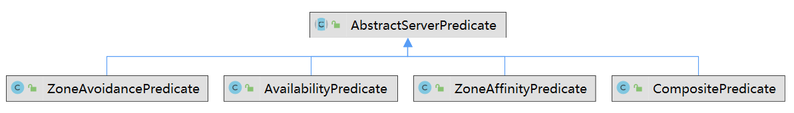
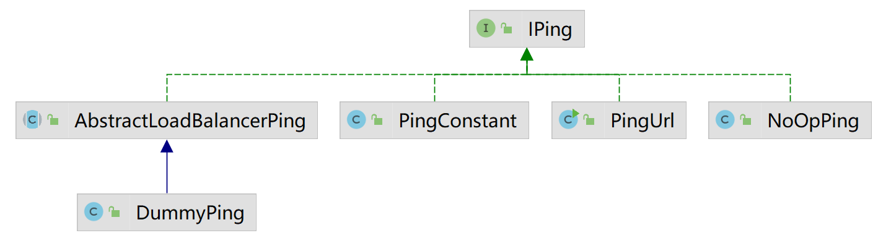
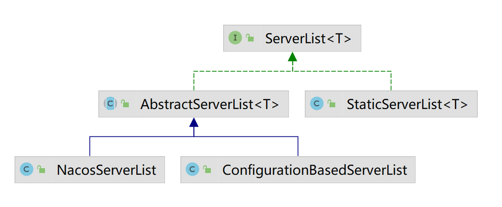
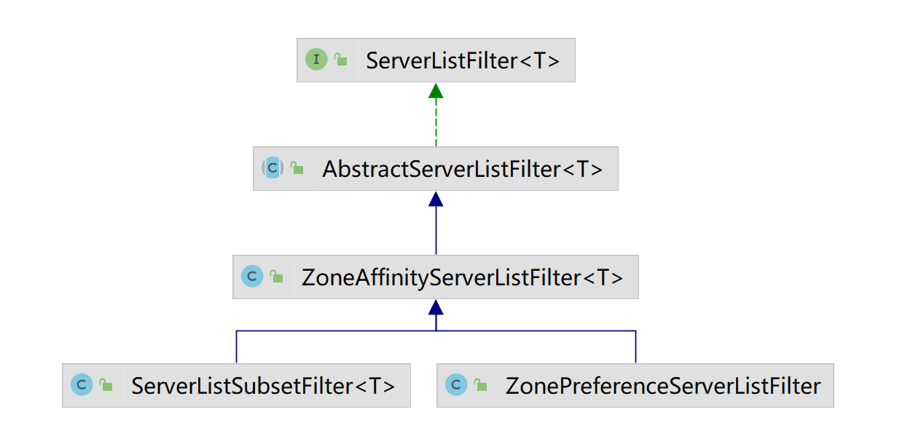

# Spring Cloud Ribbon 源码解析


## 负载均衡

负载均衡，英文名称为Load Balance，其含义就是指将负载（工作任务）进行平衡、分摊到多个操作单元上进行运行，例如FTP服务器、Web服务器、企业核心应用服务器和其它主要任务服务器等，从而协同完成工作任务。

负载均衡构建在原有网络结构之上，它提供了一种透明且廉价有效的方法扩展服务器和网络设备的带宽、加强网络数据处理能力、增加吞吐量、提高网络的可用性和灵活性。

### 服务器端负载均衡器

传统上，Load Balancers（例如Nginx、F5）是放置在服务器端的组件。当请求来自 **客户端** 时，它们将转到负载均衡器，负载均衡器将为请求指定 **服务器**。负载均衡器使用的最简单的算法是随机指定。在这种情况下，大多数负载平衡器是用于控制负载平衡的硬件集成软件。



重点：

- 对客户端不透明，客户端不知道服务器端的服务列表，甚至不知道自己发送请求的目标地址存在负载均衡器。
- 服务器端维护负载均衡服务器，控制负载均衡策略和算法。

### 客户端负载均衡器

当负载均衡器位于 **客户端** 时，**客户端**得到可用的服务器列表然后按照特定的负载均衡策略,分发请求到不同的 **服务器** 。



重点：

- 对客户端透明，客户端需要知道服务器端的服务列表，需要自行决定请求要发送的目标地址。
- 客户端维护负载均衡服务器，控制负载均衡策略和算法。
- 目前单独提供的客户端实现比较少，大部分都是在框架内部自行实现。


## Spring Cloud Ribbon 简介

Ribbon是Netflix公司开源的一个客户单负载均衡的项目，可以自动与 Eureka 进行交互。它提供下列特性：

- 负载均衡
- 容错
- 以异步和反应式模型执行多协议 (HTTP, TCP, UDP)
- 缓存和批量

## Spring Cloud Ribbon中的关键组件



- **ServerList**：可以响应客户端的特定服务的服务器列表。

- **ServerListFilter**：可以动态获得的具有所需特征的候选服务器列表的过滤器。

- **ServerListUpdater**：用于执行动态服务器列表更新。

- **Rule**：负载均衡策略，用于确定从服务器列表返回哪个服务器。

- **Ping**：客户端用于快速检查服务器当时是否处于活动状态。

- **LoadBalancer**：负载均衡器，负责负载均衡调度的管理。

## Spring Cloud Ribbon简单使用

通常情况下，将RestTemplate和Ribbon结合使用，例如：

```java
@Configuration
public class RibbonConfig {
    @Bean
    @LoadBalanced
    RestTemplate restTemplate() {
        return new RestTemplate();
    }
}
```

消费端调用服务端接口：

```java
@Service
public class RibbonService {
	
    @Autowired
    @LoadBalanced
    private RestTemplate restTemplate;
    
    public String hi(String name) {
        return restTemplate.getForObject("http://service-hi/hi?name="+name,String.class);
    }
}
```

在自动注入时，只会将标注了`@LoadBalanced`注解的RestTemplate对象注入进来。那么`@LoadBalanced`是如何做到的呢？我们来看一下源码：

```java
@Target({ ElementType.FIELD, ElementType.PARAMETER, ElementType.METHOD })
@Retention(RetentionPolicy.RUNTIME)
@Documented
@Inherited
@Qualifier
public @interface LoadBalanced {

}
```

可以看到在LoadBalanced的定义上添加了`@Qualifier`注解，由此实现了对`RestTemplate`对象的标记。下面我们就来看看，Spring Cloud Ribbon是如何实现客户端的负载均衡的。

## Spring Cloud Ribbon自动装配

根据Spring Boot的自动装配原则，我们直接去查看spring-cloud-netflix-ribbon-2.2.9.RELEASE.jar包下的META_INF目录中的spring.factories文件：

```properties
org.springframework.boot.autoconfigure.EnableAutoConfiguration=\
org.springframework.cloud.netflix.ribbon.RibbonAutoConfiguration
```

可以看到，Ribbon的自动装配类为`RibbonAutoConfiguration`，下面我们来看一下`RibbonAutoConfiguration`的定义：

```java
@Configuration
@Conditional(RibbonAutoConfiguration.RibbonClassesConditions.class)
@RibbonClients
@AutoConfigureAfter(name = "org.springframework.cloud.netflix.eureka.EurekaClientAutoConfiguration")
@AutoConfigureBefore({ LoadBalancerAutoConfiguration.class, AsyncLoadBalancerAutoConfiguration.class })
@EnableConfigurationProperties({ RibbonEagerLoadProperties.class, ServerIntrospectorProperties.class })
@ConditionalOnProperty(value = "spring.cloud.loadbalancer.ribbon.enabled", havingValue = "true", matchIfMissing = true)
public class RibbonAutoConfiguration {

}
```


### RibbonAutoConfiguration上的注解

下面来挨个分析这个自动装配类上标记的注解：

#### @Configuration： 

标明这个一个配置类

#### @Conditional

自动装配的条件，条件类为`RibbonAutoConfiguration.RibbonClassesConditions.class`

```java
static class RibbonClassesConditions extends AllNestedConditions {
    RibbonClassesConditions() {
        // 该参数表示解析该注解的时机是在向容器中注入bean的时候记性解析。
        super(ConfigurationPhase.PARSE_CONFIGURATION);
    }

    @ConditionalOnClass(IClient.class)
    static class IClientPresent {    }

    @ConditionalOnClass(RestTemplate.class)
    static class RestTemplatePresent {    }

    @SuppressWarnings("deprecation")
    @ConditionalOnClass(AsyncRestTemplate.class)
    static class AsyncRestTemplatePresent {    }

    @ConditionalOnClass(Ribbon.class)
    static class RibbonPresent {    }
}
```

该条件装配类继承自`AllNestedConditions`，表示该类定义的所有内部类的条件注解都必须满足。即当前环境必须存在这几个类：IClient、RestTemplate、AsyncRestTemplate、Ribbon。

#### @RibbonClients

```java
@Configuration(proxyBeanMethods = false)
@Retention(RetentionPolicy.RUNTIME)
@Target({ ElementType.TYPE })
@Documented
@Import(RibbonClientConfigurationRegistrar.class)
public @interface RibbonClients {
	RibbonClient[] value() default {};
	Class<?>[] defaultConfiguration() default {};
}
```

该注解引入了`RibbonClientConfigurationRegistrar.class`类，该类负责对`@RibbonClients`及`@RibbonClient`两种注解的解析。

```java
public class RibbonClientConfigurationRegistrar implements ImportBeanDefinitionRegistrar {

	@Override
	public void registerBeanDefinitions(AnnotationMetadata metadata, BeanDefinitionRegistry registry) {
		// 解析@RibbonClients
        Map<String, Object> attrs = metadata.getAnnotationAttributes(RibbonClients.class.getName(), true);
		if (attrs != null && attrs.containsKey("value")) {
			AnnotationAttributes[] clients = (AnnotationAttributes[]) attrs.get("value");
			for (AnnotationAttributes client : clients) {
				registerClientConfiguration(registry, getClientName(client), client.get("configuration"));
			}
		}
		if (attrs != null && attrs.containsKey("defaultConfiguration")) {
			String name;
			if (metadata.hasEnclosingClass()) {
				name = "default." + metadata.getEnclosingClassName();
			} else {
				name = "default." + metadata.getClassName();
			}
			registerClientConfiguration(registry, name, attrs.get("defaultConfiguration"));
		}
        // 解析@RibbonClients
		Map<String, Object> client = metadata.getAnnotationAttributes(RibbonClient.class.getName(), true);
		String name = getClientName(client);
		if (name != null) {
            // 注册客户端配置
			registerClientConfiguration(registry, name, client.get("configuration"));
		}
	}

	private String getClientName(Map<String, Object> client) {
		if (client == null) {
			return null;
		}
		String value = (String) client.get("value");
		if (!StringUtils.hasText(value)) {
			value = (String) client.get("name");
		}
		if (StringUtils.hasText(value)) {
			return value;
		}
		throw new IllegalStateException("Either 'name' or 'value' must be provided in @RibbonClient");
	}

	private void registerClientConfiguration(BeanDefinitionRegistry registry, Object name,
			Object configuration) {
		BeanDefinitionBuilder builder = BeanDefinitionBuilder.genericBeanDefinition(RibbonClientSpecification.class);
		builder.addConstructorArgValue(name);
		builder.addConstructorArgValue(configuration);
		registry.registerBeanDefinition(name + ".RibbonClientSpecification", builder.getBeanDefinition());
	}
}
```

从上面的代码可以看到，最后注册的bean的类型都是`RibbonClientSpecification`类型。

#### @AutoConfigureAfter

这个注解是用来控制自动装配类的加载顺序的，先加载该注解中引入的自动配置类，在加载当前的自动配置类。该注解中引入的自动装配类`EurekaClientAutoConfiguration`是用来自动装配Eureka的，目前没有用到。


#### @AutoConfigureBefore

控制自动装配类的加载顺序，在加载完当前自动装配类后在记载该注解中的自动装配类。该注解中引入的连个配置类LoadBalancerAutoConfiguration.class, AsyncLoadBalancerAutoConfiguration.class 后面在介绍。


#### @EnableConfigurationProperties

这个是用来启用配置项的。


#### @ConditionalOnProperty

启用条件，默认是启用的。


### RibbonAutoConfiguration

上面讲解了一些自动动装配类`RibbonAutoConfiguration`上的条件注解，下面来看看这个自动装配类注入了那些bean。

```java
@Autowired(required = false)
private List<RibbonClientSpecification> configurations = new ArrayList<>();

@Autowired
private RibbonEagerLoadProperties ribbonEagerLoadProperties;
```

这两个自动注入的属性是通过上面的注解加载的，configurations是在解析@RibbonClients注解时注入的bean，而ribbonEagerLoadProperties是激活的配置类。


```java
@Bean
@ConditionalOnMissingBean
public SpringClientFactory springClientFactory() {
    SpringClientFactory factory = new SpringClientFactory();
    factory.setConfigurations(this.configurations);
    return factory;
}
```

TODO  


```java
@Bean
@ConditionalOnMissingBean(LoadBalancerClient.class)
public LoadBalancerClient loadBalancerClient() {
    return new RibbonLoadBalancerClient(springClientFactory());
}
```

这里加载LoadBalancerClient的实例，默认实现为`RibbonLoadBalancerClient`


注入RestTemplate的定制器，

```java
@Configuration(proxyBeanMethods = false)
@ConditionalOnClass(HttpRequest.class)
@ConditionalOnRibbonRestClient
protected static class RibbonClientHttpRequestFactoryConfiguration {

    @Autowired
    private SpringClientFactory springClientFactory;

    @Bean
    public RestTemplateCustomizer restTemplateCustomizer(
        final RibbonClientHttpRequestFactory ribbonClientHttpRequestFactory) {
        return restTemplate -> restTemplate
            .setRequestFactory(ribbonClientHttpRequestFactory);
    }

    @Bean
    public RibbonClientHttpRequestFactory ribbonClientHttpRequestFactory() {
        return new RibbonClientHttpRequestFactory(this.springClientFactory);
    }

}
```


注入PropertiesFactory

```java
@Bean
@ConditionalOnMissingBean
public PropertiesFactory propertiesFactory() {
   return new PropertiesFactory();
}
```


### LoadBalancerAutoConfiguration


## Spring Cloud Ribbon的负载均衡器

负载均衡器的作用就是协调其他组件，完成负载均衡的调度管理功能。Ribbon中负载均衡器的核心接口定义为`ILoadBalancer`，提供了对服务器操作的一组方法。

```java
public interface ILoadBalancer {
	/**
	 * 添加新的服务列表
	 */
	public void addServers(List<Server> newServers);
	
	/**
	 * 根据key通过负载均衡器选个一个服务
	 */
	public Server chooseServer(Object key);
	
	/**
	 * 由客户端回调，用来标记某个服务下线
	 */
	public void markServerDown(Server server);

	/**
	 * 获取可用的服务列表
     */
    public List<Server> getReachableServers();

    /**
     * 获取所有服务列表，包含可用和不可用
     */
	public List<Server> getAllServers();
}
```

其直接抽象实现为`AbstractLoadBalancer`，只是定义了两个新的方法，并没有什么具体的实现。

```java
public abstract class AbstractLoadBalancer implements ILoadBalancer {
    
    public enum ServerGroup{
        ALL,
        STATUS_UP,
        STATUS_NOT_UP        
    }
        
    /**
     * 定义一个空参数的chooseServer()
     */
    public Server chooseServer() {
    	return chooseServer(null);
    }

    /**
     * 根据服务分组获取服务列表
     */
    public abstract List<Server> getServerList(ServerGroup serverGroup);
    
    /**
     * 获取loadBalancer的统计信息
     * 子类可以根据server的健康状态来获取健康的server
     */
    public abstract LoadBalancerStats getLoadBalancerStats();    
}
```

下面来看看LoadBalancer的实现类图：




### NoOpLoadBalancer

这个就是我未做任何实现的实现，方法返回的不是null，就是空列表。源码就不在这里粘了。


### BaseLoadBalancer

这个负载均衡器是Ribbon中最基础的一个负载均衡器，提供了负载均衡的基本能力。其他的负载均衡器都是在此基础上进行扩展的。

首先来看看该负载均衡器中的一些基础属性：

```java
// 默认的负载均衡规则，轮询
private final static IRule DEFAULT_RULE = new RoundRobinRule();
// 默认的心跳检查策略
private final static SerialPingStrategy DEFAULT_PING_STRATEGY = new SerialPingStrategy();
private static final String DEFAULT_NAME = "default";
private static final String PREFIX = "LoadBalancer_";
// 负载均衡规则
protected IRule rule = DEFAULT_RULE;
// 心跳检查策略
protected IPingStrategy pingStrategy = DEFAULT_PING_STRATEGY;
// 心跳检查
protected IPing ping = null;
// 所有 server 列表
protected volatile List<Server> allServerList = Collections.synchronizedList(new ArrayList<Server>());
// 可用的 server 列表
protected volatile List<Server> upServerList = Collections.synchronizedList(new ArrayList<Server>());

protected ReadWriteLock allServerLock = new ReentrantReadWriteLock();
protected ReadWriteLock upServerLock = new ReentrantReadWriteLock();

protected String name = DEFAULT_NAME;
// 定时器，用于启动心跳任务
protected Timer lbTimer = null;
// ping 间隔时间，可以通过配置修改，<clientName>.<nameSpace>.NFLoadBalancerPingInterval
protected int pingIntervalSeconds = 10;
// 每次ping的最长时间，可通过配置修改，<>.<>.NFLoadBalancerMaxTotalPingTime
protected int maxTotalPingTimeSeconds = 5;
protected Comparator<Server> serverComparator = new ServerComparator();
// 表示Ping 是否正在进行
protected AtomicBoolean pingInProgress = new AtomicBoolean(false);
// 统计信息
protected LoadBalancerStats lbStats;

private volatile Counter counter = Monitors.newCounter("LoadBalancer_ChooseServer");

private PrimeConnections primeConnections;

private volatile boolean enablePrimingConnections = false;

private IClientConfig config;
// 一个监听器列表
private List<ServerListChangeListener> changeListeners = new CopyOnWriteArrayList<ServerListChangeListener>();

private List<ServerStatusChangeListener> serverStatusListeners = new CopyOnWriteArrayList<ServerStatusChangeListener>();
```


### DynamicServerListLoadBalancer


### ZoneAwareLoadBalancer


## Spring Cloud Ribbon的负载均衡策略

Ribbon中负载均衡策略的抽象接口定义为`IRule`，下面来看看接口定义：

```java
public interface IRule{
    /*
     *根据key从存活的服务列表中选择一个
     */
    public Server choose(Object key);
    // 设置负载均衡器
    public void setLoadBalancer(ILoadBalancer lb);
    // 获取负载均衡器
    public ILoadBalancer getLoadBalancer();    
}
```

接口`AbstractLoadBalancerRule`是IRule的直接抽象类实现

```java
public abstract class AbstractLoadBalancerRule implements IRule, IClientConfigAware {
    private ILoadBalancer lb;
    @Override
    public void setLoadBalancer(ILoadBalancer lb){
        this.lb = lb;
    }
    @Override
    public ILoadBalancer getLoadBalancer(){
        return lb;
    }      
}
```

我们可以看到，其除了实现了一个IClientConfigAware接口，以及实现了负载均衡器的存取外，并没有什么具体的实现。好了，下面来看看IRule接口有哪些具体的实现类：



### 负载均衡策略概述

- **ClientConfigEnableRoundRobinRule**： 轮询
- **BestAvailableRule**：选择具有最低并发请求的服务器。
- **RandomRule**：随机选择一个服务器。
- **RoundRobinRule**：轮询选择服务器。
- **RetryRule**：具备重试机制的轮询。
- **WeightedResponseTimeRule**：根据使用平均响应时间去分配一个weight（权重） ，weight越低，被选择的可能性就越低。
- **ZoneAvoidanceRule**：根据区域和可用性筛选，再轮询选择服务器。

下面依次介绍没法负载均衡器的实现。


### RandomRule

随机选择，这个策略在实现上比较简单，就是先获取服务列表，通过`ThreadLocalRandom`生成一个server数量以内的随机数，然后判断一下对应的server是否存活，如果存活，就直接返回。如果服务已经down掉了，就循环这个过程

下面来看一下核心源码实现：

```java
public class RandomRule extends AbstractLoadBalancerRule {

    /** 从存活的服务中随机选择一个 */
    public Server choose(ILoadBalancer lb, Object key) {
        if (lb == null) {
            return null;
        }
        Server server = null;

        while (server == null) {
            if (Thread.interrupted()) {
                return null;
            }
            // 获取存活的服务列表
            List<Server> upList = lb.getReachableServers();
            // 获取所有服务列表
            List<Server> allList = lb.getAllServers();

            int serverCount = allList.size();
            if (serverCount == 0) {
               // 没有服务，返回null
                return null;
            }
			// 产生一个随机数
            int index = chooseRandomInt(serverCount);
            server = upList.get(index);

            if (server == null) {
                /*server为空，可能是该服务已经不可用了，继续选择 */
                Thread.yield();
                continue;
            }
            if (server.isAlive()) {
             	// server为存活状态，直接返回
                return (server);
            }
            // 到这里说明server已经不可打了，设置为null
            server = null;
            Thread.yield();
        }
        return server;
    }
	// 用来产生随机数
    protected int chooseRandomInt(int serverCount) {
        return ThreadLocalRandom.current().nextInt(serverCount);
    }
}
```


### RoundRobinRule

轮询模式，使用一个整数与server列表的长度进行取余，来完成轮询操作。轮询成功，对整数进行加1操作。下面来看一下源码实现：

```java
public class RoundRobinRule extends AbstractLoadBalancerRule {
	// 通过这个变量自增，与server数量取模，来完成轮询逻辑
    private AtomicInteger nextServerCyclicCounter;

    public RoundRobinRule() {
        nextServerCyclicCounter = new AtomicInteger(0);
    }

    public RoundRobinRule(ILoadBalancer lb) {
        this();
        setLoadBalancer(lb);
    }
	// 这里是核心实现
    public Server choose(ILoadBalancer lb, Object key) {
        if (lb == null) {
            log.warn("no load balancer");
            return null;
        }

        Server server = null;
        int count = 0;
        while (server == null && count++ < 10) {
            // 获取可用的服务列表
            List<Server> reachableServers = lb.getReachableServers();
            // 获取全部服务列表
            List<Server> allServers = lb.getAllServers();
            int upCount = reachableServers.size();
            int serverCount = allServers.size();
			// 首先判断是否有可用的服务
            if ((upCount == 0) || (serverCount == 0)) {
                log.warn("No up servers available from load balancer: " + lb);
                return null;
            }
            // 通过自增取模，来获取下一个server
            int nextServerIndex = incrementAndGetModulo(serverCount);
            server = allServers.get(nextServerIndex);
            if (server == null) {
                /* server 为null 说明该服务可能出问题了 */
                Thread.yield();
                continue;
            }
			// 检查server是否存活，并且为提供服务做好准备
            if (server.isAlive() && (server.isReadyToServe())) {
                return (server);
            }
            // server已死，置空
            server = null;
        }
		// 轮询大于10次打印一个warning日志。
        if (count >= 10) {
            log.warn("No available alive servers after 10 tries from load balancer: " + lb);
        }
        return server;
    }

    /**
     * 获取下一个server的index，这里使用CAS+死循环的方式保证并发安全。
     */
    private int incrementAndGetModulo(int modulo) {
        for (;;) {
            int current = nextServerCyclicCounter.get();
            int next = (current + 1) % modulo;
            if (nextServerCyclicCounter.compareAndSet(current, next))
                return next;
        }
    }
}
```


### RetryRule

重试策略，针对现有负载均衡策略，添加重试逻辑。该策略的默认负载逻辑是轮询，可以通过set方法或构造方法进行修改。在给定的时间内无限次重试。

下面来看看核心源码实现(省略了一下不重要的逻辑)：

```java
public class RetryRule extends AbstractLoadBalancerRule {
    // 默认的级联策略是 轮询策略，该参数可以通过构造函数或set方法进行设置
	IRule subRule = new RoundRobinRule();
    // 最大重试毫秒数，当总的执行时间超过500毫秒后，停止重试。默认500毫秒
	long maxRetryMillis = 500;

	/* 选择一个server*/
	public Server choose(ILoadBalancer lb, Object key) {
        // 重试开始时间
		long requestTime = System.currentTimeMillis();
        // 重试截止时间
		long deadline = requestTime + maxRetryMillis;

		Server answer = null;
		// 首先使用级联的策略选择负载策略
		answer = subRule.choose(key);
		// 如果answer无效 并且 未到deadline，执行重试逻辑
		if (((answer == null) || (!answer.isAlive())) && (System.currentTimeMillis() < deadline)) {
			InterruptTask task = new InterruptTask(deadline - System.currentTimeMillis());
			// 只要执行时间为超过 maxRetryMillis, 就无限次重试。
			while (!Thread.interrupted()) {
				answer = subRule.choose(key);
				if (((answer == null) || (!answer.isAlive())) && (System.currentTimeMillis() < deadline)) {
					/* 让出cpu */
					Thread.yield();
				} else {
					break;
				}
			}
			task.cancel();
		}
		if ((answer == null) || (!answer.isAlive())) {
			return null;
		} else {
			return answer;
		}
	}
}
```


### ClientConfigEnabledRoundRobinRule

该负载均衡策略内部使用的是轮询策略。这里没什么好说的。这里使用了一个组合模式

下面看看源码实现：

```java
public class ClientConfigEnabledRoundRobinRule extends AbstractLoadBalancerRule {

    RoundRobinRule roundRobinRule = new RoundRobinRule();

    @Override
    public void initWithNiwsConfig(IClientConfig clientConfig) {
        roundRobinRule = new RoundRobinRule();
    }

    @Override
    public void setLoadBalancer(ILoadBalancer lb) {
    	super.setLoadBalancer(lb);
    	roundRobinRule.setLoadBalancer(lb);
    }
    
    @Override
    public Server choose(Object key) {
        if (roundRobinRule != null) {
            return roundRobinRule.choose(key);
        } else {
            throw new IllegalArgumentException("This class has not been initialized with the RoundRobinRule class");
        }
    }
}
```


### WeightedResponseTimeRule


以响应时间作为权重，进行负载分配。这里先介绍一些算法的实现，然后在看代码就很好理解了。

假设有A、B、C、D第个实例，平均响应时间是10,20,30,50，相加得到的总响应时间是100。每个实例的权重是总响应时间-自身响应时间，可得如下：

- A：100 - 10 = 90；
- B：90 + 100 - 20 = 170；
- C：170 + 100 - 30 = 240；
- D： 240 + 100 - 50 = 290；

则每个实例的权重空间为：

- A：[0, 90]
- B：[90, 170]
- C：[170, 240]
- D：[240, 290]

在获取实例的时候，通过290乘以一个0到1直接的随机数，这个随机数落到那个区间，就选取那个实例。好了，下面我们来看一下计算权重的源码实现：

```java {49-88}
public class WeightedResponseTimeRule extends RoundRobinRule {
	// 定时任务的默认间隔时间间隔时间
    public static final int DEFAULT_TIMER_INTERVAL = 30 * 1000;
    // 定时任务的时间间隔
    private int serverWeightTaskTimerInterval = DEFAULT_TIMER_INTERVAL;
    // 定时任务调度器
    protected Timer serverWeightTimer = null;
    
    // 设置负载均衡器
    public void setLoadBalancer(ILoadBalancer lb) {
        super.setLoadBalancer(lb);
        if (lb instanceof BaseLoadBalancer) {
            name = ((BaseLoadBalancer) lb).getName();
        }
        initialize(lb);
    }
    
    void initialize(ILoadBalancer lb) {        
        if (serverWeightTimer != null) {
            serverWeightTimer.cancel();
        }
        // 初始化一个定时调度器
        serverWeightTimer = new Timer("NFLoadBalancer-serverWeightTimer-" + name, true);
        // 提交定时任务
        serverWeightTimer.schedule(new DynamicServerWeightTask(), 0, serverWeightTaskTimerInterval);
        // 初始化运行
        ServerWeight sw = new ServerWeight();
        sw.maintainWeights();
		// 停止任务的钩子方法
        Runtime.getRuntime().addShutdownHook(new Thread(new Runnable() {
            public void run() {
                logger.info("Stopping NFLoadBalancer-serverWeightTimer-" + name);
                serverWeightTimer.cancel();
            }
        }));
    }
	// 定时任务类
    class DynamicServerWeightTask extends TimerTask {
        public void run() {
            ServerWeight serverWeight = new ServerWeight();
            try {
                serverWeight.maintainWeights();
            } catch (Exception e) {
                logger.error("Error running DynamicServerWeightTask for {}", name, e);
            }
        }
    }
	// 这里就是具体计算权重的类了。
    class ServerWeight {
        public void maintainWeights() {
            ILoadBalancer lb = getLoadBalancer();
            if (lb == null) {
                return;
            }
            // 通过cas来加锁
            if (!serverWeightAssignmentInProgress.compareAndSet(false,  true))  {
                return; 
            }
            
            try {
                AbstractLoadBalancer nlb = (AbstractLoadBalancer) lb;
                LoadBalancerStats stats = nlb.getLoadBalancerStats();
                if (stats == null) {
                    return;
                }
                double totalResponseTime = 0;
                // 对所有服务的平均响应时间求和
                for (Server server : nlb.getAllServers()) {
                    ServerStats ss = stats.getSingleServerStat(server);
                    totalResponseTime += ss.getResponseTimeAvg();
                }
                Double weightSoFar = 0.0;
                // 计算权重
                List<Double> finalWeights = new ArrayList<Double>();
                for (Server server : nlb.getAllServers()) {
                    ServerStats ss = stats.getSingleServerStat(server);
                    double weight = totalResponseTime - ss.getResponseTimeAvg();
                    weightSoFar += weight;
                    finalWeights.add(weightSoFar);   
                }
                setWeights(finalWeights);
            } catch (Exception e) {
                logger.error("Error calculating server weights", e);
            } finally {
                serverWeightAssignmentInProgress.set(false);
            }
        }
    }    
}
```

下面来看服务选择的源码实现：

```java
public class WeightedResponseTimeRule extends RoundRobinRule {
    @Override
    public Server choose(ILoadBalancer lb, Object key) {
        if (lb == null) {
            return null;
        }
        Server server = null;
        while (server == null) {
            // 定时任务计算出的权重列表
            List<Double> currentWeights = accumulatedWeights;
            if (Thread.interrupted()) {
                return null;
            }
            List<Server> allList = lb.getAllServers();
            int serverCount = allList.size();
            if (serverCount == 0) {
                return null;
            }
            int serverIndex = 0;
            // 获取到权重的最大值
            double maxTotalWeight = currentWeights.size() == 0 ? 0 : currentWeights.get(currentWeights.size() - 1); 
            // 判断权重是否有效，
            if (maxTotalWeight < 0.001d || serverCount != currentWeights.size()) {
                // 如果权重不可用的话，这里选择轮询策略
                server =  super.choose(getLoadBalancer(), key);
                if(server == null) {
                    return server;
                }
            } else {
                // 这里计算权重，使用最大数乘以一个0到1直接的随机值，结果落到那个区间，就选取区间对应的实例
                double randomWeight = random.nextDouble() * maxTotalWeight;
                int n = 0;
                for (Double d : currentWeights) {
                    if (d >= randomWeight) {
                        serverIndex = n;
                        break;
                    } else {
                        n++;
                    }
                }
                server = allList.get(serverIndex);
            }
			// 老套路，如果server 为null 就再来一遍
            if (server == null) {
                Thread.yield();
                continue;
            }
            // 如果server 存活着，直接返回
            if (server.isAlive()) {
                return (server);
            }
            // 到这里，说明server已经死了。设为null
            server = null;
        }
        return server;
    }
}   
```


### BestAvailableRule

该策略会选择一个响应最快的server返回。

```java
public class BestAvailableRule extends ClientConfigEnabledRoundRobinRule {
    private LoadBalancerStats loadBalancerStats;
    @Override
    public Server choose(Object key) {
        if (loadBalancerStats == null) {
            return super.choose(key);
        }
        List<Server> serverList = getLoadBalancer().getAllServers();
        int minimalConcurrentConnections = Integer.MAX_VALUE;
        long currentTime = System.currentTimeMillis();
        Server chosen = null;
        for (Server server: serverList) {
            ServerStats serverStats = loadBalancerStats.getSingleServerStat(server);
            if (!serverStats.isCircuitBreakerTripped(currentTime)) {
                int concurrentConnections = serverStats.getActiveRequestsCount(currentTime);
                if (concurrentConnections < minimalConcurrentConnections) {
                    minimalConcurrentConnections = concurrentConnections;
                    chosen = server;
                }
            }
        }
        if (chosen == null) {
            return super.choose(key);
        } else {
            return chosen;
        }
    }

    @Override
    public void setLoadBalancer(ILoadBalancer lb) {
        super.setLoadBalancer(lb);
        if (lb instanceof AbstractLoadBalancer) {
            loadBalancerStats = ((AbstractLoadBalancer) lb).getLoadBalancerStats();            
        }
    }
}
```


### ZoneAvoidanceRule

这个是Ribbon中最重要的一个负载均衡策略，该策略是Spring Cloud自动装配是的默认选项。

该类继承自`PredicateBasedRule`，老规矩，先来看看父类的定义：

```java
public abstract class PredicateBasedRule extends ClientConfigEnabledRoundRobinRule {
   
    public abstract AbstractServerPredicate getPredicate();
        
    @Override
    public Server choose(Object key) {
        ILoadBalancer lb = getLoadBalancer();
        // 注意 getPredicate() 是一个抽象方法
        Optional<Server> server = getPredicate().chooseRoundRobinAfterFiltering(lb.getAllServers(), key);
        if (server.isPresent()) {
            return server.get();
        } else {
            return null;
        }       
    }
}
```

该类重写了choose方法，在方法中调用了`AbstractServerPredicate#chooseRoundRobinAfterFiltering`方法，来看看这个源码：

```java
// AbstractServerPredicate#chooseRoundRobinAfterFiltering
public Optional<Server> chooseRoundRobinAfterFiltering(List<Server> servers, Object loadBalancerKey) {
    // 获取符合条件的server集合
    List<Server> eligible = getEligibleServers(servers, loadBalancerKey);
    if (eligible.size() == 0) {
        return Optional.absent();
    }
    // 这里实现了一个轮询功能
    return Optional.of(eligible.get(incrementAndGetModulo(eligible.size())));
}
// 轮询的具体实现
private int incrementAndGetModulo(int modulo) {
    for (;;) {
        int current = nextIndex.get();
        int next = (current + 1) % modulo;
        if (nextIndex.compareAndSet(current, next) && current < modulo)
            return current;
    }
}
```

可以看到该方法首先调用`getEligibleServers`方法过滤出合适的server列表，然后通过一个简单的轮询来选择了一个server进行返回，那么这个符合条件的server集合是如何选出的呢？下面来看看代码：

```java
// AbstractServerPredicate#getEligibleServers
private final Predicate<Server> serverOnlyPredicate =  new Predicate<Server>() {
    @Override
    public boolean apply(@Nullable Server input) {                    
        return AbstractServerPredicate.this.apply(new PredicateKey(input));
    }
};

public List<Server> getEligibleServers(List<Server> servers, Object loadBalancerKey) {
    if (loadBalancerKey == null) {
        return ImmutableList.copyOf(Iterables.filter(servers, this.getServerOnlyPredicate()));            
    } else {
        List<Server> results = Lists.newArrayList();
        for (Server server: servers) {
            if (this.apply(new PredicateKey(loadBalancerKey, server))) {
                results.add(server);
            }
        }
        return results;            
    }
}

public Predicate<Server> getServerOnlyPredicate() {
    return serverOnlyPredicate;
}
```

观察上面的方法，不管loadBalancerKey是否为null，最后都是把server封装到PredicateKey的实例中(区别在于如果loadBalancerKey不为null的话，会把loadBalancerKey也封装到PredicateKey中)，然后调用this.apply()方法进行判断，但是apply方法，在这个类中并没有实现，所以这个任务就落到子类中。下面来看看AbstractServerPredicate的实现类图：



这里就不卖关子了，在ZoneAvoidanceRule中，使用了ZoneAvoidancePredicate和AvailabilityPredicate两个实现类，另外也使用了一个在AbstractServerPredicate内部实现的内部类。

CompositePredicate是一个组合模式的实现

ZoneAffinityPredicate在服务列表过滤器中有使用到，具体的信息可以参考过滤器ZoneAffinityServerListFilter。

下面我们就来看看ZoneAvoidanceRule是如何使用Predicate的。首先来看看构造函数以及抽象实现方法：

```java
public class ZoneAvoidanceRule extends PredicateBasedRule {

    private static final Random random = new Random(); 
    // 组合模式
    private CompositePredicate compositePredicate;
    
    public ZoneAvoidanceRule() {
        super();
        ZoneAvoidancePredicate zonePredicate = new ZoneAvoidancePredicate(this);
        AvailabilityPredicate availabilityPredicate = new AvailabilityPredicate(this);
        compositePredicate = createCompositePredicate(zonePredicate, availabilityPredicate);
    }
    
    private CompositePredicate createCompositePredicate(ZoneAvoidancePredicate p1, AvailabilityPredicate p2) {
        // 在这里构造成最终使用的Predicate
        return CompositePredicate.withPredicates(p1, p2)
                             .addFallbackPredicate(p2)
                             .addFallbackPredicate(AbstractServerPredicate.alwaysTrue())
                             .build();
    }

    @Override
    public AbstractServerPredicate getPredicate() {
        return compositePredicate;
    }    
}
```

再来看看CompositePredicate的核心代码实现：

```java
public class CompositePredicate extends AbstractServerPredicate {

    private AbstractServerPredicate delegate;
    
    private List<AbstractServerPredicate> fallbacks = Lists.newArrayList();
        
    private int minimalFilteredServers = 1;
    
    private float minimalFilteredPercentage = 0;    
    
    @Override
    public boolean apply(@Nullable PredicateKey input) {
        return delegate.apply(input);
    }

    @Override
    public List<Server> getEligibleServers(List<Server> servers, Object loadBalancerKey) {
        List<Server> result = super.getEligibleServers(servers, loadBalancerKey);
        Iterator<AbstractServerPredicate> i = fallbacks.iterator();
        while (!(result.size() >= minimalFilteredServers && result.size() > (int) (servers.size() * minimalFilteredPercentage))
                && i.hasNext()) {
            AbstractServerPredicate predicate = i.next();
            result = predicate.getEligibleServers(servers, loadBalancerKey);
        }
        return result;
    }
}
```

到这里ZoneAvoidanceRule的实现流程大致就清晰了。首先调用服务选择会从chose方法进入，在chose方法中有这样一条语句，`getPredicate().chooseRoundRobinAfterFiltering(lb.getAllServers(), key);`，这里会返回CompositePredicate对象，里面组合了两个Predicate，分别是ZoneAvoidancePredicate和AvailabilityPredicate，然后调用CompositePredicate中的过滤方法，最终会通过这两个Predicate中的apply方法进行判定。

下面我们就正式来分析过滤逻辑

**ZoneAvoidancePredicate**


**AvailabilityPredicate**


## Spring Cloud Ribbon的心跳检测机制

`IPing`是心跳检测的顶级定义接口，下面先看看接口定义：

```java
public interface IPing {   
    /** 检查给定的服务是否处于存活状态，即在负载平衡时将其视为候选对象 */
    public boolean isAlive(Server server);
}
```

这里的定义也很简单，就是检查给定的服务是否存活。下面来看看类的实现类图：



- NoOpPing： 什么都不做
- PingConstant：通过配置参数设置服务存活状态
- DummyPing： 总是认为存活
- PingUrl：使用HttpClient构造一个HttpRequest，发起一个Get调用，如果成功，证明服务存活


下面就开始一一解析

### NoOpPing

从字面上理解，no operation ping ，就是不做任何操作。这个是Ribbon中最简单的实现，基本上没什么用。代码如下：

```java
public class NoOpPing implements IPing {
    @Override
    public boolean isAlive(Server server) {
        return true;
    }
}
```


### PingUrl

这个实现也比较简单，对给定的服务发起一个Get请求，然后判断响应是否为200，响应的结果是否服务预期。如果都符合，则服务为存活状态。

```java
public class PingUrl implements IPing {

    String pingAppendString = "";
	// 标识是否是https协议，有get/set方法，这里省略了
    boolean isSecure = false;
	// 预期的响应结果，有get/set方法，这里省略了
    String expectedContent = null;

    public PingUrl() {
    }

    public PingUrl(boolean isSecure, String pingAppendString) {
        this.isSecure = isSecure;
        this.pingAppendString = (pingAppendString != null) ? pingAppendString : "";
    }
	// 核心实现就在这里了
    public boolean isAlive(Server server) {
        // 判断协议类型，拼接url
        String urlStr   = "";
        if (isSecure){
            urlStr = "https://";
        }else{
            urlStr = "http://";
        }
        urlStr += server.getId();
        urlStr += getPingAppendString();

        boolean isAlive = false;
		// 构造HttpRequest， 并发起请求
        HttpClient httpClient = new DefaultHttpClient();
        HttpUriRequest getRequest = new HttpGet(urlStr);
        String content=null;
        try {
            HttpResponse response = httpClient.execute(getRequest);
            content = EntityUtils.toString(response.getEntity());
            // 判断响应码是否为 200
            isAlive = (response.getStatusLine().getStatusCode() == 200);
            if (getExpectedContent()!=null){
                LOGGER.debug("content:" + content);
                if (content == null){
                    isAlive = false;
                }else{
                    // 判断响应结果是否和预期一致
                    if (content.equals(getExpectedContent())){
                        isAlive = true;
                    }else{
                        isAlive = false;
                    }
                }
            }
        } catch (IOException e) {
            e.printStackTrace();
        }finally{
            // Release the connection.
            getRequest.abort();
        }
        return isAlive;
    }
}
```


### PingConstant

基于配置的实现。不知道为什么要有这么个实现。

```java
public class PingConstant implements IPing {
    // 这个用来标识是否存活， 通过代码设置
    boolean constant = true;
	// 设置存活状态
    public void setConstant(String constantStr) {
        constant = (constantStr != null) && (constantStr.toLowerCase().equals("true"));
    }
	// 设置存活状态
    public void setConstant(boolean constant) {
        this.constant = constant;
    }
	
    public boolean isAlive(Server server) {
        return constant;
    }
}
```


### DummyPing

该接口继承自AbstractLoadBalancerPing， 其实现也很简单，认为服务总是存活状态。首先看一下父类的实现：

```java
public abstract class AbstractLoadBalancerPing implements IPing, IClientConfigAware{
    AbstractLoadBalancer lb;   
    @Override
    public boolean isAlive(Server server) {
        return true;
    }    
    public void setLoadBalancer(AbstractLoadBalancer lb){
        this.lb = lb;
    }    
    public AbstractLoadBalancer getLoadBalancer(){
        return lb;
    }
}
```

再来看看该类的实现：

```java
public class DummyPing extends AbstractLoadBalancerPing {
    public DummyPing() { }
	// 默认返回true，即所有的服务都存活
    public boolean isAlive(Server server) {
        return true;
    }

    @Override
    public void initWithNiwsConfig(IClientConfig clientConfig) {
    }
}
```


## Spring Cloud Ribbon的服务列表

该组件主要提供获取服务列表的功能。`ServerList`是服务列表组件的顶级接口定义，里边只定义了两个方法，包括获取原始的服务列表，以及更新后的服务列表。

```java
public interface ServerList<T extends Server> {
    /** 返回初试的服务列表 */
    public List<T> getInitialListOfServers();
    /** 返回更新后的服务列表 */
    public List<T> getUpdatedListOfServers();   
}
```

其实现的类图如下



- **StaticServerList**： 静态的服务列表维护类。说白了就是写死的。

- **ConfigurationBasedServerList:** 基于读取Archaius配置文件来维护ServerList

- **NacosServerList：**

这里边StaticServerList是Spring Cloud提供的一个实现，NacosServerList是Nacos提供的实现。而ConfigurationBasedServerList是Ribbon提供的实现。下面我们来一一讲解。


### StaticServerList

静态服务列表，见名知意，这个服务列表在配置完成后，就不会有变动了。说白了就是基于配置固定的。实现如下：

```java
public class StaticServerList<T extends Server> implements ServerList<T> {
	private final List<T> servers;
	public StaticServerList(T... servers) {
		this.servers = Arrays.asList(servers);
	}
	@Override
	public List<T> getInitialListOfServers() {
		return servers;
	}
	@Override
	public List<T> getUpdatedListOfServers() {
		return servers;
	}
}
```


### ConfigurationBasedServerList

这个服务管理类是Ribbon提供的服务管理类。由继承关系可知，ConfigurationBasedServerList继承自AbstractServerList，而AbstractServerList由实现了ServerList接口，下面我们就来看看AbstractServerList类扩展了那些功能：

```java
public abstract class AbstractServerList<T extends Server> implements ServerList<T>, IClientConfigAware {   
    public AbstractServerListFilter<T> getFilterImpl(IClientConfig niwsClientConfig) throws ClientException{
        try {
            String niwsServerListFilterClassName = niwsClientConfig
                    .getProperty(
                            CommonClientConfigKey.NIWSServerListFilterClassName,
                            ZoneAffinityServerListFilter.class.getName())
                    .toString();
            AbstractServerListFilter<T> abstractNIWSServerListFilter = (AbstractServerListFilter<T>) 
                ClientFactory.instantiateInstanceWithClientConfig(niwsServerListFilterClassName, niwsClientConfig);
            return abstractNIWSServerListFilter;
        } catch (Throwable e) {
            ...
        }
    }
}
```

首先，该类实现了`IClientConfigAware`接口，说明他具有获取`IClientConfig`的能力。另外，他还提供了一个`getFilterImpl`方法，该方法用来获取服务列表过滤器，如果不配置，默认使用的是`ZoneAffinityServerListFilter`，如果需要配置指定的过滤器可以使用如下配置：

```properties
<clientName>.<nameSpace>.NIWSServerListFilterClassName=className
```

看完了父类，咱们接着看本类的实现

```java
public class ConfigurationBasedServerList extends AbstractServerList<Server>  {

	private IClientConfig clientConfig;
		
	@Override
	public List<Server> getInitialListOfServers() {
	    return getUpdatedListOfServers();
	}

	@Override
	public List<Server> getUpdatedListOfServers() {
        String listOfServers = clientConfig.get(CommonClientConfigKey.ListOfServers);
        return derive(listOfServers);
	}

	@Override
	public void initWithNiwsConfig(IClientConfig clientConfig) {
	    this.clientConfig = clientConfig;
	}
	
	protected List<Server> derive(String value) {
	    List<Server> list = Lists.newArrayList();
		if (!Strings.isNullOrEmpty(value)) {
			for (String s: value.split(",")) {
				list.add(new Server(s.trim()));
			}
		}
        return list;
	}
}
```

实现也很简单，可以看到`getInitialListOfServers()`方法调用的是`getUpdatedListOfServers()`方法，而`getUpdatedListOfServers()`直接从客户端配置中加载配置的服务列表。可以使用如下方法配置服务列表：

```properties
<clientName>.<nameSpace>.listOfServers= host1:port1,host2:port2
```


### NacosServerList

略


## Spring Cloud Ribbon的服务列表过滤

服务实例过滤器（ServerListFilter）为负载均衡器（Loadbalancer）提供从服务实例列表（ServerList）获取的服务实例过滤出符合要求的服务实例。

负载均衡器（Loadbalancer）通过服务实例列表(ServerList)从注册中心(register)或者配置文件（yaml或properties）上读取全部服务实例(server)，然后以服务实例过滤器(ServerListFilter)的过滤方式进行筛选留下满足条件的服务实例，进而借助负载均衡策略(IRule)选择出一个合适的服务实例。

首先来看接口定义：

```java
public interface ServerListFilter<T extends Server> {
	// 获取过滤后的服务列表
    public List<T> getFilteredListOfServers(List<T> servers);

}
```

这个接口定义特别简单，就一个方法，返回过滤后的接口信息。

下面来看一下接口的抽象实现：

```java
public abstract class AbstractServerListFilter<T extends Server> implements ServerListFilter<T> {

    private volatile LoadBalancerStats stats;
    
    public void setLoadBalancerStats(LoadBalancerStats stats) {
        this.stats = stats;
    }
    
    public LoadBalancerStats getLoadBalancerStats() {
        return stats;
    }

}
```

下面来看一下类图：




- ZoneAffinityServerListFilter:


这里面ZonePreferenceServerListFilter是SpringCloud的实现，其余为Ribbon内部的实现。下面就来看实现源码。


### ZoneAffinityServerListFilter

区域相关性筛选过滤


```java
public class ZoneAffinityServerListFilter<T extends Server> extends
        AbstractServerListFilter<T> implements IClientConfigAware {
	// 区域亲和性， 默认false
    private volatile boolean zoneAffinity = DefaultClientConfigImpl.DEFAULT_ENABLE_ZONE_AFFINITY;
    // 区域排除， 默认false
    private volatile boolean zoneExclusive = DefaultClientConfigImpl.DEFAULT_ENABLE_ZONE_EXCLUSIVITY;
    @Override
    public List<T> getFilteredListOfServers(List<T> servers) {
        if (zone != null && (zoneAffinity || zoneExclusive) && servers !=null && servers.size() > 0){
            // 这里调用过滤条件
            List<T> filteredServers = Lists.newArrayList(Iterables.filter(
                    servers, this.zoneAffinityPredicate.getServerOnlyPredicate()));
            // 判断是否需要进行区域亲和性过滤
            if (shouldEnableZoneAffinity(filteredServers)) {
                return filteredServers;
            } else if (zoneAffinity) {
                overrideCounter.increment();
            }
        }
        return servers;
    }    
}          
```

可以看到，这里首先调用ZoneAffinityPredicate.getServerOnlyPredicate()方法进行过滤，然后调用shouldEnableZoneAffinity()方法判断是否真的需要返回过滤的数据

```java
public class ZoneAffinityPredicate extends AbstractServerPredicate {
    private final String zone = ConfigurationManager.getDeploymentContext().getValue(ContextKey.zone);
    @Override
    public boolean apply(PredicateKey input) {
        Server s = input.getServer();
        String az = s.getZone();
        if (az != null && zone != null && az.toLowerCase().equals(zone.toLowerCase())) {
            return true;
        } else {
            return false;
        }
    }
}
```

在ZoneAffinityPredicate里会对server的zone进行判断，只有相同的zone才会被选出来。

```java
private boolean shouldEnableZoneAffinity(List<T> filtered) {    
    if (!zoneAffinity && !zoneExclusive) {
        return false;
    }
    if (zoneExclusive) {
        return true;
    }
    LoadBalancerStats stats = getLoadBalancerStats();
    if (stats == null) {
        return zoneAffinity;
    } else {
        ZoneSnapshot snapshot = stats.getZoneSnapshot(filtered);
        double loadPerServer = snapshot.getLoadPerServer();
        int instanceCount = snapshot.getInstanceCount();            
        int circuitBreakerTrippedCount = snapshot.getCircuitTrippedCount();
        if (((double) circuitBreakerTrippedCount)/instanceCount>=blackOutServerPercentageThreshold.get() 
            || loadPerServer >= activeReqeustsPerServerThreshold.get()
            || (instanceCount - circuitBreakerTrippedCount) < availableServersThreshold.get()) {
            return false;
        } else {
            return true;
        }
    }
}
```

在这个方法中主要是对一些统计数据进行判定，如果目标zone的server统计数据不太好，达到断路的标准，则不会返回该zone的server。

### ServerListSubsetFilter

对于过滤后的服务器列表，在这里会进行进一步的过滤，包括剔除一些不健康的服务列表，只保留下最稳定的服务器列表，如：

- 并发连接计数超过客户端配置的服务列表，配置项为 `<clientName>.<nameSpace>.ServerListSubsetFilter.eliminationConnectionThresold`

- 服务故障计数超过客户端配置的列表，配置项为：`<clientName>.<nameSpace>.ServerListSubsetFilter.eliminationFailureThresold`

- 如果前两部剔除的列表小于配置的剔除比例，其余服务按运行状况排序，强制末位剔除。配置项为：

  `<clientName>.<nameSpace>.ServerListSubsetFilter.forceEliminatePercent`

下面来看代码实现：

```java
public class ServerListSubsetFilter<T extends Server> extends ZoneAffinityServerListFilter<T> implements IClientConfigAware, Comparator<T>{

    private Random random = new Random();
    private volatile Set<T> currentSubset = Sets.newHashSet(); 

        
    /** 过滤服务列表 */
    public List<T> getFilteredListOfServers(List<T> servers) {
        // 首先调用父类的方法进行过滤
        List<T> zoneAffinityFiltered = super.getFilteredListOfServers(servers);
        Set<T> candidates = Sets.newHashSet(zoneAffinityFiltered);
        Set<T> newSubSet = Sets.newHashSet(currentSubset);
        // 获取统计信息
        LoadBalancerStats lbStats = getLoadBalancerStats();
        for (T server: currentSubset) {
            // 剔除可能已经下线的server
            if (!candidates.contains(server)) {
                newSubSet.remove(server);
            } else {
                ServerStats stats = lbStats.getSingleServerStat(server);
                // 判断，如果并发连接数或故障数大于客户端配置的数量，予以剔除
                if (stats.getActiveRequestsCount() > eliminationConnectionCountThreshold.get()
                        || stats.getFailureCount() > eliminationFailureCountThreshold.get()) {
                    newSubSet.remove(server);
                    candidates.remove(server);
                }
            }
        }
		// 计算需要剔除的数量
        int targetedListSize = sizeProp.get(); // sizeProp 默认20
        int numEliminated = currentSubset.size() - newSubSet.size();
        int minElimination = (int) (targetedListSize * eliminationPercent.get());
        int numToForceEliminate = 0;
        if (targetedListSize < newSubSet.size()) {
            // size is shrinking
            numToForceEliminate = newSubSet.size() - targetedListSize;
        } else if (minElimination > numEliminated) {
            numToForceEliminate = minElimination - numEliminated; 
        }
        
        if (numToForceEliminate > newSubSet.size()) {
            numToForceEliminate = newSubSet.size();
        }
		// 如果需要剔除的数量大于0， 执行剔除
        if (numToForceEliminate > 0) {
            List<T> sortedSubSet = Lists.newArrayList(newSubSet);  
            // 排序，末尾淘汰
            Collections.sort(sortedSubSet, this);
            List<T> forceEliminated = sortedSubSet.subList(0, numToForceEliminate);
            newSubSet.removeAll(forceEliminated);
            candidates.removeAll(forceEliminated);
        }
        
        // 在剔除不健康的服务和强制剔除后，如果剩余的服务数量小于目标集合数量(默认20)，则从原始服务列表中随机加过来一些。
        if (newSubSet.size() < targetedListSize) {
            // 计算需要选择的数量
            int numToChoose = targetedListSize - newSubSet.size();
            candidates.removeAll(newSubSet);
            if (numToChoose > candidates.size()) {
                // Not enough healthy instances to choose, fallback to use the
                // total server pool
                candidates = Sets.newHashSet(zoneAffinityFiltered);
                candidates.removeAll(newSubSet);
            }
            // 选择指定数量的列表
            List<T> chosen = randomChoose(Lists.newArrayList(candidates), numToChoose);
            for (T server: chosen) {
                // 添加到目标集合中
                newSubSet.add(server);
            }
        }
        currentSubset = newSubSet;
        // 返回过滤后的结果
        return Lists.newArrayList(newSubSet);            
    }

    /** 选择指定数量的服务列表 */
    private List<T> randomChoose(List<T> servers, int toChoose) {
        int size = servers.size();
        if (toChoose >= size || toChoose < 0) {
            return servers;
        } 
        for (int i = 0; i < toChoose; i++) {
            // 生成一个随机数，并与i做交换
            int index = random.nextInt(size);
            T tmp = servers.get(index);
            servers.set(index, servers.get(i));
            servers.set(i, tmp);
        }
        return servers.subList(0, toChoose);        
    }
}

```


### ZonePreferenceServerListFilter

该过滤器是Spring Cloud中的实现，该类继承了ZoneAffinityServerListFilter，并重写了getFilteredListOfServers方法。

```java
public class ZonePreferenceServerListFilter extends ZoneAffinityServerListFilter<Server> {

	private String zone;

	@Override
	public List<Server> getFilteredListOfServers(List<Server> servers) {
		List<Server> output = super.getFilteredListOfServers(servers);
        // 如果size相同，则认为服务可能没有执行过滤
		if (this.zone != null && output.size() == servers.size()) {
			List<Server> local = new ArrayList<>();
			for (Server server : output) {
				if (this.zone.equalsIgnoreCase(server.getZone())) {
					local.add(server);
				}
			}
			if (!local.isEmpty()) {
				return local;
			}
		}
		return output;
	}
}
```

这里会对父类过滤出来的结果记性判断，如果父类返回的结果没有按区域进行亲和性过滤，那么这里会在过滤一次，如果过滤后的结果为空，则返回父类的结果，否则返回原始结果。


## Spring Cloud Ribbon的服务列表更新

该组件主要提供对服务列表的更新操作。

该组件的顶级接口为`ServerListUpdater`，下面来看看该接口定义了那些方法：

```java
public interface ServerListUpdater {

    /** 一个内部接口，实际用来执行服务列表更新的操作 */
    public interface UpdateAction {
        void doUpdate();
    }

    /**
     *开始服务列表更新的动作，这个接口是幂等的
     */
    void start(UpdateAction updateAction);

    /**
     * 停止服务列表更新的动作
     */
    void stop();

    /**
     * 返回最后更新的时间
     */
    String getLastUpdate();

    /**
     * 距最后一次更新，过去了多少毫秒
     */
    long getDurationSinceLastUpdateMs();

    /**
     * 返回丢失的更新周期数
     */
    int getNumberMissedCycles();

    /**
     * 返回使用的线程数
     */
    int getCoreThreads();
}
```

这里比较重要的方法只有两个，即`UpdateAction`和`start`方法

在Ribbon中， ServerListUpdater的实现只有一个，即`PollingServerListUpdater`，这里就不在给出类图了，在们直接看它的实现。

### PollingServerListUpdater


首先来看看构造函数及内部类的实现，对PollingServerListUpdater有一个简单的了解

```java
public class PollingServerListUpdater implements ServerListUpdater {
    
    private static long LISTOFSERVERS_CACHE_UPDATE_DELAY = 1000; // msecs;
    private static int LISTOFSERVERS_CACHE_REPEAT_INTERVAL = 30 * 1000; // msecs;
	// 该属性表示更新任务是否在运行中
    private final AtomicBoolean isActive = new AtomicBoolean(false);
    // 记录最后一次更新服务的时间
    private volatile long lastUpdated = System.currentTimeMillis();
    // 定时任务首次执行的延迟时间
    private final long initialDelayMs;
    // 一次执行终止和下一次执行开始之间的延迟
    private final long refreshIntervalMs;
    // 定时任务的返回值类型
    private volatile ScheduledFuture<?> scheduledFuture;
    
    // 默认的延迟时间及间隔时间
    public PollingServerListUpdater() {
        this(LISTOFSERVERS_CACHE_UPDATE_DELAY, LISTOFSERVERS_CACHE_REPEAT_INTERVAL);
    }
	// 默认的延迟时间，配置的间隔时间
    public PollingServerListUpdater(IClientConfig clientConfig) {
        this(LISTOFSERVERS_CACHE_UPDATE_DELAY, getRefreshIntervalMs(clientConfig));
    }

    public PollingServerListUpdater(final long initialDelayMs, final long refreshIntervalMs) {
        this.initialDelayMs = initialDelayMs;
        this.refreshIntervalMs = refreshIntervalMs;
    }

    // 这个内部类主要用来配置定时任务的线程池，及结束任务的方法
	private static class LazyHolder {
        private final static String CORE_THREAD = "DynamicServerListLoadBalancer.ThreadPoolSize";
        private final static DynamicIntProperty poolSizeProp = new DynamicIntProperty(CORE_THREAD, 2);
        private static Thread _shutdownThread;

        static ScheduledThreadPoolExecutor _serverListRefreshExecutor = null;

        static {
            // 核心线程数
            int coreSize = poolSizeProp.get();
            // 自定义工厂
            ThreadFactory factory = (new ThreadFactoryBuilder())
                    .setNameFormat("PollingServerListUpdater-%d")
                    .setDaemon(true)
                    .build();
            // 初始化线程池
            _serverListRefreshExecutor = new ScheduledThreadPoolExecutor(coreSize, factory);
            poolSizeProp.addCallback(new Runnable() {
                @Override
                public void run() {
                    _serverListRefreshExecutor.setCorePoolSize(poolSizeProp.get());
                }
            });
            // 暂停线程
            _shutdownThread = new Thread(new Runnable() {
                public void run() {
                    logger.info("Shutting down the Executor Pool for PollingServerListUpdater");
                    shutdownExecutorPool();
                }
            });
            Runtime.getRuntime().addShutdownHook(_shutdownThread);
        }

        private static void shutdownExecutorPool() {
            if (_serverListRefreshExecutor != null) {
                _serverListRefreshExecutor.shutdown();
                if (_shutdownThread != null) {
                    try {
                        Runtime.getRuntime().removeShutdownHook(_shutdownThread);
                    } catch (IllegalStateException ise) { // NOPMD
                       
                    }
                }
            }
        }
    }  
}
```


首先来看start方法的实现


```java
public class PollingServerListUpdater implements ServerListUpdater {
    
    private static long LISTOFSERVERS_CACHE_UPDATE_DELAY = 1000; // msecs;
    private static int LISTOFSERVERS_CACHE_REPEAT_INTERVAL = 30 * 1000; // msecs;

    private final AtomicBoolean isActive = new AtomicBoolean(false);
    private volatile ScheduledFuture<?> scheduledFuture;
    
    
    public PollingServerListUpdater() {
        this(LISTOFSERVERS_CACHE_UPDATE_DELAY, LISTOFSERVERS_CACHE_REPEAT_INTERVAL);
    }

    public PollingServerListUpdater(IClientConfig clientConfig) {
        this(LISTOFSERVERS_CACHE_UPDATE_DELAY, getRefreshIntervalMs(clientConfig));
    }

    public PollingServerListUpdater(final long initialDelayMs, final long refreshIntervalMs) {
        this.initialDelayMs = initialDelayMs;
        this.refreshIntervalMs = refreshIntervalMs;
    }

    
    
    @Override
    public synchronized void start(final UpdateAction updateAction) {
        if (isActive.compareAndSet(false, true)) {
            final Runnable wrapperRunnable = new Runnable() {
                @Override
                public void run() {
                    if (!isActive.get()) {
                        if (scheduledFuture != null) {
                            scheduledFuture.cancel(true);
                        }
                        return;
                    }
                    try {
                        updateAction.doUpdate();
                        lastUpdated = System.currentTimeMillis();
                    } catch (Exception e) {
                        logger.warn("Failed one update cycle", e);
                    }
                }
            };

            scheduledFuture = getRefreshExecutor().scheduleWithFixedDelay(
                    wrapperRunnable,
                    initialDelayMs,
                    refreshIntervalMs,
                    TimeUnit.MILLISECONDS
            );
        } else {
            logger.info("Already active, no-op");
        }
    }    
    
    
    
    
}
```


## Spring Cloud Ribbon中重要的组件


### IClientConfig

客户端配置

### LoadBalancerStatus

服务相关数据统计


https://www.jianshu.com/p/f3db11f045cc