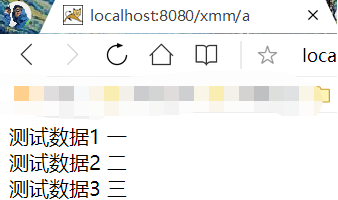

# Servlet基础

servlet是java web应用开发的核心组件，也是实现springweb mvc的基础，更好的理解servlet，有助于我们更好的理解springweb mvc。

## 一、Servlet API介绍

Servlet API有4个包，如下：

- javax.servlet ：包含定义了Servlet与Servlet容器之间签约的类和接口。
- javax.servlet.http : 包含定义了HttpServlet与与Servlet容器之间签约的类和接口。
- javax.servlet.annotation ：包含对Servlet、Filter和Listener进行标注的注解。即Servlet3.0的注解配置。
- javax.servlet.descriptor:包含为Web应用的配置信息提供编程式访问的类型。


**下面放一张完整的类图(一图胜千言)**：   


### 1.1 Servlet各个接口介绍

#### 1.1.1 Servlet接口

```java
/**
  *  在Servlet接口中定义了5个方法，其中3个方法都是由Servlet容器来调用的，容器会在Servlet的生命周期的不同阶段调用特定的方法
  **/
public interface Servlet {
    //负责初始化Servlet对象，容器在创建好Servlet对象后，就会调用该方法
    public void init(ServletConfig config) throws ServletException;
    // 返回init方法中传入的ServletConfig，ServletConfig应该被保存在servlet实现类中的类级变量中。
    public ServletConfig getServletConfig();

    //负责相应客户的请求，为客户提供相应服务。当容器接受到客户端要求访问特定Servlet对象的请求时，就会调用该Servlet对象的service()方法
    public void service(ServletRequest req, ServletResponse res) throws ServletException, IOException;		
	// 返回Servlet信息，例如作者、版本等，注意此方法应该返回的是纯文本，而不是任何标记语言。
    public String getServletInfo();
    
    //负责释放Servlet对象占用的资源。当Servlet对象结束声明周期时，容器会调用此方法；
    public void destroy();
}
```

#### 1.1.2 GenericServlet接口

GenericServlet抽象类为Servlet接口提供了通用实现，它与任何网络应用层协议无关。

GenericServlet除了实现了Servlet接口，还实现了ServletConfig接口和Serializable接口。

```java
public abstract class GenericServlet implements Servlet, ServletConfig, java.io.Serializable {
    private static final String LSTRING_FILE = "javax.servlet.LocalStrings";
    private static ResourceBundle lStrings = ResourceBundle.getBundle(LSTRING_FILE);
    private transient ServletConfig config;
    // 空构造函数
    public GenericServlet() { }
    // 空实现
    public void destroy() {
    }
    
    public String getInitParameter(String name) {
        ServletConfig sc = getServletConfig();
        if (sc == null) {
            throw new IllegalStateException(lStrings.getString("err.servlet_config_not_initialized"));
        }
        return sc.getInitParameter(name);
    }

    public Enumeration<String> getInitParameterNames() {
        ServletConfig sc = getServletConfig();
        if (sc == null) {
            throw new IllegalStateException(lStrings.getString("err.servlet_config_not_initialized"));
        }
        return sc.getInitParameterNames();
    }   
   
    public ServletConfig getServletConfig() {
		return config;
    }

    public ServletContext getServletContext() {
        ServletConfig sc = getServletConfig();
        if (sc == null) {
            throw new IllegalStateException( lStrings.getString("err.servlet_config_not_initialized"));
        }
        return sc.getServletContext();
    }
   
    public String getServletInfo() {
		return "";
    }
    
	// 初始化方法
    public void init(ServletConfig config) throws ServletException {
		this.config = config;
		this.init();
    }

    public void init() throws ServletException {
		// 不带参数的init方法，方便子类实现
    }
    // 抽象方法， 子类必须实现
    public abstract void service(ServletRequest req, ServletResponse res) throws ServletException, IOException;
    
    public String getServletName() {
        ServletConfig sc = getServletConfig();
        if (sc == null) {
            throw new IllegalStateException(lStrings.getString("err.servlet_config_not_initialized"));
        }
        return sc.getServletName();
    }
}
```

#### 1.1.3 HttpServlet抽象类

HttpServlet类是GenericServlet类的子类。HttpServlet类为Serlvet接口提供了与HTTP协议相关的通用实现，也就是说，HttpServlet对象适合运行在与客户端采用HTTP协议通信的Servlet容器或者Web容器中。

在我们自己开发的Java Web应用中，自定义的Servlet类一般都扩展自HttpServlet类。

HttpServlet类实现了Servlet接口中的service(ServletRequest , ServletResponse)方法，而该方法实际调用的是它的重载方法HttpServlet.service(HttpServletRequest, HttpServletResponse)；

在上面的重载service()方法中，首先调用HttpServletRequest类型的参数的getMethod()方法，获得客户端的请求方法，然后根据该请求方式来调用匹配的服务方法；如果为GET方式，则调用doGet()方法，如果为POST方式，则调用doPost()方法。

HttpServlet类为所有的请求方式，提供了默认的实现doGet(),doPost(),doPut(),doDelete()方法；这些方法的默认实现都会向客户端返回一个错误。

对于HttpServlet类的具体子类，一般会针对客户端的特定请求方法，覆盖HttpServlet类中的相应的doXXX方法。如果客户端按照GET或POST方式请求访问HttpsServlet，并且这两种方法下，HttpServlet提供相同的服务，那么可以只实现doGet()方法，并且让doPost()方法调用doGet()方法。

#### 1.1.4 ServletRequest接口

ServletRequest表示来自客户端的请求；当Servlet容器接收到客户端要求访问特定Servlet的请求时，容器先解析客户端的原始请求数据，把它包装成一个ServletRequest对象。

ServletRequest接口提供了一系列用于读取客户端的请求数据的方法，例如：

```java
getContentLength() —— 返回请求正文的长度，如果请求正文的长度未知，则返回-1；
getContentType() —— 获得请求正文的MIME类型，如果请求正文的类型为止，则返回null；
getInputStream() —— 返回用于读取请求正文的输入流；
getLocalAddr() —— 返回服务端的IP地址；
getLocalName() —— 返回服务端的主机名；
getLocalPort() —— 返回服务端的端口号；
getParameters() —— 根据给定的请求参数名，返回来自客户请求中的匹配的请求参数值；
getProtocal() —— 返回客户端与服务器端通信所用的协议名称及版本号；
getReader() —— 返回用于读取字符串形式的请求正文的BufferReader对象；
getRemoteAddr() —— 返回客户端的IP地址
getRemoteHost() —— 返回客户端的主机名
getRemotePort() —— 返回客户端的端口号
```

#### 1.1.5 HttpServletRequest接口

HttpServletRequest接口是ServletRequest接口的子接口。

HttpServletRequest接口提供了用于读取HTTP请求中的相关信息的方法：

```java
getContextPath() —— 返回客户端请求方法的Web应用的URL入口，例如，如果客户端访问的URL为http://localhost:8080/helloapp/info，那么该方法返回“/helloapp”;
getCookies() —— 返回HTTP请求中的所有Cookie；
getHeader(String name) —— 返回HTTP请求头部的特定项；
getHeaderName() —— 返回一个Enumeration对象，它包含了HTTP请求头部的所有项目名；
getMethod() —— 返回HTTP请求方式；
getRequestURL() —— 返回HTTP请求的头部的第一行中的URL；
getQueryString() —— 返回HTTP请求中的查询字符串，即URL中的“？”后面的内容；
```

#### 1.1.6 ServletResponse接口

Servlet通过ServletResponse对象来生成响应结果。

ServletResponse接口定义了一系列与生成响应结果相关的方法，例如：

```java
setCharacterEncoding() —— 设置相应正文的字符编码。响应正文的默认字符编码为ISO-8859-1；
setContentLength() —— 设置响应正文的长度；
setContentType() —— 设置响应正文的MIME类型；
getCharacterEncoding() —— 获得响应正文的字符编码
getContentType() —— 获得响应正文的MIME类型
setBufferSize() —— 设置用于存放响应正文数据的缓冲区的大小
getBufferSize() —— 获得用于存放响应正文数据的缓冲区的大小；
reset() —— 清空缓冲区内的正文数据，并且清空响应状态代码及响应头
resetBuffer() —— 仅仅清空缓冲区的正文数据，不清空响应状态代码及响应头；
flushBuffer() —— 强制性地把缓冲区内的响应正文数据发送到客户端；
isCommitted() —— 返回一个boolean类型的值，如果为true，表示缓冲区内的数据已经提交给客户，即数据已经发送到客户端；
getOutputStream() —— 返回一个ServletOutputStream对象，Servlet用它来输出二进制的正文数据；
getWriter() —— 返回一个PrinterWriter对象，Servlet用它来输出字符串形式的正文数据；
```

ServletResponse中响应正文的默认MIME类型是text/plain,即纯文本类型，而HttpServletResponse中响应正文的默认MIME类型为text/html，即HTML文档类型。

为了提高输出数据的效率，ServletOutputStream和PrintWriter首先把数据写到缓冲区内。当缓冲区内的数据被提交给客户后，ServletResponse的isComitted方法返回true。在以下几种情况下，缓冲区内的数据会被提交给客户，即数据被发送到客户端：

当缓冲区内的数据已满时，ServletOutPutStream或PrintWriter会自动把缓冲区内的数据发送给客户端，并且清空缓冲区；
Servlet调用ServletResponse对象的flushBuffer方法；
Servlet调用ServletOutputStream或PrintWriter对象的flush方法或close方法；
为了确保SerlvetOutputStream或PrintWriter输出的所有数据都会被提交给客户，比较安全的做法是在所有数据都输出完毕后，调用ServletOutputStream或PrintWriter的close()方法（Tomcat中，会自动关闭）。

如果要设置响应正文的MIME类型和字符编码，必须先调用ServletResponse对象的setContentType()和setCharacterEncoding()方法，然后再调用ServletResponse的getOutputStream()或getWriter()方法，提交缓冲区内的正文数据；只有满足这样的操作顺序，所做的设置才能生效。

#### 1.1.7 HttpServletResponse接口

HttpServletResponse接口提供了与HTTP协议相关的一些方法，Servlet可通过这些方法来设置HTTP响应头或向客户端写Cookie。

```
addHeader() —— 向HTTP响应头中加入一项内容
sendError() —— 向客户端发送一个代表特定错误的HTTP响应状态代码
setHeader() —— 设置HTTP响应头中的一项内容，如果在响应头中已经存在这项内容，则原来的设置被覆盖
setStatus() —— 设置HTTP响应的状态代码
addCookie() —— 向HTTP响应中加入一个Cookie
```

在HttpServletResponse接口中定义了一些代表HTTP响应状态代码的静态常量。

#### 1.1.8 ServletConfig接口

Servlet容器初始化Servlet时会向init方法传入一个ServletConfig实例，封装了@WebServlet或者xml文件传递给Servlet的配置信息，初始参数为key-vealue形式存储在HashMap中。

- ServeltConfig是Servlet对象的配置存储对象
- ServletConfig封装了web.xml文件中<servlet></servlet>标签中的配置信息
- 一个Servlet对象对应一个ServletConfig对象。
- Servlet对象和ServletConfig对象都是由服务器创建，默认情况下他们都是用户发出第一次请求的时候被创建
  

**ServletConfig接口中定义的方法：**

```java
// 返回匹配的初始化参数值
public String getInitParameter(String name);
// 返回一个Enumeration对象，里面包含了所有的初始化参数名
public Enumeration<String> getInitParameterNames();
// 返回一个ServletContext对象
public ServletContext getServletContext();
// 返回Servlet的名字，即web.xml文件中相应<servlet>元素的<servlet-name>子元素的值；如果没有为servlet配置<servlet-name>子元素，则返回Servlet类的名字
public String getServletName();
```

HttpServlet类继承了GenericServlet类，而GenericServlet类实现了ServletConfig接口，因此HttpServlet或GenericServlet类及子类中都可以直接调用ServletConfig接口中的方法。

**ServletConfig的使用：**

先来看一下Servlet的代码：

```java
public class AServlet extends GenericServlet {
    @Override
    public void service(ServletRequest req, ServletResponse res) throws ServletException, IOException {
        res.setContentType("text/html");
        PrintWriter out = res.getWriter();
        //获取该Servlet对象的ServletConfig对象
        ServletConfig servletConfig = this.getServletConfig();
		//使用getInitParameterNames()来获取配置信息的名字
        Enumeration<String> initParameterNames =  servletConfig.getInitParameterNames();
        //遍历容器将其展示在网页上
        while (initParameterNames.hasMoreElements()){
            String name = initParameterNames.nextElement();
        	//getInitPatameter(String name)获得配置信息的值
            out.print(name +" "+ this.getInitParameter(name) + "<br>");
        }
    }
}
```

下面在来看一下web.xml的相关配置

```xml
<servlet>                                                                  
    <servlet-name>AServlet</servlet-name>                                  
    <servlet-class>com.bjpowernode.javaweb.servlet.AServlet</servlet-class>
    <init-param>                                                           
        <param-name>测试数据1</param-name>                                     
        <param-value>一</param-value>                                       
    </init-param>                                                          
    <init-param>                                                           
        <param-name>测试数据2</param-name>                                     
        <param-value>二</param-value>                                       
    </init-param>                                                          
    <init-param>                                                           
        <param-name>测试数据3</param-name>                                     
        <param-value>三</param-value>                                       
    </init-param>                                                          
</servlet>                                                                 
<servlet-mapping>                                                          
    <servlet-name>AServlet</servlet-name>                                  
    <url-pattern>/a</url-pattern>                                          
</servlet-mapping>                                                         
```

再接下来我们启动Tomcat服务器，并通过路径启动AServlet中的服务。



到这里，ServletConfig的内容就很清晰了。


#### 1.1.9 ServletContext接口

ServletContext是Servlet与Servlet容器之间直接通信的接口。

Servlet容器在启动一个Web应用时，会为它创建一个ServletContext对象。每个Web应用都有唯一的ServletContext对象，可以把ServletContext对象形象地理解为Web应用的总管家，同一个Web应用中的所有Servlet对象都共享一个ServletContext，Servlet对象可以通过其访问容器中的各种资源。

- 从上面我们可以知道，一个Servlet对象对应一个ServletConfig，而一个WebApp对应一个ServletContext对象。
- ServletContext对象在服务器启动的时候被服务器创建，在服务器关闭的时候被销毁。
- ServletConfig对应的是<servlet></servlet>中的内容，而ServletContext对应的是web.xml中的内容。

ServletContext接口提供的方法可以分为以下几种类型：

用于在web应用范围内存取共享数据的方法：

```java
// 存（向ServletContext应用域中存数据）
public void setAttribute(String name, Object value); // map.put(k, v)
// 取（从ServletContext应用域中取数据）
public Object getAttribute(String name); // Object v = map.get(k)
// 删（删除ServletContext应用域中的数据）
public void removeAttribute(String name); // map.remove(k)
// 返回一个Enumeration对象，包含所有存放在ServletContext中的属性名
public Enumeration<String> getAttributeNames();
```

访问当前Web应用的资源：

```java
// 获取所有的初始化参数的name
public Enumeration<String> getInitParameterNames(); 
// 获取应用的根路径（非常重要），因为在java源代码当中有一些地方可能会需要应用的根路径，这个方法可以动态获取应用的根路径
public String getContextPath();
// 返回Web应用范围内的匹配的初始化参数值。在web.xml中，直接在<web-app>根元素下定义的<context-param>元素表示应用范围内的初始化参数
public String getInitParameter(String name);
// 返回Web应用的名字，即web.xml文件中<display-name>元素的值
public String getServletContextName();
// 返回一个用于向其他WEB组件转发请求的RequestDispatcher对象
public RequestDispatcher getRequestDispatcher(String path);
```

访问Servlet容器中的其他WEB应用：

```

```

访问Servlet容器的相关信息：

```

```

访问服务器端的文件系统资源：

```java
// 根据参数指定的虚拟路径，返回文件系统中的一个真实的路径
public void getRealPath();
// 返回一个映射到参数指定的路径的URL
public URL getResource(String path);
// 返回一个用于读取参数指定的文件的输入流
public InputStream getResourceAsStream(String path); 
// 返回参数指定的文件MIME类型
public String getMimeType(String file); 
```

输出日志：

```java
//向Servlet的日志文件中写日志
public void log(String msg);
// 向Servlet的日志文件中写入错误日志，以及异常的堆栈信息
public void log(String message, Throwable throwable);
```


#### 1.1.20 Servlet相关类的关系


与Servlet主动关联的是三个类，分别是ServletConfig，ServletRequest和ServletResponse。这三个类都是通过容器传递给Servlet的；其中，ServletConfig是在Servlet初始化时传给Servlet的，后两个是在请求到达时调用Servlet传递过来的。

对于Request和Response，以TOMCAT为例，tomcat接到请求首先将会创建org.apache.coyote.Request和org.apache.coyote.Response，这两个类是Tomcat内部使用的描述一次请求和相应的信息类，它们是一个轻量级的类，作用就是在服务器接收到请求后，经过简单解析将这个请求快速分配给后续线程去处理。接下来当交给一个用户线程去处理这个请求时又创建org.apache.catalina.connector.Request和org.apache.catalina.connector.Response对象。这两个对象一直贯穿整个Servlet容器直到要传给Servlet，传给Servlet的是Request和Response的Facade类。

#### 1.1.21 Request和Response的转变过程：

当用户从浏览器向服务器发起的一个请求通常会包含如下信息：

http://hostname:port/contextpath/servletpath

hostname和port用来与服务器建立TCP连接，后面的URL用来选择在服务器中哪个子容器服务用户的请求。

在Tomcat7中，这种映射工作由专门的一个类完成：org.apache.tomcat.util.http.mapper，这个类保存了tomcat的container容器中的所有子容器的信息。org.apache.catalina.connector.Request类在进入Container容器之前，Mapper将会根据这次请求的hostname和contextpath将host和context容器设置到Request的mappingData属性中，所以当Request进入container容器之前，对于它要访问哪个子容器就已经确定了。

#### 1.1.22 Servlet的实际使用

我们自己定义的servlet通常去继承HttpServlet或GenericServlet类。采用MVC框架的实现中，其基本原理是将所有的请求都映射到一个Servlet，然后去实现servie方法，这个方法也就是MVC框架的入口。


## 二、Servlet 生命周期

在 Java 中，对象的生命周期被定义为该对象从创建直到销毁的整个过程。任何对象都有生命周期，Servlet 也不例外。在学习 Servlet 生命周期之前，我们先来看一下 Servlet 的一些常见方法，这些方法非常重要，它们贯穿着 Servlet 整个生命周期！

#### 与 Servlet 生命周期有关的方法

与 Servlet 生命周期有关的方法一般有以下三个：

##### 1) init() 方法

init() 方法是在创建 Servlet 对象时被调用，而且只能被调用一次，用于 Servlet 对象在整个生命周期内的唯一一次初始化。只有在 init() 方法调用成功后，Servlet 才会处于服务状态，才能够去处理客户端的请求。

##### 2) service() 方法

service() 方法是 Servlet 工作的核心方法。当客户端请求访问 Servlet 时，Servlet 容器就会调用 service() 方法去处理来自客户端的请求，并把处理后的响应返回给客户端。

##### 3) destroy() 方法

destory() 方法是 Servlet 容器回收 Servlet 对象之前调用的，且只会调用一次，而此时的服务器处于停止状态或者访问资源已经被移除。


#### Servlet生命周期总结

一图胜千言：


上图描述了 Servlet 的完整生命周期，按照功能的不同，大致可以将 Servlet 的生命周期分为三个阶段，分别是初始化阶段、运行阶段和销毁阶段。

##### 1) 初始化阶段

当用户第一次向 Servlet 容器发出 HTTP 请求要求访问某个 Servlet 时，Servlet 容器会在整个容器中搜索该 Servlet 对象，发现这个 Servlet 对象没有被实例化，于是创建这个 Servlet 对象，然后调用该对象的 init() 方法完成初始化。

当用户第二次访问这个 Servlet 时，Servlet 容器仍然在容器中搜索该 Servlet 对象，结果找到了该对象的实例，则不去创建而直接使用该对象。

找到了对应的 Servlet 对象，随后 Servlet 进入到运行阶段。

需要注意的是，在 Servlet 的整个生命周期内，它的 init() 方法只被调用一次。

##### 2) 运行阶段

这是 Servlet 生命周期中最核心的阶段。在该阶段中，Servlet 容器会为当前的请求创建一个 ServletRequest 对象和一个 ServletResponse 对象（它们分别代表 HTTP 请求和 HTTP 响应），并将这两个对象作为参数传递给 Servlet 的 service() 方法。service() 方法从 ServletRequest 对象中获得用户的详细请求信息并处理该请求，通过 ServletResponse 对象生成响应结果。

需要强调的是，在 Servlet 的整个生命周期内，用户每次请求访问 Servlet 时，Servlet 容器都会调用一次 Servlet 的 service() 方法，并且创建新的 ServletRequest 和 ServletResponse 对象。

##### 3) 销毁阶段

当服务器停止时，Servlet 容器需要回收 Servlet 对象所占用的内存，在回收之前，会自动调用该对象的 destroy() 方法做好回收内存前的准备，辟如关闭后台线程。和 init() 方法类似，destroy() 方法也只会被调用一次。


> 注意：Servlet 对象一旦创建就会驻留在内存中一直等待客户端的访问，直到服务器关闭或项目被移除出容器时，Servlet 对象才会被销毁。


##### 总结

对 Servlet 声明周期的几点汇总：

1. Servlet 对象被创建之后执行 init() 方法，并且 init() 方法只执行一次，其主要目的是完成 Servlet 对象的初始化工作。
2. 对于 Servlet 对象的 service() 方法，只要用户请求一次，那么 service() 方法就执行一次。
3. Servlet 对象被回收之前，destroy() 方法会被调用，该方法只执行一次，执行的时候 Servlet 对象还在。

Servlet 对象的创建、对象提供服务、对象的销毁等操作皆由 Servlet 容器来管理，Java 程序员的任务只是负责编写 Servlet 类，无法干涉 Servlet 对象的生命周期。

## 三、Servlet 注解总结