# Git 使用

## 一、 版本控制工具

### 1.1. 什么是版本控制系统？

版本控制系统（Version Control System）:是一种记录一个或若干文件内容变化，以便将来查阅特定版本修订情况的系统。版本控制系统不仅可以应用于软件源代码的文本文件，而且可以对任何类型的文件进行版本控制。

常见的版本控制系统有：cvs、svn、git

### 1.2. 为什么要有版本控制系统?

1. 在开发过程中，经常需要对一个文件进行修改甚至删除，但是我们又希望能够保存这个文件的历史记录，如果通过备份，那么管理起来会非常的复杂。
2. 在多人开发时，如果需要多人合作开发一个页面，那么修改以及合并也会非常的棘手。容易出现冲突。

### 1.3. 版本控制系统分类

关于版本控制

**本地版本控制系统**

本地版本控制系统就是在一台机器上，记录版本的不同变化，保证内容不会丢失

缺点：如果多人开发，每个人都在不同的系统和电脑上开发，没办法协同工作。

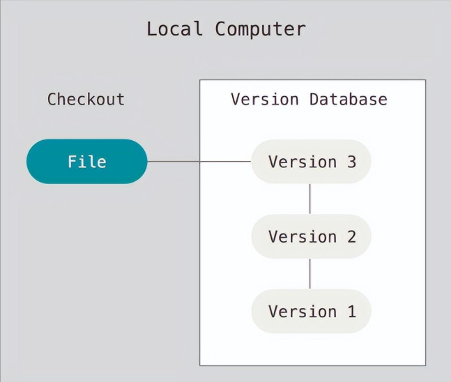

**集中式版本控制系統**

svn/cvs都是集中式的版本控制系统

1. 需要一个中央服务器来管理代码的的版本和备份
2. 所有的用户电脑都是从中央服务器获取代码或者是将本地的代码提交到中央服务器
3. 依赖与网络环境，如果连不上中央服务器，就无法提交和获取代码。
4. 如果中央服务器宕机，所有人都无法工作。

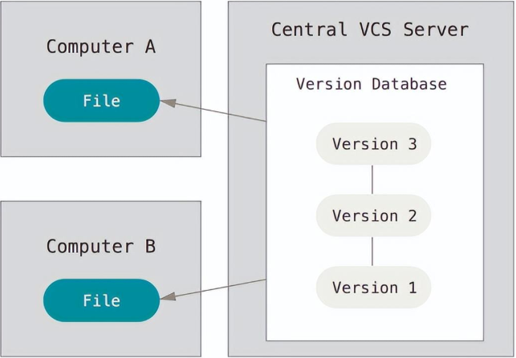

**分布式版本控制系统**

git是分布式的版本控制系统。

1. 需要一台服务器作为代码仓库
2. 每个用户电脑都是一个服务器（代码仓库），并且和代码仓库是镜像的，用户修改和获取代码都是提交到自己的服务器当中。
3. 不需要网络就可以进行工作。
4. 当连接网络时，用户可以选择将自己的服务器与代码仓库进行同步。

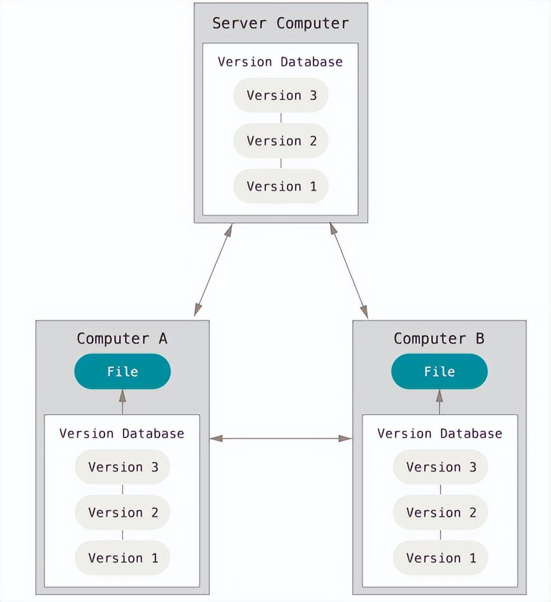

### 1.4 版本控制中的常见术语

#### 1.4.1 仓库（Repository）

受版本控制的所有文件修订历史的共享数据库

#### 1.4.2 工作空间（Workspace) 

本地硬盘或Unix 用户帐户上编辑的文件副本

#### 1.4.3 工作树/区（Working tree）

工作区中包含了仓库的工作文件。您可以修改的内容和提交更改作为新的提交到仓库。

#### 1.4.4 暂存区（Staging area）

暂存区是工作区用来提交更改（commit）前可以暂存工作区的变化。


#### 1.4.5 索引（Index）

索引是暂存区的另一种术语。

#### 1.4.6 签入（Checkin）

将新版本复制回仓库

#### 1.4.7 签出（Checkout）

从仓库中将文件的最新修订版本复制到工作空间

#### 1.4.8 提交（Commit）

对各自文件的工作副本做了更改，并将这些更改提交到仓库

#### 1.4.9 冲突（Conflict）

多人对同一文件的工作副本进行更改，并将这些更改提交到仓库

#### 1.4.10 合并（Merge）

将某分支上的更改联接到此主干或同为主干的另一个分支

#### 1.4.11 分支（Branch）

从主线上分离开的副本，默认分支叫master

#### 1.4.12 锁（Lock）

获得修改文件的专有权限。

#### 1.4.13 头（HEAD）

头是一个象征性的参考，最常用以指向当前选择的分支。

#### 1.4.14 修订（Revision）

表示代码的一个版本状态。Git通过用SHA1 hash算法表示的ID来标识不同的版本。

#### 1.4.15 标记（Tags）

标记指的是某个分支某个特定时间点的状态。通过标记，可以很方便的切换到标记时的状态。


## 二、 Git

### 2.1. Git介绍

> Git是一款免费、开源的**分布式版本控制系统** ，用于敏捷高效地处理任何或小或大的项目。

Git 是 Linus Torvalds 为了帮助管理 Linux 内核开发而开发的一个开放源码的版本控制软件。


### 2.2 Git 基本使用

1. 初始化git仓库git init
2. 查看当前git仓库的状态git status
3. 将文件添加到git的暂存区git add 文件名
4. 将文件由暂存区提交到仓库区git commit -m '提交说明'
5. 查看提交日志git log

```shell
# 初始化git仓库，会在当前目录生成一个隐藏文件夹 .git  不要去修改这个文件夹下的任意东西。
git init

# 查看git的状态 ,如果此时新建一个文件，那么这个文件是没有被追踪的，说白了git还没有管理这个新建的文件
git status 

# 让git管理这个新建的文件
git add index.html

# 让文件由暂存区提交到仓库区。此时文件才真正的被git管理了。
# 如果提交日志乱码，右键-->options-->Text-->将编码改成utf-8
git commit -m '第一次提交'

# 查看提交日志
git log
```


### 2.3 Git配置文件 

#### 2.3.1 查看当前Git配置

使用git config -l 可以查看现在的git环境详细配置

```shell
$ git config -l
diff.astextplain.textconv=astextplain
filter.lfs.clean=git-lfs clean -- %f
filter.lfs.smudge=git-lfs smudge -- %f
filter.lfs.process=git-lfs filter-process
filter.lfs.required=true
http.sslbackend=openssl
http.sslcainfo=C:/Program Files/Git/mingw64/ssl/certs/ca-bundle.crt
core.autocrlf=true
core.fscache=true
core.symlinks=false
pull.rebase=false
credential.helper=manager-core
credential.https://dev.azure.com.usehttppath=true
init.defaultbranch=master
filter.lfs.required=true
filter.lfs.clean=git-lfs clean -- %f
filter.lfs.smudge=git-lfs smudge -- %f
filter.lfs.process=git-lfs filter-process
user.name=xuliang
user.email=895252461@qq.com
safe.directory=D:/developer/github/spring-framework
safe.directory=D:/developer/gitee/spring-learn

```

Git Config的级别

```shell
#查看系统config
git config --system --list
　　
#查看当前用户（global）配置
git config --global  --list
 
#查看当前仓库配置信息
git config --local  --list
```


#### 2.3.2 Git 配置文件的分类

在Windows系统中，Git在$HOME目录中查找.gitconfig文件

**Git的相关配置文件有三个：**

- path/to/git/etc/gitconfig

  包含了适用于系统所有用户和所有项目的值。--system 系统级

- ~/.gitconfig

  只适用于当前登录用户的配置。--global 全局

- 位于git项目目录中的.git/config

  适用于特定git项目的配置。--local当前项目

注意：对于同一配置项，三个配置文件的优先级是1<2<3

这里可以直接编辑配置文件，通过命令设置后会响应到这里。


#### 2.3.3 添加或删除配置项

添加配置项

```shell
git config [--local|--global|--system]  section.key value
# 默认为--local
section.key #区域下的键
value #对应的值
```

删除配置项

```shell
git config [--local|--global|--system] --unset section.key
```


#### 2.3.4 设置用户名与邮箱

当你安装Git后首先要做的事情是设置你的用户名称和e-mail地址。这是非常重要的，因为每次Git提交都会使用该信息。它被永远的嵌入到了你的提交中：

```shell
# git config  user.name 你的目标用户名
# git config  user.email 你的目标邮箱名
# 这种配置方式只有在当前仓库生效
git config user.name shuaige
git config user.email 669104343@qq.com

# 可以使用--global参数，配置全局的用户名和邮箱，这样别的git仓库就不需要重新配置了。
# 如果同时配置了局部的和全局的，那么局部的用户名和邮箱将会生效。
git config  --global user.name shuaige
git config  --global user.email 669104343@qq.com

# 查看配置信息
git config --list
```

### 2.4 git的工作原理

#### 2.4.1 工作区域

Git本地有三个工作区域：工作目录（Working Directory）、暂存区(Stage/Index)、资源库(Repository或Git Directory)。如果在加上远程的git仓库(Remote Directory)就可以分为四个工作区域。文件在这四个区域之间的转换关系如下：


- Workspace：工作区，就是你平时存放项目代码的地方
- Index / Stage：暂存区，用于临时存放你的改动，事实上它只是一个文件，保存即将提交到文件列表信息
- Repository：仓库区（或本地仓库），就是安全存放数据的位置，这里面有你提交到所有版本的数据。其中HEAD指向最新放入仓库的版本
- Remote：远程仓库，托管代码的服务器，可以简单的认为是你项目组中的一台电脑用于远程数据交换

本地的三个区域确切的说应该是git仓库中HEAD指向的版本


- Directory：使用Git管理的一个目录，也就是一个仓库，包含我们的工作空间和Git的管理空间。
- WorkSpace：需要通过Git进行版本控制的目录和文件，这些目录和文件组成了工作空间。
- .git：存放Git管理信息的目录，初始化仓库的时候自动创建。
- Index/Stage：暂存区，或者叫待提交更新区，在提交进入repo之前，我们可以把所有的更新放在暂存区。
- Local Repo：本地仓库，一个存放在本地的版本库；HEAD会只是当前的开发分支（branch）。
- Stash：隐藏，是一个工作状态保存栈，用于保存/恢复WorkSpace中的临时状态。

#### 2.4.2 Git文件状态

Git工作区中的文件状态分为一下几种：

- Untracked     未跟踪，工作区中没有加入过暂存区的文件，不参与版本控制；
- Unmodified  未修改，加入版本控制，但和版本库中文件快照相同；
- Modified       已修改，加入版本控制，而且和上次加入版本库时的快照不同；
- Staged           已暂存，下一步可以提交到本地仓库（版本库）


git status命令可以用来查看工作区文件当前的状态：

```shell
#查看特定文件的状态
git status [filename]

#查看所有文件状态
git status

#精简的方式显示文件状态
git status -s
```


### 2.5  git命令详解

#### 2.5.1  git add(重点)

- 作用：将文件由 工作区 添加到 暂存区，暂存文件

- 命令：

- git add 文件名

- - 例如： git add index.html

- git add --all 或者 git add -A 或者git add .（简写） 添加所有文件

- git add a.txt b.txt 同时添加两个文件

- git add *.js 添加当前目录下的所有js文件

#### 2.5.2  git checkout 文件名

checkout命令用于从历史提交（或者暂存区域）中拷贝文件到工作目录，也可用于切换分支。

当给定某个文件名（或者打开-p选项，或者文件名和-p选项同时打开）时，git会从指定的提交中拷贝文件到暂存区域和工作目录。比如，git checkout HEAD~ foo.c会将提交节点HEAD~(即当前提交节点的父节点)中的foo.c复制到工作目录并且加到暂存区域中。（如果命令中没有指定提交节点，则会从暂存区域中拷贝内容。）注意当前分支不会发生变化。

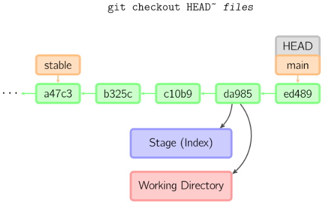

当不指定文件名，而是给出一个（本地）分支时，那么HEAD标识会移动到那个分支（也就是说，我们“切换”到那个分支了），然后暂存区域和工作目录中的内容会和HEAD对应的提交节点一致。新提交节点（下图中的a47c3）中的所有文件都会被复制（到暂存区域和工作目录中）；只存在于老的提交节点（ed489）中的文件会被删除；不属于上述两者的文件会被忽略，不受影响。


如果既没有指定文件名，也没有指定分支名，而是一个标签、远程分支、SHA-1值或者是像main~3类似的东西，就得到一个匿名分支，称作detached HEAD（被分离的HEAD标识）。这样可以很方便地在历史版本之间互相切换。


#### 2.5.3 git commit（重点）

提交时，git用暂存区域的文件创建一个新的提交，并把此时的节点设为父节点。然后把当前分支指向新的提交节点。下图中，当前分支是main。在运行命令之前，main指向ed489，提交后，main指向新的节点f0cec并以ed489作为父节点。

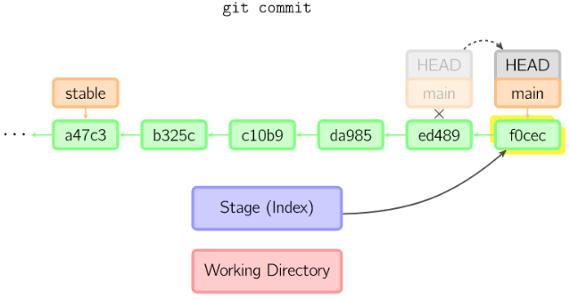

即便当前分支是某次提交的祖父节点，git会同样操作。下图中，在main分支的祖父节点stable分支进行一次提交，生成了1800b。这样，stable分支就不再是main分支的祖父节点。此时，**合并** (或者 **衍合**) 是必须的。

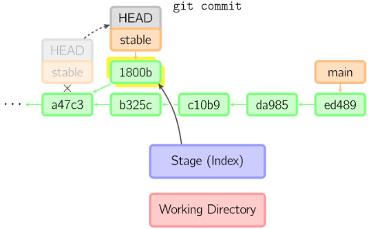


如果想更改一次提交，使用 git commit --amend。git会使用与当前提交相同的父节点进行一次新提交，旧的提交会被取消。

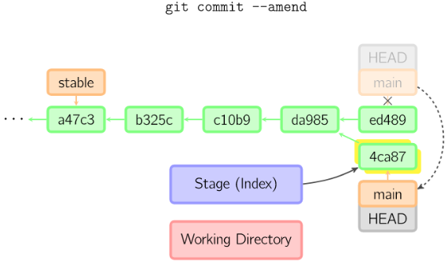

另一个例子是分离HEAD提交。


#### 2.5.4 git status

- 作用：查看文件的状态
- 命令：git status
- 命令：git stauts -s 简化日志输出格式

#### 2.5.5 git log

- 作用：查看提交日志
- git log 只能查看当前head以及以前的日志
- git log --oneline 简洁的日志信息
- git reflog 查看所有的提交变更日志

#### 2.5.6 git reset

reset命令把当前分支指向另一个位置，并且有选择的变动工作目录和索引。也用来在从历史仓库中复制文件到索引，而不动工作目录。如果不给选项，那么当前分支指向到那个提交。如果用--hard选项，那么工作目录也更新，如果用--soft选项，那么都不变。

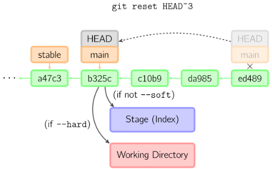

如果没有给出提交点的版本号，那么默认用HEAD。这样，分支指向不变，但是索引会回滚到最后一次提交，如果用--hard选项，工作目录也同样。

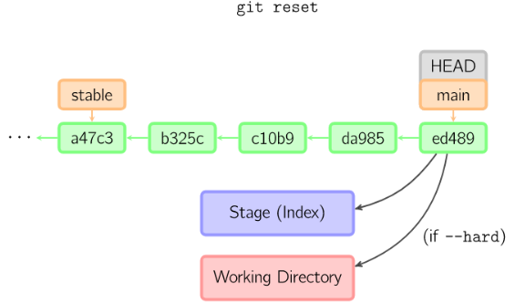

#### 2.5.7 git diff

有许多种方法查看两次提交之间的变动。下面是一些示例。


#### 2.5.8 git cherry-pick

cherry-pick命令"复制"一个提交节点并在当前分支做一次完全一样的新提交。

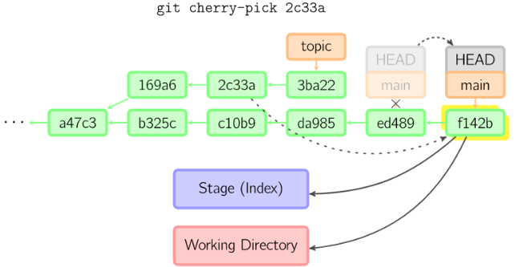


#### 2.5.9 git rebase

衍合是合并命令的另一种选择。合并把两个父分支合并进行一次提交，提交历史不是线性的。衍合在当前分支上重演另一个分支的历史，提交历史是线性的。本质上，这是线性化的自动的 cherry-pick


上面的命令都在topic分支中进行，而不是main分支，在main分支上重演，并且把分支指向新的节点。注意旧提交没有被引用，将被回收。

要限制回滚范围，使用--onto选项。下面的命令在main分支上重演当前分支从169a6以来的最近几个提交，即2c33a。

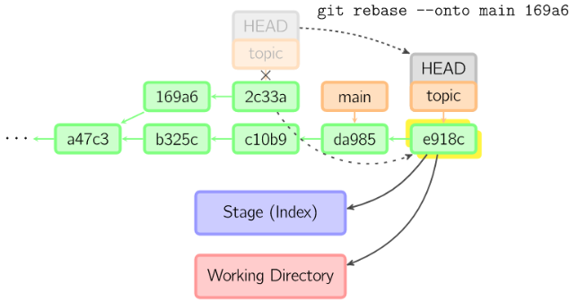


#### 2.5.10 git merge


### 2.6 git忽视文件

> 在仓库中，有些文件是不想被git管理的，比如数据的配置密码、写代码的一些思路等。git可以通过配置从而达到忽视掉一些文件，这样这些文件就可以不用提交了。

- 在仓库的根目录创建一个.gitignore的文件，文件名是固定的。
- 将不需要被git管理的文件路径添加到.gitignore中

```
# 忽视idea.txt文件
idea.txt

# 忽视.gitignore文件
.gitignore

# 忽视css下的index.js文件
css/index.js

# 忽视css下的所有的js文件
css/*.js

# 忽视css下的所有文件
css/*.*
# 忽视css文件夹
css
```


## 三、 git分支操作

分支就是科幻电影里面的平行宇宙，当你正在电脑前努力学习Git的时候，另一个你正在另一个平行宇宙里努力学习SVN。

如果两个平行宇宙互不干扰，那对现在的你也没啥影响。不过，在某个时间点，两个平行宇宙合并了，结果，你既学会了Git又学会了SVN！


### 3.1. 为什么要有分支？

- 如果你要开发一个新的功能，需要2周时间，第一周你只能写50%代码，如果此时立即提交，代码没写完，不完整的代码会影响到别人无法工作。如果等代码写完再提交，代码很容易丢失，风险很大。
- 有了分支，你就可以创建一个属于自己的分支，别人看不到，也不影响别人，你在自己的分支上工作，提交到自己的分支上，等到功能开发完毕，一次性的合并到原来的分支。这样既安全，又不影响他人工作。
- 在工作过程中，经常会碰到**多任务并行开发** 的情况，使用分支就能很好的避免任务之间的影响。
- 其他版本工具比如svn，cvs中也有分支这个概念，但是这些工具中的分支操作非常的慢，形同摆设。

### 3.2. 分支操作的命令

#### 3.2.1. 创建分支

- git branch 分支名称创建分支，分支中的代码，在创建时与当前分支的内容完全相同。
- git在第一次提交时，就有了一个叫master的主分支。

#### 3.2.2. 查看分支

- git branch可以查看所有的分支，
- 在当前分支的前面会有一个*

#### 3.2.3. 切换分支

- git checkout 分支名称切换分支
- 在当前分支的任何操作，都不会影响到其他的分支，除非进行了分支合并。
- 切换分支之前，**必须保证代码已经提交了**

#### 3.2.4. 创建并切换分支

- git checkout -b 分支名称 创建并切换分支

#### 3.2.5. 删除分支

- git branch -d 分支名称 可以删除分支
- 注意：不能在当前分支删除当前分支，需要切换到其他分支才能删除。
- 注意：master分支是可以删除的，但是不推荐那么做。

#### 3.2.6. 合并分支

- git merge 分支名称 将其他分支的内容合并到当前分支。
- 在master分支中执行git merge dev 将dev分支中的代码合并到master分支

### 3.3. git分支的工作原理

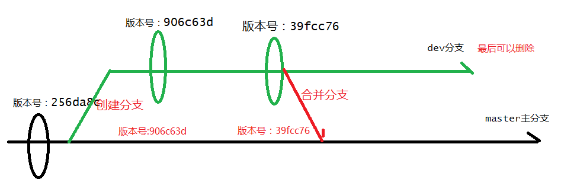


### 3.4. git合并冲突

- 对于同一个文件，如果有多个分支需要合并时，容易出现冲突。
- 合并分支时，如果出现冲突，只能手动处理，再次提交，一般的作法，把自己的代码放到冲突代码的后面即可。

## 四、远程仓库

所有的程序员都可以通过远程仓库来进行版本的共享，达到所有人的代码一致的效果。

### 4.1. 远程仓库相关的命令

#### 4.1.1. git push

- 作用：将本地代码提交到远程仓库
- git push 仓库地址 master 在代码提交到远程仓库，注意master分支必须写，不能省略
- 例子：git push git@github.com:hucongcong/test.git master 如果第一次使用，需要填写github的用户名和密码

#### 4.1.2. git pull

- 作用：将远程的代码下载到本地
- git pull 代码地址 将远程的代码中master分支下载到本地
- 通常在push前，需要先pull一次。

#### 4.1.3. git clone

- 作用：克隆远程仓库的代码到本地
- git clone 仓库地址 自定义本地仓库名 将整个仓库克隆到本地

#### 4.1.4. git remote

每次push和pull操作都需要带上远程仓库的地址，非常的麻烦，我们可以给仓库地址设置一个别名

- git remote add 仓库别名 仓库地址

- 使用仓库别名替代仓库地址。仓库别名相当于一个变量，仓库地址就是对应的值。

- - git remote add hucc git@github.com:hucongcong/test.git 设置了一个hucc的仓库别名，以后push和pull都可以不用仓库地址，而用hucc

- git remote remove hucc 删除hucc这个仓库别名。

- git remote 查看所有的仓库别名

- 如果使用了git clone命令从远程仓库获取下来的，那么这个本地仓库会自动添加一个 origin的远程地址，指向的就是克隆的远程地址。


## 附件：命令大全


- Workspace：工作区
- Index / Stage：暂存区
- Repository：仓库区（或本地仓库）
- Remote：远程仓库

### 1、仓库

```shell
# 在当前目录新建一个Git代码库
$ git init

# 新建一个目录，将其初始化为Git代码库
$ git init [project-name]

# 下载一个项目和它的整个代码历史
$ git clone [url]
```

### 2、配置

```shell
# 显示当前的Git配置
$ git config --list

# 编辑Git配置文件
$ git config -e [--global]

# 设置提交代码时的用户信息
$ git config [--global] user.name "[name]"
$ git config [--global] user.email "[email address]"
```

### 3、增加/删除文件

```shell
# 添加指定文件到暂存区
$ git add [file1] [file2] ...

# 添加指定目录到暂存区，包括子目录
$ git add [dir]

# 添加当前目录的所有文件到暂存区
$ git add .

# 添加每个变化前，都会要求确认
# 对于同一个文件的多处变化，可以实现分次提交
$ git add -p

# 删除工作区文件，并且将这次删除放入暂存区
$ git rm [file1] [file2] ...

# 停止追踪指定文件，但该文件会保留在工作区
$ git rm --cached [file]

# 改名文件，并且将这个改名放入暂存区
$ git mv [file-original] [file-renamed]

# 从git中彻底删除文件
git filter-branch --force --index-filter "git rm -rf --cached --ignore-unmatch 路径" --prune-empty --tag-name-filter cat -- --all

```

### 4、代码提交

```shell
# 提交暂存区到仓库区
$ git commit -m [message]

# 提交暂存区的指定文件到仓库区
$ git commit [file1] [file2] ... -m [message]

# 提交工作区自上次commit之后的变化，直接到仓库区
$ git commit -a

# 提交时显示所有diff信息
$ git commit -v

# 使用一次新的commit，替代上一次提交
# 如果代码没有任何新变化，则用来改写上一次commit的提交信息
$ git commit --amend -m [message]

# 重做上一次commit，并包括指定文件的新变化
$ git commit --amend [file1] [file2] ...
```

### 5、分支

```shell
# 列出所有本地分支
$ git branch

# 列出所有远程分支
$ git branch -r

# 列出所有本地分支和远程分支
$ git branch -a

# 新建一个分支，但依然停留在当前分支
$ git branch [branch-name]

# 新建一个分支，并切换到该分支
$ git checkout -b [branch]

# 新建一个分支，指向指定commit
$ git branch [branch] [commit]

# 新建一个分支，与指定的远程分支建立追踪关系
$ git branch --track [branch] [remote-branch]

# 切换到指定分支，并更新工作区
$ git checkout [branch-name]

# 切换到上一个分支
$ git checkout -

# 建立追踪关系，在现有分支与指定的远程分支之间
$ git branch --set-upstream [branch] [remote-branch]

# 合并指定分支到当前分支
$ git merge [branch]

# 选择一个commit，合并进当前分支
$ git cherry-pick [commit]

# 删除分支
$ git branch -d [branch-name]

# 删除远程分支
$ git push origin --delete [branch-name]
$ git branch -dr [remote/branch]
```

### 6、标签

```shell
# 列出所有tag
$ git tag

# 新建一个tag在当前commit
$ git tag [tag]

# 新建一个tag在指定commit
$ git tag [tag] [commit]

# 删除本地tag
$ git tag -d [tag]

# 删除远程tag
$ git push origin :refs/tags/[tagName]

# 查看tag信息
$ git show [tag]

# 提交指定tag
$ git push [remote] [tag]

# 提交所有tag
$ git push [remote] --tags

# 新建一个分支，指向某个tag
$ git checkout -b [branch] [tag]
```

### 7、查看信息

```shell
# 显示有变更的文件
$ git status

# 显示当前分支的版本历史
$ git log

# 显示commit历史，以及每次commit发生变更的文件
$ git log --stat

# 搜索提交历史，根据关键词
$ git log -S [keyword]

# 显示某个commit之后的所有变动，每个commit占据一行
$ git log [tag] HEAD --pretty=format:%s

# 显示某个commit之后的所有变动，其"提交说明"必须符合搜索条件
$ git log [tag] HEAD --grep feature

# 显示某个文件的版本历史，包括文件改名
$ git log --follow [file]
$ git whatchanged [file]

# 显示指定文件相关的每一次diff
$ git log -p [file]

# 显示过去5次提交
$ git log -5 --pretty --oneline

# 显示所有提交过的用户，按提交次数排序
$ git shortlog -sn

# 显示指定文件是什么人在什么时间修改过
$ git blame [file]

# 显示暂存区和工作区的差异
$ git diff

# 显示暂存区和上一个commit的差异
$ git diff --cached [file]

# 显示工作区与当前分支最新commit之间的差异
$ git diff HEAD

# 显示两次提交之间的差异
$ git diff [first-branch]...[second-branch]

# 显示今天你写了多少行代码
$ git diff --shortstat "@{0 day ago}"

# 显示某次提交的元数据和内容变化
$ git show [commit]

# 显示某次提交发生变化的文件
$ git show --name-only [commit]

# 显示某次提交时，某个文件的内容
$ git show [commit]:[filename]

# 显示当前分支的最近几次提交
$ git reflog
```

### 8、远程同步

```shell
# 下载远程仓库的所有变动
$ git fetch [remote]

# 显示所有远程仓库
$ git remote -v

# 显示某个远程仓库的信息
$ git remote show [remote]

# 增加一个新的远程仓库，并命名
$ git remote add [shortname] [url]

# 取回远程仓库的变化，并与本地分支合并
$ git pull [remote] [branch]

# 上传本地指定分支到远程仓库
$ git push [remote] [branch]

# 强行推送当前分支到远程仓库，即使有冲突
$ git push [remote] --force

# 推送所有分支到远程仓库
$ git push [remote] --all
```

### 9、撤销

```shell
# 恢复暂存区的指定文件到工作区
$ git checkout [file]

# 恢复某个commit的指定文件到暂存区和工作区
$ git checkout [commit] [file]

# 恢复暂存区的所有文件到工作区
$ git checkout .

# 重置暂存区的指定文件，与上一次commit保持一致，但工作区不变
$ git reset [file]

# 重置暂存区与工作区，与上一次commit保持一致
$ git reset --hard

# 重置当前分支的指针为指定commit，同时重置暂存区，但工作区不变
$ git reset [commit]

# 重置当前分支的HEAD为指定commit，同时重置暂存区和工作区，与指定commit一致
$ git reset --hard [commit]

# 重置当前HEAD为指定commit，但保持暂存区和工作区不变
$ git reset --keep [commit]

# 新建一个commit，用来撤销指定commit
# 后者的所有变化都将被前者抵消，并且应用到当前分支
$ git revert [commit]

# 暂时将未提交的变化移除，稍后再移入
$ git stash
$ git stash pop
```

### 10、其他

```shell
# 生成一个可供发布的压缩包
$ git archive

# 回收空间
rm -rf .git/refs/original && git reflog expire --expire=now --all
git gc --prune=now
```


