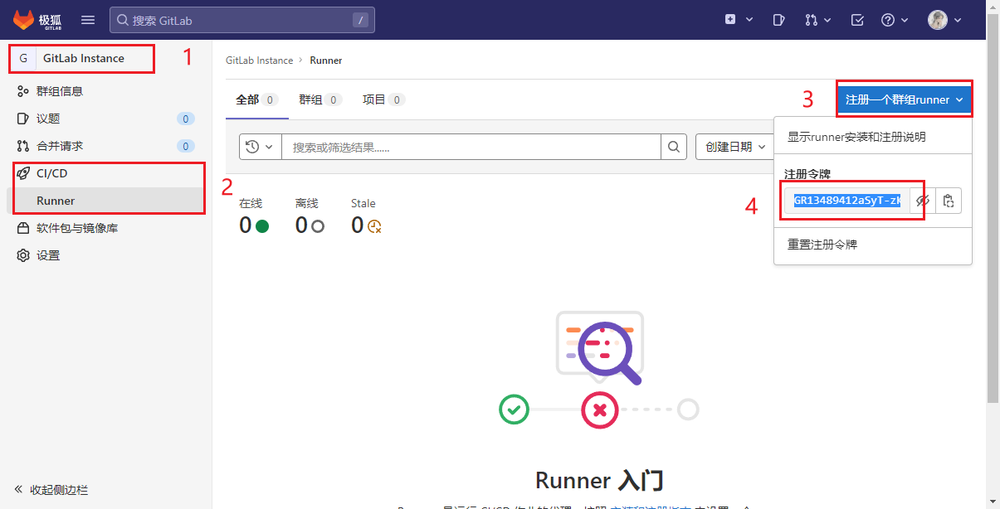
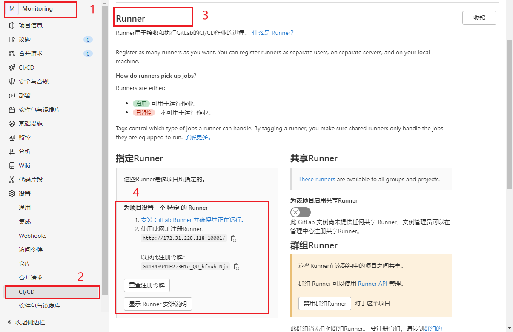

# Gitlab 自动发布流程构建


## 一：CI/CD是什么？

我们的开发模式经历了如下的转变：瀑布模型->敏捷开发→[DevOps](https://cloud.tencent.com/product/coding?from=10680)(Development、Operations的组合词，是一组过程、方法与系统的统称)

后来随着DevOps的兴起，出现了持续集成（Continuous Integration）、持续交付（Continuous Delivery） 、[持续部署](https://cloud.tencent.com/product/coding-cd?from=10680)（Continuous Deployment） 的新方法，关于持续集成、持续交付、持续部署，总结如下：

- **持续集成**的重点是将各个开发人员的工作集合到一个代码仓库中。通常，每天都要进行几次，主要目的是尽早发现集成错误，使团队更加紧密结合，更好地协作。
- **持续交付**的目的是最小化部署或释放过程中固有的摩擦。它的实现通常能够将构建部署的每个步骤自动化，以便任何时刻能够安全地完成代码发布（理想情况下）。
- **持续部署**是一种更高程度的自动化，无论何时对代码进行重大更改，都会自动进行构建/部署。


### 持续集成的好处是什么？

持续集成可以使问题尽早暴露，从而也降低了解决问题的难度，正如老马所说，持续集成无法消除bug，但却能大大降低修复的难度和时间。

### 持续交付的好处是什么？

持续交付的好处在于快速获取用户反馈；适应市场变化和商业策略的变化。开发团队保证每次提交的修改都是可上线的修改，那么决定何时上线，上线哪部分功能则完全由产品业务团队决定。

虽然持续交付有显著的优点，但也有不成立的时候，比如对于嵌入式系统的开发，往往需要软硬件的配合。

### 持续部署的好处是什么？

持续部署的目标是通过减少批量工作的大小，并加快团队工作的节奏，帮助开发团队在其开发流程中消除浪费。这使团队能够一直处于一种可持续的平稳流状态， 让团队更容易去创新、试验，并达到可持续的生产率


## 二：GitLab的安装


## 三：GitLab Runner

### 3.1 GitLab Runner 简介

- GitLab Runner 是一个开源项目，用于运行作业并将结果发送会GitLab
- 与GitLab结合使用，GitLab CI 是GitLab随附的用于协调作业的开源持续击集成服务
- GitLab Runner 是用Go编写的，可以在Linux、Windows和MacOS操作系统上运行
- 容器部署需要使用最新Docker版本，GitLab Runner 需要最小的Docker v1.13.0
- GitLab Runner 版本应与GitLab版本同步。（避免版本不一致导致的差异）
- 可以根据需要配置任意数量的Runner


#### 3.1.1 GitLab Runner 特点

- 作业运行控制：同时执行多个作业

- 作业运行环境：

  - 在本地、使用Docker容器、使用Docker容器并通过SSH执行作业。

  - 使用Docker容器在不同的云和虚拟化管理程序上自动缩放。

  - 连接到远程SSH服务器。

- 支持Bash,Windows Batch和Windows PowerShell。

- 允许自定义作业运行环境。
- 自动重新加载配置，无需重启。
- 易于安装，可作为Linux,macOS和Windows的服务。


#### 3.1.2 GitLab Runner的类型与状态

- 类到
  - shared共享类型，运行整个平台项目的作业(gitlab)
  - group项目组类型，运行特定group下的所有项目的作业(group)
  - specific项目类型，运行指定的项目作业(project.)
- 状态
  - locked:锁定状态，无法运行项目作业
  - paused:.暂停状态，暂时不会接受新的作业


### 3.2 GitLab Runner安装

**系统环境：**可以在Linux,mac0S,FreeBSD和Windows.上安装和使用GitLab Runner。

**部署方式：**二进制文件、rpm/deb软件包、Docker、Kubernetes


#### 3.2.1 通过包管理工具安装

Add GitLab's official repository:.添加官方仓库

```shell
# For Debian/Ubuntu/Mint
curl -L https://packages.gitlab.com/install/repositories/runner/gitlab-runner/script.deb.sh | sudo bash

# For RHEL/CentoS/Fedora
curl -L https://packages.gitlab.com/install/repositories/runner/gitlab-runner/script.rpm.sh | sudo bash
```


更新runner

```shell
# For Debian/Ubuntu/Mint
sudo apt-get update
sudo apt-get install gitlab-runner

# For RHEL/Centos/Fedora
sudo yum update
sudo yum install gitlab-runner
```


Install the latest version of GitLab Runner:安装最新版本

```shell
# For Debian/Ubuntu/Mint
sudo apt-get install gitlab-runner

# For RHEL/CentoS/Fedora
sudo yum install gitlab-runner
```


To install a specific version of GitLab Runner:安装指定版本

```shell
# for DEB based systems
apt-cache madison gitlab-runner
sudo apt-get install gitlab-runner=10.0.0

# for RPM based systems
yum list gitlab-runner --showduplicates | sort -r
sudo yum install gitlab-runner-10.0.0-1
```


#### 3.2.2 手动deb/rpm包安装

下载软件包

1. https://gitlab-runner--downloads.s3.amazonaws.com/latest/index.html上找到最新的文件名和选项。
2. 选择一个版本并下载二进制文件，如文档所述，该文件用于下载任何其他标记的GitLab Runner发行版。


例如，对于Debian?或Ubuntu:

```shell
curl -LJO https://gitlab-runner-downloads.s3.amazonaws.com/latest/deb/gitlab-runner_<arch>.deb
dpkg -i gitlab-runner_<arch>.deb
dpkg -i gitlab-runner <arch>.deb
```

例如，对于CentOS或Red Hat Enterprise Linux:

```shell
curl -LJO https://gitlab-runner-downloads.s3.amazonaws.com/latest/rpm/gitlab-runner <arch>.rpm
rpm -i gitlab-runner_<arch>.rpm
rpm -Uvh gitlab-runner_<arch>.rpm
```


#### 3.2.3 二进制文件安装

下载指定版本：将上面URL中的latest切换为v12.9。

```shell
# Linux x86-64
sudo curl -L --output /usr/local/bin/gitlab-runner https://gitlab-runner-downloads.s3.amazonaws.com/latest/binaries/gitlab-runner-linux-amd64
# Linux x86
sudo curl -L --output /usr/local/bin/gitlab-runner https://gitlab-runner-downloads.s3.amazonaws.com/latest/binaries/gitlab-runner-linux-386
# Linux arm
sudo curl -L --output /usr/local/bin/gitlab-runner https://gitlab-runner-downloads.s3.amazonaws.com/latest/binaries/gitlab-runner-linux-arm
# Linux arm64
sudo curl -L --output /usr/local/bin/gitlab-runner https://gitlab-runner-downloads.s3.amazonaws.com/latest/binaries/gitlab-runner-linux-arm64
```


添加执行权限

```shell
sudo chmod +x /usr/local/bin/gitlab-runner
```

创建一个gitlab用户

```shell
sudo useradd --comment 'GitLab Runner'--create-home gitlab-runner --shell /bin/bash
```

安装并作为服务运行

```shell
sudo gitlab-runner install --user=gitlab-runner --working-directory=/home/gitlab-runner
sudo gitlab-runner start
```


更新

```shell
# 停止服务
sudo gitlab-runner stop
# 下载新版本二进制包
sudo curl -L --output /usr/local/bin/gitlab-runner https://gitlab-runner-downloads.s3.amazonaws.com/latest/binaries/gitlab-runner-linux-amd64
# 赋予执行权限
sudo chmod +x /usr/local/bin/gitlab-runner
# 启动服务
sudo gitlab-runner start
```


#### 3.2.4 Mac OS系统下的安装 - 手动


下载二进制包

```shell
sudo curl --output /usr/local/bin/gitlab-runner https://gitlab-runner-downloads.s3.amazonaws.com/latest/binaries/gitlab-runner-darwin-amd64
```

授予其执行权限：

```shell
sudo chmod +x /usr/local/bin/gitlab-runner
```

将Runner作为服务安装并启动它：

```shell
cd ~
gitlab-runner install
gitlab-runner start
```


#### 3.2.5 Mac OS 系统下的安装 - 自动


安装，启动

```
brew install gitlab-runner
brew services.start gitlab-runner
```

更新

```shell
gitlab-runner stop

sudo curl -o /usr/local/bin/gitlab-runner https://gitlab-runner-downloads.s3.amazonaws.com/latest/binaries/gitlab-runner-darwin-amd64

sudo chmod +x /usr/local/bin/gitlab-runner

gitlab-runner start
```


### 3.3 GitLab Runner 注册

- 注册步骤：
  - 获取runner token -> 进行注册
- GitLabRunner类型
  - shared：运行整个平台项目的作业(gitlab)
  - group：运行特定group下的所有项目的作业(group）
  - specific：运行指定的项目作业(project)
  - locked：无法运行项目作业
  - paused：不会运行作业


#### 3.3.1 获取注册token

获取Shared类型的Token


获取Group类型的Token



获取Special类型的Token




#### 3.3.2 GitLab Runner 的注册

runner的注册采用的是交互式的方式：

通过执行`sudo gitlab-runner register`进行注册，过程中需要输入以下一些参数：

```shell
# gitlab 的url：
http://127.0.0.1:10001
# runner 的 token ：
DR9XssZPEdqymnQBVDpb
# runner 的描述信息 - 用于辨识该注册所属的群组或项目，可以设置为方便区分的字符串：
test-shard
# runner 的 tag - 标签用于后续CI配置中选择此执行器，后期可以通过gitlab界面更改：
build
# 选择执行器 - 后续CI任务的执行方式，docker方式运行的请选择docker ： 
shell
```


下面是一个完整的注册流程：

```shell
xuliang@xuliang-vm:~$ sudo gitlab-runner register
Runtime platform                                    arch=amd64 os=linux pid=12303 revision=0d4137b8 version=15.5.0
Running in system-mode.                            
                                                   
Enter the GitLab instance URL (for example, https://gitlab.com/):
http://127.0.0.1:10001
Enter the registration token:
DR9XssZPEdqymnQBVDpb
Enter a description for the runner:
[xuliang-vm]: test-shard
Enter tags for the runner (comma-separated):
build,deploy
Enter optional maintenance note for the runner:

Registering runner... succeeded                     runner=DR9XssZP
Enter an executor: docker-ssh, shell, ssh, kubernetes, docker-ssh+machine, instance, custom, docker, parallels, virtualbox, docker+machine:
shell
Runner registered successfully. Feel free to start it, but if it's running already the config should be automatically reloaded!
 
Configuration (with the authentication token) was saved in "/etc/gitlab-runner/config.toml" 
```


### 3.4 GitLab Runner 执行器

#### 3.4.1 背景介绍

GitLab CI/CD的流水线真正的执行环境是GitLab Runner提供的执行器，为了满足各种各样的需求，GitLab CI/CD支持的执行器有很多种，最常用的是Docker， shell，Kubernets三种。每一种执行器都与自己的特性，了解各个执行器的特性，并选择合适的执行器才能让我们流水线更加可靠，稳健。下面我就给大家讲解一下各种执行器的特性。


#### 3.4.2 执行器类型

GitLab Runner支持的执行器有以下几种：

- SSH
- Shell
- Parallels
- VirtualBox
- Docker
- Docker Machine (auto-scaling)
- Kubernetes
- Custom

GitLab Runner 支持的执行器有GitLab Runner的安装方式有关也和宿主机环境有关。


#### 3.4.3 执行器特性对比1

| 执行器                           | SSH  | Shell  | VirtualBox | Parallels | Docker | Kubernetes | Custom          |
| -------------------------------- | ---- | ------ | ---------- | --------- | ------ | ---------- | --------------- |
| 每次build清空build环境           | ✗    | ✗      | ✓          | ✓         | ✓      | ✓          | conditional (4) |
| 如果以前的克隆存在，请重新使用它 | ✓    | ✓      | ✗          | ✗         | ✓      | ✗          | conditional (4) |
| runner文件系统访问受到保护（5）  | ✓    | ✗      | ✓          | ✓         | ✓      | ✓          | conditional (4) |
| 迁移runner机器                   | ✗    | ✗      | partial    | partial   | ✓      | ✓          | ✓               |
| 复杂的构建环境                   | ✗    | ✗（2） | ✓（3）     | ✓（3）    | ✓      | ✓          | conditional (4) |
| 调试构建问题                     | 容易 | 容易   | 困难       | 困难      | 中等   | 中等       | 中等            |


标注解释

1. 迁移时需要在新的机器上安装所依赖的应用，服务，工具包
2. 要求所有依赖手动安装
3. 例如使用 https://www.vagrantup.com/docs/providers/virtualbox
4. 取决于您正在配置的环境类型。它可以在每个构建之间完全隔离或共享。
5. 当runner的文件系统访问不受保护时，作业可以访问整个系统，包括运行程序的令牌，以及其他作业的缓存和代码。执行器被标记为 ✓ 默认情况下不允许运行程序访问文件系统。但是，安全缺陷或某些配置可能会允许作业从其容器中跳出并访问文件系统宿主runner

对于ssh和shell执行器，在构建完成后，并不会自动清空构建目录。其他执行器则会。所以如果你用的是Shell执行器，会在Runner的build目录下找到构建的文件和产物，而当你是使用Shell执行器时，如果以及克隆过项目了，则会重新使用它。虽然shell执行器使用的宿主机环境，运行足够快，但在使用时，必须手动安装所有构建环境，依赖，而且可能存在越权的问题。如果你是一个追求速度，可以使用Shell执行器，如果你追求灵活性，稳健，可以使用Dokcer执行器，如果你对自动扩缩容有一定要求，建议上Kubernets。


#### 3.4.4 执行器特性对比2


| Executor                        | SSH  | Shell    | VirtualBox | Parallels | Docker | Kubernetes | Custom                                                       |
| ------------------------------- | ---- | -------- | ---------- | --------- | ------ | ---------- | ------------------------------------------------------------ |
| 保护变量                        | ✓    | ✓        | ✓          | ✓         | ✓      | ✓          | ✓                                                            |
| GitLab Runner 执行命令行        | ✗    | ✓        | ✗          | ✗         | ✓      | ✓          | ✓                                                            |
| 支持`.gitlab-ci.yml` ：image    | ✗    | ✗        | ✗          | ✗         | ✓      | ✓          | ✓ (via [`$CUSTOM_ENV_CI_JOB_IMAGE`](https://blog.csdn.net/github_35631540/article/details/custom.md#stages) |
| 支持`.gitlab-ci.yml`: services  | ✗    | ✗        | ✗          | ✗         | ✓      | ✓          | ✓                                                            |
| 支持`.gitlab-ci.yml`: cache     | ✓    | ✓        | ✓          | ✓         | ✓      | ✓          | ✓                                                            |
| 支持`.gitlab-ci.yml`: artifacts | ✓    | ✓        | ✓          | ✓         | ✓      | ✓          | ✓                                                            |
| 跨阶段制品传递                  | ✓    | ✓        | ✓          | ✓         | ✓      | ✓          | ✓                                                            |
| 使用 GitLab 私有镜像仓库        | n/a  | n/a      | n/a        | n/a       | ✓      | ✓          | n/a                                                          |
| 集成 Web terminal               | ✗    | ✓ (UNIX) | ✗          | ✗         | ✓      | ✓ (1)      | ✗                                                            |

在上面的执行器特性对比中需要注意的是如果是Shell执行器，无法使用docker镜像和`services`关键词。即使你的宿主机已经安装的Docker。此外控制台调试之后Docker与k8s以及，unix的shell执行器可以使用。


### 3.5 GitLab Runner 命令总结

gitlab-runner删除无效runner

```shell
gitlab-runner verify --delete --name xxx
```

查看帮助

```shell
gitlab-runner --help
gitlab-runner <command> --help
```

配置文件路径

```shell
# 配置文件
# 当gitlab-runner作为超级用户（root）执行时，在* nix系统上
/etc/gitlab-runner/config.toml

# 当gitlab-runner以非root身份执行时，在* nix系统上
~/.gitlab-runner/config.toml 

# 在其他系统上
./config.toml 
```

注册

```shell
# 注册
gitlab-runner register --name my-runner --url http://gitlab.example.com --registration-token my-registration-token

# 或者通过在register命令之前配置环境变量：
export CI_SERVER_URL=http://gitlab.example.com
export RUNNER_NAME=my-runner
export REGISTRATION_TOKEN=my-registration-token
export REGISTER_NON_INTERACTIVE=true
gitlab-runner register

# 非互动注册，可以在非交互/无人值守模式下使用注册。
gitlab-runner register --non-interactive <other-arguments>
```

注销

```shell
# 取消注册所有附加的注册者
gitlab-runner unregister --all-runners

# 要取消注册特定的跑步者，首先通过执行gitlab-runner list获取注册者的详细信息
gitlab-runner list
# 再根据信息注销，按注册令牌
gitlab-runner unregister --url http://gitlab.example.com/ --token t0k3n
# 按名字
gitlab-runner unregister --name hj_project
```

安装gitlab-runner install

```shell
#复制gitlab-runner到/usr/bin/目录下
cp /root/gitlab-runner-linux-amd64  /usr/bin/gitlab-runner

#赋予可执行权限
chmod +x /usr/bin/gitlab-runner

# 创建符号链接文件
ln -s  /usr/bin/gitlab-runner /usr/local/bin/gitlab-runner

# 创建 GitLab Runner用户
sudo useradd --comment 'GitLab Runner' --create-home gitlab-runner --shell /bin/bash

# 修改gitla-runner密码
echo "gitlab-runner" | passwd --stdin gitlab-runner
# 安装
gitlab-runner install --user=gitlab-runner --working-directory=/home/gitlab-runner

# 把服务添加成随机启动
chkconfig gitlab-runner on

# 给gitl-runner用户可以sudo执行/usr/local/bin/gitlab-runner的权限
echo "Cmnd_Alias CMD = /usr/bin/systemctl,/usr/bin/gitlab-runner,/usr/bin/vim" >>/etc/sudoers.d/gitlab-runner
echo "gitlab-runner ALL=(ALL)       NOPASSWD:CMD" >>/etc/sudoers.d/gitlab-runner

# 运行
gitlab-runner start
```

卸载

```shell
!/bin/bash
# 卸载gitlab-runner

# 停止服务
gitlab-runner stop

# 取消随机启动
chkconfig gitlab-runner off

# 卸载服务
gitlab-runner uninstall

# 清理文件
rm -rf /etc/gitlab-runner
rm -rf /usr/local/bin/gitlab-runner
rm -rf /usr/bin/gitlab-runner
rm -rf /etc/sudoers.d/gitlab-runner

# 删除用户
userdel -r gitlab-runner
```


### 3.6 运行流水线任务


## 四：GitLab PipLine

