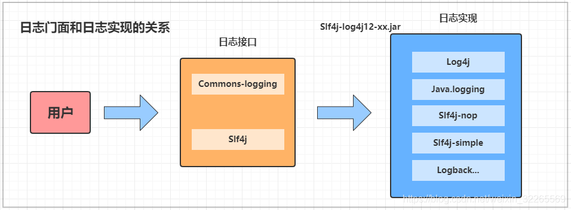
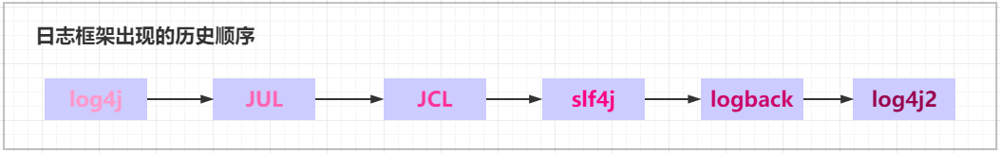
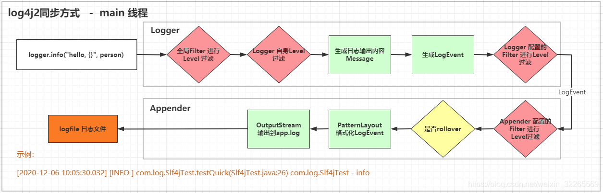
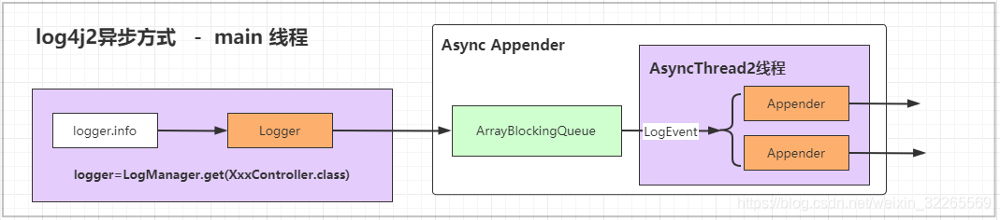
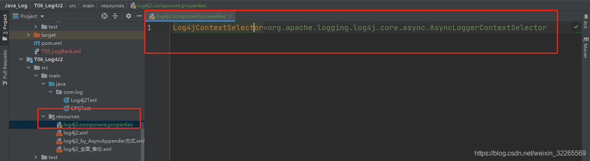
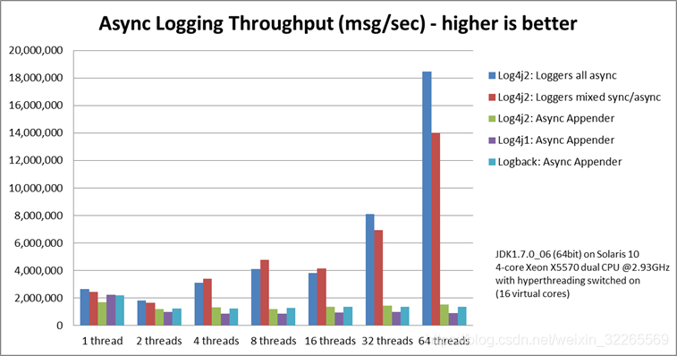

# Java 日志框架

## 日志的概念

### 日志文件

日志文件是用于记录系统操作事件的文件集合，可分为事件日志和消息日志。具有处理历史数据、诊断问题的追踪以及理解系统的活动等重要作用。

在计算机中，日志文件是记录在操作系统或其他软件运行中发生的事件或在通信软件的不同用户之间的消息的文件。记录是保持日志的行为，在最简单的情况下，消息被写入单个日志文件。

许多操作系统，软件框架和程序包括日志系统。广泛使用的日志记录标准是在因特网工程任务组(IETE) RFC5424中定义的syslog。syslog标准使专用的标准化子系统能够生成，过滤，记录和分析日志消息。


### 调试日志

软件开发中，我们经常需要去调试程序，做一些信息，状态的输出便于我们查询程序的运行状况。为了让我们能够更加灵活和方便的控制这些调试的信息，所以我们需要专业的日志技术。java 中寻找bug 会需要重现。调试也就是debug 可以在程序运行中暂停程序运行，可以查看程序在运行中的情况。日志主要是为了更加方便的去重现问题。

### 系统日志

系统日志是记录系统中硬件、软件和系统问题的信息，同时还可以监视系统中发生的事件。用户可以通过它来检查错误发生的原因，或者寻找受到攻击者留下的痕迹。系统日志包括系统日志、应用程序日志和安全日志。

### 日志的价值

系统日志策略可以在故障刚刚发生时就向你发送警告信息，系统日志帮助你在最短的时间内发现问题。


## Java日志框架

打印日志的需求：

1. 控制日志输出的内容和格式
2. 控制日志输出的位置
3. 日志优化：异步日志、日志文件的归档和压缩
4. 日志系统的维护
5. 面向接口开发 -- 日志的门面

### 为什么要用日志框架

因为软件系统发展到今天已经很复杂了，特别是服务器端软件，涉及到的知识、内容、问题太多。在某些方面使用别人成熟的框架，就相当于让别人帮你完成一些基础工作，你只需要集中精力完成系统的业务逻辑设计。而且框架一般是成熟、稳键的，它可以处理系统很多细节问题，比如，事务处理、安全性，数据流控制等问题。还有框架一般都经过很多人使用，所以结构很好，所以扩展性也很好，而且它是不断升级的，你可以直接享受别人升级代码带来的好处。

### 现有日志框架

- JUL（java util logging）、logback、log4j、log4j2
- JCL（Jakarta Commons Logging）、slf4j（Simple Logging Facade for Java）

#### 日志门面

JCL、slf4j

#### 日志实现

JUL、logback、log4j、log4j2【目前性能最好的日志处理技术】


## JUL解析

JUL 全称Java util Logging 是java 原生的日志框架，使用时不需要另外引用第三方类库，相对其他日志框架使用方便、学习简单、能够在小型应用中灵活使用。

### JUL入门

#### 架构介绍


- Loggers：被称为记录器，应用程序通过获取Logger 对象，调用其API 来发布日志信息。Logger 通常时应用程序访问日志系统的入口程序。
- Appenders：也被称为Handlers，每个Logger 都会关联一组Handlers，Logger会将日志交给关联Handlers处理，由Handlers 负责将日志做记录。Handlers 在此是一个抽象，其具体的实现决定了日志记录的位置可以是控制台、文件、网络上的其他日志服务或操作系统日志等。
- Layouts：也被称为Formatters，它负责对日志事件中的数据进行转换和格式化。Layouts决定了数据在一条日志记录中的最终形式。
- Level：每条日志消息都有一个关联的日志级别。该级别精略指导了日志消息的重要性和紧迫，我可以将Level 和 Loggers，Appenders做关联以便于我们过滤消息。
- Filters：过滤器，根据需要定制哪些信息会被记录，哪些信息会被放过。

**总结一下就是：**

用户使用Logger来进行日志记录，Logger持有若干个Handler，日志的输出操作是由Handler完成的。在Handler在输出日志前，会经过Filter的过滤，判断哪些日志级别过滤放行哪些拦截，Handler会将日志内容输出到指定位置（日志文件、控制台等）。Handler在输出日志时会使用Layout，将输出内容进行排版。

代码示例：

```java
import org.junit.Test;
 
import java.util.logging.Level;
import java.util.logging.Logger;
 
public class T01_JULTest {
    // 快速入门
    @Test
    public void testQuick() {
        // 1.创建日志记录器对象
        Logger logger = Logger.getLogger("com.log.test.JULTest");
        // 2.日志记录输出
        logger.info("hello jul");
 
        // 通用方法进行日志记录
        logger.log(Level.INFO, "info msg");
 
        // 通过点位符方式进行日志记录
        String name = "jack";
        Integer age = 18;
        logger.log(Level.INFO, "用户信息：{0},{1}", new Object[]{name, age});
    }
}
```

#### 日志级别

JUL中定义的日志级别：

```
* java.util.logging.Level中定义了日志的级别： 
	SEVERE（最高值） 
	WARNING 
	INFO （默认级别） 
	CONFIG 
	FINE 
	FINER 
	FINEST（最低值） 
* 还有两个特殊的级别： 
	OFF，可用来关闭日志记录。 
	ALL，启用所有消息的日志记录。
```


```java
// JUL日志级别测试
@Test
public void testLogLevel() throws Exception {
    // 1.获取日志记录器对象
    Logger logger = Logger.getLogger("com.log.T01_JULTest");
    // 2.日志记录输出
    logger.severe("server");
    logger.warning("warning");
    logger.info("info"); // jul 默认的日志级别info
    logger.config("config");
    logger.fine("fine");
    logger.finer("finer");
    logger.finest("finest");
}
```


## Log4j 解析

Log4j 是Apache 下的一款开源的日志框架，通过在项目中使用Log4J，我们可以控制日志信息输出到控制台、文件、甚至是数据库中。我们可以控制每一条日志的输出格式，通过定义日志的输出级别，可以更灵活的控制日志的输出过程。方便项目的调试。


### Log4j入门

#### 引入依赖

```xml
<dependencies> 
    <dependency> 
        <groupId>log4j</groupId> 
        <artifactId>log4j</artifactId> 
        <version>1.2.17</version> 
    </dependency> 
    <dependency> 
        <groupId>junit</groupId> 
        <artifactId>junit</artifactId> 
        <version>4.12</version> 
    </dependency> 
</dependencies>
```

#### 示例代码

```java
public class Log4jTest {
    // Log4j 基础
    @Test
    public void testQuick(){
        // 初始化配置信息，在入门案例中暂不使用配置文件
        BasicConfigurator.configure();
        // 获取日志记录器对象
        Logger logger = Logger.getLogger(Log4jTest.class);
        // 日志记录输出
        logger.info("hello log4j");
 
        // 日志级别有6种，默认的日志级别是DEBUG
        logger.fatal("fatal"); // 严重错误，一般会造成系统崩溃并终止运行
        logger.error("error"); // 错误信息，不会影响系统运行
        logger.warn("warn");   // 警告信息，可能会发生问题
        logger.info("info");   // 运行信息，数据连接、网络连接、IO 操作等等
        logger.debug("debug"); // 调试信息，一般在开发中使用，记录程序变量参数传递信息等等
        logger.trace("trace"); // 追踪信息，记录程序所有的流程信息
    }
}
```

#### 日志级别

```
* 每个Logger都被了一个日志级别（log level），用来控制日志信息的输出。日志级别从高到低分 为： 
	fatal 指出每个严重的错误事件将会导致应用程序的退出。 
	error 指出虽然发生错误事件，但仍然不影响系统的继续运行。 
	warn 表明会出现潜在的错误情形。 
	info 一般和在粗粒度级别上，强调应用程序的运行全程。 
	debug 一般用于细粒度级别上，对调试应用程序非常有帮助。 
	trace 是程序追踪，可以用于输出程序运行中的变量，显示执行的流程。 
* 还有两个特殊的级别： 
	OFF，可用来关闭日志记录。 
	ALL，启用所有消息的日志记录。
```

> 注：一般只使用4个级别，优先级从高到低为 ERROR > WARN > INFO > DEBUG


### Log4j组件

Log4J 主要由 Loggers (日志记录器)、Appenders（输出端）和 Layout（日志格式化器）组成。其中Loggers 控制日志的输出级别与日志是否输出；Appenders 指定日志的输出方式（输出到控制台、文件等）；Layout 控制日志信息的输出格式。

#### Loggers

日志记录器，负责收集处理日志记录，实例的命名就是类 "XX" 的 full quailied name （类的全限定名），Logger 的名字大小写敏感，其命名有继承机制：例如： name 为 org.apache.commons 的logger 会继承 name 为 org.apache 的 logger。

Log4J 中有一个特殊的logger 叫做 "root" ，他是所有 logger 的根，也就意味着他所有的 logger 都会直接或间接地继承自 root。root logger 可以用 Logger.getRootLogger() 方法获取。

但是，自Log4J 1.2版本以来，Logger 类已经取代了 Category 类。对于熟悉早期版本的 log4j 的人来说，Logger 类可以被视为 Category 类的别名。


#### Appenders

Appender 用来指定日志输出到哪个地方，可以同时指定日志的输出目的地。Log4j 常用的输出目的有以下几种：

| 输出端类型               | 作用                                                         |
| ------------------------ | ------------------------------------------------------------ |
| ConsoleAppender          | 将日志输出到控制台                                           |
| FileAppender             | 将日志输出到文件中                                           |
| DailyRollingFileAppender | 将日志输出一个日志文件中，并且每天输出到一个新的文件         |
| RollingFileAppender      | 将日志信息输出到一个日志文件，并且指定文件的尺寸，当文件大小达到指定尺寸时，会自动把文件改名，同时产生一个新的文件 |
| JDBCAppender             | 把日志信息保存到数据库中                                     |

#### Layouts

布局器 Layouts 用于控制日志输出内容的格式，让我们可以使用各种需要的格式输出日志。Log4j 常用的 Layouts:

| 格式化器类型  | 作用                                                     |
| ------------- | -------------------------------------------------------- |
| HTMLLayout    | 格式化日志输出为HTML 表格形式                            |
| SimpleLayout  | 简单的日志输出格式化，打印的日志格式为（info - message） |
| PatternLayout | 最强大的格式化器，可以根据自定义                         |

### Layout的格式

在 log4j.properties 配置文件中，我们定义了日志输出级别与输出端，在输出端中分别配置日志的输出格式。

log4j 采用类似 c 语言的 printf 函数的打印格式格式化日志信息，具体的占位符及其含义如下：

| 占位符 | 描述                                                         |
| ------ | ------------------------------------------------------------ |
| %m     | 输出代码中指定的日志信息                                     |
| %p     | 输出优先级，及 DEBUG、INFO 等                                |
| %n     | 换行符 （Windows 平台的换行符为 "\n", Unix 平台为 "\n"）     |
| %r     | 输出自应用启动到输出该 log 信息耗费的毫秒数                  |
| %c     | 输出打印语句所属的类的全称                                   |
| %t     | 输出产生该日志的线程全名                                     |
| %d     | 输出服务器当前时间，默认为 ISO8601，也可以指定格式，如：%d{yyyy年MM月dd日 HH:mm:ss} |
| %l     | 输出日志时间发生的位置，包括类名、线程、及在代码中的行数。如：Test.main(Test.java:10) |
| %F     | 输出日志消息产生时所在的文件名称                             |
| %L     | 输出代码中的行号                                             |
| %%     | 输出一个"%" 字符                                             |

 可以在 % 与字符之间加上修饰符来控制最小宽度、最大宽度和文本的对其方式。如下：

| 占位符  | 描述                                                         |
| ------- | ------------------------------------------------------------ |
| %5c     | 输出category 名称，最小宽度是5，category < 5，默认的情况下右对齐 |
| %-5c    | 输出category 名称，最小宽度是5，category < 5，"-" 号指定左对齐，会有空格 |
| %.5c    | 输出category 名称，最大宽度是5，category > 5，就会将左边多出的字符截掉，< 5 不会有空格 |
| %20.30c | category 名称 < 20 补空格，并且右对齐，> 30 字符，就从左边较远处的字符解掉 |

log4j.properties 示例：

```properties
# 指定 RootLogger 顶级父元素默认配置信息
# 指定日志级别 = trace，使用的 appender 为 console，这个是由我们配置的
log4j.rootLogger = trace, console
# 指定控制台日志输出的 appender
log4j.appender.console = org.apache.log4j.ConsoleAppender
# 指定消息格式 layout
# log4j.appender.console.layout = org.apache.log4j.SimpleLayout
# log4j.appender.console.layout = org.apache.log4j.HTMLLayout
# log4j.appender.console.layout = org.apache.log4j.xml.XMLLayout
# 自定义日志输出格式使用是最多的，默认只会输出日志内容，没有产生的时间等信息
log4j.appender.console.layout = org.apache.log4j.PatternLayout
# 指定消息格式的内容
# log4j.appender.console.layout.conversionPattern = %r [%t] %p %c %x - %m%n
# log4j.appender.console.layout.conversionPattern = [%-10p]%r %c  %l  %d{yyyy-MM-dd HH:mm:ss.SSS}  %m%n
log4j.appender.console.layout.conversionPattern = [%-10p]%r %c  %l  %d{yyyy-MM-dd HH:mm:ss.SSS}  %m%n
 
 
# %m	输出代码中指定的日志信息
# %p	输出优先级，及 DEBUG、INFO 等
# %n	换行符 （Windows 平台的换行符为 "\n", Unix 平台为 "\n"）
# %r	输出自应用启动到输出该 log 信息耗费的毫秒数
# %c	输出打印语句所属的类的全称
# %t	输出产生该日志的线程全名
# %d	输出服务器当前时间，默认为 ISO8601，也可以指定格式，如：%d{yyyy年MM月dd日 HH:mm:ss}
# %l	输出日志时间发生的位置，包括类名、线程、及在代码中的行数。如：Test.main(Test.java:10)
# %F	输出日志消息产生时所在的文件名称
# %L	输出代码中的行号
# %%	输出一个"%" 字符
```

###  Appender的输出

控制台、文件、数据库

#### 将日志输出到控制台

```properties
# 指定日志的输出级别与输出端
# 指定 RootLogger 顶级父元素默认配置信息
# 指定日志级别 = trace，使用的 appender 为 console，这个是由我们配置的
# log4j.rootLogger = trace, console, file, rollingFile, dailyFile
log4j.rootLogger = trace, console
# 指定控制台日志输出的 appender
log4j.appender.console = org.apache.log4j.ConsoleAppender
# 指定消息格式 layout
# log4j.appender.console.layout = org.apache.log4j.SimpleLayout
# log4j.appender.console.layout = org.apache.log4j.HTMLLayout
# log4j.appender.console.layout = org.apache.log4j.xml.XMLLayout
# 自定义日志输出格式使用是最多的，默认只会输出日志内容，没有产生的时间等信息
log4j.appender.console.layout = org.apache.log4j.PatternLayout
# 指定消息格式的内容
# log4j.appender.console.layout.conversionPattern = %r [%t] %p %c %x - %m%n
log4j.appender.console.layout.conversionPattern = [%-10p]%r %c  %l  %d{yyyy-MM-dd HH:mm:ss.SSS}  %m%n
```

#### 将日志输出到文件

```properties
# 指定 RootLogger 顶级父元素默认配置信息
# 指定日志级别 = trace，使用的 appender 为 console，这个是由我们配置的
log4j.rootLogger = trace, file 
 
# 日志文件输出的 appender 对象
log4j.appender.file = org.apache.log4j.FileAppender
# 指定消息格式 layout
# log4j.appender.console.layout = org.apache.log4j.SimpleLayout
# log4j.appender.console.layout = org.apache.log4j.HTMLLayout
# log4j.appender.console.layout = org.apache.log4j.xml.XMLLayout
# 自定义日志输出格式使用是最多的，默认只会输出日志内容，没有产生的时间等信息
log4j.appender.file.layout = org.apache.log4j.PatternLayout
# 指定消息格式的内容
# log4j.appender.console.layout.conversionPattern = %r [%t] %p %c %x - %m%n
log4j.appender.file.layout.conversionPattern = [%-10p]%r %c  %l  %d{yyyy-MM-dd HH:mm:ss.SSS}  %m%n
# 指定日志文件保存路径
log4j.appender.file.file = log/log4j.log
# 指定日志文件的字符集
log4j.appender.file.encoding = UTF-8
```


#### 将日志按文件大小拆分

```properties
# 指定 RootLogger 顶级父元素默认配置信息
# 指定日志级别 = trace，使用的 appender 为 console，这个是由我们配置的
log4j.rootLogger = trace, rollingFile 
 
# 按照文件大小折分的 appender 对象
# 日志文件输出的 appender 对象
log4j.appender.rollingFile = org.apache.log4j.RollingFileAppender
# 自定义日志输出格式使用是最多的，默认只会输出日志内容，没有产生的时间等信息
log4j.appender.rollingFile.layout = org.apache.log4j.PatternLayout
# 指定消息格式的内容
# log4j.appender.console.layout.conversionPattern = %r [%t] %p %c %x - %m%n
log4j.appender.rollingFile.layout.conversionPattern = [%-10p]%r %c  %l  %d{yyyy-MM-dd HH:mm:ss.SSS}  %m%n
# 指定日志文件保存路径
log4j.appender.rollingFile.file = log/log4j.log
# 指定日志文件的字符集
log4j.appender.rollingFile.encoding = UTF-8
# 指定日志文件内容的大小
log4j.appender.rollingFile.maxFileSize = 1MB
# 指定日志文件的数量，如果超过10，它按时间进行覆盖，比较久远的数据进行覆盖
log4j.appender.rollingFile.maxBackupIndex = 10
```

#### 将日志按时间拆分

```properties
# 指定 RootLogger 顶级父元素默认配置信息
# 指定日志级别 = trace，使用的 appender 为 console，这个是由我们配置的
log4j.rootLogger = trace, dailyFile
 
# 按照时间规则拆分的 appender 对象
# 日志文件输出的 appender 对象
log4j.appender.dailyFile = org.apache.log4j.DailyRollingFileAppender
# 自定义日志输出格式使用是最多的，默认只会输出日志内容，没有产生的时间等信息
log4j.appender.dailyFile.layout = org.apache.log4j.PatternLayout
# 指定消息格式的内容
# log4j.appender.console.layout.conversionPattern = %r [%t] %p %c %x - %m%n
log4j.appender.dailyFile.layout.conversionPattern = [%-10p]%r %c  %l  %d{yyyy-MM-dd HH:mm:ss.SSS}  %m%n
# 指定日志文件保存路径
log4j.appender.dailyFile.file = log/log4j.log
# 指定日志文件的字符集
log4j.appender.dailyFile.encoding = UTF-8
# 指定日期拆分规则
log4j.appender.dailyFile.datePattern = '.'yyyy-MM-dd-HH-mm-ss
```

#### 将日志存入数据库

先创建数据库表

```sql
-- 创建java_log数据库。注意：库名与应用名称保持一致
CREATE DATABASE IF NOT EXISTS `java_log`;
 
-- 使用java_log
USE java_log;
 
-- 创建log 表
CREATE TABLE IF NOT EXISTS `log` (
  `id` BIGINT UNSIGNED AUTO_INCREMENT COMMENT '主键',
  `create_time` DATETIME DEFAULT CURRENT_TIMESTAMP COMMENT '创建时间',
  `update_time` DATETIME DEFAULT CURRENT_TIMESTAMP ON UPDATE CURRENT_TIMESTAMP COMMENT '更新时间',
  
  `project_name` VARCHAR(255) DEFAULT NULL COMMENT '项目名',
  `create_date` VARCHAR(255) DEFAULT NULL COMMENT '创建时间',
  `level` VARCHAR(255) DEFAULT NULL COMMENT '优先级',
  `category` VARCHAR(255) DEFAULT NULL COMMENT '所在类的全名',
  `file_name` VARCHAR(255) DEFAULT NULL COMMENT '输出日志消息产生时所在的文件名称',
  `thread_name` VARCHAR(255) DEFAULT NULL COMMENT '日志事件的线程名',
  `line` VARCHAR(255) DEFAULT NULL COMMENT '行号',
  `all_category` VARCHAR(255) DEFAULT NULL COMMENT '日志事件的发生位置',
  `message` VARCHAR(4000) DEFAULT NULL COMMENT '输出代码中指定的消息',
  PRIMARY KEY (`id`)
) ENGINE=INNODB DEFAULT CHARSET=utf8;
 
-- INSERT INTO `log`(project_name, create_date, level, category, file_name, thread_name, line, all_category, message) values ('java_log', '%d{yyyy-MM-dd HH:mm:ss}', '%p', '%c', '%F', '%t', '%L', '%l', '%m')
```

配置文件

```properties
# 指定 RootLogger 顶级父元素默认配置信息
# 指定日志级别 = trace，使用的 appender 为 console，这个是由我们配置的
# log4j.rootLogger = trace, console, file, rollingFile, dailyFile
log4j.rootLogger = trace, logDB
 
 
# MySQL
log4j.appender.logDB=org.apache.log4j.jdbc.JDBCAppender
log4j.appender.logDB.layout=org.apache.log4j.PatternLayout
log4j.appender.logDB.Driver=com.mysql.jdbc.Driver
log4j.appender.logDB.URL=jdbc:mysql://localhost:3306/java_log
log4j.appender.logDB.User=root
log4j.appender.logDB.Password=1234
log4j.appender.logDB.Sql=INSERT INTO `log`(project_name, create_date, level, category, file_name, thread_name, line, all_category, message) values ('java_log', '%d{yyyy-MM-dd HH:mm:ss}', '%p', '%c', '%F', '%t', '%L', '%l', '%m')
```


### 自定义Logger日志

配置不同的包使用不同的日志级别以及Appender类型

```properties
# RootLogger配置 
log4j.rootLogger = trace,console 
# 自定义Logger 
log4j.logger.com.itheima = info,file 
log4j.logger.org.apache = error
```


## 日志门面

当我们的系统变的更加复杂的时候，我们的日志就容易发生混乱。随着系统开发的进行，可能会更新不同的日志框架，造成当前系统中存在不同的日志依赖，让我们难以统一的管理和控制。就算我们强制要求所有的模块使用相同的日志框架，系统中也难以避免使用其他类似 spring, mybatis 等其他的第三方框架，它们依赖于我们规定不同的日志框架，而且他们自身的日志系统就有着不一致性，依然会出来日志体系的混乱。

所以我们需要借鉴JDBC 的思想，为日志系统也提供一套门面，那么我们就可以面向这些接口规范来开发，避免了直接依赖具体的日志框架。这样我们的系统在日志中，就存在了日志的门面和日志的实现。

**常见的日志门面：**

JCL(已经被淘汰了)、slf4j(目前主流)

**常见的日志实现：**

JUL、log4j、logback、log4j2

日志门面和日志实现的关系：



日志框架出现的历史顺序：



目前主流使用日志是采用日志门面技术：**slf4j + logback** 或 **slf4j + log4j2**


## SLF4J 解析

简单日志门面（Simple Logging Facade For Java） SLF4J 主要是为了给 Java 日志访问提供一个标准、规范的API框架，其主要意义在于提供接口，具体的实现可以交由其他日志框架，例如log4j 和 logback 等。当然 slf4j 自己也提供了功能较为简单的实现。但是一般很少用到。对于一般的 Java 项目而言，日志框架会选择 slf4j-api 作为门面，配上具体的实现框架（log4j、logback等），中间使用桥接器完成桥接。

SLF4J 是目前 市面上最流行的日志门面。现在的项目中，基本上都是使用SLF4J 作为我们的日志系统。SLF4J 日志门面主要提供两大功能：

1. **日志框架的绑定**
2. **日志框架的桥接**

### SLF4J入门

slf4j只是一个日志门面，在slf4j-api.jar中之定义了一些标准接口，所以我们需要同时引入一个实现。

```xml
<dependency>
    <groupId>org.slf4j</groupId>
    <artifactId>slf4j-api</artifactId>
</dependency>
<dependency>
    <groupId>org.slf4j</groupId>
    <artifactId>slf4j-simple</artifactId>
</dependency>
```

先来一个Hello World

```java
import org.slf4j.Logger;
import org.slf4j.LoggerFactory;
public class Test02 {
    Logger logger = LoggerFactory.getLogger(Test02.class);
    @Test
    public void testLog(){
        logger.info("hello world");
    }
}
```


### SFL4J 绑定日志的实现

如前所述，SLF4J 支持各种日志框架。SLF4J 发行版本附带了几件称为"SLF4J绑定" 的jar 文件，每个绑定对应一个受支持的框架。

使用slf4j 的日志绑定流程：

- 添加slf4j-api 的依赖

- 使用slf4j 的API 在项目中进行统一的日志记录
- 绑定具体的日志实现框架
  - 绑定已经实现了slf4j 的日志框架，直接添加对应依赖
  - 绑定没有实现 slf4j 的日志框架，先添加日志的适配器，再添加实现类的依赖
- slf4j 有且仅有一个日志实现框架的绑定（如果出现多个默认使用第一个依赖日志实现）


## Logback的使用

Logback 是由log4j 创始人设计的另一个开源日志组件，性能比log4j 要好。官方网站：https://logback.qos.ch/index.html

Logback 主要分为三个模块：

- logback-core：其它两个模块的基础模块
- logback-classic：它是log4j 的一个改良版本，同时它完整实现了slf4j API
- logback-access：访问模块与Servlet 容器集成提供通过Http 来访问日志的功能

后续的日志代码都是通过SLF4J 日志门面搭建日志系统，所以在代码是没有区别，主要是通过修改配置文件和pom.xml 依赖。

#### Logback入门

添加依赖

```xml
<dependency>
    <groupId>org.slf4j</groupId>
    <artifactId>slf4j-api</artifactId>
</dependency>
<dependency>
    <groupId>ch.qos.logback</groupId>
    <artifactId>logback-classic</artifactId>
</dependency>
<dependency>
    <groupId>ch.qos.logback</groupId>
    <artifactId>logback-core</artifactId>
</dependency>
```

代码

```java
import org.slf4j.Logger;
import org.slf4j.LoggerFactory;

public class Test02 {

    Logger logger = LoggerFactory.getLogger(Test02.class);

    @Test
    public void testLog(){
        logger.error("error");
        logger.warn("warn");
        logger.info("info");
        logger.debug("debug");
        logger.trace("trace");
    }
}
```


#### Logback的配置

logback 会依次读取以下类型配置文件：

- logback.groovy
- logback-test.xml  测试环境下的配置文件
- logback.xml 如果均不存在会采用默认配置

1、logback 组件之间的关系

Logger：日志的记录器，把它关联到应的对应的context 上后，主要用于存放日志对象，也可以定义日志类型、级别。

Appender：用于指定日志输出的目的地，目的地可以是控制台、文件、数据库等等。

Layout：负责把事件转换成字符串，格式化的日志信息的输出。在logback 中 Layout 对象被封装在encoder 中。

##### 将日志输出到控制台

```xml
<?xml version="1.0" encoding="utf-8" ?>
<configuration>

    <property name="pattern" value="[%-5level] %d{yyyy-MM-dd HH:mm:ss.SSS} %c %M %L [%thread] %m%n"></property>
    <!--
    日志输出格式：
        %-5level
        %d{yyyy-MM-dd HH:mm:ss.SSS}日期
        %c类的完整信息
        %M为method
        %L为行号
        %thread线程名称
        %m或者%msg 为信息
        %n换行
    -->
 
    <!--
	Appender: 设置日志信息的去向,常用的有以下几个 
		ch.qos.logback.core.ConsoleAppender (控制台)
		ch.qos.logback.core.rolling.RollingFileAppender (文件大小到达指定尺 寸的时候产生一个新文件) 
    	ch.qos.logback.core.FileAppender (文件) 
	-->
    <appender name="console" class="ch.qos.logback.core.ConsoleAppender">
        <!-- 控制输出流对象 默认System.out 改为 System.err -->
        <target>System.err</target>
        <!-- 日志消息格式配置 -->
        <encoder class="ch.qos.logback.classic.encoder.PatternLayoutEncoder">
            <pattern>${pattern}</pattern>
        </encoder>
    </appender>
 
    <!--
        用来设置某一个包或者具体的某一个类的日志打印级别、以及指定<appender>。 
        <logger>仅有一个name属性，一个可选的level和一个可选的addtivity属性 
            name: 用来指定受此logger约束的某一个包或者具体的某一个类。 
            level:用来设置打印级别，大小写无关：TRACE, DEBUG, INFO, WARN, ERROR, ALL 和 OFF， 
                如果未设置此属性，那么当前logger将会继承上级的级别。
            additivity: 是否向上级loger传递打印信息。默认是true。 
        <logger>可以包含零个或多个<appender-ref>元素，标识这个appender将会添加到这个 logger
	--> 
    
    <!--
        也是<logger>元素，但是它是根logger。默认debug 
            level:用来设置打印级别，大小写无关：TRACE, DEBUG, INFO, WARN, ERROR, ALL 和 OFF， 
        <root>可以包含零个或多个<appender-ref>元素，标识这个appender将会添加到这个 logger。 
	-->
    <root level="ALL">
        <appender-ref ref="console"></appender-ref>
    </root>
</configuration>
```


##### 将日志输出到文件

```xml
<?xml version="1.0" encoding="utf-8" ?>
<configuration>
    <!-- 自定义属性 可以通过${name}进行引用-->
    <property name="pattern" value="[%-5level] %d{yyyy-MM-dd HH:mm:ss.SSS} %c %M %L [%thread] %m%n"></property>
    <!--
    日志输出格式：
        %-5level
        %d{yyyy-MM-dd HH:mm:ss.SSS}日期
        %c类的完整信息
        %M为method
        %L为行号
        %thread线程名称
        %m或者%msg 为信息
        %n换行
    -->
 
    <!-- 定义日志文件保存路径属性 -->
    <property name="log_dir" value="logs"></property>
 
    <!-- 日志文件输出的 appender -->
    <appender name="file" class="ch.qos.logback.core.FileAppender">
        <!-- 日志文件保存路径 -->
        <file>${log_dir}/logback.log</file>
        <!-- 日志消息格式配置，默认格式 -->
        <encoder class="ch.qos.logback.classic.encoder.PatternLayoutEncoder">
            <pattern>${pattern}</pattern>
        </encoder>
    </appender>
 
    <!-- html 格式日志文件输出 appender 【查阅较为方便】 -->
    <appender name="htmlFile" class="ch.qos.logback.core.FileAppender">
        <!-- 日志文件保存路径 -->
        <file>${log_dir}/logback.html</file>
        <!-- html 消息格式配置 -->
        <encoder class="ch.qos.logback.core.encoder.LayoutWrappingEncoder">
            <layout class="ch.qos.logback.classic.html.HTMLLayout">
                <!--<pattern>${pattern}</pattern>-->
                <pattern>%-5level%d{yyyy-MM-dd HH:mm:ss.SSS}%c%M%L%thread%m</pattern>
            </layout>
        </encoder>
    </appender>
 
    <!-- root logger 配置 -->
    <root level="ALL">
        <appender-ref ref="file"/>    <!-- 文件输出 -->
        <appender-ref ref="htmlFile"/>    <!-- 文件输出 -->
    </root>
</configuration>
```

##### 日志按大小拆分

```xml
<?xml version="1.0" encoding="utf-8" ?>
<configuration>
    <property name="pattern" value="[%-5level] %d{yyyy-MM-dd HH:mm:ss.SSS} %c %M %L [%thread] %m%n"></property>
    <!--
    日志输出格式：
        %-5level
        %d{yyyy-MM-dd HH:mm:ss.SSS}日期
        %c类的完整信息
        %M为method
        %L为行号
        %thread线程名称
        %m或者%msg 为信息
        %n换行
    -->
 
    <!-- 定义日志文件保存路径属性 -->
    <property name="log_dir" value="logs"></property>
 
    <!-- 日志拆分和归档压缩的 appender 对象 -->
    <appender name="rollFile" class="ch.qos.logback.core.rolling.RollingFileAppender">
        <!-- 日志文件保存路径 -->
        <file>${log_dir}/roll_logback.log</file>
        <!-- 日志消息格式配置 -->
        <encoder class="ch.qos.logback.classic.encoder.PatternLayoutEncoder">
            <pattern>${pattern}</pattern>
        </encoder>
        <!-- 指定拆分规则 -->
        <rollingPolicy class="ch.qos.logback.core.rolling.SizeAndTimeBasedRollingPolicy">
            <!-- 按照时间和压缩格式声明拆分的文件名 -->
            <fileNamePattern>${log_dir}/rolling.%d{yyyy-MM-dd-HH-mm-ss}.log%i.log</fileNamePattern>
            <!-- 按照文件大小拆分 -->
            <maxFileSize>1MB</maxFileSize>
        </rollingPolicy>
    </appender>
 
    <!-- root logger 配置 -->
    <root level="ALL">
        <appender-ref ref="rollFile"/>    <!-- 拆分文件输出 -->
    </root>
</configuration>
```


##### Filter和异步日志

```xml
<?xml version="1.0" encoding="utf-8" ?>
<configuration>
    <property name="pattern" value="[%-5level] %d{yyyy-MM-dd HH:mm:ss.SSS} %c %M %L [%thread] %m%n"></property>
    <!--
    日志输出格式：
        %-5level
        %d{yyyy-MM-dd HH:mm:ss.SSS}日期
        %c类的完整信息
        %M为method
        %L为行号
        %thread线程名称
        %m或者%msg 为信息
        %n换行
    -->
 
    <!-- 定义日志文件保存路径属性 -->
    <property name="log_dir" value="logs"></property>
 
    <!-- 日志拆分和归档压缩的 appender 对象 -->
    <appender name="rollFile" class="ch.qos.logback.core.rolling.RollingFileAppender">
        <!-- 日志文件保存路径 -->
        <file>${log_dir}/roll_logback.log</file>
        <!-- 日志消息格式配置 -->
        <encoder class="ch.qos.logback.classic.encoder.PatternLayoutEncoder">
            <pattern>${pattern}</pattern>
        </encoder>
        <!-- 指定拆分规则 -->
        <rollingPolicy class="ch.qos.logback.core.rolling.SizeAndTimeBasedRollingPolicy">
            <!-- 按照时间和压缩格式声明拆分的文件名 -->
            <fileNamePattern>${log_dir}/rolling.%d{yyyy-MM-dd-HH-mm-ss}.log%i.log</fileNamePattern>
            <!-- 按照文件大小拆分 -->
            <maxFileSize>1MB</maxFileSize>
        </rollingPolicy>
        <!-- 日志级别过滤器 -->
        <filter class="ch.qos.logback.classic.filter.LevelFilter">
            <!-- 日志过滤规则 -->
            <level>ERROR</level>
            <onMatch>ACCEPT</onMatch>
            <onMismatch>DENY</onMismatch>
        </filter>
    </appender>
    
    <!-- 异步日志 -->
    <appender name="async" class="ch.qos.logback.classic.AsyncAppender">
        <!-- 指定某个具体的 appender -->
        <appender-ref ref="rollFile"/>
    </appender>
 
    <!-- root logger 配置 -->
    <root level="ALL">
        <appender-ref ref="async"/>    <!-- 异步日志 -->
    </root>
</configuration>      
```


#### logback-access的使用

logback-access 模块与Servlet 容器（如Tomcat 和 Jetty）集成，以提供HTTP 访问日志功能。我们可以使用logback-access 模块来替换tomcat 的访问日志。


## Log4J解析

Apache Log4j2 是对Log4j 的升级版本，参考了logback 的一些优秀的设计，并且修复了一些问题，因此带来了一些重大的提升，主要有：

- **异常处理**：在logback中，Appender中的异常不会被应用感知到，但是在log4j2中，提供了一些异常处理机制。

- **性能提升**：log4j2 相较于log4j 和 logback 都具有明显的性能提升，有18倍性能提升，后面会有官方测试的数据。

- **自动重载配置**，参考了logback的设计，当然会提供自动刷新参数配置，最实用的就是我们在生产上可以动态的修改日志的级别而不需要重启应用。

- **无垃圾机制**，log4j2 在大部分情况下，都可以使用其设计的一套无垃圾机制【对象重用、内存缓冲】，避免频繁的日志收集导致的 jvm gc。


### Log4j2 入门

目前市面上最主流的日志门面就是SLF4J，虽然Log4j2 也是日志门面，因为它的日志实现功能非常强大，性能优越。所以大家一般还是将 Log4j2 看作是日志的实现，**Slf4j + Log4j2 应该是未来的大势所趋**。

添加依赖

```xml
<!-- log4j2 日志门面 -->
<dependency>
    <groupId>org.apache.logging.log4j</groupId>
    <artifactId>log4j-api</artifactId>
    <version>2.11.1</version>
</dependency>
<!-- log4j2 日志实面 -->
<dependency>
    <groupId>org.apache.logging.log4j</groupId>
    <artifactId>log4j-core</artifactId>
    <version>2.11.1</version>
</dependency>
```

代码实现

```java
import org.apache.logging.log4j.LogManager;
import org.apache.logging.log4j.Logger;
import org.junit.Test;
 
public class Log4j2Test {
    // 定义日志记录器对象
    public static final Logger LOGGER = LogManager.getLogger(Log4j2Test.class);
    // 快速入门
    @Test
    public void testQuick() throws Exception {
        // 日志消息输出
        LOGGER.fatal("fatal");
        LOGGER.error("error");
        LOGGER.warn("warn");
        LOGGER.info("info");
        LOGGER.debug("debug");
        LOGGER.trace("trace");
    }
}
```


使用SLF4J作为日志门面的maven依赖

```xml
<!--log4j2的核心包-->
<dependency>
    <groupId>org.apache.logging.log4j</groupId>
    <artifactId>log4j-core</artifactId>
    <version>2.9.1</version>
</dependency>
<!-- Web项目需添加 -->
<dependency>
    <groupId>org.apache.logging.log4j</groupId>
    <artifactId>log4j-web</artifactId>
    <version>2.9.1</version>
</dependency>
<!--用于与slf4j保持桥接-->
<dependency>
    <groupId>org.apache.logging.log4j</groupId>
    <artifactId>log4j-slf4j-impl</artifactId>
    <version>2.9.1</version>
</dependency>
<!-- slf4j的门面-->
<dependency>
    <groupId>org.slf4j</groupId>
    <artifactId>slf4j-api</artifactId>
    <version>1.7.25</version>
</dependency>
```


### Log4j2的配置

log4j2 默认加载classpath 下的 log4j2.xml 文件中的配置。下面通过log4j2.xml 配置文件进行测试

```xml
<?xml version="1.0" encoding="UTF-8" ?>
<!--
    status="warn" 日志框架本身的输出日志级别，可以修改为debug
    monitorInterval="5" 自动加载配置文件的间隔时间，不低于 5秒；生产环境中修改配置文件，是热更新，无需重启应用
 -->
<configuration status="warn" monitorInterval="5">
    <!--
    集中配置属性进行管理
    使用时通过:${name}
    -->
    <properties>
        <property name="LOG_HOME">D:/logs</property>
    </properties>
 
    <!-- 日志处理 -->
    <Appenders>
        <!-- 控制台输出 appender，SYSTEM_OUT输出黑色，SYSTEM_ERR输出红色 -->
        <Console name="Console" target="SYSTEM_OUT">
            <PatternLayout pattern="%d{HH:mm:ss.SSS} [%t] [%-5level] %c{36}:%L --- %m%n" />
        </Console>
 
        <!-- 日志文件输出 appender -->
        <File name="file" fileName="${LOG_HOME}/myfile.log">
            <PatternLayout pattern="[%d{yyyy-MM-dd HH:mm:ss.SSS}] [%-5level] %l %c{36} - %m%n" />
        </File>
 
        <!-- 使用随机读写流的日志文件输出 appender，性能提高 -->
        <RandomAccessFile name="accessFile" fileName="${LOG_HOME}/myAcclog.log">
            <PatternLayout pattern="[%d{yyyy-MM-dd HH:mm:ss.SSS}] [%-5level] %l %c{36} - %m%n" />
        </RandomAccessFile>
 
        <!-- 按照一定规则拆分的日志文件的appender -->  <!-- 拆分后的文件 -->
        <!-- filePattern="${LOG_HOME}/$${date:yyyy-MM-dd}/myrollog-%d{yyyy-MM-dd-HH-mm}-%i.log"> -->
        <RollingFile name="rollingFile" fileName="${LOG_HOME}/myrollog.log"
                     filePattern="${LOG_HOME}/$${date:yyyy-MM-dd}/myrollog-%d{yyyy-MM-dd}-%i.log">
            <!-- 日志级别过滤器 -->
            <ThresholdFilter level="debug" onMatch="ACCEPT" onMismatch="DENY" />
            <!-- 日志消息格式 -->
            <PatternLayout pattern="[%d{yyyy-MM-dd HH:mm:ss.SSS}] [%-5level] %l %c{36} - %msg%n" />
            <Policies>
                <!-- 在系统启动时，出发拆分规则，生产一个新的日志文件 -->
                <OnStartupTriggeringPolicy />
                <!-- 按照文件大小拆分，10MB -->
                <SizeBasedTriggeringPolicy size="2MB" />
                <!-- 按照时间节点拆分，规则根据filePattern定义的 -->
                <TimeBasedTriggeringPolicy />
            </Policies>
            <!-- 在同一个目录下，文件的个限定为 30个，超过进行覆盖 -->
            <DefaultRolloverStrategy max="10" />
        </RollingFile>
 
    </Appenders>
 
    <!-- logger 定义 -->
    <Loggers>
        <!-- 使用 rootLogger 配置 日志级别 level="trace" -->
        <Root level="trace">
            <!-- 指定日志使用的处理器 -->
           <!-- <AppenderRef ref="Console" />-->
            <AppenderRef ref="file" />
            <AppenderRef ref="rollingFile" />
            <AppenderRef ref="accessFile" />
        </Root>
    </Loggers>
</configuration>
```


### Log4j2的异步日志

log4j2 最大的特点就是异步日志，其性能的提升主要也是从异步日志中受益，我们来看看如何使用log4j2 的异步日志。

同步日志



异步日志：



Log4j2提供了两种实现日志的方式，一个是通过AsyncAppender，一个是通过AsyncLogger，分别对应前面我们说的Appender组件和Logger组件。

注意：配置异步日志需要添加依赖

```xml
<!--异步日志依赖 -->
<dependency>
    <groupId>com.lmax</groupId>
    <artifactId>disruptor</artifactId>
    <version>3.3.4</version>
</dependency>
```

1、AsyncAppender 方式【**生产上几乎不使用，因为性能低下**】

```xml
<?xml version="1.0" encoding="UTF-8" ?>
<!--
    status="warn" 日志框架本身的输出日志级别，可以修改为debug
    monitorInterval="5" 自动加载配置文件的间隔时间，不低于 5秒；生产环境中修改配置文件，是热更新，无需重启应用
 -->
<configuration status="warn" monitorInterval="5">
    <!--
    集中配置属性进行管理
    使用时通过:${name}
    -->
    <properties>
        <property name="LOG_HOME">D:/logs</property>
    </properties>
 
    <!-- 日志处理 -->
    <Appenders>
        <!-- 控制台输出 appender，SYSTEM_OUT输出黑色，SYSTEM_ERR输出红色 -->
        <Console name="Console" target="SYSTEM_OUT">
            <PatternLayout pattern="%d{HH:mm:ss.SSS} [%t] [%-5level] %c{36}:%L --- %m%n" />
        </Console>
 
        <!-- 日志文件输出 appender -->
        <File name="file" fileName="${LOG_HOME}/myfile.log">
            <!--<PatternLayout pattern="[%d{yyyy-MM-dd HH:mm:ss.SSS}] [%-5level] %l %c{36} - %m%n" />-->
            <PatternLayout pattern="%d %p %c{1.} [%t] %m%n" />
        </File>
 
        <Async name="Async">
            <AppenderRef ref="file" />
        </Async>
    </Appenders>
 
    <!-- logger 定义 -->
    <Loggers>
        <!-- 使用 rootLogger 配置 日志级别 level="trace" -->
        <Root level="trace">
            <!-- 指定日志使用的处理器 -->
            <AppenderRef ref="Console" />
            <!-- 使用异步 appender -->
            <AppenderRef ref="Async" />
        </Root>
    </Loggers>
</configuration>
```

2、AsyncLogger 方式【**生产上用得多，因为性能高**】

AsyncLogger 才是log4j2 的重头戏，也是官方推荐的异步方式。它可以调用Logger.log 返回的更快。你可以有两种选择：全局异步和混合异步。

- **全局异步**就是，所有日志都异步的记录，在配置文件上不用做任何改动，只需要添加一个 log4j2.component.properties 配置到 resources；


```properties
Log4jContextSelector=org.apache.logging.log4j.core.async.AsyncLoggerContextSelector
```




- **混合异步**就是，你可以在应用中同时使用同步日志和异步日志，这使得日志的配置方式更加灵活，按如下配置主要是添加截图部分即可：

```xml
<?xml version="1.0" encoding="UTF-8" ?>
<!--
    status="warn" 日志框架本身的输出日志级别，可以修改为debug
    monitorInterval="5" 自动加载配置文件的间隔时间，不低于 5秒；生产环境中修改配置文件，是热更新，无需重启应用
 -->
<configuration status="debug" monitorInterval="5">
    <!--
    集中配置属性进行管理
    使用时通过:${name}
    -->
    <properties>
        <property name="LOG_HOME">D:/logs</property>
    </properties>
 
    <!-- 日志处理 -->
    <Appenders>
        <!-- 控制台输出 appender，SYSTEM_OUT输出黑色，SYSTEM_ERR输出红色 -->
        <Console name="Console" target="SYSTEM_OUT">
            <PatternLayout pattern="%d{HH:mm:ss.SSS} [%t] [%-5level] %c{36}:%L --- %m%n" />
        </Console>
 
        <!-- 日志文件输出 appender -->
        <File name="file" fileName="${LOG_HOME}/myfile.log">
            <!--<PatternLayout pattern="[%d{yyyy-MM-dd HH:mm:ss.SSS}] [%-5level] %l %c{36} - %m%n" />-->
            <PatternLayout pattern="%d %p %c{1.} [%t] %m%n" />
        </File>
 
        <Async name="Async">
            <AppenderRef ref="file" />
        </Async>
    </Appenders>
 
    <!-- logger 定义 -->
    <Loggers>
        <!-- 自定义 logger 对象
            includeLocation="false" 关闭日志记录的行号信息，开启的话会严重影响异步输出的性能
            additivity="false" 不再继承 rootlogger对象
         -->
        <AsyncLogger name="com.log" level="trace" includeLocation="false" additivity="false">
            <AppenderRef ref="Console" />
        </AsyncLogger>
        <!-- 使用 rootLogger 配置 日志级别 level="trace" -->
        <Root level="trace">
            <!-- 指定日志使用的处理器 -->
            <AppenderRef ref="Console" />
            <!-- 使用异步 appender -->
            <AppenderRef ref="Async" />
        </Root>
    </Loggers>
</configuration>
```

**同时，AsyncLogger 混合异步日志输出需要将log4j2.component.properties 内容进行注释【因为这个是配置AsyncLogger全局异步日志输出】**

如下配置：com.log 日志是异步的， root 日志是同步的。


> 使用异步日志需要注意的问题：
>
> - 如果使用异步日志，AsyncAppender、AsyncLogger 和全局日志，不要同时出现。性能会和AsyncAppender 一致，降至最低。
>
>   **三者不要混用**
>
> - 设置 includeLocation=false，打印位置信息会急剧降低异步日志的性能，比同步日志还要慢。
>   


### Log4j2 的性能

Log4j2 最牛的地方在于异步输出日志时的性能表现，Log4j2 在多线程的环境下吞吐量与 Log4j 和 Logback 的比较如下图。下图比较中 Log4j2 有三种模式：

全局使用异步模式；

部分Logger采用异步模式；

异步Appenderf。

可以看出在前两种模式下，Log4j2 的性能较之 Log4j 和Logback有很大的优势。



**无垃圾记录**

垃圾收集暂停是延迟峰值的常见原因，并且对于许多系统而言，花费大量精力来控制这些暂停。

许多日志库（包括以前版本的Log4j）在稳态日志记录期间分配临时对象，如日志事件对象，字符串，字符数组，字节数组等。这会对垃圾收集器造成压力并增加 GC 暂停发生的概率。

从版本2.6 开始，默认情况下 Log4j 以“无垃圾” 模式运行，其中重用对象和缓冲区，并且尽可能不分配临时对象。还有一个“低垃圾”模式，它不是完全无垃圾，但不使用ThreadLocal 字段。

Log4j 2.6 中的无垃圾日志记录部分通过重用ThreadLocal 字段中的对象来实现，部分通过在将文件转换为字节时重用缓冲区来实现。

有两个单独的系统属性可用于手动控制Log4j 用于避免创建临时对象的机制：

- log4j2.enableThreadlocals  -如果"true"（非Web应用程序的默认值）对象存储在ThreadLocal 字段中并重新使用，否则将为每个日志事件创建新对象。
- log4j2.enableDirectEncoders -如果将"true" （默认）日志事件转为文本，则将文本转换为字节而不创建临时对象。注意：由于共享缓冲区上的同步，在此模式下多线程应用程序的同步日志记录性能可能更差。

真诚的建议：如果您的应用程序是多线程的并且日志记录性能很重要，请考虑使用异步记录器。