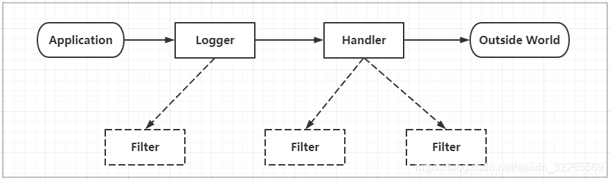
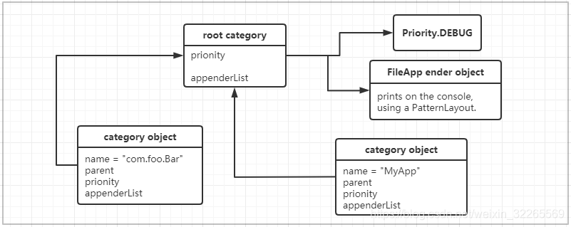

# Java 日志框架

## 日志的概念

### 日志文件

日志文件是用于记录系统操作事件的文件集合，可分为事件日志和消息日志。具有处理历史数据、诊断问题的追踪以及理解系统的活动等重要作用。

在计算机中，日志文件是记录在操作系统或其他软件运行中发生的事件或在通信软件的不同用户之间的消息的文件。记录是保持日志的行为，在最简单的情况下，消息被写入单个日志文件。

许多操作系统，软件框架和程序包括日志系统。广泛使用的日志记录标准是在因特网工程任务组(IETE) RFC5424中定义的syslog。syslog标准使专用的标准化子系统能够生成，过滤，记录和分析日志消息。


### 调试日志

软件开发中，我们经常需要去调试程序，做一些信息，状态的输出便于我们查询程序的运行状况。为了让我们能够更加灵活和方便的控制这些调试的信息，所以我们需要专业的日志技术。java 中寻找bug 会需要重现。调试也就是debug 可以在程序运行中暂停程序运行，可以查看程序在运行中的情况。日志主要是为了更加方便的去重现问题。

### 系统日志

系统日志是记录系统中硬件、软件和系统问题的信息，同时还可以监视系统中发生的事件。用户可以通过它来检查错误发生的原因，或者寻找受到攻击者留下的痕迹。系统日志包括系统日志、应用程序日志和安全日志。

### 日志的价值

系统日志策略可以在故障刚刚发生时就向你发送警告信息，系统日志帮助你在最短的时间内发现问题。


## Java日志框架

打印日志的需求：

1. 控制日志输出的内容和格式
2. 控制日志输出的位置
3. 日志优化：异步日志、日志文件的归档和压缩
4. 日志系统的维护
5. 面向接口开发 -- 日志的门面

### 为什么要用日志框架

因为软件系统发展到今天已经很复杂了，特别是服务器端软件，涉及到的知识、内容、问题太多。在某些方面使用别人成熟的框架，就相当于让别人帮你完成一些基础工作，你只需要集中精力完成系统的业务逻辑设计。而且框架一般是成熟、稳键的，它可以处理系统很多细节问题，比如，事务处理、安全性，数据流控制等问题。还有框架一般都经过很多人使用，所以结构很好，所以扩展性也很好，而且它是不断升级的，你可以直接享受别人升级代码带来的好处。

### 现有日志框架

- JUL（java util logging）、logback、log4j、log4j2
- JCL（Jakarta Commons Logging）、slf4j（Simple Logging Facade for Java）

#### 日志门面

JCL、slf4j

#### 日志实现

JUL、logback、log4j、log4j2【目前性能最好的日志处理技术】


## JUL解析

JUL 全称Java util Logging 是java 原生的日志框架，使用时不需要另外引用第三方类库，相对其他日志框架使用方便、学习简单、能够在小型应用中灵活使用。

### JUL入门

#### 架构介绍



- Loggers：被称为记录器，应用程序通过获取Logger 对象，调用其API 来发布日志信息。Logger 通常时应用程序访问日志系统的入口程序。
- Appenders：也被称为Handlers，每个Logger 都会关联一组Handlers，Logger会将日志交给关联Handlers处理，由Handlers 负责将日志做记录。Handlers 在此是一个抽象，其具体的实现决定了日志记录的位置可以是控制台、文件、网络上的其他日志服务或操作系统日志等。
- Layouts：也被称为Formatters，它负责对日志事件中的数据进行转换和格式化。Layouts决定了数据在一条日志记录中的最终形式。
- Level：每条日志消息都有一个关联的日志级别。该级别精略指导了日志消息的重要性和紧迫，我可以将Level 和 Loggers，Appenders做关联以便于我们过滤消息。
- Filters：过滤器，根据需要定制哪些信息会被记录，哪些信息会被放过。

**总结一下就是：**

用户使用Logger来进行日志记录，Logger持有若干个Handler，日志的输出操作是由Handler完成的。在Handler在输出日志前，会经过Filter的过滤，判断哪些日志级别过滤放行哪些拦截，Handler会将日志内容输出到指定位置（日志文件、控制台等）。Handler在输出日志时会使用Layout，将输出内容进行排版。

代码示例：

```java
import org.junit.Test;
 
import java.util.logging.Level;
import java.util.logging.Logger;
 
public class T01_JULTest {
    // 快速入门
    @Test
    public void testQuick() {
        // 1.创建日志记录器对象
        Logger logger = Logger.getLogger("com.log.test.JULTest");
        // 2.日志记录输出
        logger.info("hello jul");
 
        // 通用方法进行日志记录
        logger.log(Level.INFO, "info msg");
 
        // 通过点位符方式进行日志记录
        String name = "jack";
        Integer age = 18;
        logger.log(Level.INFO, "用户信息：{0},{1}", new Object[]{name, age});
    }
}
```

#### 日志级别

JUL中定义的日志级别：

```
* java.util.logging.Level中定义了日志的级别： 
	SEVERE（最高值） 
	WARNING 
	INFO （默认级别） 
	CONFIG 
	FINE 
	FINER 
	FINEST（最低值） 
* 还有两个特殊的级别： 
	OFF，可用来关闭日志记录。 
	ALL，启用所有消息的日志记录。
```


```java
// JUL日志级别测试
@Test
public void testLogLevel() throws Exception {
    // 1.获取日志记录器对象
    Logger logger = Logger.getLogger("com.log.T01_JULTest");
    // 2.日志记录输出
    logger.severe("server");
    logger.warning("warning");
    logger.info("info"); // jul 默认的日志级别info
    logger.config("config");
    logger.fine("fine");
    logger.finer("finer");
    logger.finest("finest");
}
```


## Log4j 解析

Log4j 是Apache 下的一款开源的日志框架，通过在项目中使用Log4J，我们可以控制日志信息输出到控制台、文件、甚至是数据库中。我们可以控制每一条日志的输出格式，通过定义日志的输出级别，可以更灵活的控制日志的输出过程。方便项目的调试。


### Log4j入门

#### 引入依赖

```xml
<dependencies> 
    <dependency> 
        <groupId>log4j</groupId> 
        <artifactId>log4j</artifactId> 
        <version>1.2.17</version> 
    </dependency> 
    <dependency> 
        <groupId>junit</groupId> 
        <artifactId>junit</artifactId> 
        <version>4.12</version> 
    </dependency> 
</dependencies>
```

#### 示例代码

```java
public class Log4jTest {
    // Log4j 基础
    @Test
    public void testQuick(){
        // 初始化配置信息，在入门案例中暂不使用配置文件
        BasicConfigurator.configure();
        // 获取日志记录器对象
        Logger logger = Logger.getLogger(Log4jTest.class);
        // 日志记录输出
        logger.info("hello log4j");
 
        // 日志级别有6种，默认的日志级别是DEBUG
        logger.fatal("fatal"); // 严重错误，一般会造成系统崩溃并终止运行
        logger.error("error"); // 错误信息，不会影响系统运行
        logger.warn("warn");   // 警告信息，可能会发生问题
        logger.info("info");   // 运行信息，数据连接、网络连接、IO 操作等等
        logger.debug("debug"); // 调试信息，一般在开发中使用，记录程序变量参数传递信息等等
        logger.trace("trace"); // 追踪信息，记录程序所有的流程信息
    }
}
```

#### 日志级别

```
* 每个Logger都被了一个日志级别（log level），用来控制日志信息的输出。日志级别从高到低分 为： 
	fatal 指出每个严重的错误事件将会导致应用程序的退出。 
	error 指出虽然发生错误事件，但仍然不影响系统的继续运行。 
	warn 表明会出现潜在的错误情形。 
	info 一般和在粗粒度级别上，强调应用程序的运行全程。 
	debug 一般用于细粒度级别上，对调试应用程序非常有帮助。 
	trace 是程序追踪，可以用于输出程序运行中的变量，显示执行的流程。 
* 还有两个特殊的级别： 
	OFF，可用来关闭日志记录。 
	ALL，启用所有消息的日志记录。
```

> 注：一般只使用4个级别，优先级从高到低为 ERROR > WARN > INFO > DEBUG


### Log4j组件

Log4J 主要由 Loggers (日志记录器)、Appenders（输出端）和 Layout（日志格式化器）组成。其中Loggers 控制日志的输出级别与日志是否输出；Appenders 指定日志的输出方式（输出到控制台、文件等）；Layout 控制日志信息的输出格式。

#### Loggers

日志记录器，负责收集处理日志记录，实例的命名就是类 "XX" 的 full quailied name （类的全限定名），Logger 的名字大小写敏感，其命名有继承机制：例如： name 为 org.apache.commons 的logger 会继承 name 为 org.apache 的 logger。

Log4J 中有一个特殊的logger 叫做 "root" ，他是所有 logger 的根，也就意味着他所有的 logger 都会直接或间接地继承自 root。root logger 可以用 Logger.getRootLogger() 方法获取。

但是，自Log4J 1.2版本以来，Logger 类已经取代了 Category 类。对于熟悉早期版本的 log4j 的人来说，Logger 类可以被视为 Category 类的别名。


#### Appenders

Appender 用来指定日志输出到哪个地方，可以同时指定日志的输出目的地。Log4j 常用的输出目的有以下几种：

| 输出端类型               | 作用                                                         |
| ------------------------ | ------------------------------------------------------------ |
| ConsoleAppender          | 将日志输出到控制台                                           |
| FileAppender             | 将日志输出到文件中                                           |
| DailyRollingFileAppender | 将日志输出一个日志文件中，并且每天输出到一个新的文件         |
| RollingFileAppender      | 将日志信息输出到一个日志文件，并且指定文件的尺寸，当文件大小达到指定尺寸时，会自动把文件改名，同时产生一个新的文件 |
| JDBCAppender             | 把日志信息保存到数据库中                                     |

#### Layouts

布局器 Layouts 用于控制日志输出内容的格式，让我们可以使用各种需要的格式输出日志。Log4j 常用的 Layouts:

| 格式化器类型  | 作用                                                     |
| ------------- | -------------------------------------------------------- |
| HTMLLayout    | 格式化日志输出为HTML 表格形式                            |
| SimpleLayout  | 简单的日志输出格式化，打印的日志格式为（info - message） |
| PatternLayout | 最强大的格式化器，可以根据自定义                         |

### Layout的格式

在 log4j.properties 配置文件中，我们定义了日志输出级别与输出端，在输出端中分别配置日志的输出格式。

log4j 采用类似 c 语言的 printf 函数的打印格式格式化日志信息，具体的占位符及其含义如下：

| 占位符 | 描述                                                         |
| ------ | ------------------------------------------------------------ |
| %m     | 输出代码中指定的日志信息                                     |
| %p     | 输出优先级，及 DEBUG、INFO 等                                |
| %n     | 换行符 （Windows 平台的换行符为 "\n", Unix 平台为 "\n"）     |
| %r     | 输出自应用启动到输出该 log 信息耗费的毫秒数                  |
| %c     | 输出打印语句所属的类的全称                                   |
| %t     | 输出产生该日志的线程全名                                     |
| %d     | 输出服务器当前时间，默认为 ISO8601，也可以指定格式，如：%d{yyyy年MM月dd日 HH:mm:ss} |
| %l     | 输出日志时间发生的位置，包括类名、线程、及在代码中的行数。如：Test.main(Test.java:10) |
| %F     | 输出日志消息产生时所在的文件名称                             |
| %L     | 输出代码中的行号                                             |
| %%     | 输出一个"%" 字符                                             |

 可以在 % 与字符之间加上修饰符来控制最小宽度、最大宽度和文本的对其方式。如下：

| 占位符  | 描述                                                         |
| ------- | ------------------------------------------------------------ |
| %5c     | 输出category 名称，最小宽度是5，category < 5，默认的情况下右对齐 |
| %-5c    | 输出category 名称，最小宽度是5，category < 5，"-" 号指定左对齐，会有空格 |
| %.5c    | 输出category 名称，最大宽度是5，category > 5，就会将左边多出的字符截掉，< 5 不会有空格 |
| %20.30c | category 名称 < 20 补空格，并且右对齐，> 30 字符，就从左边较远处的字符解掉 |

log4j.properties 示例：

```properties
# 指定 RootLogger 顶级父元素默认配置信息
# 指定日志级别 = trace，使用的 appender 为 console，这个是由我们配置的
log4j.rootLogger = trace, console
# 指定控制台日志输出的 appender
log4j.appender.console = org.apache.log4j.ConsoleAppender
# 指定消息格式 layout
# log4j.appender.console.layout = org.apache.log4j.SimpleLayout
# log4j.appender.console.layout = org.apache.log4j.HTMLLayout
# log4j.appender.console.layout = org.apache.log4j.xml.XMLLayout
# 自定义日志输出格式使用是最多的，默认只会输出日志内容，没有产生的时间等信息
log4j.appender.console.layout = org.apache.log4j.PatternLayout
# 指定消息格式的内容
# log4j.appender.console.layout.conversionPattern = %r [%t] %p %c %x - %m%n
# log4j.appender.console.layout.conversionPattern = [%-10p]%r %c  %l  %d{yyyy-MM-dd HH:mm:ss.SSS}  %m%n
log4j.appender.console.layout.conversionPattern = [%-10p]%r %c  %l  %d{yyyy-MM-dd HH:mm:ss.SSS}  %m%n
 
 
# %m	输出代码中指定的日志信息
# %p	输出优先级，及 DEBUG、INFO 等
# %n	换行符 （Windows 平台的换行符为 "\n", Unix 平台为 "\n"）
# %r	输出自应用启动到输出该 log 信息耗费的毫秒数
# %c	输出打印语句所属的类的全称
# %t	输出产生该日志的线程全名
# %d	输出服务器当前时间，默认为 ISO8601，也可以指定格式，如：%d{yyyy年MM月dd日 HH:mm:ss}
# %l	输出日志时间发生的位置，包括类名、线程、及在代码中的行数。如：Test.main(Test.java:10)
# %F	输出日志消息产生时所在的文件名称
# %L	输出代码中的行号
# %%	输出一个"%" 字符
```

###  Appender的输出

控制台、文件、数据库

#### 控制台

```properties
# 指定日志的输出级别与输出端
# 指定 RootLogger 顶级父元素默认配置信息
# 指定日志级别 = trace，使用的 appender 为 console，这个是由我们配置的
# log4j.rootLogger = trace, console, file, rollingFile, dailyFile
log4j.rootLogger = trace, console
# 指定控制台日志输出的 appender
log4j.appender.console = org.apache.log4j.ConsoleAppender
# 指定消息格式 layout
# log4j.appender.console.layout = org.apache.log4j.SimpleLayout
# log4j.appender.console.layout = org.apache.log4j.HTMLLayout
# log4j.appender.console.layout = org.apache.log4j.xml.XMLLayout
# 自定义日志输出格式使用是最多的，默认只会输出日志内容，没有产生的时间等信息
log4j.appender.console.layout = org.apache.log4j.PatternLayout
# 指定消息格式的内容
# log4j.appender.console.layout.conversionPattern = %r [%t] %p %c %x - %m%n
log4j.appender.console.layout.conversionPattern = [%-10p]%r %c  %l  %d{yyyy-MM-dd HH:mm:ss.SSS}  %m%n
```


https://tanzhang.blog.csdn.net/article/details/110092426?spm=1001.2101.3001.6661.1&utm_medium=distribute.pc_relevant_t0.none-task-blog-2%7Edefault%7ECTRLIST%7Edefault-1-110092426-blog-122116968.pc_relevant_multi_platform_whitelistv1&depth_1-utm_source=distribute.pc_relevant_t0.none-task-blog-2%7Edefault%7ECTRLIST%7Edefault-1-110092426-blog-122116968.pc_relevant_multi_platform_whitelistv1&utm_relevant_index=1