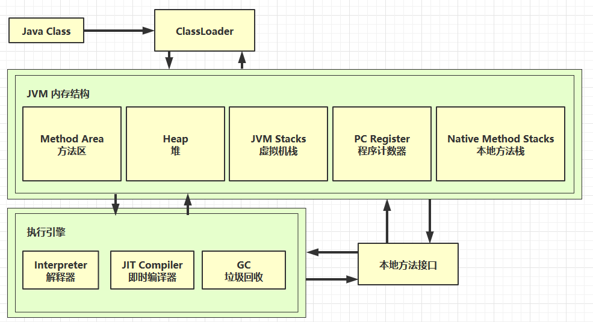
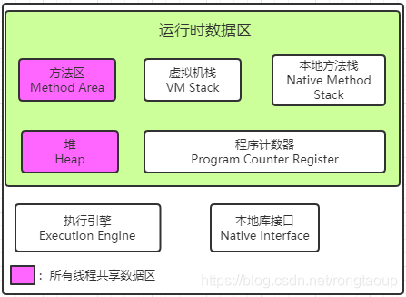
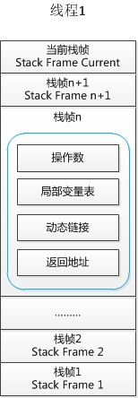
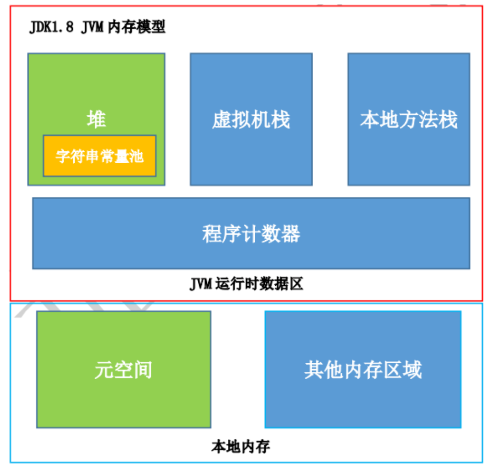
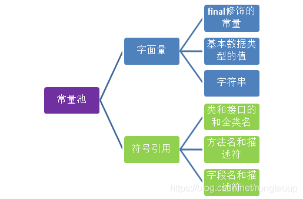

# JVM笔记

## 介绍

### 什么是JVM

Java Virtual Machine Java程序的运行环境


### 学习路线

类加载器 -> JVM内存结构 -> 执行引擎





## JVM内存结构

博客：[(41条消息) 一文搞懂JVM内存结构_xiaokanfuchen86的博客-CSDN博客_jvm内存结构](https://blog.csdn.net/xiaokanfuchen86/article/details/117625190)

Java 虚拟机在执行 Java 程序的过程中会把它管理的[内存](https://so.csdn.net/so/search?q=内存&spm=1001.2101.3001.7020)划分为若干个不同的数据区域。每个区域都有各自的作用。

分析 JVM 内存结构，主要就是分析 JVM 运行时数据存储区域。JVM 的运行时数据区主要包括：**堆、栈、方法区、程序计数器**等。而 JVM 的优化问题主要在**线程共享的数据区**中：**堆、方法区**。



### 程序计数器

Program Counter Register 程序计数器（寄存器）

- 作用，是记住下一条jvm指令的执行地址

- 特点

  - 是线程私有的

  - 不会存在内存溢出

下面给出一个例子：

```java
0: getstatic #20              // PrintStream out = System.out; 
3: astore_1                   // -- 
4: aload_1                    // out.println(1); 
5: iconst_1                   // -- 
6: invokevirtual #26          // -- 
9: aload_1                    // out.println(2); 
10: iconst_2                  // -- 
11: invokevirtual #26         // -- 
14: aload_1                   // out.println(3); 
15: iconst_3                  // -- 
16: invokevirtual #26         // -- 
19: aload_1                   // out.println(4); 
20: iconst_4                  // -- 
21: invokevirtual #26         // -- 
24: aload_1                   // out.println(5); 
25: iconst_5                  // -- 
26: invokevirtual #26         // -- 
29: return
```

以上代码的右侧是Java的源代码，左侧是二进制字节码，JVM的指令

JVM的执行流程：

JVM指令 -> 解释器 -> 机器码 -> CPU

**程序计数器（Program Counter Register）**是一块较小的内存空间，可以看作是**当前线程**所执行字节码的**行号指示器**，指向下一个将要执行的指令代码，由执行引擎来读取下一条指令。更确切的说，**一个线程的执行，是通过字节码解释器改变当前线程的计数器的值，来获取下一条需要执行的字节码指令，从而确保线程的正确执行**。

为了确保线程切换后（**上下文切换**）能恢复到正确的执行位置，**每个线程都有一个独立的程序计数器**，各个线程的计数器互不影响，独立存储。也就是说程序计数器是**线程私有的内存**。

如果线程执行 Java 方法，这个计数器记录的是正在执行的虚拟机字节码指令的地址；如果执行的是 Native 方法，计数器值为Undefined。

**程序计数器不会发生内存溢出（OutOfMemoryError即OOM）问题。**


### 虚拟机栈

#### 定义

Java Virtual Machine Stacks （Java 虚拟机栈）

- 线程私有的

- 每个线程运行时所需要的内存，称为虚拟机栈

- 每个栈由多个栈帧（Frame）组成，对应着每次方法调用时所占用的内存

- 每个线程只能有一个活动栈帧，对应着当前正在执行的那个方法


**栈帧**是栈的元素。**每个方法在执行时都会创建一个栈帧**。栈帧中存储了**局部变量表、操作数栈、动态连接和方法出口**等信息。每个方法从调用到运行结束的过程，就对应着一个栈帧在栈中压栈到出栈的过程。



JVM虚拟机栈的大小可以通过参数来指定    **-Xss size**

默认的单位是字节，也可以指定单位，如KB(k,K)、MB(m,M)、GB(g,G)

```
-Xss1m
-Xss1024KB
```

栈的大小决定了函数调用的最大深度，如果函数调用的深度大于设置的Xss大小，那么将会抛“java.lang.StackOverflowError“ 异常。

默认的情况下，栈的大小是1024KB（windows系统例外，大小依赖于虚拟内存）


> 面试题：
>
> 1. 垃圾回收是否涉及栈内存？
>
>    不需要，栈内存随着栈针的出栈而自动回收掉，所以不需要垃圾回收器来管理。
>
> 2. 占内存分配的越大越好么？
>
>    占内存过大会导致单线程占用的内存过大，总的线程数变少，不建议调整，使用默认即可。
>
> 3. 方法的局部变量是否线程安全？
>
>    局部变量是线程私有的，不存在线程安全问题。
>
> 4. 虚拟机栈和本地方法栈的区别？
>
>    Java 虚拟机栈为 JVM 执行 Java 方法服务，本地方法栈则为 JVM 使用到的 Native 方法服务。


#### 案例1：CPU占用过多

定位过程：

- 用top定位哪个进程对cpu的占用过高

- ps H -eo pid,tid,%cpu | grep 进程id （用ps命令进一步定位是哪个线程引起的cpu占用过高）

- jstack 进程id。可以根据线程id 找到有问题的线程，进一步定位到问题代码的源码行号

  这里注意一下，ps输出的线程号是十进制的，jstack输出的线程编号是十六进制的。


#### 案例2：程序运行很长时间没有结果


### 本地方法栈

线程私有。为虚拟机使用到的Native 方法服务。如Java使用c或者c++编写的接口服务时，代码在此区运行。


### 堆

堆的作用是存放对象实例和数组。通过new关键字创建的对象，都会使用堆内存。

特点：

- 它是线程共享的，堆中的对象都需要考虑线程安全问题
- 有垃圾回收机制

参数控制：

- -Xms设置堆的最小空间大小。-Xmx设置堆的最大空间大小。

异常情况：

- 如果在堆中没有内存完成实例分配，并且堆也无法再扩展时，将会抛出OutOfMemoryError 异常

### 方法区

方法区同 Java 堆一样是被所有**线程共享**的区间，用于存储**已被虚拟机加载的类信息、常量、静态变量、即时编译器编译后的代码**。在JVM启动时被创建。更具体的说，静态变量+常量+类信息（版本、方法、字段等）+运行时常量池存在方法区中。**常量池是方法区的一部分**。

方法区在逻辑上是堆的一部分，但在具体实现上不强制方法区的位置，不同的虚拟机厂 商可以有不同的实现，如 JDK1.8 之前使用永久代实现，1.8 后使用元空间实现

> **注**：JDK1.8 使用元空间 **MetaSpace** 替代方法区，元空间并不在 JVM中，而是使用本地内存。元空间两个参数：
>
> 1.  MetaSpaceSize：初始化元空间大小，控制发生GC阈值
> 2.  MaxMetaspaceSize ： 限制元空间大小上限，防止异常占用过多物理内存
>
> 


#### 常量池

常量池中存储编译器生成的各种**字面量和符号引用**。字面量就是Java中常量的意思。比如文本字符串，final修饰的常量等。方法引用则包括类和接口的全限定名，方法名和描述符，字段名和描述符等。




优点：

- 常量池避免了频繁的创建和销毁对象而影响系统性能，其实现了对象的共享。


-


