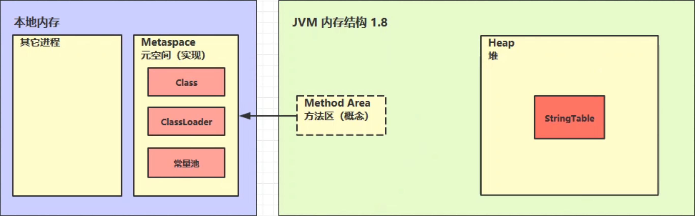
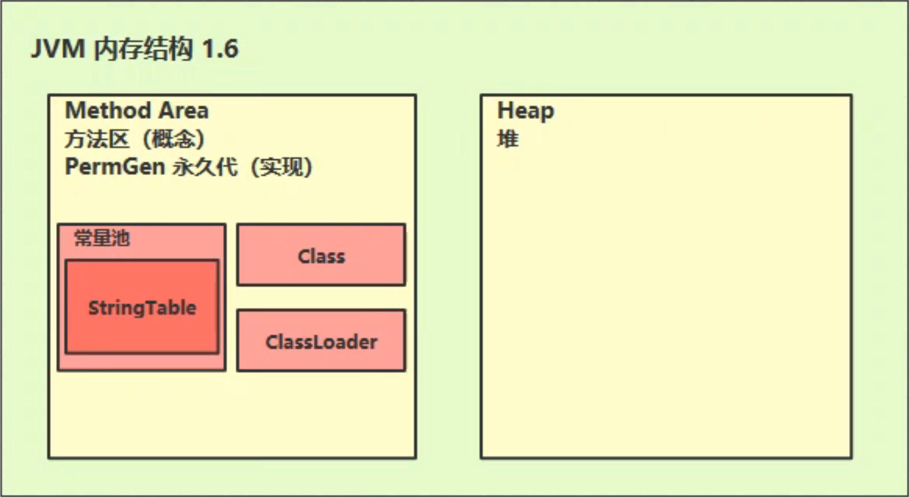
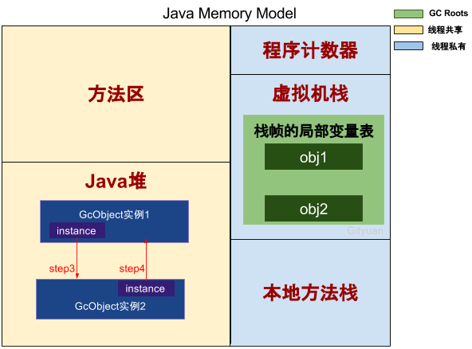
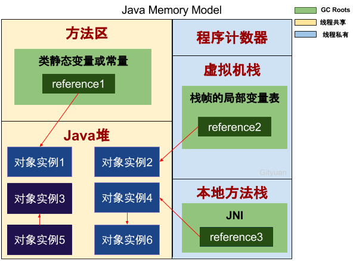
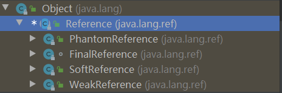

# JVM笔记

## 介绍

### 什么是JVM

Java Virtual Machine Java程序的运行环境


### 学习路线

类加载器 -> JVM内存结构 -> 执行引擎


## JVM内存结构

博客：[(41条消息) 一文搞懂JVM内存结构_xiaokanfuchen86的博客-CSDN博客_jvm内存结构](https://blog.csdn.net/xiaokanfuchen86/article/details/117625190)

Java 虚拟机在执行 Java 程序的过程中会把它管理的[内存](https://so.csdn.net/so/search?q=内存&spm=1001.2101.3001.7020)划分为若干个不同的数据区域。每个区域都有各自的作用。

分析 JVM 内存结构，主要就是分析 JVM 运行时数据存储区域。JVM 的运行时数据区主要包括：**堆、栈、方法区、程序计数器**等。而 JVM 的优化问题主要在**线程共享的数据区**中：**堆、方法区**。


### 程序计数器

Program Counter Register 程序计数器（寄存器）

- 作用，是记住下一条jvm指令的执行地址

- 特点

  - 是线程私有的

  - 不会存在内存溢出

下面给出一个例子：

```java
0: getstatic #20              // PrintStream out = System.out; 
3: astore_1                   // -- 
4: aload_1                    // out.println(1); 
5: iconst_1                   // -- 
6: invokevirtual #26          // -- 
9: aload_1                    // out.println(2); 
10: iconst_2                  // -- 
11: invokevirtual #26         // -- 
14: aload_1                   // out.println(3); 
15: iconst_3                  // -- 
16: invokevirtual #26         // -- 
19: aload_1                   // out.println(4); 
20: iconst_4                  // -- 
21: invokevirtual #26         // -- 
24: aload_1                   // out.println(5); 
25: iconst_5                  // -- 
26: invokevirtual #26         // -- 
29: return
```

以上代码的右侧是Java的源代码，左侧是二进制字节码，JVM的指令

JVM的执行流程：

JVM指令 -> 解释器 -> 机器码 -> CPU

**程序计数器（Program Counter Register）**是一块较小的内存空间，可以看作是**当前线程**所执行字节码的**行号指示器**，指向下一个将要执行的指令代码，由执行引擎来读取下一条指令。更确切的说，**一个线程的执行，是通过字节码解释器改变当前线程的计数器的值，来获取下一条需要执行的字节码指令，从而确保线程的正确执行**。

为了确保线程切换后（**上下文切换**）能恢复到正确的执行位置，**每个线程都有一个独立的程序计数器**，各个线程的计数器互不影响，独立存储。也就是说程序计数器是**线程私有的内存**。

如果线程执行 Java 方法，这个计数器记录的是正在执行的虚拟机字节码指令的地址；如果执行的是 Native 方法，计数器值为Undefined。

**程序计数器不会发生内存溢出（OutOfMemoryError即OOM）问题。**


### 虚拟机栈

#### 定义

Java Virtual Machine Stacks （Java 虚拟机栈）

- 线程私有的

- 每个线程运行时所需要的内存，称为虚拟机栈

- 每个栈由多个栈帧（Frame）组成，对应着每次方法调用时所占用的内存

- 每个线程只能有一个活动栈帧，对应着当前正在执行的那个方法


**栈帧**是栈的元素。**每个方法在执行时都会创建一个栈帧**。栈帧中存储了**局部变量表、操作数栈、动态连接和方法出口**等信息。每个方法从调用到运行结束的过程，就对应着一个栈帧在栈中压栈到出栈的过程。


JVM虚拟机栈的大小可以通过参数来指定    **-Xss size**

默认的单位是字节，也可以指定单位，如KB(k,K)、MB(m,M)、GB(g,G)

```
-Xss1m
-Xss1024KB
```

栈的大小决定了函数调用的最大深度，如果函数调用的深度大于设置的Xss大小，那么将会抛“java.lang.StackOverflowError“ 异常。

默认的情况下，栈的大小是1024KB（windows系统例外，大小依赖于虚拟内存）


> 面试题：
>
> 1. 垃圾回收是否涉及栈内存？
>
>    不需要，栈内存随着栈针的出栈而自动回收掉，所以不需要垃圾回收器来管理。
>
> 2. 占内存分配的越大越好么？
>
>    占内存过大会导致单线程占用的内存过大，总的线程数变少，不建议调整，使用默认即可。
>
> 3. 方法的局部变量是否线程安全？
>
>    局部变量是线程私有的，不存在线程安全问题。
>
> 4. 虚拟机栈和本地方法栈的区别？
>
>    Java 虚拟机栈为 JVM 执行 Java 方法服务，本地方法栈则为 JVM 使用到的 Native 方法服务。


#### 案例1：CPU占用过多

定位过程：

- 用top定位哪个进程对cpu的占用过高

- ps H -eo pid,tid,%cpu | grep 进程id （用ps命令进一步定位是哪个线程引起的cpu占用过高）

- jstack 进程id。可以根据线程id 找到有问题的线程，进一步定位到问题代码的源码行号

  这里注意一下，ps输出的线程号是十进制的，jstack输出的线程编号是十六进制的。


#### 案例2：程序运行很长时间没有结果


### 本地方法栈

线程私有。为虚拟机使用到的Native 方法服务。如Java使用c或者c++编写的接口服务时，代码在此区运行。


### 堆

堆的作用是存放对象实例和数组。通过new关键字创建的对象，都会使用堆内存。

特点：

- 它是线程共享的，堆中的对象都需要考虑线程安全问题
- 有垃圾回收机制

参数控制：

- -Xms设置堆的最小空间大小。-Xmx设置堆的最大空间大小。

异常情况：

- 如果在堆中没有内存完成实例分配，并且堆也无法再扩展时，将会抛出OutOfMemoryError 异常

### 方法区

方法区同 Java 堆一样是被所有**线程共享**的区间，用于存储**已被虚拟机加载的类信息、常量、静态变量、即时编译器编译后的代码**。在JVM启动时被创建。更具体的说，静态变量+常量+类信息（版本、方法、字段等）+运行时常量池存在方法区中。**常量池是方法区的一部分**。

方法区在逻辑上是堆的一部分，但在具体实现上不强制方法区的位置，不同的虚拟机厂 商可以有不同的实现，如 JDK1.8 之前使用永久代实现，1.8 后使用元空间实现

> **注**：JDK1.8 使用元空间 **MetaSpace** 替代方法区，元空间并不在 JVM中，而是使用本地内存。元空间两个参数：
>
> 1.  MetaSpaceSize：初始化元空间大小，控制发生GC阈值
> 2.  MaxMetaspaceSize ： 限制元空间大小上限，防止异常占用过多物理内存
>
> 


#### 常量池

常量池中存储编译器生成的各种**字面量和符号引用**。字面量就是Java中常量的意思。比如文本字符串，final修饰的常量等。方法引用则包括类和接口的全限定名，方法名和描述符，字段名和描述符等。


优点：

- 常量池避免了频繁的创建和销毁对象而影响系统性能，其实现了对象的共享。

##### Class常量池

**定义：**Class常量池可以理解为是Class文件中的**资源仓库**。

**内容：**Class文件中除了包含类的版本、字段、方法、接口等描述信息外， 还有一项信息就是常量池，**用于存放编译期生成的各种字面量和符号引用**。

首先有如下类文件定义：

```java
public class Test {
    public static void main(String[] args) {
        System.out.println("hello world");
    }
}
```

我们通过java提供的工具来查看编译后的Test.class文件的详细信息

查看命令：

```
javap -v Test.class       
```

详细信息如下：

```
Classfile /D:/developer/gitee/spring-demo/java-demo/data-structure/src/test/java/Test.class
  Last modified 2022-5-11; size 413 bytes
  MD5 checksum ae5ed4a0ee5b45fd449f77ade8d7bd24
  Compiled from "Test.java"
public class Test
  minor version: 0
  major version: 52
  flags: ACC_PUBLIC, ACC_SUPER
Constant pool:
   #1 = Methodref          #6.#15         // java/lang/Object."<init>":()V
   #2 = Fieldref           #16.#17        // java/lang/System.out:Ljava/io/PrintStream;
   #3 = String             #18            // hello world
   #4 = Methodref          #19.#20        // java/io/PrintStream.println:(Ljava/lang/String;)V
   #5 = Class              #21            // Test
   #6 = Class              #22            // java/lang/Object
   #7 = Utf8               <init>
   #8 = Utf8               ()V
   #9 = Utf8               Code
  #10 = Utf8               LineNumberTable
  #11 = Utf8               main
  #12 = Utf8               ([Ljava/lang/String;)V
  #13 = Utf8               SourceFile
  #14 = Utf8               Test.java
  #15 = NameAndType        #7:#8          // "<init>":()V
  #16 = Class              #23            // java/lang/System
  #17 = NameAndType        #24:#25        // out:Ljava/io/PrintStream;
  #18 = Utf8               hello world
  #19 = Class              #26            // java/io/PrintStream
  #20 = NameAndType        #27:#28        // println:(Ljava/lang/String;)V
  #21 = Utf8               Test
  #22 = Utf8               java/lang/Object
  #23 = Utf8               java/lang/System
  #24 = Utf8               out
  #25 = Utf8               Ljava/io/PrintStream;
  #26 = Utf8               java/io/PrintStream
  #27 = Utf8               println
  #28 = Utf8               (Ljava/lang/String;)V
{
  public Test();
    descriptor: ()V
    flags: ACC_PUBLIC
    Code:
      stack=1, locals=1, args_size=1
         0: aload_0
         1: invokespecial #1                  // Method java/lang/Object."<init>":()V
         4: return
      LineNumberTable:
        line 1: 0

  public static void main(java.lang.String[]);
    descriptor: ([Ljava/lang/String;)V
    flags: ACC_PUBLIC, ACC_STATIC
    Code:
      stack=2, locals=1, args_size=1
         0: getstatic     #2                  // Field java/lang/System.out:Ljava/io/PrintStream;
         3: ldc           #3                  // String hello world
         5: invokevirtual #4                  // Method java/io/PrintStream.println:(Ljava/lang/String;)V
         8: return
      LineNumberTable:
        line 4: 0
        line 5: 8
}
SourceFile: "Test.java"                                                                              
```

**字面量**

**定义：**字面量就是指**由字母、数字等构成的字符串或者数值常量**。

**PS：**字面量只可以右值出现【等号右边的值】如：int a = 1 这里的a为左值，1为右值。在这个例子中1就是字面量。

```java
private int compute() {
    int a = 1;//符号引用：a 字面量：1
    int b = 2;//符号引用：b 字面量：2
    String c = "有梦想的肥宅";//符号引用：c 字面量：有梦想的肥宅
    return a + b;
}
```

**符号引用**

符号引用是编译原理中的概念，是相对于直接引用来说的。主要包括了以下三类常量：

- **类和接口的全限定名**
- **字段的名称和描述符**
- **方法的名称和描述符**

**符号引用只有到运行时被加载到内存后，这些符号才有对应的内存地址信息，这些常量池一旦被装入内存就变成运行时常量池**，也就引出了下面动态链接的概念。

**动态链接：**对应的符号引用在程序加载或运行时会被转变为被加载到内存区域的代码的直接引用。

**例：**compute()这个符号引用在运行时就会被转变为compute()方法具体代码在内存中的地址，主要通过对象头里的类型指针去转换直接引用。

##### 字符串常量池

字符串的分配和其他的对象分配一样，耗费高昂的时间与空间代价，作为最基础的数据类型，大量频繁的创建字符串，极大程度地影响程序的性能。JVM为了提高性能和减少内存开销，在实例化字符串常量的时候进行了一些优化：

- 为字符串**开辟一个字符串常量池，类似于缓存区**
- 创建字符串常量时，首先查询字符串常量池是否存在该字符串
- 存在该字符串，返回引用实例，不存在，实例化该字符串并放入池中

三种字符串操作(Jdk1.7 及以上版本)

1. **直接赋值**

   ```
   String s = "有梦想的肥宅"; // s ：指向常量池中的引用
   ```

   **PS：**这种方式创建的字符串对象，**只会在常量池中**。

   创建步骤：

   JVM会先去常量池中通过 equals(key) 方法，判断是否有相同的对象：

   - **有**，则**直接返回该对象在常量池中的引用**
   - **没有**，则会在**常量池中创建一个新对象，再返回引用**

2. **new String()方法创建**

   ```
   String s1 = new String("有梦想的肥宅"); // s1指向内存中的对象引用
   ```

   **PS：**这种方式会保证**字符串常量池和堆中都有这个对象**，没有就创建，最后**返回堆内存中的对象引用**。

   **创建步骤：**

   因为有"有梦想的肥宅"这个字面量，所以会先检查字符串常量池中是否存在此字符串：

   - **不存在**，先在字符串常量池里创建一个字符串对象，再去堆内存中创建一个字符串对象"有梦想的肥宅"
   - **存在**，就直接去堆内存中创建一个字符串对象"有梦想的肥宅"， 最后，将内存中的引用返回

3. **intern()方法**

   ```java
   String s1 = new String("有梦想的肥宅"); 
   String s2 = s1.intern(); //s1.intern()返回的串池中的对象，s1引用的是堆中的对象
   System.out.println(s1 == s2); //false
   ```

   **PS：**这个方法是尝试将字符串对象放入串池，如果有则不放入，如果没有则放入串池，并把串池中的对象返回。

   **创建步骤：**

   还是会去常量池找看有没有"有梦想的肥宅"这个字符串：

   - **存在**，则返回串池中的对象
   - **不存在**，把字符串放入串池，并返回串池中的对象 

   **PS：**jdk1.6版本需要将 s1 复制到字符串常量池里

　

##### 八种基本类型的包装类和对象池

java中基本类型的包装类的大部分都实现了常量池技术（严格来说对象在堆上应该叫对象池），这些类是 Byte、Short、Integer、Long、Character、Boolean，另外两种浮点数类型的包装类则没有实现。

**PS：**Byte,Short,Integer,Long,Character这5种整型的包装类也只是在对应值小于等于127时才可使用对象池，因为一般这种比较小的数用到的概率相对较大。

```java
public class Test {
    public static void main(String[] args) {
        //1、5种整形的包装类Byte,Short,Integer,Long,Character的对象，在值小于127时可以使用对象池
        Integer i1 = 127; //PS：这种调用底层实际是执行的Integer.valueOf(127)，里面用到了IntegerCache对象池
        Integer i2 = 127;
        System.out.println(i1 == i2);//输出true

        //2、当值大于127时，不会从对象池中取对象
        Integer i3 = 128;
        Integer i4 = 128;
        System.out.println(i3 == i4);//输出false

        //3、用new关键词新生成对象不会使用对象池
        Integer i5 = new Integer(127);
        Integer i6 = new Integer(127);
        System.out.println(i5 == i6);//输出false

        //4、Boolean类也实现了对象池技术
        Boolean bool1 = true;
        Boolean bool2 = true;
        System.out.println(bool1 == bool2);//输出true

        //5、浮点类型的包装类没有实现对象池技术
        Double d1 = 1.0D;
        Double d2 = 1.0D;
        System.out.println(d1 == d2);//输出false
    }
}
```


### StringTable详解(就是串池)

首先来看一个代码示例：

```java
// StringTable [ "a", "b" ,"ab" ]  hashtable 结构，不能扩容
public class Demo1_22 {
    // 常量池中的信息，都会被加载到运行时常量池中， 这时 a b ab 都是常量池中的符号，还没有变为 java 字符串对象
    // ldc #2 会把 a 符号变为 "a" 字符串对象
    // ldc #3 会把 b 符号变为 "b" 字符串对象
    // ldc #4 会把 ab 符号变为 "ab" 字符串对象
    public static void main(String[] args) {
        String s1 = "a"; // 懒惰的
        String s2 = "b";
        String s3 = "ab";
        String s4 = s1 + s2; // new StringBuilder().append("a").append("b").toString()  new String("ab")
        // new String 会在常量池和堆内存中同时创建对象，但引用的是堆内存中的引用
        String s5 = "a" + "b";  // javac 在编译期间的优化，结果已经在编译期确定为ab
        System.out.println(s3 == s5);
        String ap = new String("a")+new String("b");
        // 这里注意一下，通过new 相加，这里a，b都会检查常量池，但是最后生成的结果"ab"不会保存到常量池
    }
}
```

编译过程中遇到编码问题，可以通过-encoding来指定编码，如下：

```shell
javac -encoding utf-8 Demo1_22.java
```

来查看一下编译后文件的详细信息：

```
Classfile /D:/path/to/Demo1_22.class
  Last modified 2022-5-11; size 776 bytes
  MD5 checksum 141d5699097730cd03bba544e9b27e1c
  Compiled from "Demo1_22.java"
public class cn.itcast.jvm.t1.stringtable.Demo1_22
  minor version: 0
  major version: 52
  flags: ACC_PUBLIC, ACC_SUPER
Constant pool:
   #1 = Methodref          #12.#25        // java/lang/Object."<init>":()V
   #2 = String             #26            // a
   #3 = String             #27            // b
   #4 = String             #28            // ab
   #5 = Class              #29            // java/lang/StringBuilder
   #6 = Methodref          #5.#25         // java/lang/StringBuilder."<init>":()V
   #7 = Methodref          #5.#30         // java/lang/StringBuilder.append:(Ljava/lang/String;)Ljava/lang/StringBuilder;
   #8 = Methodref          #5.#31         // java/lang/StringBuilder.toString:()Ljava/lang/String;
   #9 = Fieldref           #32.#33        // java/lang/System.out:Ljava/io/PrintStream;
  #10 = Methodref          #34.#35        // java/io/PrintStream.println:(Z)V
  #11 = Class              #36            // cn/itcast/jvm/t1/stringtable/Demo1_22
  #12 = Class              #37            // java/lang/Object
  #13 = Utf8               <init>
  #14 = Utf8               ()V
  #15 = Utf8               Code
  #16 = Utf8               LineNumberTable
  #17 = Utf8               main
  #18 = Utf8               ([Ljava/lang/String;)V
  #19 = Utf8               StackMapTable
  #20 = Class              #38            // "[Ljava/lang/String;"
  #21 = Class              #39            // java/lang/String
  #22 = Class              #40            // java/io/PrintStream
  #23 = Utf8               SourceFile
  #24 = Utf8               Demo1_22.java
  #25 = NameAndType        #13:#14        // "<init>":()V
  #26 = Utf8               a
  #27 = Utf8               b
  #28 = Utf8               ab
  #29 = Utf8               java/lang/StringBuilder
  #30 = NameAndType        #41:#42        // append:(Ljava/lang/String;)Ljava/lang/StringBuilder;
  #31 = NameAndType        #43:#44        // toString:()Ljava/lang/String;
  #32 = Class              #45            // java/lang/System
  #33 = NameAndType        #46:#47        // out:Ljava/io/PrintStream;
  #34 = Class              #40            // java/io/PrintStream
  #35 = NameAndType        #48:#49        // println:(Z)V
  #36 = Utf8               cn/itcast/jvm/t1/stringtable/Demo1_22
  #37 = Utf8               java/lang/Object
  #38 = Utf8               [Ljava/lang/String;
  #39 = Utf8               java/lang/String
  #40 = Utf8               java/io/PrintStream
  #41 = Utf8               append
  #42 = Utf8               (Ljava/lang/String;)Ljava/lang/StringBuilder;
  #43 = Utf8               toString
  #44 = Utf8               ()Ljava/lang/String;
  #45 = Utf8               java/lang/System
  #46 = Utf8               out
  #47 = Utf8               Ljava/io/PrintStream;
  #48 = Utf8               println
  #49 = Utf8               (Z)V
{
  public cn.itcast.jvm.t1.stringtable.Demo1_22();
    descriptor: ()V
    flags: ACC_PUBLIC
    Code:
      stack=1, locals=1, args_size=1
         0: aload_0
         1: invokespecial #1                  // Method java/lang/Object."<init>":()V
         4: return
      LineNumberTable:
        line 4: 0

  public static void main(java.lang.String[]);
    descriptor: ([Ljava/lang/String;)V
    flags: ACC_PUBLIC, ACC_STATIC
    Code:
      stack=3, locals=6, args_size=1
         0: ldc           #2                  // String a
         2: astore_1
         3: ldc           #3                  // String b
         5: astore_2
         6: ldc           #4                  // String ab
         8: astore_3
         9: new           #5                  // class java/lang/StringBuilder
        12: dup
        13: invokespecial #6                  // Method java/lang/StringBuilder."<init>":()V
        16: aload_1
        17: invokevirtual #7                  // Method java/lang/StringBuilder.append:(Ljava/lang/String;)Ljava/lang/StringBuilder;
        20: aload_2
        21: invokevirtual #7                  // Method java/lang/StringBuilder.append:(Ljava/lang/String;)Ljava/lang/StringBuilder;
        24: invokevirtual #8                  // Method java/lang/StringBuilder.toString:()Ljava/lang/String;
        27: astore        4
        29: ldc           #4                  // String ab
        31: astore        5
        33: getstatic     #9                  // Field java/lang/System.out:Ljava/io/PrintStream;
        36: aload_3
        37: aload         5
        39: if_acmpne     46
        42: iconst_1
        43: goto          47
        46: iconst_0
        47: invokevirtual #10                 // Method java/io/PrintStream.println:(Z)V
        50: return
      LineNumberTable:
        line 11: 0
        line 12: 3
        line 13: 6
        line 14: 9
        line 15: 29
        line 17: 33
        line 21: 50
      StackMapTable: number_of_entries = 2
        frame_type = 255 /* full_frame */
          offset_delta = 46
          locals = [ class "[Ljava/lang/String;", class java/lang/String, class java/lang/String, class java/lang/String, class java/lang/String, class java/lang/String ]
          stack = [ class java/io/PrintStream ]
        frame_type = 255 /* full_frame */
          offset_delta = 0
          locals = [ class "[Ljava/lang/String;", class java/lang/String, class java/lang/String, class java/lang/String, class java/lang/String, class java/lang/String ]
          stack = [ class java/io/PrintStream, int ]
}
SourceFile: "Demo1_22.java"
```


下面来看几道面试题：

```java
String s1 = "a"; 
String s2 = "b"; 
String s3 = "a" + "b"; 
String s4 = s1 + s2; 
String s5 = "ab"; 
String s6 = s4.intern(); 

// 问 
System.out.println(s3 == s4); 
System.out.println(s3 == s5); 
System.out.println(s3 == s6); 

String x2 = new String("c") + new String("d"); 
String x1 = "cd"; 
x2.intern(); 
// 问，如果调换了【最后两行代码】的位置呢，如果是jdk1.6呢 
System.out.println(x1 == x2);
```


#### StringTable存储位置

Java 8 中的存储位置：



java 6 中的存储位置：



将串池转移到堆内存后，更有利于内存的回收

#### StringTable的特性

- 常量池中的字符串仅是符号，第一次用到时才变为对象

- 利用串池的机制，来避免重复创建字符串对象

- 字符串变量拼接的原理是 StringBuilder （1.8）

- 字符串常量拼接的原理是编译期优化

- 可以使用 intern 方法，主动将串池中还没有的字符串对象放入串池

  - 1.8 将这个字符串对象尝试放入串池，如果有则并不会放入，如果没有则放入串池， 会把串池中的对象返回

  - 1.6 将这个字符串对象尝试放入串池，如果有则并不会放入，如果没有会把此对象复制一份，放入串池， 会把串池中的对象返回


#### StringTable调优

StringTable的实现类似于Hash表，默认的桶大小是65535（在Java11中），可以使用参数-XX:StringTableSzie=655350 来进行调整。

当项目中字符串变量较多时，可以适当增加StringTable的大小，来提高运行效率。


### 直接内存

优点：

- 常见于 NIO 操作时，用于数据缓冲区

- 分配回收成本较高，但读写性能高

- 不受 JVM 内存回收管理


首先来看一个例子：

```java
/**
 * 演示 ByteBuffer 作用
 */
public class Demo1_9 {
    static final String FROM = "E:\\path\\to\\big-file.mp4";
    static final String TO = "E:\\a.mp4";
    static final int _1Mb = 1024 * 1024;

    public static void main(String[] args) {
        io(); // io 用时：1535.586957 1766.963399 1359.240226
        directBuffer(); // directBuffer 用时：479.295165 702.291454 562.56592
    }

    private static void directBuffer() {
        long start = System.nanoTime();
        try (FileChannel from = new FileInputStream(FROM).getChannel();
             FileChannel to = new FileOutputStream(TO).getChannel();
        ) {
            ByteBuffer bb = ByteBuffer.allocateDirect(_1Mb);
            while (true) {
                int len = from.read(bb);
                if (len == -1) {
                    break;
                }
                bb.flip();
                to.write(bb);
                bb.clear();
            }
        } catch (IOException e) {
            e.printStackTrace();
        }
        long end = System.nanoTime();
        System.out.println("directBuffer 用时：" + (end - start) / 1000_000.0);
    }

    private static void io() {
        long start = System.nanoTime();
        try (FileInputStream from = new FileInputStream(FROM);
             FileOutputStream to = new FileOutputStream(TO);
        ) {
            byte[] buf = new byte[_1Mb];
            while (true) {
                int len = from.read(buf);
                if (len == -1) {
                    break;
                }
                to.write(buf, 0, len);
            }
        } catch (IOException e) {
            e.printStackTrace();
        }
        long end = System.nanoTime();
        System.out.println("io 用时：" + (end - start) / 1000_000.0);
    }
}

```

NIO会快很多


#### 文件读写流程：


直接内存溢出

```properties
Exception in thread "main" java.lang.OutOfMemoryError： Direct buffer memory
```


禁用显示的垃圾回收

```
-XX:DisableExplicitGC  
```


#### 直接内存的申请释放

在Java中分配直接内存，大有如下三种主要方式：

1. Unsafe.allocateMemory()
2. ByteBuffer.allocateDirect()
3. native方法

##### Unsafe类

在unsafe类中，提供了两个方法来进行直接内存的分配和释放

```java
// 申请直接内存内存
public native long allocateMemory(long var1); 
// 释放直接内存
public native void freeMemory(long var1);
```

下面给出一个使用的例子：

```java
static int _1Gb = 1024 * 1024 * 1024;

public static void main(String[] args) throws IOException {
    Unsafe unsafe = Unsafe.getUnsafe();
    // 分配内存
    long base = unsafe.allocateMemory(_1Gb);
    unsafe.setMemory(base, _1Gb, (byte) 0);
    System.in.read();
    // 释放内存
    unsafe.freeMemory(base);
    System.in.read();
}
```


##### ByteBuffer类

Unsafe是一个十分原始的底层方法，不适合开发者使用。而ByteBuffer则是留给开发者使用的。下面来看一下其实现：

```java
public static ByteBuffer allocateDirect(int capacity) {
    return new DirectByteBuffer(capacity);
}
```

可以看到，他创建了一个`DirectByteBuffer`对象

```java
DirectByteBuffer(int cap) {                   // package-private
    super(-1, 0, cap, cap);
    // 计算需要分配内存的大小
    boolean pa = VM.isDirectMemoryPageAligned();
    int ps = Bits.pageSize();
    long size = Math.max(1L, (long)cap + (pa ? ps : 0));
    Bits.reserveMemory(size, cap);
	// 分配直接内存
    long base = 0;
    try {
        base = UNSAFE.allocateMemory(size);
    } catch (OutOfMemoryError x) {
        Bits.unreserveMemory(size, cap);
        throw x;
    }
    UNSAFE.setMemory(base, size, (byte) 0);
    // 计算内存地址
    if (pa && (base % ps != 0)) {
        // Round up to page boundary
        address = base + ps - (base & (ps - 1));
    } else {
        address = base;
    }
    // 创建cleaner
    cleaner = Cleaner.create(this, new Deallocator(base, size, cap));
    att = null;
}
```

可以看到，DirectByteBuffer也是通过`UNSAFE.allocateMemory(size)`来申请的直接内存空间。那么释放直接内存的在哪里呢？

可以看到这么一行代码：`cleaner = Cleaner.create(this, new Deallocator(base, size, cap));`

Cleaner继承自`PhantomReference`，所以当垃圾回收器在回收`DirectByteBuffer`这个对象时，就会同步对cleaner进行回收工作；

<font color="red">TODO 补充一下虚引用</font>

Deallocator的实现

```java
private static class Deallocator implements Runnable {
    private long address;
    private long size;
    private int capacity;

    private Deallocator(long address, long size, int capacity) {
        assert (address != 0);
        this.address = address;
        this.size = size;
        this.capacity = capacity;
    }

    public void run() {
        if (address == 0) {
            // Paranoia
            return;
        }
        UNSAFE.freeMemory(address);
        address = 0;
        Bits.unreserveMemory(size, capacity);
    }
}
```


## 垃圾回收

### 如何判断对象可以被回收？

#### 引用计数法

每个对象有一个引用计数器，当对象被引用一次则计数器加1，当对象引用失效一次则计数器减1，对于为0的对象意味着是垃圾对象，可以被GC回收。

#### 可达性分析

从GC Roots作为起点开始搜索，那么整个连通图中的对象便都是活对象，对于GC Roots无法到达的对象便成了垃圾回收的对象，随时可被GC回收


#### 对引用计数和可达性分析算法的分析

目前虚拟机基本都是采用**可达性算法**，为什么不采用引用计数算法呢？下面就说说引用计数法是如何统计所有对象的引用计数的，再对比分析可达性算法是如何解决引用技术算法的不足。先简单说说这两个算法：

- **引用计数算法**（[reference-counting](https://link.zhihu.com/?target=http%3A//www.memorymanagement.org/glossary/r.html%23reference.counting)） ：每个对象有一个引用计数器，当对象被引用一次则计数器加1，当对象引用失效一次则计数器减1，对于计数器为0的对象意味着是垃圾对象，可以被GC回收。
- **可达性算法**(GC Roots Tracing)：从GC Roots作为起点开始搜索，那么整个连通图中的对象便都是活对象，对于GC Roots无法到达的对象便成了垃圾回收的对象，随时可被GC回收。

**采用引用计数算法的**系统只需在每个实例对象创建之初，通过计数器来记录所有的引用次数即可。而可达性算法，则需要再次GC时，遍历整个GC根节点来判断是否回收。

下面通过一段代码来对比说明：

```java
 public class GcDemo {

    public static void main(String[] args) {
        //分为6个步骤
        GcObject obj1 = new GcObject(); //Step 1
        GcObject obj2 = new GcObject(); //Step 2

        obj1.instance = obj2; //Step 3
        obj2.instance = obj1; //Step 4

        obj1 = null; //Step 5
        obj2 = null; //Step 6
    }
}

class GcObject{
    public Object instance = null;
}
```

很多文章以及Java虚拟机相关的书籍，都会告诉你如果采用引用计数算法，上述代码中obj1和obj2指向的对象已经不可能再被访问，彼此互相引用对方导致引用计数都不为0，最终无法被GC回收，而可达性算法能解决这个问题。

但这些文章和书籍并没有真正从内存角度来阐述这个过程是如何统计的，很多时候大家都在相互借鉴、翻译，却也都没有明白。或者干脆装作讲明白，或者假定读者依然明白。 其实很多人并不明白为什么引用计数法不为0，引用计数到底是如何维护所有对象引用的，可达性是如何可达的？ 接下来结合实例，从Java内存模型以及数学的图论知识角度来说明，希望能让大家彻底明白该过程。


**情况（一）：引用计数算法**


如果采用的是引用计数算法：


再回到前面代码GcDemo的main方法共分为6个步骤：

- Step1：GcObject实例1的引用计数加1，实例1的引用计数=1；
- Step2：GcObject实例2的引用计数加1，实例2的引用计数=1；
- Step3：GcObject实例2的引用计数再加1，实例2的引用计数=2；
- Step4：GcObject实例1的引用计数再加1，实例1的引用计数=2；

执行到Step 4，则GcObject实例1和实例2的引用计数都等于2。

接下来继续结果图：



- Step5：栈帧中obj1不再指向Java堆，GcObject实例1的引用计数减1，结果为1；
- Step6：栈帧中obj2不再指向Java堆，GcObject实例2的引用计数减1，结果为1。

到此，发现GcObject实例1和实例2的计数引用都不为0，那么如果采用的引用计数算法的话，那么这两个实例所占的内存将得不到释放，这便产生了内存泄露。


**情况（二）：可达性算法**


这是目前主流的虚拟机都是采用GC Roots Tracing算法，比如Sun的Hotspot虚拟机便是采用该算法。 该算法的核心算法是从GC Roots对象作为起始点，利用数学中图论知识，图中可达对象便是存活对象，而不可达对象则是需要回收的垃圾内存。这里涉及两个概念，一是GC Roots，一是可达性。

那么可以作为**GC Roots的对象**（见下图）：

- 虚拟机栈的栈帧的局部变量表所引用的对象；
- 本地方法栈的JNI所引用的对象；
- 方法区的静态变量和常量所引用的对象；

关于**可达性**的对象，便是能与GC Roots构成连通图的对象，如下图：



从上图，reference1、reference2、reference3都是GC Roots，可以看出：

- reference1-> 对象实例1；
- reference2-> 对象实例2；
- reference3-> 对象实例4；
- reference3-> 对象实例4 -> 对象实例6；

可以得出对象实例1、2、4、6都具有GC Roots可达性，也就是存活对象，不能被GC回收的对象。

而对于对象实例3、5直接虽然连通，但并没有任何一个GC Roots与之相连，这便是GC Roots不可达的对象，这就是GC需要回收的垃圾对象。

到这里，相信大家应该能彻底明白引用计数算法和可达性算法的区别吧**。**

再回过头来看看最前面的实例，GcObject实例1和实例2虽然从引用计数虽然都不为0，但从可达性算法来看，都是GC Roots不可达的对象。

总之，对于对象之间循环引用的情况，引用计数算法，则GC无法回收这两个对象，而可达性算法则可以正确回收。


#### 引用类型

在JVM中，引用类型主要分为强引用（Strong Reference）、软引用（Soft Reference）、弱引用（Weak Reference）、虚引用（Phantom Reference）这 4 种引用强度依次逐渐减弱。除强引用外，其他 3 种引用均可以在 java.lang.ref 包中找到它们的身影。如下图，显示了这 3 种引用类型对应的类，开发人员可以在应用程序中直接使用它们。


Reference 子类中只有终结器引用是包内可见的，其他 3 种引用类型均为 public，可以在应用程序中直接使用

**强引用（StrongReference）**：最传统的“引用”的定义，是指在程序代码之中普遍存在的引用赋值，即类似“Object obj = new Object()”这种引用关系。无论任何情况下，只要强引用关系还存在，垃圾收集器就永远不会回收掉被引用的对象。

**软引用（SoftReference）**：在系统将要发生内存溢出之前，将会把这些对象列入回收范围之中进行第二次回收。如果这次回收后还没有足够的内存，才会抛出内存流出异常。

**弱引用（WeakReference）**：被弱引用关联的对象只能生存到下一次垃圾收集之前。当垃圾收集器工作时，无论内存空间是否足够，都会回收掉被弱引用关联的对象。

**虚引用（PhantomReference）**：一个对象是否有虚引用的存在，完全不会对其生存时间构成影响，也无法通过虚引用来获得一个对象的实例。为一个对象设置虚引用关联的唯一目的就是能在这个对象被收集器回收时收到一个系统通知。

##### 强引用（Strong Reference）

强引用（Strong Reference） — 不回收

当在 Java 语言中使用 new 操作符创建一个新的对象，并将其赋值给一个变量的时候，这个变量就成为指向该对象的一个强引用。强引用的对象是可触及的，垃圾收集器就永远不会回收掉被引用的对象。

强引用具备以下特点：

- 强引用可以直接访问目标对象。
- 强引用所指向的对象在任何时候都不会被系统回收，虚拟机宁愿抛出 OOM 异常，也不会回收强引用所指向对象。
- 强引用可能导致内存泄漏。
  

##### 软引用（Soft Reference）

软引用（Soft Reference）——内存不足即回收

软引用是用来描述一些还有用，但非必需的对象。只被软引用关联着的对象，在系统将要发生内存溢出异常前，会把这些对象列进回收范围之中进行第二次回收，如果这次回收还没有足够的内存，才会抛出内存溢出异常。

软引用通常用来实现内存敏感的缓存。比如：高速缓存就有用到软引用。如果还有空闲内存，就可以暂时保留缓存，当内存不足时清理掉，这样就保证了使用缓存的同时，不会耗尽内存。

垃圾回收器在某个时刻决定回收软可达的对象的时候，会清理软引用，并可选地把引用存放到一个引用队列（Reference Queue）。

类似弱引用，只不过 Java 虚拟机会尽量让软引用的存活时间长一些，迫不得已才清理。


##### 弱引用（Weak Reference）

弱引用（Weak Reference）——发现即回收

弱引用也是用来描述那些非必需对象，只被弱引用关联的对象只能生存到下一次垃圾收集发生为止。在系统 GC 时，只要发现弱引用，不管系统堆空间使用是否充足，都会回收掉只被弱引用关联的对象。

但是，由于垃圾回收器的线程通常优先级很低，因此，并不一定能很快地发现持有弱引用的对象。在这种情况下，弱引用对象可以存在较长的时间。

弱引用和软引用一样，在构造弱引用时，也可以指定一个引用队列，当弱引用对象被回收时，就会加入指定的引用队列，通过这个队列可以跟踪对象的回收情况。

软引用、弱引用都非常适合来保存那些可有可无的缓存数据。如果这么做，当系统内存不足时，这些缓存数据会被回收，不会导致内存溢出。而当内存资源充足时，这些缓存数据又可以存在相当长的时间，从而起到加速系统的作用。


##### 虚引用（Phantom Reference）

虚引用（Phantom Reference）——对象回收跟踪

也称为“幽灵引用”或者“幻影引用”，是所有引用类型中最弱的一个。

一个对象是否有虚引用的存在，完全不会决定对象的生命周期。如果一个对象仅持有虚引用，那么它和没有引用几乎是一样的，随时都可能被垃圾回收器回收。它不能单独使用，也无法通过虚引用来获取被引用的对象。**当试图通过虚引用的 get()方法取得对象时，总是 null**

为一个对象设置虚引用关联的唯一目的在于跟踪垃圾回收过程。比如：能在这个对象被收集器回收时收到一个系统通知。

虚引用必须和引用队列一起使用。虚引用在创建时必须提供一个引用队列作为参数。当垃圾回收器准备回收一个对象时，如果发现它还有虚引用，就会在回收对象后，将这个虚引用加入引用队列，以通知应用程序对象的回收情况。

由于虚引用可以跟踪对象的回收时间，因此，也可以将一些资源释放操作放置在虚引用中执行和记录。


##### 终结器引用

它用于实现对象的 finalize() 方法，也可以称为终结器引用。无需手动编码，其内部配合引用队列使用。

在 GC 时，终结器引用入队。由 Finalizer 线程通过终结器引用找到被引用对象调用它的 finalize()方法，第二次 GC 时才回收被引用的对象


##### 使用示例

软引用的例子：

```java
public class SoftReferenceDemo {
    private static final int _4MB = 4 * 1024 * 1024;

    public static void main(String[] args) {
        List<SoftReference<byte[]>> list = new ArrayList<>();

        // 引用队列
        ReferenceQueue<byte[]> queue = new ReferenceQueue<>();

        for (int i = 0; i < 5; i++) {
            // 关联了引用队列， 当软引用所关联的 byte[]被回收时，软引用自己会加入到 queue 中去
            SoftReference<byte[]> ref = new SoftReference<>(new byte[_4MB], queue);
            System.out.println(ref.get());
            list.add(ref);
            System.out.println(list.size());
        }

        // 从队列中获取无用的 软引用对象，并移除
        Reference<? extends byte[]> poll = queue.poll();
        while( poll != null) {
            list.remove(poll);
            poll = queue.poll();
        }

        System.out.println("===========================");
        for (SoftReference<byte[]> reference : list) {
            System.out.println(reference.get());
        }
    }
}
```

弱引用的例子：

```java
/**
 * 演示弱引用
 * -Xmx20m -XX:+PrintGCDetails -verbose:gc
 */
public class WeakReferenceDemo {
    private static final int _4MB = 4 * 1024 * 1024;

    public static void main(String[] args) {
        //  list --> WeakReference --> byte[]
        List<WeakReference<byte[]>> list = new ArrayList<>();
        for (int i = 0; i < 10; i++) {
            WeakReference<byte[]> ref = new WeakReference<>(new byte[_4MB]);
            list.add(ref);
            for (WeakReference<byte[]> w : list) {
                System.out.print(w.get()+" ");
            }
            System.out.println();
        }
        System.out.println("循环结束：" + list.size());
    }
}
```


### 垃圾回收算法

标记清除

标记整理

复制


### 分代垃圾回收

### 垃圾回收器

### 垃圾回收调优


-
