知识库

# 一：Java

### NIO

#### Java NIO 简介

​	Java NIO（New IO）是从Java 1.4版本开始引入的一个新的IO API，可以替代标准的Java IO API。NIO与原来的IO有同样的作用和目的，但是使用的方式完全不同，NIO支持面向缓冲区的、基于通道的IO操作。NIO将以更加高效的方式进行文件的读写操作。

#### Java NIO 与IO的主要区别

##### 	**IO**

​		面向流(Stream Oriented)

​		阻塞IO(Blocking IO)

##### 	**NIO**

​		面向缓冲区(Buffer Oriented)

​		非阻塞IO(NonBlocking IO)

​		选择器(Selectors)


#### 缓冲区和通道

Java NIO系统的核心在于：通道(Channel)和缓冲区(Buffer)。通道表示打开到IO 设备(例如：文件、套接字)的连接。若需要使用NIO 系统，需要获取用于连接IO 设备的通道以及用于容纳数据的缓冲区。然后操作缓冲区，对数据进行处理。


**一句话概括：Channel 负责传输，Buffer 负责存储**


##### 缓冲区（Buffer）

缓冲区（Buffer）：一个用于特定基本数据类型的容器。由java.nio 包定义的，所有缓冲区都是Buffer 抽象类的子类。
Java NIO中的Buffer 主要用于与NIO 通道进行交互，数据是从通道读入缓冲区，从缓冲区写入通道中的。

Buffer 就像一个数组，可以保存多个相同类型的数据。根据数据类型不同(boolean 除外) ，有以下Buffer 常用子类：

- ByteBuffer
- CharBuffer
- ShortBuffer
- IntBuffer
- LongBuffer
- FloatBuffer
- DoubleBuffer

**缓冲区的基本属性**

- capatity

  表示Buffer 最大数据容量，缓冲区容量不能为负，并且创建后不能更改。

- limit

  第一个不应该读取或写入的数据的索引，即位于limit 后的数据不可读写。缓冲区的限制不能为负，并且不能大于其容量。

- position

  下一个要读取或写入的数据的索引。缓冲区的位置不能为负，并且不能大于其限制

- mark与reset

  标记是一个索引，通过Buffer 中的mark() 方法指定Buffer 中一个特定的position，之后可以通过调用reset() 方法恢复到这个position.


**标记、位置、限制、容量遵守以下不变式：0<=mark<=position<=limit<=capacity**


**缓冲区的基本属性：**


**Buffer的API介绍**


##### 代码示例：

```java
/**
 * 一、缓冲区（Buffer）：在 Java NIO 中负责数据的存取。缓冲区就是数组。用于存储不同数据类型的数据
 *
 * 根据数据类型不同（boolean 除外），提供了相应类型的缓冲区：
 * ByteBuffer
 * CharBuffer
 * ShortBuffer
 * IntBuffer
 * LongBuffer
 * FloatBuffer
 * DoubleBuffer
 *
 * 上述缓冲区的管理方式几乎一致，通过 allocate() 获取缓冲区
 *
 * 二、缓冲区存取数据的两个核心方法：
 * put() : 存入数据到缓冲区中
 * get() : 获取缓冲区中的数据
 *
 * 三、缓冲区中的四个核心属性：
 * capacity : 容量，表示缓冲区中最大存储数据的容量。一旦声明不能改变。
 * limit : 界限，表示缓冲区中可以操作数据的大小。（limit 后数据不能进行读写）
 * position : 位置，表示缓冲区中正在操作数据的位置。
 *
 * mark : 标记，表示记录当前 position 的位置。可以通过 reset() 恢复到 mark 的位置
 *
 * 0 <= mark <= position <= limit <= capacity
 *
 * 四、直接缓冲区与非直接缓冲区：
 * 非直接缓冲区：通过 allocate() 方法分配缓冲区，将缓冲区建立在 JVM 的内存中
 * 直接缓冲区：通过 allocateDirect() 方法分配直接缓冲区，将缓冲区建立在物理内存中。可以提高效率
 */
public class TestBuffer {
    /**
     * 测试直接缓冲区与非直接缓冲区
     */
    @Test
    public void test3(){
        //分配直接缓冲区
        ByteBuffer buf = ByteBuffer.allocateDirect(1024);
        System.out.println(buf.isDirect());
    }

    @Test
    public void test2(){
        String str = "abcde";

        ByteBuffer buf = ByteBuffer.allocate(1024);
        buf.put(str.getBytes());
        buf.flip();

        byte[] dst = new byte[buf.limit()];
        buf.get(dst, 0, 2);
        System.out.println(new String(dst, 0, 2));
        System.out.println(buf.position());

        //mark() : 标记
        buf.mark();
        buf.get(dst, 2, 2);
        System.out.println(new String(dst, 2, 2));
        System.out.println(buf.position());

        //reset() : 恢复到 mark 的位置
        buf.reset();
        System.out.println(buf.position());

        //判断缓冲区中是否还有剩余数据
        if(buf.hasRemaining()){
            //获取缓冲区中可以操作的数量
            System.out.println(buf.remaining());
        }
    }

    /**
     * allocate /ˈæləkeɪt/  分配
     * 不同类型的Buffer都使用allocate方法来创建对象
     * 这个方法主要用来掩饰Buffer中属性的作用
     */
    @Test
    public void test1(){
        String str = "abcde";

        //1. 分配一个指定大小的缓冲区
        ByteBuffer buf = ByteBuffer.allocate(1024);
        System.out.println("-----------------allocate()----------------");
        System.out.println(buf.position());
        System.out.println(buf.limit());
        System.out.println(buf.capacity());

        //2. 利用 put() 存入数据到缓冲区中
        buf.put(str.getBytes());
        System.out.println("-----------------put()----------------");
        System.out.println(buf.position());
        System.out.println(buf.limit());
        System.out.println(buf.capacity());

        //3. 切换读取数据模式
        buf.flip();
        System.out.println("-----------------flip()----------------");
        System.out.println(buf.position());
        System.out.println(buf.limit());
        System.out.println(buf.capacity());

        //4. 利用 get() 读取缓冲区中的数据
        byte[] dst = new byte[buf.limit()];
        buf.get(dst);
        System.out.println(new String(dst, 0, dst.length));
        System.out.println("-----------------get()----------------");
        System.out.println(buf.position());
        System.out.println(buf.limit());
        System.out.println(buf.capacity());

        //5. rewind() : 可重复读
        buf.rewind();
        System.out.println("-----------------rewind()----------------");
        System.out.println(buf.position());
        System.out.println(buf.limit());
        System.out.println(buf.capacity());

        //6. clear() : 清空缓冲区. 但是缓冲区中的数据依然存在，但是处于“被遗忘”状态
        buf.clear();
        System.out.println("-----------------clear()----------------");
        System.out.println(buf.position());
        System.out.println(buf.limit());
        System.out.println(buf.capacity());
        System.out.println((char)buf.get());
    }
}
```


##### 直接缓冲区与非直接缓冲区


- 字节缓冲区要么是直接的，要么是非直接的。如果为直接字节缓冲区，则Java 虚拟机会尽最大努力直接在此缓冲区上执行本机I/O 操作。也就是说，在每次调用基础操作系统的一个本机I/O 操作之前（或之后），虚拟机都会尽量避免将缓冲区的内容复制到中间缓冲区中（或从中间缓冲区中复制内容）。
- 直接字节缓冲区可以通过调用此类的allocateDirect() 工厂方法来创建。此方法返回的缓冲区进行分配和取消分配所需成本通常高于非直接缓冲区。直接缓冲区的内容可以驻留在常规的垃圾回收堆之外，因此，它们对应用程序的内存需求量造成的影响可能并不明显。所以，建议将直接缓冲区主要分配给那些易受基础系统的本机I/O 操作影响的大型、持久的缓冲区。一般情况下，最好仅在直接缓冲区能在程序性能方面带来明显好处时分配它们。
- 直接字节缓冲区还可以通过FileChannel 的map() 方法将文件区域直接映射到内存中来创建。该方法返回MappedByteBuffer。Java 平台的实现有助于通过JNI 从本机代码创建直接字节缓冲区。如果以上这些缓冲区中的某个缓冲区实例指的是不可访问的内存区域，则试图访问该区域不会更改该缓冲区的内容，并且将会在访问期间或稍后的某个时间导致抛出不确定的异常。
- 字节缓冲区是直接缓冲区还是非直接缓冲区可通过调用其isDirect()方法来确定。提供此方法是为了能够在性能关键型代码中执行显式缓冲区管理。

###### 图例

**非直接缓冲区**


直接缓冲区：

​	数据从磁盘到应用程序需要经过内核空间到用户空间的拷贝过程


**非直接缓冲区：**


非直接缓冲区：

	1. 直接在物理内存中创建磁盘额映射文件
	2. 在数据写到物理内存之后，应用程序就无权过问了，余下的过程交由操作系统来处理
	3. 在写完数据之后，应用程序无法自动释放资源，需要等待垃圾回收机制来进行资源回收
	4. 在极端情况下（垃圾回收器一直不进行回收），存在占用资源问题。


##### 通道（Channel）

通道（Channel）：由java.nio.channels 包定义的。Channel 表示IO 源与目标打开的连接。Channel 类似于传统的“流”。只不过Channel 本身不能直接访问数据，Channel 只能与Buffer 进行交互。


**代码示例：**

```java
/**
 * 一、通道（Channel）：用于源节点与目标节点的连接。在 Java NIO 中负责缓冲区中数据的传输。Channel 本身不存储数据，因此需要配合缓冲区进行传输。
 *
 * 二、通道的主要实现类
 * 	java.nio.channels.Channel 接口：
 * 		|--FileChannel
 * 		|--SocketChannel
 * 		|--ServerSocketChannel
 * 		|--DatagramChannel
 *
 * 三、获取通道
 * 1. Java 针对支持通道的类提供了 getChannel() 方法
 * 		本地 IO：
 * 		FileInputStream/FileOutputStream
 * 		RandomAccessFile
 *
 * 		网络IO：
 * 		Socket
 * 		ServerSocket
 * 		DatagramSocket
 *
 * 2. 在 JDK 1.7 中的 NIO.2 针对各个通道提供了静态方法 open()
 * 3. 在 JDK 1.7 中的 NIO.2 的 Files 工具类的 newByteChannel()
 *
 * 四、通道之间的数据传输
 * transferFrom()
 * transferTo()
 *
 * 五、分散(Scatter)与聚集(Gather)
 * 分散读取（Scattering Reads）：将通道中的数据分散到多个缓冲区中
 * 聚集写入（Gathering Writes）：将多个缓冲区中的数据聚集到通道中
 *
 * 六、字符集：Charset
 * 编码：字符串 -> 字节数组
 * 解码：字节数组  -> 字符串
 *
 */
public class TestChannel {
    /**
     * ===============================================================================
     *  字符集
     */
    @Test
    public void test6() throws IOException {
        Charset cs1 = Charset.forName("GBK");

        //获取编码器
        CharsetEncoder ce = cs1.newEncoder();

        //获取解码器
        CharsetDecoder cd = cs1.newDecoder();

        CharBuffer cBuf = CharBuffer.allocate(1024);
        cBuf.put("尚硅谷威武！");
        cBuf.flip();

        //编码
        ByteBuffer bBuf = ce.encode(cBuf);

        for (int i = 0; i < 12; i++) {
            System.out.println(bBuf.get());
        }

        //解码
        bBuf.flip();
        CharBuffer cBuf2 = cd.decode(bBuf);
        System.out.println(cBuf2.toString());

        System.out.println("------------------------------------------------------");

        Charset cs2 = Charset.forName("GBK");
        bBuf.flip();
        CharBuffer cBuf3 = cs2.decode(bBuf);
        System.out.println(cBuf3.toString());
    }

    /**
     * ===============================================================================
     */
    @Test
    public void test5(){
        Map<String, Charset> map = Charset.availableCharsets();

        Set<Map.Entry<String, Charset>> set = map.entrySet();

        for (Map.Entry<String, Charset> entry : set) {
            System.out.println(entry.getKey() + "=" + entry.getValue());
        }
    }

    /**
     * ===============================================================================
     *  分散和聚集
     */
    @Test
    public void test4() throws IOException{
        RandomAccessFile raf1 = new RandomAccessFile("1.txt", "rw");

        //1. 获取通道
        FileChannel channel1 = raf1.getChannel();

        //2. 分配指定大小的缓冲区
        ByteBuffer buf1 = ByteBuffer.allocate(100);
        ByteBuffer buf2 = ByteBuffer.allocate(1024);

        //3. 分散读取
        ByteBuffer[] bufs = {buf1, buf2};
        channel1.read(bufs);

        for (ByteBuffer byteBuffer : bufs) {
            byteBuffer.flip();
        }

        System.out.println(new String(bufs[0].array(), 0, bufs[0].limit()));
        System.out.println("-----------------");
        System.out.println(new String(bufs[1].array(), 0, bufs[1].limit()));

        //4. 聚集写入
        RandomAccessFile raf2 = new RandomAccessFile("2.txt", "rw");
        FileChannel channel2 = raf2.getChannel();

        channel2.write(bufs);
    }

    /**
     * ===============================================================================
     * 通道之间的数据传输(直接缓冲区)
     */
    @Test
    public void test3() throws IOException{
        FileChannel inChannel = FileChannel.open(Paths.get("d:/1.mkv"), StandardOpenOption.READ);
        FileChannel outChannel = FileChannel.open(Paths.get("d:/2.mkv"), StandardOpenOption.WRITE, StandardOpenOption.READ, StandardOpenOption.CREATE);

		//inChannel.transferTo(0, inChannel.size(), outChannel);
        outChannel.transferFrom(inChannel, 0, inChannel.size());

        inChannel.close();
        outChannel.close();
    }

    /**
     * ===============================================================================
     * 使用直接缓冲区完成文件的复制(内存映射文件)
     */
    @Test
    public void test2() throws IOException{//2127-1902-1777
        long start = System.currentTimeMillis();

        FileChannel inChannel = FileChannel.open(Paths.get("d:/1.mkv"), StandardOpenOption.READ);
        FileChannel outChannel = FileChannel.open(Paths.get("d:/2.mkv"), StandardOpenOption.WRITE, StandardOpenOption.READ, StandardOpenOption.CREATE);

        //内存映射文件
        MappedByteBuffer inMappedBuf = inChannel.map(FileChannel.MapMode.READ_ONLY, 0, inChannel.size());
        MappedByteBuffer outMappedBuf = outChannel.map(FileChannel.MapMode.READ_WRITE, 0, inChannel.size());

        //直接对缓冲区进行数据的读写操作
        byte[] dst = new byte[inMappedBuf.limit()];
        inMappedBuf.get(dst);
        outMappedBuf.put(dst);

        inChannel.close();
        outChannel.close();

        long end = System.currentTimeMillis();
        System.out.println("耗费时间为：" + (end - start));
    }

    /**
     * ===============================================================================
     * 利用通道完成文件的复制（非直接缓冲区）
     */
    @Test
    public void test1(){//10874-10953
        long start = System.currentTimeMillis();

        FileInputStream fis = null;
        FileOutputStream fos = null;
        //①获取通道
        FileChannel inChannel = null;
        FileChannel outChannel = null;
        try {
            fis = new FileInputStream("d:/1.mkv");
            fos = new FileOutputStream("d:/2.mkv");

            inChannel = fis.getChannel();
            outChannel = fos.getChannel();

            //②分配指定大小的缓冲区
            ByteBuffer buf = ByteBuffer.allocate(1024);

            //③将通道中的数据存入缓冲区中
            while(inChannel.read(buf) != -1){
                buf.flip(); //切换读取数据的模式
                //④将缓冲区中的数据写入通道中
                outChannel.write(buf);
                buf.clear(); //清空缓冲区
            }
        } catch (IOException e) {
            e.printStackTrace();
        } finally {
            
        }

        long end = System.currentTimeMillis();
        System.out.println("耗费时间为：" + (end - start));
    }
}
```


#### 文件通道

##### 代码示例

​	代码示例在Channel中有体现

##### 常用API介绍

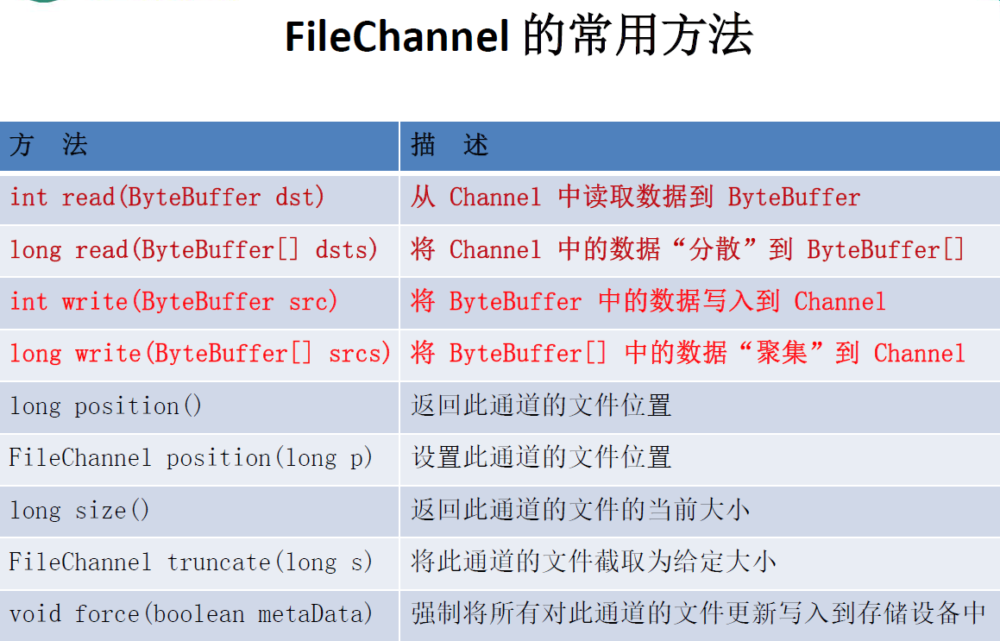


#### NIO的非阻塞式网络通信


##### 阻塞与非阻塞的区别

- 传统的IO 流都是阻塞式的。也就是说，当一个线程调用read() 或write() 时，该线程被阻塞，直到有一些数据被读取或写入，该线程在此期间不能执行其他任务。因此，在完成网络通信进行IO 操作时，由于线程会阻塞，所以服务器端必须为每个客户端都提供一个独立的线程进行处理，当服务器端需要处理大量客户端时，性能急剧下降。

- Java NIO 是非阻塞模式的。当线程从某通道进行读写数据时，若没有数据可用时，该线程可以进行其他任务。线程通常将非阻塞IO 的空闲时间用于在其他通道上执行IO 操作，所以单独的线程可以管理多个输入和输出通道。因此，NIO 可以让服务器端使用一个或有限几个线程来同时处理连接到服务器端的所有客户端。


##### 选择器（Selector）

选择器（Selector）是SelectableChannle 对象的多路复用器，Selector 可以同时监控多个SelectableChannel 的IO 状况，也就是说，利用Selector 可使一个单独的线程管理多个Channel。Selector 是非阻塞IO 的核心。


##### 阻塞式NIO代码示例1

```java
/**
 * 一、使用 NIO 完成网络通信的三个核心：
 *
 * 1. 通道（Channel）：负责连接
 *
 * 	   java.nio.channels.Channel 接口：
 * 			|--SelectableChannel
 * 				|--SocketChannel
 * 				|--ServerSocketChannel
 * 				|--DatagramChannel
 *
 * 				|--Pipe.SinkChannel
 * 				|--Pipe.SourceChannel
 *
 * 2. 缓冲区（Buffer）：负责数据的存取
 *
 * 3. 选择器（Selector）：是 SelectableChannel 的多路复用器。用于监控 SelectableChannel 的 IO 状况
 *
 */
public class TestBlockingNIO {

    //客户端
    @Test
    public void client() throws IOException {
        //1. 获取通道
        SocketChannel sChannel = SocketChannel.open(new InetSocketAddress("127.0.0.1", 9898));

        FileChannel inChannel = FileChannel.open(Paths.get("1.jpg"), StandardOpenOption.READ);

        //2. 分配指定大小的缓冲区
        ByteBuffer buf = ByteBuffer.allocate(1024);

        //3. 读取本地文件，并发送到服务端
        while(inChannel.read(buf) != -1){
            buf.flip();
            sChannel.write(buf);
            buf.clear();
        }

        //4. 关闭通道
        inChannel.close();
        sChannel.close();
    }

    //服务端
    @Test
    public void server() throws IOException{
        //1. 获取通道
        ServerSocketChannel ssChannel = ServerSocketChannel.open();

        FileChannel outChannel = FileChannel.open(Paths.get("2.jpg"), StandardOpenOption.WRITE, StandardOpenOption.CREATE);

        //2. 绑定连接
        ssChannel.bind(new InetSocketAddress(9898));

        //3. 获取客户端连接的通道
        SocketChannel sChannel = ssChannel.accept();

        //4. 分配指定大小的缓冲区
        ByteBuffer buf = ByteBuffer.allocate(1024);

        //5. 接收客户端的数据，并保存到本地
        while(sChannel.read(buf) != -1){
            buf.flip();
            outChannel.write(buf);
            buf.clear();
        }

        //6. 关闭通道
        sChannel.close();
        outChannel.close();
        ssChannel.close();

    }
}

```


##### 阻塞式NIO代码示例2

相对于示例1，增加了响应消息

```java
public class TestBlockingNIO2 {

    //客户端
    @Test
    public void client() throws IOException{
        SocketChannel sChannel = SocketChannel.open(new InetSocketAddress("127.0.0.1", 9898));

        FileChannel inChannel = FileChannel.open(Paths.get("1.jpg"), StandardOpenOption.READ);

        ByteBuffer buf = ByteBuffer.allocate(1024);

        while(inChannel.read(buf) != -1){
            buf.flip();
            sChannel.write(buf);
            buf.clear();
        }

        sChannel.shutdownOutput();

        //接收服务端的反馈
        int len = 0;
        while((len = sChannel.read(buf)) != -1){
            buf.flip();
            System.out.println(new String(buf.array(), 0, len));
            buf.clear();
        }

        inChannel.close();
        sChannel.close();
    }

    //服务端
    @Test
    public void server() throws IOException{
        ServerSocketChannel ssChannel = ServerSocketChannel.open();

        FileChannel outChannel = FileChannel.open(Paths.get("2.jpg"), StandardOpenOption.WRITE, StandardOpenOption.CREATE);

        ssChannel.bind(new InetSocketAddress(9898));

        SocketChannel sChannel = ssChannel.accept();

        ByteBuffer buf = ByteBuffer.allocate(1024);

        while(sChannel.read(buf) != -1){
            buf.flip();
            outChannel.write(buf);
            buf.clear();
        }

        //发送反馈给客户端
        buf.put("服务端接收数据成功".getBytes());
        buf.flip();
        sChannel.write(buf);

        sChannel.close();
        outChannel.close();
        ssChannel.close();
    }

}

```


##### 非阻塞式NIO(TCP协议)

```java
/**
 * 一、使用 NIO 完成网络通信的三个核心：
 *
 * 1. 通道（Channel）：负责连接
 *
 * 	   java.nio.channels.Channel 接口：
 * 			|--SelectableChannel
 * 				|--SocketChannel
 * 				|--ServerSocketChannel
 * 				|--DatagramChannel
 *
 * 				|--Pipe.SinkChannel
 * 				|--Pipe.SourceChannel
 *
 * 2. 缓冲区（Buffer）：负责数据的存取
 *
 * 3. 选择器（Selector）：是 SelectableChannel 的多路复用器。用于监控 SelectableChannel 的 IO 状况
 *
 */
public class TestNonBlockingNIO1 {
    //客户端
    @Test
    public void client() throws IOException{
        //1. 获取通道
        SocketChannel sChannel = SocketChannel.open(new InetSocketAddress("127.0.0.1", 9898));

        //2. 切换非阻塞模式
        sChannel.configureBlocking(false);

        //3. 分配指定大小的缓冲区
        ByteBuffer buf = ByteBuffer.allocate(1024);

        //4. 发送数据给服务端
        Scanner scan = new Scanner(System.in);

        while(scan.hasNext()){
            String str = scan.next();
            buf.put((new Date().toString() + "\n" + str).getBytes());
            buf.flip();
            sChannel.write(buf);
            buf.clear();
        }

        //5. 关闭通道
        sChannel.close();
    }

    //服务端
    @Test
    public void server() throws IOException{
        //1. 获取通道
        ServerSocketChannel ssChannel = ServerSocketChannel.open();

        //2. 切换非阻塞模式
        ssChannel.configureBlocking(false);

        //3. 绑定连接
        ssChannel.bind(new InetSocketAddress(9898));

        //4. 获取选择器
        Selector selector = Selector.open();

        //5. 将通道注册到选择器上, 并且指定“监听接收事件”
        ssChannel.register(selector, SelectionKey.OP_ACCEPT);

        //6. 轮询式的获取选择器上已经“准备就绪”的事件
        while(selector.select() > 0){

            //7. 获取当前选择器中所有注册的“选择键(已就绪的监听事件)”
            Iterator<SelectionKey> it = selector.selectedKeys().iterator();

            while(it.hasNext()){
                //8. 获取准备“就绪”的是事件
                SelectionKey sk = it.next();

                //9. 判断具体是什么事件准备就绪
                if(sk.isAcceptable()){
                    //10. 若“接收就绪”，获取客户端连接
                    SocketChannel sChannel = ssChannel.accept();

                    //11. 切换非阻塞模式
                    sChannel.configureBlocking(false);

                    //12. 将该通道注册到选择器上
                    sChannel.register(selector, SelectionKey.OP_READ);
                }else if(sk.isReadable()){
                    //13. 获取当前选择器上“读就绪”状态的通道
                    SocketChannel sChannel = (SocketChannel) sk.channel();

                    //14. 读取数据
                    ByteBuffer buf = ByteBuffer.allocate(1024);

                    int len = 0;
                    while((len = sChannel.read(buf)) > 0 ){
                        buf.flip();
                        System.out.println(new String(buf.array(), 0, len));
                        buf.clear();
                    }
                }

                //15. 取消选择键 SelectionKey
                it.remove();
            }
        }
    }
}
```


##### 非阻塞式NIO(UDP协议)


```java
/**
 * UDP
 */
public class TestNonBlockingNIO2 {

    @Test
    public void send() throws IOException{
        DatagramChannel dc = DatagramChannel.open();

        dc.configureBlocking(false);

        ByteBuffer buf = ByteBuffer.allocate(1024);

        Scanner scan = new Scanner(System.in);

        while(scan.hasNext()){
            String str = scan.next();
            buf.put((new Date().toString() + ":\n" + str).getBytes());
            buf.flip();
            dc.send(buf, new InetSocketAddress("127.0.0.1", 9898));
            buf.clear();
        }

        dc.close();
    }

    @Test
    public void receive() throws IOException{
        DatagramChannel dc = DatagramChannel.open();

        dc.configureBlocking(false);

        dc.bind(new InetSocketAddress(9898));

        Selector selector = Selector.open();

        dc.register(selector, SelectionKey.OP_READ);

        while(selector.select() > 0){
            Iterator<SelectionKey> it = selector.selectedKeys().iterator();

            while(it.hasNext()){
                SelectionKey sk = it.next();

                if(sk.isReadable()){
                    ByteBuffer buf = ByteBuffer.allocate(1024);

                    dc.receive(buf);
                    buf.flip();
                    System.out.println(new String(buf.array(), 0, buf.limit()));
                    buf.clear();
                }
            }

            it.remove();
        }
    }

}

```


#### 管道

```java
public class TestPipe {

    @Test
    public void test1() throws IOException{
        //1. 获取管道
        Pipe pipe = Pipe.open();

        //2. 将缓冲区中的数据写入管道
        ByteBuffer buf = ByteBuffer.allocate(1024);

        Pipe.SinkChannel sinkChannel = pipe.sink();
        buf.put("通过单向管道发送数据".getBytes());
        buf.flip();
        sinkChannel.write(buf);

        //3. 读取缓冲区中的数据
        Pipe.SourceChannel sourceChannel = pipe.source();
        buf.flip();
        int len = sourceChannel.read(buf);
        System.out.println(new String(buf.array(), 0, len));

        sourceChannel.close();
        sinkChannel.close();
    }
}
```


#### 工具类的简单实用

```java
public class TestPaths {


    //自动资源管理：自动关闭实现 AutoCloseable 接口的资源
    @Test
    public void test8(){
        try(FileChannel inChannel = FileChannel.open(Paths.get("1.jpg"), StandardOpenOption.READ);
            FileChannel outChannel = FileChannel.open(Paths.get("2.jpg"), StandardOpenOption.WRITE, StandardOpenOption.CREATE)){

            ByteBuffer buf = ByteBuffer.allocate(1024);
            inChannel.read(buf);

        }catch(IOException e){

        }
    }

    /**
        Files常用方法：用于操作内容
            SeekableByteChannel newByteChannel(Path path, OpenOption…how) : 获取与指定文件的连接，how 指定打开方式。
            DirectoryStream newDirectoryStream(Path path) : 打开 path 指定的目录
            InputStream newInputStream(Path path, OpenOption…how):获取 InputStream 对象
            OutputStream newOutputStream(Path path, OpenOption…how) : 获取 OutputStream 对象
     */
    @Test
    public void test7() throws IOException{
        SeekableByteChannel newByteChannel = Files.newByteChannel(Paths.get("1.jpg"), StandardOpenOption.READ);

        DirectoryStream<Path> newDirectoryStream = Files.newDirectoryStream(Paths.get("e:/"));

        for (Path path : newDirectoryStream) {
            System.out.println(path);
        }
    }

    /**
        Files常用方法：用于判断
            boolean exists(Path path, LinkOption … opts) : 判断文件是否存在
            boolean isDirectory(Path path, LinkOption … opts) : 判断是否是目录
            boolean isExecutable(Path path) : 判断是否是可执行文件
            boolean isHidden(Path path) : 判断是否是隐藏文件
            boolean isReadable(Path path) : 判断文件是否可读
            boolean isWritable(Path path) : 判断文件是否可写
            boolean notExists(Path path, LinkOption … opts) : 判断文件是否不存在
            public static <A extends BasicFileAttributes> A readAttributes(Path path,Class<A> type,LinkOption... options) : 获取与 path 指定的文件相关联的属性。
     */
    @Test
    public void test6() throws IOException{
        Path path = Paths.get("e:/nio/hello7.txt");
//		System.out.println(Files.exists(path, LinkOption.NOFOLLOW_LINKS));

        BasicFileAttributes readAttributes = Files.readAttributes(path, BasicFileAttributes.class, LinkOption.NOFOLLOW_LINKS);
        System.out.println(readAttributes.creationTime());
        System.out.println(readAttributes.lastModifiedTime());

        DosFileAttributeView fileAttributeView = Files.getFileAttributeView(path, DosFileAttributeView.class, LinkOption.NOFOLLOW_LINKS);

        fileAttributeView.setHidden(false);
    }

    /**
        Files常用方法：
            Path copy(Path src, Path dest, CopyOption … how) : 文件的复制
            Path createDirectory(Path path, FileAttribute<?> … attr) : 创建一个目录
            Path createFile(Path path, FileAttribute<?> … arr) : 创建一个文件
            void delete(Path path) : 删除一个文件
            Path move(Path src, Path dest, CopyOption…how) : 将 src 移动到 dest 位置
            long size(Path path) : 返回 path 指定文件的大小
     */
    @Test
    public void test5() throws IOException{
        Path path1 = Paths.get("e:/nio/hello2.txt");
        Path path2 = Paths.get("e:/nio/hello7.txt");

        System.out.println(Files.size(path2));

//		Files.move(path1, path2, StandardCopyOption.ATOMIC_MOVE);
    }

    @Test
    public void test4() throws IOException{
        Path dir = Paths.get("e:/nio/nio2");
//		Files.createDirectory(dir);

        Path file = Paths.get("e:/nio/nio2/hello3.txt");
//		Files.createFile(file);

        Files.deleteIfExists(file);
    }

    @Test
    public void test3() throws IOException{
        Path path1 = Paths.get("e:/nio/hello.txt");
        Path path2 = Paths.get("e:/nio/hello2.txt");

        Files.copy(path1, path2, StandardCopyOption.REPLACE_EXISTING);
    }

    /**
        Paths 提供的 get() 方法用来获取 Path 对象：
            Path get(String first, String … more) : 用于将多个字符串串连成路径。
        Path 常用方法：
            boolean endsWith(String path) : 判断是否以 path 路径结束
            boolean startsWith(String path) : 判断是否以 path 路径开始
            boolean isAbsolute() : 判断是否是绝对路径
            Path getFileName() : 返回与调用 Path 对象关联的文件名
            Path getName(int idx) : 返回的指定索引位置 idx 的路径名称
            int getNameCount() : 返回Path 根目录后面元素的数量
            Path getParent() ：返回Path对象包含整个路径，不包含 Path 对象指定的文件路径
            Path getRoot() ：返回调用 Path 对象的根路径
            Path resolve(Path p) :将相对路径解析为绝对路径
            Path toAbsolutePath() : 作为绝对路径返回调用 Path 对象
            String toString() ： 返回调用 Path 对象的字符串表示形式
     */
    @Test
    public void test2(){
        Path path = Paths.get("e:/nio/hello.txt");

        System.out.println(path.getParent());
        System.out.println(path.getRoot());

//		Path newPath = path.resolve("e:/hello.txt");
//		System.out.println(newPath);

        Path path2 = Paths.get("1.jpg");
        Path newPath = path2.toAbsolutePath();
        System.out.println(newPath);

        System.out.println(path.toString());
    }

    @Test
    public void test1(){
        Path path = Paths.get("e:/", "nio/hello.txt");

        System.out.println(path.endsWith("hello.txt"));
        System.out.println(path.startsWith("e:/"));

        System.out.println(path.isAbsolute());
        System.out.println(path.getFileName());

        for (int i = 0; i < path.getNameCount(); i++) {
            System.out.println(path.getName(i));
        }
    }
}

```


## 集合总结


### Map集合

Map是一种键值对(key-value)集合，Map集合中的每一个元素都包含一个键对象和一个值对象。其中，键对象不允许重复，而值对象可以重复。

#### HashMap

HashMap使用数组+链表+树来实现。

由于在实际使用场景中，Hash Map的size较小，在计算hash的时候，hash冲突的概率会很大，所以HashMap的主要工作就是解决hash冲突和扩缩容

##### 如何解决hash冲突问题？

**一：先聊聊HashMap的存储结构**

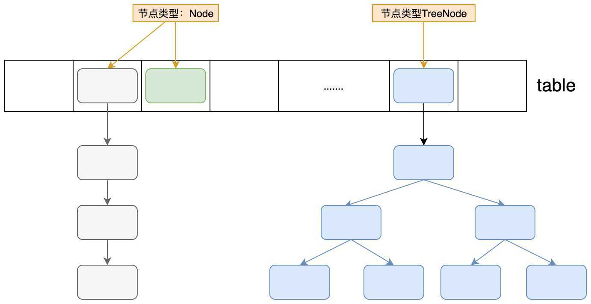

上图是HashMap的数据存储结构的表述图片。HashMap底层使用数组，每个数组元素存的是Node类型（或者TreeNode），table的每一个位置，可以成为Hash桶，也就是说，会将相同hash值的项存放到一个Hash桶中，也就是在Table的下标中相同，为了解决同一个位置有多个元素（冲突），HashMap用来拉链法和红黑树两种数据结构来解决冲突。

**二：解决冲突的第一次努力 - hash计算**

计算hash的过程，主要分了两个步骤

1. 计算key的hash值

   计算hash的源码如下：

   ```java
   static final int hash(Object key) {
       int h;
       return (key == null) ? 0 : (h = key.hashCode()) ^ (h >>> 16);
   }
   ```

   如果key为null，则hash为0

   如果key不为null，则将key的hash值和hash值的高16为进行异或运算得出最终的结果


2. 将hash值映射到数组下标内

   这个很好理解，只取hash码的低位，从而映射到数组内。计算结果使用下面的语句

   ```java
   (size-1) & hash
   ```

   

   > 为什么让高16为参加运算？
   
   ​		当数组的长度很短时，只有低位数的hashcode值能参与运算。而让高16位参与运算可以更好的均匀散列，减少碰撞，进一步降低hash冲突的几率。并且使得高16位和低16位的信息都被保留了。
   
   ​		这里的hash值是一个int值，4bit，32位，而16刚好是一半。
   
   > 为什么是异或运算？
   
   ​		因为异或运算的结果更均匀


**三：解决冲突的第二次努力 - 链表/树**

即使在计算hash的过程中已经尽力防止hash冲突了，但是仍然不可避免。所以当出现hash冲突时，数组上的元素会以链表或树的形式来保存数据。

##### 如何解决扩缩容问题？

TODO


##### HashMap的源码实现

以下源码都来自JDK1.8

首先来看一下Node的数据结构：

```java
static class Node<K,V> implements Map.Entry<K,V> {
    final int hash;
    final K key;
    V value;
    Node<K,V> next;

    Node(int hash, K key, V value, Node<K,V> next) {
        this.hash = hash;
        this.key = key;
        this.value = value;
        this.next = next;
    }

    public final K getKey()        { return key; }
    public final V getValue()      { return value; }
    public final String toString() { return key + "=" + value; }

    public final int hashCode() {
        return Objects.hashCode(key) ^ Objects.hashCode(value);
    }

    public final V setValue(V newValue) {
        V oldValue = value;
        value = newValue;
        return oldValue;
    }

    public final boolean equals(Object o) {
        if (o == this)
            return true;
        if (o instanceof Map.Entry) {
            Map.Entry<?,?> e = (Map.Entry<?,?>)o;
            if (Objects.equals(key, e.getKey()) &&
                Objects.equals(value, e.getValue()))
                return true;
        }
        return false;
    }
}
```

这个结构比较简单，没什么可说的。

**接下来看一下Hash Map的初始化**

```java
// 默认的加载因子0.75f
static final float DEFAULT_LOAD_FACTOR = 0.75f;
// 指定初始化容量和加载因子
public HashMap(int initialCapacity, float loadFactor) {
    if (initialCapacity < 0)
        throw new IllegalArgumentException("Illegal initial capacity: " + initialCapacity);
    if (initialCapacity > MAXIMUM_CAPACITY)
        initialCapacity = MAXIMUM_CAPACITY;
    if (loadFactor <= 0 || Float.isNaN(loadFactor))
        throw new IllegalArgumentException("Illegal load factor: " + loadFactor);
    this.loadFactor = loadFactor;
    this.threshold = tableSizeFor(initialCapacity);
}
// 指定初始化容量
public HashMap(int initialCapacity) {
    this(initialCapacity, DEFAULT_LOAD_FACTOR);
}
// 默认的构造方法
public HashMap() {
    this.loadFactor = DEFAULT_LOAD_FACTOR; // all other fields defaulted
}
// 这里计算的结果是大于cap的最小的2的幂次方
static final int tableSizeFor(int cap) {
    int n = cap - 1;
    n |= n >>> 1;
    n |= n >>> 2;
    n |= n >>> 4;
    n |= n >>> 8;
    n |= n >>> 16;
    return (n < 0) ? 1 : (n >= MAXIMUM_CAPACITY) ? MAXIMUM_CAPACITY : n + 1;
}
```

默认情况下仅指定了一个加载因子，默认0.75f，而数组的初始化实在第一次put操作的时候完成的。

下面真正干活的代码要来了。

**HashMap的PUT操作**

put操作时hashMap中一个比较核心的操作，是否扩容以及是否转换成红黑树都在这里进行判断。

```java
// 实际保存值的数组
transient Node<K,V>[] table;
// 链表和树之间转换的一个阈值
static final int TREEIFY_THRESHOLD = 8;

transient int size;

transient int modCount;

int threshold;

// 添加元素
public V put(K key, V value) {
    return putVal(hash(key), key, value, false, true);
}

// 具体干活的方法
final V putVal(int hash, K key, V value, boolean onlyIfAbsent, boolean evict) {
    Node<K,V>[] tab; Node<K,V> p; int n, i;
    if ((tab = table) == null || (n = tab.length) == 0)
        // 如果容器为空(第一次添加)，则进行实例化
        n = (tab = resize()).length;
    if ((p = tab[i = (n - 1) & hash]) == null)
        // 如果hash映射到数组内的位置为null，则直接对索引位置进行赋值
        tab[i] = newNode(hash, key, value, null);
    else {
        // 到这里说明存在hash冲突
        Node<K,V> e; K k;
        if (p.hash == hash && ((k = p.key) == key || (key != null && key.equals(k))))
            // 如果hash相同 并且 key相等
            e = p;
        else if (p instanceof TreeNode)
            // 如果时树结构
            e = ((TreeNode<K,V>)p).putTreeVal(this, tab, hash, key, value);
        else {
            // 执行到这里就说明对应数组索引的参数为链表结构(这里肯定不为空)，并且hash相同
            for (int binCount = 0; ; ++binCount) {
                // binCount的作用就是为了计数
                if ((e = p.next) == null) {
                    // 将新值添加到链表的最后端
                    p.next = newNode(hash, key, value, null);
                    if (binCount >= TREEIFY_THRESHOLD - 1) // -1 for 1st
                        // 判断是否需要转换成树
                        treeifyBin(tab, hash);
                    break;
                }
                if (e.hash == hash && ((k = e.key) == key || (key != null && key.equals(k))))
                    // 如果存在相同的key，直接跳出循环
                    break;
                p = e;
            }
        }
        if (e != null) {
            // 如果e不为null, 说明存在重复的key
            V oldValue = e.value;
            if (!onlyIfAbsent || oldValue == null)
                e.value = value;
            // 扩展接口，空实现
            afterNodeAccess(e);
            // 返回旧值
            return oldValue;
        }
    }
    ++modCount;
    if (++size > threshold)
        // 如果size超过阈值，进行扩容
        resize();
    // 扩展接口，空实现
    afterNodeInsertion(evict);
    return null;
}
```


**HashMap的扩缩容操作**

面试重点

```java
final Node<K,V>[] resize() {
    Node<K,V>[] oldTab = table;
    // 数组长度
    int oldCap = (oldTab == null) ? 0 : oldTab.length;
    // 阈值
    int oldThr = threshold;
    int newCap, newThr = 0;
    if (oldCap > 0) {
        if (oldCap >= MAXIMUM_CAPACITY) {
            // 如果旧的容量已经是最大值了，则放弃扩容，将阈值设置为Integer.MAX_VALUE
            threshold = Integer.MAX_VALUE;
            return oldTab;
        }
        else if ((newCap = oldCap << 1) < MAXIMUM_CAPACITY && oldCap >= DEFAULT_INITIAL_CAPACITY)
            // 将新的容量和阈值设置为原始的2倍
            newThr = oldThr << 1; // double threshold
    }
    else if (oldThr > 0) // initial capacity was placed in threshold
        // 在初始化HashMap时如果指定了initialCapacity，这里的threshold就是大于initialCapacity的最小的2的幂次方
        newCap = oldThr;
    else {               // zero initial threshold signifies using defaults
        // 这里进行初始化
        newCap = DEFAULT_INITIAL_CAPACITY;
        // 阈值等于 加载因子 * 初试容量
        newThr = (int)(DEFAULT_LOAD_FACTOR * DEFAULT_INITIAL_CAPACITY);
    }
    if (newThr == 0) {
        float ft = (float)newCap * loadFactor;
        newThr = (newCap < MAXIMUM_CAPACITY && ft < (float)MAXIMUM_CAPACITY ? (int)ft : Integer.MAX_VALUE);
    }
    threshold = newThr;
    // 初始化新的数组
    Node<K,V>[] newTab = (Node<K,V>[])new Node[newCap];
    table = newTab;
    // 将旧数组的数据拷贝到新数组
    if (oldTab != null) {
        for (int j = 0; j < oldCap; ++j) {
            Node<K,V> e;
            if ((e = oldTab[j]) != null) {
                oldTab[j] = null;
                if (e.next == null)
                    newTab[e.hash & (newCap - 1)] = e;
                else if (e instanceof TreeNode)
                    ((TreeNode<K,V>)e).split(this, newTab, j, oldCap);
                else { // preserve order
                    // 注意：这里旧数组中，同一个链表的数据，转移到新数组，要么在原索引位置要么在 原索引+odlCap位置，这里直接分成连个链表，直接赋值
                    // 一个字： 妙啊
                    Node<K,V> loHead = null, loTail = null;
                    Node<K,V> hiHead = null, hiTail = null;
                    Node<K,V> next;
                    do {
                        next = e.next;
                        if ((e.hash & oldCap) == 0) {
                            if (loTail == null)
                                loHead = e;
                            else
                                loTail.next = e;
                            loTail = e;
                        }
                        else {
                            if (hiTail == null)
                                hiHead = e;
                            else
                                hiTail.next = e;
                            hiTail = e;
                        }
                    } while ((e = next) != null);
                    if (loTail != null) {
                        loTail.next = null;
                        newTab[j] = loHead;
                    }
                    if (hiTail != null) {
                        hiTail.next = null;
                        newTab[j + oldCap] = hiHead;
                    }
                }
            }
        }
    }
    return newTab;
}
```

**HashMap的GET操作**

```java
public V get(Object key) {
    Node<K,V> e;
    return (e = getNode(hash(key), key)) == null ? null : e.value;
}
    
final Node<K,V> getNode(int hash, Object key) {
    Node<K,V>[] tab; Node<K,V> first, e; int n; K k;
    if ((tab = table) != null && (n = tab.length) > 0 && (first = tab[(n - 1) & hash]) != null) {
        if (first.hash == hash && ((k = first.key) == key || (key != null && key.equals(k))))
            // always check first node
            return first;
        if ((e = first.next) != null) {
            if (first instanceof TreeNode)
                return ((TreeNode<K,V>)first).getTreeNode(hash, key);
            do {
                if (e.hash == hash && ((k = e.key) == key || (key != null && key.equals(k))))
                    return e;
            } while ((e = e.next) != null);
        }
    }
    return null;
} 
```

**HashMap的remove操作**

```java
public V remove(Object key) {
    Node<K,V> e;
    return (e = removeNode(hash(key), key, null, false, true)) == null ? null : e.value;
}

final Node<K,V> removeNode(int hash, Object key, Object value, boolean matchValue, boolean movable) {
    Node<K,V>[] tab; Node<K,V> p; int n, index;
    if ((tab = table) != null && (n = tab.length) > 0 &&
        (p = tab[index = (n - 1) & hash]) != null) {
        Node<K,V> node = null, e; K k; V v;
        if (p.hash == hash && ((k = p.key) == key || (key != null && key.equals(k))))
            node = p;
        else if ((e = p.next) != null) {
            if (p instanceof TreeNode)
                node = ((TreeNode<K,V>)p).getTreeNode(hash, key);
            else {
                do {
                    if (e.hash == hash && ((k = e.key) == key || (key != null && key.equals(k)))) {
                        node = e;
                        break;
                    }
                    p = e;
                } while ((e = e.next) != null);
            }
        }
        if (node != null && (!matchValue || (v = node.value) == value || (value != null && value.equals(v)))) {
            if (node instanceof TreeNode)
                ((TreeNode<K,V>)node).removeTreeNode(this, tab, movable);
            else if (node == p)
                tab[index] = node.next;
            else
                p.next = node.next;
            ++modCount;
            --size;
            afterNodeRemoval(node);
            return node;
        }
    }
    return null;
}
```


**看一看列表是如何转换成tree的**

TODO

```java
final void treeifyBin(Node<K,V>[] tab, int hash) {
    int n, index; Node<K,V> e;
    if (tab == null || (n = tab.length) < MIN_TREEIFY_CAPACITY)
        resize();
    else if ((e = tab[index = (n - 1) & hash]) != null) {
        TreeNode<K,V> hd = null, tl = null;
        do {
            TreeNode<K,V> p = replacementTreeNode(e, null);
            if (tl == null)
                hd = p;
            else {
                p.prev = tl;
                tl.next = p;
            }
            tl = p;
        } while ((e = e.next) != null);
        if ((tab[index] = hd) != null)
            hd.treeify(tab);
    }
}
    
TreeNode<K,V> replacementTreeNode(Node<K,V> p, Node<K,V> next) {
    return new TreeNode<>(p.hash, p.key, p.value, next);
}

```


## 并发专题

### 并发编程基础


### 内存模型


### Java中的锁


#### Lock

TODO

#### AbstractQueueSynchronization

AbstractQueuedSynchronizer(AQS)，即抽象队列同步器，提供了一套可用于实现锁同步机制的框架，不夸张地说，AQS是JUC同步框架的基石。AQS通过一个FIFO队列维护线程同步状态，实现类只需要继承该类，并重写指定方法即可实现一套线程同步机制。

AQS根据资源互斥级别提供了**独占和共享**两种资源访问模式；同时其定义Condition结构提供了wait/signal等待唤醒机制。在JUC中，诸如ReentrantLock、CountDownLatch等都基于AQS实现。


##### AQS 框架原理

AQS的原理并不复杂，AQS维护了一个volatile int state变量和一侧CLH(三个人名缩写)双向队列，队列中的节点持有线程引用，每个节点均可通过getState()，setState()，compareAndSetState()对state进行修改和访问。

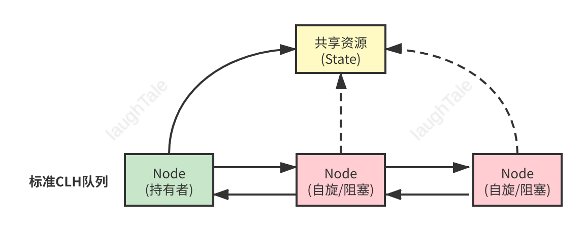

当线程获取锁时，即试图对`state`变量做修改，如修改成功则获取锁；如修改失败则包装为节点挂载到队列中，等待持有锁的线程释放锁并唤醒队列中的节点。

**AQS模板方法**

`AQS`内部封装了队列维护逻辑，采用模版方法的模式提供实现类以下方法：

```java
tryAcquire(int);        // 尝试获取独占锁，可获取返回true，否则false
tryRelease(int);        // 尝试释放独占锁，可释放返回true，否则false
tryAcquireShared(int);  // 尝试以共享方式获取锁，失败返回负数，只能获取一次返回0，否则返回个数
tryReleaseShared(int);  // 尝试释放共享锁，可获取返回true，否则false
isHeldExclusively();    // 判断线程是否独占资源
```

如实现类只需实现独占锁/共享锁功能，可只实现`tryAcquire/tryRelease`或`tryAcquireShared/tryReleaseShared`。虽然实现`tryAcquire/tryRelease`可自行设定逻辑，但建议使用`state`方法对`state`变量进行操作以实现同步类。


##### AQS实现分析

**同步队列**

同步器依赖内部的同步队列（一个FIFO双向队列）来完成同步状态管理。当前线程获取同步状态是失败时，同步器会将当前线程以及等待状态等信息构建为一个节点（Node）并将其加入到同步队列中。同时会阻塞当前线程。当同步状态释放时，会吧首节点的线程唤醒，使其再次尝试获取同步状态。

同步队列中的节点（Node）用来保存获取同步状态失败的的线程引用，等待状态以及前驱后集结点，节点属性如下：

| 属性类型与名称  | 描述                                                         |
| --------------- | ------------------------------------------------------------ |
| int waitStatus  | 等待状态<br />包含如下状态<br />1. CANCELLED： 值为1，由于在同步队列中等待的线程等待超时或者被中断，需要从同步队列中取消等待，节点进入等待状态不会变化<br />2. SIGNAL ：值为-1，后继节点的线程处于等待状态，而当前节点的线程如果释放了同步状态或者被取消，将会通知后继节点，是后继节点的线程得以运行<br />3. CONDITION：值为-2，节点在等待队列中，节点的线程等待在Condition上，当其他线程Condition调用了signal()方法后，该节点将会从等待队列中转移到同步队列中去。加入到同步队列状态的获取中<br />4. PROPAGATE：值为-3，表示下一次共享时同步状态获取将会无条件的传播下去<br />5. INITIAL：值为0，初始化状态<br /> |
| Node prev       | 前驱节点，当节点加入同步队列时被设置                         |
| Node next       | 后继节点                                                     |
| Node nextWaiter | 等待队列中的后继节点，如果当前节点是共享的，name这个字段是一个SHARED常量，也就是说节点类型(独占和共享)和等待队列中的后继节点共用同一个字段 |
| Thread thread   | 获取同步状态的线程                                           |


**waitStatus状态详述：**

**CANCELLED**：由于超时或中断，此节点被取消。节点一旦被取消了就不会再改变状态。特别是，取消节点的线程不会再阻塞。

**SIGNAL**：此节点后面的节点已（或即将）被阻止（通过park），因此当前节点在释放或取消时必须断开后面的节点为了避免竞争，acquire方法时前面的节点必须是SIGNAL状态，然后重试原子acquire，然后在失败时阻塞。

**CONDITION：**此节点当前在条件队列中。标记为CONDITION的节点会被移动到一个特殊的条件等待队列（此时状态将设置为0），直到条件时才会被重新移动到同步等待队列 。（此处使用此值与字段的其他用途无关，但简化了机制。）

**PROPAGATE：**传播：应将releaseShared传播到其他节点。这是在doReleaseShared中设置的（仅适用于头部节点），以确保传播继续，即使此后有其他操作介入。

0:以上数值均未按数字排列以简化使用。非负值表示节点不需要发出信号。所以，大多数代码不需要检查特定的值，只需要检查符号。对于正常同步节点，该字段初始化为0；对于条件节点，该字段初始化为条件。它是使用CAS修改的（或者在可能的情况下，使用无条件的volatile写入）。


[AQS : waitStatus = Propagate 的作用解析 以及读锁无法全获取问题 - 执生 - 博客园 (cnblogs.com)](https://www.cnblogs.com/lqlqlq/p/12991275.html?ivk_sa=1024320u)

看图说话，队列同步器的基本数据结构如下：


同步队列包含两个节点类型的引用，一个指向头结点，一个指向尾节点。追加节点的过程通过`compareAndSetTail(Node expect, Node update)`方法来实现，从而保证了追加节点过程的线程安全。

同步队列遵循FIFO原则，首节点是获取同步状态成功的节点，首节点的同步线程在释放同步状态时，或唤醒后继节点，而后继节点在获取同步状态成功时，会将自己设置为首节点。这里需要注意，设置首节点的过程，不需要同步操作，因为每一时刻，只有一个线程能够获取到同步状态。


##### 独占锁分析

通过调用同步器的acquire(int arg)方法可以获取同步状态，该方法对中断不敏感。

```java
public final void acquire(int arg) {
    // tryAcquire需实现类处理，如获取资源成功，直接返回
    if (!tryAcquire(arg) && 
        // 如获取资源失败，将线程包装为Node添加到队列中阻塞等待
        acquireQueued(addWaiter(Node.EXCLUSIVE), arg))
        // 如阻塞线程被打断
        selfInterrupt();
}
```

该方法主要完成同步状态获取，节点构造，加入同步队列以及在同步队列中自旋等操作。

首先通过tryAcquire()方法线程安全的获取同步状态，如果获取同步状态失败，则构造同步节点，通过addWaiter(Node node)方法加入到同步队列的尾部。Node.EXCLUSIVE表示线程以独占的方式等待锁。最后调用acquireQueued(Node node, int arg)方法来循环获取同步状态。

> 注：这里的tryAcquire是一个抽象方法，需要子类实现。

下面看一下节点的创建及添加过程：

```java
// 构造节点的过程
private Node addWaiter(Node mode) {
    // 创建一个节点
    Node node = new Node(Thread.currentThread(), mode);
    // Try the fast path of enq; backup to full enq on failure
    Node pred = tail;
    if (pred != null) {
        node.prev = pred;
        // 以cas的方式修改tail
        if (compareAndSetTail(pred, node)) {
            // 设置链表额指针
            pred.next = node;
            return node;
        }
    }
    // 如果tail为null，需要初始化
    enq(node);
    return node;
}

private Node enq(final Node node) {
    // 死循环的方式初始化链表
    for (;;) {
        Node t = tail;
        if (t == null) { // Must initialize
            // 链表的开头是个空节点
            if (compareAndSetHead(new Node()))
                // 这里初始化完后，会再次进入循环
                tail = head;
        } else {
            // 将node加入链表
            node.prev = t;
            if (compareAndSetTail(t, node)) {
                t.next = node;
                return t;
            }
        }
    }
}
```

首先通过compareAndSetTail(Node expect, Node update)方法来保证线程的安全添加。enq方法则保证线程的初始化列表。

当节点进入同步队列之后，就进入了一个自旋的过程。查看acquireQueued方法：

```java
final boolean acquireQueued(final Node node, int arg) {
    boolean failed = true;
    try {
        // interrupted是中断标记
        boolean interrupted = false;
        // 自旋
        for (;;) {
            final Node p = node.predecessor();
            // 检查node的前置节点是否为头结点 && 尝试获取锁
            if (p == head && tryAcquire(arg)) {
                setHead(node);
                p.next = null; // help GC
                failed = false;
                return interrupted;
            }
            if (shouldParkAfterFailedAcquire(p, node) &&
                parkAndCheckInterrupt())
                interrupted = true;
        }
    } finally {
        if (failed)
            cancelAcquire(node);
    }
}
// 设置为头结点
private void setHead(Node node) {
    // 这里是直接把node设置为头结点，而不是修改头结点的指针。
    head = node;
    node.thread = null;
    node.prev = null;
}
```

这里通过死循环的方式尝试获取同步锁，只有前驱节点是头结点的节点才能获取通过状态。这种方式可以很好的维护一个FIFO队列。

在获取到锁之后，会吧当前节点设置为头结点。

如果没有获取到锁，会执行shouldParkAfterFailedAcquire方法和parkAndCheckInterrupt方法，下面就来看看这两个方法做了什么事情。

```java
// 这里判断在获取同步状态失败后是否需要被park住
private static boolean shouldParkAfterFailedAcquire(Node pred, Node node) {
    int ws = pred.waitStatus;
    if (ws == Node.SIGNAL)
        return true;
    if (ws > 0) {
        // 头结点取消执行了，跳过头结点，重新尝试
        do {
            node.prev = pred = pred.prev;
        } while (pred.waitStatus > 0);
        pred.next = node;
    } else {
        // 将waitStatus改为Node.SIGNAL
        compareAndSetWaitStatus(pred, ws, Node.SIGNAL);
    }
    return false;
}

private final boolean parkAndCheckInterrupt() {
    // park住当前线程
    LockSupport.park(this);
    // 被唤醒时返回中断状态
    return Thread.interrupted();
}
```


独占式通过状态获取流程：


下面看一下释放锁的逻辑：

```java
public final boolean release(int arg) {
    if (tryRelease(arg)) {
        // 如果释放资源成功，尝试唤醒下一个节点
        Node h = head;
        if (h != null && h.waitStatus != 0)
            unparkSuccessor(h);
        return true;
    }
    return false;
}
private void unparkSuccessor(Node node) {
    int ws = node.waitStatus;
    if (ws < 0)
        compareAndSetWaitStatus(node, ws, 0);

    Node s = node.next;
    if (s == null || s.waitStatus > 0) {
        s = null;
        // 从尾部节点开始遍历，找到最靠前的一个需要执行的节点
        for (Node t = tail; t != null && t != node; t = t.prev)
            if (t.waitStatus <= 0)
                s = t;
    }
    if (s != null)
        // 通过unpark唤醒线程
        LockSupport.unpark(s.thread);
}
```

同样，tryRelease是一个抽象方法。释放资源后，会判断waitStatus状态，唤醒后继节点。

##### 共享锁分析

共享锁与独占锁额区别在于在同一时刻是否有多个线程同时获取到同步状态。

下面直接上代码：

```java
// 已共享方式获取锁
public final void acquireShared(int arg) {
    if (tryAcquireShared(arg) < 0)
        doAcquireShared(arg);
}
// 构造节点放入队列
private void doAcquireShared(int arg) {
    final Node node = addWaiter(Node.SHARED);
    boolean failed = true;
    try {
        boolean interrupted = false;
        for (;;) {
            final Node p = node.predecessor();
            if (p == head) {
                // 如何共享获取的逻辑在tryAcquireShared方法中
                int r = tryAcquireShared(arg);
                if (r >= 0) {
                    // 设置Head节点
                    setHeadAndPropagate(node, r);
                    p.next = null; // help GC
                    if (interrupted)
                        selfInterrupt();
                    failed = false;
                    return;
                }
            }
            if (shouldParkAfterFailedAcquire(p, node) &&
                parkAndCheckInterrupt())
                interrupted = true;
        }
    } finally {
        if (failed)
            cancelAcquire(node);
    }
}

private void setHeadAndPropagate(Node node, int propagate) {
    Node h = head; // Record old head for check below
    setHead(node);
	// setHead方法会设置一个新的head，h指向的是旧的head
    // if判断会同时判断old head 和new head，（h重新赋值后会指向新的head）
    if (propagate > 0 || h == null || h.waitStatus < 0 ||
        (h = head) == null || h.waitStatus < 0) {
        Node s = node.next;
        if (s == null || s.isShared())
            doReleaseShared();
    }
}

```

重点来看tryAcquireShared方法，这是一个抽象方法，实现由子类完成。这里主要说明一下返回值：

- 如果获取共享锁失败，返回负数
- 如果获取共享锁成功，但是后续节点无法获取共享锁，返回0
- 如果获取共享锁成功，而且后续节点也可以获取共享锁，返回正数。

下面看共享锁释放的逻辑：

```java
public final boolean releaseShared(int arg) {
    if (tryReleaseShared(arg)) {
        doReleaseShared();
        return true;
    }
    return false;
}
private void doReleaseShared() {
    for (;;) {
        Node h = head;
        if (h != null && h != tail) {
            int ws = h.waitStatus;
            if (ws == Node.SIGNAL) {
                if (!compareAndSetWaitStatus(h, Node.SIGNAL, 0))
                    continue;            // loop to recheck cases
                unparkSuccessor(h);
            }
            else if (ws == 0 &&
                     !compareAndSetWaitStatus(h, 0, Node.PROPAGATE))
                continue;                // loop on failed CAS
        }
        if (h == head)                   // loop if head changed
            break;
    }
}
private void unparkSuccessor(Node node) {
    int ws = node.waitStatus;
    if (ws < 0)
        compareAndSetWaitStatus(node, ws, 0);

    Node s = node.next;
    if (s == null || s.waitStatus > 0) {
        s = null;
        for (Node t = tail; t != null && t != node; t = t.prev)
            if (t.waitStatus <= 0)
                s = t;
    }
    if (s != null)
        LockSupport.unpark(s.thread);
}
```


#### 重入锁

TODO

#### 读写锁

TODO


### 并发容器和框架

#### ConcurrentHashMap实现总结

##### JDK1.8中的实现

和 jdk1.8 的 HashMap 的实现一样，采用了 Node数组+链表+红黑树的实现方式，抛弃了 jdk1.7中的 Segment 分段锁机制，采用 Synchronized 和 CAS 实现更加细粒度的锁。

将锁的级别控制在了更细粒度的哈希桶数组元素级别，只要锁住这个桶的头结点，就不会影响其他哈希桶数组元素的读写，相对于 1.7 大大提高了并发度。


**源码分析**


首先来看一下Node节点数据

```java
static class Node<K,V> implements Map.Entry<K,V> {
    final int hash;
    final K key;
    volatile V val;
    volatile Node<K,V> next;

    Node(int hash, K key, V val, Node<K,V> next) {
        this.hash = hash;
        this.key = key;
        this.val = val;
        this.next = next;
    }

    public final K getKey()       { return key; }
    public final V getValue()     { return val; }
    public final int hashCode()   { return key.hashCode() ^ val.hashCode(); }
    public final String toString(){ return key + "=" + val; }
    public final V setValue(V value) {
        throw new UnsupportedOperationException();
    }

    public final boolean equals(Object o) {
        Object k, v, u; Map.Entry<?,?> e;
        return ((o instanceof Map.Entry) &&
                (k = (e = (Map.Entry<?,?>)o).getKey()) != null &&
                (v = e.getValue()) != null &&
                (k == key || k.equals(key)) &&
                (v == (u = val) || v.equals(u)));
    }

    /**
         * Virtualized support for map.get(); overridden in subclasses.
         */
    Node<K,V> find(int h, Object k) {
        Node<K,V> e = this;
        if (k != null) {
            do {
                K ek;
                if (e.hash == h &&
                    ((ek = e.key) == k || (ek != null && k.equals(ek))))
                    return e;
            } while ((e = e.next) != null);
        }
        return null;
    }
}

```

这个结构和HashMap的结构很类似，除了保存hash, k,v之外，还保存了一个next节点，来构成一个链表。并且还提供了一个find方法来查询链表元素。


常量值

```java
private static final int MAXIMUM_CAPACITY = 1 << 30;	// 最大容量
private static final int DEFAULT_CAPACITY = 16;		// 默认容量
static final int MAX_ARRAY_SIZE = Integer.MAX_VALUE - 8;	// 最大数组长度
private static final int DEFAULT_CONCURRENCY_LEVEL = 16;	// 默认并行级别
private static final float LOAD_FACTOR = 0.75f;				// 负载系数
static final int TREEIFY_THRESHOLD = 8;						// 树化阈值
static final int UNTREEIFY_THRESHOLD = 6;					// 取消树化阈值
static final int MIN_TREEIFY_CAPACITY = 64;					// 最小树化数组容量，转换为红黑树的最小数组长度
private static final int MIN_TRANSFER_STRIDE = 16;			
private static int RESIZE_STAMP_BITS = 16;
private static final int MAX_RESIZERS = (1 << (32 - RESIZE_STAMP_BITS)) - 1;		// 扩容的最大的线程的数量
private static final int RESIZE_STAMP_SHIFT = 32 - RESIZE_STAMP_BITS;
static final int MOVED     = -1; // hash for forwarding nodes
static final int TREEBIN   = -2; // hash for roots of trees
static final int RESERVED  = -3; // hash for transient reservations
static final int HASH_BITS = 0x7fffffff; // usable bits of normal node hash			// hash 位数,int 最大值
static final int NCPU = Runtime.getRuntime().availableProcessors();			// 获取CPU核数
private static final ObjectStreamField[] serialPersistentFields = {			// 序列化兼容性
    new ObjectStreamField("segments", Segment[].class),
    new ObjectStreamField("segmentMask", Integer.TYPE),
    new ObjectStreamField("segmentShift", Integer.TYPE)
};
```

initTable()

```java
private final Node<K,V>[] initTable() {
    Node<K,V>[] tab; int sc;
    while ((tab = table) == null || tab.length == 0) {
		//如果一个线程发现sizeCtl<0，意味着另外的线程执行CAS操作成功，当前线程只需要让出cpu时间片
        if ((sc = sizeCtl) < 0) 
            // 使当前线程由执行状态变为就绪状态，让出cpu
            Thread.yield(); // lost initialization race; just spin
        // compareAndSwapInt参数(要修改的值的对象,要修改的数据的值在内存中的偏移量(找到要修改的值),期望内存中的值，要修改内存的值)
        else if (U.compareAndSwapInt(this, SIZECTL, sc, -1)) {
            try {
                if ((tab = table) == null || tab.length == 0) {
                    int n = (sc > 0) ? sc : DEFAULT_CAPACITY;
                    @SuppressWarnings("unchecked")
                    Node<K,V>[] nt = (Node<K,V>[])new Node<?,?>[n];
                    table = tab = nt;
                    sc = n - (n >>> 2);  //0.75*capacity
                }
            } finally {
                sizeCtl = sc;
            }
            break;
        }
    }
    return tab;
}
```

putValue()

```java
final V putVal(K key, V value, boolean onlyIfAbsent) {
    if (key == null || value == null) throw new NullPointerException();
    // 将 key的hash值再 hash，双重 hash，降低冲突概率
    int hash = spread(key.hashCode());
    int binCount = 0;
    for (Node<K,V>[] tab = table;;) {
        Node<K,V> f; int n, i, fh;
        // 判断是否为空
        if (tab == null || (n = tab.length) == 0)
            // 初始化table
            tab = initTable();
        // 当前 bucket 为空，使用 cas 机制将put的值放到此bucket,put操作完成
        else if ((f = tabAt(tab, i = (n - 1) & hash)) == null) {
            if (casTabAt(tab, i, null, new Node<K,V>(hash, key, value, null)))
                break;                   // no lock when adding to empty bin
        }
        // 如果bucket不为空,并且hash = -1,说明当前map正在扩容,其他线程先协助扩容,加快速度(多线程扩容)
        else if ((fh = f.hash) == MOVED)
            tab = helpTransfer(tab, f);
        // 如果 hash 冲突了,且 hash 值不为 -1
        else {
            V oldVal = null;
            // 同步 f 节点，防止增加链表的时候导致链表成环状
            synchronized (f) {
                // 如果对应的下标位置的节点没有改变
                if (tabAt(tab, i) == f) {
                    // 如果 f 节点的hash >= 0
                    if (fh >= 0) {
                        // 链表初始长度
                        binCount = 1;
                        // 死循环,直至将节点添加到链表尾部,binCount用来计算链表长度
                        for (Node<K,V> e = f;; ++binCount) {
                            K ek;
                            // 如果 e 的 key 与要插入的节点key值相同 或者 e 的hash 与 要插入的节点的 hash 相同
                            if (e.hash == hash &&
                                ((ek = e.key) == key ||
                                 (ek != null && key.equals(ek)))) {
                                oldVal = e.val;
                                if (!onlyIfAbsent)
                                    // 完成节点赋值，put操作成功
                                    e.val = value;
                                break;
                            }
                            Node<K,V> pred = e;
                            // 判断 e 是否有后继节点,如否,将后继节点赋给 e,循环
                            if ((e = e.next) == null) {
                                pred.next = new Node<K,V>(hash, key,
                                                          value, null);
                                break;
                            }
                        }
                    }
                    // 如果 f 节点的 hash < 0 并且 f 是树
                    else if (f instanceof TreeBin) {
                        Node<K,V> p;
                        binCount = 2;
                        // 向树中添加节点
                        if ((p = ((TreeBin<K,V>)f).putTreeVal(hash, key,
                                                              value)) != null) {
                            oldVal = p.val;
                            if (!onlyIfAbsent)
                                p.val = value;
                        }
                    }
                }
            }
            // 链表长度 >= 8 时，将链表转换为红黑树
            if (binCount != 0) {
                if (binCount >= TREEIFY_THRESHOLD)
                    treeifyBin(tab, i);
                if (oldVal != null)
                    return oldVal;
                break;
            }
        }
    }
    // 更新容器容量,并判断是否需要扩容
    addCount(1L, binCount);
    return null;
}
```

helpTransfer()

```java
 final Node<K,V>[] helpTransfer(Node<K,V>[] tab, Node<K,V> f) {
     Node<K,V>[] nextTab; int sc;
     // 数据校验,如果 tab不为null 并且node节点是转移类型 并且 node 节点的 nextTable 不为null，符合以上条件尝试协助扩容操作
     if (tab != null && (f instanceof ForwardingNode) &&=--
         (nextTab = ((ForwardingNode<K,V>)f).nextTable) != null) {
         // 根据length得到一个标识符号
         int rs = resizeStamp(tab.length);
         // 如果 nextTab 和 tab 都没有被并发修改 并且 sizeCtl < 0(说明还在扩容)
         while (nextTab == nextTable && table == tab &&
                (sc = sizeCtl) < 0) {
             // sc 右移16位 != 标识 (sc 前16位不等于标识符,代表标识符变化了)
             // sc == rs + 1 (代表扩容结束了,默认第一个协助扩容的线程设置 sc = rs左移16位+2,当第一个线程结束扩容了,会将 sc -1,所以 sc = rs+1代表扩容结束了)
             // sc == rs + MAX_RESIZERS (sc = rs+65535,如果达到了最大协助线程的数量)
             // transferIndex <= 0 (转移下标正在调整,代表扩容结束)
             // 满足以上任一条件,结束协助扩容
             if ((sc >>> RESIZE_STAMP_SHIFT) != rs || sc == rs + 1 ||
                 sc == rs + MAX_RESIZERS || transferIndex <= 0)
                 break;
             // 如果以上都不是,将 sizeCTL + 1 ,标识增加了一个线程协助扩容
             if (U.compareAndSwapInt(this, SIZECTL, sc, sc + 1)) {
                 // 将节点转移到新table
                 transfer(tab, nextTab);
                 break;
             }
         }
         return nextTab;
     }
     return table;
 }
```

addCount()

```java
// 更新容器容量方法
private final void addCount(long x, int check) {
    CounterCell[] as; long b, s;
    // 如果counterCells不为null 或者 更新容器容量不成功时
    if ((as = counterCells) != null ||
        !U.compareAndSwapLong(this, BASECOUNT, b = baseCount, s = b + x)) {
        CounterCell a; long v; int m;
        boolean uncontended = true;
        if (as == null || (m = as.length - 1) < 0 ||
            (a = as[ThreadLocalRandom.getProbe() & m]) == null ||
            !(uncontended =
              U.compareAndSwapLong(a, CELLVALUE, v = a.value, v + x))) {
            // 多线程 cas 失败时执行, 会向 CounterCell中存储因为高并发导致cas更新baseCounter失败时的值
            fullAddCount(x, uncontended);
            return;
        }
        if (check <= 1)
            return;
        // 计算容器容量
        s = sumCount();
    }
    if (check >= 0) {
        Node<K,V>[] tab, nt; int n, sc;
        // 当条件满足开始扩容
        while (s >= (long)(sc = sizeCtl) && (tab = table) != null &&
               (n = tab.length) < MAXIMUM_CAPACITY) {
            int rs = resizeStamp(n);
            // 说明此时已经有线程正在扩容
            if (sc < 0) {
                if ((sc >>> RESIZE_STAMP_SHIFT) != rs || sc == rs + 1 ||
                    sc == rs + MAX_RESIZERS || (nt = nextTable) == null ||
                    transferIndex <= 0)
                    // 有线程在扩容时,直接break
                    break;
                // 此时其他线程如果扩容完毕,修改 sc 的值,继续扩容
                if (U.compareAndSwapInt(this, SIZECTL, sc, sc + 1))
                    transfer(tab, nt);
            }
            else if (U.compareAndSwapInt(this, SIZECTL, sc,
                                         (rs << RESIZE_STAMP_SHIFT) + 2))
                transfer(tab, null);
            // 计算容器容量
            s = sumCount();
        }
    }
}
```

get()

```java
public V get(Object key) {
    Node<K,V>[] tab; Node<K,V> e, p; int n, eh; K ek;
    // 双重 hash
    int h = spread(key.hashCode());
    // 如果 table 不为空 并且查找的 key 的节点不为 null
    if ((tab = table) != null && (n = tab.length) > 0 &&
        (e = tabAt(tab, (n - 1) & h)) != null) {
        // 如果节点 e 的hash 是要查找的key的hash
        if ((eh = e.hash) == h) {
            // 如果节点 e 的 key 与要查找的key相等
            if ((ek = e.key) == key || (ek != null && key.equals(ek)))
                // 返回 value
                return e.val;
        }
        // 判断是否是红黑树
        else if (eh < 0)
            // 遍历红黑树查找元素
            return (p = e.find(h, key)) != null ? p.val : null;
        // 遍历链表查找key值所在的节点e
        while ((e = e.next) != null) {
            if (e.hash == h &&
                ((ek = e.key) == key || (ek != null && key.equals(ek))))
                return e.val;
        }
    }
    return null;
}

```

size()

```java
public int size() {
    long n = sumCount();
    return ((n < 0L) ? 0 :
            (n > (long)Integer.MAX_VALUE) ? Integer.MAX_VALUE :
            (int)n);
}

// baseCount 指的是容器容量
private transient volatile long baseCount;

final long sumCount() {
    // CounterCell 就是用来记录容器容量的内部类
    CounterCell[] as = counterCells; CounterCell a;
    long sum = baseCount;
    if (as != null) {
        // 累加容器数量,因为CounterCell记录的是因为高并发导致更新baseCount失败时的值,所以,需要遍历CounterCell进行累加
        for (int i = 0; i < as.length; ++i) {
            if ((a = as[i]) != null)
                sum += a.value;
        }
    }
    return sum;
}
```


### Java中的原子类

### Java中的并发工具类

TODO

### Java中的线程池

在开发的过程中，合理的使用线程池能够带来三个好处。

- 降低资源消耗：通过重复利用已创建的线程降低线程创建和销毁造成的消耗
- 提高响应速度：当任务到达时，任务可以不需要等到线程创建就能立即执行。
- 提高线程可管理性：线程是稀缺的资源，如果无限制的创建，不仅会消耗系统资源，还会降低系统的稳定性，使用线程池可以进行统一分配、调优和监控。

#### ThreadPoolExecutor

ThreadPoolExecutor是Java对线程池的一个具体实现。


##### 线程池状态

主要分为5种状态

| 线程池状态 | 说明                                                         |
| ---------- | ------------------------------------------------------------ |
| RUNNING    | 允许提交并处理任务                                           |
| SHUTDOWN   | 不允许提交新任务，但是会处理完已提交的任务                   |
| STOP       | 不允许提交新任务，也不会处理阻塞队里中未执行的任务<br />并设置正在执行的线程的中断标志位 |
| TIDYING    | 所有任务执行完毕，池中工作线程数为0，等待执行terminated()钩子方法 |
| TERMINATED | terminated()钩子方法执行完毕                                 |

- 线程池的shutdown()方法，将线程池有RUNNING转换为SHUTDOWN状态
- 线程池的shutdownNow()方法将线程池由RUNNING状态或SHUTDOWN状态转换为STOP状态

注：SHUTDOWN状态和STOP状态先会转换为TIDYING状态转换为STOP状态

##### 创建线程池

要创建线程池，必须通过构造函数来进行创建，下面众多构造函数中参数最全的一个：

```java
public ThreadPoolExecutor(int corePoolSize,//核心线程数
                          int maximumPoolSize,//最大线程数
                          long keepAliveTime,//线程空闲时间
                          TimeUnit unit,//时间单位
                          BlockingQueue<Runnable> workQueue,//任务队列
                          ThreadFactory threadFactory,//线程工厂
                          RejectedExecutionHandler handler//拒绝策略) 
{
    ...
}
```

- corePoolSize：线程池中核心线程数的最大值
- maximumPoolSize：线程池中能拥有最多线程数
- keepAliveTime：表示空闲线程的存活时间
- unit：表示keepAliveTime的时间单位
- workQueue：用于缓存任务的缓冲队列，它决定了缓存任务的排队策略
- handler： 线程池对拒绝任务的处理策略

##### 线程池的工作原理

当调用线程池execute()方法添加一个任务时，线程池会做如下判断：

1. 如果此时线程池中的数量小于corePoolSize，即使线程池中的线程都处于空闲状态，也要创建新的线程来处理被添加的任务。
2. 如果此时线程池中的数量等于 corePoolSize，但是缓冲队列 workQueue未满，那么任务被放入缓冲队列。
3. 如果此时线程池中的数量大于corePoolSize，缓冲队列workQueue满，并且线程池中的数量小于maximumPoolSize，建新的线程来处理被添加的任务。
4. 如果此时线程池中的数量大于corePoolSize，缓冲队列workQueue满，并且线程池中的数量等于maximumPoolSize，那么通过 handler所指定的策略来处理此任务。也就是：处理任务的优先级为：核心线程corePoolSize、任务队列workQueue、最大线程maximumPoolSize，如果三者都满了，使用handler处理被拒绝的任务。
5. 当线程池中的线程数量大于 corePoolSize时，如果某线程空闲时间超过keepAliveTime，线程将被终止。这样，线程池可以动态的调整池中的线程数

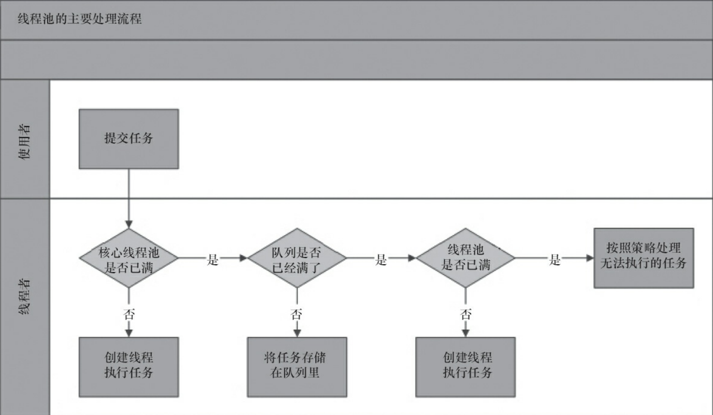


当一个线程无事可做，超过一定的时间（keepAliveTime）时，线程池会判断，如果当前运行的线程数大于 corePoolSize，那么这个线程就被停掉。所以线程池的所有任务完成后，它最终会收缩到 corePoolSize 的大小。

注：如果线程池设置了allowCoreThreadTimeout参数为true（默认false），那么当空闲线程超过keepaliveTime后直接停掉。（不会判断线程数是否大于corePoolSize）即：最终线程数会变为0。


**线程池中的三种等待队列**

ThreadPoolExecutor线程池推荐了三种等待队列，它们是：SynchronousQueue 、LinkedBlockingQueue 和 ArrayBlockingQueue。

- 有界队列：

SynchronousQueue ：一个不存储元素的阻塞队列，每个插入操作必须等到另一个线程调用移除操作，否则插入操作一直处于 阻塞状态，吞吐量通常要高于LinkedBlockingQueue，静态工厂方法 Executors.newCachedThreadPool 使用了这个队列。

ArrayBlockingQueue：一个由数组支持的有界阻塞队列。此队列按 FIFO（先进先出）原则对元素进行排序。一旦创建了这样的缓存区，就不能再增加其容量。试图向已满队列中放入元素会导致操作受阻塞；试图从空队列中提取元素将导致类似阻塞。

- 无界队列：

LinkedBlockingQueue：基于链表结构的无界阻塞队列，它可以指定容量也可以不指定容量（实际上任何无限容量的队列/栈都是有容量的，这个容量就是Integer.MAX_VALUE）

PriorityBlockingQueue：是一个按照优先级进行内部元素排序的无界阻塞队列。队列中的元素必须实现 Comparable 接口，这样才能通过实现compareTo()方法进行排序。优先级最高的元素将始终排在队列的头部；PriorityBlockingQueue 不会保证优先级一样的元素的排序。

注意：keepAliveTime和maximumPoolSize及BlockingQueue的类型均有关系。如果BlockingQueue是无界的，那么永远不会触发maximumPoolSize，自然keepAliveTime也就没有了意义。


**threadFactory**

threadFactory ：指定创建线程的工厂。（可以不指定）

如果不指定线程工厂时，ThreadPoolExecutor 会使用ThreadPoolExecutor.defaultThreadFactory 创建线程。默认工厂创建的线程：同属于相同的线程组，具有同为 Thread.NORM_PRIORITY 的优先级，以及名为 “pool-XXX-thread-” 的线程名（XXX为创建线程时顺序序号），且创建的线程都是非守护进程。


**handler 拒绝策略：**

handler ：表示当 workQueue 已满，且池中的线程数达到 maximumPoolSize 时，线程池拒绝添加新任务时采取的策略。（可以不指定）


| 策略                                     | BB                                             |
| ---------------------------------------- | ---------------------------------------------- |
| ThreadPoolExecutor.AbortPolicy()         | 抛出RejectedExecutionException异常。默认策略   |
| ThreadPoolExecutor.CallerRunsPolicy()    | 由向线程池提交任务的线程来执行该任务           |
| ThreadPoolExecutor.DiscardPolicy()       | 抛弃当前的任务                                 |
| ThreadPoolExecutor.DiscardOldestPolicy() | 抛弃最旧的任务（最先提交而没有得到执行的任务） |

最科学的的还是 AbortPolicy 提供的处理方式：抛出异常，由开发人员进行处理。


##### 线程池的常用方法

- getCorePoolSize()：返回线程池的核心线程数，这个值是一直不变的，返回在构造函数中设置的coreSize大小；
- getMaximumPoolSize()：返回线程池的最大线程数，这个值是一直不变的，返回在构造函数中设置的coreSize大小；
- getLargestPoolSize()：记录了曾经出现的最大线程个数（水位线）；
- getPoolSize()：线程池中当前线程的数量；
- getActiveCount()：Returns the approximate（近似） number of threads that are actively executing tasks；
- prestartAllCoreThreads()：会启动所有核心线程，无论是否有待执行的任务，线程池都会创建新的线程，直到池中线程数量达到 corePoolSize；
- prestartCoreThread()：会启动一个核心线程（同上）；
- allowCoreThreadTimeOut(true)：允许核心线程在KeepAliveTime时间后，退出；
  


#### Executors

Executors类的底层实现便是ThreadPoolExecutor！ Executors 工厂方法有：

- Executors.newCachedThreadPool()：无界线程池，可以进行自动线程回收
- Executors.newFixedThreadPool(int)：固定大小线程池
- Executors.newSingleThreadExecutor()：单个后台线程

它们均为大多数使用场景预定义了设置。不过在阿里java文档中说明，尽量不要用该类创建线程池。


[(39条消息) ThreadPoolExecutor详解_赶路人儿的博客-CSDN博客_threadpoolexecutor

[](https://blog.csdn.net/liuxiao723846/article/details/108026782)


[(39条消息) ThreadPoolExecutor使用介绍_wangwenhui11的博客-CSDN博客_threadpoolexecutor](https://blog.csdn.net/wangwenhui11/article/details/6760474?spm=1001.2101.3001.6661.1&utm_medium=distribute.pc_relevant_t0.none-task-blog-2~default~CTRLIST~Rate-1.pc_relevant_antiscanv2&depth_1-utm_source=distribute.pc_relevant_t0.none-task-blog-2~default~CTRLIST~Rate-1.pc_relevant_antiscanv2&utm_relevant_index=1)


# 二：Java构建工具

## Maven篇

### maven 配置详解

[博客地址](https://www.cnblogs.com/hongmoshui/p/10762272.html)

#### 概要

##### settings.xml的作用

它是用来设置Maven参数的配置文件。并且，settings.xml是Maven的全局配置文件。settings.xml中包含类似本地仓库、远程仓库和联网使用的代理信息等配置。

##### settings.xml文件位置

settings.xml文件一般存在于Maven的安装目录的conf子目录下面，或者是用户目录的.m2子目录下面。

##### 配置的优先级

其实相对于多用户的PC机而言，在Maven安装目录的conf子目录下面的settings.xml才是真正的全局的配置。而用户目录的.m2子目录下面的settings.xml的配置只是针对当前用户的。当这两个文件同时存在的时候，那么对于相同的配置信息用户目录下面的settings.xml中定义的会覆盖Maven安装目录下面的settings.xml中的定义。用户目录下的settings.xml文件一般是不存在的，但是Maven允许我们在这里定义我们自己的settings.xml，如果需要在这里定义我们自己的settings.xml的时候就可以把Maven安装目录下面的settings.xml文件拷贝到用户目录的.m2目录下，然后改成自己想要的样子。

#### settings.xml元素详解

顶级元素

```xml
<settings xmlns="http://maven.apache.org/SETTINGS/1.0.0"
      xmlns:xsi="http://www.w3.org/2001/XMLSchema-instance"
      xsi:schemaLocation="http://maven.apache.org/SETTINGS/1.0.0
                          https://maven.apache.org/xsd/settings-1.0.0.xsd">

    <!--
 	该值表示构建系统本地仓库的路径。其默认值：~/.m2/repository。
	<localRepository>${user.home}/.m2/repository</localRepository>
	-->
    <localRepository/>
    <!--
	表示maven是否需要和用户交互以获得输入。如果maven需要和用户交互以获得输入，则设置成true，反之则应为false。默认为true。
	<interactiveMode>true</interactiveMode>
	-->
  	<interactiveMode/>
    <!--
	maven是否需要使用plugin-registry.xml文件来管理插件版本。如果需要让maven使用文件~/.m2/plugin-registry.xml来管理插件版本，则设为true。默认为false。
	<usePluginRegistry>false</usePluginRegistry>
	-->
    <usePluginRegistry/>
    <!--
 	这个属性表示在Maven进行项目编译和部署等操作时是否允许Maven进行联网来下载所需要的信息。如果构建系统需要在离线模式下运行，则为true，默认为false。当由于网络设置原因或者安全因素，构建服务器不能连接远程仓库的时候，该配置就十分有用。
	<offline>false</offline>
	-->
    <offline/>
     <!--
 	在pluginGroups元素下面可以定义一系列的pluginGroup元素。表示当通过plugin的前缀来解析plugin的时候到哪里寻找。pluginGroup元素指定的是plugin的groupId。默认情况下，Maven会自动把org.apache.maven.plugins 和 org.codehaus.mojo 添加到pluginGroups下。
	
	<pluginGroups>
  		plugin的组织Id（groupId） 
      	<pluginGroup>org.codehaus.mojo</pluginGroup>
    </pluginGroups>
	-->
    <pluginGroups/>
     <!--
 	
	-->
    <servers/>
     <!--
 	
	-->
    <mirrors/>
     <!--
 	
	-->
    <proxies/>
     <!--
 	
	-->
    <profiles/>
     <!--
 	
	-->
    <activeProfiles/>
</settings>
```

##### service

一般，仓库的下载和部署是在pom.xml文件中的repositories 和 distributionManagement 元素中定义的。然而，一般类似用户名、密码（有些仓库访问是需要安全认证的）等信息不应该在pom.xml文件中配置，这些信息可以配置在 settings.xml 中。

```xml
<!--配置服务端的一些设置。一些设置如安全证书不应该和pom.xml一起分发。这种类型的信息应该存在于构建服务器上的settings.xml文件中。 -->
<servers>
  <!--服务器元素包含配置服务器时需要的信息 -->
  <server>
    <!--这是server的id（注意不是用户登陆的id），该id与distributionManagement中repository元素的id相匹配。 -->
    <id>server001</id>
    <!--鉴权用户名。鉴权用户名和鉴权密码表示服务器认证所需要的登录名和密码。 -->
    <username>my_login</username>
    <!--鉴权密码 。鉴权用户名和鉴权密码表示服务器认证所需要的登录名和密码。密码加密功能已被添加到2.1.0 +。详情请访问密码加密页面 -->
    <password>my_password</password>
    <!--鉴权时使用的私钥位置。和前两个元素类似，私钥位置和私钥密码指定了一个私钥的路径（默认是${user.home}/.ssh/id_dsa）以及如果需要的话，一个密语。将来passphrase和password元素可能会被提取到外部，但目前它们必须在settings.xml文件以纯文本的形式声明。 -->
    <privateKey>${usr.home}/.ssh/id_dsa</privateKey>
    <!--鉴权时使用的私钥密码。 -->
    <passphrase>some_passphrase</passphrase>
    <!--文件被创建时的权限。如果在部署的时候会创建一个仓库文件或者目录，这时候就可以使用权限（permission）。这两个元素合法的值是一个三位数字，其对应了unix文件系统的权限，如664，或者775。 -->
    <filePermissions>664</filePermissions>
    <!--目录被创建时的权限。 -->
    <directoryPermissions>775</directoryPermissions>
  </server>
</servers>
```

##### mirros

用于定义一系列的远程仓库的镜像。我们可以在pom中定义一个下载工件的时候所使用的远程仓库。但是有时候这个远程仓库会比较忙，所以这个时候人们就想着给它创建镜像以缓解远程仓库的压力，也就是说会把对远程仓库的请求转换到对其镜像地址的请求。每个远程仓库都会有一个id，这样我们就可以创建自己的mirror来关联到该仓库，那么以后需要从远程仓库下载工件的时候Maven就可以从我们定义好的mirror站点来下载，这可以很好的缓解我们远程仓库的压力。在我们定义的mirror中每个远程仓库都只能有一个mirror与它关联，也就是说你不能同时配置多个mirror的mirrorOf指向同一个repositoryId。

```xml
<mirrors>
  <!-- 给定仓库的下载镜像。 -->
  <mirror>
    <!-- 该镜像的唯一标识符。id用来区分不同的mirror元素。 -->
    <id>mirrorId</id>
    <!-- 镜像名称 -->
    <name>PlanetMirror Australia</name>
    <!-- 该镜像的URL。构建系统会优先考虑使用该URL，而非使用默认的服务器URL。 -->
    <url>http://downloads.planetmirror.com/pub/maven2</url>
    <!-- 被镜像的服务器的id。例如，如果我们要设置了一个Maven中央仓库（http://repo.maven.apache.org/maven2/）的镜像，就需要将该元素设置成central。这必须和中央仓库的id central完全一致。 -->
    <mirrorOf>repositoryId</mirrorOf>
  </mirror>
</mirrors>
```

##### Proxies

用来配置不同的代理。

```xml
<proxies>
  <!--代理元素包含配置代理时需要的信息 -->
  <proxy>
    <!--代理的唯一定义符，用来区分不同的代理元素。 -->
    <id>myproxy</id>
    <!--该代理是否是激活的那个。true则激活代理。当我们声明了一组代理，而某个时候只需要激活一个代理的时候，该元素就可以派上用处。 -->
    <active>true</active>
    <!--代理的协议。 协议://主机名:端口，分隔成离散的元素以方便配置。 -->
    <protocol>http</protocol>
    <!--代理的主机名。协议://主机名:端口，分隔成离散的元素以方便配置。 -->
    <host>proxy.somewhere.com</host>
    <!--代理的端口。协议://主机名:端口，分隔成离散的元素以方便配置。 -->
    <port>8080</port>
    <!--代理的用户名，用户名和密码表示代理服务器认证的登录名和密码。 -->
    <username>proxyuser</username>
    <!--代理的密码，用户名和密码表示代理服务器认证的登录名和密码。 -->
    <password>somepassword</password>
    <!--不该被代理的主机名列表。该列表的分隔符由代理服务器指定；例子中使用了竖线分隔符，使用逗号分隔也很常见。 -->
    <nonProxyHosts>*.google.com|ibiblio.org</nonProxyHosts>
  </proxy>
</proxies>
```

##### Profiles

根据环境参数来调整构建配置的列表。settings.xml中的profile元素是pom.xml中profile元素的裁剪版本。它包含了id、activation、repositories、pluginRepositories和 properties元素。这里的profile元素只包含这五个子元素是因为这里只关心构建系统这个整体（这正是settings.xml文件的角色定位），而非单独的项目对象模型设置。如果一个settings.xml中的profile被激活，它的值会覆盖任何其它定义在pom.xml中带有相同id的profile。当所有的约束条件都满足的时候就会激活这个profile。

```xml
<profiles>
    <profile>
　　	   <!-- profile的唯一标识 -->
        <id>test</id>     
        <!-- 自动触发profile的条件逻辑 -->
        <activation>
            <activeByDefault>false</activeByDefault>
            <jdk>1.6</jdk>
            <os>
                <name>Windows 7</name>
                <family>Windows</family>
                <arch>x86</arch>
                <version>5.1.2600</version>
            </os>
            <property>
                <name>mavenVersion</name>
                <value>2.0.3</value>
            </property>
            <file>
                <exists>${basedir}/file2.properties</exists>
                <missing>${basedir}/file1.properties</missing>
            </file>
        </activation>
        <!-- 扩展属性列表 -->
        <properties />
        <!-- 远程仓库列表 -->
        <repositories />
        <!-- 插件仓库列表 -->
        <pluginRepositories />
      ...
    </profile>
</profiles>
```

Activation

自动触发profile的条件逻辑。这是profile中最重要的元素。跟pom.xml中的profile一样，settings.xml中的profile也可以在特定环境下改变一些值，而这些环境是通过activation元素来指定的。activation元素并不是激活profile的唯一方式。settings.xml文件中的activeProfile元素可以包含profile的id。profile也可以通过在命令行，使用-P标记和逗号分隔的列表来显式的激活（如，-P test）。


### maven常用命令

#### maven安装本地jar到仓库

```shell
mvn install:install-file -Dfile=path -DgroupId=groupId -DartifactId=artifactId -Dversion=version -Dpackaging=jar
```


#### 下载源码

```
mvn dependency:sources
```

Maven 安装源码和文档到本地仓库
一：

1： mvn source:jar 生成源码的jar包

2： mvn source:jar install 将源码安装到本地仓库 ，可以直接mvn source:jar install 一部将源码安装到仓库

二：

1: mvn javadoc:jar 生成项目的文档jar包

2: mvn javadoc:jar install 将项目文档安装到本地仓库


### Maven配置文件实例

```xml
<project xmlns="http://maven.apache.org/POM/4.0.0"     
         xmlns:xsi="http://www.w3.org/2001/XMLSchema-instance"     
         xsi:schemaLocation="http://maven.apache.org/POM/4.0.0http://maven.apache.org/maven-v4_0_0.xsd">     
  <!--父项目的坐标。如果项目中没有规定某个元素的值，那么父项目中的对应值即为项目的默认值。 坐标包括group ID，artifact ID和 version。-->    
  <parent>    
    <!--被继承的父项目的构件标识符-->    
    <artifactId/>    
    <!--被继承的父项目的全球唯一标识符-->    
    <groupId/>    
    <!--被继承的父项目的版本-->    
    <version/>      
  </parent>    
  <!--声明项目描述符遵循哪一个POM模型版本。模型本身的版本很少改变，虽然如此，但它仍然是必不可少的，这是为了当Maven引入了新的特性或者其他模型变更的时候，确保稳定性。-->       
  <modelVersion>4.0.0</modelVersion>     
  <!--项目的全球唯一标识符，通常使用全限定的包名区分该项目和其他项目。并且构建时生成的路径也是由此生成， 如com.mycompany.app生成的相对路径为：/com/mycompany/app-->     
  <groupId>cn.missbe.web</groupId>     
  <!-- 构件的标识符，它和group ID一起唯一标识一个构件。换句话说，你不能有两个不同的项目拥有同样的artifact ID和groupID；在某个 特定的group ID下，artifact ID也必须是唯一的。构件是项目产生的或使用的一个东西，Maven为项目产生的构件包括：JARs，源码，二进制发布和WARs等。-->     
  <artifactId>search-resources</artifactId>     
  <!--项目产生的构件类型，例如jar、war、ear、pom。插件可以创建他们自己的构件类型，所以前面列的不是全部构件类型-->     
  <packaging>war</packaging>     
  <!--项目当前版本，格式为:主版本.次版本.增量版本-限定版本号-->     
  <version>1.0-SNAPSHOT</version>     
  <!--项目的名称, Maven产生的文档用-->     
  <name>search-resources</name>     
  <!--项目主页的URL, Maven产生的文档用-->     
  <url>http://www.missbe.cn</url>     
  <!-- 项目的详细描述, Maven 产生的文档用。  当这个元素能够用HTML格式描述时（例如，CDATA中的文本会被解析器忽略，就可以包含HTML标 签）， 不鼓励使用纯文本描述。如果你需要修改产生的web站点的索引页面，你应该修改你自己的索引页文件，而不是调整这里的文档。-->     
  <description>A maven project to study maven.</description>     
  <!--描述了这个项目构建环境中的前提条件。-->    
  <prerequisites>    
    <!--构建该项目或使用该插件所需要的Maven的最低版本-->    
    <maven/>    
  </prerequisites>      

  <!--构建项目需要的信息-->    
  <build>    
    <!--该元素设置了项目源码目录，当构建项目的时候，构建系统会编译目录里的源码。该路径是相对于pom.xml的相对路径。-->    
    <sourceDirectory/>    
    <!--该元素设置了项目脚本源码目录，该目录和源码目录不同：绝大多数情况下，该目录下的内容 会被拷贝到输出目录(因为脚本是被解释的，而不是被编译的)。-->    
    <scriptSourceDirectory/>    
    <!--该元素设置了项目单元测试使用的源码目录，当测试项目的时候，构建系统会编译目录里的源码。该路径是相对于pom.xml的相对路径。-->    
    <testSourceDirectory/>    
    <!--被编译过的应用程序class文件存放的目录。-->    
    <outputDirectory/>    
    <!--被编译过的测试class文件存放的目录。-->    
    <testOutputDirectory/>    
    <!--使用来自该项目的一系列构建扩展-->    
    <extensions>    
      <!--描述使用到的构建扩展。-->    
      <extension>    
        <!--构建扩展的groupId-->    
        <groupId/>    
        <!--构建扩展的artifactId-->    
        <artifactId/>    
        <!--构建扩展的版本-->    
        <version/>    
      </extension>    
    </extensions>    

    <!--这个元素描述了项目相关的所有资源路径列表，例如和项目相关的属性文件，这些资源被包含在最终的打包文件里。-->    
    <resources>    
      <!--这个元素描述了项目相关或测试相关的所有资源路径-->    
      <resource>    
        <!-- 描述了资源的目标路径。该路径相对target/classes目录（例如${project.build.outputDirectory}）。举个例 子，如果你想资源在特定的包里(org.apache.maven.messages)，你就必须该元素设置为org/apache/maven /messages。然而，如果你只是想把资源放到源码目录结构里，就不需要该配置。-->    
        <targetPath/>    
        <!--是否使用参数值代替参数名。参数值取自properties元素或者文件里配置的属性，文件在filters元素里列出。-->    
        <filtering/>    
        <!--描述存放资源的目录，该路径相对POM路径-->    
        <directory/>    
        <!--包含的模式列表，例如**/*.xml.-->    
        <includes/>    
        <!--排除的模式列表，例如**/*.xml-->    
        <excludes/>    
      </resource>    
    </resources>    
    <!--这个元素描述了单元测试相关的所有资源路径，例如和单元测试相关的属性文件。-->    
    <testResources>    
      <!--这个元素描述了测试相关的所有资源路径，参见build/resources/resource元素的说明-->    
      <testResource>    
        <targetPath/><filtering/><directory/><includes/><excludes/>    
      </testResource>    
    </testResources>    
    <!--构建产生的所有文件存放的目录-->    
    <directory/>    
    <!--产生的构件的文件名，默认值是${artifactId}-${version}。-->    
    <finalName/>    
    <!--当filtering开关打开时，使用到的过滤器属性文件列表-->    
    <filters/>    
    <!--子项目可以引用的默认插件信息。该插件配置项直到被引用时才会被解析或绑定到生命周期。给定插件的任何本地配置都会覆盖这里的配置-->    
    <pluginManagement>    
      <!--使用的插件列表 。-->    
      <plugins>    
        <!--plugin元素包含描述插件所需要的信息。-->    
        <plugin>    
          <!--插件在仓库里的group ID-->    
          <groupId/>    
          <!--插件在仓库里的artifact ID-->    
          <artifactId/>    
          <!--被使用的插件的版本（或版本范围）-->    
          <version/>    
          <!--是否从该插件下载Maven扩展（例如打包和类型处理器），由于性能原因，只有在真需要下载时，该元素才被设置成enabled。-->    
          <extensions/>    
          <!--在构建生命周期中执行一组目标的配置。每个目标可能有不同的配置。-->    
          <executions>    
            <!--execution元素包含了插件执行需要的信息-->    
            <execution>    
              <!--执行目标的标识符，用于标识构建过程中的目标，或者匹配继承过程中需要合并的执行目标-->    
              <id/>    
              <!--绑定了目标的构建生命周期阶段，如果省略，目标会被绑定到源数据里配置的默认阶段-->    
              <phase/>    
              <!--配置的执行目标-->    
              <goals/>    
              <!--配置是否被传播到子POM-->    
              <inherited/>    
              <!--作为DOM对象的配置-->    
              <configuration/>    
            </execution>    
          </executions>    
          <!--项目引入插件所需要的额外依赖-->    
          <dependencies>    
            <!--参见dependencies/dependency元素-->    
            <dependency>    
              ......    
            </dependency>    
          </dependencies>         
          <!--任何配置是否被传播到子项目-->    
          <inherited/>    
          <!--作为DOM对象的配置-->    
          <configuration/>    
        </plugin>    
      </plugins>    
    </pluginManagement>    
    <!--使用的插件列表-->    
    <plugins>    
      <!--参见build/pluginManagement/plugins/plugin元素-->    
      <plugin>    
        <groupId/><artifactId/><version/><extensions/>    
        <executions>    
          <execution>    
            <id/><phase/><goals/><inherited/><configuration/>    
          </execution>    
        </executions>    
        <dependencies>    
          <!--参见dependencies/dependency元素-->    
          <dependency>    
            ......    
          </dependency>    
        </dependencies>    
        <goals/><inherited/><configuration/>    
      </plugin>    
    </plugins>    
  </build>    
  <!--模块（有时称作子项目） 被构建成项目的一部分。
列出的每个模块元素是指向该模块的目录的相对路径-->    
  <modules/>    
  <!--发现依赖和扩展的远程仓库列表。-->     
  <repositories>     
    <!--包含需要连接到远程仓库的信息-->    
    <repository>    
      <!--如何处理远程仓库里发布版本的下载-->    
      <releases>    
        <!--true或者false表示该仓库是否为下载某种类型构件（发布版，快照版）开启。 -->    
        <enabled/>    
        <!--该元素指定更新发生的频率。Maven会比较本地POM和远程POM的时间戳。这里的选项是：always（一直），daily（默认，每日），interval：X（这里X是以分钟为单位的时间间隔），或者never（从不）。-->    
        <updatePolicy/>    
        <!--当Maven验证构件校验文件失败时该怎么做：ignore（忽略），fail（失败），或者warn（警告）。-->    
        <checksumPolicy/>    
      </releases>    
      <!-- 如何处理远程仓库里快照版本的下载。有了releases和snapshots这两组配置，POM就可以在每个单独的仓库中，为每种类型的构件采取不同的 策略。例如，可能有人会决定只为开发目的开启对快照版本下载的支持。参见repositories/repository/releases元素 -->    
      <snapshots>    
        <enabled/><updatePolicy/><checksumPolicy/>    
      </snapshots>    
      <!--远程仓库唯一标识符。可以用来匹配在settings.xml文件里配置的远程仓库-->    
      <id>banseon-repository-proxy</id>     
      <!--远程仓库名称-->    
      <name>banseon-repository-proxy</name>     
      <!--远程仓库URL，按protocol://hostname/path形式-->    
      <url>http://192.168.1.169:9999/repository/</url>     
      <!-- 用于定位和排序构件的仓库布局类型-可以是default（默认）或者legacy（遗留）。Maven 2为其仓库提供了一个默认的布局；然 而，Maven 1.x有一种不同的布局。我们可以使用该元素指定布局是default（默认）还是legacy（遗留）。-->    
      <layout>default</layout>               
    </repository>     
  </repositories>    
  <!--发现插件的远程仓库列表，这些插件用于构建和报表-->    
  <pluginRepositories>    
    <!--包含需要连接到远程插件仓库的信息.参见repositories/repository元素-->    
    <pluginRepository>    
      ......    
    </pluginRepository>    
  </pluginRepositories>    

  <!--该元素描述了项目相关的所有依赖。 这些依赖组成了项目构建过程中的一个个环节。它们自动从项目定义的仓库中下载。要获取更多信息，请看项目依赖机制。-->     
  <dependencies>     
    <dependency>    
      <!--依赖的group ID-->    
      <groupId>org.apache.maven</groupId>     
      <!--依赖的artifact ID-->    
      <artifactId>maven-artifact</artifactId>     
      <!--依赖的版本号。 在Maven 2里, 也可以配置成版本号的范围。-->    
      <version>3.8.1</version>     
      <!-- 依赖类型，默认类型是jar。它通常表示依赖的文件的扩展名，但也有例外。一个类型可以被映射成另外一个扩展名或分类器。类型经常和使用的打包方式对应， 尽管这也有例外。一些类型的例子：jar，war，ejb-client和test-jar。
如果设置extensions为 true，就可以在 plugin里定义新的类型。所以前面的类型的例子不完整。-->    
      <type>jar</type>    
      <!-- 依赖的分类器。分类器可以区分属于同一个POM，但不同构建方式的构件。分类器名被附加到文件名的版本号后面。例如，如果你想要构建两个单独的构件成 JAR，一个使用Java 1.4编译器，另一个使用Java 6编译器，你就可以使用分类器来生成两个单独的JAR构件。-->    
      <classifier></classifier>    
      <!--依赖范围。在项目发布过程中，帮助决定哪些构件被包括进来。欲知详情请参考依赖机制。    
                - compile ：默认范围，用于编译      
                - provided：类似于编译，但支持你期待jdk或者容器提供，类似于classpath      
                - runtime: 在执行时需要使用      
                - test:    用于test任务时使用      
                - system: 需要外在提供相应的元素。通过systemPath来取得      
                - systemPath: 仅用于范围为system。提供相应的路径      
                - optional:   当项目自身被依赖时，标注依赖是否传递。用于连续依赖时使用-->     
      <scope>test</scope>       
      <!--仅供system范围使用。注意，不鼓励使用这个元素，并且在新的版本中该元素可能被覆盖掉。该元素为依赖规定了文件系统上的路径。需要绝对路径而不是相对路径。推荐使用属性匹配绝对路径，例如${java.home}。-->    
      <systemPath></systemPath>     
      <!--当计算传递依赖时， 从依赖构件列表里，列出被排除的依赖构件集。即告诉maven你只依赖指定的项目，不依赖项目的依赖。此元素主要用于解决版本冲突问题-->    
      <exclusions>    
        <exclusion>     
          <artifactId>spring-core</artifactId>     
          <groupId>org.springframework</groupId>     
        </exclusion>     
      </exclusions>       
      <!--可选依赖，如果你在项目B中把C依赖声明为可选，你就需要在依赖于B的项目（例如项目A）中显式的引用对C的依赖。可选依赖阻断依赖的传递性。-->     
      <optional>true</optional>    
    </dependency>    
  </dependencies>    

  <!-- 继承自该项目的所有子项目的默认依赖信息。这部分的依赖信息不会被立即解析,而是当子项目声明一个依赖（必须描述group ID和 artifact ID信息），如果group ID和artifact ID以外的一些信息没有描述，则通过group ID和artifact ID 匹配到这里的依赖，并使用这里的依赖信息。-->    
  <dependencyManagement>    
    <dependencies>    
      <!--参见dependencies/dependency元素-->    
      <dependency>    
        ......    
      </dependency>    
    </dependencies>    
  </dependencyManagement>       
  <!--项目分发信息，在执行mvn deploy后表示要发布的位置。有了这些信息就可以把网站部署到远程服务器或者把构件部署到远程仓库。-->     
  <distributionManagement>    
    <!--部署项目产生的构件到远程仓库需要的信息-->    
    <repository>    
      <!--是分配给快照一个唯一的版本号（由时间戳和构建流水号）？还是每次都使用相同的版本号？参见repositories/repository元素-->    
      <uniqueVersion/>    
      <id>banseon-maven2</id>     
      <name>banseon maven2</name>     
      <url>file://${basedir}/target/deploy</url>     
      <layout/>    
    </repository>    
    <!--构件的快照部署到哪里？如果没有配置该元素，默认部署到repository元素配置的仓库，参见distributionManagement/repository元素-->     
    <snapshotRepository>    
      <uniqueVersion/>    
      <id>banseon-maven2</id>    
      <name>Banseon-maven2 Snapshot Repository</name>    
      <url>scp://svn.baidu.com/banseon:/usr/local/maven-snapshot</url>     
      <layout/>    
    </snapshotRepository>    
    <!--部署项目的网站需要的信息-->     
    <site>    
      <!--部署位置的唯一标识符，用来匹配站点和settings.xml文件里的配置-->     
      <id>banseon-site</id>     
      <!--部署位置的名称-->    
      <name>business api website</name>     
      <!--部署位置的URL，按protocol://hostname/path形式-->    
      <url>     
        scp://svn.baidu.com/banseon:/var/www/localhost/banseon-web      
      </url>     
    </site>    
    <!--项目下载页面的URL。如果没有该元素，用户应该参考主页。使用该元素的原因是：帮助定位那些不在仓库里的构件（由于license限制）。-->    
    <downloadUrl/>  
    <!-- 给出该构件在远程仓库的状态。不得在本地项目中设置该元素，因为这是工具自动更新的。有效的值有：none（默认），converted（仓库管理员从 Maven 1 POM转换过来），partner（直接从伙伴Maven 2仓库同步过来），deployed（从Maven 2实例部 署），verified（被核实时正确的和最终的）。-->    
    <status/>           
  </distributionManagement>    
  <!--以值替代名称，Properties可以在整个POM中使用，也可以作为触发条件（见settings.xml配置文件里activation元素的说明）。格式是<name>value</name>。-->    
  <properties/>    
</project>
```


# 五：数据结构


## 树

树（Tree）是n（n>=0）个节点的有限集。在任意一棵非空树中：

1. 有且仅有一个特定的称为根（Root）的节点
2. 当n>=1时，其余节点可分为m(m>0)个互不相交的有限集T1,T2,T3 ... Tn,其中每一个集合本身又是一棵树，并且称为根的子树（SubTree）

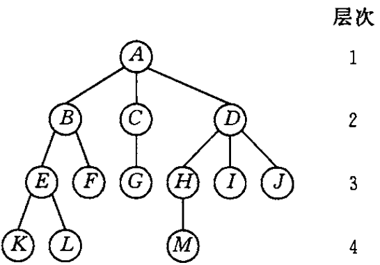

### 二叉树

二叉树（Binary Tree）是另一种树形结构，它的特点是每个节点至多只有两棵子树（即二叉树中不存在度大于2的节点），并且，二叉树的子树有左右之分，其次序不能任意颠倒。

#### 二叉树的性质

- 在二叉树的第i层上至多有2^(i-1)个结点(i>1)
- 深度为k的二叉树的至多有2^k -1个结点（k>1）
- 对任何一棵二叉树T，如果其终端结点数为N0，度为2的结点数N2，则N0 = N2 + 1；


# 八：Spring


## 网络基础

TODO

## Servlet

servlet是java web应用开发的核心组件，也是实现springweb mvc的基础，更好的理解servlet，有助于我们更好的理解springweb mvc。

### Servlet API介绍

Servlet API有4个包，如下：

- javax.servlet ：包含定义了Servlet与Servlet容器之间签约的类和接口。
- javax.servlet.http : 包含定义了HttpServlet与与Servlet容器之间签约的类和接口。
- javax.servlet.annotation ：包含对Servlet、Filter和Listener进行标注的注解。即Servlet3.0的注解配置。
- javax.servlet.descriptor:包含为Web应用的配置信息提供编程式访问的类型。


**下面放一张完整的类图(一图胜千言)**：   

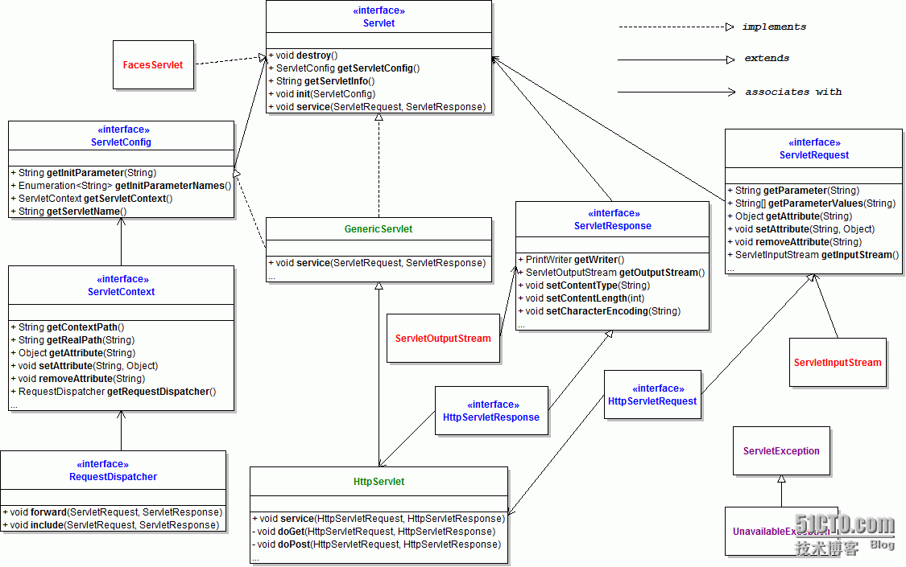


#### Servlet各个接口介绍

##### Servlet接口

```java
/**
  *  在Servlet接口中定义了5个方法，其中3个方法都是由Servlet容器来调用的，容器会在Servlet的生命周期的不同阶段调用特定的方法
  **/
public interface Servlet {
    //负责初始化Servlet对象，容器在创建好Servlet对象后，就会调用该方法
    public void init(ServletConfig config) throws ServletException;
    // 返回init方法中传入的ServletConfig，ServletConfig应该被保存在servlet实现类中的类级变量中。
    public ServletConfig getServletConfig();

    //负责相应客户的请求，为客户提供相应服务。当容器接受到客户端要求访问特定Servlet对象的请求时，就会调用该Servlet对象的service()方法
    public void service(ServletRequest req, ServletResponse res) throws ServletException, IOException;		
	// 返回Servlet信息，例如作者、版本等，注意此方法应该返回的是纯文本，而不是任何标记语言。
    public String getServletInfo();
    
    //负责释放Servlet对象占用的资源。当Servlet对象结束声明周期时，容器会调用此方法；
    public void destroy();
}
```

##### GenericServlet接口

GenericServlet抽象类为Servlet接口提供了通用实现，它与任何网络应用层协议无关。

GenericServlet除了实现了Servlet接口，还实现了ServletConfig接口和Serializable接口。

```java
public abstract class GenericServlet implements Servlet, ServletConfig, java.io.Serializable {
    private static final String LSTRING_FILE = "javax.servlet.LocalStrings";
    private static ResourceBundle lStrings = ResourceBundle.getBundle(LSTRING_FILE);
    private transient ServletConfig config;
    // 空构造函数
    public GenericServlet() { }
    // 空实现
    public void destroy() {
    }
    
    public String getInitParameter(String name) {
        ServletConfig sc = getServletConfig();
        if (sc == null) {
            throw new IllegalStateException(lStrings.getString("err.servlet_config_not_initialized"));
        }
        return sc.getInitParameter(name);
    }

    public Enumeration<String> getInitParameterNames() {
        ServletConfig sc = getServletConfig();
        if (sc == null) {
            throw new IllegalStateException(lStrings.getString("err.servlet_config_not_initialized"));
        }
        return sc.getInitParameterNames();
    }   
   
    public ServletConfig getServletConfig() {
		return config;
    }

    public ServletContext getServletContext() {
        ServletConfig sc = getServletConfig();
        if (sc == null) {
            throw new IllegalStateException( lStrings.getString("err.servlet_config_not_initialized"));
        }
        return sc.getServletContext();
    }
   
    public String getServletInfo() {
		return "";
    }
    
	// 初始化方法
    public void init(ServletConfig config) throws ServletException {
		this.config = config;
		this.init();
    }

    public void init() throws ServletException {
		// 不带参数的init方法，方便子类实现
    }
    // 抽象方法， 子类必须实现
    public abstract void service(ServletRequest req, ServletResponse res) throws ServletException, IOException;
    
    public String getServletName() {
        ServletConfig sc = getServletConfig();
        if (sc == null) {
            throw new IllegalStateException(lStrings.getString("err.servlet_config_not_initialized"));
        }
        return sc.getServletName();
    }
}
```

##### HttpServlet抽象类

HttpServlet类是GenericServlet类的子类。HttpServlet类为Serlvet接口提供了与HTTP协议相关的通用实现，也就是说，HttpServlet对象适合运行在与客户端采用HTTP协议通信的Servlet容器或者Web容器中。

在我们自己开发的Java Web应用中，自定义的Servlet类一般都扩展自HttpServlet类。

HttpServlet类实现了Servlet接口中的service(ServletRequest , ServletResponse)方法，而该方法实际调用的是它的重载方法HttpServlet.service(HttpServletRequest, HttpServletResponse)；

在上面的重载service()方法中，首先调用HttpServletRequest类型的参数的getMethod()方法，获得客户端的请求方法，然后根据该请求方式来调用匹配的服务方法；如果为GET方式，则调用doGet()方法，如果为POST方式，则调用doPost()方法。

HttpServlet类为所有的请求方式，提供了默认的实现doGet(),doPost(),doPut(),doDelete()方法；这些方法的默认实现都会向客户端返回一个错误。

对于HttpServlet类的具体子类，一般会针对客户端的特定请求方法，覆盖HttpServlet类中的相应的doXXX方法。如果客户端按照GET或POST方式请求访问HttpsServlet，并且这两种方法下，HttpServlet提供相同的服务，那么可以只实现doGet()方法，并且让doPost()方法调用doGet()方法。

##### ServletRequest接口

ServletRequest表示来自客户端的请求；当Servlet容器接收到客户端要求访问特定Servlet的请求时，容器先解析客户端的原始请求数据，把它包装成一个ServletRequest对象。

ServletRequest接口提供了一系列用于读取客户端的请求数据的方法，例如：

```java
getContentLength() —— 返回请求正文的长度，如果请求正文的长度未知，则返回-1；
getContentType() —— 获得请求正文的MIME类型，如果请求正文的类型为止，则返回null；
getInputStream() —— 返回用于读取请求正文的输入流；
getLocalAddr() —— 返回服务端的IP地址；
getLocalName() —— 返回服务端的主机名；
getLocalPort() —— 返回服务端的端口号；
getParameters() —— 根据给定的请求参数名，返回来自客户请求中的匹配的请求参数值；
getProtocal() —— 返回客户端与服务器端通信所用的协议名称及版本号；
getReader() —— 返回用于读取字符串形式的请求正文的BufferReader对象；
getRemoteAddr() —— 返回客户端的IP地址
getRemoteHost() —— 返回客户端的主机名
getRemotePort() —— 返回客户端的端口号
```

##### HttpServletRequest接口

HttpServletRequest接口是ServletRequest接口的子接口。

HttpServletRequest接口提供了用于读取HTTP请求中的相关信息的方法：

```java
getContextPath() —— 返回客户端请求方法的Web应用的URL入口，例如，如果客户端访问的URL为http://localhost:8080/helloapp/info，那么该方法返回“/helloapp”;
getCookies() —— 返回HTTP请求中的所有Cookie；
getHeader(String name) —— 返回HTTP请求头部的特定项；
getHeaderName() —— 返回一个Enumeration对象，它包含了HTTP请求头部的所有项目名；
getMethod() —— 返回HTTP请求方式；
getRequestURL() —— 返回HTTP请求的头部的第一行中的URL；
getQueryString() —— 返回HTTP请求中的查询字符串，即URL中的“？”后面的内容；
```

##### ServletResponse接口

Servlet通过ServletResponse对象来生成响应结果。

ServletResponse接口定义了一系列与生成响应结果相关的方法，例如：

```java
setCharacterEncoding() —— 设置相应正文的字符编码。响应正文的默认字符编码为ISO-8859-1；
setContentLength() —— 设置响应正文的长度；
setContentType() —— 设置响应正文的MIME类型；
getCharacterEncoding() —— 获得响应正文的字符编码
getContentType() —— 获得响应正文的MIME类型
setBufferSize() —— 设置用于存放响应正文数据的缓冲区的大小
getBufferSize() —— 获得用于存放响应正文数据的缓冲区的大小；
reset() —— 清空缓冲区内的正文数据，并且清空响应状态代码及响应头
resetBuffer() —— 仅仅清空缓冲区的正文数据，不清空响应状态代码及响应头；
flushBuffer() —— 强制性地把缓冲区内的响应正文数据发送到客户端；
isCommitted() —— 返回一个boolean类型的值，如果为true，表示缓冲区内的数据已经提交给客户，即数据已经发送到客户端；
getOutputStream() —— 返回一个ServletOutputStream对象，Servlet用它来输出二进制的正文数据；
getWriter() —— 返回一个PrinterWriter对象，Servlet用它来输出字符串形式的正文数据；
```

ServletResponse中响应正文的默认MIME类型是text/plain,即纯文本类型，而HttpServletResponse中响应正文的默认MIME类型为text/html，即HTML文档类型。

为了提高输出数据的效率，ServletOutputStream和PrintWriter首先把数据写到缓冲区内。当缓冲区内的数据被提交给客户后，ServletResponse的isComitted方法返回true。在以下几种情况下，缓冲区内的数据会被提交给客户，即数据被发送到客户端：

当缓冲区内的数据已满时，ServletOutPutStream或PrintWriter会自动把缓冲区内的数据发送给客户端，并且清空缓冲区；
Servlet调用ServletResponse对象的flushBuffer方法；
Servlet调用ServletOutputStream或PrintWriter对象的flush方法或close方法；
为了确保SerlvetOutputStream或PrintWriter输出的所有数据都会被提交给客户，比较安全的做法是在所有数据都输出完毕后，调用ServletOutputStream或PrintWriter的close()方法（Tomcat中，会自动关闭）。

如果要设置响应正文的MIME类型和字符编码，必须先调用ServletResponse对象的setContentType()和setCharacterEncoding()方法，然后再调用ServletResponse的getOutputStream()或getWriter()方法，提交缓冲区内的正文数据；只有满足这样的操作顺序，所做的设置才能生效。

##### HttpServletResponse接口

HttpServletResponse接口提供了与HTTP协议相关的一些方法，Servlet可通过这些方法来设置HTTP响应头或向客户端写Cookie。

```
addHeader() —— 向HTTP响应头中加入一项内容
sendError() —— 向客户端发送一个代表特定错误的HTTP响应状态代码
setHeader() —— 设置HTTP响应头中的一项内容，如果在响应头中已经存在这项内容，则原来的设置被覆盖
setStatus() —— 设置HTTP响应的状态代码
addCookie() —— 向HTTP响应中加入一个Cookie
```

在HttpServletResponse接口中定义了一些代表HTTP响应状态代码的静态常量。

##### ServletConfig接口

Servlet容器初始化Servlet时会向init方法传入一个ServletConfig实例封装了@WebServlet或者xml文件传递给Servlet的配置信息，初始参数为key-vealue形式存储在HashMap中。

ServletConfig接口中定义了以下方法：

```
getInitParameter(String name) —— 返回匹配的初始化参数值
getInitParameterNames() —— 返回一个Enumeration对象，里面包含了所有的初始化参数名
getServletContext() —— 返回一个ServletContext对象
getServletName() —— 返回Servlet的名字，即web.xml文件中相应<servlet>元素的<servlet-name>子元素的值；如果没有为servlet配置<servlet-name>子元素，则返回Servlet类的名字
```

HttpServlet类继承了GenericServlet类，而GenericServlet类实现了ServletConfig接口，因此HttpServlet或GenericServlet类及子类中都可以直接调用ServletConfig接口中的方法。


##### ServletContext接口

ServletContext是Servlet与Servlet容器之间直接通信的接口。

Servlet容器在启动一个Web应用时，会为它创建一个ServletContext对象。每个Web应用都有唯一的ServletContext对象，可以把ServletContext对象形象地理解为Web应用的总管家，同一个Web应用中的所有Servlet对象都共享一个ServletContext，Servlet对象可以通过其访问容器中的各种资源。

ServletContext接口提供的方法可以分为以下几种类型：

用于在web应用范围内存取共享数据的方法：

```
setAttribute(String name, Object object) —— 把一个Java对象与一个属性名绑定，并存入到ServletContext中；
getAttribute() —— 返回指定数姓名的属性值
getAttributeNames() —— 返回一个Enumeration对象，包含所有存放在ServletContext中的属性名
removeAttributes() —— 从ServletContext中删除匹配的属性
```

访问当前Web应用的资源：

```
getContextPath() —— 返回当前Web应用的URL入口
getInitParameter() —— 返回Web应用范围内的匹配的初始化参数值。在web.xml中，直接在<web-app>根元素下定义的<context-param>元素表示应用范围内的初始化参数
getServletContextName() —— 返回Web应用的名字，即web.xml文件中<display-name>元素的值
getRequestDispatcher() —— 返回一个用于向其他WEB组件转发请求的RequestDispatcher对象
```

访问Servlet容器中的其他WEB应用：

```

```

访问Servlet容器的相关信息：

```

```

访问服务器端的文件系统资源：

```
getRealPath() —— 根据参数指定的虚拟路径，返回文件系统中的一个真实的路径
getResources() —— 返回一个映射到参数指定的路径的URL
getResourceAsStream() —— 返回一个用于读取参数指定的文件的输入流
getMimeType() —— 返回参数指定的文件MIME类型
```

输出日志：

```
log(String msg) —— 向Servlet的日志文件中写日志
log(String message, Throwable throwable) —— 向Servlet的日志文件中写入错误日志，以及异常的堆栈信息
```

##### Servlet相关类的关系


与Servlet主动关联的是三个类，分别是ServletConfig，ServletRequest和ServletResponse。这三个类都是通过容器传递给Servlet的；其中，ServletConfig是在Servlet初始化时传给Servlet的，后两个是在请求到达时调用Servlet传递过来的。

对于Request和Response，以TOMCAT为例，tomcat接到请求首先将会创建org.apache.coyote.Request和org.apache.coyote.Response，这两个类是Tomcat内部使用的描述一次请求和相应的信息类，它们是一个轻量级的类，作用就是在服务器接收到请求后，经过简单解析将这个请求快速分配给后续线程去处理。接下来当交给一个用户线程去处理这个请求时又创建org.apache.catalina.connector.Request和org.apache.catalina.connector.Response对象。这两个对象一直贯穿整个Servlet容器直到要传给Servlet，传给Servlet的是Request和Response的Facade类。

##### Request和Response的转变过程：

当用户从浏览器向服务器发起的一个请求通常会包含如下信息：

http://hostname:port/contextpath/servletpath

hostname和port用来与服务器建立TCP连接，后面的URL用来选择在服务器中哪个子容器服务用户的请求。

在Tomcat7中，这种映射工作由专门的一个类完成：org.apache.tomcat.util.http.mapper，这个类保存了tomcat的container容器中的所有子容器的信息。org.apache.catalina.connector.Request类在进入Container容器之前，Mapper将会根据这次请求的hostname和contextpath将host和context容器设置到Request的mappingData属性中，所以当Request进入container容器之前，对于它要访问哪个子容器就已经确定了。

##### Servlet的实际使用

我们自己定义的servlet通常去继承HttpServlet或GenericServlet类。采用MVC框架的实现中，其基本原理是将所有的请求都映射到一个Servlet，然后去实现servie方法，这个方法也就是MVC框架的入口。


### Servlet 生命周期

在 Java 中，对象的生命周期被定义为该对象从创建直到销毁的整个过程。任何对象都有生命周期，Servlet 也不例外。在学习 Servlet 生命周期之前，我们先来看一下 Servlet 的一些常见方法，这些方法非常重要，它们贯穿着 Servlet 整个生命周期！

#### 与 Servlet 生命周期有关的方法

与 Servlet 生命周期有关的方法一般有以下三个：

##### 1) init() 方法

init() 方法是在创建 Servlet 对象时被调用，而且只能被调用一次，用于 Servlet 对象在整个生命周期内的唯一一次初始化。只有在 init() 方法调用成功后，Servlet 才会处于服务状态，才能够去处理客户端的请求。

##### 2) service() 方法

service() 方法是 Servlet 工作的核心方法。当客户端请求访问 Servlet 时，Servlet 容器就会调用 service() 方法去处理来自客户端的请求，并把处理后的响应返回给客户端。

##### 3) destroy() 方法

destory() 方法是 Servlet 容器回收 Servlet 对象之前调用的，且只会调用一次，而此时的服务器处于停止状态或者访问资源已经被移除。


#### Servlet生命周期总结

一图胜千言：

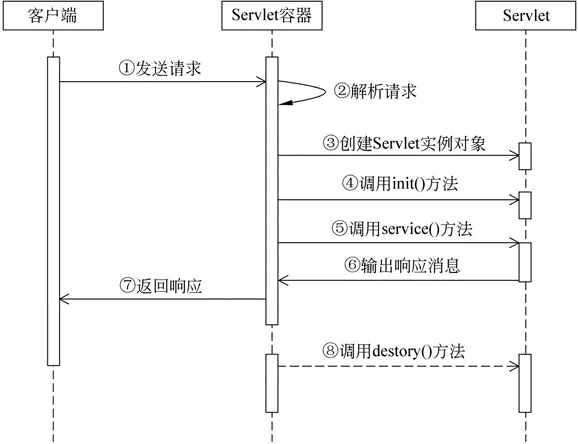


上图描述了 Servlet 的完整生命周期，按照功能的不同，大致可以将 Servlet 的生命周期分为三个阶段，分别是初始化阶段、运行阶段和销毁阶段。

##### 1) 初始化阶段

当用户第一次向 Servlet 容器发出 HTTP 请求要求访问某个 Servlet 时，Servlet 容器会在整个容器中搜索该 Servlet 对象，发现这个 Servlet 对象没有被实例化，于是创建这个 Servlet 对象，然后调用该对象的 init() 方法完成初始化。

当用户第二次访问这个 Servlet 时，Servlet 容器仍然在容器中搜索该 Servlet 对象，结果找到了该对象的实例，则不去创建而直接使用该对象。

找到了对应的 Servlet 对象，随后 Servlet 进入到运行阶段。

需要注意的是，在 Servlet 的整个生命周期内，它的 init() 方法只被调用一次。

##### 2) 运行阶段

这是 Servlet 生命周期中最核心的阶段。在该阶段中，Servlet 容器会为当前的请求创建一个 ServletRequest 对象和一个 ServletResponse 对象（它们分别代表 HTTP 请求和 HTTP 响应），并将这两个对象作为参数传递给 Servlet 的 service() 方法。service() 方法从 ServletRequest 对象中获得用户的详细请求信息并处理该请求，通过 ServletResponse 对象生成响应结果。

需要强调的是，在 Servlet 的整个生命周期内，用户每次请求访问 Servlet 时，Servlet 容器都会调用一次 Servlet 的 service() 方法，并且创建新的 ServletRequest 和 ServletResponse 对象。

##### 3) 销毁阶段

当服务器停止时，Servlet 容器需要回收 Servlet 对象所占用的内存，在回收之前，会自动调用该对象的 destroy() 方法做好回收内存前的准备，辟如关闭后台线程。和 init() 方法类似，destroy() 方法也只会被调用一次。


> 注意：Servlet 对象一旦创建就会驻留在内存中一直等待客户端的访问，直到服务器关闭或项目被移除出容器时，Servlet 对象才会被销毁。


##### 总结

对 Servlet 声明周期的几点汇总：

1. Servlet 对象被创建之后执行 init() 方法，并且 init() 方法只执行一次，其主要目的是完成 Servlet 对象的初始化工作。
2. 对于 Servlet 对象的 service() 方法，只要用户请求一次，那么 service() 方法就执行一次。
3. Servlet 对象被回收之前，destroy() 方法会被调用，该方法只执行一次，执行的时候 Servlet 对象还在。

Servlet 对象的创建、对象提供服务、对象的销毁等操作皆由 Servlet 容器来管理，Java 程序员的任务只是负责编写 Servlet 类，无法干涉 Servlet 对象的生命周期。

### Servlet 注解总结


## Spring 配置文件解析


## Spring Bean 实例化


## Spring 的后置处理器


## Spring AOP 实现


## Spring 事物

事物：逻辑上的一组操作，组成这组操作的各个逻辑单元。要么一起成功，要么一起失败。

### 事物特性

原子性 （atomicity）:强调事务的不可分割.

一致性 （consistency）:事务的执行的前后数据的完整性保持一致.

隔离性 （isolation）:一个事务执行的过程中,不应该受到其他事务的干扰

持久性（durability） :事务一旦结束,数据就持久到数据库


### 存在的问题

**脏读:** 指当一个事务正在访问数据，并且对数据进行了修改，而这种修改还没有提交到数据库中，这时，另外一个事务也访问这个数据，然后使用了这个数据。因为这个数据是还没有提交的数据， 那么另外一个事务读到的这个数据是脏数据，依据脏数据所做的操作可能是不正确的。

**不可重复读:** 指在一个事务内，多次读同一数据。在这个事务还没有结束时，另外一个事务也访问该同一数据。那么，在第一个事务中的两次读数据之间，由于第二个事务的修改，那么第一个事务两次读到的数据可能是不一样的。这样就发生了在一个事务内两次读到的数据是不一样的，因此称为是不可重复读。

**幻读:** 指当事务不是独立执行时发生的一种现象，例如第一个事务对一个表中的数据进行了修改，这种修改涉及到表中的全部数据行。同时，第二个事务也修改这个表中的数据，这种修改是向表中插入一行新数据。那么，以后就会发生操作第一个事务的用户发现表中还有没有修改的数据行，就好象发生了幻觉一样。

### 如何解决

事物的隔离级别

| 隔离级别                    | 解决的问题             | 未解决的问题           |
| --------------------------- | ---------------------- | ---------------------- |
| 读未提交（READ UNCOMMITED） |                        | 脏读、不可重复读、幻读 |
| 读以提交（READ COMMITED）   | 脏读                   | 不可重复读、幻读       |
| 可重复读（REPEATABLE READ） | 脏读、不可重复读       | 幻读                   |
| 串行化（SERIALIZABLE）      | 脏读、不可重复读、幻读 |                        |

Mysql默认使用可重复读

Oracle默认使用读以提交

### Spring的事物传播机制

| 传播行为                  | 描述                                           |
| ------------------------- | ---------------------------------------------- |
| PROPAGATION_REQUIRED      | 支持当前事务，如果不存在 就新建一个(默认)      |
| PROPAGATION_SUPPORTS      | 支持当前事务，如果不存在，就不使用事务         |
| PROPAGATION_MANDATORY     | 支持当前事务，如果不存在，抛出异常             |
| PROPAGATION_REQUIRES_NEW  | 如果有事务存在，挂起当前事务，创建一个新的事务 |
| PROPAGATION_NOT_SUPPORTED | 以非事务方式运行，如果有事务存在，挂起当前事务 |
| PROPAGATION_NEVER         | 以非事务方式运行，如果有事务存在，抛出异常     |
| PROPAGATION_NESTED        | 如果当前事务存在，则嵌套事务执行               |


## Spring  待整理

#### Spring的扩展组件


##### BeanFactoryPostProcessor 总结

###### ConfigurationClassPostProcessor 总结

​		


##### BeanPostProcessor 总结


###### ServletContextAwareProcessor

很简单的一个postProcessor，主要是对实现了ServletContextAware和ServletConfigAware接口的bean设置servletContext和servletConfig

实现代码：

```java
@Override
public Object postProcessBeforeInitialization(Object bean, String beanName) throws BeansException {
    if (getServletContext() != null && bean instanceof ServletContextAware) {
        ((ServletContextAware) bean).setServletContext(getServletContext());
    }
    if (getServletConfig() != null && bean instanceof ServletConfigAware) {
        ((ServletConfigAware) bean).setServletConfig(getServletConfig());
    }
    return bean;
}
```


##### TODO 为什么会有SmartInitializingSingleton这个组件


[Spring Boot小组件 - SmartInitializingSingleton - 沐魇 - 博客园 (cnblogs.com)](https://www.cnblogs.com/imyijie/p/12702617.html)


# 十二： 消息队列

## Kafka

### Kafka 入门介绍

一个流处理平台，应该具备三个关键能力：

- 发布和订阅消息（流）， 在这方面，他类似一个消息队列
- 以容错（故障转移）的方式处理存储消息（流）
- 在消息发生是处理他们


kafka作为一个流处理平台，主要应用于两大类场景：

- 构建实时的数据流管道，可靠的获取系统和应用程序之间的数据
- 构建实时流的应用程序，对数据流进行转换或反应

#### 几个概念

1. kafka作为一个集群运行在一个或多个服务器上
2. kafka集群存储的消息时以topic为类别记录
3. 每个消息时有一个key，一个value和时间戳构成。

#### kafka的四个核心API

- 应用程序使用Producer API发布一个消息到1个或对个topic中

- 应用程序使用Consumer API来订阅一个或多个topic，并处理产生的消息

- 应用程序使用 Streams API 充当一个流处理器，从1个或多个topic消费输入流，并生产一个输出流到1个或多个输出topic，有效地将输入流转换到输出流。

- Connector API可构建或运行可重用的生产者或消费者，将topic连接到现有的应用程序或数据系统。例如，连接到关系数据库的连接器可以捕获表的每个变更。

  

Client和Server之间的通讯，是通过一条简单、高性能并且和开发语言无关的[TCP协议](/fwd?link=https://kafka.apache.org/protocol.html)。并且该协议保持与老版本的兼容。Kafka提供了Java Client（客户端）。除了Java客户端外，还有非常多的[其它编程语言的客户端](/fwd?link=https://cwiki.apache.org/confluence/display/KAFKA/Clients)。

#### kafka的基本术语

##### Topic

Kafka将消息分门别类，每一类的消息称之为一个主题（Topic）。

##### Producer

发布消息的对象称之为主题生产者（Kafka topic producer）

##### Consumer

订阅消息并处理发布的消息的对象称之为主题消费者（consumers）

##### Broker

已发布的消息保存在一组服务器中，称之为Kafka集群。集群中的每一个服务器都是一个代理（Broker）。 消费者可以订阅一个或多个主题（topic），并从Broker拉数据，从而消费这些已发布的消息。

#### 日志和主题

让我们更深入的了解Kafka中的Topic。

Topic是发布的消息的类别名，一个topic可以有零个，一个或多个消费者订阅该主题的消息。

对于每个topic，Kafka集群都会维护一个分区log，就像下图中所示：


每一个分区都是一个顺序的、不可变的消息队列， 并且可以持续的添加。分区中的消息都被分了一个序列号，称之为偏移量(offset)，在每个分区中此偏移量都是唯一的。

Kafka集群保持所有的消息，直到它们过期（无论消息是否被消费）。实际上消费者所持有的仅有的元数据就是这个offset（偏移量），也就是说offset由消费者来控制：正常情况当消费者消费消息的时候，偏移量也线性的的增加。但是实际偏移量由消费者控制，消费者可以将偏移量重置为更早的位置，重新读取消息。可以看到这种设计对消费者来说操作自如，一个消费者的操作不会影响其它消费者对此log的处理。


再说说分区。Kafka中采用分区的设计有几个目的。一是可以处理更多的消息，不受单台服务器的限制。Topic拥有多个分区意味着它可以不受限的处理更多的数据。第二，分区可以作为并行处理的单元，稍后会谈到这一点。

#### 分布式(Distribution)

Log的分区被分布到集群中的多个服务器上。每个服务器处理它分到的分区。 根据配置每个分区还可以复制到其它服务器作为备份容错。 每个分区有一个leader，零或多个follower。Leader处理此分区的所有的读写请求，而follower被动的复制数据。如果leader宕机，其它的一个follower会被推举为新的leader。 一台服务器可能同时是一个分区的leader，另一个分区的follower。 这样可以平衡负载，避免所有的请求都只让一台或者某几台服务器处理。

#### Geo-Replication(异地数据同步技术)

Kafka MirrorMaker为群集提供`geo-replication`支持。借助`MirrorMaker`，消息可以跨多个数据中心或云区域进行复制。 您可以在active/passive场景中用于备份和恢复; 或者在active/passive方案中将数据置于更接近用户的位置，或数据本地化。

#### 生产者(Producers)

生产者往某个Topic上发布消息。生产者也负责选择发布到Topic上的哪一个分区。最简单的方式从分区列表中轮流选择。也可以根据某种算法依照权重选择分区。开发者负责如何选择分区的算法。

#### 消费者(Consumers)

通常来讲，消息模型可以分为两种， 队列和发布-订阅式。 队列的处理方式是 一组消费者从服务器读取消息，一条消息只有其中的一个消费者来处理。在发布-订阅模型中，消息被广播给所有的消费者，接收到消息的消费者都可以处理此消息。Kafka为这两种模型提供了单一的消费者抽象模型： 消费者组 （consumer group）。 消费者用一个消费者组名标记自己。 一个发布在Topic上消息被分发给此消费者组中的一个消费者。 假如所有的消费者都在一个组中，那么这就变成了queue模型。 假如所有的消费者都在不同的组中，那么就完全变成了发布-订阅模型。 更通用的， 我们可以创建一些消费者组作为逻辑上的订阅者。每个组包含数目不等的消费者， 一个组内多个消费者可以用来扩展性能和容错。正如下图所示：


2个kafka集群托管4个分区（P0-P3），2个消费者组，消费组A有2个消费者实例，消费组B有4个。

正像传统的消息系统一样，Kafka保证消息的顺序不变。 再详细扯几句。传统的队列模型保持消息，并且保证它们的先后顺序不变。但是， 尽管服务器保证了消息的顺序，消息还是异步的发送给各个消费者，消费者收到消息的先后顺序不能保证了。这也意味着并行消费将不能保证消息的先后顺序。用过传统的消息系统的同学肯定清楚，消息的顺序处理很让人头痛。如果只让一个消费者处理消息，又违背了并行处理的初衷。 在这一点上Kafka做的更好，尽管并没有完全解决上述问题。 Kafka采用了一种分而治之的策略：分区。 因为Topic分区中消息只能由消费者组中的唯一一个消费者处理，所以消息肯定是按照先后顺序进行处理的。但是它也仅仅是保证Topic的一个分区顺序处理，不能保证跨分区的消息先后处理顺序。 所以，如果你想要顺序的处理Topic的所有消息，那就只提供一个分区。

#### Kafka的保证(Guarantees)

- 生产者发送到一个特定的Topic的分区上，消息将会按照它们发送的顺序依次加入，也就是说，如果一个消息M1和M2使用相同的producer发送，M1先发送，那么M1将比M2的offset低，并且优先的出现在日志中。
- 消费者收到的消息也是此顺序。
- 如果一个Topic配置了复制因子（replication factor）为N， 那么可以允许N-1服务器宕机而不丢失任何已经提交（committed）的消息。

#### kafka作为一个消息系统

##### Kafka的流与传统企业消息系统相比的概念如何？

传统的消息有两种模式：`队列`和`发布订阅`。 在队列模式中，消费者池从服务器读取消息（每个消息只被其中一个读取）; 发布订阅模式：消息广播给所有的消费者。这两种模式都有优缺点，队列的优点是允许多个消费者瓜分处理数据，这样可以扩展处理。但是，队列不像多个订阅者，一旦消息者进程读取后故障了，那么消息就丢了。而`发布和订阅`允许你广播数据到多个消费者，由于每个订阅者都订阅了消息，所以没办法缩放处理。

kafka中消费者组有两个概念：`队列`：消费者组（consumer group）允许同名的消费者组成员瓜分处理。`发布订阅`：允许你广播消息给多个消费者组（不同名）。

kafka的每个topic都具有这两种模式。

##### kafka有比传统的消息系统更强的顺序保证。

传统的消息系统按顺序保存数据，如果多个消费者从队列消费，则服务器按存储的顺序发送消息，但是，尽管服务器按顺序发送，消息异步传递到消费者，因此消息可能乱序到达消费者。这意味着消息存在并行消费的情况，顺序就无法保证。消息系统常常通过仅设1个消费者来解决这个问题，但是这意味着没用到并行处理。

kafka做的更好。通过并行topic的parition —— kafka提供了顺序保证和负载均衡。每个partition仅由同一个消费者组中的一个消费者消费到。并确保消费者是该partition的唯一消费者，并按顺序消费数据。每个topic有多个分区，则需要对多个消费者做负载均衡，但请注意，`相同的消费者组中不能有比分区更多的消费者，否则多出的消费者一直处于空等待，不会收到消息`。

#### kafka作为一个存储系统

所有发布消息到`消息队列`和消费分离的系统，实际上都充当了一个存储系统（发布的消息先存储起来）。Kafka比别的系统的优势是它是一个非常高性能的`存储系统`。

写入到kafka的数据将写到磁盘并复制到集群中保证容错性。并允许生产者等待消息应答，直到消息完全写入。

kafka的磁盘结构 - 无论你服务器上有50KB或50TB，执行是相同的。

client来控制读取数据的位置。你还可以认为kafka是一种专用于高性能，低延迟，提交日志存储，复制，和传播特殊用途的`分布式文件系统`。

#### kafka的流处理

仅仅读，写和存储是不够的，kafka的目标是实时的流处理。

在kafka中，流处理持续获取`输入topic`的数据，进行处理加工，然后写入`输出topic`。例如，一个零售APP，接收销售和出货的`输入流`，统计数量或调整价格后输出。

可以直接使用producer和consumer API进行简单的处理。对于复杂的转换，Kafka提供了更强大的Streams API。可构建`聚合计算`或`连接流到一起`的复杂应用程序。

助于解决此类应用面临的硬性问题：处理无序的数据，代码更改的再处理，执行状态计算等。

Streams API在Kafka中的核心：使用producer和consumer API作为输入，利用Kafka做状态存储，使用相同的组机制在stream处理器实例之间进行容错保障。

#### 拼在一起

消息传递，存储和流处理的组合看似反常，但对于Kafka作为流式处理平台的作用至关重要。

像HDFS这样的分布式文件系统允许存储静态文件来进行批处理。这样系统可以有效地存储和处理来自过去的历史数据。

传统企业的消息系统允许在你订阅之后处理未来的消息：在未来数据到达时处理它。

Kafka结合了这两种能力，这种组合对于kafka作为流处理应用和流数据管道平台是至关重要的。

批处理以及消息驱动应用程序的流处理的概念：通过组合存储和低延迟订阅，流处理应用可以用相同的方式对待过去和未来的数据。它是一个单一的应用程序，它可以处理历史的存储数据，当它处理到最后一个消息时，它进入等待未来的数据到达，而不是结束。

同样，对于流数据管道（pipeline），订阅实时事件的组合使得可以将Kafka用于非常低延迟的管道；但是，可靠地存储数据的能力使得它可以将其用于必须保证传递的关键数据，或与仅定期加载数据或长时间维护的离线系统集成在一起。流处理可以在数据到达时转换它。


### Kafka的消息模型

#### JMS协议(ActiveMQ)

Java消息服务（Java Message Service，JMS）应用程序接口是一个Java平台中关于面向消息中间件的API，用于在两个应用程序之间，或分布式系统中发送消息，进行异步通信。

点对点与发布订阅最初是由JMS定义的。这两种模式主要区别或解决的问题就是发送到队列的消息能否重复消费(多订阅)。

JMS规范目前支持两种消息模型：点对点（point to point， queue）和发布/订阅（publish/subscribe，topic）。

##### 点对点

消息生产者生产消息发送到queue中，然后消息消费者从queue中取出并且消费消息。这里要注意：

1. 消息被消费以后，queue中不再有存储，所以消息消费者不可能消费到已经被消费的消息。
2. Queue支持存在多个消费者，但是对一个消息而言，只会有一个消费者可以消费。


生产者发送一条消息到queue，只有一个消费者能收到。

##### 发布订阅

消息生产者（发布）将消息发布到topic中，同时有多个消息消费者（订阅）消费该消息。和点对点方式不同，发布到topic的消息会被所有订阅者消费。


发布者发送到topic的消息，订阅了topic的所有订阅者都会收到消息。


#### AQMP协议(RabbitMQ)

RabbitMQ实现了AQMP协议，AQMP协议定义了消息路由规则和方式。生产端通过路由规则发送消息到不同queue，消费端根据queue名称消费消息。此外RabbitMQ是向消费端推送消息，订阅关系和消费状态保存在服务端。

##### 点对点


生产端发送一条消息通过路由投递到Queue，只有一个消费者能消费到。

##### 发布/订阅


当RabbitMQ需要支持多订阅时，发布者发送的消息通过路由同时写到多个Queue，不同订阅组消费此消息。

RabbitMQ既支持内存队列也支持持久化队列，消费端为推模型，消费状态和订阅关系由服务端负责维护，消息消费完后立即删除，不保留历史消息。所以支持多订阅时，消息会多个拷贝。

#### kafka实现

kafka没有实现JMS协议，但其消费组可以像点对点模型一样让消息被一组进程处理，同时也可以像发布/订阅模式一样，让你发送广播消息到多个消费组。

##### 点对点

当多个消费者同属一个消费组时，对应消息会被同消费组的当个消费组消费使用，类似点对点的消息模型。
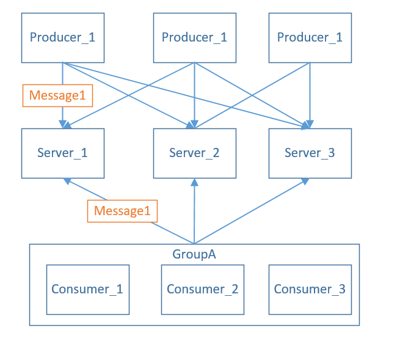

即消息Message1只会被消费组GroupA中的Consumer_1、Consumer_2、Consumer_3消费

##### 发布/订阅

当每个消费者都属于不同的消费组时，对应的消息会被每个消费者消费使用，类似订阅/发布的消息模型。


### Kafka副本同步机制

Kafka中主题的每个Partition有一个预写式日志文件，每个Partition都由一系列有序的、不可变的消息组成，这些消息被连续的追加到Partition中，Partition中的每个消息都有一个连续的序列号叫做offset， 确定它在分区日志中唯一的位置。

两个名词 ： HW（High Watermark） 高水位 ， LEO（log end offset）日志末端位移


Kafka每个topic的partition有N个副本，其中N是topic的复制因子。Kafka通过多副本机制实现故障自动转移，当Kafka集群中一个Broker失效情况下仍然保证服务可用。在Kafka中发生复制时确保partition的预写式日志有序地写到其他节点上。N个replicas中。其中一个replica为leader，其他都为follower，leader处理partition的所有读写请求，与此同时，follower会被动定期地去复制leader上的数据。

如下图所示，Kafka集群中有4个broker, 某topic有3个partition,且复制因子即副本个数也为3：


Kafka提供了数据复制算法保证，如果leader发生故障或挂掉，一个新leader被选举并被接受客户端的消息成功写入。Kafka确保从同步副本列表中选举一个副本为leader，或者说follower追赶leader数据。leader负责维护和跟踪ISR(In-Sync Replicas的缩写，表示副本同步队列，具体可参考下节)中所有follower滞后的状态。当producer发送一条消息到broker后，leader写入消息并复制到所有follower。消息提交之后才被成功复制到所有的同步副本。消息复制延迟受最慢的follower限制，重要的是快速检测慢副本，如果follower“落后”太多或者失效，leader将会把它从ISR中删除。

#### 副本同步队列(ISR)

所谓同步，必须满足如下两个条件：

- 副本节点必须能与zookeeper保持会话（心跳机制）
- 副本能复制leader上的所有写操作，并且不能落后太多。(卡住或滞后的副本控制是由 replica.lag.time.max.ms 配置)

默认情况下Kafka对应的topic的replica数量为1，即每个partition都有一个唯一的leader，为了确保消息的可靠性，通常应用中将其值(由broker的参数offsets.topic.replication.factor指定)大小设置为大于1，比如3。 所有的副本（replicas）统称为Assigned Replicas，即AR。ISR是AR中的一个子集，由leader维护ISR列表，follower从leader同步数据有一些延迟。任意一个超过阈值都会把follower剔除出ISR, 存入OSR（Outof-Sync Replicas）列表，新加入的follower也会先存放在OSR中。AR=ISR+OSR。

上一节中的HW俗称高水位，是HighWatermark的缩写，取一个partition对应的ISR中最小的LEO作为HW，consumer最多只能消费到HW所在的位置。另外每个replica都有HW,leader和follower各自负责更新自己的HW的状态。对于leader新写入的消息，consumer不能立刻消费，leader会等待该消息被所有ISR中的replicas同步后更新HW，此时消息才能被consumer消费。这样就保证了如果leader所在的broker失效，该消息仍然可以从新选举的leader中获取。对于来自内部broKer的读取请求，没有HW的限制。
下图详细的说明了当producer生产消息至broker后，ISR以及HW和LEO的流转过程：


由此可见，Kafka的复制机制既不是完全的同步复制，也不是单纯的异步复制。事实上，同步复制要求所有能工作的follower都复制完，这条消息才会被commit，这种复制方式极大的影响了吞吐率。而异步复制方式下，follower异步的从leader复制数据，数据只要被leader写入log就被认为已经commit，这种情况下如果follower都还没有复制完，落后于leader时，突然leader宕机，则会丢失数据。而Kafka的这种使用ISR的方式则很好的均衡了确保数据不丢失以及吞吐率。

Kafka的ISR的管理最终都会反馈到Zookeeper节点上。具体位置为：/brokers/topics/[topic]/partitions/[partition]/state。目前有两个地方会对这个Zookeeper的节点进行维护：

- Controller来维护：Kafka集群中的其中一个Broker会被选举为Controller，主要负责Partition管理和副本状态管理，也会执行类似于重分配partition之类的管理任务。在符合某些特定条件下，Controller下的LeaderSelector会选举新的leader，ISR和新的leader_epoch及controller_epoch写入Zookeeper的相关节点中。同时发起LeaderAndIsrRequest通知所有的replicas。
- leader来维护：leader有单独的线程定期检测ISR中follower是否脱离ISR, 如果发现ISR变化，则会将新的ISR的信息返回到Zookeeper的相关节点中。

#### 副本不同步的异常情况

- 慢副本：在一定周期时间内follower不能追赶上leader。最常见的原因之一是I / O瓶颈导致follower追加复制消息速度慢于从leader拉取速度。
- 卡住副本：在一定周期时间内follower停止从leader拉取请求。follower replica卡住了是由于GC暂停或follower失效或死亡。
- 新启动副本：当用户给主题增加副本因子时，新的follower不在同步副本列表中，直到他们完全赶上了leader日志。


### Kafka文件存储机制


#### topic中partition存储分布

假设实验环境中Kafka集群只有一个broker，xxx/message-folder为数据文件存储根目录，在Kafka broker中server.properties文件配置(参数log.dirs=xxx/message-folder)，例如创建topic名称分别为test, partitions数量都为partitions=4，副本为1
存储路径和目录规则为：xxx/logs

```x86asm
test-0
test-1
test-2
test-3
```

在Kafka文件存储中，同一个topic下有多个不同的partition，每个partiton为一个目录，partition的名称规则为：topic名称+有序序号，第一个序号从0开始计，最大的序号为partition数量减1，partition是实际物理上的概念，而topic是逻辑上的概念。

#### partition中文件存储方式

下面示意图形象说明了partition中文件存储方式:


- 每个partion(目录)相当于一个巨型文件被平均分配到多个大小相等segment(段)数据文件中。但每个段segment file消息数量不一定相等，这种特性方便old segment file快速被删除。
- 每个partiton只需要支持顺序读写就行了，segment文件生命周期由服务端配置参数决定。

这样做的好处就是能快速删除无用文件，有效提高磁盘利用率。

#### partition中segment文件存储结构

segment文件由两部分组成，分别为“.index”文件和“.log”文件，分别表示为segment索引文件和数据文件。这两个文件的命令规则为：partition全局的第一个segment从0开始，后续每个segment文件名为上一个segment文件最后一条消息的offset值，数值大小为64位，20位数字字符长度，没有数字用0填充。
下面文件列表是笔者在Kafka broker上做的一个实验，创建一个topicXXX包含1 partition，设置每个segment大小为500MB,并启动producer向Kafka broker写入大量数据,如下图所示segment文件列表形象说明了上述2个规则：


以上述图2一对segment file文件为例，说明segment中index<—->data file对应关系物理结构如下：


上述图3索引文件存储大量元数据，数据文件存储大量消息，索引文件中元数据指向对应数据文件中message的物理偏移地址。
其中以索引文件中元数据3,497为例，依次在数据文件中表示第3个message(在全局partiton表示第368772个message)、以及该消息的物理偏移地址为497。

从上图了解到segment data file由许多message组成，下面详细说明message物理结构如下：


相关字段含义对应如下：


#### 通过offset查找message

例如读取offset=368776的message，需要通过下面2个步骤查找。

- 第一步查找segment file
  上图为例，其中00000000000000000000.index表示最开始的文件，起始偏移量(offset)为0.第二个文件00000000000000368769.index的消息量起始偏移量为368770 = 368769 + 1.同样，第三个文件00000000000000737337.index的起始偏移量为737338=737337 + 1，其他后续文件依次类推，以起始偏移量命名并排序这些文件，只要根据offset二分查找文件列表，就可以快速定位到具体文件。
  当offset=368776时定位到00000000000000368769.index|log
- 第二步通过segment file查找message
  通过第一步定位到segment file，当offset=368776时，依次定位到00000000000000368769.index的元数据物理位置和00000000000000368769.log的物理偏移地址，然后再通过00000000000000368769.log顺序查找直到offset=368776为止。

从上图可知这样做的优点，segment index file采取稀疏索引存储方式，它减少索引文件大小，通过mmap可以直接内存操作，稀疏索引为数据文件的每个对应message设置一个元数据指针,它比稠密索引节省了更多的存储空间，但查找起来需要消耗更多的时间。

Kafka高效文件存储设计特点

- Kafka把topic中一个parition大文件分成多个小文件段，通过多个小文件段，就容易定期清除或删除已经消费完文件，减少磁盘占用。
- 通过索引信息可以快速定位message和确定response的最大大小。
- 通过index元数据全部映射到memory，可以避免segment file的IO磁盘操作。
- 通过索引文件稀疏存储，可以大幅降低index文件元数据占用空间大小。


### kafka数据可靠性和一致性保证

当producer向leader发送数据时，可以通过`request.required.acks`参数来设置数据可靠性的级别：

- 1（默认）：这意味着producer在ISR中的leader已成功收到的数据并得到确认后发送下一条message。如果leader宕机了，则会丢失数据。
- 0：这意味着producer无需等待来自broker的确认而继续发送下一批消息。这种情况下数据传输效率最高，但是数据可靠性确是最低的。
- -1：producer需要等待ISR中的所有follower都确认接收到数据后才算一次发送完成，可靠性最高。但是这样也不能保证数据不丢失，比如当ISR中只有leader时（前面ISR那一节讲到，ISR中的成员由于某些情况会增加也会减少，最少就只剩一个leader），这样就变成了acks=1的情况。

如果要提高数据的可靠性，在设置`request.required.acks=-1`的同时，也要`min.insync.replicas`这个参数(可以在broker或者topic层面进行设置)的配合，这样才能发挥最大的功效。`min.insync.replicas`这个参数设定ISR中的最小副本数是多少，默认值为1，当且仅当`request.required.acks`参数设置为-1时，此参数才生效。如果ISR中的副本数少于`min.insync.replicas`配置的数量时，客户端会返回异常：`org.apache.kafka.common.errors.NotEnoughReplicasExceptoin: Messages are rejected since there are fewer in-sync replicas than required`。

接下来对acks=1和-1的两种情况进行详细分析。

**request.required.acks=1**

producer发送数据到leader，leader写本地日志成功，返回客户端成功；此时ISR中的副本还没有来得及拉取该消息，leader就宕机了，那么此次发送的消息就会丢失。
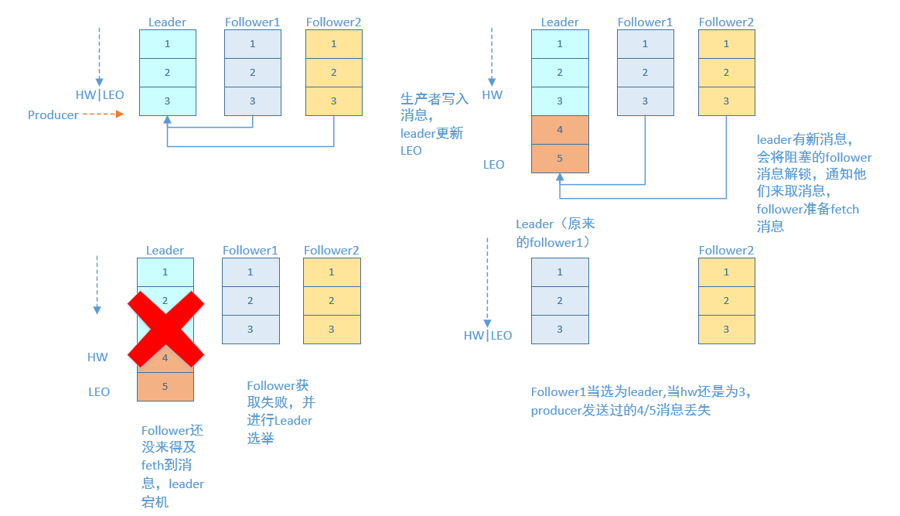

**request.required.acks=-1**

同步（Kafka默认为同步，即producer.type=sync）的发送模式，replication.factor>=2且min.insync.replicas>=2的情况下，不会丢失数据。

有两种典型情况，一种是follower完全同步，一种是follower部分同步
acks=-1的情况下（如无特殊说明，以下acks都表示为参数request.required.acks），数据发送到leader, ISR的follower全部完成数据同步后，leader此时挂掉，那么会选举出新的leader，数据不会丢失。
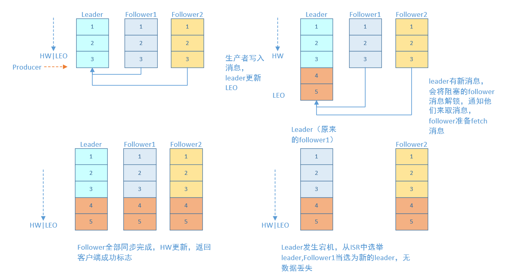

acks=-1的情况下，数据发送到leader后 ，部分ISR的副本同步，leader此时挂掉。比如follower1h和follower2都有可能变成新的leader, producer端会得到返回异常，producer端会重新发送数据，数据可能会重复。

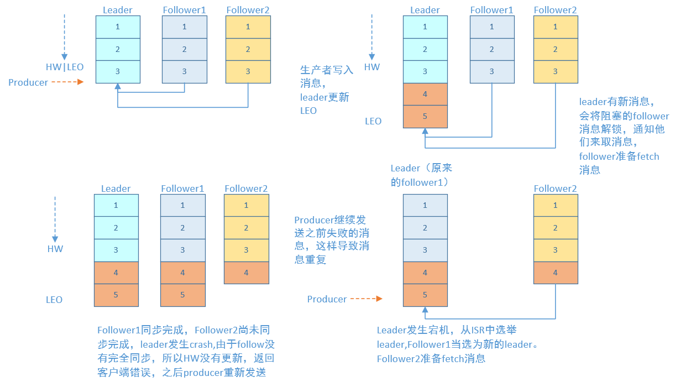

当然上图中如果在leader crash的时候，follower2还没有同步到任何数据，而且follower2被选举为新的leader的话，这样消息就不会重复。

**HW深入讨论**
考虑上图（即acks=-1,部分ISR副本同步）中的另一种情况，如果在Leader挂掉的时候，follower1同步了消息4,5，follower2同步了消息4，与此同时follower2被选举为leader，那么此时follower1中的多出的消息5该做如何处理呢？

这里就需要HW的协同配合了。如前所述，一个partition中的ISR列表中，leader的HW是所有ISR列表里副本中最小的那个的LEO。类似于木桶原理，水位取决于最低那块短板。
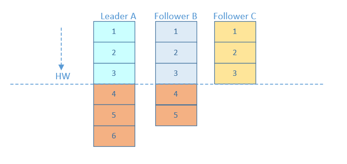

如上图，某个topic的某partition有三个副本，分别为A、B、C。A作为leader肯定是LEO最高，B紧随其后，C机器由于配置比较低，网络比较差，故而同步最慢。这个时候A机器宕机，这时候如果B成为leader，假如没有HW，在A重新恢复之后会做同步(makeFollower)操作，在宕机时log文件之后直接做追加操作，而假如B的LEO已经达到了A的LEO，会产生数据不一致的情况，所以使用HW来避免这种情况。

A在做同步操作的时候，先将log文件截断到之前自己的HW的位置，即3，之后再从B中拉取消息进行同步。

如果失败的follower恢复过来，它首先将自己的log文件截断到上次checkpointed时刻的HW的位置，之后再从leader中同步消息。leader挂掉会重新选举，新的leader会发送“指令”让其余的follower截断至自身的HW的位置然后再拉取新的消息。

当ISR中的个副本的LEO不一致时，如果此时leader挂掉，选举新的leader时并不是按照LEO的高低进行选举，而是按照ISR中的顺序选举。

### kafka leader选举

一条消息只有被ISR中的所有follower都从leader复制过去才会被认为已提交。这样就避免了部分数据被写进了leader，还没来得及被任何follower复制就宕机了，而造成数据丢失。而对于producer而言，它可以选择是否等待消息commit，这可以通过request.required.acks来设置。这种机制确保了只要ISR中有一个或者以上的follower，一条被commit的消息就不会丢失。

有一个很重要的问题是当leader宕机了，怎样在follower中选举出新的leader，因为follower可能落后很多或者直接crash了，所以必须确保选择“最新”的follower作为新的leader。一个基本的原则就是，如果leader不在了，新的leader必须拥有原来的leader commit的所有消息。这就需要做一个折中，如果leader在表名一个消息被commit前等待更多的follower确认，那么在它挂掉之后就有更多的follower可以成为新的leader，但这也会造成吞吐率的下降。

有一个很重要的问题是当leader宕机了，怎样在follower中选举出新的leader，因为follower可能落后很多或者直接crash了，所以必须确保选择“最新”的follower作为新的leader。一个基本的原则就是，如果leader不在了，新的leader必须拥有原来的leader commit的所有消息。这就需要做一个折中，如果leader在表名一个消息被commit前等待更多的follower确认，那么在它挂掉之后就有更多的follower可以成为新的leader，但这也会造成吞吐率的下降。

一种非常常用的选举leader的方式是“少数服从多数”，Kafka并不是采用这种方式。这种模式下，如果我们有2f+1个副本，那么在commit之前必须保证有f+1个replica复制完消息，同时为了保证能正确选举出新的leader，失败的副本数不能超过f个。这种方式有个很大的优势，系统的延迟取决于最快的几台机器，也就是说比如副本数为3，那么延迟就取决于最快的那个follower而不是最慢的那个。“少数服从多数”的方式也有一些劣势，为了保证leader选举的正常进行，它所能容忍的失败的follower数比较少，如果要容忍1个follower挂掉，那么至少要3个以上的副本，如果要容忍2个follower挂掉，必须要有5个以上的副本。也就是说，在生产环境下为了保证较高的容错率，必须要有大量的副本，而大量的副本又会在大数据量下导致性能的急剧下降。这种算法更多用在Zookeeper这种共享集群配置的系统中而很少在需要大量数据的系统中使用的原因。HDFS的HA功能也是基于“少数服从多数”的方式，但是其数据存储并不是采用这样的方式。

实际上，leader选举的算法非常多，比如Zookeeper的Zab、Raft以及Viewstamped Replication。而Kafka所使用的leader选举算法更像是微软的PacificA算法。

Kafka在Zookeeper中为每一个partition动态的维护了一个ISR，这个ISR里的所有replica都跟上了leader，只有ISR里的成员才能有被选为leader的可能（unclean.leader.election.enable=false）。在这种模式下，对于f+1个副本，一个Kafka topic能在保证不丢失已经commit消息的前提下容忍f个副本的失败，在大多数使用场景下，这种模式是十分有利的。事实上，为了容忍f个副本的失败，“少数服从多数”的方式和ISR在commit前需要等待的副本的数量是一样的，但是ISR需要的总的副本的个数几乎是“少数服从多数”的方式的一半。

上文提到，在ISR中至少有一个follower时，Kafka可以确保已经commit的数据不丢失，但如果某一个partition的所有replica都挂了，就无法保证数据不丢失了。这种情况下有两种可行的方案：

- 等待ISR中任意一个replica“活”过来，并且选它作为leader
- 选择第一个“活”过来的replica（并不一定是在ISR中）作为leader

如果一定要等待ISR中的replica“活”过来，那不可用的时间就可能会相对较长。而且如果ISR中所有的replica都无法“活”过来了，或者数据丢失了，这个partition将永远不可用。选择第一个“活”过来的replica作为leader,而这个replica不是ISR中的replica,那即使它并不保障已经包含了所有已commit的消息，它也会成为leader而作为consumer的数据源。默认情况下，Kafka采用第二种策略，即`unclean.leader.election.enable=true`，也可以将此参数设置为false来启用第一种策略。

unclean.leader.election.enable这个参数对于leader的选举、系统的可用性以及数据的可靠性都有至关重要的影响。下面我们来分析下几种典型的场景。


如果上图所示，假设某个partition中的副本数为3，replica-0, replica-1, replica-2分别存放在broker0, broker1和broker2中。AR=(0,1,2)，ISR=(0,1)。

设置request.required.acks=-1, min.insync.replicas=2，unclean.leader.election.enable=false。这里讲broker0中的副本也称之为broker0起初broker0为leader，broker1为follower。

**1. 当ISR中的replica-0出现crash的情况时，broker1选举为新的leader[ISR=(1)]**
因为受min.insync.replicas=2影响，write不能服务，但是read能继续正常服务。此种情况恢复方案：

- 尝试恢复(重启)replica-0，如果能起来，系统正常；
- 如果replica-0不能恢复，需要将min.insync.replicas设置为1，恢复write功能。

**2. 当ISR中的replica-0出现crash，紧接着replica-1也出现了crash, 此时[ISR=(1),leader=-1]**

不能对外提供服务，此种情况恢复方案：

- 尝试恢复replica-0和replica-1，如果都能起来，则系统恢复正常；
- 如果replica-0起来，而replica-1不能起来，这时候仍然不能选出leader，因为当设置unclean.leader.election.enable=false时，leader只能从ISR中选举，当ISR中所有副本都失效之后，需要ISR中最后失效的那个副本能恢复之后才能选举leader, 即replica-0先失效，replica-1后失效，需要replica-1恢复后才能选举leader。保守的方案建议把unclean.leader.election.enable设置为true,但是这样会有丢失数据的情况发生，这样可以恢复read服务。同样需要将min.insync.replicas设置为1，恢复write功能；
- replica-1恢复，replica-0不能恢复，这个情况上面遇到过，read服务可用，需要将min.insync.replicas设置为1，恢复write功能；
- replica-0和replica-1都不能恢复，这种情况可以参考情形2.

**3. 当ISR中的replica-0, replica-1同时宕机,此时[ISR=(0,1)]**

不能对外提供服务，此种情况恢复方案：尝试恢复replica-0和replica-1，当其中任意一个副本恢复正常时，对外可以提供read服务。直到2个副本恢复正常，write功能才能恢复，或者将将min.insync.replicas设置为1。

### 消息传递语义

#### 消息传递语义

本节讨论Kafka如何确保消息在producer和consumer之间传输。有以下三种可能的传输保障（delivery guarantee）:

- At most once: 消息可能会丢，但绝不会重复传输
- At least once：消息绝不会丢，但可能会重复传输
- Exactly once：每条消息肯定会被传输一次且仅传输一次

这个问题可以分解成两个问题：

- 发送消息的持久性保证
- 消费消息的保证

#### 从生产者的角度来考虑

kafka承诺，当发布一条消息时，主要该条被响应为“committed”，并且写入了此条消息的副本分区的一个broker存活，name这个消息就不会丢失。

在0.11.0.0版本之前，如果一个生产者没有收到消息提交的响应，那么只能重发。这提供了至少一次传递语义。因为如果原始请求实际上成功了，则在重新发送时，会再次将消息写入日志。自0.11.0.0版本起，kafka生产者支持幂等传递选项，保证重新发送不会导致日志中重复。broker为每个生产者分配一个id，并通过生产者发送的序列号为每个消息进行去重。从0.11.0.0开始，生产者支持使用类似事务的语义将消息发送到多个topic分区的能力。即所有消息都被成功写入，或者都没有写入。这个主要用于多个kafka topic之间的 “正好一次”处理。


#### 从消费者的角度来考虑

所有的副本都有相同的日志相同的偏移量。消费者控制offset在日志中的位置。如果消费者永不宕机它可能只是在内存中存储这个位置，但是如果消费者故障，我们希望这个topic分区被另一个进程接管，新进程需要选择一个合适的位置开始处理。我们假设消费者读取了一些消息，几种选项用于处理消息和更新它的位置。

1. 读取消息，然后在日志中保存它的位置，最后处理消息。在这种情况下，有可能消费者保存了位置之后，但是处理消息输出之前崩溃了。在这种情况下，接管处理的进程会在已保存的位置开始，即使该位置之前有几个消息尚未处理。这对应于“最多一次” ，在消费者处理失败消息的情况下，不进行处理。
2. 读取消息，处理消息，最后保存消息的位置。在这种情况下，可能消费进程处理消息之后，但保存它的位置之前崩溃了。在这种情况下，当新的进程接管了它，这将接收已经被处理的前几个消息。这就符合了“至少一次”的语义。在多数情况下消息有一个主键，以便更新幂等（其任意多次执行所产生的影响均与一次执行的影响相同）。

那么什么是“正好一次”语义（也就是你真正想要的东西）? 当从Kafka主题消费并生产到另一个topic时（例如Kafka Stream），我们可以利用之前提到0.11.0.0中的生产者新事务功能。消费者的位置作为消息存储到topic中，因此我们可以与接收处理后的数据的输出topic使用相同的事务写入offset到Kafka。如果事务中断，则消费者的位置将恢复到老的值，根据其”隔离级别“，其他消费者将不会看到输出topic的生成数据，在默认的”读取未提交“隔离级别中，所有消息对消费者都是可见的，即使是被中断的事务的消息。但是在”读取提交“中，消费者将只从已提交的事务中返回消息。

当写入到外部系统时，需要将消费者的位置与实际存储为输出的位置进行协调。实现这一目标的典型方法是在消费者位置的存储和消费者输出的存储之间引入两阶段的”提交“。但是，这可以更简单，通过让消费者将其offset存储在与其输出相同的位置。这样最好，因为大多数的输出系统不支持两阶段”提交“。作为一个例子，考虑一个Kafka Connect连接器，它填充HDFS中的数据以及它读取的数据的offset，以保证数据和offset都被更新，或者都不更新。 对于需要这些更强大语义的许多其他数据系统，我们遵循类似的模式，并且消息不具有允许重复数据删除的主键。

kafka默认是保证“至少一次”传递，并允许用户通过禁止生产者重试和处理一批消息前提交它的偏移量来实现 “最多一次”传递。而“正好一次”传递需要与目标存储系统合作，但kafka提供了偏移量，所以实现这个很简单。


### Kafka集群partitions/replicas默认分配解析

TODO

https://www.cnblogs.com/aidodoo/p/8888710.html


### Kafka的简单安装

#### 使用ZK模式的安装

##### Step 1： 下载代码

```
> tar -xzf kafka_2.13-3.1.0.tgz
> cd kafka_2.13-3.1.0
```

##### Step 2 ： 启动服务

运行kafka需要使用Zookeeper，所以你需要先启动Zookeeper，如果你没有Zookeeper，你可以使用kafka自带打包和配置好的Zookeeper。

```
# 注意：Apache Kafka2.8版本之后可以不需要使用ZooKeeper，内测中，文章末尾有体验的安装方式。
> bin/zookeeper-server-start.sh config/zookeeper.properties
...
```

打开另一个命令终端启动kafka服务：

```
> bin/kafka-server-start.sh config/server.properties &
```


其他步骤参见raft方式

#### 使用raft模式安装

kafka从2.8版本开始支持Raft模式。so，这里需要下载2.8以后的版本。这里采用单机模式安装，主要是为了学习使用

注意： windows下安装有很多坑，这里最好直接用linux安装。

(有坑，重启的时候会报错)

##### Step 1： 下载代码

```
tar -xzf kafka_2.13-3.0.0.tgz
cd kafka_2.13-3.0.0
```

##### Step 2： 生成集群id，并格式化存储目录

生成集群ID

```shell
bin/kafka-storage.sh random-uuid
Cba3BkapTFWyEKbpUkNJ_w #获取返回的集群ID
```

格式化存储目录

```shell
> bin/kafka-storage.sh format -t Cba3BkapTFWyEKbpUkNJ_w -c config/kraft/server.properties
Formatting /tmp/kraft-combined-logs # 输出
```

##### Step 3： 启动服务

注意： 本地需要提前配置好Java 9 +的环境

```
bin/kafka-server-start.sh config/kraft/server.properties
```

##### Step 4 ： 创建一个主题(topic)

创建一个名为“test”的Topic，只有一个分区和一个备份：

```
bin/kafka-topics.sh --create --bootstrap-server localhost:9092 --replication-factor 1 --partitions 1 --topic test
```

创建好之后，可以通过运行以下命令，查看已创建的topic信息：

```shell
> bin/kafka-topics.sh --describe --topic test --bootstrap-server localhost:9092
Topic:test  PartitionCount:1    ReplicationFactor:1 Configs:
Topic: test Partition: 0    Leader: 0   Replicas: 0 Isr: 0
```

或者，除了手工创建topic外，你也可以配置你的broker，当发布一个不存在的topic时自动创建topic，点击这里查看如何配置[自动创建topic时设置默认的分区和副本数](https://www.orchome.com/10428)。

##### Step 5 : 发送消息

Kafka提供了一个命令行的工具，可以从输入文件或者命令行中读取消息并发送给Kafka集群。每一行是一条消息。

运行 `producer（生产者）`,然后在控制台输入几条消息到服务器。

```shell
> bin/kafka-console-producer.sh --broker-list localhost:9092 --topic test
This is a message
This is another message
```

##### Step 6: 消费消息

Kafka也提供了一个消费消息的命令行工具，将存储的信息输出出来，新打开一个命令控制台，输入：

```shell
> bin/kafka-console-consumer.sh --bootstrap-server localhost:9092 --topic test --from-beginning --consumer.config config/consumer.properties
This is a message
This is another message
```


### Kafka配置文件总结

TODO

### Spring Kafka 使用


# 十四：Web开发总结


## Java应用结构规范

TODO

[Java应用结构规范-今日头条 (toutiao.com)](https://www.toutiao.com/article/7077444905215214113/)


[https://www.cnblogs.com/wangyingshuo/p/14510524.html]: 
