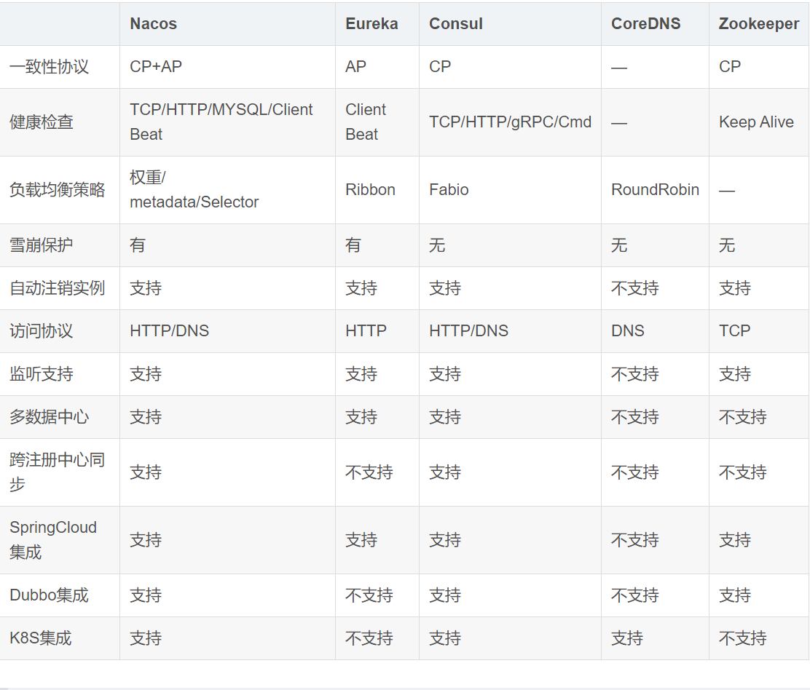
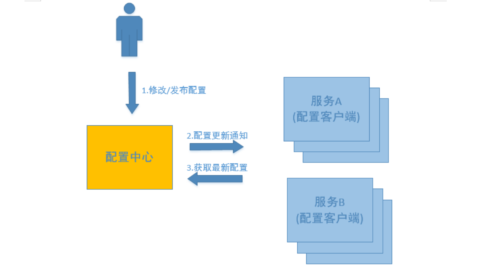
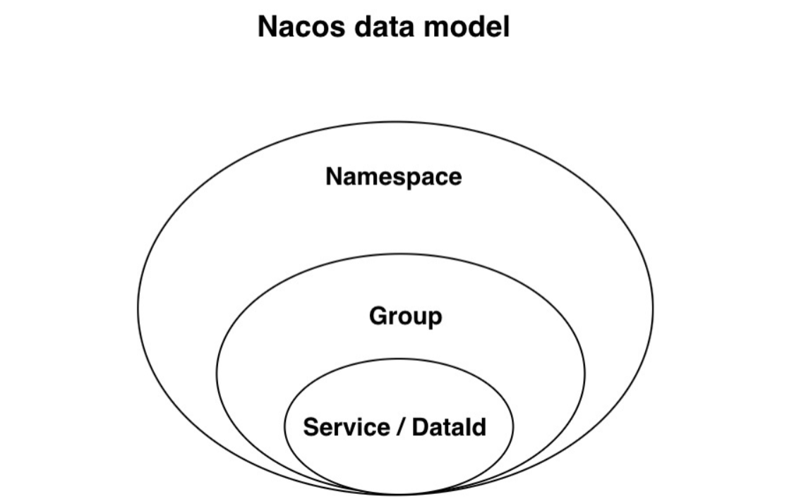
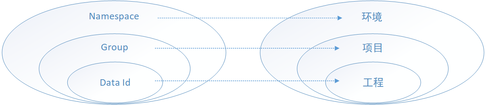
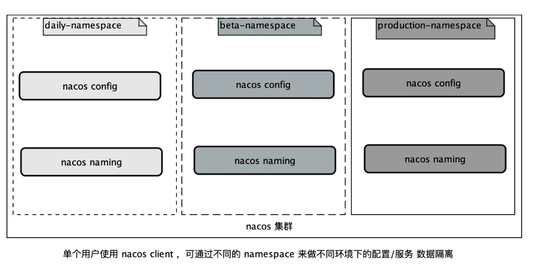
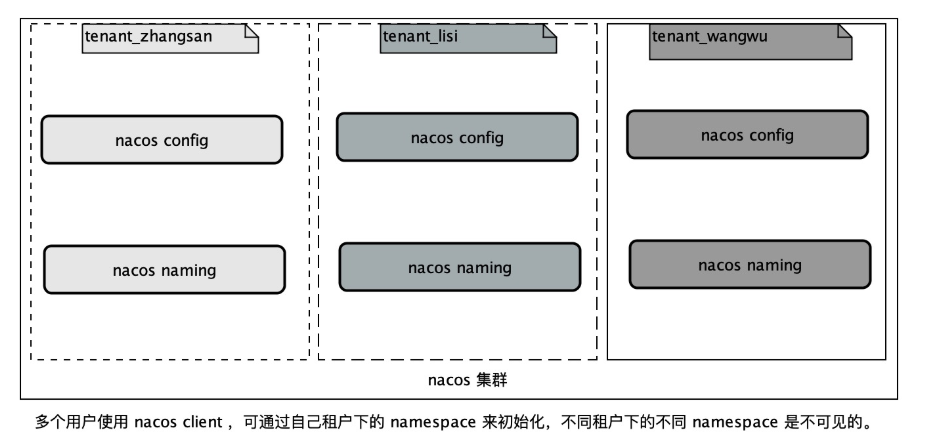

# Nacos

Nacos是阿里的一个开源产品，它是针对微服务架构中的服务发现、配置管理、服务治理的综合型解决方案。 

官方介绍是这样的：

Nacos 致力于帮助您发现、配置和管理微服务。Nacos 提供了一组简单易用的特性集，帮助您实现动态服务 发现、服务配置管理、服务及流量管理。 Nacos 帮助您更敏捷和容易地构建、交付和管理微服务平台。 Nacos 是构建以“服务”为中心的现代应用架构的服务基础设施。 

Nacos主要提供以下四大功能： 

1. **服务发现与服务健康检查** 

Nacos使服务更容易注册，并通过DNS或HTTP接口发现其他服务，Nacos还提供服务的实时健康检查，以防 止向不健康的主机或服务实例发送请求。 

2. **动态配置管理** 

动态配置服务允许您在所有环境中以集中和动态的方式管理所有服务的配置。Nacos消除了在更新配置时重新 部署应用程序，这使配置的更改更加高效和灵活。 

3. **动态DNS服务**

Nacos提供基于DNS 协议的服务发现能力，旨在支持异构语言的服务发现，支持将注册在Nacos上的服务以 域名的方式暴露端点，让三方应用方便的查阅及发现。 

4. **服务和元数据管理** 

Nacos 能让您从微服务平台建设的视角管理数据中心的所有服务及元数据，包括管理服务的描述、生命周 期、服务的静态依赖分析、服务的健康状态、服务的流量管理、路由及安全策略。 

## Nacos Server 部署

## Nacos 作为注册中心

管理所有微服务、解决微服务之间调用关系错综复杂、难以维护的问题；

### 核心功能

**服务注册**：Nacos Client会通过发送REST请求的方式向Nacos Server注册自己的服务，提供自身的元数据，比如ip地

址、端口等信息。Nacos Server接收到注册请求后，就会把这些元数据信息存储在一个双层的内存Map中。

**服务心跳**：在服务注册后，Nacos Client会维护一个定时心跳来持续通知Nacos Server，说明服务一直处于可用状态，防

止被剔除。默认5s发送一次心跳。

**服务同步**：Nacos Server集群之间会互相同步服务实例，用来保证服务信息的一致性。 leader  raft  

**服务发现**：服务消费者（Nacos Client）在调用服务提供者的服务时，会发送一个REST请求给Nacos Server，获取上面

注册的服务清单，并且缓存在Nacos Client本地，同时会在Nacos Client本地开启一个定时任务定时拉取服务端最新的注

册表信息更新到本地缓存

**服务健康检查**：Nacos Server会开启一个定时任务用来检查注册服务实例的健康情况，对于超过15s没有收到客户端心跳

的实例会将它的healthy属性置为false(客户端服务发现时不会发现)，如果某个实例超过30秒没有收到心跳，直接剔除该

实例(被剔除的实例如果恢复发送心跳则会重新注册）


### 主流的注册中心

CAP  C 一致性 A可用性 P 分区容错性




### Nacos使用

#### 引入依赖

在父POM中配置依赖管理

```xml
<dependencyManagement>
    <dependencies>
        <dependency>
            <groupId>org.springframework.cloud</groupId>
            <artifactId>spring-cloud-dependencies</artifactId>
            <version>${spring.cloud.version}</version>
            <type>pom</type>
            <scope>import</scope>
        </dependency>
        <dependency>
            <groupId>com.alibaba.cloud</groupId>
            <artifactId>spring-cloud-alibaba-dependencies</artifactId>
            <version>${spring.cloud.alibaba.version}</version>
            <type>pom</type>
            <scope>import</scope>
        </dependency>
    </dependencies>
</dependencyManagement>
```

在子POM中引入依赖

```xml
<dependency>
    <groupId>com.alibaba.cloud</groupId>
    <artifactId>spring-cloud-starter-alibaba-nacos-discovery</artifactId>
</dependency>
```

添加一些必须的配置

```properties
server.port=8002
#微服务名称
spring.application.name=service‐user
#配置 Nacos server 的地址
spring.cloud.nacos.discovery.server‐addr=localhost:8848
```

启动应用，既可以完成注册了。

### 注册中心配置详解


## Nacos作为配置中心

### 什么是配置中心

在微服务架构中，当系统从一个单体应用，被拆分成分布式系统上一个个服务节点后，配置文件也必须跟着迁移 （分割），这样配置就分散了，不仅如此，分散中还包含着冗余，如下图：


下图显示了配置中心的功能，配置中心将配置从各应用中剥离出来，对配置进行统一管理，应用自身不需要自己去 管理配置。



配置中心的服务流程如下： 

1、用户在配置中心更新配置信息。 

2、服务A和服务B及时得到配置更新通知，从配置中心获取配置。 

**总得来说，配置中心就是一种统一管理各种应用配置的基础服务组件。** 

在系统架构中，配置中心是整个微服务基础架构体系中的一个组件，如下图，它的功能看上去并不起眼，无非就是 配置的管理和存取，但它是整个微服务架构中不可或缺的一环。


**总结一下，**

在传统巨型单体应用纷纷转向细粒度微服务架构的历史进程中，配置中心是微服务化不可缺少的一个系 统组件，在这种背景下中心化的配置服务即配置中心应运而生，一个合格的配置中心需要满足如下特性： 

- 配置项容易读取和修改 

- 分布式环境下应用配置的可管理性，即提供远程管理配置的能力 

- 支持对配置的修改的检视以把控风险 

- 可以查看配置修改的历史记录 

- 不同部署环境下应用配置的隔离性 

### Nacos配置管理基础

#### Nacos配置管理模型

对于Nacos配置管理，通过Namespace、group、Data ID能够定位到一个配置集。



- 配置集(Data ID)

在系统中，一个配置文件通常就是一个配置集，一个配置集可以包含了系统的各种配置信息，例如，一个配置集可 能包含了数据源、线程池、日志级别等配置项。每个配置集都可以定义一个有意义的名称，就是配置集的ID即Data ID。

- 配置分组(Group)

配置分组是对配置集进行分组，通过一个有意义的字符串（如 Buy 或 Trade ）来表示，不同的配置分组下可以有 相同的配置集（Data ID）。当您在 Nacos 上创建一个配置时，如果未填写配置分组的名称，则配置分组的名称默 认采用 DEFAULT_GROUP 。配置分组的常见场景：可用于区分不同的项目或应用，例如：学生管理系统的配置集 可以定义一个group为：STUDENT_GROUP。 

- 命名空间(Namespace)

命名空间（namespace）可用于进行不同环境的配置隔离。例如可以隔离开发环境、测试环境和生产环境，因为 它们的配置可能各不相同，或者是隔离不同的用户，不同的开发人员使用同一个nacos管理各自的配置，可通过 namespace隔离。不同的命名空间下，可以存在相同名称的配置分组(Group) 或 配置集。

- 配置项

配置集中包含的一个个配置内容就是配置项。它代表一个具体的可配置的参数与其值域，通常以 key=value 的形 式存在。例如我们常配置系统的日志输出级别（logLevel=INFO|WARN|ERROR） 就是一个配置项。 


##### 最佳实践

Nacos抽象定义了Namespace、Group、Data ID的概念，具体这几个概念代表什么，取决于我们把它们看成什 么，这里推荐给大家一种用法，如下图：



Namespace：代表不同环境，如开发、测试、生产环境。 

Group：代表某项目，如XX医疗项目、XX电商项目 

DataId：每个项目下往往有若干个工程，每个配置集(DataId)是一个工程的主配置文件


##### 通过代码获取配置集

获取配置集需要指定： 

1、nacos服务地址，必须指定 

2、namespace，如不指定默认public 

3、group，如不指定默认 DEFAULT_GROUP 

4、dataId，必须指定 

代码如下： 

```java
// 初始化配置服务， 
String serverAddr = "127.0.0.1:8848"; 
String namespace = "ee247dde‐d838‐425c‐b371‐029dab26232f"; //开发环境 
String group = "DEFAULT_GROUP"; //默认组 
String dataId = "nacos‐simple‐demo.yaml"; 
Properties properties = new Properties(); 
properties.put("serverAddr", serverAddr); 
properties.put("namespace", namespace); 
ConfigService configService = NacosFactory.createConfigService(properties);
// 获取配置，并输出控制台 
String content = configService.getConfig(dataId, group, 5000); System.out.println(content);
```

以上代码说明将从地址为127.0.0.1:8848的nacos配置中心获取配置，通过以下信息定位配置集： 

namespace：ee247dde-d838-425c-b371-029dab26232f 

**注意：namespace需要指定id。** 

group：DEFAULT_GROUP 

Data Id：nacos-simple-demo.yaml


#### 命名空间管理

##### namespace 隔离设计 

namespace 的设计是 nacos 基于此做多环境以及多租户（多个用户共同使用nacos）数据(**配置和服务**)隔离的。

从一个租户(用户)的角度来看，如果有多套不同的环境，那么这个时候可以根据指定的环境来创建不同的 namespce，以此来实现多环境的隔离。例如，你可能有开发，测试和生产三个不同的环境，那么使用一套 nacos 集群可以分别建以下三个不同的 namespace。如下图所示： 



从多个租户(用户)的角度来看，每个租户(用户)可能会有自己的 namespace,每个租户(用户)的配置数据以及注 册的服务数据都会归属到自己的 namespace 下，以此来实现多租户间的数据隔离。例如超级管理员分配了三 个租户，分别为张三、李四和王五。分配好了之后，各租户用自己的账户名和密码登录后，创建自己的命名 空间。如下图所示：



##### 命名空间管理

这里就是从页面操作，没啥好说的。


## SpringBoot集成Nacos

### 引入依赖


```xml
<properties>
    <spring-boot.version>2.3.7.RELEASE</spring-boot.version>
</properties>

<dependencies>
    <!--整合nacos config-->
    <dependency>
        <groupId>com.alibaba.cloud</groupId>
        <artifactId>spring-cloud-starter-alibaba-nacos-config</artifactId>
    </dependency>
</dependencies>

<dependencyManagement>
    <dependencies>
        <dependency>
            <groupId>org.springframework.boot</groupId>
            <artifactId>spring-boot-dependencies</artifactId>
            <version>${spring-boot.version}</version>
            <type>pom</type>
            <scope>import</scope>
        </dependency>
        <!--整合spring cloud-->
        <dependency>
            <groupId>org.springframework.cloud</groupId>
            <artifactId>spring-cloud-dependencies</artifactId>
            <version>Hoxton.SR8</version>
            <type>pom</type>
            <scope>import</scope>
        </dependency>
        <!--整合spring cloud alibaba-->
        <dependency>
            <groupId>com.alibaba.cloud</groupId>
            <artifactId>spring-cloud-alibaba-dependencies</artifactId>
            <version>2.2.5.RELEASE</version>
            <type>pom</type>
            <scope>import</scope>
        </dependency>
    </dependencies>
</dependencyManagement>
```

### 添加配置

在bootstrap.yml中配置Nacos-server的地址

```yaml
server:
  port: 9001

spring:
  application:
    name: config1 # 配置名，即Nacos dashboard中的Data id
  cloud:
    nacos:
      config:
        server-addr: 127.0.0.1:8848 # 配置中心地址，集群的话多个节点使用,分隔
        file-extension: yaml # 配置的后缀名
        namespace: 2c38da96-f654-4105-bbc0-63befaa449f0 # 命名空间ID
        group: DEFAULT_GROUP # 指定要获取配置的组
```

### 测试

随便写个Controller，用`@Value`等注解或`ConfigurableApplicationContext`获取配置信息。

```java
import javax.annotation.Resource;

import org.springframework.beans.factory.annotation.Value;
import org.springframework.cloud.context.config.annotation.RefreshScope;
import org.springframework.context.ConfigurableApplicationContext;
import org.springframework.web.bind.annotation.GetMapping;
import org.springframework.web.bind.annotation.RestController;

/**
 * @author zhouxin
 * @RefreshScope 动态加载配置
 **/
@RefreshScope
@RestController
public class NacosServerController {

    @Resource
    private ConfigurableApplicationContext configurableApplicationContext;

    /**
     * 可用于验证本服务配置文件和extension-configs之间的优先级
     */
    @Value("${student.name:null}")
    private String name;

    /**
     * 如果只是通过@Value获得的配置信息，不会随着Nacos的修改操作而获得最新配置信息。那么，实时获取最新配置信息有两种方式：
     * 方式1：添加@RefreshScope注解。
     * 方式2：通过getProperty的方式，获得最新的配置信息。
     *
     * @return
     */
    @GetMapping("/name")
    public String getName() {
        String name1 = configurableApplicationContext.getEnvironment().getProperty("student.name");
        return String.format("name=%s <br> name1=%s", name, name1);
    }
}
```


## 应用配置共享

Nacos提供两种应用间共享配置的方式：扩展DataId（`extension-configs`）、共享DataId（`shared-configs`）；另外需共享的`DataId，yaml后缀不能少`，且目前只支持yaml/[properties](https://so.csdn.net/so/search?q=properties&spm=1001.2101.3001.7020)。


### 扩展Data Id配置

Spring Cloud Alibaba Nacos Config 从 0.2.1 版本后，可支持自定义扩展Data Id 配置，特性如下：

1、支持多个 Data Id 的配置；

通过 spring.cloud.nacos.config.extension-configs[n].data-id的配置方式

2、可以自定义Data Id 所在的组，不明确配置的话，默认是 DEFAULT_GROUP；

通过 spring.cloud.nacos.config.extension-configs[n].group 的配置方式

3、当某个Data Id 的配置变更时，自定义应用中是否动态刷新配置值，默认为否；

通过 spring.cloud.nacos.config.extension-configs[n].refresh 的配置方式


使用：

```yaml
spring:
  cloud:
    nacos:
      config:
        # 使用extension-configs[n]，配置加载多个dataId
        extension-configs:
          - data-id: config4.yaml
            group: CONFIG4_GROUP
            refresh: true  # 动态刷新配置
          - data-id: config5.yaml
            group: DEFAULT_GROUP
            refresh: true  # 动态刷新配置
```

controller中引入只存在于config4.yaml和config5.yaml中的配置：

```java
@Value("${config4.name:null}")
private String config4Name;

@Value("${config5.name:null}")
private String config5Name;

@GetMapping("/allname")
public String getAllName() {
    return String.format("config4Name=%s <br> config5Name=%s", config4Name, config5Name);
}
```

### 共享Data Id配置

为了更加清晰的在多个应用间配置共享的 Data Id ，也可以通过以下的方式来配置：

1、支持多个 Data Id 的配置；

通过 spring.cloud.nacos.config.shared-configs[n].data-id的配置方式

2、可以自定义Data Id 所在的组，不明确配置的话，默认是 DEFAULT_GROUP；

通过 spring.cloud.nacos.config.shared-configs[n].group 的配置方式

3、当某个Data Id 的配置变更时，自定义应用中是否动态刷新配置值，默认为否；

通过 spring.cloud.nacos.config.shared-configs[n].refresh 的配置方式

使用：
（1）bootstrap.yml文件中增加如下配置：

```
spring:
  cloud:
    nacos:
      config:
        # 使用shared-config[n]，配置加载多个dataId
        shared-configs:
          - data-id: config2.yaml
            group: DEFAULT_GROUP
            refresh: true  # 动态刷新配置
          - data-id: config3.yaml
            group: DEFAULT_GROUP
            refresh: true  # 动态刷新配置
```

controller中引入只存在于config2.yaml和config3.yaml中的配置：

```yaml
@Value("${config2.name:null}")
private String config2Name;

@Value("${config3.name:null}")
private String config3Name;

@GetMapping("/allname")
public String getAllName() {
    return String.format("config2Name=%s <br> config3Name=%s", config2Name, config3Name);
}
```

### 扩展的配置文件加载优先级

Spring Cloud Alibaba Nacos Config 目前提供了三种配置能力从 Nacos 拉取相关的配置；

https://blog.csdn.net/Saintmm/article/details/121791892
