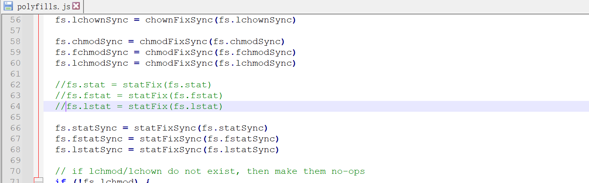

## gitbook 安装及使用

### gitbook的安装


首先需要安装Nodejs，这里直接安装v12.22.1版本，其他版本在安装nodejs的过程中有错误，避免入坑

[nodejs](https://nodejs.org/zh-cn/download/releases/)的所有历史版本可以在这里下载

> https://nodejs.org/zh-cn/download/releases/

下载后解压缩，配置环境变量即可

```shell
λ node -v
v12.22.1
```

nodejs需要配置国内的源，要不然安装包的时候真的是费劲

```shell
npm config set registry https://registry.npm.taobao.org   #设置国内源
npm config get registry #查看源
```

配置好源之后，就可以安装gitbook了

```shell
λ npm install gitbook-cli -g
C:\Program Files\nodejs\node-v12.22.1\gitbook -> C:\Program Files\nodejs\node-v12.22.1\node_modules\gitbook-cli\bin\gitbook.js
+ gitbook-cli@2.3.2
added 578 packages from 672 contributors in 31.412s
```

查看gitbook的版本

```shell
λ gitbook -V
CLI version: 2.3.2
GitBook version: 3.2.3
```


### gitbook的使用

首先需要初始化一个目录。在windows下新建一个文件夹，通过命令行cd到该文件夹下，然后执行以下命令

```shell
gitbook init
```

执行结果

```shell
λ gitbook init
warn: no summary file in this book
info: create README.md
info: create SUMMARY.md
info: initialization is finished
```

目录中会自动生成两个文件，其中README.md是说明文件，SUMMARY.md是目录文件。

#### 编写SUMMARY文件

GitBook使用一个`SUMMARY.md`文件来定义文档的菜单。

虽说在官方文档中，它是可选的，但是它相当重要，控制了左边菜单栏的显示内容。

它通过 Markdown 中的列表语法来表示文件的父子关系。

紧凑型的

```
# Summary
* [Introduction](README.md)
* [Part I](part1/README.md)
    * [Writing is nice](part1/writing.md)
    * [GitBook is nice](part1/gitbook.md)
* [Part II](part2/README.md)
    * [We love feedback](part2/feedback_please.md)
    * [Better tools for authors](part2/better_tools.md)
```

分散型的

也可以通过使用 标题 或者 水平分割线 标志将 GitBook 分为几个不同的部分。

你看到左侧菜单栏的部分 `SUMMARY.md`文件

```
# Summary

### Part I

* [Part I](part1/README.md)
    * [Writing is nice](part1/README.md#writing)
    * [GitBook is nice](part1/README.md#gitbook)
* [Part II](part2/README.md)
    * [We love feedback](part2/README.md#feedback)
    * [Better tools for authors](part2/README.md#tools)

### Part II

* [feedback](part2/feedback.md)
* [tools](part2/tools.md)

----

* [Last part](part3/last.md)
```

编写完summary文件之后再次执行命令

```
gitbook init
```

就会生成相应的文件了。

如下：

```shell
λ gitbook init
info: create java/README.md
info: create java/collection.md
info: create java/collection/list.md
info: create java/concurrent.md
info: create spring/README.md
info: create mybatis/README.md
info: create SUMMARY.md
info: initialization is finished
```


### 生成静态网页

将会在`gitbook_test`目录下生成一个`_book`文件夹，这就是我们的一个静态站点

```
gitbook build
```

编译完成后，我么可以启动一个服务，来预览我们的笔记

```
gitbook serve
```


### 生成PDF

在生成pdf之前需要安装一个软件，从一下连接下载，选择自己合适的

```
https://calibre-ebook.com/
```

我安装的版本是5.16.1，目前没有遇到问题

安装完成后，通过如下命令生成pdf

```
λ gitbook pdf ./ ./note.pdf
```

执行结果如下

```
λ gitbook pdf ./ ./note.pdf
info: 7 plugins are installed
info: 6 explicitly listed
info: loading plugin "highlight"... OK
info: loading plugin "search"... OK
info: loading plugin "lunr"... OK
info: loading plugin "sharing"... OK
info: loading plugin "fontsettings"... OK
info: loading plugin "theme-default"... OK
info: found 10 pages
info: found 221 asset files
info: >> generation finished with success in 32.9s !
info: >> 1 file(s) generated
```


### 安装使用过程中出现的错误


这个直接把polyfills.js中62行到64行的代码注释掉即可

如下：

